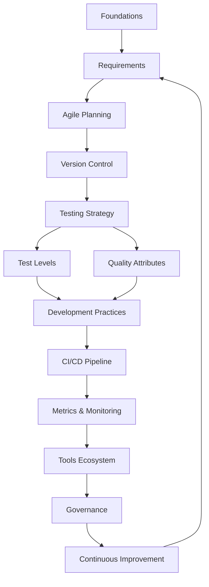

# Code Quality Documentation Project - Aligned with Industry Best Practices

## 🎯 Core Alignment Principles

- **ISO 25010** - Software Quality Model
- **IEEE 829** - Test Documentation Standards
- **ISTQB** - Testing Best Practices
- **Agile Manifesto** - Agile Principles
- **DevOps Research (DORA)** - Performance Metrics
- **OWASP** - Security Standards
- **WCAG 2.1** - Accessibility Guidelines

## 📁 Project Structure (Following Documentation Best Practices)

```
/CodeQuality
├── README.md                      # Start here - Learning path
├── MANIFESTO.md                   # Our values and principles
├── PHILOSOPHY.md                  # Theoretical foundation
├── CONTRIBUTING.md                # How to contribute/maintain
├── /docs
│   ├── 00-foundations/            # Prerequisites and basics
│   │   ├── README.md
│   │   ├── software-quality-models.md
│   │   └── industry-standards.md
│   ├── 01-requirements/           # Requirements Engineering
│   │   ├── README.md
│   │   ├── elicitation-techniques.md
│   │   ├── user-story-mapping.md
│   │   ├── acceptance-criteria.md
│   │   └── vertical-slicing.md
│   ├── 02-agile-planning/         # Agile Artifacts
│   │   ├── README.md
│   │   ├── definition-of-ready.md
│   │   ├── definition-of-done.md
│   │   ├── estimation-techniques.md
│   │   └── invest-criteria.md
│   ├── 03-version-control/        # GitFlow & Branching
│   │   ├── README.md
│   │   ├── gitflow-methodology.md
│   │   ├── commit-conventions.md
│   │   ├── pull-request-guidelines.md
│   │   └── code-review-checklist.md
│   ├── 04-testing-strategy/       # Complete Testing Approach
│   │   ├── README.md
│   │   ├── testing-pyramid.md
│   │   ├── shift-left-approach.md
│   │   ├── shift-right-approach.md
│   │   └── test-automation-strategy.md
│   ├── 05-test-levels/            # Testing Types
│   │   ├── README.md
│   │   ├── unit-testing.md
│   │   ├── integration-testing.md
│   │   ├── system-testing.md
│   │   ├── acceptance-testing.md
│   │   ├── contract-testing.md
│   │   └── e2e-testing.md
│   ├── 06-quality-attributes/     # Non-Functional
│   │   ├── README.md
│   │   ├── performance-testing.md
│   │   ├── security-testing.md
│   │   ├── accessibility-testing.md
│   │   ├── usability-testing.md
│   │   └── reliability-testing.md
│   ├── 07-development-practices/  # Clean Code & Design
│   │   ├── README.md
│   │   ├── clean-code-principles.md
│   │   ├── solid-principles.md
│   │   ├── design-patterns.md
│   │   ├── tdd-bdd-approach.md
│   │   └── pair-programming.md
│   ├── 08-cicd-pipeline/          # Automation
│   │   ├── README.md
│   │   ├── pipeline-stages.md
│   │   ├── build-automation.md
│   │   ├── deployment-strategies.md
│   │   ├── rollback-procedures.md
│   │   └── infrastructure-as-code.md
│   ├── 09-metrics-monitoring/     # Measurements
│   │   ├── README.md
│   │   ├── dora-metrics.md
│   │   ├── code-quality-metrics.md
│   │   ├── test-metrics.md
│   │   ├── agile-metrics.md
│   │   ├── performance-metrics.md
│   │   ├── security-metrics.md
│   │   └── business-metrics.md
│   ├── 10-tools-ecosystem/        # Toolchain
│   │   ├── README.md
│   │   ├── ide-setup.md
│   │   ├── static-analysis-tools.md
│   │   ├── testing-frameworks.md
│   │   ├── cicd-platforms.md
│   │   ├── monitoring-tools.md
│   │   └── collaboration-tools.md
│   ├── 11-governance/             # Quality Gates
│   │   ├── README.md
│   │   ├── quality-gates.md
│   │   ├── compliance-requirements.md
│   │   ├── audit-trails.md
│   │   └── risk-management.md
│   └── 12-continuous-improvement/ # Kaizen
│       ├── README.md
│       ├── retrospectives.md
│       ├── root-cause-analysis.md
│       ├── lessons-learned.md
│       └── innovation-time.md
├── /templates
│   ├── user-story.md
│   ├── test-plan-ieee829.md
│   ├── bug-report.md
│   ├── definition-of-done.md
│   ├── code-review-checklist.md
│   ├── pipeline-template.yaml
│   ├── metrics-dashboard.json
│   └── retrospective-template.md
├── /examples
│   ├── /unit-tests
│   ├── /integration-tests
│   ├── /e2e-tests
│   ├── /ci-pipelines
│   └── /monitoring-configs
├── /resources
│   ├── glossary.md
│   ├── acronyms.md
│   ├── recommended-books.md
│   ├── online-courses.md
│   ├── certifications.md
│   └── industry-reports.md
└── /workshops
    ├── 01-requirements-workshop.md
    ├── 02-tdd-kata.md
    ├── 03-pipeline-setup.md
    └── 04-metrics-analysis.md
```

## 🔄 Logical Flow & Dependencies



## 📚 Key Industry Alignments

### 1. Requirements & Planning (Aligns with)
- **IEEE 830** - Software Requirements Specification
- **IREB** - Requirements Engineering standards
- **SAFe** - Scaled Agile Framework
- **Scrum Guide** - Official Scrum practices

### 2. Testing (Aligns with)
- **ISTQB Syllabus** - Testing fundamentals
- **IEEE 829** - Test documentation
- **ISO/IEC 25010** - Quality characteristics
- **Google Testing Blog** - Modern practices

### 3. Development (Aligns with)
- **Clean Code** - Robert Martin's principles
- **SOLID** - Object-oriented design
- **12-Factor App** - Cloud-native practices
- **DRY/KISS/YAGNI** - Core principles

### 4. CI/CD (Aligns with)
- **DevOps Handbook** - Best practices
- **Continuous Delivery** - Jez Humble's principles
- **GitFlow/GitHub Flow** - Branching strategies
- **SemVer** - Semantic versioning

### 5. Metrics (Aligns with)
- **DORA State of DevOps** - Industry benchmarks
- **GQM** - Goal Question Metric paradigm
- **Accelerate** - Scientific approach
- **SRE Book** - Google's practices

### 6. Security (Aligns with)
- **OWASP Top 10** - Security risks
- **NIST Cybersecurity Framework**
- **ISO 27001** - Information security
- **DevSecOps** - Security integration

## 📋 Document Standards

Each document will follow:
1. **Purpose** - Why this matters
2. **Context** - When to apply
3. **Prerequisites** - What you need to know
4. **Content** - The actual information
5. **Examples** - Real-world applications
6. **Checklist** - Action items
7. **References** - Sources and further reading
8. **Related** - Links to connected topics

## ✅ Quality Checks for Documentation

- **Accuracy**: Verified against industry standards
- **Completeness**: Covers all essential aspects
- **Clarity**: Simple language, clear examples
- **Consistency**: Unified terminology and format
- **Practical**: Actionable, not just theoretical
- **Current**: Updated with latest practices (2024)
- **Traceable**: Sources cited, standards referenced

## 🎯 Success Criteria

The documentation will be considered complete when:
1. All modules have README with navigation
2. Each topic includes practical examples
3. Templates are immediately usable
4. Metrics have clear formulas and targets
5. Tools have comparison matrices
6. Processes have step-by-step guides
7. Everything links to industry standards
8. Cross-references are complete
9. Glossary covers all technical terms
10. Review by industry practices checklist passes

## 🚦 Implementation Order (Logical Dependencies)

### Week 1: Foundation & Framework
- Manifesto & Philosophy (sets the tone)
- Foundations (prerequisites)
- Requirements (where quality starts)
- Agile Planning (how we organize work)

### Week 2: Development & Testing Core
- Version Control (collaboration foundation)
- Testing Strategy (quality assurance approach)
- Test Levels (detailed testing types)
- Development Practices (how we code)

### Week 3: Automation & Measurement
- CI/CD Pipeline (automation framework)
- Metrics & Monitoring (measurement system)
- Quality Attributes (non-functional requirements)

### Week 4: Governance & Improvement
- Tools Ecosystem (implementation details)
- Governance (quality gates)
- Continuous Improvement (feedback loops)
- Final review and alignment check

## 🏆 This Structure Ensures

- **Logical progression** from business to technical
- **Clear dependencies** between topics
- **Industry alignment** with recognized standards
- **Practical application** through examples
- **Measurable outcomes** via metrics
- **Continuous improvement** built-in

---

**Ready to begin?** Start with the [Manifesto](MANIFESTO.md) to understand our core values, then proceed to [Foundations](docs/00-foundations/README.md) for the technical groundwork.