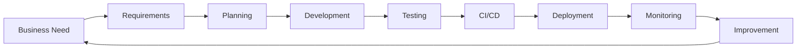

# Code Quality Process - Complete Guide

## 🎯 Purpose
A comprehensive guide to mastering the entire code quality process, from business requirements to production deployment, following industry best practices and standards.

## 📚 Learning Path

### Start Here
1. [**Manifesto**](MANIFESTO.md) - Our core values and principles
2. [**Philosophy**](PHILOSOPHY.md) - Theoretical foundation and mindsets
3. [**Foundations**](docs/00-foundations/README.md) - Prerequisites and industry standards

### Core Process Flow

## 📖 Documentation Modules

### Foundation Layer
- **[00 - Foundations](docs/00-foundations/README.md)** - Software quality models, industry standards
- **[01 - Requirements Engineering](docs/01-requirements/README.md)** - From business needs to technical specs
- **[02 - Agile Planning](docs/02-agile-planning/README.md)** - User stories, DoR, DoD, estimation

### Development Layer
- **[03 - Version Control](docs/03-version-control/README.md)** - GitFlow, branching, code reviews
  - **[CI/CD Best Practices](docs/03-version-control/cicd-best-practices/README.md)** - TBD, GitHub Flow, GitLab Flow for CI/CD
- **[04 - Testing Strategy](docs/04-testing-strategy/README.md)** - Shift-left, shift-right approaches
- **[05 - Test Levels](docs/05-test-levels/README.md)** - Unit, integration, system, E2E testing
- **[06 - Quality Attributes](docs/06-quality-attributes/README.md)** - Performance, security, accessibility
- **[07 - Development Practices](docs/07-development-practices/README.md)** - Clean code, SOLID, TDD/BDD

### Automation Layer
- **[08 - CI/CD Pipeline](docs/08-cicd-pipeline/README.md)** - Build, test, deploy automation
- **[09 - Metrics & Monitoring](docs/09-metrics-monitoring/README.md)** - DORA metrics, dashboards
- **[10 - Deployment](docs/10-deployment/README.md)** - Blue-green, canary, rolling deployments

### Governance Layer
- **[11 - Tools Ecosystem](docs/11-tools-ecosystem/README.md)** - Tool selection and integration
- **[12 - Governance](docs/12-governance/README.md)** - Quality gates, compliance, risk management
- **[13 - Incident Management](docs/13-incident-management/README.md)** - Incident response, runbooks, postmortems
- **[14 - Continuous Improvement](docs/14-continuous-improvement/README.md)** - Retrospectives, Kaizen

### AI & Innovation Layer
- **[15 - AI in Quality Assurance](docs/15-ai-in-quality-assurance/15-README.md)** - AI-powered testing, predictive analytics, custom LLM+RAG assistants
  - **[AI Fundamentals](docs/15-ai-in-quality-assurance/ai-fundamentals.md)** - LLMs, RAG, embeddings, prompt engineering
  - **[AI-Assisted Testing](docs/15-ai-in-quality-assurance/ai-assisted-testing.md)** - Automated test generation and enhancement
  - **[AI Metrics & Analytics](docs/15-ai-in-quality-assurance/ai-metrics-analytics.md)** - Predictive defect detection, anomaly detection
  - **[Building AI QA Assistant](docs/15-ai-in-quality-assurance/building-ai-qa-assistant.md)** - Complete LLM+RAG implementation guide
  - **[Implementation Roadmap](docs/15-ai-in-quality-assurance/implementation-roadmap.md)** - Phased AI adoption strategy

## 📊 Key Metrics Overview

### DORA Metrics
| Metric | Elite Performers | Target |
|--------|-----------------|--------|
| Deployment Frequency | Multiple/day | Daily |
| Lead Time for Changes | < 1 hour | < 1 day |
| MTTR | < 1 hour | < 4 hours |
| Change Failure Rate | 0-15% | < 10% |

### Quality Metrics
| Metric | Target | Measurement |
|--------|--------|-------------|
| Code Coverage | > 80% | Lines covered / Total lines |
| Cyclomatic Complexity | < 10 | Per method |
| Technical Debt Ratio | < 5% | Remediation cost / Dev cost |
| Defect Density | < 1/KLOC | Defects / 1000 lines |

## 🛠️ Templates & Tools

### Templates (15 Production-Ready Templates)
- [User Story Template](templates/user-story.md)
- [Definition of Ready](templates/definition-of-ready.md)
- [Definition of Done](templates/definition-of-done.md)
- [Acceptance Criteria Template](templates/acceptance-criteria-template.md)
- [Test Case Template (IEEE 829)](templates/test-case-template.md)
- [Test Plan (IEEE 829)](templates/test-plan-ieee829.md)
- [Code Review Checklist](templates/code-review-checklist.md)
- [Pull Request Template](templates/pull-request-template.md)
- [API Contract (OpenAPI 3.0)](templates/api-contract-template.yaml)
- [Performance Test Plan](templates/performance-test-plan.md)
- [Security Test Checklist (OWASP)](templates/security-test-checklist.md)
- [Accessibility Checklist (WCAG 2.1)](templates/accessibility-checklist.md)
- [Postmortem Template](templates/postmortem-template.md)
- [Runbook Template](templates/runbook-template.md)
- [CI/CD Pipeline Template](templates/pipeline-template.yaml)

### Examples (17 Comprehensive Example Directories)
- [Unit Test Examples](examples/unit-tests/) - Jest, Vitest, mutation testing
- [Integration Tests](examples/integration-tests/) - API testing, database integration
- [API Testing](examples/api-testing/) - Supertest, GraphQL, Pact, performance (9 files, 4,500+ lines)
- [E2E Test Suites](examples/e2e-tests/) - Cypress, Playwright automation
- [Component Testing](examples/component-testing/) - React Testing Library, Vue Test Utils
- [Contract Testing](examples/contract-testing/) - Pact consumer/provider, OpenAPI validation
- [Visual Testing](examples/visual-testing/) - Percy, Chromatic, BackstopJS, Playwright (8 files)
- [Load Testing](examples/load-testing/) - k6, JMeter, Artillery, Gatling (11 files)
- [Accessibility Testing](examples/accessibility-testing/) - axe-core, Pa11y, Lighthouse, WCAG 2.1 (13 files)
- [Microservices Testing](examples/microservices-testing/) - Pact contracts, chaos engineering (9 files)
- [Manual Testing](examples/manual-testing/) - Test cases, checklists, test plans
- [Exploratory Testing](examples/exploratory-testing/) - Session charters, heuristics, reporting
- [Version Control & CI/CD](examples/version-control/) - TBD, GitHub Flow, GitLab Flow pipelines with feature flags
- [CI/CD Pipelines](examples/ci-pipelines/) - GitHub Actions, GitLab CI, Jenkins
- [Deployment Strategies](examples/deployment/) - Blue-Green, Canary, Rolling, Terraform (10 files)
- [Incident Response](examples/incident-response/) - Runbooks, postmortems, SLI/SLO (10 files)
- [Monitoring Configs](examples/monitoring-configs/) - Prometheus, Grafana, alerting

## 📚 Resources (6 Reference Files)
- [Glossary](resources/glossary.md) - Technical terms explained
- [Acronyms](resources/acronyms.md) - Common abbreviations
- [Recommended Books](resources/recommended-books.md) - Essential reading
- [Online Courses](resources/online-courses.md) - Learning platforms
- [Certifications](resources/certifications.md) - Professional credentials
- [Industry Reports](resources/industry-reports.md) - DORA State of DevOps, testing reports

## 🎯 Quick Start Guide

### For Developers
1. Start with [Development Practices](docs/07-development-practices/README.md)
2. Review [Test Levels](docs/05-test-levels/README.md)
3. Study [Version Control](docs/03-version-control/README.md)

### For QA Engineers
1. Begin with [Testing Strategy](docs/04-testing-strategy/README.md)
2. Practice with [Testing Examples](examples/) - All testing approaches
3. Explore [Quality Attributes](docs/06-quality-attributes/README.md)
4. Master [Metrics & Monitoring](docs/09-metrics-monitoring/README.md)
5. **NEW**: Leverage [AI in Quality Assurance](docs/15-ai-in-quality-assurance/15-README.md) for 10x productivity

### For DevOps Engineers
1. Review [Version Control CI/CD Best Practices](docs/03-version-control/cicd-best-practices/README.md)
2. Focus on [CI/CD Pipeline](docs/08-cicd-pipeline/README.md)
3. Implement [Tools Ecosystem](docs/10-tools-ecosystem/README.md)
4. Configure [Metrics & Monitoring](docs/09-metrics-monitoring/README.md)

### For Team Leads
1. Understand [Requirements Engineering](docs/01-requirements/README.md)
2. Implement [Agile Planning](docs/02-agile-planning/README.md)
3. Establish [Governance](docs/11-governance/README.md)

## 🏆 Industry Standards Alignment

This guide aligns with:
- **ISO/IEC 25010** - Software Quality Model
- **IEEE 829** - Test Documentation Standards
- **ISTQB** - Testing Best Practices
- **Agile Manifesto** - Agile Principles
- **DORA** - DevOps Performance Metrics
- **OWASP** - Security Standards
- **WCAG 2.1** - Accessibility Guidelines

## 📅 Implementation Roadmap

### Phase 1: Foundation (Week 1)
- [ ] Establish requirements process
- [ ] Define agile artifacts
- [ ] Set up version control
- [ ] Review testing examples and select approaches

### Phase 2: Quality Integration (Week 2)
- [ ] Implement testing strategy
- [ ] Set up unit and integration testing
- [ ] Define quality attributes
- [ ] Establish development practices

### Phase 3: Automation (Week 3)
- [ ] Build CI/CD pipeline with testing stages
- [ ] Implement E2E and contract testing
- [ ] Configure metrics and monitoring
- [ ] Select and integrate tools

### Phase 4: Optimization (Week 4)
- [ ] Add exploratory and manual testing processes
- [ ] Implement governance and quality gates
- [ ] Establish continuous improvement
- [ ] Review and refine all processes

## 🤝 Contributing
See [CONTRIBUTING.md](CONTRIBUTING.md) for guidelines on maintaining and extending this documentation.

## 📝 License
This documentation is created for educational purposes and follows industry best practices.

## 🔄 Version
**Version**: 2.0.0
**Last Updated**: October 2024 (AI Module Added)
**Next Review**: January 2025

---

> "Quality is not an act, it is a habit." - Aristotle

**Ready to begin?** Start with the [Manifesto](MANIFESTO.md) to understand our core values, then proceed to [Foundations](docs/00-foundations/README.md) for the technical groundwork.