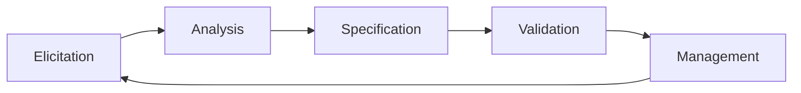
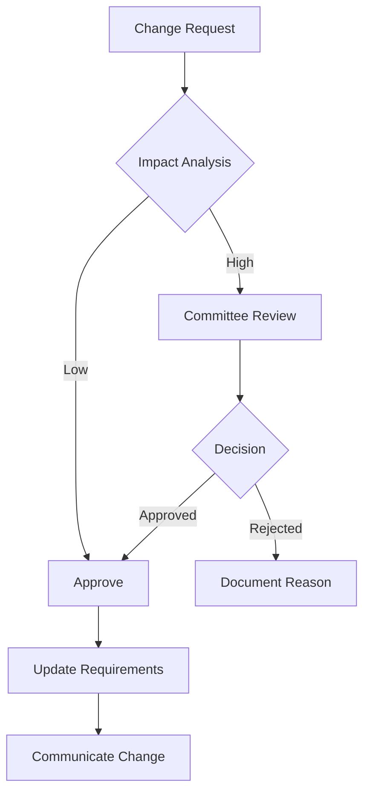

# Requirements Engineering

## Purpose

Transform business needs into clear, testable, and implementable technical requirements that serve as the foundation for quality software development.

## Context

Requirements engineering is where quality begins. Poor requirements lead to rework, missed deadlines, and unsatisfied users. This module covers the complete requirements lifecycle.

## Prerequisites

- Understanding of [Software Quality Foundations](../00-foundations/README.md)
- Basic knowledge of software development lifecycle
- Familiarity with stakeholder communication

## The Requirements Engineering Process



## 1. Requirements Elicitation

### Elicitation Techniques

#### Interviews

**When to Use:** Direct stakeholder access, complex domain
**Process:**

1. Prepare questions (open and closed)
2. Schedule with stakeholders
3. Conduct interview (record if possible)
4. Transcribe and analyze
5. Follow up for clarification

**Interview Template:**

```markdown
## Stakeholder Interview

**Date:** [Date]
**Stakeholder:** [Name, Role]
**Interviewer:** [Name]

### Business Context

- What problem are we solving?
- Who are the users?
- What's the business value?

### Functional Needs

- What must the system do?
- What are the key workflows?
- What are the critical features?

### Quality Attributes

- Performance expectations?
- Security requirements?
- Usability needs?

### Constraints

- Technical limitations?
- Budget/timeline?
- Regulatory requirements?

### Success Criteria

- How do we measure success?
- What are the acceptance criteria?
```

#### Workshops

**When to Use:** Multiple stakeholders, need consensus
**Techniques:**

- Joint Application Development (JAD)
- Requirements workshops
- Story mapping sessions
- Design thinking workshops

**Workshop Agenda Example:**

```
9:00 - 9:30   | Introduction & Goals
9:30 - 10:30  | Current State Analysis
10:30 - 10:45 | Break
10:45 - 12:00 | Future State Visioning
12:00 - 1:00  | Lunch
1:00 - 2:30   | Requirements Prioritization
2:30 - 2:45   | Break
2:45 - 4:00   | Action Items & Next Steps
```

#### Observation

**When to Use:** Complex workflows, existing system analysis
**Approach:**

- Shadow users in their environment
- Document actual vs. stated processes
- Identify pain points and inefficiencies
- Note workarounds and shortcuts

#### Questionnaires

**When to Use:** Large user base, quantitative data needed
**Best Practices:**

- Keep short (10-15 questions)
- Mix question types
- Pilot test first
- Provide clear instructions

#### Prototyping

**When to Use:** UI/UX requirements, validation needed
**Types:**

- Paper prototypes
- Wireframes
- Interactive mockups
- Proof of concepts

### Stakeholder Analysis

#### Stakeholder Matrix

| Stakeholder      | Interest | Influence | Strategy       |
| ---------------- | -------- | --------- | -------------- |
| End Users        | High     | Low       | Keep Informed  |
| Product Owner    | High     | High      | Manage Closely |
| Development Team | Medium   | High      | Keep Satisfied |
| Legal/Compliance | Low      | High      | Monitor        |
| Customer Support | High     | Medium    | Consult        |

#### RACI Matrix

| Activity             | Product Owner | Dev Team | QA  | Users |
| -------------------- | ------------- | -------- | --- | ----- |
| Define Requirements  | A             | C        | C   | I     |
| Approve Requirements | R             | I        | I   | C     |
| Implement            | I             | R        | C   | I     |
| Test                 | I             | C        | R   | C     |
| Accept               | R             | I        | I   | C     |

_R=Responsible, A=Accountable, C=Consulted, I=Informed_

## 2. Requirements Analysis

### Requirement Types

#### Functional Requirements

_What the system should do_

**Format:** "The system shall..."

**Examples:**

```
- The system shall allow users to log in using email and password
- The system shall send email notifications for order status changes
- The system shall calculate tax based on shipping address
```

#### Non-Functional Requirements (NFRs)

_How the system should behave_

**Categories:**

- **Performance**: Response time, throughput, capacity
- **Security**: Authentication, authorization, encryption
- **Usability**: Learnability, efficiency, accessibility
- **Reliability**: Availability, fault tolerance, recoverability
- **Scalability**: Horizontal/vertical scaling capabilities
- **Compatibility**: Browser, OS, integration requirements
- **Maintainability**: Modularity, testability, documentation

**NFR Template:**

```
Category: Performance
Requirement: Page load time
Metric: 95% of pages load in < 2 seconds
Measurement: Real user monitoring
Priority: High
Rationale: User experience and SEO
```

#### Business Rules

_Policies and conditions that govern business_

**Examples:**

```
BR-001: Orders over $100 qualify for free shipping
BR-002: Passwords must contain 8+ characters with mixed case and numbers
BR-003: Returns accepted within 30 days with receipt
```

#### Constraints

_Limitations on design or implementation_

**Types:**

- Technical: Must use existing database
- Business: Budget of $100,000
- Regulatory: GDPR compliance required
- Time: Launch by Q2 2024

### Requirements Analysis Techniques

#### Use Case Analysis

**Use Case Template:**

```markdown
## Use Case: [Name]

**ID:** UC-[Number]
**Actor:** [Primary Actor]
**Goal:** [What actor wants to achieve]
**Preconditions:** [What must be true before]
**Postconditions:** [What is true after]

### Main Success Scenario

1. Actor performs action
2. System responds
3. ...

### Alternative Flows

2a. If condition: 1. Alternative action 2. Return to step 3

### Exception Flows

\*. At any time, if error: 1. System shows error 2. System logs incident 3. Use case ends
```

#### User Story Analysis

**User Story Format:**

```
As a [type of user]
I want [goal/desire]
So that [benefit/value]
```

**INVEST Criteria:**

- **I**ndependent: Self-contained
- **N**egotiable: Flexible implementation
- **V**aluable: Delivers user value
- **E**stimable: Can be sized
- **S**mall: Fits in sprint
- **T**estable: Clear acceptance criteria

**Story Splitting Patterns:**

1. **Workflow Steps**: Break by process stages
2. **Business Rules**: Separate rule variations
3. **Happy/Unhappy**: Simple case first
4. **Input Options**: Different data sources
5. **Platform**: Web first, then mobile
6. **Data Types**: Start with simple data
7. **Operations**: CRUD separately

## 3. Requirements Specification

### Writing Good Requirements

#### Characteristics of Good Requirements

**Clear**
❌ "The system shall be fast"
✅ "The system shall return search results within 2 seconds for 95% of queries"

**Complete**
❌ "Users can update their profile"
✅ "Users can update their profile including name, email, password, and avatar image (JPEG/PNG, max 5MB)"

**Consistent**
❌ Req1: "Data retained for 7 years" + Req2: "Data deleted after 5 years"
✅ Aligned retention policies across all requirements

**Verifiable**
❌ "The system shall be user-friendly"
✅ "New users shall complete registration in under 3 minutes in 90% of cases"

**Feasible**
❌ "100% uptime guaranteed"
✅ "99.9% uptime target (8.77 hours downtime/year)"

**Traceable**

- Forward: Requirements → Design → Code → Tests
- Backward: Tests → Code → Design → Requirements

### Requirements Documentation

#### Software Requirements Specification (SRS)

**IEEE 830 Structure:**

```
1. Introduction
   1.1 Purpose
   1.2 Scope
   1.3 Definitions
   1.4 References
   1.5 Overview

2. Overall Description
   2.1 Product Perspective
   2.2 Product Functions
   2.3 User Characteristics
   2.4 Constraints
   2.5 Assumptions

3. Specific Requirements
   3.1 Functional Requirements
   3.2 Non-Functional Requirements
   3.3 Interface Requirements
   3.4 Database Requirements

4. Appendices
```

#### Modern Documentation Approaches

**Living Documentation:**

- Requirements as code
- Executable specifications
- BDD scenarios
- API documentation
- Generated from tests

**Agile Documentation:**

- User story maps
- Acceptance criteria
- Definition of Done
- Sprint goals
- Product backlog

## 4. Requirements Validation

### Validation Techniques

#### Reviews and Inspections

**Requirement Review Checklist:**

- [ ] Clear and unambiguous
- [ ] Complete information
- [ ] Consistent with others
- [ ] Testable/verifiable
- [ ] Feasible to implement
- [ ] Necessary (adds value)
- [ ] Prioritized appropriately
- [ ] Traced to source
- [ ] Has acceptance criteria

#### Prototyping for Validation

**Validation Questions:**

1. Does this match your expectation?
2. What's missing?
3. What's unnecessary?
4. How would you use this?
5. What problems do you see?

#### Model Validation

**Models to Create:**

- Data flow diagrams
- Entity relationship diagrams
- State transition diagrams
- Process flow charts
- Sequence diagrams

### Acceptance Criteria

#### Format Options

**Given-When-Then (BDD):**

```gherkin
Given I am a registered user
When I enter valid credentials
Then I should be logged in
And I should see my dashboard
```

**Checklist Format:**

```markdown
Acceptance Criteria for User Login:

- [ ] Valid credentials allow access
- [ ] Invalid credentials show error
- [ ] Password masked during entry
- [ ] "Remember me" option works
- [ ] Forgot password link available
- [ ] Session timeout after 30 minutes
- [ ] Audit log entry created
```

**Rule-Based Format:**

```
Rules for Password Reset:
1. Link valid for 24 hours only
2. Link single-use only
3. Requires current password or email verification
4. New password must differ from last 3
5. Email confirmation sent after change
```

## 5. Requirements Management

### Change Management

#### Change Request Process



#### Change Request Template

```markdown
## Change Request CR-[Number]

**Date:** [Date]
**Requester:** [Name]
**Priority:** [High/Medium/Low]

### Current Requirement

[Existing requirement text]

### Proposed Change

[New requirement text]

### Rationale

[Why is this change needed?]

### Impact Analysis

- Schedule Impact: [Days/Weeks]
- Cost Impact: [$Amount]
- Risk Impact: [Description]
- Other Requirements Affected: [List]

### Decision

- [ ] Approved
- [ ] Rejected
- [ ] Deferred

**Decision Rationale:** [Explanation]
```

### Requirements Traceability

#### Traceability Matrix

| Req ID  | Source      | Design | Code           | Test           | Status      |
| ------- | ----------- | ------ | -------------- | -------------- | ----------- |
| FR-001  | UC-01       | DD-2.1 | UserAuth.java  | TC-001         | Implemented |
| FR-002  | US-015      | DD-3.2 | OrderMgmt.java | TC-002, TC-003 | In Progress |
| NFR-001 | Stakeholder | AD-1.1 | Config.yaml    | PT-001         | Planned     |

#### Traceability Benefits

- Impact analysis for changes
- Coverage verification
- Compliance demonstration
- Progress tracking
- Scope management

### Version Control for Requirements

**Versioning Strategy:**

```
Major.Minor.Patch

Major: Significant scope change
Minor: New requirements added
Patch: Clarifications/corrections

Example:
1.0.0 - Initial approved version
1.1.0 - Added payment requirements
1.1.1 - Clarified user roles
2.0.0 - Redesigned architecture
```

## Tools for Requirements Engineering

### Requirements Management Tools

| Tool         | Strengths         | Best For                |
| ------------ | ----------------- | ----------------------- |
| Jira         | Agile integration | Scrum teams             |
| Azure DevOps | Full ALM          | Microsoft shops         |
| IBM DOORS    | Traceability      | Regulated industries    |
| Confluence   | Collaboration     | Documentation           |
| ReqIF        | Interchange       | Multi-tool environments |

### Modeling Tools

- Draw.io / Diagrams.net
- Enterprise Architect
- Visual Paradigm
- PlantUML
- Miro / Mural

## Common Requirements Anti-Patterns

### Anti-Pattern Examples

**Gold Plating**

- Adding unrequested features
- Over-engineering solutions
- Perfection over delivery

**Analysis Paralysis**

- Endless refinement
- Seeking 100% completeness
- Delaying implementation

**Ambiguous Language**

- "Should", "might", "possibly"
- "User-friendly", "fast", "secure"
- "And/or" constructions

**Kitchen Sink**

- Including every possible feature
- No prioritization
- Scope creep

## Requirements Metrics

### Key Metrics

| Metric                    | Formula                         | Target |
| ------------------------- | ------------------------------- | ------ |
| Requirements Stability    | (1 - Changed/Total) × 100       | > 85%  |
| Requirements Completeness | Detailed/Total × 100            | > 95%  |
| Requirements Volatility   | Changes/Month                   | < 5%   |
| Defect Density            | Defects/Requirement             | < 0.1  |
| Coverage                  | Tested Requirements/Total × 100 | 100%   |

## Checklist

### Requirements Engineering Checklist

**Elicitation:**

- [ ] All stakeholders identified
- [ ] Multiple elicitation techniques used
- [ ] Domain knowledge acquired
- [ ] Constraints documented

**Analysis:**

- [ ] Requirements categorized
- [ ] Dependencies identified
- [ ] Conflicts resolved
- [ ] Priorities assigned

**Specification:**

- [ ] Requirements documented clearly
- [ ] Acceptance criteria defined
- [ ] Traceability established
- [ ] Reviews conducted

**Validation:**

- [ ] Stakeholder approval obtained
- [ ] Testability verified
- [ ] Feasibility confirmed
- [ ] Completeness checked

**Management:**

- [ ] Change process defined
- [ ] Version control in place
- [ ] Traceability maintained
- [ ] Metrics tracked

## References

### Standards

- IEEE 830-1998: Software Requirements Specifications
- IEEE 29148-2011: Requirements Engineering
- ISO/IEC 25010: Quality Requirements

### Books

- "Software Requirements" - Karl Wiegers
- "Mastering the Requirements Process" - Robertson & Robertson
- "User Stories Applied" - Mike Cohn

### Resources

- IREB (International Requirements Engineering Board)
- BABOK (Business Analysis Body of Knowledge)
- Requirements Engineering Magazine

## Related Topics

- [User Story Mapping](user-story-mapping.md)
- [Acceptance Criteria](acceptance-criteria.md)
- [Vertical Slicing](vertical-slicing.md)
- [Agile Planning](../02-agile-planning/README.md)
- [Testing Strategy](../04-testing-strategy/README.md)

---

_Next: [User Story Mapping](user-story-mapping.md) - Visual technique for requirements_
