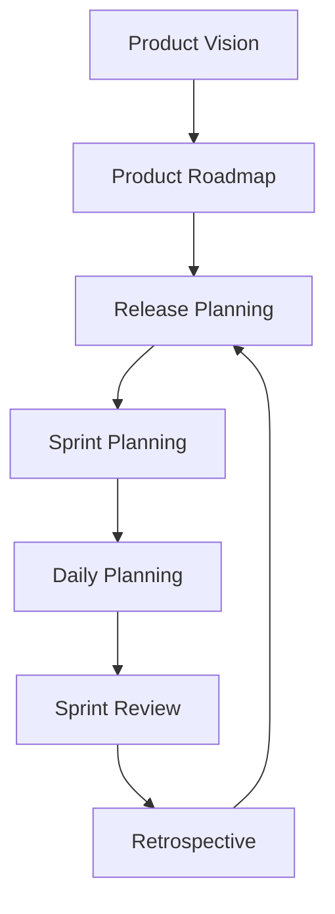
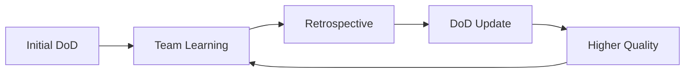

# Agile Planning

## Purpose

Master agile planning practices to deliver high-quality software incrementally through well-defined user stories, clear acceptance criteria, and robust definitions of ready and done.

## Context

Agile planning transforms requirements into actionable work items that teams can deliver in short iterations, ensuring continuous value delivery and quality.

## Prerequisites

- Understanding of [Requirements Engineering](../01-requirements/README.md)
- Basic knowledge of Agile/Scrum methodology
- Familiarity with iterative development

## Agile Planning Framework



## User Stories

### Anatomy of a User Story

```
┌─────────────────────────────────────┐
│           USER STORY CARD           │
├─────────────────────────────────────┤
│ As a [type of user]                 │
│ I want [goal/desire]                │
│ So that [benefit/value]              │
├─────────────────────────────────────┤
│ Acceptance Criteria:                │
│ • Criterion 1                       │
│ • Criterion 2                       │
│ • Criterion 3                       │
├─────────────────────────────────────┤
│ Notes: [Additional context]         │
│ Priority: [High/Medium/Low]         │
│ Size: [Story Points]                │
└─────────────────────────────────────┘
```

### INVEST Criteria Deep Dive

#### Independent

**Why It Matters:** Reduces dependencies and allows flexible prioritization

**Good Example:**

```
Story A: User can register with email
Story B: User can login with email
(Each can be developed independently)
```

**Bad Example:**

```
Story A: User sees dashboard
Story B: Dashboard shows user data
(B depends on A being completed)
```

#### Negotiable

**Why It Matters:** Details emerge through conversation, not rigid specifications

**Good Approach:**

```
Story: User can export data
Negotiable aspects:
- Format (CSV, Excel, PDF)
- Filters to apply
- Fields to include
```

#### Valuable

**Why It Matters:** Every story must deliver business or user value

**Value Types:**

- **User Value:** Solves user problem
- **Business Value:** Increases revenue, reduces cost
- **Technical Value:** Reduces debt, improves performance

**Value Statement Template:**

```
This story provides value by:
- Reducing [metric] by [amount]
- Increasing [metric] by [amount]
- Enabling [capability]
- Preventing [problem]
```

#### Estimable

**Why It Matters:** Teams need to plan and commit to work

**Making Stories Estimable:**

1. Break down if too large
2. Spike if too uncertain
3. Clarify acceptance criteria
4. Identify technical approach

**Estimation Techniques:**

- Planning Poker
- T-Shirt Sizing (XS, S, M, L, XL)
- Fibonacci Sequence (1, 2, 3, 5, 8, 13)

#### Small

**Why It Matters:** Fits within a sprint and provides fast feedback

**Size Guidelines:**

```
1-2 points: 1-2 days
3-5 points: 2-3 days
8 points: 3-5 days
13+ points: Too large, split it
```

#### Testable

**Why It Matters:** Confirms story completion and quality

**Testability Checklist:**

- [ ] Clear success criteria
- [ ] Measurable outcomes
- [ ] Defined test scenarios
- [ ] Observable behavior

### User Story Templates

#### Basic Template

```markdown
## Story: [Title]

**As a** [user type]
**I want** [functionality]
**So that** [benefit]

### Acceptance Criteria

- [ ] Given [context], when [action], then [outcome]
- [ ] Given [context], when [action], then [outcome]

### Technical Notes

[Implementation considerations]

### Dependencies

[Other stories or systems]
```

#### Job Story Alternative

```
When [situation]
I want to [motivation]
So I can [expected outcome]

Example:
When I receive a large order
I want to be notified immediately
So I can ensure inventory availability
```

#### Feature Story Format

```
Feature: [Feature name]
In order to [benefit]
As a [user type]
I want [functionality]

Scenario: [Scenario name]
Given [initial context]
When [action taken]
Then [expected result]
```

## Acceptance Criteria

### Writing Effective Acceptance Criteria

#### Characteristics

- **Specific:** No ambiguity
- **Measurable:** Can verify completion
- **Achievable:** Possible to implement
- **Relevant:** Related to story value
- **Time-bound:** Clear scope

### Acceptance Criteria Formats

#### Given-When-Then (BDD Style)

```gherkin
Feature: User Authentication

Scenario: Successful login
  Given I am on the login page
  And I have a valid account
  When I enter correct credentials
  And I click the login button
  Then I should be redirected to dashboard
  And I should see a welcome message
  And my session should be active

Scenario: Failed login
  Given I am on the login page
  When I enter incorrect credentials
  And I click the login button
  Then I should see an error message
  And I should remain on the login page
  And no session should be created
```

#### Checklist Format

```markdown
### Acceptance Criteria: User Profile Update

Functional:

- [ ] User can update first name
- [ ] User can update last name
- [ ] User can update email
- [ ] User can upload avatar (JPEG/PNG, max 5MB)
- [ ] Changes are saved to database
- [ ] Confirmation message displayed

Validation:

- [ ] Email format validated
- [ ] Required fields enforced
- [ ] Image size limit enforced
- [ ] Duplicate email prevented

Security:

- [ ] Authentication required
- [ ] Can only edit own profile
- [ ] Audit log created
- [ ] XSS prevention applied
```

#### Rule-Based Format

```markdown
### Business Rules for Discount Calculation

1. Orders > $100: 10% discount
2. Gold members: Additional 5% discount
3. Discounts stack (max 25%)
4. Shipping not included in calculation
5. Applied before tax calculation
6. One coupon code per order
7. Sale items excluded from promotions
```

#### Scenario-Based Format

```markdown
### Scenarios for Shopping Cart

**Scenario 1: Adding items**

- User browses products
- User clicks "Add to Cart"
- Cart icon updates with count
- Toast notification appears
- Item appears in cart view

**Scenario 2: Updating quantity**

- User opens cart
- User changes quantity
- Price updates automatically
- Stock availability checked
- Total recalculated

**Scenario 3: Removing items**

- User clicks remove button
- Confirmation dialog appears
- Item removed on confirm
- Cart count updates
- Empty cart message if last item
```

## Definition of Ready (DoR)

### Purpose

Ensures stories are properly prepared before development begins, reducing waste and rework.

### DoR Checklist

```markdown
## Definition of Ready Checklist

### Story Quality

- [ ] User story follows INVEST criteria
- [ ] Business value is clear
- [ ] User/stakeholder identified

### Requirements

- [ ] Acceptance criteria defined
- [ ] Dependencies identified
- [ ] Non-functional requirements specified
- [ ] Edge cases considered

### Design & Technical

- [ ] Technical approach discussed
- [ ] Architecture impact assessed
- [ ] API contracts defined (if applicable)
- [ ] UI/UX designs available (if applicable)

### Estimation & Planning

- [ ] Story estimated by team
- [ ] Fits within sprint capacity
- [ ] Prioritized by Product Owner
- [ ] No blocking dependencies

### Testing

- [ ] Test scenarios identified
- [ ] Test data requirements known
- [ ] Performance criteria defined
- [ ] Security requirements clear

### Team Alignment

- [ ] Questions answered
- [ ] Team understands story
- [ ] Definition of Done applicable
- [ ] Risks identified and accepted
```

### DoR Enforcement

**Benefits of Enforcement:**

- Reduces mid-sprint surprises
- Improves estimation accuracy
- Increases team velocity
- Enhances quality

**When to Be Flexible:**

- Emergency fixes
- Time-sensitive features
- Spike/research stories
- Technical debt items

## Definition of Done (DoD)

### Purpose

Shared understanding of work completion ensuring quality and preventing technical debt accumulation.

### DoD Levels

#### Story-Level DoD

```markdown
## Definition of Done - User Story

### Code

- [ ] Code complete and follows standards
- [ ] Code reviewed by peer
- [ ] No commented-out code
- [ ] Technical debt logged if created

### Testing

- [ ] Unit tests written and passing
- [ ] Integration tests passing
- [ ] Acceptance criteria verified
- [ ] Manual testing completed
- [ ] Edge cases tested

### Documentation

- [ ] Code commented appropriately
- [ ] API documentation updated
- [ ] User documentation updated
- [ ] README updated if needed

### Quality

- [ ] No critical bugs
- [ ] Code coverage > 80%
- [ ] Security scan passed
- [ ] Performance requirements met
- [ ] Accessibility standards met

### Integration

- [ ] Merged to main branch
- [ ] Build pipeline green
- [ ] Deployed to staging
- [ ] No regression issues

### Review

- [ ] Demo to Product Owner
- [ ] Acceptance confirmed
- [ ] Metrics updated
```

#### Sprint-Level DoD

```markdown
## Definition of Done - Sprint

### Delivery

- [ ] All committed stories completed
- [ ] Sprint goal achieved
- [ ] No incomplete work

### Quality

- [ ] Zero critical defects
- [ ] Technical debt not increased
- [ ] Performance benchmarks met

### Documentation

- [ ] Release notes prepared
- [ ] Known issues documented
- [ ] Deployment guide updated

### Demonstration

- [ ] Sprint demo prepared
- [ ] Stakeholders invited
- [ ] Feedback collected

### Retrospective

- [ ] Retrospective conducted
- [ ] Action items identified
- [ ] Improvements planned
```

#### Release-Level DoD

```markdown
## Definition of Done - Release

### Functionality

- [ ] All release features complete
- [ ] Feature toggles configured
- [ ] Backward compatibility verified

### Testing

- [ ] Full regression testing passed
- [ ] Performance testing completed
- [ ] Security testing passed
- [ ] User acceptance testing done

### Documentation

- [ ] User guides updated
- [ ] API documentation published
- [ ] Training materials ready
- [ ] Support documentation prepared

### Deployment

- [ ] Production deployment plan ready
- [ ] Rollback plan documented
- [ ] Monitoring configured
- [ ] Alerts set up

### Business

- [ ] Marketing materials ready
- [ ] Support team trained
- [ ] Legal review completed
- [ ] Compliance verified
```

### DoD Evolution



**Evolution Examples:**

- Month 1: Code complete, basic tests
- Month 3: + Code review, 70% coverage
- Month 6: + Security scan, 80% coverage
- Month 12: + Performance tests, accessibility

## Estimation Techniques

### Planning Poker

**Process:**

1. PO presents story
2. Team asks questions
3. Everyone selects card
4. Reveal simultaneously
5. Discuss extremes
6. Re-estimate if needed
7. Reach consensus

**Fibonacci Scale:**

```
1 - Trivial (few hours)
2 - Simple (half day)
3 - Standard (1 day)
5 - Complex (2-3 days)
8 - Very Complex (3-5 days)
13 - Too large (split it)
21 - Epic (definitely split)
```

### T-Shirt Sizing

**Scale:**

```
XS - Few hours
S  - 1 day
M  - 2-3 days
L  - 3-5 days
XL - 1 week+
```

**When to Use:**

- Initial backlog estimation
- Rough capacity planning
- Quick prioritization

### Affinity Estimation

**Process:**

1. Write all stories on cards
2. Team silently groups by size
3. Discuss outliers
4. Assign estimates to groups
5. Quick and collaborative

### Three-Point Estimation

```
Estimate = (Optimistic + 4×Likely + Pessimistic) / 6

Example:
Optimistic: 2 days
Likely: 3 days
Pessimistic: 6 days
Estimate = (2 + 12 + 6) / 6 = 3.3 days
```

## Sprint Planning

### Sprint Planning Meeting

#### Part 1: What (Sprint Goal)

**Duration:** 2 hours (2-week sprint)

**Agenda:**

1. Review product backlog
2. Discuss sprint goal
3. Select stories for sprint
4. Confirm capacity
5. Commit to sprint goal

**Sprint Goal Template:**

```
By the end of this sprint, we will have [deliverable]
that enables [user/business value]
as measured by [success metric]
```

#### Part 2: How (Task Breakdown)

**Duration:** 2 hours (2-week sprint)

**Activities:**

1. Break stories into tasks
2. Estimate task hours
3. Identify dependencies
4. Assign initial owners
5. Validate feasibility

**Task Breakdown Example:**

```
Story: User Login
├── Frontend Tasks
│   ├── Create login form (4h)
│   ├── Add validation (2h)
│   └── Connect to API (3h)
├── Backend Tasks
│   ├── Create endpoint (3h)
│   ├── Add authentication (4h)
│   └── Setup database (2h)
└── Testing Tasks
    ├── Write unit tests (3h)
    ├── Integration tests (2h)
    └── E2E test (2h)
Total: 25 hours
```

### Capacity Planning

```markdown
## Sprint Capacity Calculator

| Team Member | Available Days | Hours/Day | Total Hours | Buffer (20%) | Net Capacity |
| ----------- | -------------- | --------- | ----------- | ------------ | ------------ |
| Developer 1 | 9              | 6         | 54          | 11           | 43           |
| Developer 2 | 10             | 6         | 60          | 12           | 48           |
| Tester      | 10             | 6         | 60          | 12           | 48           |
| **Total**   | -              | -         | **174**     | **35**       | **139**      |

Velocity-Based:

- Last 3 sprints: 28, 32, 30 points
- Average: 30 points
- Capacity: 30 points
```

## Backlog Management

### Product Backlog Refinement

**When:** Weekly, 5-10% of sprint time

**Activities:**

- Add new stories
- Remove obsolete items
- Re-prioritize based on value
- Split large stories
- Add acceptance criteria
- Estimate new items

### Prioritization Techniques

#### MoSCoW Method

- **M**ust have: Critical for release
- **S**hould have: Important but not critical
- **C**ould have: Nice to have
- **W**on't have: Out of scope

#### Value vs. Effort Matrix

```
         High Value
            │
    Do First │ Do Second
    ─────────┼──────────
    Do Last  │ Consider
            │
         Low Value
    ────────────────────
    Low Effort  High Effort
```

#### WSJF (Weighted Shortest Job First)

```
WSJF = (Business Value + Time Criticality + Risk Reduction) / Job Size

Example:
Story A: (8 + 5 + 3) / 5 = 3.2
Story B: (5 + 8 + 2) / 3 = 5.0
Priority: Story B first
```

## Agile Metrics

### Velocity

**Calculation:**

```
Velocity = Story Points Completed / Sprint

Example:
Sprint 1: 28 points
Sprint 2: 32 points
Sprint 3: 30 points
Average Velocity: 30 points
```

**Use Cases:**

- Sprint planning
- Release forecasting
- Team capacity understanding

### Burndown Chart

```
Story Points
    │
40  │●
35  │ ●
30  │  ●     Ideal
25  │   ●   ╱
20  │    ● ╱ ●  Actual
15  │     ╱●  ●
10  │    ╱     ●
5   │   ╱       ●
0   │  ╱         ●
    └─────────────────
    1 2 3 4 5 6 7 8 9 10
           Days
```

### Cumulative Flow Diagram

```
Items
    │     ┌─────── Done
40  │    ╱│
35  │   ╱ │┌────── Testing
30  │  ╱  ╱│
25  │ ╱  ╱ │┌───── In Progress
20  │╱  ╱  ╱│
15  │  ╱  ╱ │┌──── To Do
10  │ ╱  ╱  ╱
5   │╱  ╱  ╱
0   │──────────
    Time →
```

### Cycle Time

```
Cycle Time = Time from Start to Done

Example:
Story started: Monday 9am
Story completed: Wednesday 3pm
Cycle Time: 2.25 days
```

## Common Anti-Patterns

### Planning Anti-Patterns

**Over-commitment**

- Taking more than velocity suggests
- Not accounting for meetings/overhead
- Ignoring team feedback

**Under-specification**

- Vague acceptance criteria
- Missing non-functional requirements
- Unclear dependencies

**Horizontal Slicing**

- All backend in one sprint
- All frontend in next sprint
- No deliverable value

### Story Anti-Patterns

**Technical Stories**
❌ "As a developer, I want a database"
✅ "As a user, I want my data persisted"

**Huge Stories**
❌ 21-point stories in sprint
✅ Break down to 8 points or less

**Dependent Stories**
❌ Story B needs Story A first
✅ Combine or rewrite independently

## Tools and Templates

### Digital Tools

| Tool         | Best For         | Key Features           |
| ------------ | ---------------- | ---------------------- |
| Jira         | Large teams      | Customizable workflows |
| Azure DevOps | Microsoft stack  | Full integration       |
| Trello       | Simple projects  | Visual boards          |
| Asana        | Cross-functional | Multiple views         |
| Linear       | Modern teams     | Speed and simplicity   |

### Physical Tools

- Story cards
- Planning poker cards
- Task board
- Burndown chart
- Information radiators

## Checklist

### Sprint Planning Checklist

**Pre-Planning:**

- [ ] Backlog refined
- [ ] Stories ready (DoR met)
- [ ] Team capacity known
- [ ] Previous retrospective actions reviewed

**During Planning:**

- [ ] Sprint goal defined
- [ ] Stories selected and estimated
- [ ] Tasks identified
- [ ] Dependencies flagged
- [ ] Risks discussed

**Post-Planning:**

- [ ] Sprint backlog created
- [ ] Burndown chart initialized
- [ ] Team committed
- [ ] Stakeholders informed

## References

### Books

- "User Stories Applied" - Mike Cohn
- "Agile Estimating and Planning" - Mike Cohn
- "Scrum: The Art of Doing Twice the Work in Half the Time" - Jeff Sutherland

### Frameworks

- Scrum Guide - scrumguides.org
- SAFe - scaledagileframework.com
- LeSS - less.works

### Certifications

- Certified Scrum Master (CSM)
- Professional Scrum Master (PSM)
- PMI-ACP

## Related Topics

- [Definition of Ready](definition-of-ready.md)
- [Definition of Done](definition-of-done.md)
- [INVEST Criteria](invest-criteria.md)
- [Estimation Techniques](estimation-techniques.md)
- [Requirements Engineering](../01-requirements/README.md)
- [Testing Strategy](../04-testing-strategy/README.md)

---

_Next: [Definition of Ready](definition-of-ready.md) - Detailed DoR implementation_
