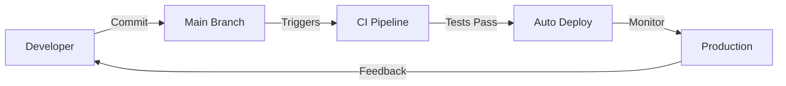

# Version Control & Trunk-Based Development

## Purpose

Master version control best practices and Trunk-Based Development (TBD) methodology to enable continuous integration, continuous delivery, and maintain code quality through streamlined collaboration.

## Context

Version control is the foundation of modern software development. Trunk-Based Development represents the industry's shift toward faster feedback loops, continuous deployment, and reduced integration complexity—key practices for high-performing teams.

## Prerequisites

- Basic Git knowledge
- Understanding of [Requirements Engineering](../01-requirements/README.md)
- Familiarity with collaborative development
- [Continuous Improvement](../12-continuous-improvement/README.md) mindset

## Why Trunk-Based Development?

### The Evolution of Version Control Strategies

```
Traditional → GitFlow → GitHub Flow → Trunk-Based Development
   ↓            ↓           ↓                ↓
Complex      Structured   Simple        Optimized for CD
Long-lived   Multiple     Short-lived   Ultra-short-lived
branches     branches     branches      branches
```

### TBD Benefits

**Faster Delivery:**

- Deploy multiple times per day
- Immediate user feedback
- Rapid iteration
- Reduced time-to-market

**Lower Risk:**

- Small, incremental changes
- Early integration
- Continuous testing
- Easy rollback

**Better Collaboration:**

- Always current codebase
- No long-lived merge conflicts
- Shared ownership
- Team alignment

**Higher Quality:**

- Continuous integration
- Automated testing
- Feature flags enable safe deployment
- Production monitoring

### Industry Adoption

```
DORA Research (State of DevOps):

Elite Performers:
├── Deployment Frequency: Multiple per day
├── Lead Time: < 1 hour
├── MTTR: < 1 hour
└── Change Failure Rate: 0-15%

Common Practice: Trunk-Based Development

Regular trunk merges = 2x more likely to be elite performers
```

## Trunk-Based Development Overview

### Core Principles

```
Single Source of Truth
        ↓
    Main Branch
        ↓
    ┌───────────────┐
    │  Always       │
    │  Deployable   │
    └───────────────┘
        ↓
    Every Commit
        ↓
    ┌───────────────┐
    │  Triggers     │
    │  CI/CD        │
    └───────────────┘
        ↓
    Production Ready
```

### Branch Strategy

#### Main/Trunk Branch

**Characteristics:**

```
main (or master or trunk)
├── Single source of truth
├── Always deployable
├── Always passes all tests
├── Deployed continuously
└── Protected with automation
```

**Workflow:**



**Protection Rules:**

```yaml
main:
  protection:
    required_reviews: 1-2
    required_checks:
      - build
      - unit-tests
      - integration-tests
      - security-scan
      - code-quality
    require_up_to_date: true
    require_conversation_resolution: true
    allow_force_pushes: false
    allow_deletions: false
```

#### Short-Lived Feature Branches (Optional)

**When to Use:**

- Developer prefers local branching
- Code review before merge
- CI verification before trunk

**Lifespan:** < 1-2 days (maximum)

**Process:**

```bash
# Day 1: Morning
git checkout main
git pull origin main
git checkout -b feature/user-auth

# Day 1: Work in small increments
git commit -m "feat(auth): add login form"
git commit -m "feat(auth): add validation"
git commit -m "test(auth): add login tests"

# Day 1: Evening or Day 2: Morning
git push origin feature/user-auth
# Create pull request
# Get review (< 2 hours)
# Merge to main
# Delete branch immediately
```

**Alternative: Direct to Trunk**

```bash
# For very small changes
git checkout main
git pull origin main
# Make change
git commit -m "fix(ui): correct button alignment"
git push origin main
# CI/CD handles the rest
```

### Commit Frequency

```
Traditional:
Week 1: [Work]
Week 2: [Work]
Week 3: [Work] → [Big Merge] → [Integration Hell]

Trunk-Based Development:
Day 1: [Commit] → [Commit] → [Commit]
Day 2: [Commit] → [Commit]
Day 3: [Commit] → [Commit] → [Commit]
       ↓
    Continuous Integration
    No Integration Pain
```

**Best Practice:**

- Commit multiple times per day
- Each commit is small and complete
- Each commit passes all tests
- Each commit is potentially deployable

## Feature Flags: The Secret Sauce

### Why Feature Flags?

Feature flags (toggles) enable:

- Deploy incomplete features safely
- Test in production
- Gradual rollout
- A/B testing
- Instant rollback

### Feature Flag Pattern

```javascript
// Feature flag implementation
class FeatureFlags {
  constructor(config) {
    this.flags = config.flags;
    this.userContext = config.userContext;
  }

  isEnabled(flagName, userId = null) {
    const flag = this.flags[flagName];

    if (!flag) return false;
    if (!flag.enabled) return false;

    // Percentage rollout
    if (flag.rollout < 100) {
      const hash = this.hashUserId(userId, flagName);
      return hash < flag.rollout;
    }

    // User targeting
    if (flag.users && userId) {
      return flag.users.includes(userId);
    }

    return flag.enabled;
  }

  hashUserId(userId, flag) {
    // Consistent hash for gradual rollout
    return hash(userId + flag) % 100;
  }
}

// Usage in application
function CheckoutPage({ user }) {
  const flags = useFeatureFlags();

  if (flags.isEnabled('new-checkout', user.id)) {
    return <NewCheckoutFlow />;
  }

  return <LegacyCheckoutFlow />;
}
```

### Feature Flag Lifecycle

```
1. Development
   ├── Flag: OFF everywhere
   ├── Code deployed to production
   └── No user impact

2. Internal Testing
   ├── Flag: ON for dev team (5%)
   ├── Test in production
   └── Fix issues

3. Beta Rollout
   ├── Flag: ON for beta users (10%)
   ├── Monitor metrics
   └── Gather feedback

4. Gradual Rollout
   ├── 25% → 50% → 75% → 100%
   ├── Monitor at each step
   └── Rollback if issues

5. Cleanup
   ├── Flag: 100% for 2 weeks
   ├── Remove flag code
   └── Deploy cleanup
```

### Feature Flag Configuration

```yaml
# feature-flags.yml
flags:
  new-checkout:
    enabled: true
    rollout: 25 # 25% of users
    description: 'New checkout flow'
    created: 2024-10-01
    owner: checkout-team

  dark-mode:
    enabled: true
    rollout: 100
    users:
      - user123 # Specific users
      - user456

  experimental-search:
    enabled: false
    rollout: 0
    description: 'ML-powered search (not ready)'
```

## Commit Conventions

### Conventional Commits

**Format:**

```
<type>(<scope>): <subject>

[optional body]

[optional footer(s)]
```

#### Commit Types

| Type     | Description        | Example                                    |
| -------- | ------------------ | ------------------------------------------ |
| feat     | New feature        | `feat(auth): add OAuth2 login`             |
| fix      | Bug fix            | `fix(cart): resolve total calculation`     |
| docs     | Documentation      | `docs(api): update endpoint descriptions`  |
| style    | Formatting         | `style: fix indentation`                   |
| refactor | Code restructuring | `refactor(user): extract validation logic` |
| perf     | Performance        | `perf(db): add index to users table`       |
| test     | Testing            | `test(auth): add login unit tests`         |
| build    | Build system       | `build: update webpack config`             |
| ci       | CI/CD              | `ci: add GitHub Actions workflow`          |
| chore    | Maintenance        | `chore: update dependencies`               |

### Atomic Commits

**One Commit = One Logical Change**

```bash
# Bad: Multiple unrelated changes
git commit -m "Fix login, update styles, add tests"

# Good: Separate commits
git commit -m "fix(auth): resolve login timeout issue"
git commit -m "style(auth): update login form styling"
git commit -m "test(auth): add login integration tests"
```

### Commit Often

```bash
# Commit every small, complete change
git add src/auth/validation.js
git commit -m "feat(auth): add email validation"

git add src/auth/validation.test.js
git commit -m "test(auth): add email validation tests"

git add src/auth/password.js
git commit -m "feat(auth): add password strength checker"

# Push to main frequently
git push origin main
```

## Integration Practices

### Continuous Integration Requirements

**Every Commit Must:**

```
□ Pass all unit tests
□ Pass integration tests
□ Pass linting/code quality checks
□ Pass security scans
□ Maintain or improve code coverage
□ Be deployable to production
```

### CI Pipeline Example

```yaml
# .github/workflows/ci.yml
name: Continuous Integration

on:
  push:
    branches: [main]
  pull_request:
    branches: [main]

jobs:
  quality-checks:
    runs-on: ubuntu-latest
    steps:
      - uses: actions/checkout@v3

      - name: Install dependencies
        run: npm ci

      - name: Lint
        run: npm run lint

      - name: Type check
        run: npm run type-check

      - name: Unit tests
        run: npm run test:unit

      - name: Integration tests
        run: npm run test:integration

      - name: Code coverage
        run: npm run test:coverage

      - name: Security scan
        run: npm audit

      - name: Build
        run: npm run build

  deploy:
    needs: quality-checks
    if: github.ref == 'refs/heads/main'
    runs-on: ubuntu-latest
    steps:
      - name: Deploy to production
        run: |
          # Deploy with feature flags
          ./deploy.sh --environment production
```

### Pre-Merge Validation

```bash
# Pre-commit hook
#!/bin/sh
# .git/hooks/pre-commit

echo "Running pre-commit checks..."

# Run linter
npm run lint
if [ $? -ne 0 ]; then
  echo "❌ Linting failed"
  exit 1
fi

# Run tests
npm test
if [ $? -ne 0 ]; then
  echo "❌ Tests failed"
  exit 1
fi

echo "✅ Pre-commit checks passed"
```

## Code Review Process

### Pull Request Guidelines

**Size:** Keep PRs small

- < 400 lines of code
- Reviewable in 30-60 minutes
- Single logical change

**Turnaround:** Fast reviews

- Review within 2 hours
- Feedback within 4 hours
- Merge within same day

### PR Template

```markdown
## Description

[Brief description of changes]

## Type of Change

- [ ] Bug fix
- [ ] New feature (behind feature flag)
- [ ] Performance improvement
- [ ] Refactoring

## Testing

- [ ] Unit tests pass
- [ ] Integration tests pass
- [ ] Manual testing completed

## Feature Flag

- [ ] N/A - No feature flag needed
- [ ] Feature flag: `feature-name` (rollout: 0%)
- [ ] Documentation updated

## Deployment Notes

[Any special deployment considerations]

## Checklist

- [ ] Code follows style guidelines
- [ ] Self-review completed
- [ ] Tests added/updated
- [ ] Documentation updated
- [ ] No breaking changes OR migration guide provided
```

### Review Checklist

**Quick Review (< 30 min):**

- [ ] Code does what it claims
- [ ] Tests are adequate
- [ ] No obvious bugs
- [ ] Follows conventions
- [ ] Documentation updated

**Focus Areas:**

- Correctness
- Test coverage
- Performance implications
- Security concerns
- Maintainability

## Release Management

### Continuous Delivery

**Every Commit is a Potential Release**

```
Commit → CI → All Tests Pass → Auto Deploy → Production
```

### Semantic Versioning

**Format:** MAJOR.MINOR.PATCH

```
2.3.1
│ │ └── Patch: Bug fixes
│ └──── Minor: New features (backward compatible)
└────── Major: Breaking changes
```

### Automated Versioning

```yaml
# .github/workflows/release.yml
name: Automated Release

on:
  push:
    branches: [main]

jobs:
  release:
    runs-on: ubuntu-latest
    steps:
      - uses: actions/checkout@v3
        with:
          fetch-depth: 0

      - name: Semantic Release
        uses: cycjimmy/semantic-release-action@v3
        with:
          extra_plugins: |
            @semantic-release/changelog
            @semantic-release/git
        env:
          GITHUB_TOKEN: ${{ secrets.GITHUB_TOKEN }}
```

### Tagging Strategy

```bash
# Automatic tagging after successful deployment
git tag -a v2.3.1 -m "Release 2.3.1

Features:
- feat(auth): OAuth2 integration
- feat(dashboard): Real-time updates

Fixes:
- fix(api): Resolve timeout issues
- fix(ui): Correct mobile layout

Deployed: 2024-10-07 14:30 UTC"

git push origin v2.3.1
```

## Deployment Strategies

### Canary Deployment

**Gradual Rollout:**

```
Deploy to 5% of servers
    ↓
Monitor metrics (15 minutes)
    ↓
All good? → Deploy to 25%
    ↓
Monitor metrics (15 minutes)
    ↓
All good? → Deploy to 50%
    ↓
Monitor metrics (15 minutes)
    ↓
All good? → Deploy to 100%

Issues detected at any step?
    ↓
Automatic Rollback
```

### Blue-Green Deployment

```
Blue Environment (Current Production)
├── Serving 100% of traffic
└── Version 2.3.0

Green Environment (New Version)
├── Deploy version 2.3.1
├── Run smoke tests
└── Verify health

Switch Traffic:
Blue (0%) ←→ Green (100%)

Rollback if needed:
Blue (100%) ←→ Green (0%)
```

### Feature Flag Deployment

```javascript
// Deploy code, control with flags
function PaymentFlow() {
  const flags = useFeatureFlags();

  // New payment provider deployed but disabled
  if (flags.isEnabled('new-payment-provider')) {
    return <NewPaymentProvider />;
  }

  // Existing provider still active
  return <ExistingPaymentProvider />;
}

// Gradual rollout:
// Day 1: 0% (deployed, testing)
// Day 2: 5% (internal team)
// Day 3: 25% (beta users)
// Day 4: 50% (half of users)
// Day 5: 100% (everyone)
```

## Alternative Workflows (For Reference)

While we primarily use Trunk-Based Development, here are alternative workflows for different scenarios:

### GitFlow (Scheduled Releases)

**Use when:**

- Multiple versions in production
- Scheduled release cycles
- Enterprise software with long support

**Structure:**

```
main (production)
    ↓
develop (integration)
    ↓
feature/* (new features)
release/* (release prep)
hotfix/* (urgent fixes)
```

**Learn more:** [GitFlow Documentation](https://nvie.com/posts/a-successful-git-branching-model/)

### GitHub Flow (Simpler Alternative)

**Use when:**

- Small team
- Web applications
- Continuous deployment
- Less complex than TBD

**Structure:**

```
main (always deployable)
    ↓
feature/* (short-lived, 1-3 days)
```

**Difference from TBD:**

- Slightly longer feature branches (1-3 days vs hours)
- Less emphasis on feature flags
- Deploy from main after merge

### GitLab Flow (Environment-Based)

**Use when:**

- Multiple environments (staging, pre-prod, prod)
- Environment-specific configurations
- Compliance requirements

**Structure:**

```
main → staging → pre-production → production
```

## Workflow Comparison

| Aspect               | TBD (Recommended) | GitFlow                   | GitHub Flow       | GitLab Flow            |
| -------------------- | ----------------- | ------------------------- | ----------------- | ---------------------- |
| Complexity           | Low               | High                      | Low               | Medium                 |
| Branch Lifespan      | Hours             | Days/Weeks                | 1-3 Days          | Environment-based      |
| Deployment Frequency | Multiple/day      | Scheduled                 | Daily             | Environment-based      |
| Feature Flags        | Essential         | Rare                      | Optional          | Optional               |
| Best For             | Modern teams, CD  | Legacy, Multiple versions | Small teams, SaaS | Enterprise, Compliance |
| DORA Score           | Elite             | Low/Medium                | High              | High                   |
| Learning Curve       | Moderate          | Steep                     | Gentle            | Moderate               |
| Merge Conflicts      | Minimal           | Frequent                  | Occasional        | Occasional             |

## Advanced Git Techniques

### Interactive Rebase

```bash
# Clean up commits before pushing
git rebase -i HEAD~3

# Commands:
# pick = use commit
# reword = change commit message
# squash = combine with previous
# fixup = combine, discard message
# drop = remove commit
```

### Stashing

```bash
# Save work in progress
git stash save "WIP: authentication feature"

# List stashes
git stash list

# Apply and keep
git stash apply

# Apply and remove
git stash pop

# Apply specific stash
git stash apply stash@{2}
```

### Cherry-Picking

```bash
# Apply specific commit to current branch
git cherry-pick abc123

# Useful for:
# - Hotfixes to release branches
# - Backporting features
# - Selective merging
```

## Metrics and Monitoring

### DORA Metrics

**Track these for TBD success:**

```
Deployment Frequency:
= Deployments per day
Target (Elite): Multiple per day

Lead Time for Changes:
= Commit to production time
Target (Elite): < 1 hour

Time to Restore Service:
= Incident to recovery time
Target (Elite): < 1 hour

Change Failure Rate:
= % of deployments causing issues
Target (Elite): 0-15%
```

### Git Metrics

```bash
# Commits per day
git log --since="1 week ago" --oneline | wc -l

# Average branch lifespan
for branch in $(git branch -r); do
  git log --format="%cr" $branch | head -1
done

# Code review turnaround
# (Track in PR system: GitHub/GitLab)
Average time: First commit → Merged
```

## Troubleshooting

### Common Issues

**"Feature branches getting too long"**

```
Solution:
- Split into smaller pieces
- Use feature flags for partial work
- Commit to main with disabled flag
- Enable flag when ready
```

**"How to handle database migrations?"**

```
Solution:
- Forward-compatible migrations only
- Two-phase deployment:
  1. Deploy migration (backward compatible)
  2. Deploy code using new schema
- Use feature flags for gradual rollout
```

**"Breaking changes needed"**

```
Solution:
- Use API versioning (v1, v2)
- Maintain both versions temporarily
- Gradual migration with feature flags
- Deprecation notices
- Remove old version after migration
```

## Checklist

### TBD Implementation Checklist

**Setup:**

- [ ] Main branch protected
- [ ] CI/CD pipeline configured
- [ ] Automated tests comprehensive
- [ ] Feature flag system implemented
- [ ] Monitoring and alerting active

**Daily Practice:**

- [ ] Commit to main multiple times/day
- [ ] All commits pass CI
- [ ] Feature flags for incomplete work
- [ ] Code reviews < 2 hours
- [ ] Branches deleted after merge

**Quality Gates:**

- [ ] All tests passing
- [ ] Code coverage maintained
- [ ] Security scans passing
- [ ] Performance benchmarks met
- [ ] Documentation updated

## References

### Standards and Research

- [DORA State of DevOps Report](https://dora.dev)
- [Trunk Based Development](https://trunkbaseddevelopment.com/)
- [Conventional Commits](https://www.conventionalcommits.org/)
- [Semantic Versioning](https://semver.org/)

### Tools

- [Feature Flag Systems](https://launchdarkly.com/) - LaunchDarkly
- [Git Client](https://www.gitkraken.com/) - GitKraken
- [Commit Helper](https://github.com/commitizen/cz-cli) - Commitizen

### Books

- "Accelerate" - Nicole Forsgren, Jez Humble, Gene Kim
- "Continuous Delivery" - Jez Humble, David Farley
- "Pro Git" - Scott Chacon, Ben Straub

## Related Topics

- [CI/CD Best Practices](cicd-best-practices/README.md)
- [Feature Flags Implementation](../07-development-practices/feature-flags.md)
- [Continuous Integration](../08-cicd-pipeline/continuous-integration.md)
- [Deployment Strategies](../10-deployment/deployment-strategies.md)
- [Monitoring & Observability](../09-metrics-monitoring/observability.md)

---

_Part of: [Code Quality Documentation](../../README.md)_
