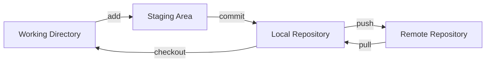
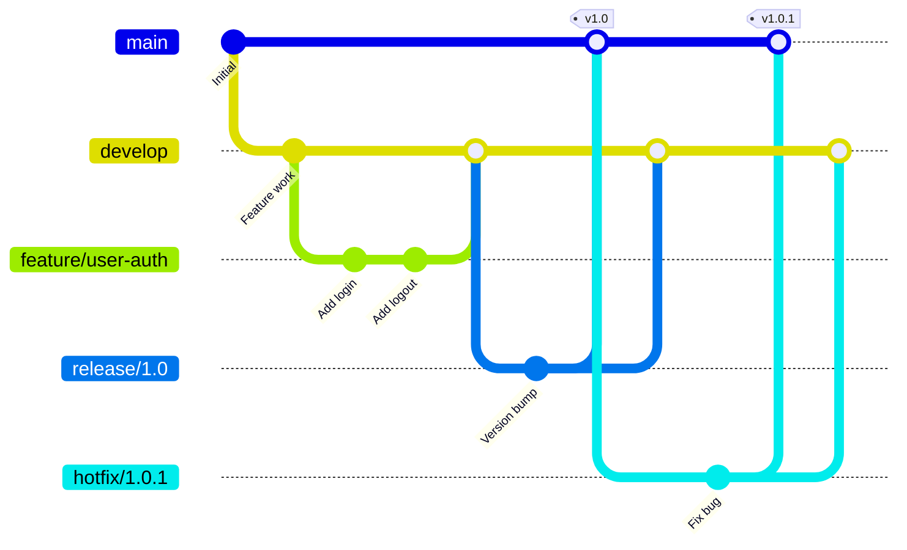

# Version Control & GitFlow

## Purpose
Master version control best practices and GitFlow methodology to maintain code quality, enable collaboration, and ensure reliable software delivery through structured branching and merging strategies.

## Context
Version control is the foundation of modern software development, enabling teams to collaborate effectively while maintaining code quality and traceability.

## Prerequisites
- Basic Git knowledge
- Understanding of [Agile Planning](../02-agile-planning/README.md)
- Familiarity with collaborative development

## Version Control Fundamentals

### Why Version Control Matters

**Benefits:**
- **Collaboration**: Multiple developers work simultaneously
- **History**: Complete audit trail of changes
- **Branching**: Isolated development environments
- **Rollback**: Revert problematic changes
- **Backup**: Distributed copies of code
- **Documentation**: Commit messages explain why

### Version Control Best Practices



## GitFlow Methodology

### GitFlow Overview

GitFlow is a branching model that defines strict branching structure designed around project releases.



### Branch Types and Purposes

#### Main Branches

**main (master)**
```bash
Purpose: Production-ready code
Lifetime: Permanent
Merges from: release/, hotfix/
Protected: Yes
Direct commits: Never

Rules:
- Always deployable
- Tagged with version numbers
- Matches production exactly
```

**develop**
```bash
Purpose: Integration branch for features
Lifetime: Permanent
Merges from: feature/, release/, hotfix/
Protected: Yes
Direct commits: Rarely (small fixes only)

Rules:
- Next release preparation
- Should be stable
- CI/CD runs here
```

#### Supporting Branches

**feature/**
```bash
Purpose: New features or enhancements
Lifetime: Temporary
Branch from: develop
Merge to: develop
Naming: feature/[ticket-id]-[brief-description]

Examples:
- feature/AUTH-123-user-login
- feature/CART-456-add-checkout
- feature/API-789-rate-limiting

Workflow:
git checkout develop
git pull origin develop
git checkout -b feature/AUTH-123-user-login
# ... work ...
git add .
git commit -m "feat(auth): implement user login"
git push origin feature/AUTH-123-user-login
# Create pull request to develop
```

**release/**
```bash
Purpose: Prepare for production release
Lifetime: Short-term
Branch from: develop
Merge to: main AND develop
Naming: release/[version]

Examples:
- release/1.2.0
- release/2.0.0-rc1

Allowed commits:
- Version bumps
- Minor bug fixes
- Documentation updates

Workflow:
git checkout develop
git checkout -b release/1.2.0
# Update version numbers
git commit -m "chore: bump version to 1.2.0"
# Fix any release issues
git commit -m "fix: resolve deployment config"
# Merge to main
git checkout main
git merge --no-ff release/1.2.0
git tag -a v1.2.0 -m "Release version 1.2.0"
# Merge to develop
git checkout develop
git merge --no-ff release/1.2.0
```

**hotfix/**
```bash
Purpose: Emergency fixes to production
Lifetime: Very short
Branch from: main
Merge to: main AND develop
Naming: hotfix/[version]-[description]

Examples:
- hotfix/1.2.1-payment-bug
- hotfix/2.0.1-security-patch

Workflow:
git checkout main
git checkout -b hotfix/1.2.1-payment-bug
# Fix the issue
git commit -m "fix: resolve payment processing error"
# Merge to main
git checkout main
git merge --no-ff hotfix/1.2.1-payment-bug
git tag -a v1.2.1 -m "Hotfix version 1.2.1"
# Merge to develop
git checkout develop
git merge --no-ff hotfix/1.2.1-payment-bug
```

**support/**
```bash
Purpose: Support older versions
Lifetime: Long-term
Branch from: main (specific tag)
Merge to: Nowhere (isolated)
Naming: support/[version]

Examples:
- support/1.x
- support/2.3.x

Use case:
- Legacy version maintenance
- Security patches for old versions
- Customer-specific versions
```

### GitFlow Configuration

#### Initialize GitFlow

```bash
# Install git-flow
# macOS
brew install git-flow-avh

# Ubuntu/Debian
apt-get install git-flow

# Windows
# Use Git for Windows which includes git-flow

# Initialize in repository
git flow init

# Accept defaults or customize:
# Production branch: main
# Development branch: develop
# Feature prefix: feature/
# Release prefix: release/
# Hotfix prefix: hotfix/
# Version tag prefix: v
```

#### GitFlow Commands

```bash
# Feature workflow
git flow feature start user-auth
# ... work on feature ...
git flow feature finish user-auth

# Release workflow
git flow release start 1.2.0
# ... prepare release ...
git flow release finish 1.2.0

# Hotfix workflow
git flow hotfix start 1.2.1
# ... fix issue ...
git flow hotfix finish 1.2.1
```

## Commit Conventions

### Conventional Commits

**Format:**
```
<type>(<scope>): <subject>

[optional body]

[optional footer(s)]
```

#### Commit Types

| Type | Description | Example |
|------|-------------|---------|
| feat | New feature | `feat(auth): add OAuth2 login` |
| fix | Bug fix | `fix(cart): resolve total calculation` |
| docs | Documentation | `docs(api): update endpoint descriptions` |
| style | Formatting | `style: fix indentation` |
| refactor | Code restructuring | `refactor(user): extract validation logic` |
| perf | Performance | `perf(db): add index to users table` |
| test | Testing | `test(auth): add login unit tests` |
| build | Build system | `build: update webpack config` |
| ci | CI/CD | `ci: add GitHub Actions workflow` |
| chore | Maintenance | `chore: update dependencies` |
| revert | Revert commit | `revert: feat(auth): add OAuth2 login` |

#### Commit Message Examples

**Good Examples:**
```bash
# Feature
feat(user): implement password reset functionality

Add password reset flow with email verification.
Includes rate limiting and token expiration.

Closes #123

# Bug fix
fix(api): handle null values in response

Previously the API would crash when database returned
null values. Now properly handles nulls and returns
appropriate defaults.

Fixes #456

# Breaking change
feat(api)!: change authentication endpoint

BREAKING CHANGE: Authentication endpoint moved from
/auth/login to /v2/authenticate. Update all client
applications to use new endpoint.

Migration guide: docs/migration/v2.md
```

**Bad Examples:**
```bash
# Too vague
"fix bug"
"update code"
"changes"

# Too long subject
"Implemented the new authentication system with OAuth2, JWT tokens, and refresh token rotation"

# Wrong type
"feat: fix login bug" # Should be "fix"
"fix: add new feature" # Should be "feat"
```

### Commit Best Practices

#### Atomic Commits
One commit = one logical change

```bash
# Bad: Multiple unrelated changes
git commit -m "Fix login, update styles, add tests"

# Good: Separate commits
git commit -m "fix(auth): resolve login timeout issue"
git commit -m "style(auth): update login form styling"
git commit -m "test(auth): add login integration tests"
```

#### Commit Often
```bash
# Work in small increments
git add src/auth/login.js
git commit -m "feat(auth): add login form validation"

git add src/auth/login.test.js
git commit -m "test(auth): add validation unit tests"

git add docs/auth.md
git commit -m "docs(auth): document login process"
```

## Code Review Process

### Pull Request Guidelines

#### PR Template

```markdown
## Description
Brief description of changes

## Type of Change
- [ ] Bug fix
- [ ] New feature
- [ ] Breaking change
- [ ] Documentation update

## Changes Made
- List key changes
- Highlight important decisions
- Note any compromises

## Testing
- [ ] Unit tests pass
- [ ] Integration tests pass
- [ ] Manual testing completed

## Checklist
- [ ] Code follows style guidelines
- [ ] Self-review completed
- [ ] Comments added where needed
- [ ] Documentation updated
- [ ] No new warnings
- [ ] Tests added/updated
- [ ] All tests passing

## Screenshots (if applicable)
[Add screenshots for UI changes]

## Related Issues
Closes #[issue number]

## Additional Notes
[Any additional context]
```

#### PR Size Guidelines

**Ideal PR Size:**
- < 400 lines of code
- Single logical change
- Reviewable in 30-60 minutes

**When to Split PRs:**
```
Large Feature → Multiple PRs:
1. PR #1: Data model and migrations
2. PR #2: API endpoints
3. PR #3: Business logic
4. PR #4: UI components
5. PR #5: Integration and tests
```

### Code Review Checklist

#### Reviewer Checklist

**Functionality:**
- [ ] Code does what it claims
- [ ] Edge cases handled
- [ ] Error handling appropriate
- [ ] No obvious bugs

**Design:**
- [ ] Follows architecture patterns
- [ ] SOLID principles applied
- [ ] DRY (Don't Repeat Yourself)
- [ ] KISS (Keep It Simple)

**Performance:**
- [ ] No N+1 queries
- [ ] Efficient algorithms used
- [ ] Caching implemented where appropriate
- [ ] No memory leaks

**Security:**
- [ ] Input validation
- [ ] SQL injection prevention
- [ ] XSS protection
- [ ] Authentication/authorization correct
- [ ] No sensitive data in logs

**Testing:**
- [ ] Adequate test coverage
- [ ] Tests are meaningful
- [ ] Edge cases tested
- [ ] Mocks used appropriately

**Code Quality:**
- [ ] Naming conventions followed
- [ ] Code is self-documenting
- [ ] No dead code
- [ ] Consistent style

**Documentation:**
- [ ] Complex logic explained
- [ ] API documentation updated
- [ ] README updated if needed
- [ ] Changelog updated

### Review Comments

#### Constructive Feedback

**Good Review Comments:**
```markdown
# Suggesting improvement
"Consider using a Map here instead of nested loops.
It would improve time complexity from O(n²) to O(n)."

# Asking for clarification
"I'm not clear on why we need this check. Could you
add a comment explaining the business rule?"

# Pointing out issue
"This could throw a NullPointerException if the user
object is null. Should we add a null check?"

# Praising good code
"Nice use of the Strategy pattern here! Makes it
very extensible."
```

**Poor Review Comments:**
```markdown
# Too vague
"This doesn't look right"

# Personal preference without justification
"I don't like this approach"

# Harsh/unprofessional
"This is terrible code"

# Nitpicking without value
"Add a period to this comment"
```

## Branch Protection Rules

### GitHub Branch Protection

```yaml
# .github/branch-protection.yml
main:
  protection_rules:
    required_reviews: 2
    dismiss_stale_reviews: true
    require_code_owner_reviews: true
    required_status_checks:
      - build
      - test
      - security-scan
    enforce_admins: true
    require_up_to_date: true
    require_conversation_resolution: true
    require_signed_commits: false
    allow_force_pushes: false
    allow_deletions: false

develop:
  protection_rules:
    required_reviews: 1
    required_status_checks:
      - build
      - test
    require_up_to_date: true
```

### Git Hooks

#### Pre-commit Hook
```bash
#!/bin/sh
# .git/hooks/pre-commit

# Run linters
npm run lint
if [ $? -ne 0 ]; then
  echo "Linting failed. Please fix errors."
  exit 1
fi

# Run tests
npm test
if [ $? -ne 0 ]; then
  echo "Tests failed. Please fix failing tests."
  exit 1
fi

# Check for sensitive data
git diff --cached --name-only | xargs grep -E "(api_key|password|secret)"
if [ $? -eq 0 ]; then
  echo "Possible sensitive data detected!"
  exit 1
fi
```

#### Commit-msg Hook
```bash
#!/bin/sh
# .git/hooks/commit-msg

# Check commit message format
commit_regex='^(feat|fix|docs|style|refactor|perf|test|build|ci|chore|revert)(\(.+\))?: .{1,50}'
if ! grep -qE "$commit_regex" "$1"; then
  echo "Invalid commit message format!"
  echo "Format: <type>(<scope>): <subject>"
  exit 1
fi
```

## Merge Strategies

### Merge vs Rebase vs Squash

#### Merge Commit
```bash
git checkout develop
git merge --no-ff feature/user-auth

# Creates merge commit preserving history
#     *   Merge feature/user-auth
#     |\
#     | * Add tests
#     | * Implement auth
#     |/
#     * Previous commit
```

**When to Use:**
- Feature branches to develop
- Release branches to main
- Preserving complete history

#### Rebase
```bash
git checkout feature/user-auth
git rebase develop

# Linear history, no merge commit
#     * Add tests
#     * Implement auth
#     * Previous commit
```

**When to Use:**
- Updating feature branch with develop
- Cleaning local history
- Before merging to maintain linear history

#### Squash and Merge
```bash
git checkout develop
git merge --squash feature/user-auth
git commit -m "feat(auth): implement user authentication"

# Single commit with all changes
#     * feat(auth): implement user authentication
#     * Previous commit
```

**When to Use:**
- Many small commits in feature
- Cleaning up messy history
- Single logical change

### Resolving Merge Conflicts

#### Conflict Resolution Process

1. **Identify conflicts**
```bash
git status
# Shows conflicted files
```

2. **Understand the conflict**
```bash
<<<<<<< HEAD
Current branch code
=======
Incoming branch code
>>>>>>> feature/branch-name
```

3. **Resolve manually**
```javascript
// Keep both changes
function calculateTotal(items) {
  const subtotal = items.reduce((sum, item) => sum + item.price, 0);
  const tax = subtotal * 0.08; // From HEAD
  const shipping = calculateShipping(items); // From feature
  return subtotal + tax + shipping;
}
```

4. **Mark as resolved**
```bash
git add resolved-file.js
git commit
```

#### Conflict Prevention

**Strategies:**
- Keep branches short-lived
- Merge develop frequently
- Communicate with team
- Small, focused changes
- Update before starting work

## Release Management

### Semantic Versioning (SemVer)

**Format:** MAJOR.MINOR.PATCH

```
1.2.3
│ │ └── Patch: Bug fixes
│ └──── Minor: New features (backward compatible)
└────── Major: Breaking changes
```

**Examples:**
```bash
# Patch release (1.2.3 → 1.2.4)
fix: resolve memory leak

# Minor release (1.2.3 → 1.3.0)
feat: add export functionality

# Major release (1.2.3 → 2.0.0)
feat!: redesign API endpoints
BREAKING CHANGE: All v1 endpoints deprecated
```

### Tagging Releases

```bash
# Create annotated tag
git tag -a v1.2.3 -m "Release version 1.2.3"

# Tag with release notes
git tag -a v1.2.3 -m "Release version 1.2.3

Features:
- User authentication
- Password reset

Fixes:
- Memory leak in data processor
- UI rendering issues

Breaking Changes:
- None"

# Push tags
git push origin v1.2.3
# or push all tags
git push origin --tags

# List tags
git tag -l "v1.2.*"

# Delete tag
git tag -d v1.2.3
git push origin :refs/tags/v1.2.3
```

### Release Notes

#### Release Note Template

```markdown
# Release v1.2.3 - 2024-10-15

## 🎉 Highlights
- Major performance improvements
- New dashboard features
- Enhanced security

## ✨ New Features
- **Authentication**: OAuth2 integration (#123)
- **Dashboard**: Real-time analytics (#124)
- **API**: Rate limiting support (#125)

## 🐛 Bug Fixes
- Fixed memory leak in data processor (#126)
- Resolved login timeout issues (#127)
- Corrected timezone calculations (#128)

## 🔧 Improvements
- Optimized database queries (30% faster)
- Reduced bundle size by 25%
- Improved error messages

## 🚨 Breaking Changes
None in this release

## 📦 Dependencies
- Updated React to 18.2.0
- Updated Node.js requirement to 18+
- Added new dependency: chart.js

## 📝 Documentation
- Updated API documentation
- Added troubleshooting guide
- New tutorial: Getting Started

## 🙏 Contributors
Thanks to @user1, @user2, @user3

## 📊 Statistics
- 45 commits
- 23 files changed
- 1,234 additions
- 567 deletions

## 🔄 Migration Guide
No migration required

## 📥 Installation
```bash
npm install @company/product@1.2.3
```
```

## Git Workflows Comparison

### GitFlow vs GitHub Flow vs GitLab Flow

| Aspect | GitFlow | GitHub Flow | GitLab Flow |
|--------|---------|-------------|-------------|
| Complexity | High | Low | Medium |
| Branches | Multiple | Few | Environment-based |
| Releases | Scheduled | Continuous | Flexible |
| Best For | Versioned software | Web apps | Enterprise |
| Main Branch | main + develop | main | main + environments |

### Choosing the Right Workflow

**GitFlow** - Choose when:
- Scheduled releases
- Multiple versions in production
- Large team
- Enterprise software

**GitHub Flow** - Choose when:
- Continuous deployment
- Web applications
- Small team
- SaaS products

**GitLab Flow** - Choose when:
- Multiple environments
- Compliance requirements
- Mix of scheduled and continuous
- Need deployment flexibility

## Advanced Git Techniques

### Interactive Rebase

```bash
# Rewrite last 3 commits
git rebase -i HEAD~3

# Commands:
# p, pick = use commit
# r, reword = edit message
# e, edit = stop to amend
# s, squash = meld into previous
# f, fixup = like squash but discard message
# d, drop = remove commit
```

### Cherry-picking

```bash
# Apply specific commit to current branch
git cherry-pick abc123

# Cherry-pick range
git cherry-pick abc123..def456

# Cherry-pick without committing
git cherry-pick -n abc123
```

### Stashing

```bash
# Save current changes
git stash

# Save with message
git stash save "WIP: working on feature"

# List stashes
git stash list

# Apply most recent stash
git stash apply

# Apply specific stash
git stash apply stash@{2}

# Apply and remove from stash
git stash pop

# Create branch from stash
git stash branch feature/new-feature
```

### Bisecting

```bash
# Find commit that introduced bug
git bisect start
git bisect bad HEAD
git bisect good v1.0.0

# Git checks out middle commit
# Test and mark as good or bad
git bisect good  # or git bisect bad

# Continue until bug commit found
# Then reset
git bisect reset
```

## Metrics and Monitoring

### Git Metrics

**Code Churn:**
```bash
# Files changed frequently
git log --format=format: --name-only | \
  sort | uniq -c | sort -rg | head -10
```

**Contributor Statistics:**
```bash
# Commits per author
git shortlog -sn --all

# Lines changed per author
git log --author="Name" --pretty=tformat: \
  --numstat | awk '{add+=$1; del+=$2} END \
  {print "Added:", add, "Removed:", del}'
```

**Branch Age:**
```bash
# Show branch age
for branch in $(git branch -r); do
  echo -e $(git show --format="%ci %cr" $branch | head -n 1) \\t$branch
done | sort -r
```

## Checklist

### Version Control Checklist

**Repository Setup:**
- [ ] GitFlow initialized
- [ ] Branch protection configured
- [ ] Git hooks installed
- [ ] .gitignore properly configured
- [ ] README.md present

**Development Workflow:**
- [ ] Feature branch created from develop
- [ ] Commits follow convention
- [ ] Code reviewed before merge
- [ ] Tests passing
- [ ] No merge conflicts

**Release Process:**
- [ ] Release branch created
- [ ] Version numbers updated
- [ ] Release notes prepared
- [ ] Tag created after merge
- [ ] Develop updated from release

**Code Review:**
- [ ] PR template used
- [ ] Description clear
- [ ] Tests included
- [ ] Documentation updated
- [ ] Reviews completed

## References

### Documentation
- [Git Documentation](https://git-scm.com/doc)
- [GitFlow Original Post](https://nvie.com/posts/a-successful-git-branching-model/)
- [Conventional Commits](https://www.conventionalcommits.org/)
- [Semantic Versioning](https://semver.org/)

### Tools
- [GitKraken](https://www.gitkraken.com/) - Visual Git client
- [SourceTree](https://www.sourcetreeapp.com/) - Free Git GUI
- [GitHub Desktop](https://desktop.github.com/) - Simple Git client
- [commitizen](https://github.com/commitizen/cz-cli) - Commit message helper

### Books
- "Pro Git" - Scott Chacon and Ben Straub
- "Version Control with Git" - Jon Loeliger

## Related Topics

- [GitFlow Methodology](gitflow-methodology.md)
- [Commit Conventions](commit-conventions.md)
- [Code Review Guidelines](code-review-guidelines.md)
- [CI/CD Pipeline](../08-cicd-pipeline/README.md)
- [Development Practices](../07-development-practices/README.md)

---

*Next: [GitFlow Methodology](gitflow-methodology.md) - Deep dive into GitFlow*