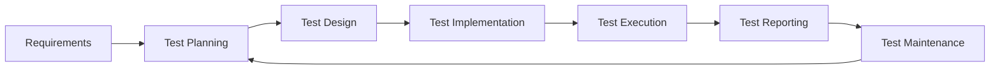
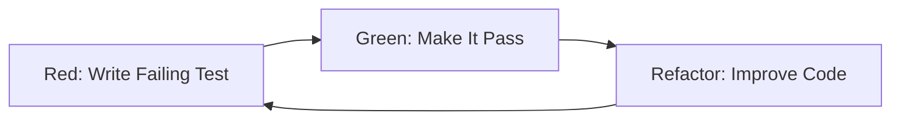
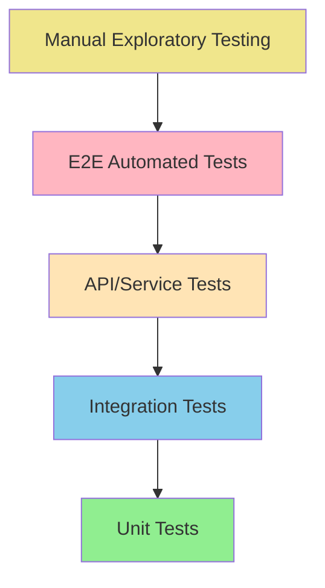
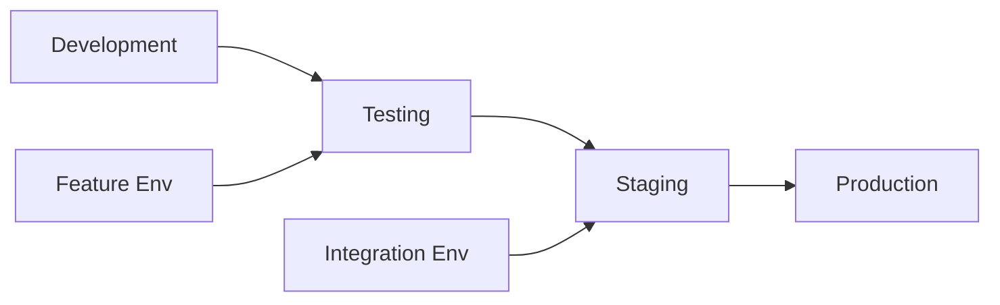

3# Testing Strategy

## Purpose
Develop a comprehensive testing strategy that implements shift-left and shift-right approaches to ensure quality throughout the software development lifecycle.

## Context
Testing strategy determines how, when, and what to test to achieve optimal quality with efficient resource utilization. It encompasses the entire spectrum from unit tests to production monitoring.

## Prerequisites
- Understanding of [Quality Foundations](../00-foundations/README.md)
- Knowledge of [Requirements Engineering](../01-requirements/README.md)
- Familiarity with development lifecycle

## Testing Strategy Overview



## The Testing Pyramid

### Traditional Testing Pyramid

```
         ╱╲          E2E Tests
        ╱  ╲         (Few, High Cost)
       ╱    ╲        ~5% of tests
      ╱──────╲
     ╱ API/   ╲      Integration Tests
    ╱Integration╲     (Moderate Cost)
   ╱   Tests    ╲    ~15% of tests
  ╱──────────────╲
 ╱   Unit Tests   ╲  Unit Tests
╱                 ╲  (Many, Low Cost)
└───────────────────┘ ~80% of tests
```

### Modern Testing Pyramid Considerations

**Testing Honeycomb (Alternative)**
```
    ╱───────╲
   ╱ E2E     ╲
  ╱  Tests   ╲
 ╱───────────╲
╱             ╲
│ Integration │ Contract
│   Tests     │  Tests
│             │
╰─────────────╯
│ Unit Tests  │
╰─────────────╯
```

**Key Principles:**
1. **Fast Feedback**: Unit tests provide immediate feedback
2. **Cost Efficiency**: Lower level tests are cheaper to maintain
3. **Confidence**: Higher level tests provide system confidence
4. **Coverage**: Different levels test different aspects

## Shift-Left Testing

### Concept
Move testing activities earlier in the development lifecycle to find and fix defects sooner when they're cheaper to resolve.

### Implementation Strategies

#### Test-Driven Development (TDD)

**Red-Green-Refactor Cycle:**


**TDD Process:**
```javascript
// 1. Write failing test first
describe('Calculator', () => {
  it('should add two numbers', () => {
    const calc = new Calculator();
    expect(calc.add(2, 3)).toBe(5);
  });
});

// 2. Write minimal code to pass
class Calculator {
  add(a, b) {
    return a + b;
  }
}

// 3. Refactor if needed
class Calculator {
  add(a, b) {
    if (typeof a !== 'number' || typeof b !== 'number') {
      throw new Error('Both arguments must be numbers');
    }
    return a + b;
  }
}
```

#### Behavior-Driven Development (BDD)

**BDD Scenario Format:**
```gherkin
Feature: User Login
  As a registered user
  I want to log into the system
  So that I can access my account

Scenario: Successful login with valid credentials
  Given I am on the login page
  And I have a valid account
  When I enter correct username and password
  And I click the login button
  Then I should be redirected to the dashboard
  And I should see a welcome message

Scenario: Failed login with invalid credentials
  Given I am on the login page
  When I enter incorrect username or password
  And I click the login button
  Then I should see an error message
  And I should remain on the login page
```

#### Static Analysis Integration

**Early Quality Gates:**
```yaml
# .github/workflows/quality-gates.yml
name: Quality Gates
on: [push, pull_request]

jobs:
  static-analysis:
    runs-on: ubuntu-latest
    steps:
      - uses: actions/checkout@v3

      - name: Lint Code
        run: npm run lint

      - name: Security Scan
        run: npm audit

      - name: Type Check
        run: npm run type-check

      - name: Code Quality
        run: sonar-scanner
```

### Shift-Left Benefits

| Aspect | Traditional | Shift-Left |
|--------|-------------|------------|
| Bug Discovery | End of cycle | Start of cycle |
| Fix Cost | High | Low |
| Feedback Speed | Slow | Fast |
| Developer Confidence | Low | High |
| Technical Debt | Accumulates | Prevented |

## Shift-Right Testing

### Concept
Extend testing into production to validate real-world behavior and user experience.

### Production Testing Strategies

#### Feature Flags

**Implementation Example:**
```javascript
// Feature flag service
class FeatureFlags {
  isEnabled(flag, userId) {
    const user = this.getUser(userId);
    const rollout = this.getRolloutConfig(flag);

    // Gradual rollout based on user attributes
    if (rollout.percentage < 100) {
      const hash = this.hashUserId(userId, flag);
      return hash < rollout.percentage;
    }

    return rollout.enabled;
  }
}

// Usage in application
if (featureFlags.isEnabled('new-checkout', user.id)) {
  return newCheckoutFlow();
} else {
  return legacyCheckoutFlow();
}
```

#### Canary Deployments

**Deployment Strategy:**
```yaml
# Canary deployment configuration
canary:
  steps:
    - setWeight: 10  # 10% of traffic
    - pause: {duration: 5m}
    - analysis:
        templates:
          - templateName: success-rate
        args:
          - name: service-name
            value: myapp
    - setWeight: 50  # 50% of traffic
    - pause: {duration: 5m}
    - analysis:
        templates:
          - templateName: success-rate
          - templateName: latency
    - setWeight: 100 # Full rollout
```

#### A/B Testing

**A/B Test Framework:**
```javascript
class ABTest {
  constructor(experimentId, variations) {
    this.experimentId = experimentId;
    this.variations = variations;
  }

  getVariation(userId) {
    const bucket = this.getBucket(userId);
    const variation = this.variations.find(v =>
      bucket >= v.trafficStart && bucket < v.trafficEnd
    );

    // Track assignment
    this.trackAssignment(userId, variation.id);

    return variation;
  }

  trackConversion(userId, event) {
    // Track conversion for analysis
    this.analytics.track(userId, this.experimentId, event);
  }
}

// Usage
const checkoutTest = new ABTest('checkout-flow', [
  { id: 'control', trafficStart: 0, trafficEnd: 50 },
  { id: 'variant', trafficStart: 50, trafficEnd: 100 }
]);

const variation = checkoutTest.getVariation(user.id);
if (variation.id === 'variant') {
  renderNewCheckout();
} else {
  renderExistingCheckout();
}
```

#### Synthetic Monitoring

**Synthetic Test Example:**
```javascript
// Synthetic user journey
describe('User Journey: Purchase Flow', () => {
  it('should complete purchase successfully', async () => {
    const page = await browser.newPage();

    // Navigate to product
    await page.goto('/products/laptop');
    await page.click('[data-testid="add-to-cart"]');

    // Go to checkout
    await page.click('[data-testid="checkout"]');

    // Fill shipping info
    await page.fill('#email', 'test@example.com');
    await page.fill('#address', '123 Main St');

    // Complete purchase
    await page.click('[data-testid="complete-order"]');

    // Verify success
    await expect(page.locator('.success-message')).toBeVisible();

    // Check real metrics
    const responseTime = await page.evaluate(() =>
      performance.timing.loadEventEnd - performance.timing.navigationStart
    );
    expect(responseTime).toBeLessThan(3000);
  });
});
```

#### Real User Monitoring (RUM)

**RUM Implementation:**
```javascript
// Client-side monitoring
class RumCollector {
  constructor() {
    this.metrics = {};
    this.startTime = performance.now();
  }

  trackPageLoad() {
    window.addEventListener('load', () => {
      const navigation = performance.getEntriesByType('navigation')[0];
      this.sendMetric('page_load_time', navigation.loadEventEnd);
      this.sendMetric('dom_content_loaded', navigation.domContentLoadedEventEnd);
    });
  }

  trackUserInteraction(element, action) {
    const startTime = performance.now();
    element.addEventListener(action, () => {
      const duration = performance.now() - startTime;
      this.sendMetric(`${action}_response_time`, duration);
    });
  }

  trackError() {
    window.addEventListener('error', (event) => {
      this.sendMetric('javascript_error', {
        message: event.message,
        filename: event.filename,
        lineno: event.lineno,
        stack: event.error?.stack
      });
    });
  }

  sendMetric(name, value) {
    fetch('/api/metrics', {
      method: 'POST',
      body: JSON.stringify({ name, value, timestamp: Date.now() })
    });
  }
}

// Initialize monitoring
const rum = new RumCollector();
rum.trackPageLoad();
rum.trackError();
rum.trackUserInteraction(document.querySelector('#checkout-button'), 'click');
```

## Testing Automation Strategy

### Test Automation Pyramid



### Automation Criteria

**Good Candidates for Automation:**
- Repetitive tests
- High-risk areas
- Regression testing
- Data-driven tests
- Performance tests

**Poor Candidates for Automation:**
- One-time tests
- Usability testing
- Ad-hoc testing
- Complex UI interactions
- Tests requiring human judgment

### Test Automation Framework Design

```javascript
// Base test framework structure
class TestFramework {
  constructor() {
    this.config = this.loadConfig();
    this.logger = new Logger();
    this.reporter = new Reporter();
  }

  async setup() {
    await this.setupEnvironment();
    await this.prepareTestData();
    await this.initializeDrivers();
  }

  async teardown() {
    await this.cleanupTestData();
    await this.closeDrivers();
    await this.generateReports();
  }

  async runTest(testCase) {
    try {
      await this.setup();
      await testCase.execute();
      this.reporter.recordPass(testCase);
    } catch (error) {
      this.logger.error(error);
      this.reporter.recordFail(testCase, error);
      await this.captureScreenshot();
    } finally {
      await this.teardown();
    }
  }
}
```

## Test Data Management

### Test Data Strategies

#### Synthetic Data Generation

```javascript
// Test data factory
class UserFactory {
  static create(overrides = {}) {
    return {
      id: faker.datatype.uuid(),
      firstName: faker.name.firstName(),
      lastName: faker.name.lastName(),
      email: faker.internet.email(),
      dateOfBirth: faker.date.past(30),
      address: {
        street: faker.address.streetAddress(),
        city: faker.address.city(),
        zipCode: faker.address.zipCode(),
        country: faker.address.country()
      },
      ...overrides
    };
  }

  static createMany(count, overrides = {}) {
    return Array.from({ length: count }, () => this.create(overrides));
  }
}

// Usage
const testUser = UserFactory.create({
  email: 'test@example.com'
});

const testUsers = UserFactory.createMany(10, {
  country: 'USA'
});
```

#### Test Data Isolation

```javascript
// Database transaction approach
describe('User Service', () => {
  let transaction;

  beforeEach(async () => {
    transaction = await db.transaction();
  });

  afterEach(async () => {
    await transaction.rollback();
  });

  it('should create user', async () => {
    const userData = UserFactory.create();
    const user = await userService.create(userData, { transaction });

    expect(user.id).toBeDefined();
    expect(user.email).toBe(userData.email);
  });
});
```

#### Test Data Builders

```javascript
// Builder pattern for complex objects
class OrderBuilder {
  constructor() {
    this.order = {
      items: [],
      customer: null,
      shippingAddress: null,
      billingAddress: null,
      paymentMethod: null
    };
  }

  withCustomer(customer) {
    this.order.customer = customer;
    return this;
  }

  withItem(product, quantity = 1) {
    this.order.items.push({ product, quantity });
    return this;
  }

  withShipping(address) {
    this.order.shippingAddress = address;
    return this;
  }

  build() {
    return { ...this.order };
  }
}

// Usage
const order = new OrderBuilder()
  .withCustomer(testCustomer)
  .withItem(laptop, 1)
  .withItem(mouse, 2)
  .withShipping(testAddress)
  .build();
```

## Risk-Based Testing

### Risk Assessment Matrix

| Probability | Low Impact | Medium Impact | High Impact |
|-------------|------------|---------------|-------------|
| High | Medium Risk | High Risk | Critical Risk |
| Medium | Low Risk | Medium Risk | High Risk |
| Low | Low Risk | Low Risk | Medium Risk |

### Risk Factors

**Technical Risks:**
- New technology
- Complex algorithms
- Third-party integrations
- Performance requirements
- Security requirements

**Business Risks:**
- Revenue impact
- Compliance requirements
- User safety
- Reputation damage
- Data loss

### Risk-Based Test Prioritization

```javascript
// Risk scoring system
class RiskAssessment {
  calculateRisk(feature) {
    const probability = this.assessProbability(feature);
    const impact = this.assessImpact(feature);

    return {
      score: probability * impact,
      priority: this.getPriority(probability * impact),
      recommendations: this.getRecommendations(probability, impact)
    };
  }

  assessProbability(feature) {
    let score = 0;

    if (feature.isNew) score += 3;
    if (feature.complexity === 'high') score += 3;
    if (feature.hasThirdPartyDeps) score += 2;
    if (feature.changeFrequency === 'high') score += 2;

    return Math.min(score, 5); // Cap at 5
  }

  assessImpact(feature) {
    let score = 0;

    if (feature.affectsRevenue) score += 5;
    if (feature.hasSecurityImplications) score += 4;
    if (feature.affectsUserData) score += 3;
    if (feature.hasComplianceRequirements) score += 3;

    return Math.min(score, 5); // Cap at 5
  }

  getPriority(riskScore) {
    if (riskScore >= 20) return 'Critical';
    if (riskScore >= 12) return 'High';
    if (riskScore >= 6) return 'Medium';
    return 'Low';
  }
}
```

## Performance Testing Strategy

### Performance Test Types

#### Load Testing
```javascript
// Load test configuration
const loadTestConfig = {
  scenarios: {
    normal_load: {
      executor: 'ramping-vus',
      startVUs: 0,
      stages: [
        { duration: '5m', target: 100 }, // Ramp up
        { duration: '10m', target: 100 }, // Stay at 100 users
        { duration: '5m', target: 0 }, // Ramp down
      ],
    }
  },
  thresholds: {
    http_req_duration: ['p(95)<500'], // 95% of requests under 500ms
    http_req_failed: ['rate<0.01'], // Error rate under 1%
  }
};
```

#### Stress Testing
```javascript
const stressTestConfig = {
  scenarios: {
    stress_test: {
      executor: 'ramping-vus',
      stages: [
        { duration: '2m', target: 100 },
        { duration: '5m', target: 100 },
        { duration: '2m', target: 200 },
        { duration: '5m', target: 200 },
        { duration: '2m', target: 300 },
        { duration: '5m', target: 300 }, // Breaking point
        { duration: '10m', target: 0 },
      ],
    }
  }
};
```

#### Spike Testing
```javascript
const spikeTestConfig = {
  scenarios: {
    spike_test: {
      executor: 'ramping-vus',
      stages: [
        { duration: '10s', target: 100 },
        { duration: '1m', target: 100 },
        { duration: '10s', target: 1400 }, // Sudden spike
        { duration: '3m', target: 1400 },
        { duration: '10s', target: 100 },
        { duration: '3m', target: 100 },
        { duration: '10s', target: 0 },
      ],
    }
  }
};
```

## Security Testing Strategy

### Security Testing Types

#### Static Application Security Testing (SAST)

```yaml
# SAST in CI/CD pipeline
sast_scan:
  stage: security
  script:
    - sonar-scanner
    - semgrep --config=auto
    - bandit -r src/
  artifacts:
    reports:
      sast: gl-sast-report.json
  rules:
    - if: $CI_COMMIT_BRANCH == "main"
    - if: $CI_PIPELINE_SOURCE == "merge_request_event"
```

#### Dynamic Application Security Testing (DAST)

```yaml
# DAST configuration
dast:
  stage: security
  image: registry.gitlab.com/gitlab-org/security-products/dast:latest
  variables:
    DAST_WEBSITE: https://staging.example.com
    DAST_FULL_SCAN_ENABLED: "true"
  artifacts:
    reports:
      dast: gl-dast-report.json
```

#### Penetration Testing Checklist

```markdown
## OWASP Top 10 Testing Checklist

### A1: Injection
- [ ] SQL injection testing
- [ ] NoSQL injection testing
- [ ] Command injection testing
- [ ] LDAP injection testing

### A2: Broken Authentication
- [ ] Weak password policies
- [ ] Session management flaws
- [ ] Multi-factor authentication bypass
- [ ] Credential stuffing

### A3: Sensitive Data Exposure
- [ ] Data encryption at rest
- [ ] Data encryption in transit
- [ ] Sensitive data in logs
- [ ] PII handling

### A4: XML External Entities (XXE)
- [ ] XML parser configuration
- [ ] File inclusion attacks
- [ ] SSRF via XXE

### A5: Broken Access Control
- [ ] Horizontal privilege escalation
- [ ] Vertical privilege escalation
- [ ] Direct object references
- [ ] Missing access controls

### A6: Security Misconfiguration
- [ ] Default accounts
- [ ] Unnecessary services
- [ ] Error handling
- [ ] Security headers

### A7: Cross-Site Scripting (XSS)
- [ ] Reflected XSS
- [ ] Stored XSS
- [ ] DOM-based XSS
- [ ] Input sanitization

### A8: Insecure Deserialization
- [ ] Deserialization of untrusted data
- [ ] Object injection
- [ ] Remote code execution

### A9: Using Components with Known Vulnerabilities
- [ ] Dependency scanning
- [ ] Version management
- [ ] Security patches

### A10: Insufficient Logging & Monitoring
- [ ] Security event logging
- [ ] Log integrity
- [ ] Monitoring and alerting
- [ ] Incident response
```

## Test Environment Management

### Environment Strategy



### Environment Configuration

```yaml
# Environment configuration
environments:
  development:
    database_url: "postgres://localhost:5432/myapp_dev"
    api_url: "http://localhost:3000"
    log_level: "debug"
    cache_enabled: false

  testing:
    database_url: "postgres://localhost:5432/myapp_test"
    api_url: "http://localhost:3001"
    log_level: "error"
    cache_enabled: false

  staging:
    database_url: "${STAGING_DB_URL}"
    api_url: "https://staging-api.example.com"
    log_level: "info"
    cache_enabled: true

  production:
    database_url: "${PROD_DB_URL}"
    api_url: "https://api.example.com"
    log_level: "warn"
    cache_enabled: true
```

## Test Metrics and Reporting

### Key Testing Metrics

| Metric | Formula | Target |
|--------|---------|--------|
| Test Coverage | (Tested Lines / Total Lines) × 100 | > 80% |
| Test Pass Rate | (Passed Tests / Total Tests) × 100 | > 95% |
| Defect Density | Defects / KLOC | < 1 |
| Test Effectiveness | (Defects Found by Tests / Total Defects) × 100 | > 80% |
| Test Automation | (Automated Tests / Total Tests) × 100 | > 70% |

### Test Reporting Dashboard

```javascript
// Test metrics collector
class TestMetrics {
  constructor() {
    this.results = [];
  }

  recordTestResult(test) {
    this.results.push({
      name: test.name,
      status: test.status,
      duration: test.duration,
      timestamp: new Date(),
      category: test.category
    });
  }

  generateReport() {
    const total = this.results.length;
    const passed = this.results.filter(r => r.status === 'passed').length;
    const failed = this.results.filter(r => r.status === 'failed').length;

    return {
      summary: {
        total,
        passed,
        failed,
        passRate: (passed / total) * 100,
        avgDuration: this.results.reduce((sum, r) => sum + r.duration, 0) / total
      },
      trends: this.calculateTrends(),
      categories: this.groupByCategory()
    };
  }
}
```

## Checklist

### Testing Strategy Checklist

**Strategy Definition:**
- [ ] Testing objectives defined
- [ ] Risk assessment completed
- [ ] Test levels identified
- [ ] Entry/exit criteria set
- [ ] Resource allocation planned

**Test Design:**
- [ ] Test cases designed
- [ ] Test data prepared
- [ ] Environment setup
- [ ] Automation framework ready
- [ ] Test schedule created

**Test Execution:**
- [ ] Test environment validated
- [ ] Test execution tracked
- [ ] Defects logged and tracked
- [ ] Test results documented
- [ ] Metrics collected

**Test Reporting:**
- [ ] Test summary report
- [ ] Coverage analysis
- [ ] Quality metrics
- [ ] Recommendations
- [ ] Lessons learned

## References

### Standards
- ISO/IEC/IEEE 29119 - Software Testing
- IEEE 829 - Test Documentation
- ISTQB - Testing Qualifications

### Frameworks
- Selenium - Web automation
- Cypress - Modern web testing
- Jest - JavaScript testing
- JUnit - Java testing
- pytest - Python testing

### Books
- "The Art of Software Testing" - Glenford Myers
- "Growing Object-Oriented Software, Guided by Tests" - Freeman & Pryce
- "Continuous Delivery" - Humble & Farley

## Related Topics

- [Test Levels](../05-test-levels/README.md)
- [Quality Attributes](../06-quality-attributes/README.md)
- [Development Practices](../07-development-practices/README.md)
- [CI/CD Pipeline](../08-cicd-pipeline/README.md)

---

*Next: [Shift-Left Approach](shift-left-approach.md) - Deep dive into early testing*