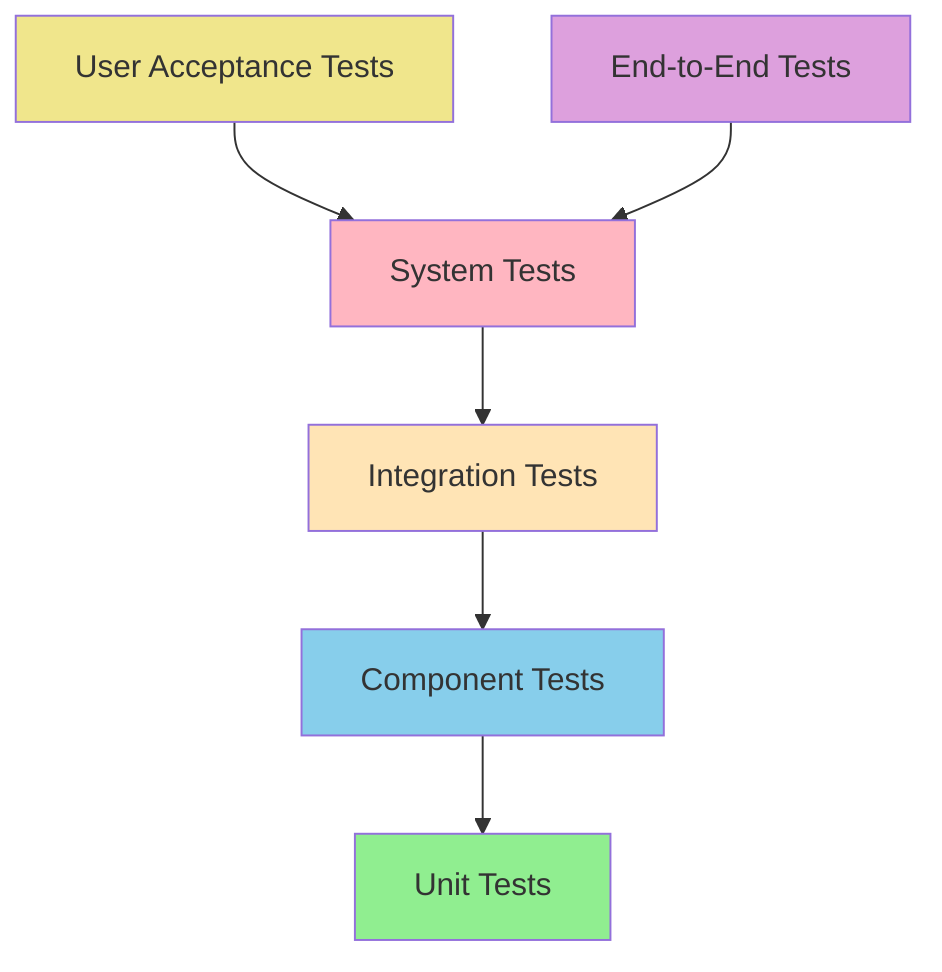

# Test Levels

## Purpose
Comprehensive guide to different levels of testing from unit tests to end-to-end tests, providing specific techniques, best practices, and implementation patterns for each level.

## Context
Test levels define the scope and focus of testing activities, from individual components to complete system behavior. Each level serves specific purposes in the overall quality strategy.

## Prerequisites
- Understanding of [Testing Strategy](../04-testing-strategy/README.md)
- Basic programming knowledge
- Familiarity with software architecture

## Test Levels Overview



## Unit Testing

### Definition
Testing individual components or modules in isolation to verify they behave as expected for given inputs.

### Characteristics
- **Scope**: Single function, method, or class
- **Dependencies**: Mocked or stubbed
- **Execution**: Fast (milliseconds)
- **Feedback**: Immediate
- **Environment**: Developer machine

### Unit Testing Best Practices

#### Test Structure (AAA Pattern)

```javascript
// Arrange - Set up test data and conditions
// Act - Execute the code under test
// Assert - Verify the results

describe('Calculator', () => {
  it('should add two positive numbers correctly', () => {
    // Arrange
    const calculator = new Calculator();
    const a = 5;
    const b = 3;
    const expected = 8;

    // Act
    const result = calculator.add(a, b);

    // Assert
    expect(result).toBe(expected);
  });
});
```

#### Test Naming Conventions

```javascript
// Bad: Vague test names
it('should work')
it('should be valid')
it('should return correct value')

// Good: Descriptive test names
it('should return sum when adding two positive numbers')
it('should throw error when dividing by zero')
it('should return empty array when no items match filter')

// Pattern: should_[expected behavior]_when_[condition]
it('should_return_true_when_user_has_admin_role')
it('should_throw_exception_when_email_is_invalid')
```

#### Mocking and Stubbing

```javascript
// Dependency injection for testability
class UserService {
  constructor(userRepository, emailService) {
    this.userRepository = userRepository;
    this.emailService = emailService;
  }

  async createUser(userData) {
    // Validate user data
    if (!this.isValidEmail(userData.email)) {
      throw new Error('Invalid email format');
    }

    // Save user
    const user = await this.userRepository.save(userData);

    // Send welcome email
    await this.emailService.sendWelcomeEmail(user.email);

    return user;
  }
}

// Unit test with mocks
describe('UserService', () => {
  let userService;
  let mockUserRepository;
  let mockEmailService;

  beforeEach(() => {
    mockUserRepository = {
      save: jest.fn()
    };
    mockEmailService = {
      sendWelcomeEmail: jest.fn()
    };
    userService = new UserService(mockUserRepository, mockEmailService);
  });

  it('should create user and send welcome email', async () => {
    // Arrange
    const userData = { email: 'test@example.com', name: 'John Doe' };
    const savedUser = { id: 1, ...userData };
    mockUserRepository.save.mockResolvedValue(savedUser);

    // Act
    const result = await userService.createUser(userData);

    // Assert
    expect(mockUserRepository.save).toHaveBeenCalledWith(userData);
    expect(mockEmailService.sendWelcomeEmail).toHaveBeenCalledWith(userData.email);
    expect(result).toEqual(savedUser);
  });

  it('should throw error for invalid email', async () => {
    // Arrange
    const userData = { email: 'invalid-email', name: 'John Doe' };

    // Act & Assert
    await expect(userService.createUser(userData))
      .rejects.toThrow('Invalid email format');

    expect(mockUserRepository.save).not.toHaveBeenCalled();
    expect(mockEmailService.sendWelcomeEmail).not.toHaveBeenCalled();
  });
});
```

#### Property-Based Testing

```javascript
// Property-based testing with hypothesis
const fc = require('fast-check');

describe('Calculator Properties', () => {
  it('addition should be commutative', () => {
    fc.assert(fc.property(fc.integer(), fc.integer(), (a, b) => {
      const calculator = new Calculator();
      return calculator.add(a, b) === calculator.add(b, a);
    }));
  });

  it('addition should be associative', () => {
    fc.assert(fc.property(fc.integer(), fc.integer(), fc.integer(), (a, b, c) => {
      const calculator = new Calculator();
      const result1 = calculator.add(calculator.add(a, b), c);
      const result2 = calculator.add(a, calculator.add(b, c));
      return result1 === result2;
    }));
  });
});
```

### Unit Test Coverage

#### Coverage Types

```javascript
// Line coverage
function calculateDiscount(price, customerType) {
  if (customerType === 'premium') {  // Line 1
    return price * 0.9;              // Line 2
  }
  return price;                      // Line 3
}

// 100% line coverage needs tests for both branches

// Branch coverage
function getShippingCost(weight, destination) {
  if (weight > 10 && destination === 'international') {
    return 50;
  } else if (weight > 10) {
    return 20;
  } else if (destination === 'international') {
    return 30;
  }
  return 10;
}

// 100% branch coverage needs tests for all combinations

// Function coverage
class OrderProcessor {
  processOrder() { /* implementation */ }
  cancelOrder() { /* implementation */ }
  refundOrder() { /* implementation */ }
}

// 100% function coverage needs to call all methods
```

#### Coverage Configuration

```json
// jest.config.js
module.exports = {
  collectCoverage: true,
  coverageDirectory: 'coverage',
  coverageReporters: ['text', 'lcov', 'html'],
  coverageThreshold: {
    global: {
      branches: 80,
      functions: 80,
      lines: 80,
      statements: 80
    }
  },
  collectCoverageFrom: [
    'src/**/*.js',
    '!src/**/*.test.js',
    '!src/**/index.js'
  ]
};
```

## Integration Testing

### Definition
Testing the interfaces and interaction between integrated components to detect interface defects.

### Types of Integration Testing

#### Component Integration Testing

```javascript
// Testing service layer integration
describe('OrderService Integration', () => {
  let orderService;
  let database;

  beforeEach(async () => {
    // Use real database with test data
    database = await createTestDatabase();
    orderService = new OrderService(database);
  });

  afterEach(async () => {
    await cleanupTestDatabase(database);
  });

  it('should create order with valid items', async () => {
    // Arrange
    const customer = await database.customers.create({
      email: 'test@example.com'
    });
    const product = await database.products.create({
      name: 'Laptop',
      price: 1000
    });

    // Act
    const order = await orderService.createOrder({
      customerId: customer.id,
      items: [{ productId: product.id, quantity: 1 }]
    });

    // Assert
    expect(order.id).toBeDefined();
    expect(order.total).toBe(1000);

    // Verify database state
    const savedOrder = await database.orders.findById(order.id);
    expect(savedOrder).toBeTruthy();
  });
});
```

#### API Integration Testing

```javascript
// Testing API endpoints
describe('User API Integration', () => {
  let app;
  let request;

  beforeAll(async () => {
    app = await createTestApp();
    request = supertest(app);
  });

  describe('POST /users', () => {
    it('should create user with valid data', async () => {
      const userData = {
        email: 'test@example.com',
        name: 'John Doe',
        password: 'securePassword123'
      };

      const response = await request
        .post('/users')
        .send(userData)
        .expect(201);

      expect(response.body.id).toBeDefined();
      expect(response.body.email).toBe(userData.email);
      expect(response.body.password).toBeUndefined(); // Not returned
    });

    it('should reject invalid email format', async () => {
      const userData = {
        email: 'invalid-email',
        name: 'John Doe',
        password: 'securePassword123'
      };

      const response = await request
        .post('/users')
        .send(userData)
        .expect(400);

      expect(response.body.error).toContain('Invalid email format');
    });
  });

  describe('GET /users/:id', () => {
    it('should return user by id', async () => {
      // Create test user
      const user = await createTestUser();

      const response = await request
        .get(`/users/${user.id}`)
        .expect(200);

      expect(response.body.id).toBe(user.id);
      expect(response.body.email).toBe(user.email);
    });

    it('should return 404 for non-existent user', async () => {
      await request
        .get('/users/999999')
        .expect(404);
    });
  });
});
```

#### Database Integration Testing

```javascript
// Database integration with transactions
describe('UserRepository Integration', () => {
  let repository;
  let transaction;

  beforeEach(async () => {
    transaction = await database.transaction();
    repository = new UserRepository(transaction);
  });

  afterEach(async () => {
    await transaction.rollback();
  });

  it('should save and retrieve user', async () => {
    // Arrange
    const userData = {
      email: 'test@example.com',
      name: 'John Doe'
    };

    // Act
    const savedUser = await repository.save(userData);
    const retrievedUser = await repository.findById(savedUser.id);

    // Assert
    expect(retrievedUser.id).toBe(savedUser.id);
    expect(retrievedUser.email).toBe(userData.email);
    expect(retrievedUser.createdAt).toBeDefined();
  });

  it('should enforce unique email constraint', async () => {
    // Arrange
    const userData = { email: 'test@example.com', name: 'John Doe' };

    // Act & Assert
    await repository.save(userData);
    await expect(repository.save(userData))
      .rejects.toThrow('Email already exists');
  });
});
```

### Third-Party Integration Testing

```javascript
// Testing external service integration
describe('PaymentService Integration', () => {
  let paymentService;

  beforeEach(() => {
    paymentService = new PaymentService({
      apiKey: process.env.TEST_PAYMENT_API_KEY,
      baseUrl: 'https://api.sandbox.payment.com'
    });
  });

  it('should process payment successfully', async () => {
    const paymentRequest = {
      amount: 1000,
      currency: 'USD',
      cardToken: 'test_card_token',
      description: 'Test payment'
    };

    const result = await paymentService.processPayment(paymentRequest);

    expect(result.status).toBe('completed');
    expect(result.transactionId).toBeDefined();
    expect(result.amount).toBe(paymentRequest.amount);
  });

  it('should handle payment failure gracefully', async () => {
    const paymentRequest = {
      amount: 1000,
      currency: 'USD',
      cardToken: 'invalid_card_token',
      description: 'Test payment'
    };

    await expect(paymentService.processPayment(paymentRequest))
      .rejects.toThrow('Payment declined');
  });
});
```

## Component Testing

### Definition
Testing individual components in isolation with their dependencies mocked, focusing on component behavior and contracts.

### Frontend Component Testing

```javascript
// React component testing
import { render, screen, fireEvent, waitFor } from '@testing-library/react';
import userEvent from '@testing-library/user-event';
import { UserProfile } from './UserProfile';

describe('UserProfile Component', () => {
  const mockUser = {
    id: 1,
    name: 'John Doe',
    email: 'john@example.com',
    avatar: 'https://example.com/avatar.jpg'
  };

  it('should display user information', () => {
    render(<UserProfile user={mockUser} />);

    expect(screen.getByText('John Doe')).toBeInTheDocument();
    expect(screen.getByText('john@example.com')).toBeInTheDocument();
    expect(screen.getByAltText('User avatar')).toHaveAttribute('src', mockUser.avatar);
  });

  it('should call onEdit when edit button is clicked', async () => {
    const user = userEvent.setup();
    const mockOnEdit = jest.fn();

    render(<UserProfile user={mockUser} onEdit={mockOnEdit} />);

    await user.click(screen.getByRole('button', { name: 'Edit Profile' }));

    expect(mockOnEdit).toHaveBeenCalledWith(mockUser.id);
  });

  it('should show edit form when in edit mode', () => {
    render(<UserProfile user={mockUser} isEditing={true} />);

    expect(screen.getByLabelText('Name')).toBeInTheDocument();
    expect(screen.getByLabelText('Email')).toBeInTheDocument();
    expect(screen.getByRole('button', { name: 'Save' })).toBeInTheDocument();
  });

  it('should validate form inputs', async () => {
    const user = userEvent.setup();
    const mockOnSave = jest.fn();

    render(
      <UserProfile
        user={mockUser}
        isEditing={true}
        onSave={mockOnSave}
      />
    );

    // Clear name field
    const nameInput = screen.getByLabelText('Name');
    await user.clear(nameInput);

    // Try to save
    await user.click(screen.getByRole('button', { name: 'Save' }));

    expect(screen.getByText('Name is required')).toBeInTheDocument();
    expect(mockOnSave).not.toHaveBeenCalled();
  });

  it('should handle API errors gracefully', async () => {
    const user = userEvent.setup();
    const mockOnSave = jest.fn().mockRejectedValue(new Error('Server error'));

    render(
      <UserProfile
        user={mockUser}
        isEditing={true}
        onSave={mockOnSave}
      />
    );

    await user.click(screen.getByRole('button', { name: 'Save' }));

    await waitFor(() => {
      expect(screen.getByText('Failed to save changes')).toBeInTheDocument();
    });
  });
});
```

### Backend Component Testing

```javascript
// Service component testing
describe('EmailService Component', () => {
  let emailService;
  let mockEmailProvider;
  let mockTemplateEngine;

  beforeEach(() => {
    mockEmailProvider = {
      send: jest.fn().mockResolvedValue({ messageId: 'test-id' })
    };
    mockTemplateEngine = {
      render: jest.fn().mockReturnValue('<html>Test email</html>')
    };

    emailService = new EmailService(mockEmailProvider, mockTemplateEngine);
  });

  it('should send welcome email with correct template', async () => {
    const user = { email: 'test@example.com', name: 'John Doe' };

    await emailService.sendWelcomeEmail(user);

    expect(mockTemplateEngine.render).toHaveBeenCalledWith(
      'welcome',
      { name: user.name }
    );
    expect(mockEmailProvider.send).toHaveBeenCalledWith({
      to: user.email,
      subject: 'Welcome to our platform!',
      html: '<html>Test email</html>'
    });
  });

  it('should retry failed email sends', async () => {
    const user = { email: 'test@example.com', name: 'John Doe' };

    mockEmailProvider.send
      .mockRejectedValueOnce(new Error('Network error'))
      .mockRejectedValueOnce(new Error('Network error'))
      .mockResolvedValueOnce({ messageId: 'test-id' });

    await emailService.sendWelcomeEmail(user);

    expect(mockEmailProvider.send).toHaveBeenCalledTimes(3);
  });

  it('should throw error after max retries exceeded', async () => {
    const user = { email: 'test@example.com', name: 'John Doe' };

    mockEmailProvider.send.mockRejectedValue(new Error('Network error'));

    await expect(emailService.sendWelcomeEmail(user))
      .rejects.toThrow('Failed to send email after 3 attempts');

    expect(mockEmailProvider.send).toHaveBeenCalledTimes(3);
  });
});
```

## System Testing

### Definition
Testing the complete integrated system to verify it meets specified requirements.

### System Test Types

#### Functional System Testing

```javascript
// End-to-end business scenario testing
describe('E-commerce Purchase Flow', () => {
  let browser;
  let page;

  beforeAll(async () => {
    browser = await puppeteer.launch({ headless: false });
  });

  beforeEach(async () => {
    page = await browser.newPage();
    await page.goto('http://localhost:3000');
  });

  afterEach(async () => {
    await page.close();
  });

  afterAll(async () => {
    await browser.close();
  });

  it('should complete full purchase journey', async () => {
    // Browse products
    await page.click('[data-testid="products-link"]');
    await page.waitForSelector('.product-grid');

    // Select product
    await page.click('.product-card:first-child');
    await page.waitForSelector('.product-details');

    // Add to cart
    await page.click('[data-testid="add-to-cart"]');
    await page.waitForSelector('.cart-notification');

    // Verify cart count
    const cartCount = await page.$eval('[data-testid="cart-count"]', el => el.textContent);
    expect(cartCount).toBe('1');

    // Go to checkout
    await page.click('[data-testid="cart-icon"]');
    await page.click('[data-testid="checkout-button"]');

    // Fill shipping information
    await page.fill('[data-testid="email"]', 'test@example.com');
    await page.fill('[data-testid="first-name"]', 'John');
    await page.fill('[data-testid="last-name"]', 'Doe');
    await page.fill('[data-testid="address"]', '123 Main St');
    await page.fill('[data-testid="city"]', 'Anytown');
    await page.fill('[data-testid="zip"]', '12345');

    // Fill payment information
    await page.fill('[data-testid="card-number"]', '4111111111111111');
    await page.fill('[data-testid="expiry"]', '12/25');
    await page.fill('[data-testid="cvv"]', '123');

    // Complete purchase
    await page.click('[data-testid="place-order"]');
    await page.waitForSelector('.order-confirmation');

    // Verify order completion
    const confirmationText = await page.$eval('.order-confirmation h1', el => el.textContent);
    expect(confirmationText).toContain('Order Confirmed');

    // Verify order number exists
    const orderNumber = await page.$eval('[data-testid="order-number"]', el => el.textContent);
    expect(orderNumber).toMatch(/ORD-\d+/);
  });
});
```

#### Performance System Testing

```javascript
// Load testing with Playwright
const { test, expect } = require('@playwright/test');

test.describe('Performance Tests', () => {
  test('homepage should load within 2 seconds', async ({ page }) => {
    const startTime = Date.now();

    await page.goto('/');
    await page.waitForLoadState('networkidle');

    const loadTime = Date.now() - startTime;
    expect(loadTime).toBeLessThan(2000);
  });

  test('search should return results quickly', async ({ page }) => {
    await page.goto('/');

    const startTime = Date.now();
    await page.fill('[data-testid="search-input"]', 'laptop');
    await page.click('[data-testid="search-button"]');
    await page.waitForSelector('.search-results');

    const searchTime = Date.now() - startTime;
    expect(searchTime).toBeLessThan(1000);

    // Verify results are displayed
    const resultCount = await page.$$eval('.product-card', cards => cards.length);
    expect(resultCount).toBeGreaterThan(0);
  });
});
```

#### Security System Testing

```javascript
// Security testing scenarios
describe('Security System Tests', () => {
  it('should prevent SQL injection attacks', async () => {
    const maliciousInput = "'; DROP TABLE users; --";

    const response = await request(app)
      .get('/api/users/search')
      .query({ name: maliciousInput })
      .expect(200);

    // System should handle malicious input safely
    expect(response.body.users).toBeDefined();
    expect(response.body.users).toEqual([]);

    // Verify database integrity
    const userCount = await User.count();
    expect(userCount).toBeGreaterThan(0);
  });

  it('should prevent XSS attacks', async () => {
    const maliciousScript = '<script>alert("XSS")</script>';

    await request(app)
      .post('/api/comments')
      .send({ text: maliciousScript, postId: 1 })
      .expect(201);

    const response = await request(app)
      .get('/api/comments/1')
      .expect(200);

    // Script should be escaped or sanitized
    expect(response.body.text).not.toContain('<script>');
    expect(response.body.text).toContain('&lt;script&gt;');
  });

  it('should enforce authentication on protected endpoints', async () => {
    await request(app)
      .get('/api/admin/users')
      .expect(401);

    await request(app)
      .delete('/api/users/1')
      .expect(401);
  });
});
```

## End-to-End Testing

### Definition
Testing complete user workflows from start to finish to ensure the entire application works as expected from a user's perspective.

### E2E Testing Best Practices

#### Page Object Model

```javascript
// Page object for login page
class LoginPage {
  constructor(page) {
    this.page = page;
    this.emailInput = '[data-testid="email"]';
    this.passwordInput = '[data-testid="password"]';
    this.loginButton = '[data-testid="login-button"]';
    this.errorMessage = '[data-testid="error-message"]';
  }

  async navigate() {
    await this.page.goto('/login');
  }

  async login(email, password) {
    await this.page.fill(this.emailInput, email);
    await this.page.fill(this.passwordInput, password);
    await this.page.click(this.loginButton);
  }

  async getErrorMessage() {
    return await this.page.textContent(this.errorMessage);
  }

  async isDisplayed() {
    return await this.page.isVisible(this.loginButton);
  }
}

// Usage in tests
describe('User Authentication', () => {
  let loginPage;
  let dashboardPage;

  beforeEach(async () => {
    loginPage = new LoginPage(page);
    dashboardPage = new DashboardPage(page);
  });

  it('should login with valid credentials', async () => {
    await loginPage.navigate();
    await loginPage.login('user@example.com', 'password123');

    expect(await dashboardPage.isDisplayed()).toBe(true);
    expect(await dashboardPage.getWelcomeMessage()).toContain('Welcome back');
  });

  it('should show error for invalid credentials', async () => {
    await loginPage.navigate();
    await loginPage.login('invalid@example.com', 'wrongpassword');

    expect(await loginPage.isDisplayed()).toBe(true);
    expect(await loginPage.getErrorMessage()).toContain('Invalid credentials');
  });
});
```

#### Data-Driven Testing

```javascript
// Test data for different scenarios
const testUsers = [
  { type: 'admin', email: 'admin@example.com', password: 'admin123' },
  { type: 'user', email: 'user@example.com', password: 'user123' },
  { type: 'guest', email: 'guest@example.com', password: 'guest123' }
];

describe('User Role Access', () => {
  testUsers.forEach(({ type, email, password }) => {
    it(`should grant appropriate access for ${type} role`, async () => {
      // Login
      await loginPage.login(email, password);

      // Verify role-specific access
      if (type === 'admin') {
        expect(await page.isVisible('[data-testid="admin-panel"]')).toBe(true);
        expect(await page.isVisible('[data-testid="user-management"]')).toBe(true);
      } else if (type === 'user') {
        expect(await page.isVisible('[data-testid="user-dashboard"]')).toBe(true);
        expect(await page.isVisible('[data-testid="admin-panel"]')).toBe(false);
      } else {
        expect(await page.isVisible('[data-testid="guest-content"]')).toBe(true);
        expect(await page.isVisible('[data-testid="user-dashboard"]')).toBe(false);
      }
    });
  });
});
```

#### Cross-Browser Testing

```javascript
// Playwright configuration for multiple browsers
const { devices } = require('@playwright/test');

module.exports = {
  projects: [
    {
      name: 'chromium',
      use: { ...devices['Desktop Chrome'] },
    },
    {
      name: 'firefox',
      use: { ...devices['Desktop Firefox'] },
    },
    {
      name: 'webkit',
      use: { ...devices['Desktop Safari'] },
    },
    {
      name: 'mobile-chrome',
      use: { ...devices['Pixel 5'] },
    },
    {
      name: 'mobile-safari',
      use: { ...devices['iPhone 12'] },
    },
  ],
};

// Browser-specific tests
test.describe('Cross-browser compatibility', () => {
  test('should work consistently across browsers', async ({ page, browserName }) => {
    await page.goto('/');

    // Common functionality that should work everywhere
    await expect(page.locator('h1')).toBeVisible();
    await expect(page.locator('[data-testid="navigation"]')).toBeVisible();

    // Browser-specific adjustments if needed
    if (browserName === 'webkit') {
      // Safari-specific assertions
      await expect(page.locator('.safari-specific-element')).toBeVisible();
    }
  });
});
```

## Contract Testing

### Definition
Testing the contracts between service consumers and providers to ensure API compatibility.

### Consumer-Driven Contract Testing

```javascript
// Pact consumer test
const { PactV3, MatchersV3 } = require('@pact-foundation/pact');
const { like, eachLike } = MatchersV3;

describe('User API Contract', () => {
  const provider = new PactV3({
    consumer: 'UserUI',
    provider: 'UserAPI'
  });

  it('should get user by id', async () => {
    provider
      .given('user with id 1 exists')
      .uponReceiving('a request for user 1')
      .withRequest({
        method: 'GET',
        path: '/users/1',
        headers: {
          'Authorization': like('Bearer token')
        }
      })
      .willRespondWith({
        status: 200,
        headers: {
          'Content-Type': 'application/json'
        },
        body: {
          id: 1,
          name: like('John Doe'),
          email: like('john@example.com'),
          createdAt: like('2023-01-01T00:00:00Z')
        }
      });

    await provider.executeTest(async (mockServer) => {
      const userService = new UserService(mockServer.url);
      const user = await userService.getUser(1);

      expect(user.id).toBe(1);
      expect(user.name).toBeTruthy();
      expect(user.email).toBeTruthy();
    });
  });

  it('should get list of users', async () => {
    provider
      .given('users exist')
      .uponReceiving('a request for users')
      .withRequest({
        method: 'GET',
        path: '/users'
      })
      .willRespondWith({
        status: 200,
        body: eachLike({
          id: like(1),
          name: like('John Doe'),
          email: like('john@example.com')
        })
      });

    await provider.executeTest(async (mockServer) => {
      const userService = new UserService(mockServer.url);
      const users = await userService.getUsers();

      expect(Array.isArray(users)).toBe(true);
      expect(users.length).toBeGreaterThan(0);
    });
  });
});
```

### Provider Contract Verification

```javascript
// Pact provider verification
const { Verifier } = require('@pact-foundation/pact');

describe('User API Provider', () => {
  it('should satisfy all consumer contracts', async () => {
    const opts = {
      provider: 'UserAPI',
      providerBaseUrl: 'http://localhost:3000',
      pactBrokerUrl: 'https://test.pactflow.io',
      pactBrokerToken: process.env.PACT_BROKER_TOKEN,
      stateHandlers: {
        'user with id 1 exists': async () => {
          // Set up test data
          await User.create({
            id: 1,
            name: 'John Doe',
            email: 'john@example.com'
          });
        },
        'users exist': async () => {
          // Set up test data
          await User.bulkCreate([
            { id: 1, name: 'John Doe', email: 'john@example.com' },
            { id: 2, name: 'Jane Smith', email: 'jane@example.com' }
          ]);
        }
      }
    };

    return new Verifier(opts).verifyProvider();
  });
});
```

## Test Maintenance

### Test Code Quality

```javascript
// Test utilities for maintainability
class TestHelpers {
  static async createTestUser(overrides = {}) {
    return await User.create({
      name: 'Test User',
      email: 'test@example.com',
      password: 'password123',
      ...overrides
    });
  }

  static async createTestOrder(userId, overrides = {}) {
    return await Order.create({
      userId,
      total: 100.00,
      status: 'pending',
      ...overrides
    });
  }

  static async cleanupTestData() {
    await Order.destroy({ where: {} });
    await User.destroy({ where: {} });
  }
}

// Reusable assertions
class CustomMatchers {
  static toBeValidEmail(received) {
    const emailRegex = /^[^\s@]+@[^\s@]+\.[^\s@]+$/;
    const pass = emailRegex.test(received);

    return {
      message: () => `expected ${received} ${pass ? 'not ' : ''}to be a valid email`,
      pass
    };
  }

  static toBeWithinRange(received, min, max) {
    const pass = received >= min && received <= max;

    return {
      message: () => `expected ${received} to be within ${min}-${max}`,
      pass
    };
  }
}

// Register custom matchers
expect.extend(CustomMatchers);
```

### Flaky Test Management

```javascript
// Retry mechanism for flaky tests
const retry = (fn, retries = 3) => {
  return async (...args) => {
    for (let i = 0; i < retries; i++) {
      try {
        return await fn(...args);
      } catch (error) {
        if (i === retries - 1) throw error;
        await new Promise(resolve => setTimeout(resolve, 1000 * (i + 1)));
      }
    }
  };
};

// Usage
it('should handle network delays', retry(async () => {
  const response = await api.getData();
  expect(response.status).toBe(200);
}));

// Wait utilities
class WaitUtils {
  static async waitFor(condition, timeout = 5000) {
    const startTime = Date.now();

    while (Date.now() - startTime < timeout) {
      if (await condition()) {
        return;
      }
      await new Promise(resolve => setTimeout(resolve, 100));
    }

    throw new Error(`Condition not met within ${timeout}ms`);
  }

  static async waitForElement(page, selector, timeout = 5000) {
    await page.waitForSelector(selector, { timeout });
  }

  static async waitForApiResponse(url, expectedStatus = 200, timeout = 5000) {
    await this.waitFor(async () => {
      try {
        const response = await fetch(url);
        return response.status === expectedStatus;
      } catch {
        return false;
      }
    }, timeout);
  }
}
```

## Checklist

### Test Level Implementation Checklist

**Unit Testing:**
- [ ] Tests follow AAA pattern
- [ ] Descriptive test names
- [ ] Proper mocking/stubbing
- [ ] Code coverage > 80%
- [ ] Fast execution (< 1 second)

**Integration Testing:**
- [ ] Database integration tested
- [ ] API endpoints tested
- [ ] Third-party services tested
- [ ] Error handling verified
- [ ] Data isolation maintained

**Component Testing:**
- [ ] Component behavior tested
- [ ] Props and events tested
- [ ] Error states covered
- [ ] Accessibility verified
- [ ] Performance acceptable

**System Testing:**
- [ ] End-to-end workflows tested
- [ ] Cross-browser compatibility
- [ ] Performance requirements met
- [ ] Security vulnerabilities checked
- [ ] Data integrity verified

**Contract Testing:**
- [ ] Consumer contracts defined
- [ ] Provider verification setup
- [ ] API compatibility ensured
- [ ] Schema validation included
- [ ] Version compatibility tested

## References

### Testing Frameworks

| Language | Unit Testing | Integration | E2E |
|----------|--------------|-------------|-----|
| JavaScript | Jest, Mocha | Supertest | Playwright, Cypress |
| Java | JUnit, TestNG | Spring Test | Selenium |
| Python | pytest, unittest | FastAPI TestClient | Selenium |
| C# | NUnit, xUnit | ASP.NET Test | Selenium |

### Tools
- **Pact** - Contract testing
- **Testcontainers** - Integration testing
- **Storybook** - Component testing
- **k6** - Performance testing
- **OWASP ZAP** - Security testing

### Books
- "Growing Object-Oriented Software, Guided by Tests" - Freeman & Pryce
- "The Art of Unit Testing" - Roy Osherove
- "Effective Unit Testing" - Lasse Koskela

## Related Topics

- [Testing Strategy](../04-testing-strategy/README.md)
- [Quality Attributes](../06-quality-attributes/README.md)
- [Development Practices](../07-development-practices/README.md)
- [CI/CD Pipeline](../08-cicd-pipeline/README.md)

---

*Next: [Unit Testing](unit-testing.md) - Deep dive into unit testing*