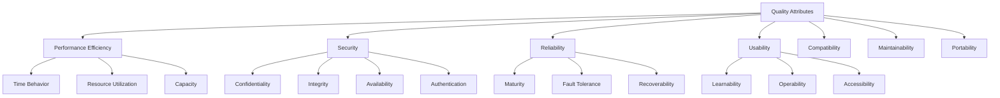

# Quality Attributes

## Purpose
Define, measure, and test non-functional requirements including performance, security, accessibility, and reliability to ensure comprehensive software quality beyond functional correctness.

## Context
Quality attributes determine how well a system performs its functions. While functional testing verifies what the system does, quality attribute testing verifies how well it does it.

## Prerequisites
- Understanding of [Quality Foundations](../00-foundations/README.md)
- Knowledge of [Testing Strategy](../04-testing-strategy/README.md)
- Familiarity with system architecture

## Quality Attributes Overview



## Performance Efficiency

### Time Behavior

**Definition:** Response times, processing times, and throughput rates

#### Response Time Testing

```javascript
// Response time measurement framework
class ResponseTimeMonitor {
  constructor() {
    this.measurements = [];
    this.thresholds = {
      excellent: 100,    // ms
      good: 500,         // ms
      acceptable: 2000,  // ms
      poor: 5000        // ms
    };
  }

  async measureEndpoint(url, method = 'GET', payload = null) {
    const startTime = performance.now();

    try {
      const response = await fetch(url, {
        method,
        body: payload ? JSON.stringify(payload) : null,
        headers: {
          'Content-Type': 'application/json'
        }
      });

      const endTime = performance.now();
      const responseTime = endTime - startTime;

      const measurement = {
        url,
        method,
        responseTime,
        statusCode: response.status,
        timestamp: new Date(),
        category: this.categorizePerformance(responseTime)
      };

      this.measurements.push(measurement);
      return measurement;

    } catch (error) {
      const endTime = performance.now();
      const responseTime = endTime - startTime;

      const measurement = {
        url,
        method,
        responseTime,
        error: error.message,
        timestamp: new Date(),
        category: 'error'
      };

      this.measurements.push(measurement);
      throw error;
    }
  }

  categorizePerformance(responseTime) {
    if (responseTime <= this.thresholds.excellent) return 'excellent';
    if (responseTime <= this.thresholds.good) return 'good';
    if (responseTime <= this.thresholds.acceptable) return 'acceptable';
    if (responseTime <= this.thresholds.poor) return 'poor';
    return 'unacceptable';
  }

  generateReport() {
    if (this.measurements.length === 0) {
      return { error: 'No measurements available' };
    }

    const responseTimes = this.measurements
      .filter(m => !m.error)
      .map(m => m.responseTime);

    return {
      totalRequests: this.measurements.length,
      successfulRequests: responseTimes.length,
      errorRate: ((this.measurements.length - responseTimes.length) / this.measurements.length) * 100,

      responseTimeStats: {
        min: Math.min(...responseTimes),
        max: Math.max(...responseTimes),
        average: responseTimes.reduce((sum, rt) => sum + rt, 0) / responseTimes.length,
        median: this.calculatePercentile(responseTimes, 50),
        p95: this.calculatePercentile(responseTimes, 95),
        p99: this.calculatePercentile(responseTimes, 99)
      },

      categoryDistribution: this.getCategoryDistribution()
    };
  }

  calculatePercentile(sortedArray, percentile) {
    const sorted = [...sortedArray].sort((a, b) => a - b);
    const index = Math.ceil((percentile / 100) * sorted.length) - 1;
    return sorted[Math.max(0, Math.min(index, sorted.length - 1))];
  }

  getCategoryDistribution() {
    const distribution = {};
    this.measurements.forEach(measurement => {
      const category = measurement.category;
      distribution[category] = (distribution[category] || 0) + 1;
    });
    return distribution;
  }
}

// Usage example
const monitor = new ResponseTimeMonitor();

// Performance test suite
describe('API Performance Tests', () => {
  let responseMonitor;

  beforeEach(() => {
    responseMonitor = new ResponseTimeMonitor();
  });

  it('should respond to user login within acceptable time', async () => {
    const measurement = await responseMonitor.measureEndpoint('/api/auth/login', 'POST', {
      email: 'test@example.com',
      password: 'password123'
    });

    expect(measurement.responseTime).toBeLessThan(2000); // 2 seconds max
    expect(measurement.category).not.toBe('unacceptable');
  });

  it('should handle concurrent users efficiently', async () => {
    const concurrentRequests = 50;
    const promises = [];

    for (let i = 0; i < concurrentRequests; i++) {
      promises.push(responseMonitor.measureEndpoint('/api/products'));
    }

    await Promise.all(promises);
    const report = responseMonitor.generateReport();

    expect(report.responseTimeStats.p95).toBeLessThan(5000); // 95% under 5s
    expect(report.errorRate).toBeLessThan(5); // Less than 5% errors
  });
});
```

#### Load Testing

```javascript
// Load testing with k6-style configuration
const loadTestConfig = {
  scenarios: {
    // Gradual ramp-up test
    ramp_up: {
      executor: 'ramping-vus',
      startVUs: 0,
      stages: [
        { duration: '2m', target: 10 },
        { duration: '5m', target: 50 },
        { duration: '10m', target: 100 },
        { duration: '5m', target: 50 },
        { duration: '2m', target: 0 }
      ]
    },

    // Steady state test
    steady_state: {
      executor: 'constant-vus',
      vus: 100,
      duration: '30m'
    },

    // Spike test
    spike: {
      executor: 'ramping-vus',
      stages: [
        { duration: '1m', target: 100 },
        { duration: '30s', target: 1000 }, // Sudden spike
        { duration: '2m', target: 1000 },
        { duration: '30s', target: 100 },
        { duration: '1m', target: 0 }
      ]
    }
  },

  thresholds: {
    // Response time thresholds
    'http_req_duration': ['p(95)<2000'], // 95% under 2s
    'http_req_duration{endpoint:login}': ['p(99)<5000'], // Login 99% under 5s

    // Error rate thresholds
    'http_req_failed': ['rate<0.05'], // Error rate under 5%

    // Throughput thresholds
    'http_reqs': ['rate>100'], // At least 100 requests/second
  }
};

// Load test implementation
class LoadTestRunner {
  constructor(config) {
    this.config = config;
    this.results = [];
  }

  async runScenario(scenarioName) {
    const scenario = this.config.scenarios[scenarioName];
    console.log(`Running scenario: ${scenarioName}`);

    if (scenario.executor === 'constant-vus') {
      return await this.runConstantLoad(scenario);
    } else if (scenario.executor === 'ramping-vus') {
      return await this.runRampingLoad(scenario);
    }
  }

  async runConstantLoad(scenario) {
    const { vus, duration } = scenario;
    const durationMs = this.parseDuration(duration);
    const startTime = Date.now();

    const users = [];
    for (let i = 0; i < vus; i++) {
      users.push(this.simulateUser(startTime, durationMs));
    }

    await Promise.all(users);
    return this.analyzeResults();
  }

  async simulateUser(startTime, durationMs) {
    while (Date.now() - startTime < durationMs) {
      try {
        const requestStart = performance.now();

        // Simulate user behavior
        await this.makeRequest('/api/products');
        await this.sleep(Math.random() * 1000); // Random think time

        await this.makeRequest('/api/products/1');
        await this.sleep(Math.random() * 2000);

        const requestEnd = performance.now();

        this.results.push({
          responseTime: requestEnd - requestStart,
          timestamp: Date.now(),
          success: true
        });

      } catch (error) {
        this.results.push({
          timestamp: Date.now(),
          success: false,
          error: error.message
        });
      }
    }
  }

  async makeRequest(endpoint) {
    const response = await fetch(`${this.baseUrl}${endpoint}`);
    if (!response.ok) {
      throw new Error(`HTTP ${response.status}`);
    }
    return response.json();
  }

  sleep(ms) {
    return new Promise(resolve => setTimeout(resolve, ms));
  }

  parseDuration(duration) {
    const match = duration.match(/(\d+)([smh])/);
    if (!match) return 0;

    const [, value, unit] = match;
    const multipliers = { s: 1000, m: 60000, h: 3600000 };
    return parseInt(value) * multipliers[unit];
  }
}
```

### Resource Utilization

**Definition:** Efficiency in using system resources (CPU, memory, disk, network)

```javascript
// Resource monitoring
class ResourceMonitor {
  constructor() {
    this.metrics = [];
    this.thresholds = {
      cpu: 80,      // % CPU usage
      memory: 85,   // % Memory usage
      disk: 90,     // % Disk usage
      network: 80   // % Network utilization
    };
  }

  async collectMetrics() {
    const metrics = {
      timestamp: Date.now(),
      cpu: await this.getCPUUsage(),
      memory: await this.getMemoryUsage(),
      disk: await this.getDiskUsage(),
      network: await this.getNetworkUsage()
    };

    this.metrics.push(metrics);
    this.checkThresholds(metrics);

    return metrics;
  }

  async getCPUUsage() {
    // Platform-specific CPU usage collection
    if (process.platform === 'linux') {
      return await this.getLinuxCPUUsage();
    } else if (process.platform === 'win32') {
      return await this.getWindowsCPUUsage();
    } else {
      return await this.getGenericCPUUsage();
    }
  }

  async getLinuxCPUUsage() {
    const fs = require('fs').promises;

    const stat1 = await fs.readFile('/proc/stat', 'utf8');
    await new Promise(resolve => setTimeout(resolve, 1000));
    const stat2 = await fs.readFile('/proc/stat', 'utf8');

    const parseStats = (data) => {
      const line = data.split('\n')[0];
      const values = line.split(/\s+/).slice(1).map(Number);
      return {
        idle: values[3],
        total: values.reduce((sum, val) => sum + val, 0)
      };
    };

    const stats1 = parseStats(stat1);
    const stats2 = parseStats(stat2);

    const idleDiff = stats2.idle - stats1.idle;
    const totalDiff = stats2.total - stats1.total;

    return Math.round(100 - (idleDiff / totalDiff) * 100);
  }

  async getMemoryUsage() {
    const totalMemory = require('os').totalmem();
    const freeMemory = require('os').freemem();
    const usedMemory = totalMemory - freeMemory;

    return {
      used: Math.round((usedMemory / 1024 / 1024)), // MB
      total: Math.round((totalMemory / 1024 / 1024)), // MB
      percentage: Math.round((usedMemory / totalMemory) * 100)
    };
  }

  checkThresholds(metrics) {
    const alerts = [];

    if (metrics.cpu > this.thresholds.cpu) {
      alerts.push({
        type: 'cpu',
        value: metrics.cpu,
        threshold: this.thresholds.cpu,
        severity: 'warning'
      });
    }

    if (metrics.memory.percentage > this.thresholds.memory) {
      alerts.push({
        type: 'memory',
        value: metrics.memory.percentage,
        threshold: this.thresholds.memory,
        severity: 'warning'
      });
    }

    if (alerts.length > 0) {
      this.handleAlerts(alerts);
    }
  }

  handleAlerts(alerts) {
    alerts.forEach(alert => {
      console.warn(`Resource alert: ${alert.type} usage ${alert.value}% exceeds threshold ${alert.threshold}%`);
    });
  }

  generateResourceReport(timeframe = 3600000) { // Last hour
    const cutoff = Date.now() - timeframe;
    const recentMetrics = this.metrics.filter(m => m.timestamp >= cutoff);

    if (recentMetrics.length === 0) {
      return { error: 'No metrics available' };
    }

    return {
      timeframe: `${timeframe / 60000} minutes`,
      sampleCount: recentMetrics.length,

      cpu: {
        average: this.calculateAverage(recentMetrics, 'cpu'),
        peak: Math.max(...recentMetrics.map(m => m.cpu)),
        violations: recentMetrics.filter(m => m.cpu > this.thresholds.cpu).length
      },

      memory: {
        average: this.calculateAverage(recentMetrics, m => m.memory.percentage),
        peak: Math.max(...recentMetrics.map(m => m.memory.percentage)),
        violations: recentMetrics.filter(m => m.memory.percentage > this.thresholds.memory).length
      }
    };
  }

  calculateAverage(metrics, accessor) {
    const getValue = typeof accessor === 'string'
      ? (m) => m[accessor]
      : accessor;

    const sum = metrics.reduce((total, metric) => total + getValue(metric), 0);
    return Math.round(sum / metrics.length);
  }
}

// Performance testing with resource monitoring
describe('Resource Utilization Tests', () => {
  let resourceMonitor;

  beforeEach(() => {
    resourceMonitor = new ResourceMonitor();
  });

  it('should maintain acceptable resource usage under load', async () => {
    // Start monitoring
    const monitoringInterval = setInterval(async () => {
      await resourceMonitor.collectMetrics();
    }, 5000);

    try {
      // Simulate load
      await simulateHighLoad();

      // Stop monitoring
      clearInterval(monitoringInterval);

      // Analyze results
      const report = resourceMonitor.generateResourceReport();

      expect(report.cpu.average).toBeLessThan(80);
      expect(report.memory.average).toBeLessThan(85);
      expect(report.cpu.violations).toBeLessThan(5); // Less than 5 violations

    } finally {
      clearInterval(monitoringInterval);
    }
  });
});
```

## Security

### Authentication & Authorization

```javascript
// Security testing framework
class SecurityTester {
  constructor(baseUrl) {
    this.baseUrl = baseUrl;
    this.vulnerabilities = [];
  }

  async testAuthentication() {
    const tests = [
      this.testWeakPasswords(),
      this.testBruteForceProtection(),
      this.testSessionManagement(),
      this.testPasswordReset()
    ];

    await Promise.all(tests);
  }

  async testWeakPasswords() {
    const weakPasswords = ['123456', 'password', 'admin', '12345', 'qwerty'];

    for (const password of weakPasswords) {
      try {
        const response = await fetch(`${this.baseUrl}/api/auth/register`, {
          method: 'POST',
          headers: { 'Content-Type': 'application/json' },
          body: JSON.stringify({
            email: 'test@example.com',
            password: password
          })
        });

        if (response.status === 201) {
          this.addVulnerability({
            type: 'weak_password_accepted',
            severity: 'high',
            description: `Weak password "${password}" was accepted`,
            endpoint: '/api/auth/register'
          });
        }

      } catch (error) {
        // Network errors are expected in testing
      }
    }
  }

  async testBruteForceProtection() {
    const attempts = [];
    const maxAttempts = 10;

    for (let i = 0; i < maxAttempts; i++) {
      const start = Date.now();

      try {
        const response = await fetch(`${this.baseUrl}/api/auth/login`, {
          method: 'POST',
          headers: { 'Content-Type': 'application/json' },
          body: JSON.stringify({
            email: 'nonexistent@example.com',
            password: 'wrongpassword'
          })
        });

        const duration = Date.now() - start;
        attempts.push({ status: response.status, duration });

      } catch (error) {
        attempts.push({ error: error.message, duration: Date.now() - start });
      }
    }

    // Check for rate limiting
    const blockedAttempts = attempts.filter(a => a.status === 429).length;
    const increasingDelays = attempts.every((attempt, index) =>
      index === 0 || attempt.duration >= attempts[index - 1].duration
    );

    if (blockedAttempts === 0 && !increasingDelays) {
      this.addVulnerability({
        type: 'no_brute_force_protection',
        severity: 'high',
        description: 'No brute force protection detected',
        endpoint: '/api/auth/login'
      });
    }
  }

  async testSessionManagement() {
    // Test session fixation
    const response1 = await fetch(`${this.baseUrl}/api/auth/session`);
    const sessionId1 = this.extractSessionId(response1);

    // Login
    const loginResponse = await fetch(`${this.baseUrl}/api/auth/login`, {
      method: 'POST',
      headers: {
        'Content-Type': 'application/json',
        'Cookie': `sessionId=${sessionId1}`
      },
      body: JSON.stringify({
        email: 'valid@example.com',
        password: 'validpassword'
      })
    });

    const sessionId2 = this.extractSessionId(loginResponse);

    if (sessionId1 === sessionId2) {
      this.addVulnerability({
        type: 'session_fixation',
        severity: 'medium',
        description: 'Session ID not regenerated after login',
        endpoint: '/api/auth/login'
      });
    }
  }

  async testInputValidation() {
    const injectionPayloads = [
      "' OR '1'='1", // SQL injection
      '<script>alert("xss")</script>', // XSS
      '{{7*7}}', // Template injection
      '../../../etc/passwd', // Path traversal
      'javascript:alert("xss")', // JavaScript injection
    ];

    const endpoints = [
      { url: '/api/users/search', param: 'q' },
      { url: '/api/products', param: 'category' },
      { url: '/api/feedback', param: 'message' }
    ];

    for (const endpoint of endpoints) {
      for (const payload of injectionPayloads) {
        await this.testEndpointWithPayload(endpoint, payload);
      }
    }
  }

  async testEndpointWithPayload(endpoint, payload) {
    try {
      const url = `${this.baseUrl}${endpoint.url}?${endpoint.param}=${encodeURIComponent(payload)}`;
      const response = await fetch(url);
      const text = await response.text();

      // Check if payload is reflected without sanitization
      if (text.includes(payload)) {
        this.addVulnerability({
          type: 'input_validation_missing',
          severity: 'high',
          description: `Unsanitized input reflected in response`,
          endpoint: endpoint.url,
          payload: payload
        });
      }

      // Check for SQL error messages
      const sqlErrors = [
        'mysql_fetch_array',
        'ORA-01756',
        'Microsoft OLE DB Provider',
        'java.sql.SQLException'
      ];

      if (sqlErrors.some(error => text.toLowerCase().includes(error.toLowerCase()))) {
        this.addVulnerability({
          type: 'sql_injection_possible',
          severity: 'critical',
          description: 'SQL error message detected',
          endpoint: endpoint.url,
          payload: payload
        });
      }

    } catch (error) {
      // Expected in some test cases
    }
  }

  async testSecurityHeaders() {
    const response = await fetch(`${this.baseUrl}/`);
    const headers = response.headers;

    const requiredHeaders = {
      'X-Content-Type-Options': 'nosniff',
      'X-Frame-Options': ['DENY', 'SAMEORIGIN'],
      'X-XSS-Protection': '1; mode=block',
      'Strict-Transport-Security': /max-age=\d+/,
      'Content-Security-Policy': /.+/
    };

    Object.entries(requiredHeaders).forEach(([headerName, expectedValue]) => {
      const headerValue = headers.get(headerName);

      if (!headerValue) {
        this.addVulnerability({
          type: 'missing_security_header',
          severity: 'medium',
          description: `Missing security header: ${headerName}`,
          endpoint: '/'
        });
      } else if (Array.isArray(expectedValue)) {
        if (!expectedValue.includes(headerValue)) {
          this.addVulnerability({
            type: 'incorrect_security_header',
            severity: 'low',
            description: `Invalid ${headerName}: ${headerValue}`,
            endpoint: '/'
          });
        }
      } else if (expectedValue instanceof RegExp) {
        if (!expectedValue.test(headerValue)) {
          this.addVulnerability({
            type: 'incorrect_security_header',
            severity: 'low',
            description: `Invalid ${headerName}: ${headerValue}`,
            endpoint: '/'
          });
        }
      }
    });
  }

  addVulnerability(vulnerability) {
    this.vulnerabilities.push({
      ...vulnerability,
      timestamp: new Date(),
      id: this.generateId()
    });
  }

  generateId() {
    return Math.random().toString(36).substr(2, 9);
  }

  generateSecurityReport() {
    const severityCounts = this.vulnerabilities.reduce((acc, vuln) => {
      acc[vuln.severity] = (acc[vuln.severity] || 0) + 1;
      return acc;
    }, {});

    return {
      summary: {
        totalVulnerabilities: this.vulnerabilities.length,
        severityBreakdown: severityCounts,
        riskScore: this.calculateRiskScore()
      },
      vulnerabilities: this.vulnerabilities,
      recommendations: this.generateRecommendations()
    };
  }

  calculateRiskScore() {
    const weights = { critical: 10, high: 7, medium: 4, low: 1 };
    return this.vulnerabilities.reduce((score, vuln) => {
      return score + (weights[vuln.severity] || 0);
    }, 0);
  }

  generateRecommendations() {
    const recommendations = [];
    const vulnTypes = [...new Set(this.vulnerabilities.map(v => v.type))];

    vulnTypes.forEach(type => {
      switch (type) {
        case 'weak_password_accepted':
          recommendations.push('Implement strong password policy with minimum complexity requirements');
          break;
        case 'no_brute_force_protection':
          recommendations.push('Add rate limiting and account lockout mechanisms');
          break;
        case 'session_fixation':
          recommendations.push('Regenerate session IDs after authentication');
          break;
        case 'input_validation_missing':
          recommendations.push('Implement input validation and output encoding');
          break;
        case 'sql_injection_possible':
          recommendations.push('Use parameterized queries and input validation');
          break;
        case 'missing_security_header':
          recommendations.push('Add security headers to prevent common attacks');
          break;
      }
    });

    return recommendations;
  }
}

// Security test suite
describe('Security Tests', () => {
  let securityTester;

  beforeEach(() => {
    securityTester = new SecurityTester(process.env.TEST_BASE_URL);
  });

  it('should have no critical security vulnerabilities', async () => {
    await securityTester.testAuthentication();
    await securityTester.testInputValidation();
    await securityTester.testSecurityHeaders();

    const report = securityTester.generateSecurityReport();

    expect(report.summary.severityBreakdown.critical || 0).toBe(0);
    expect(report.summary.severityBreakdown.high || 0).toBeLessThan(3);
    expect(report.summary.riskScore).toBeLessThan(20);
  });
});
```

## Reliability

### Fault Tolerance

```javascript
// Fault tolerance testing
class FaultToleranceTester {
  constructor(serviceUrl) {
    this.serviceUrl = serviceUrl;
    this.faultScenarios = [];
  }

  async testDatabaseFailure() {
    // Simulate database connection failure
    await this.simulateFault('database', async () => {
      const response = await fetch(`${this.serviceUrl}/api/users`);

      // Service should gracefully degrade
      expect(response.status).not.toBe(500);

      if (response.status === 503) {
        const body = await response.json();
        expect(body).toHaveProperty('message');
        expect(body).toHaveProperty('retryAfter');
      }
    });
  }

  async testExternalServiceFailure() {
    // Test behavior when external payment service is down
    const testOrder = {
      items: [{ id: 1, quantity: 2 }],
      paymentMethod: 'credit_card'
    };

    await this.simulateFault('payment_service', async () => {
      const response = await fetch(`${this.serviceUrl}/api/orders`, {
        method: 'POST',
        headers: { 'Content-Type': 'application/json' },
        body: JSON.stringify(testOrder)
      });

      // Should either succeed with alternative payment or fail gracefully
      if (response.status === 503) {
        const body = await response.json();
        expect(body.message).toContain('payment service temporarily unavailable');
        expect(body).toHaveProperty('alternatives');
      } else {
        expect(response.status).toBe(201);
      }
    });
  }

  async testHighMemoryPressure() {
    // Simulate memory pressure
    const memoryHogs = [];

    try {
      // Consume memory
      for (let i = 0; i < 100; i++) {
        memoryHogs.push(new Array(1000000).fill('memory pressure test'));
      }

      // Test service behavior under memory pressure
      const response = await fetch(`${this.serviceUrl}/api/health`);
      const healthCheck = await response.json();

      // Service should still respond but may indicate degraded performance
      expect(response.status).toBe(200);
      expect(healthCheck).toHaveProperty('status');

      if (healthCheck.status === 'degraded') {
        expect(healthCheck).toHaveProperty('memoryPressure', true);
      }

    } finally {
      // Clean up memory
      memoryHogs.length = 0;
    }
  }

  async testNetworkPartition() {
    // Test behavior during network issues
    const slowNetwork = {
      delay: 5000, // 5 second delay
      dropRate: 0.1 // Drop 10% of packets
    };

    await this.simulateNetworkConditions(slowNetwork, async () => {
      const startTime = Date.now();

      try {
        const response = await fetch(`${this.serviceUrl}/api/products`, {
          timeout: 3000 // 3 second timeout
        });

        const duration = Date.now() - startTime;

        if (response.ok) {
          // If successful, should still be reasonably fast
          expect(duration).toBeLessThan(10000);
        }

      } catch (error) {
        // Timeout errors are acceptable under network stress
        expect(error.name).toBe('AbortError');
      }
    });
  }

  async simulateFault(faultType, testFunction) {
    console.log(`Simulating fault: ${faultType}`);

    const faultStart = Date.now();

    try {
      await testFunction();

      this.faultScenarios.push({
        type: faultType,
        duration: Date.now() - faultStart,
        result: 'handled_gracefully',
        timestamp: new Date()
      });

    } catch (error) {
      this.faultScenarios.push({
        type: faultType,
        duration: Date.now() - faultStart,
        result: 'failed',
        error: error.message,
        timestamp: new Date()
      });

      throw error;
    }
  }

  async simulateNetworkConditions(conditions, testFunction) {
    // In a real implementation, this would use tools like:
    // - Network Link Conditioner (macOS)
    // - tc (Linux traffic control)
    // - Network emulation middleware

    console.log(`Simulating network conditions:`, conditions);
    await testFunction();
  }

  generateReliabilityReport() {
    const successfulTests = this.faultScenarios.filter(s => s.result === 'handled_gracefully');
    const reliabilityScore = (successfulTests.length / this.faultScenarios.length) * 100;

    return {
      summary: {
        totalScenarios: this.faultScenarios.length,
        successfullyHandled: successfulTests.length,
        reliabilityScore: Math.round(reliabilityScore)
      },
      scenarios: this.faultScenarios,
      recommendations: this.generateReliabilityRecommendations()
    };
  }

  generateReliabilityRecommendations() {
    const failedScenarios = this.faultScenarios.filter(s => s.result === 'failed');
    const recommendations = [];

    failedScenarios.forEach(scenario => {
      switch (scenario.type) {
        case 'database':
          recommendations.push('Implement database connection pooling and circuit breakers');
          break;
        case 'payment_service':
          recommendations.push('Add fallback payment providers and graceful degradation');
          break;
        case 'memory_pressure':
          recommendations.push('Implement memory monitoring and garbage collection optimization');
          break;
        case 'network_partition':
          recommendations.push('Add retry logic with exponential backoff and timeout handling');
          break;
      }
    });

    return [...new Set(recommendations)]; // Remove duplicates
  }
}
```

### Recovery Testing

```javascript
// Recovery testing framework
class RecoveryTester {
  constructor(serviceConfig) {
    this.serviceConfig = serviceConfig;
    this.recoveryScenarios = [];
  }

  async testDatabaseRecovery() {
    const scenario = {
      name: 'database_recovery',
      startTime: Date.now(),
      phases: []
    };

    try {
      // Phase 1: Verify normal operation
      scenario.phases.push(await this.verifyNormalOperation());

      // Phase 2: Simulate database failure
      scenario.phases.push(await this.simulateDatabaseFailure());

      // Phase 3: Verify degraded operation
      scenario.phases.push(await this.verifyDegradedOperation());

      // Phase 4: Restore database
      scenario.phases.push(await this.restoreDatabase());

      // Phase 5: Verify full recovery
      scenario.phases.push(await this.verifyFullRecovery());

      scenario.result = 'success';
      scenario.recoveryTime = Date.now() - scenario.startTime;

    } catch (error) {
      scenario.result = 'failed';
      scenario.error = error.message;
    }

    this.recoveryScenarios.push(scenario);
    return scenario;
  }

  async verifyNormalOperation() {
    const phase = {
      name: 'normal_operation',
      startTime: Date.now(),
      checks: []
    };

    // Test critical endpoints
    const endpoints = [
      '/api/health',
      '/api/users',
      '/api/products'
    ];

    for (const endpoint of endpoints) {
      const check = await this.checkEndpoint(endpoint);
      phase.checks.push(check);
    }

    phase.duration = Date.now() - phase.startTime;
    phase.success = phase.checks.every(check => check.success);

    return phase;
  }

  async simulateDatabaseFailure() {
    const phase = {
      name: 'simulate_failure',
      startTime: Date.now(),
      action: 'disconnect_database'
    };

    // In real implementation, this would:
    // - Stop database container
    // - Block database network access
    // - Terminate database connections

    console.log('Simulating database failure...');
    await this.sleep(1000); // Simulate failure time

    phase.duration = Date.now() - phase.startTime;
    phase.success = true;

    return phase;
  }

  async verifyDegradedOperation() {
    const phase = {
      name: 'degraded_operation',
      startTime: Date.now(),
      checks: []
    };

    // Service should still respond but with degraded functionality
    const healthCheck = await this.checkEndpoint('/api/health');
    phase.checks.push(healthCheck);

    // Some endpoints may return cached data or fail gracefully
    const userCheck = await this.checkEndpoint('/api/users');
    phase.checks.push({
      ...userCheck,
      expectedStatus: [200, 503], // Either cached data or service unavailable
      success: [200, 503].includes(userCheck.status)
    });

    phase.duration = Date.now() - phase.startTime;
    phase.success = phase.checks.every(check => check.success);

    return phase;
  }

  async restoreDatabase() {
    const phase = {
      name: 'restore_service',
      startTime: Date.now(),
      action: 'reconnect_database'
    };

    console.log('Restoring database connection...');
    await this.sleep(2000); // Simulate restoration time

    phase.duration = Date.now() - phase.startTime;
    phase.success = true;

    return phase;
  }

  async verifyFullRecovery() {
    const phase = {
      name: 'full_recovery',
      startTime: Date.now(),
      checks: []
    };

    // Wait for service to fully recover
    let recovered = false;
    const maxWaitTime = 30000; // 30 seconds
    const checkInterval = 1000; // 1 second

    for (let waited = 0; waited < maxWaitTime && !recovered; waited += checkInterval) {
      const healthCheck = await this.checkEndpoint('/api/health');

      if (healthCheck.success && healthCheck.body?.status === 'healthy') {
        recovered = true;
        phase.checks.push(healthCheck);
        break;
      }

      await this.sleep(checkInterval);
    }

    if (recovered) {
      // Verify all functionality is restored
      const endpoints = ['/api/users', '/api/products'];
      for (const endpoint of endpoints) {
        const check = await this.checkEndpoint(endpoint);
        phase.checks.push(check);
      }
    }

    phase.duration = Date.now() - phase.startTime;
    phase.success = recovered && phase.checks.every(check => check.success);
    phase.recoveryTime = phase.duration;

    return phase;
  }

  async checkEndpoint(endpoint) {
    const check = {
      endpoint,
      startTime: Date.now()
    };

    try {
      const response = await fetch(`${this.serviceConfig.baseUrl}${endpoint}`);

      check.status = response.status;
      check.success = response.ok;

      try {
        check.body = await response.json();
      } catch {
        check.body = await response.text();
      }

    } catch (error) {
      check.success = false;
      check.error = error.message;
    }

    check.duration = Date.now() - check.startTime;
    return check;
  }

  sleep(ms) {
    return new Promise(resolve => setTimeout(resolve, ms));
  }

  calculateRecoveryMetrics() {
    const metrics = {
      scenarios: this.recoveryScenarios.length,
      successful: 0,
      failed: 0,
      averageRecoveryTime: 0,
      maxRecoveryTime: 0,
      minRecoveryTime: Infinity
    };

    this.recoveryScenarios.forEach(scenario => {
      if (scenario.result === 'success') {
        metrics.successful++;

        if (scenario.recoveryTime) {
          metrics.averageRecoveryTime += scenario.recoveryTime;
          metrics.maxRecoveryTime = Math.max(metrics.maxRecoveryTime, scenario.recoveryTime);
          metrics.minRecoveryTime = Math.min(metrics.minRecoveryTime, scenario.recoveryTime);
        }
      } else {
        metrics.failed++;
      }
    });

    if (metrics.successful > 0) {
      metrics.averageRecoveryTime = Math.round(metrics.averageRecoveryTime / metrics.successful);
    } else {
      metrics.minRecoveryTime = 0;
    }

    metrics.successRate = Math.round((metrics.successful / metrics.scenarios) * 100);

    return metrics;
  }
}

// Recovery test suite
describe('Recovery Tests', () => {
  let recoveryTester;

  beforeEach(() => {
    recoveryTester = new RecoveryTester({
      baseUrl: process.env.TEST_BASE_URL
    });
  });

  it('should recover from database failure within acceptable time', async () => {
    const scenario = await recoveryTester.testDatabaseRecovery();

    expect(scenario.result).toBe('success');
    expect(scenario.recoveryTime).toBeLessThan(30000); // 30 seconds max

    const recoveryPhase = scenario.phases.find(p => p.name === 'full_recovery');
    expect(recoveryPhase.success).toBe(true);
  });

  it('should maintain acceptable recovery metrics', async () => {
    // Run multiple recovery scenarios
    await recoveryTester.testDatabaseRecovery();
    // Could add more scenarios here

    const metrics = recoveryTester.calculateRecoveryMetrics();

    expect(metrics.successRate).toBeGreaterThan(90);
    expect(metrics.averageRecoveryTime).toBeLessThan(20000); // 20 seconds average
  });
});
```

## Usability

### Accessibility Testing

```javascript
// Accessibility testing framework
class AccessibilityTester {
  constructor(page) {
    this.page = page;
    this.violations = [];
  }

  async runAccessibilityAudit() {
    // Inject axe-core for accessibility testing
    await this.page.addScriptTag({
      url: 'https://unpkg.com/axe-core@latest/axe.min.js'
    });

    // Run axe audit
    const results = await this.page.evaluate(() => {
      return new Promise((resolve) => {
        axe.run((err, results) => {
          if (err) throw err;
          resolve(results);
        });
      });
    });

    this.processAxeResults(results);
    await this.performManualChecks();

    return this.generateAccessibilityReport();
  }

  processAxeResults(results) {
    results.violations.forEach(violation => {
      this.violations.push({
        rule: violation.id,
        impact: violation.impact,
        description: violation.description,
        help: violation.help,
        helpUrl: violation.helpUrl,
        elements: violation.nodes.map(node => ({
          target: node.target,
          html: node.html,
          failureSummary: node.failureSummary
        })),
        tags: violation.tags
      });
    });
  }

  async performManualChecks() {
    await this.checkKeyboardNavigation();
    await this.checkColorContrast();
    await this.checkResponsiveDesign();
    await this.checkScreenReaderCompatibility();
  }

  async checkKeyboardNavigation() {
    console.log('Testing keyboard navigation...');

    // Test tab navigation
    const focusableElements = await this.page.$$eval(
      'a, button, input, textarea, select, [tabindex]:not([tabindex="-1"])',
      elements => elements.length
    );

    let tabCount = 0;
    let currentElement = null;

    while (tabCount < focusableElements && tabCount < 50) { // Safety limit
      await this.page.keyboard.press('Tab');

      const newElement = await this.page.evaluate(() => {
        const focused = document.activeElement;
        return {
          tagName: focused.tagName,
          id: focused.id,
          className: focused.className,
          visible: focused.offsetWidth > 0 && focused.offsetHeight > 0
        };
      });

      if (newElement.tagName === 'BODY') {
        break; // Tab navigation complete
      }

      if (!newElement.visible) {
        this.violations.push({
          rule: 'keyboard-navigation',
          impact: 'serious',
          description: 'Focused element is not visible',
          element: newElement
        });
      }

      currentElement = newElement;
      tabCount++;
    }

    // Test Enter and Space key functionality
    await this.testKeyboardActions();
  }

  async testKeyboardActions() {
    // Find all buttons and links
    const interactiveElements = await this.page.$$('button, a, [role="button"]');

    for (const element of interactiveElements.slice(0, 5)) { // Test first 5
      await element.focus();

      // Test Enter key
      const beforeUrl = this.page.url();
      await this.page.keyboard.press('Enter');
      await this.page.waitForTimeout(100);

      const afterUrl = this.page.url();

      // For buttons, check if action was triggered
      // For links, check if navigation occurred or would occur
      const elementType = await element.evaluate(el => el.tagName.toLowerCase());
      const hasHref = await element.evaluate(el => Boolean(el.href));

      if (elementType === 'a' && hasHref && beforeUrl === afterUrl) {
        // Link should have navigated or opened in new tab
        const target = await element.evaluate(el => el.target);
        if (target !== '_blank') {
          this.violations.push({
            rule: 'keyboard-navigation',
            impact: 'moderate',
            description: 'Link not activated by Enter key',
            element: await element.evaluate(el => el.outerHTML)
          });
        }
      }
    }
  }

  async checkColorContrast() {
    console.log('Checking color contrast...');

    const contrastIssues = await this.page.evaluate(() => {
      const issues = [];
      const textElements = document.querySelectorAll('p, h1, h2, h3, h4, h5, h6, span, a, button, label');

      textElements.forEach(element => {
        const style = window.getComputedStyle(element);
        const color = style.color;
        const backgroundColor = style.backgroundColor;
        const fontSize = parseFloat(style.fontSize);

        // Simple contrast check (in real implementation, use proper contrast calculation)
        if (this.needsContrastCheck(color, backgroundColor)) {
          const contrast = this.calculateContrast(color, backgroundColor);
          const minContrast = fontSize >= 18 ? 3 : 4.5; // WCAG AA standards

          if (contrast < minContrast) {
            issues.push({
              element: element.outerHTML.substring(0, 100),
              color,
              backgroundColor,
              contrast: contrast.toFixed(2),
              required: minContrast
            });
          }
        }
      });

      return issues;
    });

    contrastIssues.forEach(issue => {
      this.violations.push({
        rule: 'color-contrast',
        impact: 'serious',
        description: `Insufficient color contrast: ${issue.contrast}:1 (required: ${issue.required}:1)`,
        element: issue.element
      });
    });
  }

  async checkResponsiveDesign() {
    console.log('Checking responsive design...');

    const viewports = [
      { width: 320, height: 568, name: 'Mobile Portrait' },
      { width: 768, height: 1024, name: 'Tablet Portrait' },
      { width: 1024, height: 768, name: 'Tablet Landscape' },
      { width: 1200, height: 800, name: 'Desktop' }
    ];

    for (const viewport of viewports) {
      await this.page.setViewport(viewport);
      await this.page.waitForTimeout(500); // Allow reflow

      // Check for horizontal scrolling
      const hasHorizontalScroll = await this.page.evaluate(() => {
        return document.body.scrollWidth > window.innerWidth;
      });

      if (hasHorizontalScroll) {
        this.violations.push({
          rule: 'responsive-design',
          impact: 'moderate',
          description: `Horizontal scrolling detected at ${viewport.name} (${viewport.width}x${viewport.height})`,
          viewport: viewport.name
        });
      }

      // Check for overlapping elements
      const overlaps = await this.checkForOverlappingElements();
      if (overlaps.length > 0) {
        this.violations.push({
          rule: 'responsive-design',
          impact: 'serious',
          description: `Overlapping elements detected at ${viewport.name}`,
          elements: overlaps
        });
      }
    }
  }

  async checkForOverlappingElements() {
    return await this.page.evaluate(() => {
      const elements = Array.from(document.querySelectorAll('*')).filter(el => {
        const style = window.getComputedStyle(el);
        return style.display !== 'none' && style.visibility !== 'hidden';
      });

      const overlaps = [];

      for (let i = 0; i < elements.length; i++) {
        for (let j = i + 1; j < elements.length; j++) {
          const rect1 = elements[i].getBoundingClientRect();
          const rect2 = elements[j].getBoundingClientRect();

          if (this.rectsOverlap(rect1, rect2) && !this.isParentChild(elements[i], elements[j])) {
            overlaps.push({
              element1: elements[i].tagName + (elements[i].id ? '#' + elements[i].id : ''),
              element2: elements[j].tagName + (elements[j].id ? '#' + elements[j].id : '')
            });
          }
        }
      }

      return overlaps;
    });
  }

  async checkScreenReaderCompatibility() {
    console.log('Checking screen reader compatibility...');

    // Check for ARIA labels and roles
    const ariaIssues = await this.page.evaluate(() => {
      const issues = [];

      // Check for images without alt text
      const images = document.querySelectorAll('img');
      images.forEach(img => {
        if (!img.alt && !img.getAttribute('aria-label') && img.getAttribute('role') !== 'presentation') {
          issues.push({
            type: 'missing-alt-text',
            element: img.outerHTML.substring(0, 100)
          });
        }
      });

      // Check for form inputs without labels
      const inputs = document.querySelectorAll('input, textarea, select');
      inputs.forEach(input => {
        const hasLabel = document.querySelector(`label[for="${input.id}"]`) ||
                        input.getAttribute('aria-label') ||
                        input.getAttribute('aria-labelledby');

        if (!hasLabel && input.type !== 'hidden') {
          issues.push({
            type: 'missing-label',
            element: input.outerHTML.substring(0, 100)
          });
        }
      });

      // Check for proper heading structure
      const headings = document.querySelectorAll('h1, h2, h3, h4, h5, h6');
      let lastLevel = 0;

      headings.forEach(heading => {
        const level = parseInt(heading.tagName.charAt(1));
        if (level > lastLevel + 1) {
          issues.push({
            type: 'heading-structure',
            element: heading.outerHTML.substring(0, 100),
            message: `Heading level ${level} follows level ${lastLevel}`
          });
        }
        lastLevel = level;
      });

      return issues;
    });

    ariaIssues.forEach(issue => {
      this.violations.push({
        rule: 'screen-reader-compatibility',
        impact: issue.type === 'missing-alt-text' ? 'serious' : 'moderate',
        description: issue.message || `${issue.type.replace('-', ' ')} detected`,
        element: issue.element
      });
    });
  }

  generateAccessibilityReport() {
    const summary = {
      totalViolations: this.violations.length,
      critical: this.violations.filter(v => v.impact === 'critical').length,
      serious: this.violations.filter(v => v.impact === 'serious').length,
      moderate: this.violations.filter(v => v.impact === 'moderate').length,
      minor: this.violations.filter(v => v.impact === 'minor').length
    };

    const score = Math.max(0, 100 - (summary.critical * 25 + summary.serious * 10 + summary.moderate * 5 + summary.minor * 1));

    return {
      summary,
      score: Math.round(score),
      violations: this.violations,
      recommendations: this.generateAccessibilityRecommendations()
    };
  }

  generateAccessibilityRecommendations() {
    const ruleTypes = [...new Set(this.violations.map(v => v.rule))];
    const recommendations = [];

    ruleTypes.forEach(rule => {
      switch (rule) {
        case 'keyboard-navigation':
          recommendations.push('Ensure all interactive elements are keyboard accessible');
          break;
        case 'color-contrast':
          recommendations.push('Improve color contrast to meet WCAG AA standards (4.5:1 for normal text)');
          break;
        case 'screen-reader-compatibility':
          recommendations.push('Add proper ARIA labels and semantic HTML structure');
          break;
        case 'responsive-design':
          recommendations.push('Fix responsive design issues for better mobile accessibility');
          break;
        default:
          recommendations.push(`Address ${rule} violations according to WCAG guidelines`);
      }
    });

    return recommendations;
  }
}

// Accessibility test suite
describe('Accessibility Tests', () => {
  let page;
  let accessibilityTester;

  beforeEach(async () => {
    page = await browser.newPage();
    accessibilityTester = new AccessibilityTester(page);
  });

  afterEach(async () => {
    await page.close();
  });

  it('should meet WCAG AA accessibility standards', async () => {
    await page.goto('/');

    const report = await accessibilityTester.runAccessibilityAudit();

    expect(report.summary.critical).toBe(0);
    expect(report.summary.serious).toBeLessThan(3);
    expect(report.score).toBeGreaterThan(85);
  });

  it('should be keyboard navigable', async () => {
    await page.goto('/login');

    // Tab through all focusable elements
    const focusableElements = await page.$$eval(
      'a, button, input, textarea, select, [tabindex]:not([tabindex="-1"])',
      elements => elements.length
    );

    let tabCount = 0;
    while (tabCount < focusableElements) {
      await page.keyboard.press('Tab');
      tabCount++;
    }

    // Should be able to submit form with keyboard
    await page.focus('#email');
    await page.type('#email', 'test@example.com');
    await page.keyboard.press('Tab');
    await page.type('#password', 'password123');
    await page.keyboard.press('Enter');

    // Should navigate or show validation
    await page.waitForTimeout(1000);
    const currentUrl = page.url();
    expect(currentUrl).not.toBe('/login'); // Should navigate away or show error
  });
});
```

## Checklist

### Quality Attributes Testing Checklist

**Performance:**
- [ ] Response time requirements defined and tested
- [ ] Load testing performed for expected traffic
- [ ] Resource utilization monitored under load
- [ ] Performance bottlenecks identified and addressed
- [ ] Caching strategies implemented and tested

**Security:**
- [ ] Authentication and authorization tested
- [ ] Input validation implemented and verified
- [ ] SQL injection prevention tested
- [ ] XSS protection verified
- [ ] Security headers configured
- [ ] Encryption implemented for sensitive data

**Reliability:**
- [ ] Fault tolerance mechanisms tested
- [ ] Recovery procedures validated
- [ ] Backup and restore tested
- [ ] Monitoring and alerting configured
- [ ] Graceful degradation implemented

**Usability:**
- [ ] Accessibility standards (WCAG AA) met
- [ ] Keyboard navigation functional
- [ ] Screen reader compatibility verified
- [ ] Responsive design tested across devices
- [ ] User experience validated

**Compatibility:**
- [ ] Cross-browser testing completed
- [ ] Mobile device compatibility verified
- [ ] API backward compatibility maintained
- [ ] Integration with external systems tested

**Maintainability:**
- [ ] Code complexity within acceptable limits
- [ ] Documentation comprehensive and current
- [ ] Modular architecture implemented
- [ ] Technical debt tracked and managed

## References

### Standards
- ISO/IEC 25010 - System and software quality models
- WCAG 2.1 - Web Content Accessibility Guidelines
- NIST Cybersecurity Framework
- IEEE 1471 - Architecture description

### Tools
- **Lighthouse** - Performance and accessibility auditing
- **axe** - Accessibility testing
- **k6** - Load testing
- **OWASP ZAP** - Security testing
- **SonarQube** - Code quality analysis

### Books
- "Release It!" - Michael Nygard
- "Building Secure and Reliable Systems" - Google
- "Web Performance in Action" - Jeremy Wagner

## Related Topics

- [Testing Strategy](../04-testing-strategy/README.md)
- [Test Levels](../05-test-levels/README.md)
- [Metrics & Monitoring](../09-metrics-monitoring/README.md)
- [CI/CD Pipeline](../08-cicd-pipeline/README.md)

---

*Next: [Performance Testing](performance-testing.md) - Deep dive into performance*