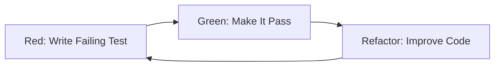

# Development Practices

## Purpose
Establish coding standards, design principles, and development practices that ensure maintainable, reliable, and high-quality software throughout the development lifecycle.

## Context
Development practices form the foundation of software quality. They define how code is written, reviewed, and maintained, directly impacting long-term maintainability and team productivity.

## Prerequisites
- Understanding of [Quality Foundations](../00-foundations/README.md)
- Knowledge of [Testing Strategy](../04-testing-strategy/README.md)
- Familiarity with programming fundamentals

## Clean Code Principles

### Code Readability

**Principle:** Code is read far more often than it's written

#### Meaningful Names

```javascript
// Bad: Unclear names
const d = new Date();
const u = users.filter(x => x.a > 18);

function calc(x, y) {
  return x * y * 0.1;
}

// Good: Descriptive names
const currentDate = new Date();
const adultUsers = users.filter(user => user.age > 18);

function calculateDiscountAmount(price, discountRate) {
  return price * discountRate * 0.1;
}
```

#### Function Design

```javascript
// Bad: Long function doing multiple things
function processUserData(userData) {
  // Validate data
  if (!userData.email || !userData.email.includes('@')) {
    throw new Error('Invalid email');
  }
  if (!userData.password || userData.password.length < 8) {
    throw new Error('Password too short');
  }

  // Hash password
  const salt = crypto.randomBytes(16);
  const hashedPassword = crypto.pbkdf2Sync(userData.password, salt, 100000, 64, 'sha512');

  // Save to database
  const user = {
    email: userData.email,
    passwordHash: hashedPassword,
    salt: salt,
    createdAt: new Date()
  };

  return database.users.create(user);
}

// Good: Single responsibility functions
function validateUserData(userData) {
  validateEmail(userData.email);
  validatePassword(userData.password);
}

function validateEmail(email) {
  if (!email || !email.includes('@')) {
    throw new Error('Invalid email format');
  }
}

function validatePassword(password) {
  if (!password || password.length < 8) {
    throw new Error('Password must be at least 8 characters');
  }
}

function hashPassword(password) {
  const salt = crypto.randomBytes(16);
  const hash = crypto.pbkdf2Sync(password, salt, 100000, 64, 'sha512');
  return { hash, salt };
}

function createUser(userData) {
  validateUserData(userData);
  const { hash, salt } = hashPassword(userData.password);

  const user = {
    email: userData.email,
    passwordHash: hash,
    salt: salt,
    createdAt: new Date()
  };

  return database.users.create(user);
}
```

#### Comments and Documentation

```javascript
// Bad: Obvious comments
// Increment i by 1
i++;

// Check if user is not null
if (user != null) {
  // ...
}

// Good: Explaining why, not what
// Retry up to 3 times to handle transient network failures
const maxRetries = 3;

// Use exponential backoff to avoid overwhelming the server
const backoffDelay = Math.pow(2, attemptNumber) * 1000;

// Apply business rule: Premium users get 20% discount
const discountRate = user.isPremium ? 0.2 : 0.1;

/**
 * Calculates the optimal batch size for processing items.
 *
 * Uses memory constraints and processing time to determine
 * the ideal balance between throughput and resource usage.
 *
 * @param {number} totalItems - Total number of items to process
 * @param {number} availableMemoryMB - Available memory in MB
 * @param {number} avgProcessingTimeMs - Average time per item in ms
 * @returns {number} Optimal batch size
 */
function calculateOptimalBatchSize(totalItems, availableMemoryMB, avgProcessingTimeMs) {
  const memoryPerItem = 2; // MB per item (measured empirically)
  const maxBatchByMemory = Math.floor(availableMemoryMB / memoryPerItem);

  // Limit batch size to maintain responsive UI (max 5 second batches)
  const maxBatchByTime = Math.floor(5000 / avgProcessingTimeMs);

  return Math.min(maxBatchByMemory, maxBatchByTime, totalItems);
}
```

### Error Handling

```javascript
// Bad: Silent failures and generic errors
function getUser(id) {
  try {
    const user = database.users.findById(id);
    return user;
  } catch (error) {
    return null; // Silent failure
  }
}

// Bad: Throwing generic errors
function withdraw(accountId, amount) {
  const account = getAccount(accountId);
  if (account.balance < amount) {
    throw new Error('Error'); // Unhelpful
  }
}

// Good: Explicit error handling
class UserNotFoundError extends Error {
  constructor(userId) {
    super(`User with ID ${userId} not found`);
    this.name = 'UserNotFoundError';
    this.userId = userId;
  }
}

class InsufficientFundsError extends Error {
  constructor(requestedAmount, availableBalance) {
    super(`Insufficient funds: requested ${requestedAmount}, available ${availableBalance}`);
    this.name = 'InsufficientFundsError';
    this.requestedAmount = requestedAmount;
    this.availableBalance = availableBalance;
  }
}

async function getUser(id) {
  try {
    const user = await database.users.findById(id);

    if (!user) {
      throw new UserNotFoundError(id);
    }

    return user;
  } catch (error) {
    if (error instanceof UserNotFoundError) {
      throw error; // Re-throw business errors
    }

    // Log technical errors and throw generic error for security
    logger.error('Database error while fetching user', { userId: id, error });
    throw new Error('Unable to retrieve user data');
  }
}

async function withdraw(accountId, amount) {
  const account = await getAccount(accountId);

  if (account.balance < amount) {
    throw new InsufficientFundsError(amount, account.balance);
  }

  return await processWithdrawal(account, amount);
}
```

## SOLID Principles

### Single Responsibility Principle (SRP)

**Definition:** A class should have only one reason to change

```javascript
// Bad: Multiple responsibilities
class User {
  constructor(name, email) {
    this.name = name;
    this.email = email;
  }

  // User data responsibility
  getName() {
    return this.name;
  }

  // Email validation responsibility
  isValidEmail() {
    return this.email.includes('@');
  }

  // Database responsibility
  save() {
    database.users.create(this);
  }

  // Email sending responsibility
  sendWelcomeEmail() {
    emailService.send(this.email, 'Welcome!');
  }
}

// Good: Single responsibilities
class User {
  constructor(name, email) {
    this.name = name;
    this.email = email;
  }

  getName() {
    return this.name;
  }

  getEmail() {
    return this.email;
  }
}

class EmailValidator {
  static isValid(email) {
    const emailRegex = /^[^\s@]+@[^\s@]+\.[^\s@]+$/;
    return emailRegex.test(email);
  }
}

class UserRepository {
  async save(user) {
    return await database.users.create(user);
  }

  async findById(id) {
    return await database.users.findById(id);
  }
}

class EmailService {
  async sendWelcomeEmail(email) {
    return await this.send(email, 'Welcome to our platform!');
  }

  async send(email, message) {
    // Email sending logic
  }
}
```

### Open/Closed Principle (OCP)

**Definition:** Software entities should be open for extension but closed for modification

```javascript
// Bad: Modifying existing code for new features
class DiscountCalculator {
  calculate(user, amount) {
    if (user.type === 'regular') {
      return amount;
    } else if (user.type === 'premium') {
      return amount * 0.9;
    } else if (user.type === 'vip') { // Added later, modifying existing code
      return amount * 0.8;
    }
    return amount;
  }
}

// Good: Extension without modification
class DiscountStrategy {
  calculate(amount) {
    throw new Error('Must implement calculate method');
  }
}

class RegularDiscountStrategy extends DiscountStrategy {
  calculate(amount) {
    return amount;
  }
}

class PremiumDiscountStrategy extends DiscountStrategy {
  calculate(amount) {
    return amount * 0.9;
  }
}

class VIPDiscountStrategy extends DiscountStrategy {
  calculate(amount) {
    return amount * 0.8;
  }
}

class DiscountCalculator {
  constructor() {
    this.strategies = new Map([
      ['regular', new RegularDiscountStrategy()],
      ['premium', new PremiumDiscountStrategy()],
      ['vip', new VIPDiscountStrategy()]
    ]);
  }

  calculate(user, amount) {
    const strategy = this.strategies.get(user.type);
    if (!strategy) {
      throw new Error(`Unknown user type: ${user.type}`);
    }
    return strategy.calculate(amount);
  }

  // Easy to add new strategies without modifying existing code
  addStrategy(userType, strategy) {
    this.strategies.set(userType, strategy);
  }
}
```

### Liskov Substitution Principle (LSP)

**Definition:** Objects of a superclass should be replaceable with objects of its subclasses

```javascript
// Bad: Violating LSP
class Bird {
  fly() {
    console.log('Flying...');
  }
}

class Penguin extends Bird {
  fly() {
    throw new Error('Penguins cannot fly!'); // Violates LSP
  }
}

// Good: Proper abstraction
class Bird {
  constructor(name) {
    this.name = name;
  }

  getName() {
    return this.name;
  }
}

class FlyingBird extends Bird {
  fly() {
    console.log(`${this.name} is flying...`);
  }
}

class SwimmingBird extends Bird {
  swim() {
    console.log(`${this.name} is swimming...`);
  }
}

class Eagle extends FlyingBird {
  fly() {
    console.log(`${this.name} soars high...`);
  }
}

class Penguin extends SwimmingBird {
  swim() {
    console.log(`${this.name} swims gracefully...`);
  }
}

// Both can be used as Birds
function describeBird(bird) {
  console.log(`This is a ${bird.getName()}`);
  // No assumptions about flying capability
}
```

### Interface Segregation Principle (ISP)

**Definition:** No client should be forced to depend on methods it does not use

```javascript
// Bad: Fat interface
class WorkerInterface {
  work() {}
  eat() {}
  sleep() {}
  code() {}
  manageTeam() {}
}

class Developer extends WorkerInterface {
  work() { this.code(); }
  eat() { console.log('Eating...'); }
  sleep() { console.log('Sleeping...'); }
  code() { console.log('Coding...'); }
  manageTeam() {
    throw new Error('Developers do not manage teams'); // Forced to implement
  }
}

// Good: Segregated interfaces
class Workable {
  work() {}
}

class Eatable {
  eat() {}
}

class Sleepable {
  sleep() {}
}

class Codeable {
  code() {}
}

class Manageable {
  manageTeam() {}
}

class Developer extends Workable {
  work() { this.code(); }
  eat() { console.log('Eating...'); }
  sleep() { console.log('Sleeping...'); }
  code() { console.log('Coding...'); }
}

class Manager extends Workable {
  work() { this.manageTeam(); }
  eat() { console.log('Eating...'); }
  sleep() { console.log('Sleeping...'); }
  manageTeam() { console.log('Managing team...'); }
}
```

### Dependency Inversion Principle (DIP)

**Definition:** Depend on abstractions, not concretions

```javascript
// Bad: High-level module depends on low-level module
class FileLogger {
  log(message) {
    fs.writeFileSync('app.log', message + '\n', { flag: 'a' });
  }
}

class UserService {
  constructor() {
    this.logger = new FileLogger(); // Direct dependency on concrete class
  }

  createUser(userData) {
    // Create user logic
    this.logger.log('User created');
  }
}

// Good: Depend on abstraction
class Logger {
  log(message) {
    throw new Error('Must implement log method');
  }
}

class FileLogger extends Logger {
  log(message) {
    fs.writeFileSync('app.log', message + '\n', { flag: 'a' });
  }
}

class ConsoleLogger extends Logger {
  log(message) {
    console.log(message);
  }
}

class DatabaseLogger extends Logger {
  async log(message) {
    await database.logs.create({ message, timestamp: new Date() });
  }
}

class UserService {
  constructor(logger) {
    this.logger = logger; // Depends on abstraction
  }

  createUser(userData) {
    // Create user logic
    this.logger.log('User created');
  }
}

// Dependency injection
const logger = new FileLogger();
const userService = new UserService(logger);

// Easy to swap implementations
const consoleLogger = new ConsoleLogger();
const testUserService = new UserService(consoleLogger);
```

## Design Patterns

### Creational Patterns

#### Factory Pattern

```javascript
// Factory for creating different notification types
class NotificationFactory {
  static create(type, config) {
    switch (type) {
      case 'email':
        return new EmailNotification(config.smtp);
      case 'sms':
        return new SMSNotification(config.sms);
      case 'push':
        return new PushNotification(config.push);
      case 'slack':
        return new SlackNotification(config.slack);
      default:
        throw new Error(`Unsupported notification type: ${type}`);
    }
  }
}

class EmailNotification {
  constructor(smtpConfig) {
    this.smtp = new SMTPClient(smtpConfig);
  }

  async send(recipient, message) {
    return await this.smtp.send({
      to: recipient,
      subject: message.subject,
      body: message.body
    });
  }
}

class SMSNotification {
  constructor(smsConfig) {
    this.smsClient = new SMSClient(smsConfig);
  }

  async send(recipient, message) {
    return await this.smsClient.send(recipient, message.text);
  }
}

// Usage
const emailNotifier = NotificationFactory.create('email', {
  smtp: { host: 'smtp.example.com', port: 587 }
});

const smsNotifier = NotificationFactory.create('sms', {
  sms: { apiKey: 'xxx', provider: 'twilio' }
});
```

#### Singleton Pattern

```javascript
// Database connection singleton
class DatabaseConnection {
  constructor() {
    if (DatabaseConnection.instance) {
      return DatabaseConnection.instance;
    }

    this.connection = null;
    this.isConnected = false;
    DatabaseConnection.instance = this;
  }

  async connect() {
    if (this.isConnected) {
      return this.connection;
    }

    this.connection = await this.createConnection();
    this.isConnected = true;
    return this.connection;
  }

  async createConnection() {
    // Database connection logic
    return new DatabaseClient({
      host: process.env.DB_HOST,
      port: process.env.DB_PORT,
      database: process.env.DB_NAME
    });
  }

  async disconnect() {
    if (this.connection) {
      await this.connection.close();
      this.isConnected = false;
      this.connection = null;
    }
  }
}

// Usage
const db1 = new DatabaseConnection();
const db2 = new DatabaseConnection();
console.log(db1 === db2); // true - same instance
```

### Structural Patterns

#### Adapter Pattern

```javascript
// Adapting third-party payment processors
class PayPalAdapter {
  constructor(paypalClient) {
    this.paypal = paypalClient;
  }

  async processPayment(paymentData) {
    // Adapt our payment data to PayPal's format
    const paypalPayment = {
      amount: {
        currency: paymentData.currency,
        value: paymentData.amount
      },
      payment_method: {
        payer: {
          email_address: paymentData.customerEmail
        }
      }
    };

    const result = await this.paypal.payments.create(paypalPayment);

    // Adapt PayPal's response to our format
    return {
      transactionId: result.id,
      status: result.status === 'COMPLETED' ? 'success' : 'failed',
      amount: result.purchase_units[0].amount.value,
      processorResponse: result
    };
  }
}

class StripeAdapter {
  constructor(stripeClient) {
    this.stripe = stripeClient;
  }

  async processPayment(paymentData) {
    // Adapt our payment data to Stripe's format
    const stripePayment = {
      amount: paymentData.amount * 100, // Stripe uses cents
      currency: paymentData.currency.toLowerCase(),
      customer: paymentData.customerId,
      description: paymentData.description
    };

    const result = await this.stripe.charges.create(stripePayment);

    // Adapt Stripe's response to our format
    return {
      transactionId: result.id,
      status: result.status === 'succeeded' ? 'success' : 'failed',
      amount: result.amount / 100,
      processorResponse: result
    };
  }
}

// Unified payment processor
class PaymentProcessor {
  constructor(adapter) {
    this.adapter = adapter;
  }

  async processPayment(paymentData) {
    return await this.adapter.processPayment(paymentData);
  }
}

// Usage
const paypalProcessor = new PaymentProcessor(new PayPalAdapter(paypalClient));
const stripeProcessor = new PaymentProcessor(new StripeAdapter(stripeClient));

// Same interface for different processors
await paypalProcessor.processPayment(paymentData);
await stripeProcessor.processPayment(paymentData);
```

#### Decorator Pattern

```javascript
// Base coffee class
class Coffee {
  cost() {
    return 2.00;
  }

  description() {
    return 'Simple coffee';
  }
}

// Decorator base class
class CoffeeDecorator extends Coffee {
  constructor(coffee) {
    super();
    this.coffee = coffee;
  }

  cost() {
    return this.coffee.cost();
  }

  description() {
    return this.coffee.description();
  }
}

// Concrete decorators
class MilkDecorator extends CoffeeDecorator {
  cost() {
    return this.coffee.cost() + 0.50;
  }

  description() {
    return this.coffee.description() + ', milk';
  }
}

class SugarDecorator extends CoffeeDecorator {
  cost() {
    return this.coffee.cost() + 0.25;
  }

  description() {
    return this.coffee.description() + ', sugar';
  }
}

class VanillaDecorator extends CoffeeDecorator {
  cost() {
    return this.coffee.cost() + 0.75;
  }

  description() {
    return this.coffee.description() + ', vanilla';
  }
}

// Usage
let coffee = new Coffee();
coffee = new MilkDecorator(coffee);
coffee = new SugarDecorator(coffee);
coffee = new VanillaDecorator(coffee);

console.log(coffee.description()); // "Simple coffee, milk, sugar, vanilla"
console.log(coffee.cost()); // 3.50
```

### Behavioral Patterns

#### Observer Pattern

```javascript
// Event system using Observer pattern
class EventEmitter {
  constructor() {
    this.events = new Map();
  }

  on(eventName, callback) {
    if (!this.events.has(eventName)) {
      this.events.set(eventName, []);
    }
    this.events.get(eventName).push(callback);
  }

  off(eventName, callback) {
    if (this.events.has(eventName)) {
      const callbacks = this.events.get(eventName);
      const index = callbacks.indexOf(callback);
      if (index > -1) {
        callbacks.splice(index, 1);
      }
    }
  }

  emit(eventName, ...args) {
    if (this.events.has(eventName)) {
      this.events.get(eventName).forEach(callback => {
        try {
          callback(...args);
        } catch (error) {
          console.error(`Error in event handler for ${eventName}:`, error);
        }
      });
    }
  }
}

// User service with events
class UserService extends EventEmitter {
  async createUser(userData) {
    try {
      const user = await this.database.users.create(userData);
      this.emit('user:created', user);
      return user;
    } catch (error) {
      this.emit('user:creation_failed', userData, error);
      throw error;
    }
  }

  async updateUser(userId, updateData) {
    const oldUser = await this.database.users.findById(userId);
    const updatedUser = await this.database.users.update(userId, updateData);

    this.emit('user:updated', updatedUser, oldUser);
    return updatedUser;
  }
}

// Event subscribers
class EmailService {
  constructor(userService) {
    userService.on('user:created', this.sendWelcomeEmail.bind(this));
    userService.on('user:updated', this.handleUserUpdate.bind(this));
  }

  async sendWelcomeEmail(user) {
    console.log(`Sending welcome email to ${user.email}`);
  }

  async handleUserUpdate(newUser, oldUser) {
    if (newUser.email !== oldUser.email) {
      console.log(`Email changed for user ${newUser.id}`);
    }
  }
}

class AuditService {
  constructor(userService) {
    userService.on('user:created', this.logUserCreation.bind(this));
    userService.on('user:updated', this.logUserUpdate.bind(this));
  }

  async logUserCreation(user) {
    await this.auditLog.create({
      action: 'USER_CREATED',
      userId: user.id,
      timestamp: new Date()
    });
  }

  async logUserUpdate(newUser, oldUser) {
    await this.auditLog.create({
      action: 'USER_UPDATED',
      userId: newUser.id,
      changes: this.getChanges(oldUser, newUser),
      timestamp: new Date()
    });
  }
}
```

#### Command Pattern

```javascript
// Command pattern for undo/redo functionality
class Command {
  execute() {
    throw new Error('Must implement execute method');
  }

  undo() {
    throw new Error('Must implement undo method');
  }
}

class CreateUserCommand extends Command {
  constructor(userService, userData) {
    super();
    this.userService = userService;
    this.userData = userData;
    this.createdUser = null;
  }

  async execute() {
    this.createdUser = await this.userService.create(this.userData);
    return this.createdUser;
  }

  async undo() {
    if (this.createdUser) {
      await this.userService.delete(this.createdUser.id);
    }
  }
}

class UpdateUserCommand extends Command {
  constructor(userService, userId, updateData) {
    super();
    this.userService = userService;
    this.userId = userId;
    this.updateData = updateData;
    this.originalData = null;
  }

  async execute() {
    this.originalData = await this.userService.findById(this.userId);
    return await this.userService.update(this.userId, this.updateData);
  }

  async undo() {
    if (this.originalData) {
      await this.userService.update(this.userId, this.originalData);
    }
  }
}

class CommandInvoker {
  constructor() {
    this.history = [];
    this.currentPosition = -1;
  }

  async execute(command) {
    // Remove any commands after current position (for redo after undo)
    this.history = this.history.slice(0, this.currentPosition + 1);

    const result = await command.execute();

    this.history.push(command);
    this.currentPosition++;

    return result;
  }

  async undo() {
    if (this.currentPosition >= 0) {
      const command = this.history[this.currentPosition];
      await command.undo();
      this.currentPosition--;
    }
  }

  async redo() {
    if (this.currentPosition < this.history.length - 1) {
      this.currentPosition++;
      const command = this.history[this.currentPosition];
      await command.execute();
    }
  }
}

// Usage
const invoker = new CommandInvoker();

// Execute commands
await invoker.execute(new CreateUserCommand(userService, userData));
await invoker.execute(new UpdateUserCommand(userService, userId, updateData));

// Undo last operation
await invoker.undo();

// Redo
await invoker.redo();
```

## Test-Driven Development (TDD)

### TDD Cycle



### TDD Example

```javascript
// Step 1: Write failing test
describe('Calculator', () => {
  it('should add two numbers correctly', () => {
    const calculator = new Calculator();
    const result = calculator.add(2, 3);
    expect(result).toBe(5);
  });
});

// Test fails - Calculator class doesn't exist

// Step 2: Write minimal code to pass
class Calculator {
  add(a, b) {
    return a + b;
  }
}

// Test passes

// Step 3: Refactor if needed
class Calculator {
  add(a, b) {
    if (typeof a !== 'number' || typeof b !== 'number') {
      throw new Error('Both arguments must be numbers');
    }
    return a + b;
  }
}

// Add more tests
describe('Calculator', () => {
  let calculator;

  beforeEach(() => {
    calculator = new Calculator();
  });

  it('should add positive numbers', () => {
    expect(calculator.add(2, 3)).toBe(5);
  });

  it('should add negative numbers', () => {
    expect(calculator.add(-2, -3)).toBe(-5);
  });

  it('should handle zero', () => {
    expect(calculator.add(0, 5)).toBe(5);
    expect(calculator.add(5, 0)).toBe(5);
  });

  it('should throw error for non-numbers', () => {
    expect(() => calculator.add('2', 3)).toThrow('Both arguments must be numbers');
    expect(() => calculator.add(2, null)).toThrow('Both arguments must be numbers');
  });
});
```

### TDD Best Practices

```javascript
// Good: Test behavior, not implementation
describe('UserService', () => {
  it('should send welcome email when user is created', async () => {
    const emailSpy = jest.spyOn(emailService, 'send');

    await userService.createUser({
      email: 'test@example.com',
      name: 'Test User'
    });

    expect(emailSpy).toHaveBeenCalledWith(
      'test@example.com',
      expect.objectContaining({
        subject: 'Welcome!',
        template: 'welcome'
      })
    );
  });
});

// Bad: Testing implementation details
describe('UserService', () => {
  it('should call database.users.create with correct parameters', async () => {
    const dbSpy = jest.spyOn(database.users, 'create');

    await userService.createUser({
      email: 'test@example.com',
      name: 'Test User'
    });

    expect(dbSpy).toHaveBeenCalledWith({
      email: 'test@example.com',
      name: 'Test User',
      createdAt: expect.any(Date)
    });
  });
});
```

## Behavior-Driven Development (BDD)

### BDD Approach

```gherkin
# Feature file: user-registration.feature
Feature: User Registration
  As a visitor
  I want to register for an account
  So that I can access premium features

  Background:
    Given the registration system is available
    And the email service is operational

  Scenario: Successful registration with valid data
    Given I am on the registration page
    When I enter valid registration details:
      | field    | value           |
      | email    | user@example.com |
      | password | SecurePass123   |
      | name     | John Doe        |
    And I click the "Register" button
    Then I should see a success message
    And I should receive a welcome email
    And my account should be created

  Scenario: Registration fails with invalid email
    Given I am on the registration page
    When I enter an invalid email "not-an-email"
    And I enter valid password and name
    And I click the "Register" button
    Then I should see an error message "Please enter a valid email address"
    And my account should not be created

  Scenario: Registration fails with weak password
    Given I am on the registration page
    When I enter a weak password "123"
    And I enter valid email and name
    And I click the "Register" button
    Then I should see an error message "Password must be at least 8 characters"
    And my account should not be created
```

### BDD Step Definitions

```javascript
// Step definitions for the feature
const { Given, When, Then } = require('@cucumber/cucumber');

Given('the registration system is available', async function () {
  this.userService = new UserService();
  this.emailService = new EmailService();
});

Given('the email service is operational', async function () {
  // Mock or verify email service
  this.emailSpy = jest.spyOn(this.emailService, 'send').mockResolvedValue(true);
});

Given('I am on the registration page', async function () {
  this.page = await this.browser.newPage();
  await this.page.goto('/register');
});

When('I enter valid registration details:', async function (dataTable) {
  const data = dataTable.rowsHash();
  this.registrationData = data;

  await this.page.fill('#email', data.email);
  await this.page.fill('#password', data.password);
  await this.page.fill('#name', data.name);
});

When('I click the {string} button', async function (buttonText) {
  await this.page.click(`button:has-text("${buttonText}")`);
});

Then('I should see a success message', async function () {
  const message = await this.page.textContent('.success-message');
  expect(message).toContain('Registration successful');
});

Then('I should receive a welcome email', async function () {
  expect(this.emailSpy).toHaveBeenCalledWith(
    this.registrationData.email,
    expect.objectContaining({
      subject: 'Welcome!',
      template: 'welcome'
    })
  );
});

Then('my account should be created', async function () {
  const user = await this.userService.findByEmail(this.registrationData.email);
  expect(user).toBeTruthy();
  expect(user.name).toBe(this.registrationData.name);
});
```

## Code Review Practices

### Code Review Checklist

#### Functionality
- [ ] Code does what it's supposed to do
- [ ] Edge cases are handled appropriately
- [ ] Error conditions are handled gracefully
- [ ] No obvious bugs or logical errors

#### Design & Architecture
- [ ] Code follows SOLID principles
- [ ] Appropriate design patterns are used
- [ ] No over-engineering or premature optimization
- [ ] Code is appropriately abstracted

#### Performance
- [ ] No obvious performance bottlenecks
- [ ] Efficient algorithms and data structures
- [ ] Appropriate caching strategies
- [ ] Database queries are optimized

#### Security
- [ ] Input validation is performed
- [ ] SQL injection prevention
- [ ] XSS protection implemented
- [ ] Authentication and authorization correct
- [ ] No sensitive data in logs or responses

#### Testing
- [ ] Adequate test coverage
- [ ] Tests are meaningful and well-written
- [ ] Edge cases are tested
- [ ] Mocks and stubs are used appropriately

#### Code Quality
- [ ] Code is readable and well-documented
- [ ] Naming conventions are followed
- [ ] No dead or commented-out code
- [ ] Consistent formatting and style
- [ ] Functions and classes are reasonably sized

#### Documentation
- [ ] Complex logic is explained
- [ ] API changes are documented
- [ ] README is updated if necessary
- [ ] Comments explain why, not what

### Review Comments Examples

```javascript
// Good review comments:

// 1. Constructive suggestion
// Consider using a Map here instead of nested loops for better performance:
// const userMap = new Map(users.map(user => [user.id, user]));
// return orders.map(order => ({ ...order, user: userMap.get(order.userId) }));

// 2. Asking for clarification
// Could you add a comment explaining why we need this 5-second delay?
// It's not immediately obvious from the business logic.

// 3. Security concern
// This endpoint appears to be missing authentication.
// Should we add a middleware check here?

// 4. Suggesting improvement
// This function is doing quite a lot. Consider breaking it down:
// - validateOrderData()
// - calculateOrderTotal()
// - saveOrder()
// - sendOrderConfirmation()

// 5. Positive feedback
// Nice use of the Strategy pattern here! Makes it very easy to add new payment methods.
```

### Automated Code Review

```javascript
// ESLint configuration for code review automation
module.exports = {
  extends: [
    'eslint:recommended',
    '@typescript-eslint/recommended',
    'prettier'
  ],
  rules: {
    // Complexity rules
    'complexity': ['error', 10],
    'max-depth': ['error', 4],
    'max-lines-per-function': ['error', 50],
    'max-params': ['error', 4],

    // Code quality rules
    'no-console': 'warn',
    'no-debugger': 'error',
    'no-unused-vars': 'error',
    'no-var': 'error',
    'prefer-const': 'error',

    // Security rules
    'no-eval': 'error',
    'no-implied-eval': 'error',
    'no-new-func': 'error',

    // Best practices
    'eqeqeq': 'error',
    'no-magic-numbers': ['warn', { ignore: [0, 1, -1] }],
    'consistent-return': 'error'
  }
};

// SonarJS rules for additional checks
// Rules for cognitive complexity, code smells, and maintainability
```

## Pair Programming

### Pair Programming Styles

#### Driver-Navigator
```
Driver:    Writes the code, focuses on tactical implementation
Navigator: Reviews code in real-time, thinks strategically

Benefits:
- Immediate code review
- Knowledge sharing
- Reduced bugs
- Better solutions through collaboration

Rotation: Switch roles every 15-30 minutes
```

#### Ping-Pong Pairing
```
Person A: Writes failing test
Person B: Makes test pass, writes next failing test
Person A: Makes test pass, writes next failing test
...and so on

Benefits:
- Enforces TDD discipline
- Both people stay engaged
- Natural test coverage
- Shared ownership
```

#### Strong-Style Pairing
```
"For an idea to go from your head into the computer,
it MUST go through someone else's hands"

Driver:    Types what navigator instructs
Navigator: Thinks and directs all actions

Benefits:
- Forces clear communication
- Navigator must explain clearly
- Driver learns by doing
- Reduces assumptions
```

### Pair Programming Best Practices

```javascript
// Good pairing session structure
class PairingSession {
  constructor(duration = 90) {
    this.duration = duration; // minutes
    this.roles = ['driver', 'navigator'];
    this.currentDriver = 0;
    this.switchInterval = 25; // minutes
  }

  start() {
    console.log('Starting pairing session');

    // Set up environment
    this.setupSharedEnvironment();

    // Define session goals
    this.defineGoals();

    // Begin first rotation
    this.startRotation();
  }

  setupSharedEnvironment() {
    // Use screen sharing or shared development environment
    // Ensure both can see clearly
    // Set up version control for easy handoffs
  }

  defineGoals() {
    // What do we want to accomplish?
    // What are we learning?
    // How will we measure success?
  }

  startRotation() {
    const driver = this.roles[this.currentDriver];
    const navigator = this.roles[1 - this.currentDriver];

    console.log(`${driver} driving, ${navigator} navigating`);

    // Set timer for role switch
    setTimeout(() => {
      this.switchRoles();
    }, this.switchInterval * 60 * 1000);
  }

  switchRoles() {
    this.currentDriver = 1 - this.currentDriver;
    console.log('Switching roles...');

    // Brief break for handoff
    this.handoff();

    // Continue with new roles
    this.startRotation();
  }

  handoff() {
    // Quick summary of current state
    // Any issues or thoughts to share
    // Ensure clean code state before switch
  }
}
```

## Checklist

### Development Practices Checklist

**Clean Code:**
- [ ] Meaningful and descriptive names
- [ ] Functions do one thing well
- [ ] Code is self-documenting
- [ ] Comments explain why, not what
- [ ] Consistent formatting and style
- [ ] No dead or commented code

**SOLID Principles:**
- [ ] Single Responsibility Principle applied
- [ ] Open/Closed Principle followed
- [ ] Liskov Substitution Principle respected
- [ ] Interface Segregation implemented
- [ ] Dependency Inversion practiced

**Design Patterns:**
- [ ] Appropriate patterns chosen
- [ ] Not over-engineered
- [ ] Patterns improve maintainability
- [ ] Team understands patterns used

**Testing Practices:**
- [ ] TDD/BDD approach followed
- [ ] Tests written before code
- [ ] Good test coverage achieved
- [ ] Tests are maintainable
- [ ] Edge cases covered

**Code Review:**
- [ ] All code reviewed before merge
- [ ] Constructive feedback provided
- [ ] Security considerations checked
- [ ] Performance implications reviewed
- [ ] Documentation updated

**Collaboration:**
- [ ] Pair programming sessions scheduled
- [ ] Knowledge sharing encouraged
- [ ] Code ownership shared
- [ ] Best practices documented
- [ ] Team coding standards established

## References

### Books
- "Clean Code" - Robert C. Martin
- "Refactoring" - Martin Fowler
- "Design Patterns" - Gang of Four
- "Growing Object-Oriented Software, Guided by Tests" - Freeman & Pryce
- "The Pragmatic Programmer" - Hunt & Thomas

### Standards
- SOLID Principles - Robert C. Martin
- Gang of Four Design Patterns
- IEEE 1061 - Software Quality Metrics

### Tools
- **ESLint** - JavaScript linting
- **SonarQube** - Code quality analysis
- **Prettier** - Code formatting
- **Cucumber** - BDD framework
- **Jest** - Testing framework

## Related Topics

- [Testing Strategy](../04-testing-strategy/README.md)
- [Test Levels](../05-test-levels/README.md)
- [Version Control](../03-version-control/README.md)
- [CI/CD Pipeline](../08-cicd-pipeline/README.md)

---

*Next: [Clean Code Principles](clean-code-principles.md) - Deep dive into clean code*