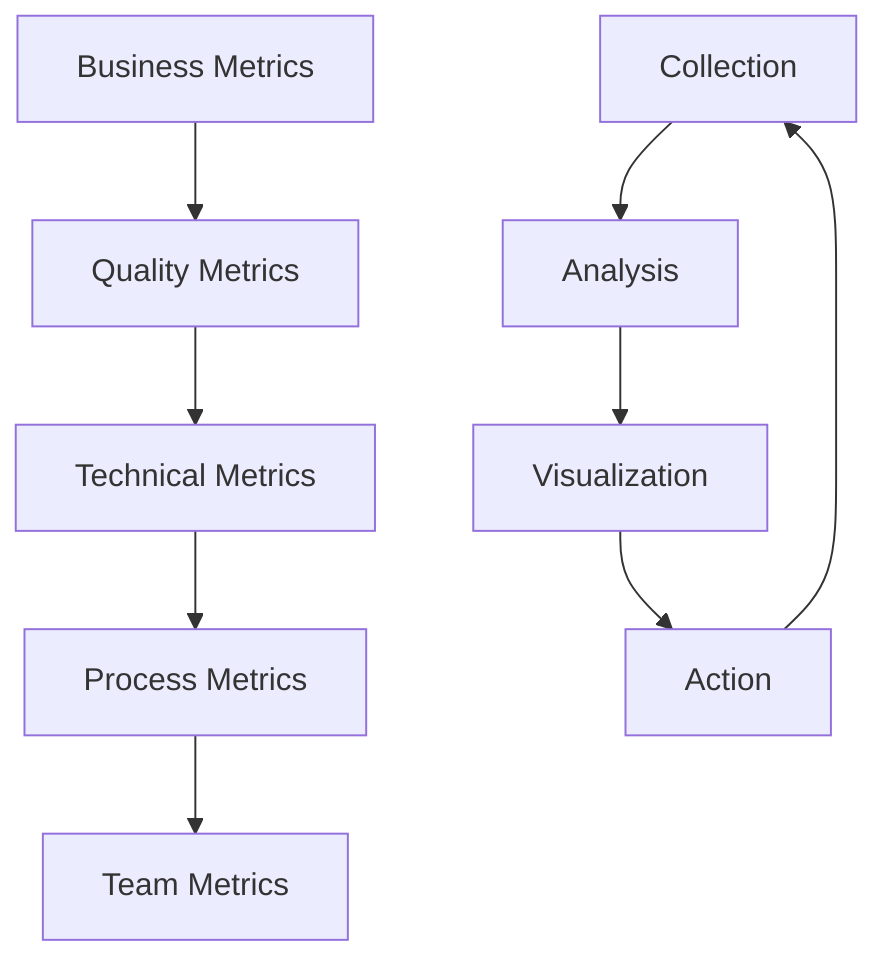

# Metrics & Monitoring

## Purpose

Establish comprehensive measurement and monitoring practices to track quality, performance, and delivery effectiveness using industry-standard metrics and modern observability techniques.

## Context

"You can't improve what you don't measure." Metrics provide objective insights into software quality, team performance, and business value delivery, enabling data-driven decisions and continuous improvement.

## Prerequisites

- Understanding of [Quality Foundations](../00-foundations/README.md)
- Knowledge of [CI/CD Pipeline](../08-cicd-pipeline/README.md)
- Familiarity with monitoring concepts

## Metrics Framework



## DORA Metrics (DevOps Research & Assessment)

### Overview

DORA metrics are the industry standard for measuring DevOps performance and predicting organizational success.

### 1. Deployment Frequency

**Definition:** How often code deploys to production

**Formula:**

```
Deployment Frequency = Number of Production Deployments / Time Period
```

**Measurement:**

```sql
-- Daily deployment frequency
SELECT
    DATE(deployed_at) as deployment_date,
    COUNT(*) as deployments_per_day
FROM deployments
WHERE environment = 'production'
    AND deployed_at >= CURRENT_DATE - INTERVAL '30 days'
GROUP BY DATE(deployed_at)
ORDER BY deployment_date;

-- Average deployments per week
SELECT
    AVG(weekly_deployments) as avg_deployments_per_week
FROM (
    SELECT
        WEEK(deployed_at) as week,
        COUNT(*) as weekly_deployments
    FROM deployments
    WHERE environment = 'production'
        AND deployed_at >= CURRENT_DATE - INTERVAL '90 days'
    GROUP BY WEEK(deployed_at)
) weekly_data;
```

**Benchmarks:**

- **Elite**: Multiple deployments per day
- **High**: Daily to weekly deployments
- **Medium**: Weekly to monthly deployments
- **Low**: Monthly to every 6 months

**Implementation Example:**

```javascript
// Deployment frequency tracker
class DeploymentTracker {
  async recordDeployment(environment, version, metadata = {}) {
    const deployment = {
      environment,
      version,
      deployedAt: new Date(),
      ...metadata,
    };

    await this.database.deployments.create(deployment);
    await this.metrics.increment('deployments.total', 1, { environment });

    // Calculate frequency metrics
    if (environment === 'production') {
      await this.updateDeploymentFrequency();
    }
  }

  async updateDeploymentFrequency() {
    const last30Days = new Date(Date.now() - 30 * 24 * 60 * 60 * 1000);

    const deploymentsCount = await this.database.deployments.count({
      where: {
        environment: 'production',
        deployedAt: { gte: last30Days },
      },
    });

    const frequency = deploymentsCount / 30; // Per day
    await this.metrics.gauge('deployment_frequency.daily', frequency);
  }
}
```

### 2. Lead Time for Changes

**Definition:** Time from code commit to production deployment

**Formula:**

```
Lead Time = Time(Production Deploy) - Time(First Commit)
```

**Measurement:**

```sql
-- Lead time calculation
SELECT
    d.id,
    d.version,
    d.deployed_at,
    c.committed_at,
    TIMESTAMPDIFF(HOUR, c.committed_at, d.deployed_at) as lead_time_hours
FROM deployments d
JOIN commits c ON d.version LIKE CONCAT('%', c.sha, '%')
WHERE d.environment = 'production'
    AND d.deployed_at >= CURRENT_DATE - INTERVAL '30 days'
ORDER BY d.deployed_at DESC;

-- Average lead time
SELECT
    AVG(TIMESTAMPDIFF(HOUR, c.committed_at, d.deployed_at)) as avg_lead_time_hours,
    PERCENTILE_CONT(0.5) WITHIN GROUP (
        ORDER BY TIMESTAMPDIFF(HOUR, c.committed_at, d.deployed_at)
    ) as median_lead_time_hours
FROM deployments d
JOIN commits c ON d.version LIKE CONCAT('%', c.sha, '%')
WHERE d.environment = 'production';
```

**Benchmarks:**

- **Elite**: Less than 1 hour
- **High**: 1 day to 1 week
- **Medium**: 1 week to 1 month
- **Low**: 1 month to 6 months

**Implementation:**

```javascript
// Lead time calculator
class LeadTimeCalculator {
  async calculateLeadTime(deploymentId) {
    const deployment = await this.getDeployment(deploymentId);
    const commits = await this.getCommitsForDeployment(deployment);

    const firstCommitTime = Math.min(...commits.map(c => c.timestamp));
    const leadTime = deployment.deployedAt - firstCommitTime;

    await this.metrics.histogram('lead_time.milliseconds', leadTime, {
      environment: deployment.environment,
    });

    return {
      leadTimeMs: leadTime,
      leadTimeHours: leadTime / (1000 * 60 * 60),
      firstCommit: new Date(firstCommitTime),
      deployment: deployment.deployedAt,
    };
  }

  async getCommitsForDeployment(deployment) {
    // Get all commits between last deployment and current
    const lastDeployment = await this.getLastDeployment(deployment.environment);

    return await this.git.getCommitsBetween(
      lastDeployment?.commitSha || 'HEAD~100',
      deployment.commitSha
    );
  }
}
```

### 3. Mean Time to Recovery (MTTR)

**Definition:** Average time to restore service after an incident

**Formula:**

```
MTTR = Total Downtime / Number of Incidents
```

**Measurement:**

```sql
-- MTTR calculation
SELECT
    i.id,
    i.title,
    i.severity,
    i.detected_at,
    i.resolved_at,
    TIMESTAMPDIFF(MINUTE, i.detected_at, i.resolved_at) as resolution_time_minutes
FROM incidents i
WHERE i.resolved_at IS NOT NULL
    AND i.detected_at >= CURRENT_DATE - INTERVAL '90 days'
ORDER BY i.detected_at DESC;

-- Average MTTR by severity
SELECT
    severity,
    COUNT(*) as incident_count,
    AVG(TIMESTAMPDIFF(MINUTE, detected_at, resolved_at)) as avg_mttr_minutes,
    MAX(TIMESTAMPDIFF(MINUTE, detected_at, resolved_at)) as max_mttr_minutes
FROM incidents
WHERE resolved_at IS NOT NULL
GROUP BY severity;
```

**Benchmarks:**

- **Elite**: Less than 1 hour
- **High**: Less than 1 day
- **Medium**: 1 day to 1 week
- **Low**: 1 week to 1 month

**Implementation:**

```javascript
// Incident tracker for MTTR
class IncidentTracker {
  async createIncident(title, severity, metadata = {}) {
    const incident = {
      id: this.generateId(),
      title,
      severity,
      detectedAt: new Date(),
      status: 'investigating',
      ...metadata,
    };

    await this.database.incidents.create(incident);
    await this.notifications.alert(incident);

    return incident;
  }

  async resolveIncident(incidentId, resolution) {
    const incident = await this.database.incidents.findById(incidentId);
    const resolvedAt = new Date();

    const mttr = resolvedAt - incident.detectedAt;

    await this.database.incidents.update(incidentId, {
      status: 'resolved',
      resolvedAt,
      resolution,
    });

    // Record MTTR metric
    await this.metrics.histogram('mttr.milliseconds', mttr, {
      severity: incident.severity,
    });

    // Calculate rolling average
    await this.updateMTTRAverage(incident.severity);

    return { incident, mttr };
  }

  async updateMTTRAverage(severity) {
    const last30Days = new Date(Date.now() - 30 * 24 * 60 * 60 * 1000);

    const incidents = await this.database.incidents.findMany({
      where: {
        severity,
        resolvedAt: { gte: last30Days },
        status: 'resolved',
      },
    });

    const avgMTTR =
      incidents.reduce((sum, incident) => {
        return sum + (incident.resolvedAt - incident.detectedAt);
      }, 0) / incidents.length;

    await this.metrics.gauge('mttr.average_milliseconds', avgMTTR, { severity });
  }
}
```

### 4. Change Failure Rate

**Definition:** Percentage of deployments that result in degraded service

**Formula:**

```
Change Failure Rate = (Failed Deployments / Total Deployments) × 100
```

**Measurement:**

```sql
-- Change failure rate
SELECT
    COUNT(*) as total_deployments,
    SUM(CASE WHEN status = 'failed' THEN 1 ELSE 0 END) as failed_deployments,
    (SUM(CASE WHEN status = 'failed' THEN 1 ELSE 0 END) * 100.0 / COUNT(*)) as failure_rate_percent
FROM deployments
WHERE environment = 'production'
    AND deployed_at >= CURRENT_DATE - INTERVAL '30 days';

-- Failure rate by week
SELECT
    WEEK(deployed_at) as week,
    COUNT(*) as deployments,
    SUM(CASE WHEN status = 'failed' THEN 1 ELSE 0 END) as failures,
    (SUM(CASE WHEN status = 'failed' THEN 1 ELSE 0 END) * 100.0 / COUNT(*)) as failure_rate
FROM deployments
WHERE environment = 'production'
    AND deployed_at >= CURRENT_DATE - INTERVAL '12 weeks'
GROUP BY WEEK(deployed_at)
ORDER BY week;
```

**Benchmarks:**

- **Elite**: 0-15%
- **High**: 16-30%
- **Medium**: 31-45%
- **Low**: 46-60%

**Implementation:**

```javascript
// Change failure rate tracker
class ChangeFailureTracker {
  async trackDeploymentResult(deploymentId, status, details = {}) {
    await this.database.deployments.update(deploymentId, {
      status,
      completedAt: new Date(),
      ...details,
    });

    // Increment counters
    await this.metrics.increment('deployments.total', 1, {
      environment: details.environment,
      status,
    });

    // Calculate failure rate
    if (details.environment === 'production') {
      await this.updateChangeFailureRate();
    }
  }

  async updateChangeFailureRate() {
    const last30Days = new Date(Date.now() - 30 * 24 * 60 * 60 * 1000);

    const deployments = await this.database.deployments.findMany({
      where: {
        environment: 'production',
        deployedAt: { gte: last30Days },
      },
    });

    const totalDeployments = deployments.length;
    const failedDeployments = deployments.filter(d => d.status === 'failed').length;
    const failureRate = (failedDeployments / totalDeployments) * 100;

    await this.metrics.gauge('change_failure_rate.percent', failureRate);

    return {
      totalDeployments,
      failedDeployments,
      failureRate,
    };
  }

  async detectDeploymentFailure(deployment) {
    // Automated failure detection
    const healthChecks = await this.runHealthChecks(deployment.environment);
    const errorRate = await this.getErrorRate(deployment.environment);

    const isFailed = !healthChecks.passed || errorRate > 0.05;

    if (isFailed) {
      await this.trackDeploymentResult(deployment.id, 'failed', {
        environment: deployment.environment,
        reason: 'automated_detection',
        healthChecks,
        errorRate,
      });
    }
  }
}
```

## Code Quality Metrics

### 1. Code Coverage

**Definition:** Percentage of code exercised by tests

**Types:**

- **Line Coverage:** Percentage of executable lines covered
- **Branch Coverage:** Percentage of decision branches covered
- **Function Coverage:** Percentage of functions called
- **Statement Coverage:** Percentage of statements executed

**Formula:**

```
Line Coverage = (Lines Covered by Tests / Total Executable Lines) × 100
Branch Coverage = (Branches Covered / Total Branches) × 100
```

**Measurement:**

```javascript
// Coverage analysis
class CoverageAnalyzer {
  async analyzeCoverage(testResults) {
    const coverage = {
      lines: this.calculateLineCoverage(testResults),
      branches: this.calculateBranchCoverage(testResults),
      functions: this.calculateFunctionCoverage(testResults),
      statements: this.calculateStatementCoverage(testResults),
    };

    // Overall coverage (weighted average)
    coverage.overall =
      coverage.lines * 0.4 +
      coverage.branches * 0.3 +
      coverage.functions * 0.2 +
      coverage.statements * 0.1;

    await this.recordCoverageMetrics(coverage);
    return coverage;
  }

  calculateLineCoverage(testResults) {
    const { coveredLines, totalLines } = testResults.lineCoverage;
    return (coveredLines / totalLines) * 100;
  }

  async recordCoverageMetrics(coverage) {
    await Promise.all([
      this.metrics.gauge('coverage.lines.percent', coverage.lines),
      this.metrics.gauge('coverage.branches.percent', coverage.branches),
      this.metrics.gauge('coverage.functions.percent', coverage.functions),
      this.metrics.gauge('coverage.overall.percent', coverage.overall),
    ]);
  }

  async checkCoverageThresholds(coverage) {
    const thresholds = {
      lines: 80,
      branches: 75,
      functions: 80,
      overall: 80,
    };

    const violations = [];

    Object.entries(thresholds).forEach(([type, threshold]) => {
      if (coverage[type] < threshold) {
        violations.push({
          type,
          actual: coverage[type],
          threshold,
          gap: threshold - coverage[type],
        });
      }
    });

    return violations;
  }
}
```

**Target Levels:**

- **Critical Code:** 95%+
- **Business Logic:** 85%+
- **General Code:** 80%+
- **Integration Code:** 70%+

### 2. Cyclomatic Complexity

**Definition:** Measure of code complexity based on number of linearly independent paths

**Formula:**

```
Cyclomatic Complexity = E - N + 2P

Where:
E = Number of edges in control flow graph
N = Number of nodes in control flow graph
P = Number of connected components
```

**Measurement:**

```javascript
// Complexity analyzer
class ComplexityAnalyzer {
  analyzeFunction(functionAst) {
    let complexity = 1; // Base complexity

    this.traverse(functionAst, node => {
      switch (node.type) {
        case 'IfStatement':
        case 'ConditionalExpression':
        case 'SwitchCase':
        case 'ForStatement':
        case 'ForInStatement':
        case 'ForOfStatement':
        case 'WhileStatement':
        case 'DoWhileStatement':
        case 'CatchClause':
          complexity++;
          break;

        case 'LogicalExpression':
          if (node.operator === '&&' || node.operator === '||') {
            complexity++;
          }
          break;
      }
    });

    return complexity;
  }

  async analyzeFile(filePath) {
    const ast = this.parseFile(filePath);
    const functions = this.extractFunctions(ast);

    const results = functions.map(func => ({
      name: func.name,
      complexity: this.analyzeFunction(func.ast),
      startLine: func.startLine,
      endLine: func.endLine,
    }));

    // Record metrics
    results.forEach(result => {
      this.metrics.histogram('complexity.function', result.complexity, {
        file: filePath,
        function: result.name,
      });
    });

    return {
      file: filePath,
      functions: results,
      averageComplexity: results.reduce((sum, r) => sum + r.complexity, 0) / results.length,
      maxComplexity: Math.max(...results.map(r => r.complexity)),
    };
  }
}
```

**Complexity Levels:**

- **1-10:** Simple, low risk
- **11-20:** Complex, moderate risk
- **21-50:** Very complex, high risk
- **50+:** Extremely complex, very high risk

### 3. Technical Debt Ratio

**Definition:** Cost to fix technical debt vs. cost to develop from scratch

**Formula:**

```
Technical Debt Ratio = (Remediation Cost / Development Cost) × 100
```

**Measurement:**

```javascript
// Technical debt calculator
class TechnicalDebtCalculator {
  async calculateDebtRatio() {
    const issues = await this.sonarQube.getIssues();
    const codeMetrics = await this.sonarQube.getMetrics();

    const remediationEffort = this.calculateRemediationEffort(issues);
    const developmentCost = this.calculateDevelopmentCost(codeMetrics);

    const debtRatio = (remediationEffort / developmentCost) * 100;

    await this.metrics.gauge('technical_debt.ratio_percent', debtRatio);

    return {
      remediationEffort,
      developmentCost,
      debtRatio,
      issues: this.categorizeIssues(issues),
    };
  }

  calculateRemediationEffort(issues) {
    return issues.reduce((total, issue) => {
      const effort = this.getRemediationTime(issue.type, issue.severity);
      return total + effort;
    }, 0);
  }

  getRemediationTime(type, severity) {
    const effortMatrix = {
      bug: { blocker: 240, critical: 120, major: 60, minor: 30 },
      vulnerability: { blocker: 480, critical: 240, major: 120, minor: 60 },
      code_smell: { blocker: 120, critical: 60, major: 30, minor: 15 },
    };

    return effortMatrix[type]?.[severity] || 30; // minutes
  }

  categorizeIssues(issues) {
    return issues.reduce((categories, issue) => {
      const category = issue.type;
      if (!categories[category]) {
        categories[category] = { count: 0, effort: 0 };
      }

      categories[category].count++;
      categories[category].effort += this.getRemediationTime(issue.type, issue.severity);

      return categories;
    }, {});
  }
}
```

**Target Levels:**

- **Excellent:** < 5%
- **Good:** 5-10%
- **Acceptable:** 10-20%
- **Poor:** 20-50%
- **Critical:** > 50%

### 4. Code Duplication

**Definition:** Percentage of duplicated code in the codebase

**Formula:**

```
Code Duplication = (Duplicated Lines / Total Lines) × 100
```

**Measurement:**

```javascript
// Duplication detector
class DuplicationDetector {
  async detectDuplication() {
    const files = await this.getSourceFiles();
    const duplications = [];

    for (let i = 0; i < files.length; i++) {
      for (let j = i + 1; j < files.length; j++) {
        const duplicatedBlocks = await this.findDuplicatedBlocks(files[i], files[j]);
        duplications.push(...duplicatedBlocks);
      }
    }

    const totalLines = await this.getTotalLines();
    const duplicatedLines = duplications.reduce((sum, dup) => sum + dup.lines, 0);
    const duplicationPercentage = (duplicatedLines / totalLines) * 100;

    await this.metrics.gauge('code_duplication.percent', duplicationPercentage);

    return {
      totalLines,
      duplicatedLines,
      duplicationPercentage,
      duplications: duplications.map(this.formatDuplication),
    };
  }

  async findDuplicatedBlocks(file1, file2, minLines = 6) {
    const content1 = await this.readFile(file1);
    const content2 = await this.readFile(file2);

    const blocks = [];
    const lines1 = content1.split('\n');
    const lines2 = content2.split('\n');

    for (let i = 0; i < lines1.length - minLines; i++) {
      for (let j = 0; j < lines2.length - minLines; j++) {
        const matchLength = this.getMatchLength(lines1, lines2, i, j);

        if (matchLength >= minLines) {
          blocks.push({
            file1,
            file2,
            startLine1: i + 1,
            startLine2: j + 1,
            lines: matchLength,
            content: lines1.slice(i, i + matchLength),
          });
        }
      }
    }

    return blocks;
  }
}
```

**Target Levels:**

- **Excellent:** < 3%
- **Good:** 3-5%
- **Acceptable:** 5-10%
- **Poor:** 10-20%
- **Critical:** > 20%

## Testing Metrics

### 1. Test Effectiveness

**Definition:** Ability of tests to find defects

**Formula:**

```
Test Effectiveness = (Defects Found by Tests / Total Defects) × 100
```

**Measurement:**

```javascript
// Test effectiveness calculator
class TestEffectivenessCalculator {
  async calculateEffectiveness(timeframe = 30) {
    const startDate = new Date(Date.now() - timeframe * 24 * 60 * 60 * 1000);

    const defects = await this.database.defects.findMany({
      where: { createdAt: { gte: startDate } },
    });

    const testFoundDefects = defects.filter(
      defect => defect.discoveredBy === 'automated_test' || defect.discoveredBy === 'manual_test'
    );

    const productionDefects = defects.filter(
      defect => defect.discoveredBy === 'user' || defect.discoveredBy === 'monitoring'
    );

    const effectiveness = (testFoundDefects.length / defects.length) * 100;

    await this.metrics.gauge('test_effectiveness.percent', effectiveness);

    return {
      totalDefects: defects.length,
      testFoundDefects: testFoundDefects.length,
      productionDefects: productionDefects.length,
      effectiveness,
    };
  }

  async trackDefectEscape(defect) {
    // Track when a defect escapes to production
    await this.metrics.increment('defects.escaped', 1, {
      severity: defect.severity,
      component: defect.component,
    });

    // Calculate escape rate
    const escapeRate = await this.calculateDefectEscapeRate();
    await this.metrics.gauge('defect_escape_rate.percent', escapeRate);
  }

  async calculateDefectEscapeRate() {
    const last30Days = new Date(Date.now() - 30 * 24 * 60 * 60 * 1000);

    const allDefects = await this.database.defects.count({
      where: { createdAt: { gte: last30Days } },
    });

    const escapedDefects = await this.database.defects.count({
      where: {
        createdAt: { gte: last30Days },
        discoveredBy: { in: ['user', 'monitoring'] },
      },
    });

    return (escapedDefects / allDefects) * 100;
  }
}
```

### 2. Test Execution Metrics

**Test Pass Rate:**

```
Test Pass Rate = (Passed Tests / Total Tests) × 100
```

**Test Execution Time:**

```
Average Execution Time = Total Execution Time / Number of Tests
```

**Implementation:**

```javascript
// Test execution tracker
class TestExecutionTracker {
  async recordTestExecution(testSuite, results) {
    const metrics = this.calculateTestMetrics(results);

    await Promise.all([
      this.metrics.gauge('test_pass_rate.percent', metrics.passRate, {
        suite: testSuite.name,
      }),
      this.metrics.histogram('test_execution_time.milliseconds', metrics.totalTime, {
        suite: testSuite.name,
      }),
      this.metrics.gauge('test_count.total', metrics.totalTests, {
        suite: testSuite.name,
      }),
    ]);

    return metrics;
  }

  calculateTestMetrics(results) {
    const totalTests = results.length;
    const passedTests = results.filter(r => r.status === 'passed').length;
    const failedTests = results.filter(r => r.status === 'failed').length;
    const skippedTests = results.filter(r => r.status === 'skipped').length;

    const totalTime = results.reduce((sum, r) => sum + r.duration, 0);
    const averageTime = totalTime / totalTests;

    return {
      totalTests,
      passedTests,
      failedTests,
      skippedTests,
      passRate: (passedTests / totalTests) * 100,
      totalTime,
      averageTime,
    };
  }
}
```

## Performance Metrics

### 1. Response Time Metrics

**Key Percentiles:**

- **P50 (Median):** 50% of requests faster than this
- **P95:** 95% of requests faster than this
- **P99:** 99% of requests faster than this
- **P99.9:** 99.9% of requests faster than this

**Measurement:**

```javascript
// Response time tracker
class ResponseTimeTracker {
  constructor() {
    this.responseTimes = [];
    this.windowSize = 1000; // Keep last 1000 requests
  }

  recordResponse(endpoint, duration, statusCode) {
    const responseData = {
      endpoint,
      duration,
      statusCode,
      timestamp: Date.now(),
    };

    this.responseTimes.push(responseData);

    // Keep only recent responses
    if (this.responseTimes.length > this.windowSize) {
      this.responseTimes.shift();
    }

    // Record metrics
    this.metrics.histogram('response_time.milliseconds', duration, {
      endpoint,
      status_code: statusCode,
    });

    // Calculate percentiles every 100 requests
    if (this.responseTimes.length % 100 === 0) {
      this.updatePercentiles(endpoint);
    }
  }

  updatePercentiles(endpoint) {
    const endpointData = this.responseTimes
      .filter(r => r.endpoint === endpoint)
      .map(r => r.duration)
      .sort((a, b) => a - b);

    if (endpointData.length === 0) return;

    const percentiles = {
      p50: this.calculatePercentile(endpointData, 50),
      p95: this.calculatePercentile(endpointData, 95),
      p99: this.calculatePercentile(endpointData, 99),
      p999: this.calculatePercentile(endpointData, 99.9),
    };

    Object.entries(percentiles).forEach(([percentile, value]) => {
      this.metrics.gauge(`response_time.${percentile}`, value, { endpoint });
    });
  }

  calculatePercentile(sortedArray, percentile) {
    const index = Math.ceil((percentile / 100) * sortedArray.length) - 1;
    return sortedArray[Math.max(0, Math.min(index, sortedArray.length - 1))];
  }
}
```

### 2. Throughput Metrics

**Requests Per Second (RPS):**

```
RPS = Number of Requests / Time Period (seconds)
```

**Implementation:**

```javascript
// Throughput calculator
class ThroughputCalculator {
  constructor() {
    this.requestCounts = new Map();
    this.windowDuration = 60000; // 1 minute window
  }

  recordRequest(endpoint) {
    const now = Date.now();
    const windowStart = Math.floor(now / this.windowDuration) * this.windowDuration;

    const key = `${endpoint}:${windowStart}`;
    this.requestCounts.set(key, (this.requestCounts.get(key) || 0) + 1);

    // Clean old windows
    this.cleanOldWindows(now);

    // Calculate current RPS
    const currentRPS = this.calculateRPS(endpoint, now);
    this.metrics.gauge('throughput.rps', currentRPS, { endpoint });
  }

  calculateRPS(endpoint, timestamp) {
    const windowStart = Math.floor(timestamp / this.windowDuration) * this.windowDuration;
    const key = `${endpoint}:${windowStart}`;

    const requestsInWindow = this.requestCounts.get(key) || 0;
    return requestsInWindow / (this.windowDuration / 1000);
  }

  cleanOldWindows(currentTime) {
    const cutoff = currentTime - 5 * this.windowDuration; // Keep 5 windows

    for (const [key] of this.requestCounts) {
      const windowTime = parseInt(key.split(':')[1]);
      if (windowTime < cutoff) {
        this.requestCounts.delete(key);
      }
    }
  }
}
```

### 3. Error Rate Metrics

**Error Rate:**

```
Error Rate = (Error Responses / Total Responses) × 100
```

**Implementation:**

```javascript
// Error rate tracker
class ErrorRateTracker {
  constructor() {
    this.requestCounts = { total: 0, errors: 0 };
    this.resetInterval = 60000; // Reset every minute
    this.startResetTimer();
  }

  recordRequest(statusCode, endpoint) {
    this.requestCounts.total++;

    if (statusCode >= 400) {
      this.requestCounts.errors++;

      this.metrics.increment('requests.errors', 1, {
        endpoint,
        status_code: statusCode,
      });
    }

    this.metrics.increment('requests.total', 1, { endpoint });

    // Calculate current error rate
    const errorRate = (this.requestCounts.errors / this.requestCounts.total) * 100;
    this.metrics.gauge('error_rate.percent', errorRate);

    // Alert on high error rate
    if (errorRate > 5) {
      this.alertOnHighErrorRate(errorRate, endpoint);
    }
  }

  startResetTimer() {
    setInterval(() => {
      this.requestCounts = { total: 0, errors: 0 };
    }, this.resetInterval);
  }

  async alertOnHighErrorRate(errorRate, endpoint) {
    await this.alertManager.send({
      level: 'warning',
      message: `High error rate detected: ${errorRate.toFixed(2)}% on ${endpoint}`,
      metric: 'error_rate',
      value: errorRate,
      threshold: 5,
    });
  }
}
```

## Business Metrics

### 1. Customer Satisfaction (CSAT)

**Definition:** Measure of customer happiness with product/service

**Formula:**

```
CSAT = (Positive Responses / Total Responses) × 100
```

**Implementation:**

```javascript
// CSAT tracker
class CSATTracker {
  async recordFeedback(userId, rating, category, comments = '') {
    const feedback = {
      userId,
      rating, // 1-5 scale
      category,
      comments,
      timestamp: new Date(),
    };

    await this.database.feedback.create(feedback);

    // Convert to positive/negative
    const isPositive = rating >= 4;
    await this.metrics.increment('csat.responses', 1, {
      category,
      sentiment: isPositive ? 'positive' : 'negative',
    });

    // Calculate rolling CSAT
    await this.updateCSAT(category);
  }

  async updateCSAT(category) {
    const last30Days = new Date(Date.now() - 30 * 24 * 60 * 60 * 1000);

    const feedback = await this.database.feedback.findMany({
      where: {
        category,
        timestamp: { gte: last30Days },
      },
    });

    const totalResponses = feedback.length;
    const positiveResponses = feedback.filter(f => f.rating >= 4).length;
    const csat = (positiveResponses / totalResponses) * 100;

    await this.metrics.gauge('csat.score', csat, { category });

    return { totalResponses, positiveResponses, csat };
  }
}
```

### 2. Net Promoter Score (NPS)

**Definition:** Likelihood of customers to recommend the product

**Formula:**

```
NPS = % Promoters (9-10) - % Detractors (0-6)
```

**Implementation:**

```javascript
// NPS calculator
class NPSCalculator {
  async recordNPSResponse(userId, score, reason = '') {
    const response = {
      userId,
      score, // 0-10 scale
      reason,
      timestamp: new Date(),
    };

    await this.database.npsResponses.create(response);

    // Categorize response
    let category;
    if (score >= 9) category = 'promoter';
    else if (score >= 7) category = 'passive';
    else category = 'detractor';

    await this.metrics.increment('nps.responses', 1, { category });

    // Calculate rolling NPS
    await this.updateNPS();
  }

  async updateNPS() {
    const last90Days = new Date(Date.now() - 90 * 24 * 60 * 60 * 1000);

    const responses = await this.database.npsResponses.findMany({
      where: { timestamp: { gte: last90Days } },
    });

    const totalResponses = responses.length;
    const promoters = responses.filter(r => r.score >= 9).length;
    const detractors = responses.filter(r => r.score <= 6).length;

    const promoterPercentage = (promoters / totalResponses) * 100;
    const detractorPercentage = (detractors / totalResponses) * 100;
    const nps = promoterPercentage - detractorPercentage;

    await this.metrics.gauge('nps.score', nps);

    return {
      totalResponses,
      promoters,
      detractors,
      nps,
    };
  }
}
```

### 3. Feature Adoption Rate

**Definition:** Percentage of users adopting new features

**Formula:**

```
Adoption Rate = (Users Using Feature / Total Active Users) × 100
```

**Implementation:**

```javascript
// Feature adoption tracker
class FeatureAdoptionTracker {
  async trackFeatureUsage(userId, featureName, action) {
    const usage = {
      userId,
      featureName,
      action,
      timestamp: new Date(),
    };

    await this.database.featureUsage.create(usage);

    await this.metrics.increment('feature.usage', 1, {
      feature: featureName,
      action,
    });

    // Update adoption metrics
    await this.updateAdoptionRate(featureName);
  }

  async updateAdoptionRate(featureName) {
    const last30Days = new Date(Date.now() - 30 * 24 * 60 * 60 * 1000);

    // Get total active users
    const activeUsers = await this.database.users.count({
      where: {
        lastActive: { gte: last30Days },
      },
    });

    // Get users who used the feature
    const featureUsers = await this.database.featureUsage.findMany({
      where: {
        featureName,
        timestamp: { gte: last30Days },
      },
      select: { userId: true },
      distinct: ['userId'],
    });

    const adoptionRate = (featureUsers.length / activeUsers) * 100;

    await this.metrics.gauge('feature.adoption_rate', adoptionRate, {
      feature: featureName,
    });

    return {
      activeUsers,
      featureUsers: featureUsers.length,
      adoptionRate,
    };
  }

  async getFeatureAdoptionFunnel(featureName) {
    const last30Days = new Date(Date.now() - 30 * 24 * 60 * 60 * 1000);

    const events = await this.database.featureUsage.findMany({
      where: {
        featureName,
        timestamp: { gte: last30Days },
      },
    });

    const funnel = events.reduce((acc, event) => {
      if (!acc[event.action]) acc[event.action] = new Set();
      acc[event.action].add(event.userId);
      return acc;
    }, {});

    // Convert sets to counts
    const funnelCounts = Object.entries(funnel).map(([action, userSet]) => ({
      action,
      users: userSet.size,
    }));

    return funnelCounts;
  }
}
```

## Team Performance Metrics

### 1. Velocity

**Definition:** Amount of work completed per sprint (story points)

**Formula:**

```
Velocity = Sum of Completed Story Points / Sprint
```

**Implementation:**

```javascript
// Velocity tracker
class VelocityTracker {
  async recordSprintCompletion(sprintId) {
    const sprint = await this.database.sprints.findById(sprintId);
    const stories = await this.database.stories.findMany({
      where: {
        sprintId,
        status: 'completed',
      },
    });

    const completedPoints = stories.reduce((sum, story) => sum + story.points, 0);
    const committedPoints = await this.getCommittedPoints(sprintId);

    await this.database.sprints.update(sprintId, {
      completedPoints,
      status: 'completed',
    });

    await this.metrics.gauge('velocity.completed_points', completedPoints, {
      team: sprint.teamId,
      sprint: sprintId,
    });

    // Calculate rolling average velocity
    await this.updateAverageVelocity(sprint.teamId);

    return {
      sprintId,
      completedPoints,
      committedPoints,
      velocityAchievement: (completedPoints / committedPoints) * 100,
    };
  }

  async updateAverageVelocity(teamId) {
    const lastSprints = await this.database.sprints.findMany({
      where: {
        teamId,
        status: 'completed',
      },
      orderBy: { endDate: 'desc' },
      take: 6, // Last 6 sprints
    });

    const averageVelocity =
      lastSprints.reduce((sum, sprint) => sum + sprint.completedPoints, 0) / lastSprints.length;

    await this.metrics.gauge('velocity.average', averageVelocity, {
      team: teamId,
    });

    return averageVelocity;
  }
}
```

### 2. Cycle Time

**Definition:** Time from work start to completion

**Formula:**

```
Cycle Time = Completion Time - Start Time
```

**Implementation:**

```javascript
// Cycle time tracker
class CycleTimeTracker {
  async recordWorkItem(itemId, status, timestamp = new Date()) {
    await this.database.workItemHistory.create({
      itemId,
      status,
      timestamp,
    });

    if (status === 'done') {
      await this.calculateCycleTime(itemId);
    }
  }

  async calculateCycleTime(itemId) {
    const history = await this.database.workItemHistory.findMany({
      where: { itemId },
      orderBy: { timestamp: 'asc' },
    });

    const startEvent = history.find(h => h.status === 'in_progress');
    const endEvent = history.find(h => h.status === 'done');

    if (startEvent && endEvent) {
      const cycleTime = endEvent.timestamp - startEvent.timestamp;
      const cycleTimeHours = cycleTime / (1000 * 60 * 60);

      await this.metrics.histogram('cycle_time.hours', cycleTimeHours);

      return {
        itemId,
        cycleTime,
        cycleTimeHours,
        startTime: startEvent.timestamp,
        endTime: endEvent.timestamp,
      };
    }
  }

  async getAverageCycleTime(teamId, days = 30) {
    const cutoff = new Date(Date.now() - days * 24 * 60 * 60 * 1000);

    const completedItems = await this.database.workItems.findMany({
      where: {
        teamId,
        status: 'done',
        completedAt: { gte: cutoff },
      },
    });

    const cycleTimes = await Promise.all(
      completedItems.map(item => this.calculateCycleTime(item.id))
    );

    const validCycleTimes = cycleTimes.filter(ct => ct !== null);
    const averageCycleTime =
      validCycleTimes.reduce((sum, ct) => sum + ct.cycleTimeHours, 0) / validCycleTimes.length;

    return averageCycleTime;
  }
}
```

## Metrics Dashboards

### Executive Dashboard

```javascript
// Executive dashboard data provider
class ExecutiveDashboard {
  async getDashboardData() {
    const [doraMetrics, qualityMetrics, businessMetrics, teamMetrics] = await Promise.all([
      this.getDoraMetrics(),
      this.getQualityMetrics(),
      this.getBusinessMetrics(),
      this.getTeamMetrics(),
    ]);

    return {
      summary: this.generateSummary(doraMetrics, qualityMetrics),
      dora: doraMetrics,
      quality: qualityMetrics,
      business: businessMetrics,
      team: teamMetrics,
      trends: await this.getTrends(),
      alerts: await this.getActiveAlerts(),
    };
  }

  async getDoraMetrics() {
    return {
      deploymentFrequency: await this.metrics.gauge('deployment_frequency.daily'),
      leadTime: await this.metrics.gauge('lead_time.average_hours'),
      mttr: await this.metrics.gauge('mttr.average_hours'),
      changeFailureRate: await this.metrics.gauge('change_failure_rate.percent'),
    };
  }

  generateSummary(dora, quality) {
    const doraScore = this.calculateDoraScore(dora);
    const qualityScore = this.calculateQualityScore(quality);

    return {
      overallHealth: (doraScore + qualityScore) / 2,
      doraLevel: this.getDoraLevel(doraScore),
      qualityLevel: this.getQualityLevel(qualityScore),
      recommendations: this.generateRecommendations(dora, quality),
    };
  }

  calculateDoraScore(dora) {
    // Scoring logic based on DORA benchmarks
    let score = 0;

    // Deployment frequency (25% weight)
    if (dora.deploymentFrequency >= 1) score += 25;
    else if (dora.deploymentFrequency >= 0.2) score += 20;
    else if (dora.deploymentFrequency >= 0.03) score += 15;
    else score += 10;

    // Lead time (25% weight)
    if (dora.leadTime <= 1) score += 25;
    else if (dora.leadTime <= 168) score += 20;
    else if (dora.leadTime <= 720) score += 15;
    else score += 10;

    // MTTR (25% weight)
    if (dora.mttr <= 1) score += 25;
    else if (dora.mttr <= 24) score += 20;
    else if (dora.mttr <= 168) score += 15;
    else score += 10;

    // Change failure rate (25% weight)
    if (dora.changeFailureRate <= 15) score += 25;
    else if (dora.changeFailureRate <= 30) score += 20;
    else if (dora.changeFailureRate <= 45) score += 15;
    else score += 10;

    return score;
  }
}
```

### Real-time Monitoring Dashboard

```javascript
// Real-time metrics dashboard
class RealTimeMonitoringDashboard {
  constructor() {
    this.subscribers = new Set();
    this.metricsBuffer = new Map();
    this.updateInterval = 5000; // 5 seconds

    this.startRealTimeUpdates();
  }

  subscribe(callback) {
    this.subscribers.add(callback);

    // Send current data immediately
    callback(this.getCurrentMetrics());

    return () => this.subscribers.delete(callback);
  }

  startRealTimeUpdates() {
    setInterval(async () => {
      const metrics = await this.collectCurrentMetrics();
      this.broadcastMetrics(metrics);
    }, this.updateInterval);
  }

  async collectCurrentMetrics() {
    return {
      timestamp: new Date(),
      system: {
        cpu: await this.getSystemCPU(),
        memory: await this.getSystemMemory(),
        activeConnections: await this.getActiveConnections(),
      },
      application: {
        responseTime: await this.getCurrentResponseTime(),
        errorRate: await this.getCurrentErrorRate(),
        throughput: await this.getCurrentThroughput(),
      },
      business: {
        activeUsers: await this.getActiveUsers(),
        ongoingTransactions: await this.getOngoingTransactions(),
      },
    };
  }

  broadcastMetrics(metrics) {
    this.subscribers.forEach(callback => {
      try {
        callback(metrics);
      } catch (error) {
        console.error('Error broadcasting metrics:', error);
      }
    });
  }

  async getCurrentResponseTime() {
    const last5Minutes = Date.now() - 5 * 60 * 1000;
    const recentRequests = this.getRecentRequests(last5Minutes);

    if (recentRequests.length === 0) return 0;

    const sortedTimes = recentRequests.map(r => r.responseTime).sort((a, b) => a - b);

    return {
      p50: this.calculatePercentile(sortedTimes, 50),
      p95: this.calculatePercentile(sortedTimes, 95),
      p99: this.calculatePercentile(sortedTimes, 99),
    };
  }
}
```

## Alerting and Notifications

### Alert Configuration

```javascript
// Alert manager
class AlertManager {
  constructor() {
    this.rules = new Map();
    this.channels = new Map();
    this.silences = new Map();
  }

  addAlertRule(name, rule) {
    this.rules.set(name, {
      ...rule,
      lastTriggered: null,
      state: 'OK',
    });
  }

  addNotificationChannel(name, channel) {
    this.channels.set(name, channel);
  }

  async evaluateMetric(metricName, value, labels = {}) {
    for (const [ruleName, rule] of this.rules) {
      if (rule.metric === metricName) {
        await this.evaluateRule(ruleName, rule, value, labels);
      }
    }
  }

  async evaluateRule(ruleName, rule, value, labels) {
    const isTriggered = this.checkCondition(rule.condition, value);
    const currentTime = Date.now();

    if (isTriggered && rule.state === 'OK') {
      // Alert firing
      rule.state = 'ALERTING';
      rule.lastTriggered = currentTime;

      await this.sendAlert(ruleName, rule, value, labels);
    } else if (!isTriggered && rule.state === 'ALERTING') {
      // Alert resolved
      rule.state = 'OK';

      await this.sendResolution(ruleName, rule, value, labels);
    }
  }

  checkCondition(condition, value) {
    switch (condition.operator) {
      case '>':
        return value > condition.threshold;
      case '<':
        return value < condition.threshold;
      case '>=':
        return value >= condition.threshold;
      case '<=':
        return value <= condition.threshold;
      case '==':
        return value === condition.threshold;
      case '!=':
        return value !== condition.threshold;
      default:
        return false;
    }
  }

  async sendAlert(ruleName, rule, value, labels) {
    const alert = {
      rule: ruleName,
      metric: rule.metric,
      value,
      threshold: rule.condition.threshold,
      severity: rule.severity,
      message: rule.message,
      labels,
      timestamp: new Date(),
    };

    // Send to configured channels
    for (const channelName of rule.channels) {
      const channel = this.channels.get(channelName);
      if (channel && this.shouldSendAlert(alert, channelName)) {
        await channel.send(alert);
      }
    }
  }

  shouldSendAlert(alert, channelName) {
    // Check if alert is silenced
    const silenceKey = `${alert.rule}:${channelName}`;
    const silence = this.silences.get(silenceKey);

    if (silence && silence.until > Date.now()) {
      return false;
    }

    return true;
  }
}

// Example alert rules configuration
const alertRules = [
  {
    name: 'high_error_rate',
    metric: 'error_rate.percent',
    condition: { operator: '>', threshold: 5 },
    duration: '2m',
    severity: 'warning',
    message: 'Error rate is above 5%',
    channels: ['slack', 'email'],
  },
  {
    name: 'high_response_time',
    metric: 'response_time.p95',
    condition: { operator: '>', threshold: 2000 },
    duration: '5m',
    severity: 'critical',
    message: 'P95 response time exceeds 2 seconds',
    channels: ['slack', 'pagerduty'],
  },
  {
    name: 'low_deployment_frequency',
    metric: 'deployment_frequency.daily',
    condition: { operator: '<', threshold: 0.1 },
    duration: '7d',
    severity: 'info',
    message: 'Deployment frequency is below target',
    channels: ['slack'],
  },
];
```

## Checklist

### Metrics Implementation Checklist

**DORA Metrics:**

- [ ] Deployment frequency tracking
- [ ] Lead time measurement
- [ ] MTTR calculation
- [ ] Change failure rate monitoring
- [ ] Automated data collection
- [ ] Trend analysis

**Quality Metrics:**

- [ ] Code coverage measurement
- [ ] Complexity analysis
- [ ] Technical debt tracking
- [ ] Duplication detection
- [ ] Quality gates implementation

**Performance Metrics:**

- [ ] Response time monitoring
- [ ] Throughput measurement
- [ ] Error rate tracking
- [ ] Resource utilization
- [ ] SLA compliance

**Business Metrics:**

- [ ] Customer satisfaction tracking
- [ ] Feature adoption measurement
- [ ] User engagement metrics
- [ ] Revenue impact analysis

**Infrastructure:**

- [ ] Metrics collection setup
- [ ] Dashboard creation
- [ ] Alert configuration
- [ ] Data retention policy
- [ ] Access controls

## References

### Standards

- DORA State of DevOps Reports
- ISO/IEC 25010 - Quality models
- IEEE 1061 - Software quality metrics

### Tools

- **Prometheus** - Metrics collection
- **Grafana** - Visualization
- **Datadog** - APM and monitoring
- **New Relic** - Performance monitoring
- **SonarQube** - Code quality

### Books

- "Accelerate" - Forsgren, Humble, Kim
- "The DevOps Handbook" - Kim, Humble, Debois, Willis
- "Software Metrics: A Rigorous and Practical Approach" - Fenton, Bieman

## Related Topics

- [Quality Foundations](../00-foundations/README.md)
- [CI/CD Pipeline](../08-cicd-pipeline/README.md)
- [Tools Ecosystem](../10-tools-ecosystem/README.md)
- [Continuous Improvement](../12-continuous-improvement/README.md)

---

_Next: [DORA Metrics](dora-metrics.md) - Deep dive into DevOps metrics_
