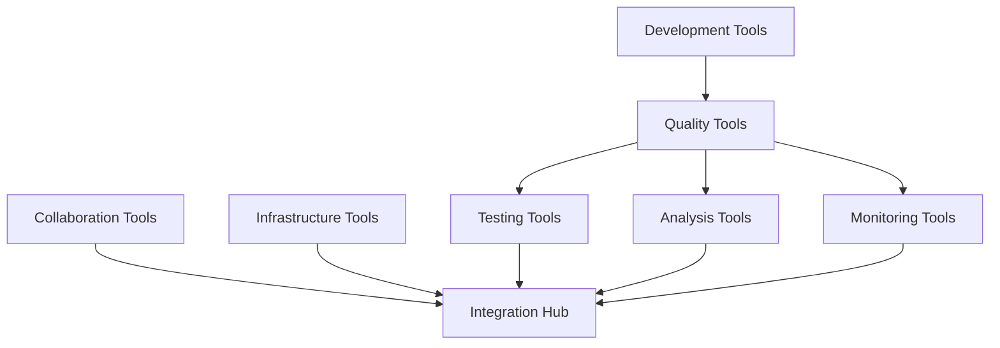
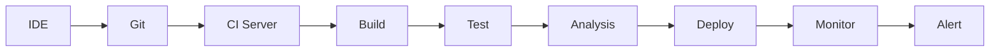

# Tools Ecosystem

## Purpose
Provide comprehensive guidance on selecting, implementing, and integrating tools that support software quality across the development lifecycle.

## Context
The right tools can amplify team productivity and quality, but tool sprawl and poor integration can hinder progress. This guide helps navigate the complex landscape of quality tools.

## Prerequisites
- Understanding of [Testing Strategy](../04-testing-strategy/README.md)
- Knowledge of [CI/CD Pipeline](../08-cicd-pipeline/README.md)
- Familiarity with development workflows

## Tool Categories Overview



## Development Environment

### Integrated Development Environments (IDEs)

#### Visual Studio Code
**Category:** Lightweight IDE
**Best For:** Web development, polyglot programming
**Key Features:**
- Extensive extension marketplace
- Built-in Git integration
- IntelliSense code completion
- Integrated terminal
- Live Share collaboration

**Quality Extensions:**
```json
{
  "recommendations": [
    "dbaeumer.vscode-eslint",
    "esbenp.prettier-vscode",
    "sonarSource.sonarlint-vscode",
    "ms-vscode.test-adapter-converter",
    "formulahendry.code-runner"
  ]
}
```

#### IntelliJ IDEA
**Category:** Full-featured IDE
**Best For:** Java, Kotlin, enterprise development
**Key Features:**
- Advanced code analysis
- Refactoring tools
- Database tools
- Built-in profiler
- Test runner integration

**Quality Features:**
- Code inspections (700+ for Java)
- Dependency analysis
- Duplicate detection
- Code coverage visualization

#### Visual Studio
**Category:** Enterprise IDE
**Best For:** .NET development, C++, enterprise
**Key Features:**
- IntelliTrace debugging
- Code Map
- Live Unit Testing
- Performance profiler
- Azure integration

### Code Editors Configuration

#### EditorConfig
**Universal editor configuration:**
```ini
# .editorconfig
root = true

[*]
charset = utf-8
end_of_line = lf
insert_final_newline = true
trim_trailing_whitespace = true
indent_style = space
indent_size = 2

[*.{js,jsx,ts,tsx}]
indent_size = 2

[*.{java,kt}]
indent_size = 4

[*.{py}]
indent_size = 4

[*.{md}]
trim_trailing_whitespace = false
```

## Version Control Systems

### Git Platforms

#### GitHub
**Features:**
- GitHub Actions CI/CD
- Pull request reviews
- Issue tracking
- Project boards
- Security scanning
- Dependabot

**Quality Integration:**
```yaml
# .github/workflows/quality.yml
name: Quality Checks
on: [push, pull_request]
jobs:
  quality:
    runs-on: ubuntu-latest
    steps:
      - uses: actions/checkout@v2
      - name: Run quality checks
        run: |
          npm run lint
          npm run test
          npm run build
```

#### GitLab
**Features:**
- GitLab CI/CD
- Merge request approvals
- Issue boards
- Container registry
- Security dashboard
- Code quality reports

#### Bitbucket
**Features:**
- Bitbucket Pipelines
- Pull request workflow
- Jira integration
- Trello boards
- Built-in CI/CD

### Git Tools

#### Git Hooks
**Pre-commit hooks for quality:**
```bash
#!/bin/sh
# .git/hooks/pre-commit

# Run linting
npm run lint
if [ $? -ne 0 ]; then
  echo "Linting failed. Please fix errors before committing."
  exit 1
fi

# Run tests
npm test
if [ $? -ne 0 ]; then
  echo "Tests failed. Please fix before committing."
  exit 1
fi
```

## Testing Tools

### Unit Testing Frameworks

#### JavaScript/TypeScript

**Jest**
```javascript
// jest.config.js
module.exports = {
  collectCoverage: true,
  coverageThreshold: {
    global: {
      branches: 80,
      functions: 80,
      lines: 80,
      statements: 80
    }
  },
  testEnvironment: 'node',
  setupFilesAfterEnv: ['<rootDir>/test/setup.js']
};
```

**Mocha + Chai**
```javascript
// mocha.opts
--require @babel/register
--recursive
--reporter spec
--timeout 5000
--watch-extensions js,jsx
```

#### Java

**JUnit 5**
```java
@ExtendWith(MockitoExtension.class)
class ServiceTest {
    @Mock
    private Repository repository;

    @InjectMocks
    private Service service;

    @Test
    @DisplayName("Should return user when ID exists")
    void testGetUser() {
        // Test implementation
    }
}
```

**TestNG**
```xml
<!DOCTYPE suite SYSTEM "http://testng.org/testng-1.0.dtd">
<suite name="Quality Suite" parallel="tests" thread-count="4">
    <test name="Unit Tests">
        <classes>
            <class name="com.example.UnitTests"/>
        </classes>
    </test>
</suite>
```

#### Python

**pytest**
```python
# pytest.ini
[pytest]
addopts =
    --cov=src
    --cov-report=html
    --cov-report=term
    --cov-fail-under=80
    -v
testpaths = tests
python_files = test_*.py
```

### Integration Testing

#### REST API Testing

**Postman**
- Collection runner
- Environment variables
- Pre/post request scripts
- Newman CLI integration
- Monitor scheduling

**REST Assured (Java)**
```java
@Test
public void testAPIEndpoint() {
    given()
        .contentType(ContentType.JSON)
        .body(requestBody)
    .when()
        .post("/api/users")
    .then()
        .statusCode(201)
        .body("id", notNullValue())
        .body("name", equalTo("John Doe"));
}
```

#### Database Testing

**DbUnit**
```xml
<dataset>
    <user id="1" name="John" email="john@example.com"/>
    <user id="2" name="Jane" email="jane@example.com"/>
</dataset>
```

### End-to-End Testing

#### Selenium WebDriver
```java
WebDriver driver = new ChromeDriver();
WebDriverWait wait = new WebDriverWait(driver, Duration.ofSeconds(10));

driver.get("https://example.com");
WebElement element = wait.until(
    ExpectedConditions.elementToBeClickable(By.id("submit"))
);
element.click();
```

#### Cypress
```javascript
// cypress.config.js
module.exports = {
  e2e: {
    baseUrl: 'http://localhost:3000',
    viewportWidth: 1280,
    viewportHeight: 720,
    video: true,
    screenshotOnRunFailure: true
  }
};
```

#### Playwright
```javascript
const { test, expect } = require('@playwright/test');

test('homepage has title', async ({ page }) => {
  await page.goto('https://example.com');
  await expect(page).toHaveTitle(/Example/);
  await page.screenshot({ path: 'homepage.png' });
});
```

### Performance Testing

#### JMeter
```xml
<ThreadGroup>
    <stringProp name="ThreadGroup.num_threads">100</stringProp>
    <stringProp name="ThreadGroup.ramp_time">10</stringProp>
    <stringProp name="ThreadGroup.duration">300</stringProp>
</ThreadGroup>
```

#### Gatling
```scala
class BasicSimulation extends Simulation {
  val httpProtocol = http.baseUrl("http://example.com")

  val scn = scenario("Basic Scenario")
    .exec(http("request").get("/"))
    .pause(1)

  setUp(
    scn.inject(rampUsers(100) during (10 seconds))
  ).protocols(httpProtocol)
}
```

#### K6
```javascript
import http from 'k6/http';
import { check } from 'k6';

export let options = {
  stages: [
    { duration: '2m', target: 100 },
    { duration: '5m', target: 100 },
    { duration: '2m', target: 0 },
  ],
  thresholds: {
    http_req_duration: ['p(95)<500'],
  },
};

export default function() {
  let res = http.get('https://example.com');
  check(res, { 'status is 200': (r) => r.status === 200 });
}
```

## Static Analysis Tools

### Code Quality

#### SonarQube
**Setup and Configuration:**
```yaml
# sonar-project.properties
sonar.projectKey=my-project
sonar.sources=src
sonar.tests=test
sonar.javascript.lcov.reportPaths=coverage/lcov.info
sonar.coverage.exclusions=**/*.test.js
```

**Quality Gates:**
```json
{
  "conditions": [
    {"metric": "coverage", "op": "LT", "error": "80"},
    {"metric": "bugs", "op": "GT", "error": "0"},
    {"metric": "vulnerabilities", "op": "GT", "error": "0"},
    {"metric": "code_smells", "op": "GT", "error": "10"},
    {"metric": "duplicated_lines_density", "op": "GT", "error": "3"}
  ]
}
```

#### ESLint
```javascript
// .eslintrc.js
module.exports = {
  extends: [
    'eslint:recommended',
    'plugin:@typescript-eslint/recommended',
    'prettier'
  ],
  rules: {
    'complexity': ['error', 10],
    'max-lines': ['error', 300],
    'max-depth': ['error', 4],
    'max-params': ['error', 3]
  }
};
```

#### Checkstyle (Java)
```xml
<!DOCTYPE module PUBLIC
  "-//Checkstyle//DTD Checkstyle Configuration 1.3//EN"
  "https://checkstyle.org/dtds/configuration_1_3.dtd">
<module name="Checker">
  <module name="TreeWalker">
    <module name="CyclomaticComplexity">
      <property name="max" value="10"/>
    </module>
    <module name="MethodLength">
      <property name="max" value="50"/>
    </module>
  </module>
</module>
```

### Security Scanning

#### SAST Tools

**Snyk**
```bash
# Install
npm install -g snyk

# Test for vulnerabilities
snyk test

# Monitor project
snyk monitor

# Fix vulnerabilities
snyk wizard
```

**OWASP Dependency Check**
```xml
<plugin>
    <groupId>org.owasp</groupId>
    <artifactId>dependency-check-maven</artifactId>
    <configuration>
        <failBuildOnCVSS>7</failBuildOnCVSS>
        <suppressionFiles>
            <suppressionFile>dependency-check-suppressions.xml</suppressionFile>
        </suppressionFiles>
    </configuration>
</plugin>
```

## CI/CD Tools

### Build Servers

#### Jenkins
```groovy
pipeline {
    agent any
    stages {
        stage('Build') {
            steps {
                sh 'npm install'
                sh 'npm run build'
            }
        }
        stage('Test') {
            steps {
                sh 'npm test'
            }
        }
        stage('Quality') {
            steps {
                sh 'npm run lint'
                sh 'npm run sonar'
            }
        }
        stage('Deploy') {
            when {
                branch 'main'
            }
            steps {
                sh 'npm run deploy'
            }
        }
    }
    post {
        always {
            junit 'reports/**/*.xml'
            publishHTML target: [
                reportDir: 'coverage',
                reportFiles: 'index.html',
                reportName: 'Coverage Report'
            ]
        }
    }
}
```

#### GitHub Actions
```yaml
name: CI/CD Pipeline
on:
  push:
    branches: [main, develop]
  pull_request:
    branches: [main]

jobs:
  test:
    runs-on: ubuntu-latest
    strategy:
      matrix:
        node-version: [14, 16, 18]
    steps:
      - uses: actions/checkout@v3
      - uses: actions/setup-node@v3
        with:
          node-version: ${{ matrix.node-version }}
      - run: npm ci
      - run: npm test
      - uses: codecov/codecov-action@v3
```

#### GitLab CI
```yaml
stages:
  - build
  - test
  - quality
  - deploy

variables:
  DOCKER_DRIVER: overlay2

before_script:
  - npm ci --cache .npm --prefer-offline

build:
  stage: build
  script:
    - npm run build
  artifacts:
    paths:
      - dist/

test:
  stage: test
  script:
    - npm test
  coverage: '/Lines\s*:\s*(\d+\.\d+)%/'
  artifacts:
    reports:
      junit: junit.xml
      coverage_report:
        coverage_format: cobertura
        path: coverage/cobertura-coverage.xml
```

## Monitoring Tools

### Application Performance Monitoring

#### New Relic
```javascript
// newrelic.js
exports.config = {
  app_name: ['My Application'],
  license_key: 'YOUR_LICENSE_KEY',
  distributed_tracing: {
    enabled: true
  },
  logging: {
    level: 'info'
  }
};
```

#### Datadog
```yaml
# datadog.yaml
api_key: YOUR_API_KEY
site: datadoghq.com
logs_enabled: true
apm_enabled: true
process_agent_enabled: true
```

### Log Management

#### ELK Stack
```json
// logstash.conf
input {
  beats {
    port => 5044
  }
}

filter {
  grok {
    match => { "message" => "%{COMBINEDAPACHELOG}" }
  }
  date {
    match => [ "timestamp", "dd/MMM/yyyy:HH:mm:ss Z" ]
  }
}

output {
  elasticsearch {
    hosts => ["localhost:9200"]
    index => "logs-%{+YYYY.MM.dd}"
  }
}
```

#### Grafana + Loki
```yaml
# promtail-config.yaml
clients:
  - url: http://loki:3100/loki/api/v1/push

scrape_configs:
  - job_name: system
    static_configs:
      - targets:
          - localhost
        labels:
          job: varlogs
          __path__: /var/log/*log
```

## Collaboration Tools

### Project Management

#### Jira
**Quality-focused configuration:**
- Bug tracking workflow
- Test case management
- Sprint burndown charts
- Velocity tracking
- Release planning

#### Azure DevOps Boards
**Features:**
- Kanban boards
- Sprint planning
- Capacity planning
- Burndown charts
- Dependency tracking

### Communication

#### Slack Integration
```javascript
// slack-notification.js
const webhook = process.env.SLACK_WEBHOOK;

async function notifyBuildStatus(status, details) {
  await fetch(webhook, {
    method: 'POST',
    body: JSON.stringify({
      text: `Build ${status}`,
      attachments: [{
        color: status === 'success' ? 'good' : 'danger',
        fields: details
      }]
    })
  });
}
```

## Tool Selection Matrix

### Testing Tools Comparison

| Tool | Type | Language | Learning Curve | Cost | Best For |
|------|------|----------|----------------|------|----------|
| Jest | Unit | JavaScript | Low | Free | React, Node.js |
| JUnit | Unit | Java | Low | Free | Java applications |
| Selenium | E2E | Multi | High | Free | Cross-browser |
| Cypress | E2E | JavaScript | Medium | Free/Paid | Modern web apps |
| JMeter | Performance | Java | Medium | Free | Load testing |
| Postman | API | Multi | Low | Free/Paid | REST APIs |

### CI/CD Tools Comparison

| Tool | Hosting | Complexity | Cost | Best For |
|------|---------|------------|------|----------|
| Jenkins | Self | High | Free | Customization |
| GitHub Actions | Cloud | Low | Free/Paid | GitHub repos |
| GitLab CI | Both | Medium | Free/Paid | GitLab integration |
| CircleCI | Cloud | Medium | Free/Paid | Docker workflows |
| Travis CI | Cloud | Low | Free/Paid | Open source |

## Tool Integration Patterns

### Quality Pipeline Integration


### Tool Chain Example
```yaml
toolchain:
  development:
    - Visual Studio Code
    - ESLint
    - Prettier
  version_control:
    - Git
    - GitHub
  ci_cd:
    - GitHub Actions
    - Docker
  testing:
    - Jest (unit)
    - Cypress (e2e)
    - K6 (performance)
  quality:
    - SonarQube
    - Snyk
  monitoring:
    - New Relic
    - PagerDuty
  collaboration:
    - Jira
    - Slack
```

## Implementation Roadmap

### Phase 1: Foundation (Month 1)
1. Set up version control (Git)
2. Configure IDE and editor settings
3. Implement basic linting
4. Set up unit testing framework

### Phase 2: Automation (Month 2)
1. Implement CI/CD pipeline
2. Add automated testing
3. Configure code coverage
4. Set up build automation

### Phase 3: Quality (Month 3)
1. Integrate static analysis
2. Add security scanning
3. Implement quality gates
4. Configure monitoring

### Phase 4: Optimization (Month 4)
1. Add performance testing
2. Implement advanced monitoring
3. Optimize tool chain
4. Document processes

## Tool Maintenance

### Regular Updates
- Weekly: Security patches
- Monthly: Minor updates
- Quarterly: Major updates
- Annually: Tool evaluation

### License Management
```json
{
  "licenses": {
    "development": ["VS Code", "IntelliJ"],
    "testing": ["BrowserStack", "Percy"],
    "monitoring": ["New Relic", "Datadog"],
    "security": ["Snyk", "Veracode"]
  },
  "renewal_dates": {
    "Q1": ["IntelliJ", "Snyk"],
    "Q2": ["New Relic"],
    "Q3": ["BrowserStack"],
    "Q4": ["Datadog", "Veracode"]
  }
}
```

## Checklist

### Tool Selection Checklist
- [ ] Identified team needs and requirements
- [ ] Evaluated tool options against criteria
- [ ] Considered integration capabilities
- [ ] Assessed total cost of ownership
- [ ] Planned implementation timeline
- [ ] Allocated training resources
- [ ] Defined success metrics
- [ ] Created fallback plan

### Implementation Checklist
- [ ] Installed and configured tools
- [ ] Integrated with existing systems
- [ ] Documented configuration
- [ ] Trained team members
- [ ] Established usage guidelines
- [ ] Set up monitoring
- [ ] Created runbooks
- [ ] Validated effectiveness

## References

### Official Documentation
- [Jenkins Documentation](https://www.jenkins.io/doc/)
- [GitHub Actions Documentation](https://docs.github.com/actions)
- [Docker Documentation](https://docs.docker.com/)
- [Kubernetes Documentation](https://kubernetes.io/docs/)

### Tool Comparisons
- ThoughtWorks Technology Radar
- Stack Overflow Developer Survey
- State of JS Survey
- JetBrains Developer Ecosystem Survey

## Related Topics

- [CI/CD Pipeline](../08-cicd-pipeline/README.md)
- [Testing Strategy](../04-testing-strategy/README.md)
- [Metrics & Monitoring](../09-metrics-monitoring/README.md)
- [Quality Governance](../11-governance/README.md)

---

*Next: [Quality Governance](../11-governance/README.md) - Implementing quality gates and compliance*