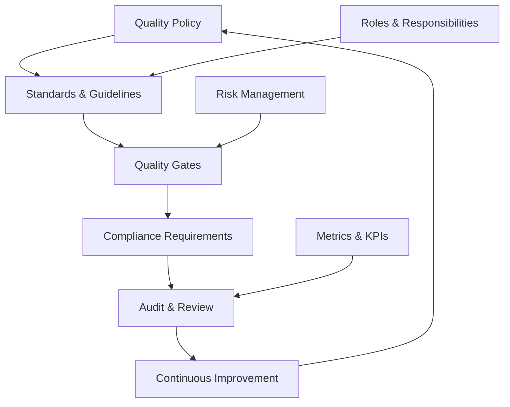
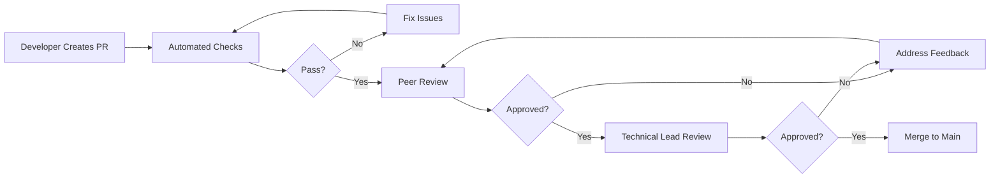
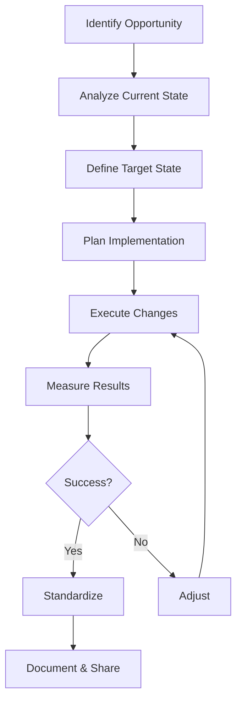

# Quality Governance

## Purpose
Establish frameworks, policies, and controls that ensure consistent quality standards across all software development activities while maintaining compliance with regulations and industry standards.

## Context
Quality governance provides the structure and accountability needed to maintain high standards, manage risks, and ensure compliance while enabling teams to deliver value efficiently.

## Prerequisites
- Understanding of [Quality Foundations](../00-foundations/README.md)
- Knowledge of [Metrics & Monitoring](../09-metrics-monitoring/README.md)
- Familiarity with organizational structure

## Governance Framework



## Quality Policy

### Enterprise Quality Policy Template

```markdown
# Software Quality Policy

## Purpose
This policy establishes the framework for maintaining software quality standards across [Organization Name] to ensure reliable, secure, and valuable software delivery.

## Scope
This policy applies to all software development activities, including:
- Internal applications
- Customer-facing products
- Third-party integrations
- Infrastructure and tooling

## Policy Statement
[Organization Name] commits to:
1. Delivering high-quality software that meets user needs
2. Maintaining security and compliance standards
3. Continuously improving quality processes
4. Measuring and monitoring quality metrics
5. Investing in team skills and tools

## Quality Objectives
- Maintain code coverage above 80%
- Achieve less than 5% defect escape rate
- Deploy to production at least weekly
- Maintain system availability above 99.9%
- Resolve critical issues within 4 hours

## Responsibilities
- **Executive Leadership**: Provide resources and support
- **Quality Team**: Define standards and processes
- **Development Teams**: Implement quality practices
- **All Employees**: Commit to quality in daily work

## Compliance
All teams must comply with:
- Industry regulations (GDPR, HIPAA, PCI-DSS as applicable)
- Security standards (OWASP, ISO 27001)
- Internal coding standards
- Documentation requirements

## Review
This policy will be reviewed annually and updated as needed.

Approved by: [Name]
Date: [Date]
Next Review: [Date]
```

## Quality Standards & Guidelines

### Coding Standards

#### Universal Coding Principles
1. **Readability First**: Code is read more than written
2. **Single Responsibility**: Each component does one thing well
3. **DRY (Don't Repeat Yourself)**: Eliminate duplication
4. **KISS (Keep It Simple)**: Avoid unnecessary complexity
5. **YAGNI (You Aren't Gonna Need It)**: Don't build for hypothetical futures

#### Language-Specific Standards

**JavaScript/TypeScript Standards**
```javascript
// ✅ Good: Descriptive names, single responsibility
function calculateOrderTotal(order) {
  const subtotal = order.items.reduce((sum, item) =>
    sum + (item.price * item.quantity), 0
  );
  const tax = calculateTax(subtotal, order.taxRate);
  const shipping = calculateShipping(order);
  return subtotal + tax + shipping;
}

// ❌ Bad: Unclear naming, multiple responsibilities
function calc(o) {
  let t = 0;
  for(let i of o.i) {
    t += i.p * i.q;
  }
  t = t * 1.1; // tax
  t += 10; // shipping
  return t;
}
```

**Java Standards**
```java
// ✅ Good: Clear structure, proper documentation
/**
 * Calculates the total price for an order including tax and shipping.
 *
 * @param order The order to calculate
 * @return Total price including all charges
 */
public BigDecimal calculateOrderTotal(Order order) {
    BigDecimal subtotal = order.getItems().stream()
        .map(item -> item.getPrice().multiply(BigDecimal.valueOf(item.getQuantity())))
        .reduce(BigDecimal.ZERO, BigDecimal::add);

    BigDecimal tax = taxCalculator.calculate(subtotal, order.getTaxRate());
    BigDecimal shipping = shippingCalculator.calculate(order);

    return subtotal.add(tax).add(shipping);
}
```

### Documentation Standards

#### Code Documentation Requirements

**Class/Module Level**
```typescript
/**
 * Manages user authentication and session handling.
 *
 * @module AuthenticationService
 * @requires TokenService
 * @requires UserRepository
 *
 * @example
 * const authService = new AuthenticationService(tokenService, userRepo);
 * const session = await authService.login(credentials);
 */
```

**Function/Method Level**
```python
def process_payment(order_id: str, payment_method: PaymentMethod) -> PaymentResult:
    """
    Process payment for an order using the specified payment method.

    Args:
        order_id: Unique identifier for the order
        payment_method: Payment method containing card or account details

    Returns:
        PaymentResult containing transaction ID and status

    Raises:
        PaymentException: If payment processing fails
        OrderNotFoundException: If order does not exist

    Example:
        >>> result = process_payment("ORD-123", credit_card)
        >>> print(result.transaction_id)
    """
```

### Testing Standards

#### Test Coverage Requirements

```yaml
coverage_requirements:
  minimum:
    lines: 80%
    branches: 75%
    functions: 80%
    statements: 80%

  critical_modules:
    payment_processing: 95%
    authentication: 95%
    data_encryption: 100%

  exclusions:
    - "*/test/*"
    - "*/mock/*"
    - "*/generated/*"
```

#### Test Naming Conventions

```javascript
// Test suite structure
describe('OrderService', () => {
  describe('calculateTotal', () => {
    it('should calculate correct total with single item', () => {
      // Test implementation
    });

    it('should apply discount when coupon is valid', () => {
      // Test implementation
    });

    it('should throw error when order is empty', () => {
      // Test implementation
    });
  });
});
```

## Quality Gates

### Definition
Quality gates are checkpoints in the development process where specific quality criteria must be met before proceeding to the next phase.

### Quality Gate Implementation

#### Development Quality Gates

**Pre-Commit Gate**
```bash
#!/bin/bash
# pre-commit quality gate

echo "Running quality gate checks..."

# Linting
npm run lint
if [ $? -ne 0 ]; then
  echo "❌ Linting failed"
  exit 1
fi

# Unit tests
npm run test:unit
if [ $? -ne 0 ]; then
  echo "❌ Unit tests failed"
  exit 1
fi

# Security check
npm audit --audit-level=high
if [ $? -ne 0 ]; then
  echo "❌ Security vulnerabilities found"
  exit 1
fi

echo "✅ All quality gates passed"
```

**Pull Request Gate**
```yaml
quality_gates:
  pull_request:
    required_checks:
      - build_passing: true
      - tests_passing: true
      - code_coverage: ">= 80%"
      - no_merge_conflicts: true
      - approved_reviews: >= 2
      - security_scan: "no high/critical"
      - documentation_updated: true
```

**Release Gate**
```json
{
  "release_criteria": {
    "functional": {
      "all_features_complete": true,
      "acceptance_criteria_met": true,
      "user_acceptance_testing": "passed"
    },
    "quality": {
      "zero_critical_bugs": true,
      "performance_benchmarks_met": true,
      "security_scan_passed": true,
      "accessibility_compliant": true
    },
    "operational": {
      "deployment_guide_updated": true,
      "rollback_plan_documented": true,
      "monitoring_configured": true,
      "alerts_configured": true
    },
    "business": {
      "stakeholder_approval": true,
      "release_notes_prepared": true,
      "training_completed": true
    }
  }
}
```

### Quality Gate Metrics

#### Build Quality Gate
```yaml
build_quality_gate:
  metrics:
    build_success_rate:
      threshold: "> 95%"
      measurement: "successful_builds / total_builds"
      period: "last_30_days"

    build_time:
      threshold: "< 10 minutes"
      measurement: "p95_build_duration"

    artifact_size:
      threshold: "< 50 MB"
      measurement: "compressed_artifact_size"
```

#### Code Quality Gate
```yaml
code_quality_gate:
  metrics:
    cyclomatic_complexity:
      threshold: "< 10"
      scope: "per_function"

    code_duplication:
      threshold: "< 3%"
      scope: "entire_codebase"

    technical_debt_ratio:
      threshold: "< 5%"
      calculation: "remediation_cost / development_cost"

    maintainability_index:
      threshold: "> 20"
      measurement: "based_on_halstead_volume"
```

## Compliance Requirements

### Regulatory Compliance

#### GDPR Compliance
```markdown
## GDPR Compliance Checklist

### Data Protection
- [ ] Personal data inventory maintained
- [ ] Data minimization principle applied
- [ ] Purpose limitation enforced
- [ ] Data retention policies implemented
- [ ] Right to erasure (right to be forgotten) supported

### Security Measures
- [ ] Encryption at rest and in transit
- [ ] Access controls implemented
- [ ] Regular security assessments
- [ ] Incident response plan in place
- [ ] Data breach notification process (72 hours)

### User Rights
- [ ] Consent mechanisms implemented
- [ ] Data portability supported
- [ ] Access request process established
- [ ] Opt-out mechanisms available
- [ ] Privacy policy updated and accessible

### Documentation
- [ ] Data Protection Impact Assessment (DPIA)
- [ ] Records of processing activities
- [ ] Data Processing Agreements (DPA) with third parties
- [ ] Privacy by Design documentation
```

#### HIPAA Compliance
```markdown
## HIPAA Compliance Requirements

### Technical Safeguards
- [ ] Access controls (unique user ID, automatic logoff)
- [ ] Audit logs and monitoring
- [ ] Integrity controls (ePHI not improperly altered)
- [ ] Transmission security (encryption)

### Physical Safeguards
- [ ] Facility access controls
- [ ] Workstation use policies
- [ ] Device and media controls

### Administrative Safeguards
- [ ] Security officer designated
- [ ] Workforce training completed
- [ ] Access management procedures
- [ ] Incident response procedures
- [ ] Business Associate Agreements (BAA)

### Audit Requirements
- [ ] Regular risk assessments
- [ ] Vulnerability scanning
- [ ] Penetration testing
- [ ] Compliance audits
```

#### PCI-DSS Compliance
```markdown
## PCI-DSS Compliance Checklist

### Build and Maintain Secure Network
- [ ] Firewall configuration standards
- [ ] No vendor default passwords
- [ ] Cardholder data protection
- [ ] Encrypted transmission
- [ ] Anti-virus software deployed

### Strong Access Control
- [ ] Restricted access to cardholder data
- [ ] Unique IDs for each user
- [ ] Physical access restrictions

### Regular Monitoring
- [ ] Track all access to network resources
- [ ] Regular security testing
- [ ] Security policies maintained
```

### Security Compliance

#### OWASP Top 10 Compliance
```yaml
owasp_compliance:
  A01_broken_access_control:
    controls:
      - Role-based access control (RBAC)
      - JWT validation
      - Session management
    testing:
      - Authorization bypass tests
      - Privilege escalation tests

  A02_cryptographic_failures:
    controls:
      - TLS 1.3 minimum
      - Strong cipher suites
      - Secure key management
    testing:
      - SSL/TLS configuration scan
      - Encryption validation

  A03_injection:
    controls:
      - Parameterized queries
      - Input validation
      - Output encoding
    testing:
      - SQL injection tests
      - Command injection tests
      - XSS tests
```

### Industry Standards Compliance

#### ISO 27001 Compliance
```markdown
## ISO 27001 Information Security Management

### Risk Assessment
- [ ] Asset inventory maintained
- [ ] Risk assessment methodology defined
- [ ] Threat identification completed
- [ ] Vulnerability assessment performed
- [ ] Risk treatment plan implemented

### Security Controls
- [ ] Access control policy
- [ ] Cryptography policy
- [ ] Operations security procedures
- [ ] Communications security
- [ ] Supplier relationship security

### Management System
- [ ] Information security policy
- [ ] Roles and responsibilities defined
- [ ] Competence and awareness training
- [ ] Document control procedures
- [ ] Internal audit program
```

## Risk Management

### Risk Assessment Framework

```markdown
## Software Quality Risk Register

### Risk Identification
| Risk ID | Category | Description | Likelihood | Impact | Risk Score |
|---------|----------|-------------|------------|---------|------------|
| R001 | Technical | Legacy system integration failure | High | High | 9 |
| R002 | Security | Data breach from SQL injection | Medium | Critical | 8 |
| R003 | Performance | System slowdown under peak load | Medium | High | 6 |
| R004 | Compliance | GDPR non-compliance penalties | Low | Critical | 6 |
| R005 | Operational | Key developer departure | Medium | Medium | 4 |

### Risk Matrix
```
Impact →
↑        Critical  [6] [8] [9] [10]
L        High      [4] [6] [7] [9]
i        Medium    [2] [4] [5] [7]
k        Low       [1] [2] [3] [5]
e
l              Low Medium High Critical
i
h
o
o
d
```

### Risk Mitigation Strategies
- **Accept**: Risk score 1-3
- **Monitor**: Risk score 4-5
- **Mitigate**: Risk score 6-7
- **Eliminate**: Risk score 8-10
```

### Risk Mitigation Plans

```yaml
risk_mitigation:
  R001_legacy_integration:
    strategy: Mitigate
    actions:
      - Create abstraction layer
      - Implement circuit breakers
      - Develop fallback mechanisms
      - Extensive integration testing
    owner: Architecture Team
    timeline: Q2 2024
    budget: $50,000

  R002_sql_injection:
    strategy: Eliminate
    actions:
      - Implement parameterized queries
      - Code review all database interactions
      - Deploy Web Application Firewall
      - Regular security scanning
    owner: Security Team
    timeline: Immediate
    budget: $20,000
```

## Audit & Review Processes

### Code Review Process

#### Code Review Workflow


#### Code Review Checklist
```markdown
## Code Review Checklist

### Functionality
- [ ] Code does what it's intended to do
- [ ] Edge cases are handled
- [ ] Error conditions are properly managed
- [ ] No obvious bugs

### Design
- [ ] Follows architectural patterns
- [ ] Appropriate abstractions
- [ ] No over-engineering
- [ ] Scalability considered

### Code Quality
- [ ] Follows coding standards
- [ ] Clear and meaningful names
- [ ] No code duplication
- [ ] Appropriate comments

### Testing
- [ ] Adequate test coverage
- [ ] Tests are meaningful
- [ ] Edge cases tested
- [ ] Mocks used appropriately

### Security
- [ ] Input validation present
- [ ] No hardcoded secrets
- [ ] Authentication/authorization correct
- [ ] No SQL injection vulnerabilities

### Performance
- [ ] No obvious bottlenecks
- [ ] Efficient algorithms
- [ ] Appropriate caching
- [ ] Database queries optimized

### Documentation
- [ ] API documentation updated
- [ ] README updated if needed
- [ ] Complex logic explained
- [ ] Breaking changes documented
```

### Quality Audits

#### Internal Audit Schedule
```yaml
audit_schedule:
  quarterly:
    - code_quality_audit:
        scope: "Critical systems"
        duration: "1 week"
        team: "Quality Team"

    - security_audit:
        scope: "External-facing applications"
        duration: "2 weeks"
        team: "Security Team"

  semi_annual:
    - compliance_audit:
        scope: "GDPR, HIPAA, PCI-DSS"
        duration: "3 weeks"
        team: "Compliance Team"

    - process_audit:
        scope: "SDLC processes"
        duration: "1 week"
        team: "PMO"

  annual:
    - third_party_audit:
        scope: "Complete system"
        duration: "4 weeks"
        team: "External Auditor"
```

#### Audit Report Template
```markdown
# Quality Audit Report

## Executive Summary
- Audit Period: [Start Date] - [End Date]
- Scope: [Systems/Processes Audited]
- Overall Rating: [Pass/Pass with Conditions/Fail]

## Findings

### Critical Issues (Must Fix)
1. [Issue description, impact, recommendation]

### Major Issues (Should Fix)
1. [Issue description, impact, recommendation]

### Minor Issues (Consider Fixing)
1. [Issue description, impact, recommendation]

## Compliance Status
- [ ] Coding Standards: [Compliant/Non-compliant]
- [ ] Security Standards: [Compliant/Non-compliant]
- [ ] Testing Standards: [Compliant/Non-compliant]
- [ ] Documentation Standards: [Compliant/Non-compliant]

## Recommendations
1. [Recommendation with priority and timeline]

## Action Plan
| Action | Owner | Due Date | Status |
|--------|-------|----------|---------|
| [Action] | [Name] | [Date] | [Status] |

## Next Audit
Date: [Date]
Scope: [Scope]
```

## Roles & Responsibilities

### RACI Matrix for Quality Governance

| Activity | Dev Team | QA Team | Tech Lead | Product Owner | Security Team | Compliance |
|----------|----------|---------|-----------|---------------|---------------|------------|
| Define Standards | C | R | A | I | C | C |
| Implement Standards | R | C | A | I | I | I |
| Quality Gates | R | A | C | I | C | C |
| Security Reviews | C | C | R | I | A | I |
| Compliance Audits | I | C | I | I | C | A |
| Risk Assessment | C | R | A | C | R | C |
| Incident Response | R | R | A | I | R | I |

*R = Responsible, A = Accountable, C = Consulted, I = Informed*

### Role Definitions

#### Quality Lead
**Responsibilities:**
- Define quality standards and policies
- Establish quality gates
- Monitor quality metrics
- Lead quality improvement initiatives
- Report to leadership

**Authority:**
- Veto releases that don't meet quality standards
- Allocate quality resources
- Define mandatory practices
- Escalate quality issues

#### Development Team
**Responsibilities:**
- Follow coding standards
- Write unit tests
- Participate in code reviews
- Fix quality issues
- Document code

#### QA Team
**Responsibilities:**
- Test planning and execution
- Defect management
- Test automation
- Quality reporting
- Process improvement

## Metrics & Reporting

### Quality Dashboard Metrics

```yaml
quality_dashboard:
  real_time_metrics:
    - build_status: "Last 10 builds"
    - test_pass_rate: "Current sprint"
    - code_coverage: "Current value"
    - open_defects: "By severity"
    - deployment_status: "Last deployment"

  daily_metrics:
    - commits: "Number and authors"
    - pull_requests: "Open/Closed/Merged"
    - build_success_rate: "24-hour window"
    - test_execution: "Passed/Failed/Skipped"

  weekly_metrics:
    - velocity: "Story points completed"
    - defect_trends: "Found vs Fixed"
    - code_quality_trends: "Technical debt"
    - security_vulnerabilities: "By severity"

  monthly_metrics:
    - release_quality: "Defect escape rate"
    - process_compliance: "Adherence percentage"
    - customer_satisfaction: "NPS/CSAT scores"
    - team_productivity: "Various measures"
```

### Executive Reporting

```markdown
# Monthly Quality Report - Executive Summary

## Key Metrics
- **Quality Score**: 92/100 (↑ 3 from last month)
- **Deployment Frequency**: 18 deployments (↑ 20%)
- **Lead Time**: 2.3 days (↓ 0.5 days)
- **MTTR**: 45 minutes (↓ 15 minutes)
- **Change Failure Rate**: 5.5% (↓ 2%)

## Highlights
- Zero critical security vulnerabilities
- 100% compliance audit pass rate
- 15% reduction in customer-reported defects

## Concerns
- Technical debt increasing in legacy module
- Test automation coverage below target (75% vs 80%)
- Two key quality engineers leaving next month

## Recommendations
1. Allocate sprint for technical debt reduction
2. Accelerate test automation initiative
3. Begin recruitment for quality engineers

## Next Month Focus
- Complete security certification renewal
- Launch performance optimization project
- Implement new quality gates for microservices
```

## Continuous Improvement Process

### Improvement Workflow



### Improvement Initiatives

```yaml
improvement_initiatives:
  Q1_2024:
    - initiative: "Reduce test execution time"
      current_state: "45 minutes"
      target_state: "15 minutes"
      approach: "Parallelize tests, optimize database"
      owner: "QA Team"
      status: "In Progress"

    - initiative: "Improve code review turnaround"
      current_state: "24 hours average"
      target_state: "4 hours average"
      approach: "Smaller PRs, review SLA, automation"
      owner: "Engineering Team"
      status: "Planning"

  Q2_2024:
    - initiative: "Implement security scanning"
      current_state: "Manual quarterly scans"
      target_state: "Automated daily scans"
      approach: "Integrate SAST/DAST tools"
      owner: "Security Team"
      status: "Approved"
```

## Governance Tools

### GRC (Governance, Risk, Compliance) Platforms

- **ServiceNow GRC**: Enterprise governance platform
- **MetricStream**: Compliance management
- **RSA Archer**: Risk management
- **SAI360**: Integrated GRC solution

### Quality Management Systems

- **Jira + Confluence**: Agile quality management
- **ALM Octane**: Application lifecycle management
- **qTest**: Test management platform
- **PractiTest**: QA management platform

## Checklist

### Governance Implementation Checklist

**Policy & Standards:**
- [ ] Quality policy defined and communicated
- [ ] Coding standards documented
- [ ] Testing standards established
- [ ] Documentation requirements clear
- [ ] Security standards implemented

**Quality Gates:**
- [ ] Development gates configured
- [ ] Build pipeline gates active
- [ ] Release gates defined
- [ ] Monitoring and alerts configured

**Compliance:**
- [ ] Regulatory requirements identified
- [ ] Compliance controls implemented
- [ ] Audit schedule established
- [ ] Training programs completed

**Risk Management:**
- [ ] Risk register maintained
- [ ] Mitigation plans documented
- [ ] Regular risk reviews conducted
- [ ] Incident response plan tested

**Continuous Improvement:**
- [ ] Metrics collection automated
- [ ] Regular reviews scheduled
- [ ] Improvement backlog maintained
- [ ] Lessons learned documented

## References

### Standards and Frameworks
- ISO 9001:2015 - Quality Management Systems
- ISO/IEC 25010 - Software Quality Models
- COBIT - IT Governance Framework
- ITIL - IT Service Management

### Regulatory Guidelines
- GDPR Compliance Guidelines
- HIPAA Security Rule
- PCI-DSS Requirements
- SOX Compliance for IT

## Related Topics

- [Quality Foundations](../00-foundations/README.md)
- [Metrics & Monitoring](../09-metrics-monitoring/README.md)
- [Continuous Improvement](../12-continuous-improvement/README.md)
- [Tools Ecosystem](../10-tools-ecosystem/README.md)

---

*Next: [Continuous Improvement](../12-continuous-improvement/README.md) - Implementing Kaizen and feedback loops*