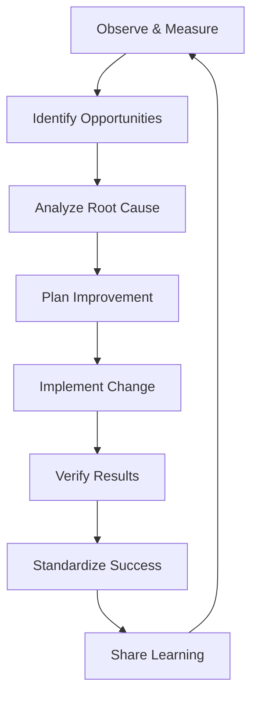
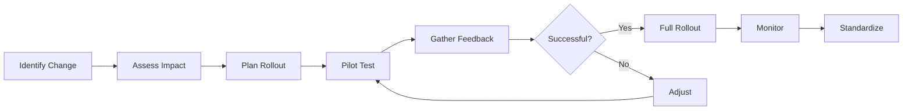

# Continuous Improvement

## Purpose
Establish systematic approaches for identifying, implementing, and sustaining improvements in software quality processes, practices, and outcomes through data-driven decision making and team collaboration.

## Context
Continuous improvement is not a one-time effort but an ongoing journey. It requires cultural commitment, structured processes, and measurable outcomes to transform good teams into excellent ones.

## Prerequisites
- Understanding of [Metrics & Monitoring](../09-metrics-monitoring/README.md)
- Knowledge of [Quality Governance](../11-governance/README.md)
- Familiarity with agile practices

## Continuous Improvement Framework



## Kaizen Philosophy

### Core Principles

#### 1. Continuous Small Improvements
**Concept:** Small, incremental changes compound over time
**Application:**
- Daily code refactoring
- Weekly process tweaks
- Sprint-by-sprint enhancements

**Example:**
```markdown
## Weekly Improvement Log

Week 1: Reduced build time by 30 seconds (optimized dependencies)
Week 2: Improved test naming convention (better readability)
Week 3: Added pre-commit hooks (caught 15 issues)
Week 4: Automated deployment notes (saved 20 min/release)

Monthly Impact: 2 hours saved per developer
```

#### 2. Everyone Participates
**Bottom-up Innovation:**
- Developers suggest code improvements
- QA identifies testing enhancements
- DevOps optimizes pipelines
- Product owners refine requirements

#### 3. Go to Gemba (Go and See)
**Observe Actual Work:**
```markdown
## Gemba Walk Checklist

### Developer Observation
- [ ] Watch actual coding session
- [ ] Identify repetitive tasks
- [ ] Note tool switching friction
- [ ] Observe debugging process
- [ ] Document wait times

### Findings Template
Date: [Date]
Observer: [Name]
Area: [Development/Testing/Deployment]

Observations:
1. [What was observed]
2. [Waste identified]
3. [Improvement opportunity]

Actions:
1. [Immediate fix]
2. [Short-term improvement]
3. [Long-term solution]
```

#### 4. Challenge Everything
**Question Status Quo:**
- Why do we do it this way?
- What if we tried differently?
- Can we eliminate this step?
- How can we automate this?

### Implementing Kaizen

#### Kaizen Events (Focused Improvements)

**Planning a Kaizen Event:**
```yaml
kaizen_event:
  topic: "Reduce Deployment Time"
  duration: "3 days"
  team_size: "5-7 people"

  day_1:
    - Map current process
    - Measure baseline metrics
    - Identify waste

  day_2:
    - Brainstorm solutions
    - Prioritize improvements
    - Create implementation plan

  day_3:
    - Implement quick wins
    - Test improvements
    - Document new process

  expected_outcomes:
    - Process map (before/after)
    - Identified waste (>10 items)
    - Implemented improvements (>5)
    - Measured improvement (>30%)
```

#### Daily Kaizen

**5-Minute Daily Improvement:**
```javascript
// Daily improvement tracker
class DailyKaizen {
  constructor() {
    this.improvements = [];
    this.timesSaved = 0;
  }

  addImprovement(improvement) {
    this.improvements.push({
      date: new Date(),
      description: improvement.description,
      timeSaved: improvement.timeSaved,
      type: improvement.type
    });

    this.timesSaved += improvement.timeSaved;
    this.celebrateIfMilestone();
  }

  celebrateIfMilestone() {
    if (this.improvements.length % 100 === 0) {
      console.log(`🎉 ${this.improvements.length} improvements!`);
      console.log(`⏱️ ${this.timesSaved} minutes saved!`);
    }
  }
}
```

## Retrospectives

### Sprint Retrospective Format

#### 1. Set the Stage (5 minutes)
**Check-in Questions:**
- In one word, how do you feel about the last sprint?
- Rate the sprint from 1-10
- Share one success from the sprint

#### 2. Gather Data (15 minutes)

**Timeline Activity:**
```markdown
Sprint Timeline
━━━━━━━━━━━━━━━━━━━━━━━━━━━━━━━━━━━━━
Day 1    Day 3    Day 5    Day 7    Day 10
  ↓        ↓        ↓        ↓        ↓
😊 Sprint  😟 Scope  😊 Demo   😫 Bug    😊 Fixed
   planning  change    prep     found     & shipped
```

**Mad, Sad, Glad:**
```markdown
😠 Mad (Frustrating)
- Build broke 3 times
- Requirements changed mid-sprint

😢 Sad (Disappointing)
- Couldn't complete stretch goal
- Team member sick for 3 days

😊 Glad (Positive)
- Great collaboration on complex feature
- Improved test coverage to 85%
```

#### 3. Generate Insights (20 minutes)

**5 Whys Analysis:**
```markdown
Problem: Builds breaking frequently

Why 1: Tests are failing
Why 2: New code introduces bugs
Why 3: Insufficient test coverage for new features
Why 4: Developers skip writing tests due to time pressure
Why 5: Sprint commitments don't account for test writing time

Root Cause: Planning doesn't allocate enough time for quality
```

**Fishbone Diagram:**
```
        People          Process
          ↓               ↓
    Lack training    No standards
          \             /
           \           /
            ↘         ↙
          Build Failures
            ↗         ↖
           /           \
          /             \
    Old versions    Flaky tests
          ↑               ↑
       Tools         Environment
```

#### 4. Decide What to Do (15 minutes)

**Action Planning:**
```markdown
## Sprint Retrospective Actions

### Stop
- Committing without running tests locally
- Starting new work on last day of sprint

### Start
- Daily code review sessions (15 min)
- Writing tests before code (TDD)
- Updating documentation same day

### Continue
- Daily standups at 9:30 AM
- Pair programming for complex features
- Celebrating wins in team chat

### Experiments
- Mob programming Fridays (2 hours)
- No-meeting Wednesdays
- Automated PR descriptions
```

#### 5. Close the Retrospective (5 minutes)

**Appreciation Round:**
- Each person appreciates someone else
- Focus on specific actions/behaviors
- Write appreciation notes

### Retrospective Metrics

```yaml
retrospective_metrics:
  participation:
    metric: "Team members contributing"
    target: "100%"
    measurement: "Number speaking / Total members"

  action_completion:
    metric: "Actions completed from last retro"
    target: "80%"
    measurement: "Completed actions / Total actions"

  satisfaction:
    metric: "Retro effectiveness"
    target: "4/5"
    measurement: "Post-retro survey"

  improvement_velocity:
    metric: "Improvements per sprint"
    target: "3+"
    measurement: "Implemented changes"
```

## Root Cause Analysis

### Incident Analysis Framework

#### Incident Timeline
```markdown
## Incident: Payment Service Outage

### Timeline
- **14:30** - First alert: Response time > 5s
- **14:32** - Escalation: Service returning 503 errors
- **14:35** - Investigation: Database connection pool exhausted
- **14:40** - Mitigation: Increased connection pool size
- **14:45** - Resolution: Service recovered
- **14:50** - Monitoring: Confirming stability

### Impact
- Duration: 20 minutes
- Affected users: ~10,000
- Failed transactions: 450
- Revenue impact: $15,000
```

#### 5 Whys Example
```markdown
## Root Cause Analysis: Payment Service Outage

**Problem:** Payment service became unavailable

**Why 1:** Database connection pool was exhausted
→ Connection pool had only 20 connections

**Why 2:** 20 connections insufficient for load
→ Load increased 3x due to promotion

**Why 3:** Capacity planning didn't account for promotion
→ Marketing and Engineering didn't coordinate

**Why 4:** No process for capacity planning review
→ Assumed normal growth patterns

**Why 5:** No formal communication channel between teams
→ Siloed organization structure

**Root Cause:** Lack of cross-team coordination process

**Actions:**
1. Immediate: Increase connection pool to 100
2. Short-term: Create capacity planning checklist
3. Long-term: Establish weekly Marketing-Engineering sync
```

#### Fault Tree Analysis
```
                Payment Failure
                      ↑
            ┌─────────┴─────────┐
            ↑                   ↑
     Database Issue       Network Issue
            ↑                   ↑
    ┌───────┴───────┐   ┌──────┴──────┐
    ↑               ↑   ↑              ↑
Pool Exhausted  Deadlock Timeout   Packet Loss
    ↑               ↑   ↑              ↑
High Load     Bad Query DNS Fail   Route Issue
```

### Blameless Postmortems

#### Postmortem Template
```markdown
# Postmortem: [Incident Title]

## Incident Summary
- **Date:** [Date]
- **Duration:** [Duration]
- **Impact:** [User/Business Impact]
- **Severity:** [P1/P2/P3]

## What Happened
[Narrative description of the incident]

## Timeline
[Detailed timeline with actions taken]

## Root Cause
[5 Whys or other RCA technique results]

## What Went Well
- [Quick detection]
- [Effective communication]
- [Rapid mitigation]

## What Could Be Improved
- [Earlier detection possible]
- [Automation opportunity]
- [Documentation gaps]

## Action Items
| Action | Owner | Due Date | Priority |
|--------|-------|----------|----------|
| [Action] | [Name] | [Date] | [P1/P2/P3] |

## Lessons Learned
1. [Key learning that will prevent recurrence]
2. [Process improvement identified]
3. [Tool or automation opportunity]

## Supporting Information
- [Links to graphs, logs, etc.]
```

#### Postmortem Culture
```yaml
postmortem_principles:
  blameless:
    - Focus on systems, not people
    - Assume everyone did their best
    - Learn from mistakes
    - Share knowledge widely

  thorough:
    - Complete timeline
    - Multiple perspectives
    - Data-driven analysis
    - Clear action items

  actionable:
    - Specific improvements
    - Assigned owners
    - Measurable outcomes
    - Follow-up reviews

  transparent:
    - Share with entire organization
    - Publish learnings publicly
    - Track action completion
    - Celebrate improvements
```

## Lessons Learned

### Knowledge Management System

#### Lesson Learned Template
```markdown
# Lesson Learned: [Title]

## Context
- **Project/Sprint:** [Name]
- **Date:** [Date]
- **Team:** [Team Name]
- **Category:** [Technical/Process/People]

## Situation
What was the context or challenge?

## Action
What did we do?

## Result
What was the outcome?

## Lesson
What did we learn?

## Recommendations
How should others apply this learning?

## Keywords
[Testing, Performance, Security, etc.]

## Related Documents
- [Links to relevant documentation]
```

#### Knowledge Repository Structure
```
/lessons-learned
├── /technical
│   ├── database-optimization.md
│   ├── microservices-patterns.md
│   └── performance-tuning.md
├── /process
│   ├── estimation-improvements.md
│   ├── code-review-efficiency.md
│   └── deployment-automation.md
├── /incidents
│   ├── 2024-01-outage.md
│   └── 2024-02-security.md
└── /success-stories
    ├── 10x-performance-gain.md
    └── zero-defect-release.md
```

### Learning Distribution

#### Knowledge Sharing Methods

**Brown Bag Sessions:**
```markdown
## Brown Bag Schedule

### Month 1
- Week 1: "Lessons from Production Outage"
- Week 2: "New Testing Framework Demo"
- Week 3: "Performance Optimization Techniques"
- Week 4: "Security Best Practices Update"

### Format (1 hour)
- 00-05: Introduction & Context
- 05-35: Main Presentation
- 35-50: Q&A and Discussion
- 50-60: Action Items & Next Steps
```

**Engineering Blog:**
```markdown
## Blog Post: How We Reduced Build Time by 70%

### The Problem
Our builds were taking 45 minutes...

### The Investigation
We profiled the build process...

### The Solution
1. Parallelize test execution
2. Cache dependencies
3. Optimize Docker layers

### The Results
- Build time: 45 min → 13 min
- Developer satisfaction: ↑ 40%
- Deployment frequency: 2x

### Try It Yourself
[Code examples and configuration]
```

## Innovation Time

### 20% Time Implementation

#### Innovation Time Policy
```markdown
## Innovation Time Guidelines

### Allocation
- Every Friday afternoon (4 hours)
- Or accumulated: 1 day every 2 weeks

### Acceptable Projects
- Tool improvements
- Process automation
- Proof of concepts
- Learning new technologies
- Open source contributions

### Requirements
- Align with team/company goals
- Share outcomes with team
- Document learnings
- Demo if applicable

### Success Stories
- Automated test data generator (saved 5 hrs/week)
- VS Code extension for common tasks
- Performance monitoring dashboard
- Slack bot for deployment status
```

#### Innovation Tracking
```yaml
innovation_tracker:
  project: "Automated Documentation Generator"
  innovator: "Jane Doe"
  time_invested: "32 hours"
  status: "Completed"

  outcomes:
    - time_saved: "10 hours/month"
    - quality_impact: "100% API docs coverage"
    - team_adoption: "Full team using"

  learnings:
    - "AST parsing is powerful for code analysis"
    - "TypeScript decorators simplify metadata"
    - "Generated docs need human review"

  next_steps:
    - "Extend to generate test cases"
    - "Add diagram generation"
    - "Open source the tool"
```

### Hackathons

#### Hackathon Planning
```markdown
## Quality Hackathon: "Make It Better"

### Theme
Improve any aspect of our development lifecycle

### Schedule
**Day 1 - Friday**
- 09:00: Kickoff & Team Formation
- 10:00: Hacking Begins
- 13:00: Lunch & Networking
- 18:00: Dinner
- 00:00: Overnight Hacking (optional)

**Day 2 - Saturday**
- 09:00: Breakfast
- 12:00: Hacking Stops
- 13:00: Lunch
- 14:00: Presentations (5 min each)
- 16:00: Judging
- 17:00: Awards & Celebration

### Categories
- Best Developer Experience Improvement
- Most Creative Testing Solution
- Highest Impact Automation
- Best Security Enhancement
- People's Choice Award

### Judging Criteria
- Innovation (25%)
- Impact (25%)
- Implementation (25%)
- Presentation (25%)
```

## Metrics for Improvement

### Improvement Velocity Metrics

```yaml
improvement_metrics:
  velocity:
    improvements_per_month:
      calculation: "Count of implemented improvements"
      target: "> 10"
      current: 12

    time_to_implement:
      calculation: "Average days from identification to implementation"
      target: "< 14 days"
      current: "10 days"

  impact:
    time_saved_per_month:
      calculation: "Sum of time saved by improvements"
      target: "> 40 hours"
      current: "52 hours"

    defect_reduction:
      calculation: "% reduction in defect rate"
      target: "> 10% per quarter"
      current: "15%"

  engagement:
    participation_rate:
      calculation: "Team members contributing ideas / Total"
      target: "> 80%"
      current: "85%"

    idea_implementation_rate:
      calculation: "Implemented ideas / Submitted ideas"
      target: "> 30%"
      current: "35%"
```

### ROI Calculation

```javascript
class ImprovementROI {
  calculate(improvement) {
    const costs = this.calculateCosts(improvement);
    const benefits = this.calculateBenefits(improvement);

    return {
      roi: ((benefits - costs) / costs) * 100,
      paybackPeriod: costs / (benefits / 12), // months
      breakEven: new Date(Date.now() + (costs / (benefits / 365)) * 86400000)
    };
  }

  calculateCosts(improvement) {
    return improvement.developmentHours * improvement.hourlyRate +
           improvement.toolingCost +
           improvement.trainingCost;
  }

  calculateBenefits(improvement) {
    const timeSaved = improvement.hoursSavedPerMonth * 12 * improvement.hourlyRate;
    const defectReduction = improvement.defectsAvoided * improvement.defectCost;
    const productivityGain = improvement.productivityIncrease * improvement.teamSize * improvement.avgSalary;

    return timeSaved + defectReduction + productivityGain;
  }
}
```

## Change Management

### Implementing Improvements

#### Change Implementation Framework


#### Change Communication Plan
```markdown
## Change Communication Template

### Change: [New Code Review Process]

#### Stakeholder Communication
| Audience | Message | Channel | Timing |
|----------|---------|---------|---------|
| Developers | Detailed process changes | Team meeting | 1 week before |
| Management | Impact and benefits | Email summary | 2 weeks before |
| QA Team | Integration points | Workshop | 1 week before |
| Product | Timeline impacts | Slack update | Day of change |

#### Communication Messages

**For Developers:**
Subject: Improving Our Code Review Process - Starting Monday

What's Changing:
- Reviews required within 4 hours
- New checklist in PR template
- Automated assignment based on expertise

Why:
- Current average review time: 24 hours
- Goal: Ship features 3x faster
- Maintain quality standards

Resources:
- [New Process Guide]
- [Video Walkthrough]
- [FAQ Document]

Questions? Join our Q&A session Friday 2 PM
```

### Sustaining Improvements

#### Sustainability Checklist
```markdown
## Improvement Sustainability Checklist

### Documentation
- [ ] Process documented in wiki
- [ ] Runbook/guide created
- [ ] Video tutorial recorded
- [ ] FAQ compiled

### Training
- [ ] Team trained on new process
- [ ] Training materials created
- [ ] Onboarding updated
- [ ] Refresher scheduled

### Automation
- [ ] Process steps automated where possible
- [ ] Alerts/reminders configured
- [ ] Metrics collection automated
- [ ] Reports scheduled

### Reinforcement
- [ ] Success metrics defined
- [ ] Regular reviews scheduled
- [ ] Feedback mechanism in place
- [ ] Recognition system updated

### Monitoring
- [ ] KPIs identified and tracked
- [ ] Dashboard created
- [ ] Regression alerts configured
- [ ] Review cadence established
```

## Creating a Culture of Improvement

### Leadership Support

```yaml
leadership_actions:
  model_behavior:
    - Participate in retrospectives
    - Share own failures and learnings
    - Celebrate improvements publicly
    - Allocate time for improvement work

  provide_resources:
    - Budget for tools and training
    - Time allocation (10-20% for improvement)
    - Recognition and rewards
    - Remove impediments

  communicate_vision:
    - Clear quality goals
    - Improvement success stories
    - Regular progress updates
    - Link to business value
```

### Team Empowerment

```markdown
## Empowerment Framework

### Decision Authority
Teams can autonomously decide on:
- Development tools and frameworks
- Testing strategies and tools
- Code review process
- Sprint improvement actions
- Technical debt prioritization

### Budget Authority
- Up to $1,000/month for tools
- Training budget: $2,000/person/year
- Hackathon budget: $5,000/quarter
- Conference attendance: 2/year

### Time Authority
- 20% time for improvements
- 1 day/sprint for technical debt
- Quarterly improvement days
- Annual innovation week
```

### Recognition and Rewards

```markdown
## Recognition Program

### Improvement Champion
- Monthly award for best improvement
- Prize: $100 gift card + trophy
- Criteria: Impact, creativity, effort

### Quality Star
- Quarterly award for quality excellence
- Prize: Extra vacation day + recognition
- Criteria: Zero defects, mentoring, innovation

### Team Excellence
- Annual award for best improving team
- Prize: Team outing + bonus
- Criteria: Metrics improvement, collaboration

### Innovation Award
- Hackathon and innovation time winners
- Prize: Conference attendance + implementation time
- Criteria: Originality, impact, feasibility
```

## Checklist

### Continuous Improvement Checklist

**Foundation:**
- [ ] Improvement process defined
- [ ] Metrics baseline established
- [ ] Tools and systems in place
- [ ] Team trained on methods

**Regular Activities:**
- [ ] Weekly team improvements identified
- [ ] Sprint retrospectives conducted
- [ ] Monthly metrics reviewed
- [ ] Quarterly improvement goals set

**Knowledge Management:**
- [ ] Lessons learned documented
- [ ] Knowledge sharing sessions held
- [ ] Best practices updated
- [ ] Success stories shared

**Innovation:**
- [ ] Innovation time allocated
- [ ] Hackathons scheduled
- [ ] Experiments encouraged
- [ ] Failures celebrated as learning

**Sustainability:**
- [ ] Changes standardized
- [ ] Documentation maintained
- [ ] Training provided
- [ ] Progress monitored

## References

### Books
- "The Toyota Way" by Jeffrey Liker
- "Kaizen: The Key to Japan's Competitive Success" by Masaaki Imai
- "The Lean Startup" by Eric Ries
- "The DevOps Handbook" by Gene Kim et al.

### Frameworks
- Lean Six Sigma
- Theory of Constraints
- Systems Thinking
- Design Thinking

### Online Resources
- Kaizen Institute
- Lean Enterprise Institute
- DevOps Research and Assessment (DORA)
- Agile Alliance Resources

## Related Topics

- [Metrics & Monitoring](../09-metrics-monitoring/README.md)
- [Quality Governance](../11-governance/README.md)
- [Agile Planning](../02-agile-planning/README.md)
- [Testing Strategy](../04-testing-strategy/README.md)

---

*Continuous improvement is a journey, not a destination. Every day, every sprint, every release is an opportunity to be better than before.*