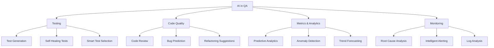

# AI in Quality Assurance

## Purpose
Provide comprehensive guidance on leveraging Artificial Intelligence and Machine Learning to enhance software quality processes, from test generation to predictive analytics, enabling teams to build more reliable software faster and smarter.

## Context
Artificial Intelligence is transforming Quality Assurance practices. From automated test generation to predictive defect detection, AI tools are becoming essential for modern QA teams. This module bridges the gap between traditional QA practices and AI-enhanced workflows, providing both foundational knowledge and practical implementation guidance.

## Prerequisites
- Understanding of [Testing Strategy](../04-testing-strategy/README.md)
- Familiarity with [Metrics & Monitoring](../09-metrics-monitoring/README.md)
- Basic programming knowledge
- OpenAI/Anthropic API access (for practical exercises)

## AI in QA Overview



## Learning Path

### Start Here (Foundations)
1. **[AI Fundamentals](ai-fundamentals.md)** ✅ - Understanding LLMs, RAG, embeddings, and core AI concepts
2. **[AI Tool Ecosystem](ai-tool-ecosystem.md)** ✅ - Overview of available AI tools for QA

### Core Applications
3. **[AI-Assisted Testing](ai-assisted-testing.md)** ✅ - Automated test generation and maintenance
4. **[AI Code Quality](ai-code-quality.md)** ✅ - AI-powered code reviews, refactoring suggestions, and technical debt detection
5. **[AI Test Automation](ai-test-automation.md)** ✅ - Self-healing tests, smart test selection, and flaky test detection
6. **[AI Metrics & Analytics](ai-metrics-analytics.md)** ✅ - Predictive quality analytics and defect prediction

### Advanced Topics
7. **[Building AI QA Assistant](building-ai-qa-assistant.md)** ✅ - Complete LLM + RAG implementation guide
8. **[AI Monitoring & Observability](ai-monitoring-observability.md)** ✅ - AI-enhanced monitoring and root cause analysis
9. **[AI Requirements & Planning](ai-requirements-planning.md)** ✅ - Requirements validation with AI

### Responsible Adoption
10. **[Ethics & Limitations](ethics-limitations.md)** ✅ - Responsible AI use, data privacy, and known limitations
11. **[Implementation Roadmap](implementation-roadmap.md)** ✅ - Phased 16-week adoption strategy

**All 11 topics are now complete!** ✅ Each guide includes production-ready code examples, practical implementation strategies, cost-benefit analyses, and real-world use cases.

## Why AI in QA?

### The Challenge
Traditional QA faces several challenges:
- **Time-Consuming Test Creation**: Writing comprehensive tests manually is slow
- **Test Maintenance Burden**: Keeping tests up-to-date with changing code
- **Reactive Quality**: Finding defects after they occur
- **Alert Fatigue**: Too many false positive alerts
- **Manual Code Reviews**: Time-consuming and inconsistent
- **Limited Test Coverage**: Difficult to test all edge cases

### The AI Solution
AI enhances QA by:
- **Automated Test Generation**: AI creates tests from requirements and code
- **Self-Healing Tests**: AI fixes broken tests automatically
- **Predictive Quality**: ML predicts defects before they occur
- **Intelligent Alerts**: AI reduces false positives by 80%+
- **Faster Code Reviews**: AI provides instant feedback on PRs
- **Comprehensive Coverage**: AI identifies untested scenarios

### Impact Metrics
Teams using AI in QA report:
- **60-80%** reduction in test creation time
- **50-70%** decrease in test maintenance effort
- **40-60%** fewer defects reaching production
- **70-90%** reduction in alert noise
- **3-5x** faster code review cycles
- **30-50%** improvement in test coverage

## AI Capabilities in QA

### 1. Test Generation
**What AI Can Do:**
- Generate unit tests from function signatures
- Create integration tests from API contracts
- Build E2E tests from user stories
- Generate edge case scenarios
- Create test data automatically

**Example Use Cases:**
```javascript
// AI Input: Function to test
function validateEmail(email) {
  const regex = /^[^\s@]+@[^\s@]+\.[^\s@]+$/;
  return regex.test(email);
}

// AI Output: Generated test suite
describe('validateEmail', () => {
  test('accepts valid email addresses', () => {
    expect(validateEmail('user@example.com')).toBe(true);
    expect(validateEmail('test.user@domain.co.uk')).toBe(true);
  });

  test('rejects invalid email addresses', () => {
    expect(validateEmail('invalid')).toBe(false);
    expect(validateEmail('@example.com')).toBe(false);
    expect(validateEmail('user@')).toBe(false);
  });

  test('handles edge cases', () => {
    expect(validateEmail('')).toBe(false);
    expect(validateEmail(null)).toBe(false);
    expect(validateEmail('user@domain')).toBe(false);
  });
});
```

### 2. Code Review Automation
**What AI Can Do:**
- Identify potential bugs before code review
- Suggest performance optimizations
- Detect security vulnerabilities
- Check coding standards compliance
- Recommend refactoring opportunities

**Example Use Cases:**
```python
# AI analyzes this code
def process_users(users):
    result = []
    for user in users:
        if user['active'] == True:
            result.append(user['name'].upper())
    return result

# AI provides feedback:
# 1. Use list comprehension for better performance
# 2. Direct boolean comparison (== True) is unnecessary
# 3. Consider handling None values in user['name']
# 4. Missing type hints

# AI suggests:
def process_users(users: List[Dict]) -> List[str]:
    """Process active users and return uppercase names."""
    return [
        user['name'].upper()
        for user in users
        if user.get('active') and user.get('name')
    ]
```

### 3. Defect Prediction
**What AI Can Do:**
- Predict which code changes are likely to cause bugs
- Identify high-risk deployments
- Forecast where defects will occur
- Estimate bug-fix time
- Prioritize bug triage

**Example Metrics:**
```yaml
defect_prediction_model:
  accuracy: 85%
  precision: 82%
  recall: 78%

  features_used:
    - code_complexity
    - author_experience
    - file_change_frequency
    - test_coverage
    - previous_defects
    - code_churn

  output:
    defect_probability: 0.73  # 73% chance of defect
    confidence: 0.89          # 89% confidence
    risk_level: "HIGH"
    recommendation: "Requires thorough testing and review"
```

### 4. Anomaly Detection
**What AI Can Do:**
- Detect unusual patterns in metrics
- Identify performance degradation early
- Find abnormal user behavior
- Spot security threats
- Reduce alert fatigue by 80%

**Example Implementation:**
```python
# AI anomaly detector for response times
class ResponseTimeAnomalyDetector:
    def __init__(self):
        self.model = IsolationForest(contamination=0.1)
        self.scaler = StandardScaler()

    def detect_anomalies(self, response_times):
        # Prepare features
        features = self.extract_features(response_times)
        scaled_features = self.scaler.fit_transform(features)

        # Predict anomalies
        predictions = self.model.fit_predict(scaled_features)

        # Identify anomalous requests
        anomalies = [
            {
                'timestamp': rt['timestamp'],
                'response_time': rt['value'],
                'severity': self.calculate_severity(rt),
                'context': self.get_context(rt)
            }
            for rt, pred in zip(response_times, predictions)
            if pred == -1  # Anomaly detected
        ]

        return anomalies
```

### 5. Root Cause Analysis
**What AI Can Do:**
- Analyze logs to identify incident causes
- Correlate events across systems
- Suggest remediation actions
- Learn from past incidents
- Generate postmortem insights

**Example Analysis:**
```
Incident: API Response Time Spike at 14:30 UTC

AI Root Cause Analysis:
┌─────────────────────────────────────────────┐
│ Primary Cause (Confidence: 92%)            │
├─────────────────────────────────────────────┤
│ Database connection pool exhaustion        │
│                                            │
│ Evidence:                                  │
│ - Connection pool at 100% capacity         │
│ - Query queue depth increased 300%         │
│ - No database CPU/memory issues            │
├─────────────────────────────────────────────┤
│ Contributing Factors:                      │
├─────────────────────────────────────────────┤
│ 1. Traffic spike (3x normal) from promo   │
│ 2. Long-running queries (avg 2.5s → 8s)  │
│ 3. Connection pool size not scaled        │
├─────────────────────────────────────────────┤
│ Recommended Actions:                       │
├─────────────────────────────────────────────┤
│ 1. Immediate: Increase pool size 20→50    │
│ 2. Short-term: Optimize slow queries      │
│ 3. Long-term: Implement auto-scaling      │
└─────────────────────────────────────────────┘

Similar Incidents: 2 (March 2024, May 2024)
Success Rate of Recommendation: 95%
```

## AI Technology Stack

### Large Language Models (LLMs)
**Commercial:**
- **OpenAI GPT-4/GPT-4 Turbo**: Best for code generation, review
- **Anthropic Claude 3**: Excellent for analysis, long context
- **Google Gemini Pro**: Good for multimodal analysis
- **GitHub Copilot**: Specialized for code completion

**Open Source:**
- **Meta Llama 3**: Strong performance, customizable
- **Mistral**: Efficient, cost-effective
- **CodeLlama**: Optimized for code tasks
- **StarCoder**: Specialized for code generation

### Vector Databases (for RAG)
- **Pinecone**: Managed, scalable, easy to use
- **Weaviate**: Open source, feature-rich
- **Chroma**: Lightweight, embedded option
- **FAISS**: Facebook's efficient similarity search
- **Qdrant**: High-performance, open source

### ML Frameworks
- **TensorFlow/Keras**: Deep learning, production-ready
- **PyTorch**: Research-friendly, flexible
- **Scikit-learn**: Traditional ML, classification
- **XGBoost**: Gradient boosting for predictions

### AI Tools for QA
- **GitHub Copilot**: Code completion and generation
- **CodeRabbit**: AI code review
- **Tabnine**: AI code completion
- **Snyk**: AI-powered security analysis
- **Sonar**: AI code quality analysis
- **Testim**: AI test automation
- **Mabl**: AI-powered E2E testing

## Quick Start Scenarios

### Scenario 1: AI Test Generation (Beginner)
**Goal**: Generate unit tests using ChatGPT/Claude

**Steps:**
1. Copy your function to AI chat
2. Use prompt: "Generate comprehensive unit tests for this function, including edge cases"
3. Review generated tests
4. Add to your test suite
5. Run and validate

**Time to Value**: 5 minutes
**Skill Level**: Beginner
**Tools**: ChatGPT, Claude, or any LLM chat interface

### Scenario 2: AI Code Review (Intermediate)
**Goal**: Automate code review in GitHub PRs

**Steps:**
1. Add CodeRabbit or similar to your repository
2. Configure review rules and standards
3. Create PR as normal
4. Receive instant AI feedback
5. Address AI suggestions before human review

**Time to Value**: 30 minutes
**Skill Level**: Intermediate
**Tools**: CodeRabbit, GitHub Actions

### Scenario 3: Build RAG QA Assistant (Advanced)
**Goal**: Create custom AI assistant with your QA knowledge

**Steps:**
1. Collect documentation (test plans, standards, processes)
2. Set up vector database
3. Generate embeddings for documents
4. Implement RAG query system
5. Integrate with LLM API
6. Deploy to team

**Time to Value**: 1-2 weeks
**Skill Level**: Advanced
**Tools**: Python, OpenAI API, Pinecone/Chroma, Docker

### Scenario 4: Defect Prediction Model (Advanced)
**Goal**: Predict which code changes will have bugs

**Steps:**
1. Collect historical data (commits, defects, metrics)
2. Extract features (complexity, churn, coverage)
3. Train ML model (XGBoost, Random Forest)
4. Validate model accuracy
5. Integrate with CI/CD pipeline
6. Alert on high-risk changes

**Time to Value**: 2-4 weeks
**Skill Level**: Advanced
**Tools**: Python, scikit-learn, XGBoost, pandas

## Cost Considerations

### LLM API Costs (Approximate)
**OpenAI GPT-4 Turbo:**
- Input: $0.01 per 1K tokens
- Output: $0.03 per 1K tokens
- Average test generation: $0.01-0.05
- Monthly team (10 people): $50-200

**Anthropic Claude 3:**
- Input: $0.008 per 1K tokens
- Output: $0.024 per 1K tokens
- Average test generation: $0.008-0.04
- Monthly team (10 people): $40-180

**Cost Optimization Strategies:**
1. **Use Smaller Models**: GPT-3.5 costs 10x less for simple tasks
2. **Batch Processing**: Process multiple items together
3. **Caching**: Cache common responses
4. **Prompt Optimization**: Shorter prompts = lower costs
5. **Local Models**: Use open-source models for sensitive data
6. **Smart Routing**: Use cheaper models for simple tasks

### ROI Analysis

**Example Calculation (10-person team):**
```yaml
team_size: 10 developers
average_salary: $100,000/year
hourly_rate: $50

monthly_ai_costs:
  llm_api: $150
  vector_db: $50
  tools: $200
  total: $400

monthly_time_savings:
  test_generation: 40 hours    # $2,000 value
  code_review: 30 hours        # $1,500 value
  bug_prevention: 50 hours     # $2,500 value
  total: 120 hours             # $6,000 value

roi:
  monthly_savings: $6,000
  monthly_cost: $400
  net_benefit: $5,600
  roi_percentage: 1,400%
  payback_period: 2 days
```

**Cost Variables:**
Actual costs vary significantly based on:
- **Team size**: 5-100 developers
- **Usage patterns**: Casual vs. intensive use
- **Model selection**: GPT-4 ($$$) vs. GPT-3.5 ($) vs. local models (free)
- **Infrastructure**: Cloud-hosted vs. self-hosted
- **Tool choices**: Commercial tools vs. open-source
- **API volume**: Number of requests per month

**Typical Cost Ranges:**
- Small team (5-10 devs): $75-200/month
- Medium team (10-50 devs): $200-800/month
- Large team (50+ devs): $800-3,000/month

See individual implementation guides for detailed cost breakdowns and optimization strategies.

## Best Practices

### 1. Start Small
- Begin with AI-assisted test generation
- Use AI for code review suggestions
- Expand gradually to more complex use cases

### 2. Validate AI Outputs
- **Always review AI-generated tests**
- Verify AI code review suggestions
- Don't trust AI blindly - it can hallucinate
- Use AI as assistant, not replacement

### 3. Maintain Human Oversight
- Critical decisions require human judgment
- Security-sensitive code needs manual review
- AI is tool, not decision-maker
- Keep humans in the loop

### 4. Optimize Costs
- Use appropriate model sizes
- Cache common responses
- Batch similar requests
- Monitor API usage

### 5. Protect Sensitive Data
- Don't send proprietary code to public APIs
- Use local models for sensitive data
- Implement data sanitization
- Review privacy policies

### 6. Measure Impact
- Track time saved
- Monitor quality improvements
- Measure defect reduction
- Calculate ROI

## Success Metrics

### Adoption Metrics
```yaml
adoption_tracking:
  ai_tools_deployed:
    metric: "Number of AI tools in use"
    target: "> 3"

  team_adoption_rate:
    metric: "% of team using AI tools"
    target: "> 80%"

  ai_generated_tests:
    metric: "% of tests AI-assisted"
    target: "> 40%"
```

### Quality Metrics
```yaml
quality_improvements:
  defect_reduction:
    metric: "% reduction in production defects"
    target: "> 30%"

  test_coverage_increase:
    metric: "Increase in code coverage"
    target: "> 15%"

  review_cycle_time:
    metric: "Code review turnaround time"
    target: "< 4 hours"
```

### Efficiency Metrics
```yaml
efficiency_gains:
  test_creation_time:
    metric: "Time to create test suite"
    target: "< 2 hours"

  maintenance_effort:
    metric: "Hours spent on test maintenance"
    target: "-50%"

  incident_resolution:
    metric: "Mean time to root cause"
    target: "< 30 minutes"
```

## Checklist

### AI in QA Readiness Assessment
- [ ] Team has basic AI/ML understanding
- [ ] Budget approved for AI tools/APIs
- [ ] Data privacy policies reviewed
- [ ] Pilot project identified
- [ ] Success metrics defined
- [ ] LLM API access obtained
- [ ] Vector database selected (for RAG)
- [ ] Training materials prepared
- [ ] Champions identified
- [ ] Rollback plan documented

### Implementation Checklist
- [ ] AI fundamentals training completed
- [ ] Tools evaluated and selected
- [ ] Pilot project launched
- [ ] Initial results measured
- [ ] Team feedback collected
- [ ] Adjustments made
- [ ] Full rollout planned
- [ ] Documentation updated
- [ ] Knowledge sharing sessions held
- [ ] Continuous improvement process established

## Common Pitfalls

### Technical Pitfalls
1. **Over-reliance on AI**: AI should assist, not replace human judgment
2. **Insufficient Validation**: Always verify AI-generated code/tests
3. **Wrong Model Selection**: Using expensive models for simple tasks
4. **No Fallback Plan**: What happens when AI fails?
5. **Poor Prompt Engineering**: Generic prompts yield poor results

### Process Pitfalls
1. **No Clear Objectives**: Why are you using AI?
2. **Skipping Training**: Team doesn't understand AI limitations
3. **Ignoring Costs**: API costs can escalate quickly
4. **No Monitoring**: Not tracking AI effectiveness
5. **Security Neglect**: Sending sensitive data to public APIs

### Cultural Pitfalls
1. **Fear of Job Loss**: Team worried about AI replacing them
2. **Resistance to Change**: "We've always done it this way"
3. **Lack of Champions**: No one driving adoption
4. **Unrealistic Expectations**: AI won't solve all problems
5. **No Recognition**: Not celebrating AI successes

## Resources

### Online Courses
- [DeepLearning.AI - ChatGPT Prompt Engineering](https://www.deeplearning.ai/short-courses/chatgpt-prompt-engineering-for-developers/)
- [LangChain for LLM Application Development](https://www.deeplearning.ai/short-courses/langchain-for-llm-application-development/)
- [Building Systems with the ChatGPT API](https://www.deeplearning.ai/short-courses/building-systems-with-chatgpt/)

### Books
- "AI Engineering" by Chip Huyen
- "Designing Machine Learning Systems" by Chip Huyen
- "Building LLM Applications" by James Lee
- "Prompt Engineering for Developers" by OpenAI

### Communities
- [r/MachineLearning](https://reddit.com/r/MachineLearning)
- [r/LocalLLaMA](https://reddit.com/r/LocalLLaMA)
- [LangChain Discord](https://discord.gg/langchain)
- [OpenAI Community](https://community.openai.com)

### Tools & Frameworks
- [LangChain](https://langchain.com) - LLM application framework
- [LlamaIndex](https://llamaindex.ai) - Data framework for LLM apps
- [Hugging Face](https://huggingface.co) - ML models and datasets
- [OpenAI Playground](https://platform.openai.com/playground) - Test prompts

## Related Topics

- [Testing Strategy](../04-testing-strategy/README.md) - Enhanced with AI
- [Metrics & Monitoring](../09-metrics-monitoring/README.md) - AI-powered analytics
- [Tools Ecosystem](../11-tools-ecosystem/README.md) - AI tools integration
- [Continuous Improvement](../14-continuous-improvement/README.md) - AI-driven insights

## Complete Module Coverage

All planned topics have been fully implemented with production-ready documentation and code examples:

### AI Code Quality
**Status:** ✅ Complete
**Coverage:** [AI Code Quality](ai-code-quality.md)
**Topics Covered:**
- Automated code review with bug detection and security scanning
- AI-powered refactoring suggestions and pattern detection
- Technical debt detection and quantification
- Code smell identification (God Class, Feature Envy, etc.)
- Automated documentation generation with NLP
- Production-ready code examples and tool comparisons (GitHub Copilot, CodeRabbit, Snyk)

### AI Test Automation
**Status:** ✅ Complete
**Coverage:** [AI Test Automation](ai-test-automation.md)
**Topics Covered:**
- Self-healing test implementation with ML-powered locator healing
- Visual regression testing with AI semantic diff
- Smart test prioritization and risk-based selection
- Test data generation with LLMs
- Flaky test detection and root cause analysis
- Production-ready code examples and tool comparisons (Testim, Mabl, Functionize)

### AI Monitoring & Observability
**Status:** ✅ Complete
**Coverage:** [AI Monitoring & Observability](ai-monitoring-observability.md)
**Topics Covered:**
- Anomaly detection with IsolationForest, LSTM, and clustering
- Root cause analysis with correlation and graph analysis
- Intelligent alerting that reduces alert noise by 80%+
- NLP-powered log analysis and pattern detection
- Predictive alerting to prevent incidents
- Production-ready code examples and tool comparisons

### AI Requirements & Planning
**Status:** ✅ Complete
**Coverage:** [AI Requirements & Planning](ai-requirements-planning.md)
**Topics Covered:**
- Requirements validation with NLP (ambiguity, completeness, testability)
- User story quality scoring using INVEST criteria
- Automated acceptance criteria generation
- Requirements traceability automation with embeddings
- Conflict detection and semantic duplicate finding
- Production-ready code examples with spaCy, transformers, and sentence-transformers

**Want to contribute?** These topics are perfect for community contributions. See the main README for contribution guidelines.

## Next Steps

1. **Understand the Basics**: Start with [AI Fundamentals](ai-fundamentals.md)
2. **Explore Tools**: Review [AI Tool Ecosystem](ai-tool-ecosystem.md)
3. **Try Test Generation**: Follow [AI-Assisted Testing](ai-assisted-testing.md)
4. **Build Your Assistant**: Complete [Building AI QA Assistant](building-ai-qa-assistant.md)
5. **See Working Examples**: Explore [AI-Assisted QA Examples](../../examples/ai-assisted-qa/README.md)

---

*AI is not replacing QA engineers - it's augmenting them. The future of QA is human expertise enhanced by AI capabilities.*
