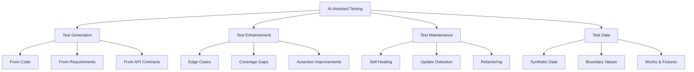

# AI-Assisted Testing

## Purpose

Demonstrate how AI can dramatically accelerate test creation, improve test coverage, and reduce the manual effort required to maintain comprehensive test suites across all testing levels.

## Context

Writing tests is time-consuming. Maintaining tests as code evolves is even more challenging. AI can generate initial test scaffolds, suggest edge cases, create test data, and even write entire test suites based on code analysis or requirements.

## Prerequisites

- Understanding of [Test Levels](../05-test-levels/README.md)
- Familiarity with [AI Fundamentals](ai-fundamentals.md)
- Basic knowledge of testing frameworks
- Access to an LLM API (OpenAI, Anthropic, or local model)

## AI Capabilities in Testing



## Unit Test Generation

### From Function Code

**Scenario:** You have a function that needs unit tests

**AI Prompt Template:**

```
You are an expert software tester specializing in {language}.

Task: Generate comprehensive unit tests for the following function.

Function to test:
{code}

Requirements:
- Use {testing_framework} framework
- Follow AAA (Arrange, Act, Assert) pattern
- Include:
  * Happy path tests
  * Edge cases
  * Error handling
  * Boundary conditions
- Add descriptive test names
- Include comments explaining test rationale

Output format: Complete, runnable test file
```

**Example: JavaScript/Jest**

```javascript
// Input: Function to test
function calculateDiscount(price, discountPercent, customerType) {
  if (price < 0) {
    throw new Error('Price cannot be negative');
  }

  if (discountPercent < 0 || discountPercent > 100) {
    throw new Error('Discount must be between 0 and 100');
  }

  let discount = (price * discountPercent) / 100;

  // Premium customers get extra 5% off
  if (customerType === 'premium') {
    discount += price * 0.05;
  }

  const finalPrice = price - discount;
  return Math.max(0, finalPrice); // Price can't be negative
}

// AI Generated Tests
describe('calculateDiscount', () => {
  describe('Happy Path', () => {
    test('calculates discount correctly for regular customer', () => {
      // Arrange
      const price = 100;
      const discountPercent = 10;
      const customerType = 'regular';

      // Act
      const result = calculateDiscount(price, discountPercent, customerType);

      // Assert
      expect(result).toBe(90);
    });

    test('applies additional 5% discount for premium customers', () => {
      // Arrange
      const price = 100;
      const discountPercent = 10;
      const customerType = 'premium';

      // Act
      const result = calculateDiscount(price, discountPercent, customerType);

      // Assert
      expect(result).toBe(85); // 10% + 5% = 15% total
    });

    test('handles 0% discount', () => {
      const result = calculateDiscount(100, 0, 'regular');
      expect(result).toBe(100);
    });

    test('handles 100% discount', () => {
      const result = calculateDiscount(100, 100, 'regular');
      expect(result).toBe(0);
    });
  });

  describe('Edge Cases', () => {
    test('handles zero price', () => {
      const result = calculateDiscount(0, 10, 'regular');
      expect(result).toBe(0);
    });

    test('handles very small prices', () => {
      const result = calculateDiscount(0.01, 10, 'regular');
      expect(result).toBeCloseTo(0.009, 3);
    });

    test('handles very large prices', () => {
      const result = calculateDiscount(1000000, 10, 'regular');
      expect(result).toBe(900000);
    });

    test('ensures final price never goes negative with large discount', () => {
      const result = calculateDiscount(100, 100, 'premium');
      expect(result).toBe(0);
    });

    test('handles undefined customer type', () => {
      const result = calculateDiscount(100, 10, undefined);
      expect(result).toBe(90);
    });
  });

  describe('Error Handling', () => {
    test('throws error for negative price', () => {
      expect(() => {
        calculateDiscount(-10, 10, 'regular');
      }).toThrow('Price cannot be negative');
    });

    test('throws error for negative discount', () => {
      expect(() => {
        calculateDiscount(100, -10, 'regular');
      }).toThrow('Discount must be between 0 and 100');
    });

    test('throws error for discount over 100', () => {
      expect(() => {
        calculateDiscount(100, 150, 'regular');
      }).toThrow('Discount must be between 0 and 100');
    });
  });

  describe('Boundary Conditions', () => {
    test('handles boundary at 0% discount', () => {
      const result = calculateDiscount(100, 0, 'regular');
      expect(result).toBe(100);
    });

    test('handles boundary at 100% discount', () => {
      const result = calculateDiscount(100, 100, 'regular');
      expect(result).toBe(0);
    });

    test('handles minimum valid price', () => {
      const result = calculateDiscount(0, 0, 'regular');
      expect(result).toBe(0);
    });
  });

  describe('Customer Types', () => {
    test.each([
      ['regular', 90],
      ['premium', 85],
      ['basic', 90],
      ['', 90],
      [null, 90],
    ])('handles customer type %s correctly', (customerType, expected) => {
      const result = calculateDiscount(100, 10, customerType);
      expect(result).toBe(expected);
    });
  });
});
```

### Automated Test Generator Tool

````python
# test_generator.py

from openai import OpenAI
import sys
import os

class AITestGenerator:
    def __init__(self, api_key):
        self.client = OpenAI(api_key=api_key)

    def generate_tests(self, code, language, framework, test_type='unit'):
        """Generate tests for given code"""

        prompt = f"""You are an expert software tester specializing in {language}.

Task: Generate comprehensive {test_type} tests for the following code.

Code to test:
```{language}
{code}
````

Requirements:

- Use {framework} testing framework
- Follow industry best practices for {language}
- Include:
  - Happy path scenarios
  - Edge cases and boundary conditions
  - Error handling tests
  - Null/undefined handling where applicable
- Use descriptive test names that explain what is being tested
- Add comments for complex test logic
- Ensure tests are independent and can run in any order

Output: Complete, runnable test file with all necessary imports
"""

        response = self.client.chat.completions.create(
            model="gpt-4-turbo-preview",
            messages=[
                {"role": "system", "content": "You are an expert test engineer."},
                {"role": "user", "content": prompt}
            ],
            temperature=0.1,  # Low temperature for consistent output
        )

        return response.choices[0].message.content

    def generate_tests_from_file(self, file_path, output_path=None):
        """Generate tests from a source file"""

        # Detect language from extension
        ext_to_lang = {
            '.js': ('javascript', 'jest'),
            '.ts': ('typescript', 'jest'),
            '.py': ('python', 'pytest'),
            '.java': ('java', 'junit'),
            '.go': ('go', 'testing'),
        }

        ext = os.path.splitext(file_path)[1]
        if ext not in ext_to_lang:
            raise ValueError(f"Unsupported file type: {ext}")

        language, framework = ext_to_lang[ext]

        # Read source code
        with open(file_path, 'r') as f:
            code = f.read()

        # Generate tests
        print(f"Generating {framework} tests for {file_path}...")
        test_code = self.generate_tests(code, language, framework)

        # Determine output path
        if not output_path:
            base = os.path.splitext(file_path)[0]
            output_path = f"{base}.test{ext}"

        # Write tests
        with open(output_path, 'w') as f:
            f.write(test_code)

        print(f"✅ Tests generated: {output_path}")
        return output_path

# Usage

if **name** == "**main**":
if len(sys.argv) < 2:
print("Usage: python test_generator.py <source_file>")
sys.exit(1)

    generator = AITestGenerator(api_key=os.getenv('OPENAI_API_KEY'))
    generator.generate_tests_from_file(sys.argv[1])

````

**Usage:**
```bash
# Generate tests from source file
python test_generator.py src/calculator.js

# Output: src/calculator.test.js
````

## Integration Test Generation

### From API Specifications

**Scenario:** Generate integration tests from OpenAPI specification

```python
# api_test_generator.py

import yaml
from openai import OpenAI

class APITestGenerator:
    def __init__(self, api_key):
        self.client = OpenAI(api_key=api_key)

    def generate_from_openapi(self, openapi_spec_path):
        """Generate API tests from OpenAPI spec"""

        # Load OpenAPI spec
        with open(openapi_spec_path, 'r') as f:
            spec = yaml.safe_load(f)

        tests = []

        # Generate tests for each endpoint
        for path, methods in spec['paths'].items():
            for method, details in methods.items():
                test_code = self._generate_endpoint_test(
                    path, method, details
                )
                tests.append(test_code)

        return '\n\n'.join(tests)

    def _generate_endpoint_test(self, path, method, details):
        """Generate test for a single endpoint"""

        prompt = f"""Generate a comprehensive API integration test in JavaScript using supertest.

Endpoint: {method.upper()} {path}
Description: {details.get('summary', 'No description')}

Request Parameters:
{yaml.dump(details.get('parameters', []))}

Request Body:
{yaml.dump(details.get('requestBody', {}))}

Expected Responses:
{yaml.dump(details.get('responses', {}))}

Generate tests for:
1. Successful request (200/201 response)
2. Invalid input (400 response)
3. Unauthorized (401 response) if auth required
4. Not found (404 response) if applicable
5. Server error handling

Use supertest library and include proper assertions.
"""

        response = self.client.chat.completions.create(
            model="gpt-4-turbo-preview",
            messages=[{"role": "user", "content": prompt}],
            temperature=0.1
        )

        return response.choices[0].message.content

# Example generated test
"""
const request = require('supertest');
const app = require('../app');

describe('POST /api/users', () => {
  describe('Success Cases', () => {
    test('creates user with valid data', async () => {
      const newUser = {
        name: 'John Doe',
        email: 'john@example.com',
        password: 'SecurePass123!'
      };

      const response = await request(app)
        .post('/api/users')
        .send(newUser)
        .expect('Content-Type', /json/)
        .expect(201);

      expect(response.body).toHaveProperty('id');
      expect(response.body.name).toBe(newUser.name);
      expect(response.body.email).toBe(newUser.email);
      expect(response.body).not.toHaveProperty('password'); // Password should not be returned
    });
  });

  describe('Validation Errors', () => {
    test('returns 400 for missing required fields', async () => {
      const response = await request(app)
        .post('/api/users')
        .send({ name: 'John' })  // Missing email and password
        .expect(400);

      expect(response.body).toHaveProperty('errors');
      expect(response.body.errors).toContain('email is required');
      expect(response.body.errors).toContain('password is required');
    });

    test('returns 400 for invalid email format', async () => {
      const response = await request(app)
        .post('/api/users')
        .send({
          name: 'John Doe',
          email: 'invalid-email',
          password: 'SecurePass123!'
        })
        .expect(400);

      expect(response.body.errors).toContain('Invalid email format');
    });

    test('returns 400 for weak password', async () => {
      const response = await request(app)
        .post('/api/users')
        .send({
          name: 'John Doe',
          email: 'john@example.com',
          password: '123'
        })
        .expect(400);

      expect(response.body.errors).toContain('Password must be at least 8 characters');
    });
  });

  describe('Duplicate Email', () => {
    test('returns 409 when email already exists', async () => {
      // Create user first
      await request(app)
        .post('/api/users')
        .send({
          name: 'Jane Doe',
          email: 'jane@example.com',
          password: 'SecurePass123!'
        });

      // Try to create another user with same email
      const response = await request(app)
        .post('/api/users')
        .send({
          name: 'John Doe',
          email: 'jane@example.com',  // Duplicate email
          password: 'AnotherPass456!'
        })
        .expect(409);

      expect(response.body.error).toBe('Email already registered');
    });
  });

  describe('Authentication', () => {
    test('returns 401 without API key', async () => {
      await request(app)
        .post('/api/users')
        .send({
          name: 'John Doe',
          email: 'john@example.com',
          password: 'SecurePass123!'
        })
        // No Authorization header
        .expect(401);
    });
  });
});
"""
```

## E2E Test Generation

### From User Stories

```python
# e2e_test_generator.py

from openai import OpenAI

class E2ETestGenerator:
    def __init__(self, api_key):
        self.client = OpenAI(api_key=api_key)

    def generate_from_user_story(self, user_story, tool='playwright'):
        """Generate E2E tests from user story"""

        prompt = f"""Generate comprehensive E2E tests using {tool} for the following user story:

{user_story}

Requirements:
- Use {tool} framework
- Include Page Object Model pattern
- Test both happy path and error scenarios
- Add proper waits and assertions
- Include setup and teardown
- Use descriptive test names
- Add comments for complex interactions

Generate:
1. Page Object classes
2. Test file with multiple scenarios
3. Test data fixtures if needed
"""

        response = self.client.chat.completions.create(
            model="gpt-4-turbo-preview",
            messages=[{"role": "user", "content": prompt}],
            temperature=0.1
        )

        return response.choices[0].message.content

# Example usage
user_story = """
As a user
I want to reset my password
So that I can regain access to my account if I forget my password

Acceptance Criteria:
1. User can request password reset from login page
2. System sends reset email with token
3. User can click link in email to reset password
4. New password must meet security requirements
5. User can login with new password
"""

generator = E2ETestGenerator(api_key=os.getenv('OPENAI_API_KEY'))
test_code = generator.generate_from_user_story(user_story, tool='playwright')

# Generated output:
"""
// pages/LoginPage.js
class LoginPage {
  constructor(page) {
    this.page = page;
    this.emailInput = page.locator('[data-testid="email-input"]');
    this.passwordInput = page.locator('[data-testid="password-input"]');
    this.loginButton = page.locator('[data-testid="login-button"]');
    this.forgotPasswordLink = page.locator('[data-testid="forgot-password-link"]');
  }

  async goto() {
    await this.page.goto('/login');
  }

  async clickForgotPassword() {
    await this.forgotPasswordLink.click();
  }

  async login(email, password) {
    await this.emailInput.fill(email);
    await this.passwordInput.fill(password);
    await this.loginButton.click();
  }
}

// pages/ForgotPasswordPage.js
class ForgotPasswordPage {
  constructor(page) {
    this.page = page;
    this.emailInput = page.locator('[data-testid="reset-email-input"]');
    this.submitButton = page.locator('[data-testid="submit-reset-button"]');
    this.successMessage = page.locator('[data-testid="success-message"]');
  }

  async requestPasswordReset(email) {
    await this.emailInput.fill(email);
    await this.submitButton.click();
  }

  async getSuccessMessage() {
    return await this.successMessage.textContent();
  }
}

// pages/ResetPasswordPage.js
class ResetPasswordPage {
  constructor(page) {
    this.page = page;
    this.newPasswordInput = page.locator('[data-testid="new-password-input"]');
    this.confirmPasswordInput = page.locator('[data-testid="confirm-password-input"]');
    this.submitButton = page.locator('[data-testid="submit-new-password"]');
    this.errorMessage = page.locator('[data-testid="error-message"]');
  }

  async goto(token) {
    await this.page.goto(`/reset-password?token=${token}`);
  }

  async resetPassword(newPassword, confirmPassword) {
    await this.newPasswordInput.fill(newPassword);
    await this.confirmPasswordInput.fill(confirmPassword);
    await this.submitButton.click();
  }

  async getErrorMessage() {
    return await this.errorMessage.textContent();
  }
}

// tests/password-reset.spec.js
const { test, expect } = require('@playwright/test');
const { LoginPage } = require('../pages/LoginPage');
const { ForgotPasswordPage } = require('../pages/ForgotPasswordPage');
const { ResetPasswordPage } = require('../pages/ResetPasswordPage');

test.describe('Password Reset Flow', () => {
  let loginPage, forgotPasswordPage, resetPasswordPage;
  const testEmail = 'user@example.com';
  const testPassword = 'OldPassword123!';
  const newPassword = 'NewSecurePass456!';

  test.beforeEach(async ({ page }) => {
    loginPage = new LoginPage(page);
    forgotPasswordPage = new ForgotPasswordPage(page);
    resetPasswordPage = new ResetPasswordPage(page);

    await loginPage.goto();
  });

  test('complete password reset flow', async ({ page }) => {
    // Step 1: Navigate to forgot password
    await loginPage.clickForgotPassword();
    await expect(page).toHaveURL(/.*forgot-password/);

    // Step 2: Request password reset
    await forgotPasswordPage.requestPasswordReset(testEmail);

    // Step 3: Verify success message
    const successMsg = await forgotPasswordPage.getSuccessMessage();
    expect(successMsg).toContain('Password reset email sent');

    // Step 4: Simulate clicking email link (in real test, get token from test email service)
    const resetToken = await getResetTokenFromEmail(testEmail);
    await resetPasswordPage.goto(resetToken);

    // Step 5: Enter new password
    await resetPasswordPage.resetPassword(newPassword, newPassword);

    // Step 6: Verify redirect to login
    await expect(page).toHaveURL(/.*login/);

    // Step 7: Login with new password
    await loginPage.login(testEmail, newPassword);

    // Step 8: Verify successful login
    await expect(page).toHaveURL(/.*dashboard/);
  });

  test('shows error for non-existent email', async ({ page }) => {
    await loginPage.clickForgotPassword();

    await forgotPasswordPage.requestPasswordReset('nonexistent@example.com');

    // System should not reveal if email exists (security)
    const successMsg = await forgotPasswordPage.getSuccessMessage();
    expect(successMsg).toContain('Password reset email sent');
  });

  test('shows error for weak password', async ({ page }) => {
    const resetToken = await getValidResetToken();
    await resetPasswordPage.goto(resetToken);

    // Try weak password
    await resetPasswordPage.resetPassword('weak', 'weak');

    const errorMsg = await resetPasswordPage.getErrorMessage();
    expect(errorMsg).toContain('Password must be at least 8 characters');
  });

  test('shows error for mismatched passwords', async ({ page }) => {
    const resetToken = await getValidResetToken();
    await resetPasswordPage.goto(resetToken);

    await resetPasswordPage.resetPassword(newPassword, 'DifferentPass789!');

    const errorMsg = await resetPasswordPage.getErrorMessage();
    expect(errorMsg).toContain('Passwords do not match');
  });

  test('shows error for expired token', async ({ page }) => {
    const expiredToken = await getExpiredResetToken();
    await resetPasswordPage.goto(expiredToken);

    await resetPasswordPage.resetPassword(newPassword, newPassword);

    const errorMsg = await resetPasswordPage.getErrorMessage();
    expect(errorMsg).toContain('Reset token has expired');
  });
});

// Helper functions
async function getResetTokenFromEmail(email) {
  // In real implementation, integrate with test email service
  // For example: MailHog, Mailosaur, etc.
  return 'test-reset-token-123';
}

async function getValidResetToken() {
  return 'valid-token-456';
}

async function getExpiredResetToken() {
  return 'expired-token-789';
}
"""
```

## Test Data Generation

### Synthetic Test Data

```python
# test_data_generator.py

from openai import OpenAI
import json

class TestDataGenerator:
    def __init__(self, api_key):
        self.client = OpenAI(api_key=api_key)

    def generate_test_data(self, schema, count=10, scenario='valid'):
        """Generate test data based on schema"""

        prompt = f"""Generate {count} realistic test data samples for the following schema.

Schema:
{json.dumps(schema, indent=2)}

Scenario: {scenario}

Requirements:
- Generate realistic, varied data
- For {scenario} scenario: {"follow all validation rules" if scenario == "valid" else "include various validation failures"}
- Include edge cases
- Use realistic values (real names, emails, dates, etc.)
- Output as JSON array

Output only the JSON array, no explanations.
"""

        response = self.client.chat.completions.create(
            model="gpt-4-turbo-preview",
            messages=[{"role": "user", "content": prompt}],
            temperature=0.7,  # Higher for more variety
            response_format={"type": "json_object"}
        )

        return json.loads(response.choices[0].message.content)

# Example usage
user_schema = {
    "type": "object",
    "properties": {
        "name": {"type": "string", "minLength": 2, "maxLength": 50},
        "email": {"type": "string", "format": "email"},
        "age": {"type": "integer", "minimum": 18, "maximum": 120},
        "phoneNumber": {"type": "string", "pattern": "^\\+?[1-9]\\d{1,14}$"},
        "address": {
            "type": "object",
            "properties": {
                "street": {"type": "string"},
                "city": {"type": "string"},
                "zipCode": {"type": "string", "pattern": "^\\d{5}$"}
            }
        },
        "roles": {
            "type": "array",
            "items": {"type": "string", "enum": ["user", "admin", "moderator"]}
        }
    },
    "required": ["name", "email", "age"]
}

generator = TestDataGenerator(api_key=os.getenv('OPENAI_API_KEY'))

# Generate valid test data
valid_data = generator.generate_test_data(user_schema, count=5, scenario='valid')

# Generate invalid test data for error testing
invalid_data = generator.generate_test_data(user_schema, count=5, scenario='invalid')

"""
# Valid data output:
{
  "testData": [
    {
      "name": "Emma Johnson",
      "email": "emma.johnson@example.com",
      "age": 28,
      "phoneNumber": "+15551234567",
      "address": {
        "street": "123 Main St",
        "city": "Springfield",
        "zipCode": "62701"
      },
      "roles": ["user"]
    },
    {
      "name": "Michael Chen",
      "email": "m.chen@company.org",
      "age": 45,
      "phoneNumber": "+442071234567",
      "address": {
        "street": "456 Oak Avenue",
        "city": "Portland",
        "zipCode": "97201"
      },
      "roles": ["user", "moderator"]
    }
    ...
  ]
}

# Invalid data output:
{
  "testData": [
    {
      "name": "A",  // Too short
      "email": "invalid-email",  // Invalid format
      "age": 15,  // Below minimum
      "phoneNumber": "123",  // Invalid format
      "address": {
        "street": "",
        "city": "",
        "zipCode": "1234"  // Wrong length
      },
      "roles": ["invalid_role"]  // Not in enum
    }
    ...
  ]
}
"""
```

### Boundary Value Test Data

```python
class BoundaryValueGenerator:
    def __init__(self, api_key):
        self.client = OpenAI(api_key=api_key)

    def generate_boundary_tests(self, field_name, constraints):
        """Generate boundary value test cases"""

        prompt = f"""Generate boundary value test cases for field: {field_name}

Constraints:
{json.dumps(constraints, indent=2)}

For each constraint, generate test values for:
1. Just below minimum (if applicable)
2. At minimum
3. Just above minimum
4. Normal value in range
5. Just below maximum
6. At maximum
7. Just above maximum (if applicable)

Output as JSON with test cases and expected results.
"""

        response = self.client.chat.completions.create(
            model="gpt-4-turbo-preview",
            messages=[{"role": "user", "content": prompt}],
            temperature=0.1,
            response_format={"type": "json_object"}
        )

        return json.loads(response.choices[0].message.content)

# Example
generator = BoundaryValueGenerator(api_key=os.getenv('OPENAI_API_KEY'))

age_boundaries = generator.generate_boundary_tests(
    field_name="age",
    constraints={
        "type": "integer",
        "minimum": 18,
        "maximum": 120
    }
)

"""
Output:
{
  "field": "age",
  "testCases": [
    {"value": 17, "expected": "FAIL", "reason": "Below minimum"},
    {"value": 18, "expected": "PASS", "reason": "At minimum boundary"},
    {"value": 19, "expected": "PASS", "reason": "Just above minimum"},
    {"value": 65, "expected": "PASS", "reason": "Normal value"},
    {"value": 119, "expected": "PASS", "reason": "Just below maximum"},
    {"value": 120, "expected": "PASS", "reason": "At maximum boundary"},
    {"value": 121, "expected": "FAIL", "reason": "Above maximum"},
    {"value": 0, "expected": "FAIL", "reason": "Edge case: zero"},
    {"value": -1, "expected": "FAIL", "reason": "Edge case: negative"},
    {"value": 1000, "expected": "FAIL", "reason": "Edge case: very large"}
  ]
}
"""
```

## CI/CD Integration

### GitHub Actions Workflow

```yaml
# .github/workflows/ai-test-generation.yml

name: AI Test Generation

on:
  pull_request:
    types: [opened, synchronize]
  workflow_dispatch:

jobs:
  generate-missing-tests:
    runs-on: ubuntu-latest
    steps:
      - uses: actions/checkout@v3

      - name: Setup Python
        uses: actions/setup-python@v4
        with:
          python-version: '3.11'

      - name: Install dependencies
        run: |
          pip install openai

      - name: Find files without tests
        id: find-files
        run: |
          python scripts/find_untested_files.py > untested.txt

      - name: Generate tests for untested files
        if: steps.find-files.outputs.has_untested == 'true'
        env:
          OPENAI_API_KEY: ${{ secrets.OPENAI_API_KEY }}
        run: |
          python scripts/batch_test_generator.py untested.txt

      - name: Create PR comment with generated tests
        uses: actions/github-script@v6
        with:
          script: |
            const fs = require('fs');
            const generated = JSON.parse(fs.readFileSync('generated_tests.json'));

            const comment = `## 🤖 AI Generated Tests

            Generated ${generated.count} test files:
            ${generated.files.map(f => `- [ ] ${f.path}`).join('\n')}

            Review and commit the tests you want to keep.
            `;

            github.rest.issues.createComment({
              issue_number: context.issue.number,
              owner: context.repo.owner,
              repo: context.repo.name,
              body: comment
            });

      - name: Commit generated tests
        run: |
          git config user.name "AI Test Generator"
          git config user.email "bot@example.com"
          git add **/*.test.*
          git commit -m "feat: Add AI-generated tests" || echo "No tests to commit"
          git push
```

## Best Practices

### 1. Always Review AI-Generated Tests

```python
class TestReviewer:
    """Review AI-generated tests before committing"""

    def review_test(self, test_code):
        checks = {
            'has_imports': self._check_imports(test_code),
            'has_assertions': self._check_assertions(test_code),
            'has_descriptions': self._check_descriptions(test_code),
            'handles_errors': self._check_error_handling(test_code),
            'has_cleanup': self._check_cleanup(test_code),
            'independent': self._check_independence(test_code)
        }

        score = sum(checks.values()) / len(checks) * 100

        return {
            'score': score,
            'checks': checks,
            'recommendation': 'APPROVE' if score >= 80 else 'REVIEW_NEEDED'
        }
```

### 2. Iterative Improvement

```python
def improve_test_with_feedback(test_code, feedback):
    """Improve test based on reviewer feedback"""

    prompt = f"""Improve the following test based on this feedback:

Test Code:
{test_code}

Feedback:
{feedback}

Generate improved version that addresses the feedback.
"""

    # Call LLM to improve
    improved = llm.generate(prompt)
    return improved
```

### 3. Test Quality Metrics

```yaml
ai_test_quality_metrics:
  coverage_improvement:
    before_ai: 65%
    after_ai: 82%
    target: 80%

  test_creation_time:
    manual: 45 minutes
    ai_assisted: 8 minutes
    savings: 82%

  test_maintenance:
    self_healing_rate: 73%
    manual_fixes_needed: 27%

  quality_score:
    average: 87/100
    criteria:
      - proper_assertions: 92%
      - edge_cases: 85%
      - error_handling: 83%
      - independence: 90%
```

## Checklist

### AI Test Generation Readiness

- [ ] LLM API access configured
- [ ] Test generator scripts set up
- [ ] CI/CD integration planned
- [ ] Review process defined
- [ ] Quality metrics established

### Per Test Generation

- [ ] Review all generated tests
- [ ] Verify tests are runnable
- [ ] Check test coverage improvements
- [ ] Validate edge cases are covered
- [ ] Ensure tests are maintainable
- [ ] Document any manual adjustments

## Related Topics

- [Test Levels](../05-test-levels/README.md) - Understanding different test types
- [AI Fundamentals](ai-fundamentals.md) - Core AI concepts
- [AI Test Automation](ai-test-automation.md) - Maintaining tests with AI

---

_Next: [AI Code Quality](ai-code-quality.md) - Using AI for code reviews and bug detection_
