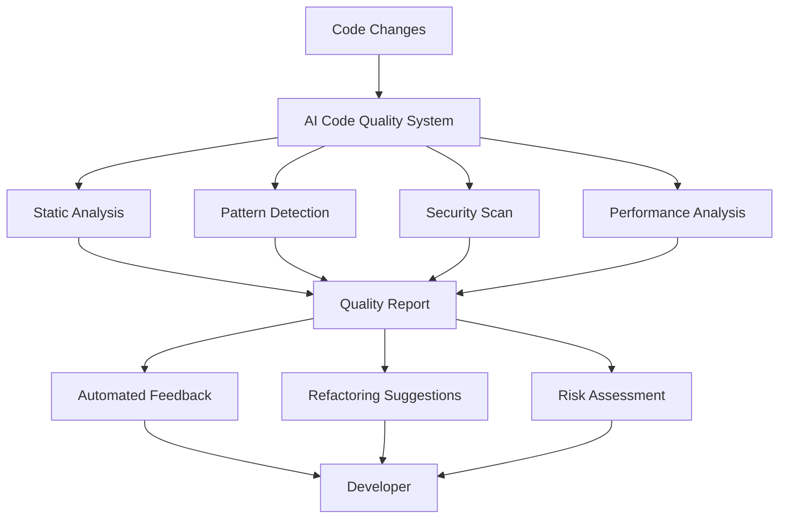

# AI-Powered Code Quality

## Purpose
Provide comprehensive guidance on using AI to improve code quality through automated code review, refactoring suggestions, technical debt detection, and code smell identification.

## Context
Manual code reviews are time-consuming, inconsistent, and limited by human bandwidth. AI-powered code quality tools can provide instant, consistent feedback, detect subtle issues humans might miss, and suggest improvements based on patterns learned from millions of lines of code.

## Prerequisites
- Understanding of [AI Fundamentals](ai-fundamentals.md)
- Familiarity with [Code Review Process](../07-code-review/README.md)
- Basic knowledge of code quality metrics
- Git workflow experience

## AI Code Quality Overview



## AI Code Quality Capabilities

### 1. Automated Code Review

**What AI Can Do:**
- Review code changes in real-time
- Identify bugs before human review
- Check compliance with coding standards
- Suggest performance improvements
- Detect security vulnerabilities

**Example: SQL Injection Detection**

```python
# ❌ AI Detects Security Issue
def get_user(username):
    query = f"SELECT * FROM users WHERE username = '{username}'"
    return db.execute(query)

# AI Feedback:
# 🔴 CRITICAL: SQL Injection vulnerability
# Severity: High
# Category: Security
# Line: 2
#
# Issue: User input directly interpolated into SQL query
# Risk: Attacker can inject malicious SQL code
#
# Suggestion: Use parameterized queries
# Example:
cursor.execute("SELECT * FROM users WHERE username = ?", (username,))
```

**Example: Performance Issue Detection**

```javascript
// ❌ AI Detects Performance Issue
function findDuplicates(items) {
    const duplicates = [];
    for (let i = 0; i < items.length; i++) {
        for (let j = 0; j < items.length; j++) {
            if (i !== j && items[i] === items[j]) {
                if (!duplicates.includes(items[i])) {
                    duplicates.push(items[i]);
                }
            }
        }
    }
    return duplicates;
}

// AI Feedback:
// 🟠 HIGH: Performance issue
// Complexity: O(n³) - nested loops with includes()
//
// Impact: Slow for large arrays (>1000 items)
//
// Suggestion: Use Set for O(n) complexity
// Example:
function findDuplicates(items) {
    const counts = new Map();
    items.forEach(item => counts.set(item, (counts.get(item) || 0) + 1));
    return [...counts].filter(([_, count]) => count > 1).map(([item]) => item);
}
```

### 2. Refactoring Suggestions

**What AI Can Do:**
- Identify code that violates SOLID principles
- Suggest design pattern applications
- Recommend function extraction
- Propose variable/function renaming
- Detect code duplication

**Example: Extract Method Refactoring**

```python
# ❌ AI Suggests Refactoring
def process_order(order_data):
    # Validate order
    if not order_data.get('customer_id'):
        raise ValueError("Customer ID required")
    if not order_data.get('items') or len(order_data['items']) == 0:
        raise ValueError("Order must contain items")
    for item in order_data['items']:
        if not item.get('product_id') or not item.get('quantity'):
            raise ValueError("Invalid item format")

    # Calculate total
    total = 0
    for item in order_data['items']:
        product = get_product(item['product_id'])
        subtotal = product['price'] * item['quantity']
        if item.get('discount'):
            subtotal *= (1 - item['discount'])
        total += subtotal

    # Apply shipping
    if total < 50:
        total += 10

    # Create order
    order = create_order_record(order_data, total)
    return order

# AI Suggestion:
# 🟡 MEDIUM: Function too long (35 lines)
# Complexity: High (cyclomatic complexity: 8)
#
# Suggested Refactoring: Extract methods
#
# Improvements:
# 1. Single Responsibility Principle
# 2. Easier to test
# 3. More maintainable
# 4. Reusable components

# ✅ AI Suggested Refactoring
def process_order(order_data):
    validate_order(order_data)
    total = calculate_order_total(order_data)
    total = apply_shipping_cost(total)
    return create_order_record(order_data, total)

def validate_order(order_data):
    """Validate order data structure and content"""
    if not order_data.get('customer_id'):
        raise ValueError("Customer ID required")
    if not order_data.get('items') or len(order_data['items']) == 0:
        raise ValueError("Order must contain items")
    for item in order_data['items']:
        validate_order_item(item)

def validate_order_item(item):
    """Validate individual order item"""
    if not item.get('product_id') or not item.get('quantity'):
        raise ValueError("Invalid item format")

def calculate_order_total(order_data):
    """Calculate total price including discounts"""
    total = 0
    for item in order_data['items']:
        total += calculate_item_subtotal(item)
    return total

def calculate_item_subtotal(item):
    """Calculate subtotal for single item"""
    product = get_product(item['product_id'])
    subtotal = product['price'] * item['quantity']
    if item.get('discount'):
        subtotal *= (1 - item['discount'])
    return subtotal

def apply_shipping_cost(total):
    """Apply shipping cost if below threshold"""
    if total < 50:
        total += 10
    return total
```

### 3. Technical Debt Detection

**What AI Can Do:**
- Identify outdated dependencies
- Detect deprecated API usage
- Find TODO/FIXME comments
- Measure code complexity trends
- Quantify refactoring effort

**Example: Technical Debt Dashboard**

```yaml
technical_debt_report:
  total_debt_hours: 127
  debt_ratio: 15.2%  # 15.2% of development time to fix
  trend: "increasing"  # +3% from last month

  categories:
    code_smells:
      count: 45
      effort_hours: 38
      top_issues:
        - "Long methods (>50 lines): 12 occurrences"
        - "High cyclomatic complexity (>10): 8 functions"
        - "Duplicate code blocks: 15 instances"

    outdated_dependencies:
      count: 18
      effort_hours: 24
      critical: 3
      high: 7
      medium: 8
      examples:
        - "lodash 4.17.15 → 4.17.21 (security fix)"
        - "react 16.14.0 → 18.2.0 (major version)"

    deprecated_apis:
      count: 23
      effort_hours: 31
      examples:
        - "moment.js → date-fns (deprecated library)"
        - "componentWillMount → useEffect (React)"

    missing_tests:
      files_without_tests: 34
      coverage_gap: 18%
      effort_hours: 34

  prioritized_actions:
    - action: "Update critical security dependencies"
      effort: "3 hours"
      impact: "High"
      risk_reduction: "85%"

    - action: "Refactor payment processing module"
      effort: "16 hours"
      impact: "High"
      complexity_reduction: "60%"

    - action: "Extract common validation logic"
      effort: "8 hours"
      impact: "Medium"
      code_reduction: "450 lines"
```

### 4. Code Smell Detection

**What AI Can Do:**
- Identify design anti-patterns
- Detect god objects/classes
- Find feature envy
- Spot primitive obsession
- Recognize inappropriate intimacy

**Example: God Class Detection**

```python
# ❌ AI Detects God Class
class UserManager:
    """Handles everything user-related"""

    def create_user(self, data): ...
    def update_user(self, user_id, data): ...
    def delete_user(self, user_id): ...
    def authenticate_user(self, username, password): ...
    def reset_password(self, email): ...
    def send_welcome_email(self, user): ...
    def log_user_activity(self, user_id, action): ...
    def calculate_user_score(self, user_id): ...
    def generate_user_report(self, user_id): ...
    def export_users_to_csv(self, filters): ...
    def import_users_from_csv(self, file): ...
    def sync_users_with_crm(self): ...
    def validate_user_permissions(self, user_id, resource): ...
    def update_user_preferences(self, user_id, prefs): ...
    # ... 20+ more methods

# AI Feedback:
# 🟠 HIGH: God Class Anti-Pattern
#
# Issues:
# - Too many responsibilities (authentication, email, reporting, import/export, sync)
# - 35 methods, 1200+ lines
# - Violates Single Responsibility Principle
# - High coupling, low cohesion
#
# Suggested Refactoring:
# Split into focused classes:
#
# 1. UserRepository: CRUD operations
# 2. UserAuthenticationService: Login, password reset
# 3. UserNotificationService: Email sending
# 4. UserActivityLogger: Activity tracking
# 5. UserReportService: Reports and analytics
# 6. UserImportExportService: CSV operations
# 7. UserCRMSync: External sync
# 8. UserPermissionService: Authorization

# ✅ AI Suggested Structure
class UserRepository:
    """Handles user data persistence"""
    def create(self, data): ...
    def read(self, user_id): ...
    def update(self, user_id, data): ...
    def delete(self, user_id): ...

class UserAuthenticationService:
    """Handles user authentication"""
    def authenticate(self, username, password): ...
    def reset_password(self, email): ...
    def validate_token(self, token): ...

class UserNotificationService:
    """Handles user notifications"""
    def send_welcome_email(self, user): ...
    def send_password_reset_email(self, user): ...
    def send_activity_alert(self, user, activity): ...

# ... additional focused services
```

### 5. Automated Documentation

**What AI Can Do:**
- Generate function docstrings
- Create API documentation
- Explain complex algorithms
- Document code changes
- Generate architecture diagrams

**Example: Docstring Generation**

```python
# Original code (no documentation)
def calculate_compound_interest(principal, rate, time, frequency):
    return principal * (1 + rate / frequency) ** (frequency * time)

# AI-Generated Documentation
def calculate_compound_interest(principal, rate, time, frequency):
    """
    Calculate compound interest for an investment.

    Uses the compound interest formula: A = P(1 + r/n)^(nt)
    where A is the final amount, P is the principal, r is the annual
    interest rate (as decimal), n is the compounding frequency per year,
    and t is time in years.

    Args:
        principal (float): Initial investment amount in dollars
        rate (float): Annual interest rate (e.g., 0.05 for 5%)
        time (float): Investment duration in years
        frequency (int): Number of times interest compounds per year
                        (e.g., 12 for monthly, 4 for quarterly)

    Returns:
        float: Final amount including principal and compound interest

    Examples:
        >>> calculate_compound_interest(1000, 0.05, 10, 12)
        1647.01

        >>> calculate_compound_interest(5000, 0.03, 5, 4)
        5806.11

    Raises:
        ValueError: If any parameter is negative
        ZeroDivisionError: If frequency is zero

    Note:
        For continuous compounding, use a very large frequency value
        or implement a separate function using the formula Pe^(rt).
    """
    if principal < 0 or rate < 0 or time < 0 or frequency < 0:
        raise ValueError("All parameters must be non-negative")
    if frequency == 0:
        raise ZeroDivisionError("Frequency cannot be zero")

    return principal * (1 + rate / frequency) ** (frequency * time)
```

## AI Code Quality Tools

### Commercial Tools

#### 1. **GitHub Copilot**
```yaml
features:
  - Real-time code suggestions
  - Context-aware completions
  - Test generation assistance
  - Documentation generation

pricing: $10/user/month or $19/user/month (Business)

best_for:
  - Individual developers
  - Small to medium teams
  - Rapid development

integration:
  - VS Code
  - JetBrains IDEs
  - Neovim
  - Visual Studio

pros:
  - Seamless IDE integration
  - Fast suggestions
  - Large context window
  - Multi-language support

cons:
  - Requires internet connection
  - Can suggest insecure code
  - Limited customization
```

#### 2. **CodeRabbit**
```yaml
features:
  - Automated PR reviews
  - Security vulnerability detection
  - Performance optimization suggestions
  - Code smell identification

pricing: $15/user/month

best_for:
  - Teams with PR workflow
  - Security-conscious organizations
  - DevOps teams

integration:
  - GitHub
  - GitLab
  - Bitbucket

pros:
  - Comprehensive reviews
  - Security-focused
  - Actionable feedback
  - Learning from team patterns

cons:
  - GitHub-centric
  - Can be verbose
  - Learning curve
```

#### 3. **Tabnine**
```yaml
features:
  - AI code completion
  - Team model training
  - On-premise deployment option
  - Privacy-focused

pricing: $12/user/month (Pro) or $39/user/month (Enterprise)

best_for:
  - Privacy-sensitive organizations
  - Large enterprises
  - Custom workflows

integration:
  - VS Code
  - JetBrains
  - Sublime
  - Atom

pros:
  - On-premise option
  - Team learning
  - Privacy controls
  - Fast completions

cons:
  - Less contextual than Copilot
  - Requires team data for best results
```

#### 4. **Snyk Code**
```yaml
features:
  - Security-first code analysis
  - Real-time vulnerability detection
  - Fix suggestions
  - Developer education

pricing: Free tier available, paid plans from $25/month

best_for:
  - Security-critical applications
  - Compliance requirements
  - DevSecOps teams

integration:
  - IDEs (VS Code, IntelliJ)
  - CI/CD pipelines
  - Git platforms

pros:
  - Deep security analysis
  - Fix suggestions with examples
  - Continuous monitoring
  - Compliance reporting

cons:
  - Security-focused (limited general review)
  - Can be noisy
```

### Open Source Tools

#### 1. **SonarQube with AI Plugin**
```yaml
features:
  - Code quality metrics
  - Bug detection
  - Security hotspots
  - Technical debt tracking

cost: Free (Community Edition)

best_for:
  - Budget-conscious teams
  - Custom integrations
  - On-premise deployments

pros:
  - Comprehensive metrics
  - Self-hosted
  - Extensible
  - Multi-language

cons:
  - Setup complexity
  - Limited AI features in free version
```

#### 2. **CodeQL (GitHub)**
```yaml
features:
  - Semantic code analysis
  - Custom query language
  - Security vulnerability detection
  - Pattern matching

cost: Free for open source

best_for:
  - Security research
  - Custom analysis needs
  - Open source projects

pros:
  - Powerful query language
  - Deep analysis
  - Free for OSS
  - Extensive query library

cons:
  - Steep learning curve
  - Query writing required
```

## Implementation Strategies

### Strategy 1: IDE Integration (Quick Win)

**Timeline:** 1-2 days
**Effort:** Low
**Impact:** Medium

**Steps:**
1. Install GitHub Copilot or Tabnine
2. Configure for your language/framework
3. Start using suggestions
4. Provide feedback to improve

**Example VS Code Setup:**
```json
// .vscode/settings.json
{
  "github.copilot.enable": {
    "*": true,
    "yaml": true,
    "plaintext": false,
    "markdown": false
  },
  "github.copilot.advanced": {
    "debug.overrideEngine": "gpt-4",
    "inlineSuggestCount": 3
  }
}
```

### Strategy 2: PR Review Automation (High Impact)

**Timeline:** 1 week
**Effort:** Medium
**Impact:** High

**Steps:**
1. Select tool (CodeRabbit, Snyk, etc.)
2. Configure repository integration
3. Define review rules
4. Train team on feedback
5. Iterate based on results

**Example GitHub Actions Workflow:**
```yaml
# .github/workflows/ai-code-review.yml
name: AI Code Review

on:
  pull_request:
    types: [opened, synchronize]

jobs:
  code-review:
    runs-on: ubuntu-latest
    steps:
      - uses: actions/checkout@v4

      - name: AI Code Review
        uses: coderabbit-ai/coderabbit-action@v1
        with:
          github-token: ${{ secrets.GITHUB_TOKEN }}
          openai-api-key: ${{ secrets.OPENAI_API_KEY }}

      - name: Security Scan
        uses: snyk/actions/node@master
        env:
          SNYK_TOKEN: ${{ secrets.SNYK_TOKEN }}

      - name: Comment Results
        uses: actions/github-script@v7
        with:
          script: |
            // Post aggregated review results
```

### Strategy 3: Custom AI Code Reviewer (Advanced)

**Timeline:** 2-4 weeks
**Effort:** High
**Impact:** Very High

**Steps:**
1. Define code quality rules
2. Build custom prompts
3. Integrate with LLM API
4. Create CI/CD pipeline
5. Deploy and monitor

See [Code Review Automation Example](../../examples/ai-assisted-qa/code-review-automation/README.md) for complete implementation.

## Best Practices

### 1. Start with Non-Critical Code
- Test AI suggestions on new features
- Validate AI feedback thoroughly
- Build trust gradually
- Measure accuracy

### 2. Customize to Your Standards
- Define team-specific rules
- Create custom prompts
- Train on your codebase
- Incorporate team preferences

### 3. Human Review Required
- AI suggests, humans decide
- Critical code needs manual review
- Security issues verified manually
- Complex logic reviewed by humans

### 4. Monitor and Improve
- Track false positive rate
- Measure time saved
- Collect team feedback
- Iterate on configuration

### 5. Educate Your Team
- Train on AI tool capabilities
- Explain limitations
- Share best practices
- Celebrate successes

## Metrics to Track

### Quality Metrics
```yaml
code_quality_metrics:
  defects_prevented:
    metric: "Bugs caught by AI before merge"
    target: "> 20 per month"

  code_smells_reduced:
    metric: "Code smells resolved"
    target: "-30% per quarter"

  technical_debt_hours:
    metric: "Technical debt hours"
    target: "< 100 hours"

  cyclomatic_complexity:
    metric: "Average function complexity"
    target: "< 5"
```

### Efficiency Metrics
```yaml
efficiency_metrics:
  review_time:
    metric: "Average PR review time"
    baseline: "4 hours"
    target: "< 2 hours"

  refactoring_time:
    metric: "Time to refactor with AI suggestions"
    improvement: "60% faster"

  documentation_time:
    metric: "Time to document code"
    improvement: "75% faster"
```

### Adoption Metrics
```yaml
adoption_metrics:
  tool_usage:
    metric: "% of PRs with AI review"
    target: "> 90%"

  suggestion_acceptance:
    metric: "% of AI suggestions accepted"
    target: "> 60%"

  developer_satisfaction:
    metric: "Team satisfaction score"
    target: "> 4/5"
```

## Cost-Benefit Analysis

### Monthly Costs (10-person team)
```yaml
tools:
  github_copilot: $100    # $10/user
  coderabbit: $150        # $15/user
  snyk: $250              # $25/user
  total: $500/month

roi:
  time_saved: 80 hours/month    # $4,000 value
  defects_prevented: 25/month   # $2,500 value (100 hours saved)
  total_value: $6,500/month

  net_benefit: $6,000/month
  roi: 1,200%
  payback_period: 2.3 days
```

## Common Pitfalls

### 1. Over-Reliance on AI
❌ **Wrong:** Accept all AI suggestions without review
✅ **Right:** Use AI as first pass, human verification required

### 2. Ignoring False Positives
❌ **Wrong:** Leave tool with 40% false positive rate
✅ **Right:** Tune rules, train model, reduce noise

### 3. No Team Training
❌ **Wrong:** Deploy tool without explanation
✅ **Right:** Train team, share best practices, iterate

### 4. Security Blind Spots
❌ **Wrong:** Trust AI for all security issues
✅ **Right:** Combine AI with dedicated security tools

### 5. Insufficient Customization
❌ **Wrong:** Use default settings for everything
✅ **Right:** Customize rules for your team's standards

## Related Topics

- [AI-Assisted Testing](ai-assisted-testing.md) - Automated test generation
- [Code Review Process](../07-code-review/README.md) - Manual review practices
- [Static Analysis](../04-testing-strategy/README.md#static-analysis) - Traditional tools
- [AI Tool Ecosystem](ai-tool-ecosystem.md) - Tool comparison

## Next Steps

1. **Quick Start**: Install GitHub Copilot or Tabnine in your IDE
2. **PR Integration**: Set up CodeRabbit or similar for PR reviews
3. **Security**: Add Snyk to your CI/CD pipeline
4. **Custom Solution**: Build custom reviewer using [example code](../../examples/ai-assisted-qa/code-review-automation/README.md)
5. **Measure**: Track metrics and iterate

---

*AI-powered code quality tools catch issues faster, suggest better solutions, and free developers to focus on creative problem-solving.*
