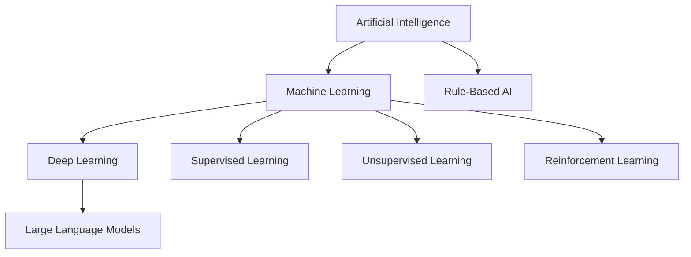
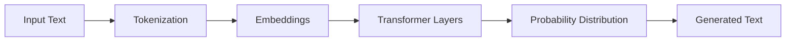
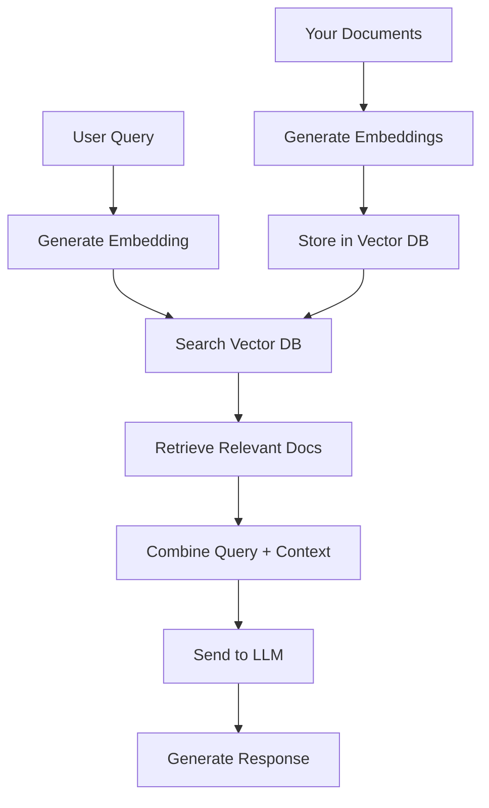

# AI Fundamentals for QA Engineers

## Purpose

Provide QA professionals with a solid foundation in AI and Machine Learning concepts, focusing on practical understanding of technologies like LLMs, RAG, embeddings, and prompt engineering that are directly applicable to quality assurance workflows.

## Context

You don't need a PhD in machine learning to use AI effectively in QA. This guide explains AI concepts in practical terms, focusing on what you need to know to leverage AI tools and build AI-enhanced QA solutions.

## What is Artificial Intelligence?

### The Basics

**Artificial Intelligence (AI)** is the ability of machines to perform tasks that typically require human intelligence:

- Understanding language
- Recognizing patterns
- Making decisions
- Learning from experience
- Solving problems

### Types of AI



#### 1. Rule-Based AI (Traditional)

**How it works**: Explicit rules programmed by humans

**Example in QA:**

```python
# Rule-based test case selector
def should_run_test(test, code_changes):
    # Explicit rules
    if test.is_critical:
        return True
    if test.file in code_changes:
        return True
    if test.last_failed:
        return True
    return False
```

**Limitations**:

- Requires all rules to be predefined
- Doesn't learn from data
- Brittle when situations change

#### 2. Machine Learning (ML)

**How it works**: Learns patterns from data

**Example in QA:**

```python
# ML-based defect predictor
# Learns which code changes cause bugs

from sklearn.ensemble import RandomForestClassifier

# Training data: features → labels
X = [
    [complexity, churn, coverage, author_exp],  # Features
    ...
]
y = [has_defect, ...]  # Labels (0 or 1)

# Model learns patterns
model = RandomForestClassifier()
model.fit(X, y)

# Predict on new code
prediction = model.predict([[new_complexity, new_churn, ...]])
# Returns: 0.85 (85% probability of defect)
```

**Advantages**:

- Learns from historical data
- Adapts to new patterns
- Finds non-obvious correlations

#### 3. Deep Learning

**How it works**: Neural networks with many layers

**Example in QA:**

```python
# Deep learning for log anomaly detection
import tensorflow as tf

model = tf.keras.Sequential([
    tf.keras.layers.Embedding(vocab_size, 128),
    tf.keras.layers.LSTM(64),
    tf.keras.layers.Dense(32, activation='relu'),
    tf.keras.layers.Dense(1, activation='sigmoid')
])

# Model learns complex patterns in log data
# Can detect anomalies humans might miss
```

**When to use**:

- Complex pattern recognition
- Large amounts of data available
- Image/text/sequential data

## Large Language Models (LLMs)

### What are LLMs?

**Large Language Models** are AI systems trained on vast amounts of text to understand and generate human-like language.

**Think of it as**: A very smart autocomplete that understands context, meaning, and can reason about code and text.

### How LLMs Work (Simplified)



**Step-by-step:**

1. **Tokenization**: Break text into pieces (tokens)

   ```
   "Generate tests" → ["Generate", " tests"]
   ```

2. **Embeddings**: Convert tokens to numbers

   ```
   "Generate" → [0.2, -0.5, 0.8, ...]
   ```

3. **Processing**: Neural network predicts next token

   ```
   "Generate tests" → 90% "for" | 5% "to" | 3% "that"
   ```

4. **Generation**: Repeat to build complete response

### Popular LLMs for QA

#### Commercial Models

**OpenAI GPT-4 / GPT-4 Turbo**

```yaml
strengths:
  - Excellent code generation
  - Strong reasoning capabilities
  - Large context window (128K tokens)

use_cases:
  - Test generation
  - Code review
  - Documentation

costs:
  input: $0.01 per 1K tokens
  output: $0.03 per 1K tokens

example_usage: 'Generate unit tests for this Python function...'
```

**Anthropic Claude 3 (Opus, Sonnet, Haiku)**

```yaml
strengths:
  - Very long context (200K tokens)
  - Excellent analysis
  - Strong safety features

use_cases:
  - Complex code analysis
  - Long document processing
  - Requirements validation

costs:
  input: $0.008-0.015 per 1K tokens
  output: $0.024-0.075 per 1K tokens
```

**GitHub Copilot**

```yaml
strengths:
  - IDE integration
  - Real-time suggestions
  - Trained on code

use_cases:
  - Code completion
  - Quick test generation
  - Boilerplate code

costs: $10-19/user/month
```

#### Open Source Models

**Meta Llama 3**

```yaml
strengths:
  - Can run locally
  - No API costs
  - Customizable

use_cases:
  - Sensitive code analysis
  - Air-gapped environments
  - Cost-sensitive projects

requirements:
  gpu: 24GB+ VRAM
  ram: 32GB+ recommended
```

**Mistral / Mixtral**

```yaml
strengths:
  - Efficient
  - Good performance
  - Open source

use_cases:
  - Local deployment
  - Cost optimization
  - Custom fine-tuning
```

### Context Windows

**What is it?**: Maximum amount of text an LLM can process at once

**Why it matters for QA:**

```
Small context (4K tokens):
✗ Can't analyze entire test suite
✗ Loses context in long files

Large context (128K+ tokens):
✓ Can analyze entire codebase
✓ Maintains context across files
✓ Better for complex analysis
```

**Token approximation:**

- 1 token ≈ 0.75 words
- 1,000 tokens ≈ 750 words
- 10,000 tokens ≈ 30 pages

## Embeddings

### What are Embeddings?

**Embeddings** convert text into numerical vectors that capture semantic meaning.

**Think of it as**: GPS coordinates for words - similar meanings are "close together" in vector space.

### How Embeddings Work

```python
# Text to embeddings
text1 = "unit test"
text2 = "automated test"
text3 = "pizza"

# Generate embeddings (simplified)
embedding1 = [0.8, 0.3, 0.1, ...]  # 1536 dimensions
embedding2 = [0.7, 0.4, 0.2, ...]
embedding3 = [-0.2, 0.9, -0.5, ...]

# Similarity scores (0-1, higher = more similar)
similarity(text1, text2) = 0.92  # Very similar!
similarity(text1, text3) = 0.15  # Not similar
```

### Visualization

```
High-dimensional space:

    unit test • ← 0.92 similarity → • automated test

                                     • integration test

    • pizza

(Similar concepts cluster together)
```

### Why Embeddings Matter for QA

**Use Case 1: Similar Test Case Finding**

```python
# Find tests similar to a new requirement
from openai import OpenAI

client = OpenAI()

# Generate embedding for new requirement
new_req = "User should be able to reset password"
new_embedding = client.embeddings.create(
    model="text-embedding-3-small",
    input=new_req
).data[0].embedding

# Compare with existing test cases
existing_tests = [
    "Test password reset functionality",
    "Verify email validation",
    "Test user login flow"
]

# Find most similar test
similarities = [
    cosine_similarity(new_embedding, test_embedding)
    for test_embedding in existing_test_embeddings
]

# Result: "Test password reset functionality" - 0.94 similarity
```

**Use Case 2: Semantic Code Search**

```python
# Search codebase by meaning, not keywords

query = "How do we validate user input?"

# Traditional search: Misses functions named differently
# Embedding search: Finds all validation logic regardless of naming
```

### Popular Embedding Models

**OpenAI text-embedding-3-small**

```yaml
dimensions: 1536
cost: $0.00002 per 1K tokens
use_for: Most QA applications
quality: Excellent
```

**OpenAI text-embedding-3-large**

```yaml
dimensions: 3072
cost: $0.00013 per 1K tokens
use_for: High-precision needs
quality: Best-in-class
```

**Open Source: Sentence-BERT**

```yaml
dimensions: 384-768
cost: Free (run locally)
use_for: Privacy-sensitive projects
quality: Good
```

## RAG (Retrieval-Augmented Generation)

### What is RAG?

**RAG** combines the power of LLMs with your own knowledge base.

**Problem it solves**: LLMs don't know about your specific codebase, standards, or processes.

**How RAG helps**: Gives LLM access to your documentation before generating responses.

### RAG Architecture



### RAG in Action - Example

**Scenario**: Team asks AI about your testing standards

**Without RAG:**

```
User: "What are our code coverage requirements?"
LLM: "Generally, 80% code coverage is considered good..."
❌ Generic answer, not your specific standards
```

**With RAG:**

```
User: "What are our code coverage requirements?"

Step 1: Search your docs for relevant information
├─ Found: "Our Testing Standards.md"
├─ Found: "Definition of Done.md"
└─ Found: "CI/CD Requirements.md"

Step 2: LLM receives your actual standards:
"According to your team's standards:
- Critical paths: 95% coverage required
- Business logic: 85% coverage required
- UI components: 70% coverage acceptable
- All PRs must maintain or improve coverage"

✅ Accurate answer based on YOUR standards
```

### Building a Simple RAG System

```python
# Simplified RAG implementation for QA docs

from openai import OpenAI
import numpy as np
from typing import List

class QAAssistantRAG:
    def __init__(self):
        self.client = OpenAI()
        self.knowledge_base = []  # Stores embeddings + text

    def index_documents(self, documents: List[str]):
        """Convert docs to embeddings and store"""
        for doc in documents:
            embedding = self.client.embeddings.create(
                model="text-embedding-3-small",
                input=doc
            ).data[0].embedding

            self.knowledge_base.append({
                'text': doc,
                'embedding': embedding
            })

    def search(self, query: str, top_k: int = 3):
        """Find most relevant docs"""
        query_embedding = self.client.embeddings.create(
            model="text-embedding-3-small",
            input=query
        ).data[0].embedding

        # Calculate similarities
        similarities = []
        for item in self.knowledge_base:
            similarity = cosine_similarity(
                query_embedding,
                item['embedding']
            )
            similarities.append((similarity, item['text']))

        # Return top matches
        similarities.sort(reverse=True)
        return [text for _, text in similarities[:top_k]]

    def answer_question(self, question: str):
        """RAG: Retrieve context + Generate answer"""
        # Step 1: Retrieve relevant context
        context_docs = self.search(question, top_k=3)
        context = "\n\n".join(context_docs)

        # Step 2: Generate answer with context
        response = self.client.chat.completions.create(
            model="gpt-4-turbo-preview",
            messages=[
                {
                    "role": "system",
                    "content": "You are a QA assistant. Answer based on the provided context."
                },
                {
                    "role": "user",
                    "content": f"Context:\n{context}\n\nQuestion: {question}"
                }
            ]
        )

        return response.choices[0].message.content

# Usage
assistant = QAAssistantRAG()

# Index your QA documentation
assistant.index_documents([
    "Code coverage must be >80% for all PRs",
    "Use Jest for unit tests, Cypress for E2E",
    "All tests must follow AAA pattern: Arrange, Act, Assert"
])

# Ask questions
answer = assistant.answer_question("What testing framework should I use?")
# Response uses YOUR documentation
```

### RAG vs Fine-Tuning

| Aspect         | RAG                           | Fine-Tuning                |
| -------------- | ----------------------------- | -------------------------- |
| **Cost**       | Low ($0.01-0.10 per query)    | High ($100-1000+ one-time) |
| **Updates**    | Instant (add new docs)        | Slow (retrain model)       |
| **Accuracy**   | Excellent for facts           | Better for style/tone      |
| **Setup Time** | Hours to days                 | Weeks                      |
| **Best For**   | QA docs, standards, processes | Specialized tasks          |

**Recommendation for QA**: Start with RAG. It's faster, cheaper, and easier to maintain.

## Prompt Engineering

### What is Prompt Engineering?

**Prompt Engineering** is the art of communicating effectively with LLMs to get the best results.

**Think of it as**: Writing clear requirements for an AI assistant.

### Prompt Structure

```
┌─────────────────────────────────────┐
│ 1. ROLE                            │
│    Define AI's expertise           │
├─────────────────────────────────────┤
│ 2. CONTEXT                         │
│    Provide relevant background     │
├─────────────────────────────────────┤
│ 3. TASK                            │
│    Clearly state what you want     │
├─────────────────────────────────────┤
│ 4. FORMAT                          │
│    Specify output format           │
├─────────────────────────────────────┤
│ 5. CONSTRAINTS                     │
│    Add limitations/requirements    │
└─────────────────────────────────────┘
```

### Prompt Examples for QA

#### Bad Prompt ❌

```
Generate tests
```

**Problems:**

- No context about what to test
- No format specification
- No testing framework mentioned
- Unclear expectations

#### Good Prompt ✅

```
You are an expert QA engineer specializing in JavaScript testing.

Context:
I have a Node.js user authentication service that uses JWT tokens.
The codebase follows Test-Driven Development practices.

Task:
Generate comprehensive unit tests for the following function that validates JWT tokens.

Function to test:
[paste function here]

Output format:
- Use Jest testing framework
- Include setup/teardown if needed
- Test happy path and edge cases
- Add descriptive test names
- Include comments explaining test rationale

Constraints:
- Maximum 10 test cases
- Focus on security and error handling
- Use modern ES6+ syntax
```

**Result**: Specific, relevant, high-quality tests

### Prompt Patterns for QA

#### Pattern 1: Test Generation

```
Role: Expert QA engineer in {language/framework}
Context: {Brief description of system}
Task: Generate {test_type} tests for {component}
Format:
- Framework: {testing_framework}
- Pattern: {AAA/BDD/etc}
- Include: {edge_cases/mocks/etc}
Constraints:
- {Coverage requirements}
- {Coding standards}
```

#### Pattern 2: Code Review

```
Role: Senior software engineer and security expert
Context: This PR adds {feature_description}
Task: Review the following code changes for:
1. Potential bugs
2. Security vulnerabilities
3. Performance issues
4. Code quality concerns
Format:
- Severity: CRITICAL | HIGH | MEDIUM | LOW
- Location: File:Line
- Issue: Clear description
- Recommendation: Specific fix
Constraints:
- Focus on {specific concerns}
- Align with {coding standards}
```

#### Pattern 3: Bug Analysis

```
Role: Debugging expert with deep system knowledge
Context: Production issue - {brief description}
Task: Analyze these logs and suggest root cause
Logs:
{paste logs}
Format:
1. Most likely root cause (with confidence %)
2. Contributing factors
3. Immediate mitigation steps
4. Long-term prevention strategies
Evidence:
- Quote specific log entries
- Explain reasoning
```

### Advanced Prompt Techniques

#### Chain of Thought (CoT)

Force step-by-step reasoning:

```
Analyze this code for potential bugs.
Think through this step-by-step:
1. First, identify the code's purpose
2. Then, list assumptions the code makes
3. Next, identify what could violate those assumptions
4. Finally, suggest specific test cases for each scenario
```

#### Few-Shot Learning

Provide examples:

```
Generate tests following these examples:

Example 1:
Function: validateEmail(email)
Test:
describe('validateEmail', () => {
  it('should accept valid email addresses', () => {
    expect(validateEmail('test@example.com')).toBe(true);
  });

  it('should reject invalid email addresses', () => {
    expect(validateEmail('invalid')).toBe(false);
  });
});

Now generate tests for:
Function: validatePhoneNumber(phone)
```

#### Self-Consistency

Ask for multiple approaches:

```
Provide 3 different approaches to test this async function.
Evaluate pros and cons of each approach.
Recommend the best approach for our use case.
```

## Tokens and Context Windows

### Understanding Tokens

**What is a token?** Roughly a word or part of a word.

**Token examples:**

```
Text: "Generate unit tests"
Tokens: ["Generate", " unit", " tests"]
Count: 3 tokens

Text: "validateEmailAddress"
Tokens: ["valid", "ate", "Email", "Address"]
Count: 4 tokens (camelCase splits)

Text: "🔥 Hot fix!"
Tokens: ["🔥", " Hot", " fix", "!"]
Count: 4 tokens
```

### Token Limits by Model

| Model          | Context Window | ~Pages | ~Code Files |
| -------------- | -------------- | ------ | ----------- |
| GPT-3.5 Turbo  | 16K tokens     | 50     | 5-10 small  |
| GPT-4 Turbo    | 128K tokens    | 400    | 20-40       |
| Claude 3 Opus  | 200K tokens    | 625    | 40-80       |
| Claude 3 Haiku | 200K tokens    | 625    | 40-80       |

### Managing Token Usage

**Problem**: Large test suites exceed token limits

**Solutions:**

**1. Chunking**

```python
# Split large file into chunks
def chunk_code(code, max_tokens=4000):
    # Split by functions/classes
    chunks = []
    current_chunk = []
    current_tokens = 0

    for function in parse_functions(code):
        func_tokens = count_tokens(function)

        if current_tokens + func_tokens > max_tokens:
            chunks.append('\n'.join(current_chunk))
            current_chunk = [function]
            current_tokens = func_tokens
        else:
            current_chunk.append(function)
            current_tokens += func_tokens

    return chunks
```

**2. Summarization**

```python
# Summarize less important parts
def prepare_context(full_code):
    critical_parts = extract_critical_code(full_code)
    other_parts = summarize_code(full_code - critical_parts)

    return f"""
    Critical code (full):
    {critical_parts}

    Supporting code (summary):
    {other_parts}
    """
```

**3. Selective Context**

```python
# Only include relevant files
def get_relevant_context(query, codebase):
    # Use embeddings to find relevant files
    relevant_files = search_codebase(query, top_k=5)

    # Include only those files
    return '\n\n'.join(relevant_files)
```

## AI Model Types for QA

### Classification Models

**What they do**: Categorize items into predefined classes

**QA Use Cases:**

- Bug severity classification (Critical/High/Medium/Low)
- Test type classification (Unit/Integration/E2E)
- Log level detection (Error/Warning/Info)

**Example:**

```python
from sklearn.ensemble import RandomForestClassifier

# Train classifier for bug severity
X = extract_features(bugs)  # Features: description length, affected component, etc.
y = [bug.severity for bug in bugs]  # Labels: Critical, High, Medium, Low

model = RandomForestClassifier()
model.fit(X, y)

# Classify new bug
new_bug_severity = model.predict(extract_features(new_bug))
```

### Regression Models

**What they do**: Predict continuous numerical values

**QA Use Cases:**

- Estimate bug fix time
- Predict test execution time
- Forecast defect density

**Example:**

```python
from sklearn.linear_model import LinearRegression

# Predict bug fix time
X = [[complexity, experience, priority], ...]
y = [actual_fix_hours, ...]

model = LinearRegression()
model.fit(X, y)

# Predict time for new bug
estimated_hours = model.predict([[bug_complexity, dev_experience, priority]])
```

### Anomaly Detection Models

**What they do**: Identify unusual patterns

**QA Use Cases:**

- Detect performance anomalies
- Find unusual test failures
- Identify security threats

**Example:**

```python
from sklearn.ensemble import IsolationForest

# Detect response time anomalies
response_times = get_response_times()
features = extract_time_features(response_times)

model = IsolationForest(contamination=0.1)
model.fit(features)

# Identify anomalies
predictions = model.predict(features)
anomalies = [rt for rt, pred in zip(response_times, predictions) if pred == -1]
```

### Generative Models

**What they do**: Create new content (text, code, etc.)

**QA Use Cases:**

- Generate test cases
- Create test data
- Write documentation

**Example (using LLM):**

```python
from openai import OpenAI

client = OpenAI()

response = client.chat.completions.create(
    model="gpt-4",
    messages=[{
        "role": "user",
        "content": "Generate 10 test cases for email validation"
    }]
)

test_cases = response.choices[0].message.content
```

## Model Training Basics

### When to Train Your Own Model

**Use Pre-trained (LLMs, embeddings)**:

- ✅ Need general language understanding
- ✅ Want immediate results
- ✅ Have limited ML expertise
- ✅ Don't have large datasets

**Train Custom Model**:

- ✅ Have specific domain requirements
- ✅ Need privacy (no external APIs)
- ✅ Have historical data (1000+ examples)
- ✅ Predictable/repetitive task

### Simple ML Pipeline for QA

```python
# Example: Train defect predictor

# Step 1: Collect data
data = collect_historical_data()
# Features: code_complexity, test_coverage, author_experience, etc.
# Labels: has_defect (0 or 1)

# Step 2: Prepare data
from sklearn.model_selection import train_test_split

X = extract_features(data)
y = extract_labels(data)

X_train, X_test, y_train, y_test = train_test_split(
    X, y, test_size=0.2, random_state=42
)

# Step 3: Train model
from sklearn.ensemble import GradientBoostingClassifier

model = GradientBoostingClassifier(
    n_estimators=100,
    learning_rate=0.1,
    max_depth=5
)

model.fit(X_train, y_train)

# Step 4: Evaluate
from sklearn.metrics import classification_report, confusion_matrix

predictions = model.predict(X_test)
print(classification_report(y_test, predictions))

# Step 5: Use in production
def predict_defect_risk(code_change):
    features = extract_features(code_change)
    probability = model.predict_proba([features])[0][1]

    return {
        'risk_score': probability,
        'risk_level': 'HIGH' if probability > 0.7 else 'MEDIUM' if probability > 0.4 else 'LOW',
        'recommendation': get_recommendation(probability)
    }
```

## AI Safety and Limitations

### AI Can Make Mistakes

**Hallucination**: AI generating false information confidently

**Examples:**

```
User: "What testing framework does our project use?"
AI: "Your project uses TestNG with Selenium Grid."

Reality: Project uses Jest, AI made it up ❌
```

**Mitigation:**

- ✅ Always verify AI outputs
- ✅ Use RAG to ground responses in facts
- ✅ Ask AI to cite sources
- ✅ Cross-check critical information

### AI Doesn't Replace Judgment

**AI is good at:**

- ✅ Pattern recognition
- ✅ Repetitive tasks
- ✅ Generating options
- ✅ Finding anomalies

**Humans are better at:**

- ✅ Context understanding
- ✅ Ethical decisions
- ✅ Creative problem-solving
- ✅ Handling edge cases

### Validation Checklist

When using AI-generated code/tests:

- [ ] Does it compile/run?
- [ ] Does it actually test what it claims?
- [ ] Are edge cases covered?
- [ ] Does it follow our coding standards?
- [ ] Are there security implications?
- [ ] Is it maintainable?
- [ ] Would it catch real bugs?

## Cost Management

### Cost Breakdown

**LLM API Costs:**

```
Test generation session:
- Input: 2,000 tokens (code + prompt)
- Output: 1,500 tokens (generated tests)
- Cost: $0.02 + $0.045 = $0.065 per test suite

Monthly team usage (10 people, 50 generations each):
- 500 generations × $0.065 = $32.50/month
```

**Embedding costs:**

```
Index 1,000 documentation pages:
- Average 500 tokens per page
- 500,000 tokens total
- Cost: $0.00002 × 500 = $0.01 (one-time)

Query cost:
- ~$0.00001 per query (negligible)
```

### Optimization Strategies

**1. Use Cheaper Models for Simple Tasks**

```python
def choose_model(task_complexity):
    if task_complexity == 'simple':
        return 'gpt-3.5-turbo'  # 10x cheaper
    elif task_complexity == 'moderate':
        return 'gpt-4-turbo'
    else:
        return 'gpt-4'
```

**2. Cache Common Responses**

```python
import hashlib
import redis

cache = redis.Redis()

def get_ai_response(prompt):
    # Check cache first
    cache_key = hashlib.md5(prompt.encode()).hexdigest()
    cached = cache.get(cache_key)

    if cached:
        return cached.decode()

    # Call API only if not cached
    response = call_llm_api(prompt)
    cache.setex(cache_key, 86400, response)  # Cache for 24h

    return response
```

**3. Batch Requests**

```python
# Instead of 10 separate requests
for file in files:
    tests = generate_tests(file)  # 10 API calls

# Do one batch request
all_code = '\n\n'.join(files)
all_tests = generate_tests_batch(all_code)  # 1 API call
```

## Practical Next Steps

### Week 1: Foundation

- [ ] Create OpenAI/Anthropic account
- [ ] Try generating tests with ChatGPT
- [ ] Experiment with different prompts
- [ ] Calculate token usage for your use cases

### Week 2: Integration

- [ ] Install GitHub Copilot or similar
- [ ] Use AI for code completion
- [ ] Generate tests for existing code
- [ ] Measure time savings

### Week 3: RAG Basics

- [ ] Choose vector database (start with Chroma)
- [ ] Index team documentation
- [ ] Build simple Q&A bot
- [ ] Share with team

### Week 4: Production

- [ ] Integrate AI into CI/CD
- [ ] Set up code review automation
- [ ] Monitor costs and quality
- [ ] Gather team feedback

## Common Questions

**Q: Will AI replace QA engineers?**
A: No. AI augments QA engineers, handling repetitive tasks so humans can focus on strategy, complex scenarios, and judgment calls.

**Q: How accurate is AI-generated code?**
A: Varies by task. Simple test generation: 80-90% usable. Complex logic: requires significant review. Always validate.

**Q: Should I use open-source or commercial models?**
A: Start with commercial (easier, better). Switch to open-source if you need privacy or have budget constraints.

**Q: How do I protect sensitive code?**
A: Use local models, or use commercial APIs with data processing agreements. Never send trade secrets to public APIs without review.

**Q: What if AI generates bad tests?**
A: Always review. AI is a junior developer that needs supervision. Use it to accelerate, not replace, your expertise.

## Glossary

- **LLM**: Large Language Model - AI trained on text to understand and generate language
- **RAG**: Retrieval-Augmented Generation - Combining LLM with knowledge base
- **Embedding**: Numerical representation of text capturing meaning
- **Token**: Unit of text processed by LLMs (roughly 0.75 words)
- **Context Window**: Maximum text an LLM can process at once
- **Prompt**: Instructions/input given to an LLM
- **Fine-tuning**: Retraining an LLM on specific data
- **Vector Database**: Stores embeddings for similarity search
- **Hallucination**: AI generating false information
- **Zero-shot**: AI performing task without examples
- **Few-shot**: AI learning from a few examples in prompt

## Related Topics

- [AI-Assisted Testing](ai-assisted-testing.md) - Apply AI to test generation
- [Building AI QA Assistant](building-ai-qa-assistant.md) - Implement RAG system
- [AI Tool Ecosystem](ai-tool-ecosystem.md) - Available tools and platforms

---

_Next: [AI-Assisted Testing](ai-assisted-testing.md) - Learn how to generate and maintain tests with AI_
