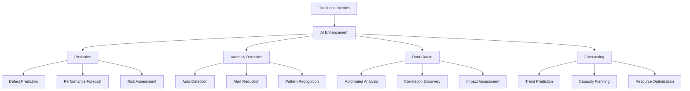

# AI-Enhanced Metrics & Analytics

## Purpose
Demonstrate how Artificial Intelligence and Machine Learning can transform quality metrics from reactive measurements into predictive insights, enabling teams to prevent issues before they occur and make data-driven decisions with confidence.

## Context
Traditional metrics tell you what happened. AI-enhanced metrics predict what will happen, detect anomalies automatically, and provide actionable insights. This transformation changes QA from firefighting to fire prevention.

## Prerequisites
- Understanding of [Metrics & Monitoring](../09-metrics-monitoring/README.md)
- Familiarity with [AI Fundamentals](ai-fundamentals.md)
- Basic Python or similar programming knowledge
- Access to historical metrics data

## AI Capabilities in Metrics



## Predictive Analytics for Quality

### 1. Defect Prediction

**Problem**: Bugs are found reactively during testing or in production

**AI Solution**: Predict which code changes are likely to contain defects before they're merged

#### Implementation

```python
# Defect prediction model

import pandas as pd
from sklearn.ensemble import GradientBoostingClassifier
from sklearn.model_selection import train_test_split
from sklearn.metrics import classification_report, roc_auc_score

class DefectPredictor:
    def __init__(self):
        self.model = GradientBoostingClassifier(
            n_estimators=100,
            learning_rate=0.1,
            max_depth=5,
            random_state=42
        )
        self.feature_names = []

    def extract_features(self, commit_data):
        """Extract features from code change"""
        return {
            # Code complexity metrics
            'cyclomatic_complexity': commit_data['complexity'],
            'lines_of_code': commit_data['loc'],
            'num_functions': commit_data['functions'],

            # Change metrics
            'files_changed': len(commit_data['files']),
            'lines_added': commit_data['additions'],
            'lines_deleted': commit_data['deletions'],
            'code_churn': commit_data['additions'] + commit_data['deletions'],

            # Historical metrics
            'previous_defects': commit_data['historical_defects'],
            'file_change_frequency': commit_data['change_frequency'],
            'time_since_last_change': commit_data['days_since_change'],

            # Developer metrics
            'author_experience': commit_data['author_commits'],
            'author_defect_rate': commit_data['author_defects'] / max(commit_data['author_commits'], 1),

            # Testing metrics
            'test_coverage': commit_data['coverage'],
            'test_count': commit_data['tests'],
            'has_tests': 1 if commit_data['tests'] > 0 else 0,

            # Review metrics
            'review_comments': commit_data['review_comments'],
            'reviewers_count': commit_data['reviewers'],
        }

    def train(self, historical_data):
        """Train model on historical commits"""
        # Prepare training data
        X = pd.DataFrame([
            self.extract_features(commit)
            for commit in historical_data
        ])

        y = [commit['had_defect'] for commit in historical_data]

        self.feature_names = X.columns.tolist()

        # Split data
        X_train, X_test, y_train, y_test = train_test_split(
            X, y, test_size=0.2, random_state=42
        )

        # Train model
        self.model.fit(X_train, y_train)

        # Evaluate
        y_pred = self.model.predict(X_test)
        y_pred_proba = self.model.predict_proba(X_test)[:, 1]

        print("Model Performance:")
        print(classification_report(y_test, y_pred))
        print(f"ROC AUC Score: {roc_auc_score(y_test, y_pred_proba):.3f}")

        # Feature importance
        importance = pd.DataFrame({
            'feature': self.feature_names,
            'importance': self.model.feature_importances_
        }).sort_values('importance', ascending=False)

        print("\nTop 5 Most Important Features:")
        print(importance.head())

        return self.model

    def predict(self, commit_data):
        """Predict defect probability for new commit"""
        features = pd.DataFrame([self.extract_features(commit_data)])

        # Get prediction
        defect_probability = self.model.predict_proba(features)[0][1]
        has_defect = self.model.predict(features)[0]

        # Risk assessment
        if defect_probability >= 0.7:
            risk_level = "HIGH"
            recommendation = "Requires thorough code review and comprehensive testing"
        elif defect_probability >= 0.4:
            risk_level = "MEDIUM"
            recommendation = "Recommend additional reviewer and integration tests"
        else:
            risk_level = "LOW"
            recommendation = "Standard review process sufficient"

        return {
            'defect_probability': round(defect_probability, 3),
            'predicted_defect': bool(has_defect),
            'risk_level': risk_level,
            'confidence': round(max(defect_probability, 1 - defect_probability), 3),
            'recommendation': recommendation,
            'contributing_factors': self._get_risk_factors(features)
        }

    def _get_risk_factors(self, features):
        """Identify main risk factors"""
        risk_factors = []

        # Get feature contributions
        feature_values = features.iloc[0]

        # High complexity
        if feature_values['cyclomatic_complexity'] > 15:
            risk_factors.append({
                'factor': 'High code complexity',
                'value': feature_values['cyclomatic_complexity'],
                'impact': 'HIGH'
            })

        # Large change
        if feature_values['code_churn'] > 500:
            risk_factors.append({
                'factor': 'Large code change',
                'value': feature_values['code_churn'],
                'impact': 'MEDIUM'
            })

        # Low test coverage
        if feature_values['test_coverage'] < 70:
            risk_factors.append({
                'factor': 'Insufficient test coverage',
                'value': f"{feature_values['test_coverage']}%",
                'impact': 'HIGH'
            })

        # Inexperienced author
        if feature_values['author_experience'] < 10:
            risk_factors.append({
                'factor': 'Limited author experience',
                'value': feature_values['author_experience'],
                'impact': 'MEDIUM'
            })

        return risk_factors

# Usage Example
predictor = DefectPredictor()

# Train on historical data
historical_commits = load_historical_data()
predictor.train(historical_commits)

# Predict on new commit
new_commit = {
    'complexity': 18,
    'loc': 350,
    'functions': 8,
    'files': ['src/auth.py', 'src/validator.py'],
    'additions': 420,
    'deletions': 85,
    'historical_defects': 2,
    'change_frequency': 15,
    'days_since_change': 3,
    'author_commits': 45,
    'author_defects': 3,
    'coverage': 75,
    'tests': 12,
    'review_comments': 8,
    'reviewers': 2
}

prediction = predictor.predict(new_commit)
print(f"""
Defect Prediction Results:
─────────────────────────────
Probability: {prediction['defect_probability']} ({prediction['confidence']} confidence)
Risk Level: {prediction['risk_level']}
Recommendation: {prediction['recommendation']}

Contributing Risk Factors:
""")
for factor in prediction['contributing_factors']:
    print(f"- {factor['factor']}: {factor['value']} ({factor['impact']} impact)")
```

#### Integration with CI/CD

```yaml
# .github/workflows/defect-prediction.yml

name: AI Defect Prediction

on: [pull_request]

jobs:
  predict-defects:
    runs-on: ubuntu-latest
    steps:
      - uses: actions/checkout@v3
        with:
          fetch-depth: 0  # Full history for analysis

      - name: Analyze Code Changes
        id: analysis
        run: |
          python scripts/analyze_commit.py \
            --commit ${{ github.event.pull_request.head.sha }}

      - name: Predict Defect Risk
        id: predict
        run: |
          python scripts/predict_defects.py \
            --features analysis_results.json

      - name: Comment on PR
        uses: actions/github-script@v6
        with:
          script: |
            const prediction = JSON.parse(process.env.PREDICTION);

            const comment = `## 🤖 AI Defect Prediction

            **Risk Level:** ${prediction.risk_level}
            **Defect Probability:** ${(prediction.defect_probability * 100).toFixed(1)}%
            **Confidence:** ${(prediction.confidence * 100).toFixed(1)}%

            ### 📊 Risk Factors
            ${prediction.contributing_factors.map(f =>
              `- ${f.factor}: ${f.value} (${f.impact} impact)`
            ).join('\n')}

            ### 💡 Recommendation
            ${prediction.recommendation}
            `;

            github.rest.issues.createComment({
              issue_number: context.issue.number,
              owner: context.repo.owner,
              repo: context.repo.name,
              body: comment
            });
```

### 2. Deployment Risk Prediction

**Problem**: Some deployments cause incidents, but it's hard to predict which ones

**AI Solution**: Analyze deployment characteristics to predict success probability

```python
# Deployment risk predictor

import numpy as np
from sklearn.ensemble import RandomForestClassifier
import joblib

class DeploymentRiskPredictor:
    def __init__(self):
        self.model = RandomForestClassifier(
            n_estimators=150,
            max_depth=10,
            random_state=42
        )

    def extract_deployment_features(self, deployment):
        """Extract features from deployment context"""
        return {
            # Change characteristics
            'commits_count': len(deployment['commits']),
            'files_changed': deployment['files_changed'],
            'total_churn': deployment['lines_added'] + deployment['lines_deleted'],
            'has_db_migrations': 1 if deployment['db_migrations'] else 0,
            'has_config_changes': 1 if deployment['config_changes'] else 0,

            # Testing metrics
            'test_pass_rate': deployment['tests_passed'] / deployment['tests_total'],
            'test_coverage_delta': deployment['coverage_after'] - deployment['coverage_before'],
            'e2e_tests_passed': deployment['e2e_passed'],

            # Historical context
            'days_since_last_deploy': deployment['days_since_last'],
            'recent_incident_count': deployment['incidents_last_7days'],
            'avg_deploy_success_rate': deployment['success_rate_last_30days'],

            # Environment & timing
            'is_off_hours': 1 if deployment['hour'] < 8 or deployment['hour'] > 18 else 0,
            'is_friday': 1 if deployment['weekday'] == 4 else 0,
            'environment_stability': deployment['env_uptime_percentage'],

            # Team factors
            'reviewer_count': deployment['reviewers'],
            'approvals_count': deployment['approvals'],
            'deployment_author_experience': deployment['author_deployments'],

            # AI predictions from other models
            'predicted_defect_count': deployment['defect_prediction'],
            'predicted_performance_impact': deployment['performance_prediction'],
        }

    def train(self, historical_deployments):
        """Train on historical deployment outcomes"""
        X = pd.DataFrame([
            self.extract_deployment_features(dep)
            for dep in historical_deployments
        ])

        # Label: 1 if deployment caused incident, 0 if successful
        y = [1 if dep['caused_incident'] else 0 for dep in historical_deployments]

        self.model.fit(X, y)

        # Save model
        joblib.dump(self.model, 'models/deployment_risk.pkl')

        return self.model

    def predict_risk(self, deployment_context):
        """Predict deployment risk"""
        features = pd.DataFrame([self.extract_deployment_features(deployment_context)])

        # Get prediction
        incident_probability = self.model.predict_proba(features)[0][1]

        # Risk classification
        if incident_probability >= 0.6:
            risk_level = "CRITICAL"
            action = "BLOCK"
            recommendation = "Deployment blocked. Requires incident commander approval."
        elif incident_probability >= 0.4:
            risk_level = "HIGH"
            action = "WARN"
            recommendation = "High risk deployment. Consider deploying during business hours with team on standby."
        elif incident_probability >= 0.2:
            risk_level = "MEDIUM"
            action = "PROCEED_WITH_CAUTION"
            recommendation = "Moderate risk. Ensure monitoring is active and rollback plan is ready."
        else:
            risk_level = "LOW"
            action = "PROCEED"
            recommendation = "Low risk deployment. Standard deployment procedures apply."

        # Calculate safety score
        safety_score = round((1 - incident_probability) * 100, 1)

        return {
            'risk_level': risk_level,
            'incident_probability': round(incident_probability, 3),
            'safety_score': safety_score,
            'action': action,
            'recommendation': recommendation,
            'analysis': self._generate_risk_analysis(features, incident_probability)
        }

    def _generate_risk_analysis(self, features, probability):
        """Generate detailed risk analysis"""
        analysis = {
            'risk_factors': [],
            'protective_factors': [],
            'mitigation_steps': []
        }

        feature_values = features.iloc[0]

        # Identify risk factors
        if feature_values['total_churn'] > 1000:
            analysis['risk_factors'].append("Large code change (>1000 lines)")
            analysis['mitigation_steps'].append("Consider breaking into smaller deployments")

        if feature_values['has_db_migrations']:
            analysis['risk_factors'].append("Database migrations included")
            analysis['mitigation_steps'].append("Verify migration rollback procedures")

        if feature_values['is_friday'] and feature_values['is_off_hours']:
            analysis['risk_factors'].append("Friday evening deployment")
            analysis['mitigation_steps'].append("Reschedule to earlier in week if possible")

        if feature_values['test_pass_rate'] < 0.95:
            analysis['risk_factors'].append(f"Test pass rate only {feature_values['test_pass_rate']*100}%")
            analysis['mitigation_steps'].append("Investigate and fix failing tests")

        # Identify protective factors
        if feature_values['reviewer_count'] >= 3:
            analysis['protective_factors'].append("Multiple reviewers")

        if feature_values['test_coverage_delta'] >= 5:
            analysis['protective_factors'].append("Test coverage improved")

        if feature_values['deployment_author_experience'] > 50:
            analysis['protective_factors'].append("Experienced deployment author")

        return analysis

# Integration example
predictor = DeploymentRiskPredictor()

# Load trained model
predictor.model = joblib.load('models/deployment_risk.pkl')

# Predict before deployment
deployment = gather_deployment_context()
risk_assessment = predictor.predict_risk(deployment)

if risk_assessment['action'] == 'BLOCK':
    print("🛑 Deployment blocked due to high risk")
    sys.exit(1)
elif risk_assessment['action'] == 'WARN':
    print("⚠️  High risk deployment - proceed with caution")
    require_approval()

print(f"✅ Deployment approved (Safety Score: {risk_assessment['safety_score']})")
```

### 3. DORA Metrics Forecasting

**Problem**: Hard to predict if team will meet DORA metric targets

**AI Solution**: Forecast future DORA metrics based on trends

```python
# DORA metrics forecasting

from prophet import Prophet
import pandas as pd
import matplotlib.pyplot as plt

class DORAForecaster:
    def __init__(self):
        self.models = {}

    def prepare_time_series(self, metrics_data, metric_name):
        """Prepare data for Prophet"""
        df = pd.DataFrame({
            'ds': [m['date'] for m in metrics_data],
            'y': [m[metric_name] for m in metrics_data]
        })
        return df

    def train_forecaster(self, historical_metrics):
        """Train forecasting models for each DORA metric"""
        metrics = [
            'deployment_frequency',
            'lead_time_hours',
            'mttr_hours',
            'change_failure_rate'
        ]

        for metric in metrics:
            # Prepare data
            df = self.prepare_time_series(historical_metrics, metric)

            # Create and fit model
            model = Prophet(
                yearly_seasonality=True,
                weekly_seasonality=True,
                daily_seasonality=False,
                changepoint_prior_scale=0.05
            )

            # Add custom seasonality for deployment patterns
            if metric == 'deployment_frequency':
                model.add_seasonality(
                    name='monthly',
                    period=30.5,
                    fourier_order=5
                )

            model.fit(df)
            self.models[metric] = model

        return self.models

    def forecast(self, days_ahead=30):
        """Generate forecasts for all DORA metrics"""
        forecasts = {}

        for metric_name, model in self.models.items():
            # Create future dataframe
            future = model.make_future_dataframe(periods=days_ahead)

            # Generate forecast
            forecast = model.predict(future)

            # Extract relevant columns
            forecasts[metric_name] = {
                'dates': forecast['ds'].tolist(),
                'predicted': forecast['yhat'].tolist(),
                'lower_bound': forecast['yhat_lower'].tolist(),
                'upper_bound': forecast['yhat_upper'].tolist(),
                'trend': forecast['trend'].tolist()
            }

        return forecasts

    def assess_target_achievement(self, forecasts, targets):
        """Assess if targets will be met"""
        assessment = {}

        for metric, target in targets.items():
            forecast_data = forecasts[metric]
            final_predicted = forecast_data['predicted'][-1]

            # Determine if target will be met
            if metric in ['lead_time_hours', 'mttr_hours', 'change_failure_rate']:
                # Lower is better
                will_meet = final_predicted <= target
                gap = target - final_predicted
            else:
                # Higher is better (deployment_frequency)
                will_meet = final_predicted >= target
                gap = final_predicted - target

            confidence = self._calculate_confidence(
                forecast_data['lower_bound'][-1],
                final_predicted,
                forecast_data['upper_bound'][-1],
                target
            )

            assessment[metric] = {
                'current_prediction': final_predicted,
                'target': target,
                'will_meet_target': will_meet,
                'gap': abs(gap),
                'confidence': confidence,
                'recommendation': self._generate_recommendation(metric, will_meet, gap)
            }

        return assessment

    def _calculate_confidence(self, lower, predicted, upper, target):
        """Calculate confidence in meeting target"""
        if lower <= target <= upper:
            # Target within uncertainty range
            if target < predicted:
                return 0.6  # Moderate confidence
            else:
                return 0.4  # Low confidence
        elif (predicted > target and lower > target) or (predicted < target and upper < target):
            return 0.9  # High confidence
        else:
            return 0.7  # Moderate-high confidence

    def _generate_recommendation(self, metric, will_meet, gap):
        """Generate actionable recommendations"""
        if will_meet:
            return f"On track to meet target. Maintain current practices."

        recommendations = {
            'deployment_frequency': [
                "Increase deployment automation",
                "Reduce batch size of changes",
                "Implement feature flags",
                "Improve CI/CD pipeline speed"
            ],
            'lead_time_hours': [
                "Optimize code review process",
                "Reduce PR size",
                "Automate more testing",
                "Implement trunk-based development"
            ],
            'mttr_hours': [
                "Improve monitoring and alerting",
                "Implement automated rollback",
                "Conduct incident response drills",
                "Enhance observability"
            ],
            'change_failure_rate': [
                "Increase test coverage",
                "Implement pre-production testing",
                "Use feature flags for safer rollouts",
                "Improve code review quality"
            ]
        }

        return f"Gap: {abs(gap):.2f}. Recommendations: {', '.join(recommendations[metric][:2])}"

# Usage
forecaster = DORAForecaster()

# Train on historical data (last 90 days)
historical_data = load_dora_metrics(days=90)
forecaster.train_forecaster(historical_data)

# Forecast next 30 days
forecasts = forecaster.forecast(days_ahead=30)

# Check if targets will be met
targets = {
    'deployment_frequency': 1.0,  # 1 per day
    'lead_time_hours': 24,        # < 24 hours
    'mttr_hours': 4,              # < 4 hours
    'change_failure_rate': 0.15   # < 15%
}

assessment = forecaster.assess_target_achievement(forecasts, targets)

# Report
print("DORA Metrics Forecast (Next 30 Days)")
print("=" * 60)
for metric, result in assessment.items():
    status = "✅ ON TRACK" if result['will_meet_target'] else "⚠️  AT RISK"
    print(f"\n{metric.replace('_', ' ').title()}: {status}")
    print(f"  Current Forecast: {result['current_prediction']:.2f}")
    print(f"  Target: {result['target']}")
    print(f"  Confidence: {result['confidence']*100:.0f}%")
    print(f"  {result['recommendation']}")
```

## Anomaly Detection

### Automated Anomaly Detection for Metrics

**Problem**: Manual monitoring misses subtle anomalies, causes alert fatigue

**AI Solution**: Automatically detect unusual patterns in metrics

```python
# AI-powered anomaly detection

from sklearn.ensemble import IsolationForest
import numpy as np
import pandas as pd

class MetricsAnomalyDetector:
    def __init__(self, contamination=0.1):
        """
        contamination: Expected proportion of anomalies (0.1 = 10%)
        """
        self.model = IsolationForest(
            contamination=contamination,
            random_state=42,
            n_estimators=100
        )
        self.scaler = StandardScaler()

    def extract_temporal_features(self, metrics_timeseries):
        """Extract features from time series"""
        features = []

        for i in range(len(metrics_timeseries)):
            window_size = 10  # Look at last 10 data points

            if i < window_size:
                continue

            window = metrics_timeseries[i-window_size:i]

            feature_dict = {
                'value': metrics_timeseries[i],
                'mean_10': np.mean(window),
                'std_10': np.std(window),
                'min_10': np.min(window),
                'max_10': np.max(window),
                'trend': self._calculate_trend(window),
                'volatility': np.std(window) / (np.mean(window) + 1e-10),
                'zscore': (metrics_timeseries[i] - np.mean(window)) / (np.std(window) + 1e-10),
                'percentile': np.percentile(window, 95),
                'hour_of_day': metrics_timeseries[i]['timestamp'].hour,
                'day_of_week': metrics_timeseries[i]['timestamp'].dayofweek,
            }

            features.append(feature_dict)

        return pd.DataFrame(features)

    def _calculate_trend(self, window):
        """Calculate trend direction and strength"""
        if len(window) < 2:
            return 0
        x = np.arange(len(window))
        y = np.array(window)
        slope = np.polyfit(x, y, 1)[0]
        return slope

    def train(self, historical_metrics):
        """Train anomaly detector on normal data"""
        features = self.extract_temporal_features(historical_metrics)

        # Scale features
        X_scaled = self.scaler.fit_transform(features)

        # Fit model
        self.model.fit(X_scaled)

        return self.model

    def detect_anomalies(self, metrics_data):
        """Detect anomalies in real-time metrics"""
        features = self.extract_temporal_features(metrics_data)

        # Scale features
        X_scaled = self.scaler.transform(features)

        # Predict anomalies
        predictions = self.model.predict(X_scaled)
        anomaly_scores = self.model.score_samples(X_scaled)

        # Identify anomalies
        anomalies = []
        for i, (pred, score) in enumerate(zip(predictions, anomaly_scores)):
            if pred == -1:  # Anomaly detected
                severity = self._calculate_severity(score, features.iloc[i])

                anomalies.append({
                    'timestamp': metrics_data[i]['timestamp'],
                    'value': metrics_data[i]['value'],
                    'expected_range': (
                        features.iloc[i]['mean_10'] - 2 * features.iloc[i]['std_10'],
                        features.iloc[i]['mean_10'] + 2 * features.iloc[i]['std_10']
                    ),
                    'anomaly_score': score,
                    'severity': severity,
                    'zscore': features.iloc[i]['zscore'],
                    'context': self._get_anomaly_context(i, metrics_data, features)
                })

        return anomalies

    def _calculate_severity(self, anomaly_score, features):
        """Calculate anomaly severity"""
        zscore = abs(features['zscore'])

        if zscore > 4:
            return 'CRITICAL'
        elif zscore > 3:
            return 'HIGH'
        elif zscore > 2:
            return 'MEDIUM'
        else:
            return 'LOW'

    def _get_anomaly_context(self, index, metrics_data, features):
        """Provide context about the anomaly"""
        context = {}

        # Time context
        context['time_of_day'] = 'business_hours' if 9 <= features.iloc[index]['hour_of_day'] <= 17 else 'off_hours'
        context['day_of_week'] = 'weekday' if features.iloc[index]['day_of_week'] < 5 else 'weekend'

        # Trend context
        trend = features.iloc[index]['trend']
        if trend > 0.1:
            context['trend'] = 'rapidly_increasing'
        elif trend < -0.1:
            context['trend'] = 'rapidly_decreasing'
        else:
            context['trend'] = 'stable'

        # Volatility context
        volatility = features.iloc[index]['volatility']
        context['volatility'] = 'high' if volatility > 0.5 else 'normal'

        return context

# Real-time usage
detector = MetricsAnomalyDetector(contamination=0.05)

# Train on last 7 days of normal metrics
historical_metrics = load_metrics(days=7)
detector.train(historical_metrics)

# Detect anomalies in real-time
current_metrics = get_current_metrics()
anomalies = detector.detect_anomalies(current_metrics)

# Alert on anomalies
for anomaly in anomalies:
    if anomaly['severity'] in ['CRITICAL', 'HIGH']:
        alert = f"""
        🚨 Anomaly Detected - {anomaly['severity']}

        Metric: Response Time
        Value: {anomaly['value']:.2f}ms
        Expected: {anomaly['expected_range'][0]:.0f}-{anomaly['expected_range'][1]:.0f}ms
        Deviation: {anomaly['zscore']:.1f} standard deviations

        Context:
        - Time: {anomaly['context']['time_of_day']}
        - Trend: {anomaly['context']['trend']}
        - Volatility: {anomaly['context']['volatility']}

        Action Required: Investigate immediately
        """

        send_alert(alert)
```

### Multi-Metric Correlation Analysis

**Problem**: Anomalies in one metric might be related to changes in others

**AI Solution**: Detect correlated anomalies across multiple metrics

```python
# Correlation-aware anomaly detection

import numpy as np
from sklearn.decomposition import PCA
from sklearn.covariance import EllipticEnvelope

class CorrelatedAnomalyDetector:
    def __init__(self):
        self.model = EllipticEnvelope(contamination=0.1)
        self.pca = PCA(n_components=0.95)  # Keep 95% variance

    def prepare_multi_metric_features(self, metrics_dict):
        """Prepare features from multiple metrics"""
        return pd.DataFrame({
            'response_time_p95': metrics_dict['response_time_p95'],
            'error_rate': metrics_dict['error_rate'],
            'throughput_rps': metrics_dict['throughput'],
            'cpu_usage': metrics_dict['cpu'],
            'memory_usage': metrics_dict['memory'],
            'db_connection_pool': metrics_dict['db_pool'],
            'active_users': metrics_dict['users'],
        })

    def train(self, historical_multi_metrics):
        """Train on multi-dimensional metric data"""
        X = self.prepare_multi_metric_features(historical_multi_metrics)

        # Reduce dimensionality while preserving variance
        X_reduced = self.pca.fit_transform(X)

        # Fit elliptic envelope (robust covariance estimator)
        self.model.fit(X_reduced)

    def detect_correlated_anomalies(self, current_metrics):
        """Detect anomalies considering metric correlations"""
        X = self.prepare_multi_metric_features(current_metrics)
        X_reduced = self.pca.transform(X)

        # Predict anomalies
        predictions = self.model.predict(X_reduced)
        scores = self.model.score_samples(X_reduced)

        anomalies = []
        for i, (pred, score) in enumerate(zip(predictions, scores)):
            if pred == -1:
                # Identify which metrics are abnormal
                abnormal_metrics = self._identify_abnormal_metrics(
                    current_metrics, i
                )

                # Find correlations
                correlations = self._find_correlations(
                    abnormal_metrics, current_metrics
                )

                anomalies.append({
                    'timestamp': current_metrics['timestamp'][i],
                    'anomaly_score': score,
                    'affected_metrics': abnormal_metrics,
                    'correlations': correlations,
                    'root_cause_hypothesis': self._hypothesize_root_cause(
                        abnormal_metrics, correlations
                    )
                })

        return anomalies

    def _identify_abnormal_metrics(self, metrics, index):
        """Identify which specific metrics are abnormal"""
        abnormal = []

        for metric, values in metrics.items():
            if metric == 'timestamp':
                continue

            value = values[index]
            mean = np.mean(values[max(0, index-20):index])
            std = np.std(values[max(0, index-20):index])

            zscore = abs((value - mean) / (std + 1e-10))

            if zscore > 2:
                abnormal.append({
                    'metric': metric,
                    'value': value,
                    'expected': mean,
                    'deviation': zscore
                })

        return abnormal

    def _find_correlations(self, abnormal_metrics, all_metrics):
        """Find correlations between abnormal metrics"""
        correlations = []

        metric_names = [m['metric'] for m in abnormal_metrics]

        for i in range(len(metric_names)):
            for j in range(i+1, len(metric_names)):
                metric1 = metric_names[i]
                metric2 = metric_names[j]

                # Calculate correlation
                corr = np.corrcoef(
                    all_metrics[metric1][-100:],
                    all_metrics[metric2][-100:]
                )[0,1]

                if abs(corr) > 0.7:
                    correlations.append({
                        'metrics': (metric1, metric2),
                        'correlation': corr,
                        'relationship': 'positive' if corr > 0 else 'negative'
                    })

        return correlations

    def _hypothesize_root_cause(self, abnormal_metrics, correlations):
        """Generate root cause hypotheses"""
        hypotheses = []

        # Known patterns
        patterns = {
            ('response_time_p95', 'db_connection_pool'):
                "Database connection pool exhaustion causing slow response times",
            ('cpu_usage', 'throughput_rps'):
                "High CPU usage impacting request throughput",
            ('memory_usage', 'error_rate'):
                "Memory pressure causing application errors",
            ('active_users', 'response_time_p95'):
                "User load increase causing performance degradation",
        }

        # Check for known patterns
        abnormal_metric_names = {m['metric'] for m in abnormal_metrics}

        for (m1, m2), hypothesis in patterns.items():
            if m1 in abnormal_metric_names and m2 in abnormal_metric_names:
                hypotheses.append(hypothesis)

        return hypotheses if hypotheses else ["Unknown root cause - requires investigation"]

# Usage
detector = CorrelatedAnomalyDetector()

# Train on historical data
historical_data = load_multi_metric_data(days=7)
detector.train(historical_data)

# Detect correlated anomalies
current_data = get_current_multi_metrics()
correlated_anomalies = detector.detect_correlated_anomalies(current_data)

# Report
for anomaly in correlated_anomalies:
    print(f"""
    ⚠️  Correlated Anomaly Detected
    Time: {anomaly['timestamp']}

    Affected Metrics:
    {chr(10).join(f"  - {m['metric']}: {m['value']:.2f} (expected {m['expected']:.2f})"
                  for m in anomaly['affected_metrics'])}

    Correlations Found:
    {chr(10).join(f"  - {c['metrics'][0]} ↔ {c['metrics'][1]}: {c['correlation']:.2f} ({c['relationship']})"
                  for c in anomaly['correlations'])}

    Likely Root Cause:
    {anomaly['root_cause_hypothesis'][0]}
    """)
```

## Intelligent Alerting

### AI-Powered Alert Prioritization

**Problem**: Too many alerts, many are false positives

**AI Solution**: Learn which alerts require immediate attention

```python
# Alert prioritization model

from sklearn.ensemble import RandomForestClassifier
import pickle

class AlertPrioritizer:
    def __init__(self):
        self.model = RandomForestClassifier(n_estimators=100)

    def extract_alert_features(self, alert, context):
        """Extract features from alert and context"""
        return {
            # Alert characteristics
            'severity_level': {'LOW': 0, 'MEDIUM': 1, 'HIGH': 2, 'CRITICAL': 3}[alert['severity']],
            'metric_type': self._encode_metric_type(alert['metric']),
            'threshold_exceeded_by': alert['value'] / alert['threshold'],
            'duration_minutes': alert['duration'],

            # Historical context
            'similar_alerts_last_24h': context['similar_count'],
            'false_positive_rate': context['historical_fp_rate'],
            'avg_resolution_time': context['avg_resolution_time'],

            # Business context
            'is_business_hours': 1 if context['is_business_hours'] else 0,
            'is_high_traffic_period': 1 if context['is_peak'] else 0,
            'affected_users_count': context['affected_users'],

            # System context
            'recent_deployment': 1 if context['deployment_within_1h'] else 0,
            'recent_config_change': 1 if context['config_change_within_1h'] else 0,
            'related_alerts_count': context['related_alerts'],

            # Impact indicators
            'error_rate_spike': context['error_rate_change'],
            'performance_degradation': context['perf_degradation_pct'],
            'service_availability': context['availability'],
        }

    def train(self, historical_alerts):
        """Train on historical alerts and their outcomes"""
        X = pd.DataFrame([
            self.extract_alert_features(alert, alert['context'])
            for alert in historical_alerts
        ])

        # Labels: 1 = required action, 0 = false positive
        y = [alert['required_action'] for alert in historical_alerts]

        self.model.fit(X, y)

        # Save model
        with open('models/alert_prioritizer.pkl', 'wb') as f:
            pickle.dump(self.model, f)

    def prioritize(self, alert, context):
        """Determine alert priority"""
        features = pd.DataFrame([self.extract_alert_features(alert, context)])

        # Predict if action is required
        action_required_prob = self.model.predict_proba(features)[0][1]

        # Calculate priority score (0-100)
        priority_score = int(action_required_prob * 100)

        # Determine action
        if priority_score >= 80:
            action = "IMMEDIATE"
            notification = ["pagerduty", "slack", "sms"]
        elif priority_score >= 60:
            action = "HIGH"
            notification = ["slack", "email"]
        elif priority_score >= 40:
            action = "MEDIUM"
            notification = ["email"]
        else:
            action = "LOW"
            notification = ["dashboard_only"]

        return {
            'priority_score': priority_score,
            'action': action,
            'notification_channels': notification,
            'reasoning': self._explain_priority(features, action_required_prob),
            'recommended_response': self._get_response_recommendation(alert, context)
        }

    def _explain_priority(self, features, probability):
        """Explain why this priority was assigned"""
        reasons = []

        feature_values = features.iloc[0]

        # Get feature importance
        importance = dict(zip(
            features.columns,
            self.model.feature_importances_
        ))

        # Top contributing factors
        top_features = sorted(importance.items(), key=lambda x: x[1], reverse=True)[:3]

        for feature, _ in top_features:
            if feature_values[feature] > 0.7:
                reasons.append(f"High {feature.replace('_', ' ')}")

        return reasons

    def _get_response_recommendation(self, alert, context):
        """Recommend response actions"""
        recommendations = []

        if alert['metric'] == 'response_time' and context['recent_deployment']:
            recommendations.append("Consider rolling back recent deployment")

        if alert['metric'] == 'error_rate' and context['affected_users'] > 1000:
            recommendations.append("Activate incident response team")

        if context['similar_count'] > 5:
            recommendations.append("Investigate recurring issue - may need permanent fix")

        return recommendations

# Usage
prioritizer = AlertPrioritizer()

# Train on historical alerts
historical = load_historical_alerts()
prioritizer.train(historical)

# Prioritize new alert
new_alert = {
    'severity': 'HIGH',
    'metric': 'response_time',
    'value': 5000,
    'threshold': 2000,
    'duration': 15
}

context = gather_alert_context()
priority = prioritizer.prioritize(new_alert, context)

if priority['action'] == 'IMMEDIATE':
    send_page(priority)
elif priority['action'] in ['HIGH', 'MEDIUM']:
    send_notification(priority['notification_channels'], priority)
else:
    log_to_dashboard(priority)
```

## Implementation Checklist

### Phase 1: Foundation (Week 1-2)
- [ ] Collect historical metrics data (minimum 30 days)
- [ ] Clean and prepare data for ML models
- [ ] Identify key metrics to enhance with AI
- [ ] Set up ML development environment
- [ ] Define success criteria

### Phase 2: Defect Prediction (Week 3-4)
- [ ] Extract code change features
- [ ] Label historical commits (had defect or not)
- [ ] Train defect prediction model
- [ ] Validate model accuracy (target: >75%)
- [ ] Integrate with CI/CD pipeline
- [ ] Monitor predictions vs actual outcomes

### Phase 3: Anomaly Detection (Week 5-6)
- [ ] Implement baseline anomaly detector
- [ ] Train on normal metrics patterns
- [ ] Set up real-time detection pipeline
- [ ] Configure intelligent alerting
- [ ] Reduce false positive rate (target: <20%)
- [ ] Create anomaly dashboard

### Phase 4: Forecasting (Week 7-8)
- [ ] Implement DORA metrics forecasting
- [ ] Generate 30-day predictions
- [ ] Validate forecast accuracy
- [ ] Set up automated reports
- [ ] Create action plans for at-risk metrics
- [ ] Share forecasts with leadership

### Phase 5: Optimization (Week 9-10)
- [ ] Fine-tune all models
- [ ] Optimize for latency and cost
- [ ] Implement model monitoring
- [ ] Create model retraining pipeline
- [ ] Document all models and processes
- [ ] Train team on AI-enhanced workflows

## Success Metrics

### Model Performance
```yaml
defect_prediction:
  accuracy: "> 75%"
  precision: "> 70%"
  recall: "> 65%"
  auc_roc: "> 0.80"

anomaly_detection:
  false_positive_rate: "< 20%"
  detection_rate: "> 90%"
  time_to_detection: "< 5 minutes"

forecasting:
  mape: "< 15%"  # Mean Absolute Percentage Error
  trend_accuracy: "> 80%"
```

### Business Impact
```yaml
efficiency:
  time_saved_per_week: "> 10 hours"
  alert_volume_reduction: "> 60%"
  mttr_reduction: "> 30%"

quality:
  defects_prevented: "> 5 per month"
  production_incidents: "- 40%"
  deployment_success_rate: "> 95%"
```

## Related Topics

- [Metrics & Monitoring](../09-metrics-monitoring/README.md) - Traditional metrics foundation
- [AI Fundamentals](ai-fundamentals.md) - Understanding AI/ML basics
- [Building AI QA Assistant](building-ai-qa-assistant.md) - Practical AI implementation
- [Continuous Improvement](../14-continuous-improvement/README.md) - Using insights for improvement

---

*Next: [Building AI QA Assistant](building-ai-qa-assistant.md) - Complete guide to building your own LLM + RAG system*
