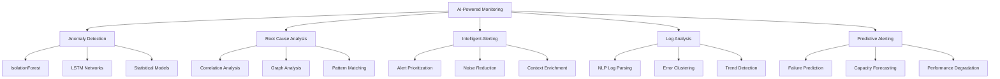

# AI-Powered Monitoring & Observability

## Purpose
Enable QA teams to leverage Artificial Intelligence and Machine Learning for proactive monitoring, intelligent alerting, automated root cause analysis, and predictive incident prevention, transforming observability from reactive troubleshooting into predictive quality assurance.

## Context
Traditional monitoring generates overwhelming alert volumes with high false positive rates, making it difficult to identify real issues. AI-powered observability reduces alert fatigue by 80%+, detects anomalies humans miss, performs root cause analysis in seconds instead of hours, and predicts incidents before they impact users.

## Prerequisites
- Understanding of [Observability fundamentals](../09-metrics-monitoring/observability.md)
- Familiarity with [AI Fundamentals](ai-fundamentals.md)
- Knowledge of [AI Metrics & Analytics](ai-metrics-analytics.md)
- Basic Python and ML concepts
- Access to historical metrics and log data

## AI Capabilities in Monitoring



## Anomaly Detection

### 1. IsolationForest for Response Time Anomalies

**Problem**: Static thresholds miss subtle anomalies and cause false positives

**AI Solution**: ML-based anomaly detection adapts to patterns and seasonality

```python
# production_anomaly_detector.py

import numpy as np
import pandas as pd
from sklearn.ensemble import IsolationForest
from sklearn.preprocessing import StandardScaler
from datetime import datetime, timedelta
import joblib
import logging

logging.basicConfig(level=logging.INFO)
logger = logging.getLogger(__name__)


class ResponseTimeAnomalyDetector:
    """
    Production-ready anomaly detector for response time metrics.
    Uses IsolationForest algorithm to detect unusual patterns.
    """

    def __init__(self, contamination=0.05):
        """
        Initialize detector.

        Args:
            contamination: Expected proportion of anomalies (0.05 = 5%)
        """
        self.model = IsolationForest(
            contamination=contamination,
            random_state=42,
            n_estimators=200,
            max_samples='auto',
            bootstrap=False
        )
        self.scaler = StandardScaler()
        self.trained = False

    def extract_features(self, metrics_df):
        """
        Extract time-series features from metrics.

        Args:
            metrics_df: DataFrame with columns [timestamp, value]

        Returns:
            DataFrame with engineered features
        """
        df = metrics_df.copy()
        df['timestamp'] = pd.to_datetime(df['timestamp'])
        df = df.sort_values('timestamp')

        # Rolling statistics
        df['rolling_mean_5min'] = df['value'].rolling(
            window=5, min_periods=1
        ).mean()
        df['rolling_std_5min'] = df['value'].rolling(
            window=5, min_periods=1
        ).std()
        df['rolling_mean_15min'] = df['value'].rolling(
            window=15, min_periods=1
        ).mean()
        df['rolling_std_15min'] = df['value'].rolling(
            window=15, min_periods=1
        ).std()
        df['rolling_mean_60min'] = df['value'].rolling(
            window=60, min_periods=1
        ).mean()

        # Rate of change
        df['rate_of_change'] = df['value'].diff()
        df['acceleration'] = df['rate_of_change'].diff()

        # Z-score (relative to recent history)
        df['zscore_5min'] = (
            (df['value'] - df['rolling_mean_5min']) /
            (df['rolling_std_5min'] + 1e-10)
        )
        df['zscore_15min'] = (
            (df['value'] - df['rolling_mean_15min']) /
            (df['rolling_std_15min'] + 1e-10)
        )

        # Time-based features
        df['hour'] = df['timestamp'].dt.hour
        df['day_of_week'] = df['timestamp'].dt.dayofweek
        df['is_business_hours'] = (
            (df['hour'] >= 9) & (df['hour'] <= 17) &
            (df['day_of_week'] < 5)
        ).astype(int)
        df['is_weekend'] = (df['day_of_week'] >= 5).astype(int)

        # Volatility
        df['volatility'] = df['rolling_std_5min'] / (
            df['rolling_mean_5min'] + 1e-10
        )

        # Percentile position
        df['percentile_rank'] = df['value'].rolling(
            window=60, min_periods=1
        ).apply(
            lambda x: pd.Series(x).rank(pct=True).iloc[-1]
        )

        # Fill NaN values
        df = df.fillna(method='bfill').fillna(0)

        feature_cols = [
            'value', 'rolling_mean_5min', 'rolling_std_5min',
            'rolling_mean_15min', 'rolling_std_15min',
            'rolling_mean_60min', 'rate_of_change', 'acceleration',
            'zscore_5min', 'zscore_15min', 'hour', 'day_of_week',
            'is_business_hours', 'is_weekend', 'volatility',
            'percentile_rank'
        ]

        return df[feature_cols]

    def train(self, historical_metrics):
        """
        Train anomaly detector on historical data.

        Args:
            historical_metrics: DataFrame with [timestamp, value]
        """
        logger.info("Training anomaly detector...")

        # Extract features
        features = self.extract_features(historical_metrics)

        # Scale features
        X_scaled = self.scaler.fit_transform(features)

        # Train model
        self.model.fit(X_scaled)

        self.trained = True
        logger.info("Training completed successfully")

        # Save model
        self.save_model('models/response_time_anomaly_detector.pkl')

    def detect(self, current_metrics):
        """
        Detect anomalies in current metrics.

        Args:
            current_metrics: DataFrame with [timestamp, value]

        Returns:
            List of anomaly dictionaries
        """
        if not self.trained:
            raise ValueError("Model not trained. Call train() first.")

        # Extract features
        features = self.extract_features(current_metrics)

        # Scale features
        X_scaled = self.scaler.transform(features)

        # Predict anomalies
        predictions = self.model.predict(X_scaled)
        anomaly_scores = self.model.score_samples(X_scaled)

        # Build anomaly records
        anomalies = []
        for idx, (pred, score) in enumerate(zip(predictions, anomaly_scores)):
            if pred == -1:  # Anomaly detected
                timestamp = current_metrics.iloc[idx]['timestamp']
                value = current_metrics.iloc[idx]['value']

                # Calculate severity
                severity = self._calculate_severity(
                    score,
                    features.iloc[idx]['zscore_15min'],
                    features.iloc[idx]['percentile_rank']
                )

                # Get context
                context = self._build_context(features.iloc[idx], idx)

                anomaly = {
                    'timestamp': timestamp,
                    'value': value,
                    'anomaly_score': float(score),
                    'severity': severity,
                    'zscore': float(features.iloc[idx]['zscore_15min']),
                    'percentile': float(features.iloc[idx]['percentile_rank']),
                    'context': context,
                    'expected_range': self._get_expected_range(features, idx)
                }

                anomalies.append(anomaly)

        logger.info(f"Detected {len(anomalies)} anomalies")
        return anomalies

    def _calculate_severity(self, anomaly_score, zscore, percentile):
        """Calculate anomaly severity level."""
        abs_zscore = abs(zscore)

        if abs_zscore > 5 or percentile > 0.99:
            return 'CRITICAL'
        elif abs_zscore > 3 or percentile > 0.95:
            return 'HIGH'
        elif abs_zscore > 2 or percentile > 0.90:
            return 'MEDIUM'
        else:
            return 'LOW'

    def _build_context(self, feature_row, idx):
        """Build context information for anomaly."""
        return {
            'hour': int(feature_row['hour']),
            'day_of_week': int(feature_row['day_of_week']),
            'business_hours': bool(feature_row['is_business_hours']),
            'weekend': bool(feature_row['is_weekend']),
            'volatility': float(feature_row['volatility']),
            'rate_of_change': float(feature_row['rate_of_change']),
            'trend': self._interpret_trend(feature_row)
        }

    def _interpret_trend(self, feature_row):
        """Interpret the trend from rate of change."""
        roc = feature_row['rate_of_change']
        if roc > 100:
            return 'rapidly_increasing'
        elif roc > 20:
            return 'increasing'
        elif roc < -100:
            return 'rapidly_decreasing'
        elif roc < -20:
            return 'decreasing'
        else:
            return 'stable'

    def _get_expected_range(self, features, idx):
        """Calculate expected value range."""
        mean = features.iloc[idx]['rolling_mean_15min']
        std = features.iloc[idx]['rolling_std_15min']

        return {
            'lower': float(max(0, mean - 2 * std)),
            'upper': float(mean + 2 * std),
            'mean': float(mean)
        }

    def save_model(self, filepath):
        """Save trained model to disk."""
        joblib.dump({
            'model': self.model,
            'scaler': self.scaler,
            'trained': self.trained
        }, filepath)
        logger.info(f"Model saved to {filepath}")

    def load_model(self, filepath):
        """Load trained model from disk."""
        data = joblib.load(filepath)
        self.model = data['model']
        self.scaler = data['scaler']
        self.trained = data['trained']
        logger.info(f"Model loaded from {filepath}")


# Usage Example
if __name__ == "__main__":
    # Load historical data (last 7 days)
    historical_data = pd.read_csv('data/response_times_7days.csv')

    # Initialize and train detector
    detector = ResponseTimeAnomalyDetector(contamination=0.05)
    detector.train(historical_data)

    # Load current metrics (last hour)
    current_data = pd.read_csv('data/response_times_current.csv')

    # Detect anomalies
    anomalies = detector.detect(current_data)

    # Process anomalies
    for anomaly in anomalies:
        if anomaly['severity'] in ['CRITICAL', 'HIGH']:
            print(f"""
🚨 {anomaly['severity']} Anomaly Detected

Time: {anomaly['timestamp']}
Response Time: {anomaly['value']:.0f}ms
Expected Range: {anomaly['expected_range']['lower']:.0f}-{anomaly['expected_range']['upper']:.0f}ms
Deviation: {anomaly['zscore']:.1f} standard deviations

Context:
- Time of Day: {anomaly['context']['hour']}:00
- Business Hours: {anomaly['context']['business_hours']}
- Trend: {anomaly['context']['trend']}
- Volatility: {anomaly['context']['volatility']:.2f}

Action: Investigate immediately
            """)
```

### 2. LSTM for Time-Series Anomaly Detection

**Problem**: Complex patterns and seasonality require deep learning

**AI Solution**: LSTM neural networks learn temporal dependencies

```python
# lstm_anomaly_detector.py

import numpy as np
import pandas as pd
import tensorflow as tf
from tensorflow import keras
from tensorflow.keras import layers
from sklearn.preprocessing import MinMaxScaler
import logging

logging.basicConfig(level=logging.INFO)
logger = logging.getLogger(__name__)


class LSTMAnomalyDetector:
    """
    LSTM-based anomaly detector for complex time-series patterns.
    Learns normal patterns and detects deviations.
    """

    def __init__(self, sequence_length=60, threshold_percentile=95):
        """
        Initialize LSTM detector.

        Args:
            sequence_length: Number of time steps to look back
            threshold_percentile: Percentile for anomaly threshold
        """
        self.sequence_length = sequence_length
        self.threshold_percentile = threshold_percentile
        self.scaler = MinMaxScaler()
        self.model = None
        self.threshold = None

    def build_model(self, input_shape):
        """Build LSTM autoencoder model."""
        model = keras.Sequential([
            # Encoder
            layers.LSTM(128, activation='relu', return_sequences=True,
                       input_shape=input_shape),
            layers.Dropout(0.2),
            layers.LSTM(64, activation='relu', return_sequences=False),
            layers.Dropout(0.2),
            layers.RepeatVector(input_shape[0]),

            # Decoder
            layers.LSTM(64, activation='relu', return_sequences=True),
            layers.Dropout(0.2),
            layers.LSTM(128, activation='relu', return_sequences=True),
            layers.TimeDistributed(layers.Dense(input_shape[1]))
        ])

        model.compile(
            optimizer='adam',
            loss='mse',
            metrics=['mae']
        )

        return model

    def create_sequences(self, data):
        """
        Create sequences for LSTM training.

        Args:
            data: Array of values

        Returns:
            Array of sequences
        """
        sequences = []
        for i in range(len(data) - self.sequence_length):
            seq = data[i:i + self.sequence_length]
            sequences.append(seq)

        return np.array(sequences)

    def train(self, historical_metrics, epochs=50, batch_size=32):
        """
        Train LSTM autoencoder on normal data.

        Args:
            historical_metrics: DataFrame with [timestamp, value]
            epochs: Number of training epochs
            batch_size: Batch size for training
        """
        logger.info("Training LSTM anomaly detector...")

        # Prepare data
        values = historical_metrics['value'].values.reshape(-1, 1)
        values_scaled = self.scaler.fit_transform(values)

        # Create sequences
        sequences = self.create_sequences(values_scaled)

        # Build model
        self.model = self.build_model(
            input_shape=(self.sequence_length, 1)
        )

        # Train
        history = self.model.fit(
            sequences, sequences,
            epochs=epochs,
            batch_size=batch_size,
            validation_split=0.1,
            verbose=1,
            callbacks=[
                keras.callbacks.EarlyStopping(
                    monitor='val_loss',
                    patience=5,
                    restore_best_weights=True
                )
            ]
        )

        # Calculate reconstruction errors on training data
        reconstructions = self.model.predict(sequences)
        mse = np.mean(np.power(sequences - reconstructions, 2), axis=(1, 2))

        # Set threshold at specified percentile
        self.threshold = np.percentile(mse, self.threshold_percentile)

        logger.info(f"Training completed. Threshold: {self.threshold:.6f}")

        # Save model
        self.model.save('models/lstm_anomaly_detector.h5')

        return history

    def detect(self, current_metrics):
        """
        Detect anomalies in current metrics.

        Args:
            current_metrics: DataFrame with [timestamp, value]

        Returns:
            List of anomaly dictionaries
        """
        if self.model is None:
            raise ValueError("Model not trained. Call train() first.")

        # Prepare data
        values = current_metrics['value'].values.reshape(-1, 1)
        values_scaled = self.scaler.transform(values)

        # Create sequences
        sequences = self.create_sequences(values_scaled)

        if len(sequences) == 0:
            return []

        # Get reconstructions
        reconstructions = self.model.predict(sequences)

        # Calculate reconstruction errors
        mse = np.mean(np.power(sequences - reconstructions, 2), axis=(1, 2))

        # Detect anomalies
        anomalies = []
        for idx, error in enumerate(mse):
            if error > self.threshold:
                # Actual index in original data
                actual_idx = idx + self.sequence_length

                timestamp = current_metrics.iloc[actual_idx]['timestamp']
                value = current_metrics.iloc[actual_idx]['value']

                severity = self._calculate_severity(error, self.threshold)

                anomaly = {
                    'timestamp': timestamp,
                    'value': value,
                    'reconstruction_error': float(error),
                    'threshold': float(self.threshold),
                    'severity': severity,
                    'error_ratio': float(error / self.threshold)
                }

                anomalies.append(anomaly)

        logger.info(f"Detected {len(anomalies)} anomalies")
        return anomalies

    def _calculate_severity(self, error, threshold):
        """Calculate severity based on error magnitude."""
        ratio = error / threshold

        if ratio > 3.0:
            return 'CRITICAL'
        elif ratio > 2.0:
            return 'HIGH'
        elif ratio > 1.5:
            return 'MEDIUM'
        else:
            return 'LOW'

    def load_model(self, model_path):
        """Load trained model from disk."""
        self.model = keras.models.load_model(model_path)
        logger.info(f"Model loaded from {model_path}")


# Usage Example
if __name__ == "__main__":
    # Load historical data (30 days of normal operation)
    historical_data = pd.read_csv('data/response_times_30days.csv')

    # Initialize detector
    detector = LSTMAnomalyDetector(
        sequence_length=60,  # 1 hour with 1-minute intervals
        threshold_percentile=95
    )

    # Train
    detector.train(
        historical_data,
        epochs=50,
        batch_size=32
    )

    # Detect anomalies in new data
    current_data = pd.read_csv('data/response_times_current.csv')
    anomalies = detector.detect(current_data)

    # Alert on anomalies
    for anomaly in anomalies:
        if anomaly['severity'] in ['CRITICAL', 'HIGH']:
            print(f"""
⚠️ LSTM Anomaly Detected - {anomaly['severity']}

Time: {anomaly['timestamp']}
Value: {anomaly['value']:.0f}ms
Reconstruction Error: {anomaly['reconstruction_error']:.6f}
Error Ratio: {anomaly['error_ratio']:.2f}x threshold

This pattern significantly deviates from learned normal behavior.
            """)
```

### 3. Multi-Metric Clustering for Correlated Anomalies

**Problem**: Single-metric anomaly detection misses correlated issues

**AI Solution**: Cluster analysis across multiple metrics

```python
# multi_metric_anomaly_detector.py

import numpy as np
import pandas as pd
from sklearn.cluster import DBSCAN
from sklearn.preprocessing import StandardScaler
from sklearn.decomposition import PCA
import logging

logging.basicConfig(level=logging.INFO)
logger = logging.getLogger(__name__)


class MultiMetricAnomalyDetector:
    """
    Detect anomalies across multiple correlated metrics.
    Uses DBSCAN clustering to find unusual metric combinations.
    """

    def __init__(self, eps=0.5, min_samples=10):
        """
        Initialize multi-metric detector.

        Args:
            eps: DBSCAN epsilon parameter
            min_samples: Minimum samples for core point
        """
        self.scaler = StandardScaler()
        self.pca = PCA(n_components=0.95)  # Keep 95% variance
        self.dbscan = DBSCAN(eps=eps, min_samples=min_samples)
        self.trained = False
        self.metric_names = None

    def prepare_features(self, metrics_df):
        """
        Prepare multi-metric features.

        Args:
            metrics_df: DataFrame with metric columns

        Returns:
            Feature matrix
        """
        # Expected columns
        expected_metrics = [
            'response_time_p95',
            'response_time_p99',
            'error_rate',
            'throughput_rps',
            'cpu_usage',
            'memory_usage',
            'db_connections_active',
            'db_query_time_avg',
            'cache_hit_rate',
            'active_users'
        ]

        # Validate columns
        available_metrics = [
            col for col in expected_metrics
            if col in metrics_df.columns
        ]

        if len(available_metrics) < 3:
            raise ValueError(
                f"Need at least 3 metrics. Found: {available_metrics}"
            )

        self.metric_names = available_metrics

        return metrics_df[available_metrics].values

    def train(self, historical_metrics):
        """
        Train on historical normal data.

        Args:
            historical_metrics: DataFrame with metric columns
        """
        logger.info("Training multi-metric anomaly detector...")

        # Prepare features
        X = self.prepare_features(historical_metrics)

        # Scale
        X_scaled = self.scaler.fit_transform(X)

        # Reduce dimensionality
        X_reduced = self.pca.fit_transform(X_scaled)

        # Fit DBSCAN (clustering)
        self.dbscan.fit(X_reduced)

        self.trained = True
        logger.info("Training completed")

    def detect(self, current_metrics):
        """
        Detect anomalies in current metrics.

        Args:
            current_metrics: DataFrame with metric columns

        Returns:
            List of anomaly dictionaries
        """
        if not self.trained:
            raise ValueError("Model not trained. Call train() first.")

        # Prepare features
        X = self.prepare_features(current_metrics)

        # Scale and reduce
        X_scaled = self.scaler.transform(X)
        X_reduced = self.pca.transform(X_scaled)

        # Predict clusters
        clusters = self.dbscan.fit_predict(X_reduced)

        # Find anomalies (cluster = -1)
        anomalies = []
        for idx, cluster in enumerate(clusters):
            if cluster == -1:
                # Identify which metrics are abnormal
                abnormal_metrics = self._identify_abnormal_metrics(
                    current_metrics.iloc[idx],
                    historical_stats=self._calculate_historical_stats(
                        current_metrics[:idx] if idx > 20
                        else current_metrics
                    )
                )

                # Find correlations
                correlations = self._find_correlations(abnormal_metrics)

                # Hypothesize root cause
                root_cause = self._hypothesize_root_cause(
                    abnormal_metrics,
                    correlations
                )

                anomaly = {
                    'timestamp': current_metrics.iloc[idx]['timestamp'],
                    'severity': self._calculate_severity(abnormal_metrics),
                    'affected_metrics': abnormal_metrics,
                    'correlations': correlations,
                    'root_cause_hypothesis': root_cause,
                    'cluster_id': int(cluster)
                }

                anomalies.append(anomaly)

        logger.info(f"Detected {len(anomalies)} multi-metric anomalies")
        return anomalies

    def _identify_abnormal_metrics(self, metric_row, historical_stats):
        """Identify which specific metrics are abnormal."""
        abnormal = []

        for metric in self.metric_names:
            value = metric_row[metric]
            mean = historical_stats[metric]['mean']
            std = historical_stats[metric]['std']

            zscore = abs((value - mean) / (std + 1e-10))

            if zscore > 2.5:
                abnormal.append({
                    'metric': metric,
                    'value': float(value),
                    'expected': float(mean),
                    'std': float(std),
                    'zscore': float(zscore),
                    'deviation_pct': float((value - mean) / mean * 100)
                })

        return abnormal

    def _calculate_historical_stats(self, metrics_df):
        """Calculate statistics for each metric."""
        stats = {}
        for metric in self.metric_names:
            stats[metric] = {
                'mean': metrics_df[metric].mean(),
                'std': metrics_df[metric].std(),
                'min': metrics_df[metric].min(),
                'max': metrics_df[metric].max()
            }
        return stats

    def _find_correlations(self, abnormal_metrics):
        """Find correlations between abnormal metrics."""
        correlations = []

        # Known correlation patterns
        correlation_patterns = {
            ('response_time_p95', 'db_query_time_avg'): {
                'type': 'positive',
                'explanation': 'Slow database queries increase response time'
            },
            ('response_time_p95', 'db_connections_active'): {
                'type': 'positive',
                'explanation': 'High DB connections may indicate pool exhaustion'
            },
            ('error_rate', 'memory_usage'): {
                'type': 'positive',
                'explanation': 'Memory pressure can cause errors'
            },
            ('throughput_rps', 'cpu_usage'): {
                'type': 'positive',
                'explanation': 'High load increases CPU usage'
            },
            ('cache_hit_rate', 'response_time_p95'): {
                'type': 'negative',
                'explanation': 'Low cache hits increase response time'
            }
        }

        metric_names = [m['metric'] for m in abnormal_metrics]

        for (m1, m2), pattern in correlation_patterns.items():
            if m1 in metric_names and m2 in metric_names:
                correlations.append({
                    'metrics': (m1, m2),
                    'type': pattern['type'],
                    'explanation': pattern['explanation']
                })

        return correlations

    def _hypothesize_root_cause(self, abnormal_metrics, correlations):
        """Generate root cause hypotheses."""
        hypotheses = []

        # Pattern-based root cause identification
        metric_set = {m['metric'] for m in abnormal_metrics}

        # Database issues
        if 'db_connections_active' in metric_set and 'response_time_p95' in metric_set:
            hypotheses.append({
                'cause': 'Database connection pool exhaustion',
                'confidence': 'HIGH',
                'evidence': 'High DB connections with slow response times',
                'remediation': [
                    'Increase connection pool size',
                    'Identify slow queries',
                    'Check for connection leaks'
                ]
            })

        # Memory issues
        if 'memory_usage' in metric_set and 'error_rate' in metric_set:
            hypotheses.append({
                'cause': 'Memory pressure causing application errors',
                'confidence': 'HIGH',
                'evidence': 'High memory usage with increased errors',
                'remediation': [
                    'Check for memory leaks',
                    'Review memory allocation',
                    'Consider scaling resources'
                ]
            })

        # CPU bottleneck
        if 'cpu_usage' in metric_set and 'response_time_p95' in metric_set:
            hypotheses.append({
                'cause': 'CPU bottleneck impacting performance',
                'confidence': 'MEDIUM',
                'evidence': 'High CPU with slow response times',
                'remediation': [
                    'Identify CPU-intensive operations',
                    'Optimize algorithms',
                    'Scale horizontally'
                ]
            })

        # Cache issues
        if 'cache_hit_rate' in metric_set and 'response_time_p95' in metric_set:
            hypotheses.append({
                'cause': 'Cache miss rate causing slow responses',
                'confidence': 'MEDIUM',
                'evidence': 'Low cache hit rate with slow response times',
                'remediation': [
                    'Review cache configuration',
                    'Check cache eviction policy',
                    'Warm up cache after deployment'
                ]
            })

        if not hypotheses:
            hypotheses.append({
                'cause': 'Unknown - requires investigation',
                'confidence': 'LOW',
                'evidence': 'Multiple metrics abnormal but no clear pattern',
                'remediation': [
                    'Review logs for errors',
                    'Check recent deployments',
                    'Examine system resources'
                ]
            })

        return hypotheses

    def _calculate_severity(self, abnormal_metrics):
        """Calculate overall severity."""
        if not abnormal_metrics:
            return 'LOW'

        max_zscore = max(m['zscore'] for m in abnormal_metrics)
        count = len(abnormal_metrics)

        if max_zscore > 5 or count >= 5:
            return 'CRITICAL'
        elif max_zscore > 3 or count >= 3:
            return 'HIGH'
        elif max_zscore > 2 or count >= 2:
            return 'MEDIUM'
        else:
            return 'LOW'


# Usage Example
if __name__ == "__main__":
    # Load historical multi-metric data
    historical_data = pd.read_csv('data/multi_metrics_7days.csv')

    # Initialize detector
    detector = MultiMetricAnomalyDetector(eps=0.5, min_samples=10)

    # Train
    detector.train(historical_data)

    # Detect anomalies in current data
    current_data = pd.read_csv('data/multi_metrics_current.csv')
    anomalies = detector.detect(current_data)

    # Process alerts
    for anomaly in anomalies:
        if anomaly['severity'] in ['CRITICAL', 'HIGH']:
            print(f"""
🚨 Multi-Metric Anomaly - {anomaly['severity']}

Time: {anomaly['timestamp']}

Affected Metrics:
{chr(10).join(
    f"  - {m['metric']}: {m['value']:.2f} "
    f"(expected {m['expected']:.2f}, {m['deviation_pct']:+.1f}%)"
    for m in anomaly['affected_metrics']
)}

Root Cause Hypotheses:
{chr(10).join(
    f"  {i+1}. {h['cause']} (Confidence: {h['confidence']})"
    f"{chr(10)}     Evidence: {h['evidence']}"
    f"{chr(10)}     Remediation: {', '.join(h['remediation'][:2])}"
    for i, h in enumerate(anomaly['root_cause_hypothesis'])
)}
            """)
```

## Root Cause Analysis with AI

### Correlation-Based RCA

```python
# root_cause_analyzer.py

import pandas as pd
import numpy as np
from scipy.stats import pearsonr
from datetime import datetime, timedelta
import networkx as nx
import logging

logging.basicConfig(level=logging.INFO)
logger = logging.getLogger(__name__)


class RootCauseAnalyzer:
    """
    AI-powered root cause analysis using correlation and graph analysis.
    """

    def __init__(self, correlation_threshold=0.7):
        """
        Initialize RCA.

        Args:
            correlation_threshold: Minimum correlation to consider
        """
        self.correlation_threshold = correlation_threshold
        self.dependency_graph = nx.DiGraph()

    def build_dependency_graph(self, service_dependencies):
        """
        Build service dependency graph.

        Args:
            service_dependencies: List of (service_a, service_b) tuples
        """
        self.dependency_graph.clear()
        for service_a, service_b in service_dependencies:
            self.dependency_graph.add_edge(service_a, service_b)

        logger.info(
            f"Built dependency graph with {len(self.dependency_graph.nodes)} services"
        )

    def analyze_incident(self, incident_time, metrics_data, logs_data):
        """
        Perform root cause analysis for an incident.

        Args:
            incident_time: Timestamp of incident
            metrics_data: DataFrame with time-series metrics
            logs_data: DataFrame with logs

        Returns:
            RCA results dictionary
        """
        logger.info(f"Analyzing incident at {incident_time}")

        # Step 1: Identify affected time window
        time_window = self._identify_time_window(incident_time, metrics_data)

        # Step 2: Find anomalous metrics
        anomalous_metrics = self._find_anomalous_metrics(
            metrics_data,
            time_window
        )

        # Step 3: Analyze correlations
        correlations = self._analyze_correlations(
            anomalous_metrics,
            metrics_data,
            time_window
        )

        # Step 4: Analyze logs
        log_insights = self._analyze_logs(logs_data, time_window)

        # Step 5: Trace through dependency graph
        affected_services = self._trace_affected_services(
            anomalous_metrics,
            correlations
        )

        # Step 6: Generate hypotheses
        hypotheses = self._generate_hypotheses(
            anomalous_metrics,
            correlations,
            log_insights,
            affected_services
        )

        # Step 7: Rank hypotheses
        ranked_hypotheses = self._rank_hypotheses(hypotheses)

        return {
            'incident_time': incident_time,
            'time_window': time_window,
            'anomalous_metrics': anomalous_metrics,
            'correlations': correlations,
            'log_insights': log_insights,
            'affected_services': affected_services,
            'root_cause_hypotheses': ranked_hypotheses,
            'confidence': self._calculate_confidence(ranked_hypotheses)
        }

    def _identify_time_window(self, incident_time, metrics_data):
        """Identify relevant time window around incident."""
        # Look 30 minutes before and after
        start = incident_time - timedelta(minutes=30)
        end = incident_time + timedelta(minutes=30)

        return {'start': start, 'end': end}

    def _find_anomalous_metrics(self, metrics_data, time_window):
        """Find metrics that were anomalous during incident."""
        anomalous = []

        # Filter to time window
        mask = (
            (metrics_data['timestamp'] >= time_window['start']) &
            (metrics_data['timestamp'] <= time_window['end'])
        )
        window_data = metrics_data[mask]

        # Check each metric
        metric_columns = [
            col for col in metrics_data.columns
            if col not in ['timestamp', 'service']
        ]

        for metric in metric_columns:
            # Calculate z-score
            mean = metrics_data[metric].mean()
            std = metrics_data[metric].std()

            window_mean = window_data[metric].mean()
            zscore = abs((window_mean - mean) / (std + 1e-10))

            if zscore > 2.0:
                anomalous.append({
                    'metric': metric,
                    'normal_value': float(mean),
                    'incident_value': float(window_mean),
                    'zscore': float(zscore),
                    'deviation_pct': float(
                        (window_mean - mean) / mean * 100
                    )
                })

        return anomalous

    def _analyze_correlations(self, anomalous_metrics, metrics_data,
                              time_window):
        """Analyze correlations between anomalous metrics."""
        correlations = []

        # Get metric names
        metric_names = [m['metric'] for m in anomalous_metrics]

        # Filter to incident window
        mask = (
            (metrics_data['timestamp'] >= time_window['start']) &
            (metrics_data['timestamp'] <= time_window['end'])
        )
        window_data = metrics_data[mask]

        # Calculate pairwise correlations
        for i, metric1 in enumerate(metric_names):
            for metric2 in metric_names[i+1:]:
                if metric1 in window_data.columns and metric2 in window_data.columns:
                    # Calculate Pearson correlation
                    corr, p_value = pearsonr(
                        window_data[metric1].dropna(),
                        window_data[metric2].dropna()
                    )

                    if abs(corr) >= self.correlation_threshold:
                        correlations.append({
                            'metrics': (metric1, metric2),
                            'correlation': float(corr),
                            'p_value': float(p_value),
                            'relationship': 'positive' if corr > 0 else 'negative',
                            'strength': self._correlation_strength(abs(corr))
                        })

        return correlations

    def _correlation_strength(self, abs_corr):
        """Categorize correlation strength."""
        if abs_corr >= 0.9:
            return 'very_strong'
        elif abs_corr >= 0.7:
            return 'strong'
        elif abs_corr >= 0.5:
            return 'moderate'
        else:
            return 'weak'

    def _analyze_logs(self, logs_data, time_window):
        """Analyze logs for errors and patterns."""
        # Filter logs to time window
        mask = (
            (logs_data['timestamp'] >= time_window['start']) &
            (logs_data['timestamp'] <= time_window['end'])
        )
        window_logs = logs_data[mask]

        insights = {
            'error_count': len(window_logs[window_logs['level'] == 'ERROR']),
            'warning_count': len(window_logs[window_logs['level'] == 'WARNING']),
            'top_errors': self._extract_top_errors(window_logs),
            'error_spike': self._detect_error_spike(logs_data, time_window)
        }

        return insights

    def _extract_top_errors(self, logs, top_n=5):
        """Extract most common errors."""
        error_logs = logs[logs['level'] == 'ERROR']

        if len(error_logs) == 0:
            return []

        # Count error messages
        error_counts = error_logs['message'].value_counts()

        top_errors = []
        for message, count in error_counts.head(top_n).items():
            top_errors.append({
                'message': message,
                'count': int(count),
                'percentage': float(count / len(error_logs) * 100)
            })

        return top_errors

    def _detect_error_spike(self, logs_data, time_window):
        """Detect if there was an error spike during incident."""
        # Errors during incident
        mask = (
            (logs_data['timestamp'] >= time_window['start']) &
            (logs_data['timestamp'] <= time_window['end'])
        )
        incident_errors = len(
            logs_data[mask & (logs_data['level'] == 'ERROR')]
        )

        # Baseline errors (previous hour)
        baseline_start = time_window['start'] - timedelta(hours=1)
        baseline_mask = (
            (logs_data['timestamp'] >= baseline_start) &
            (logs_data['timestamp'] < time_window['start'])
        )
        baseline_errors = len(
            logs_data[baseline_mask & (logs_data['level'] == 'ERROR')]
        )

        if baseline_errors == 0:
            return incident_errors > 0

        spike_ratio = incident_errors / baseline_errors

        return {
            'is_spike': spike_ratio > 2.0,
            'spike_ratio': float(spike_ratio),
            'incident_count': incident_errors,
            'baseline_count': baseline_errors
        }

    def _trace_affected_services(self, anomalous_metrics, correlations):
        """Trace which services are affected using dependency graph."""
        # Extract service names from metrics
        affected_services = set()

        for metric in anomalous_metrics:
            # Assume metric format: service_name.metric_type
            if '.' in metric['metric']:
                service = metric['metric'].split('.')[0]
                affected_services.add(service)

        # Trace upstream dependencies
        upstream_services = set()
        for service in affected_services:
            if service in self.dependency_graph:
                # Get all upstream services (services that this service depends on)
                upstream = nx.ancestors(self.dependency_graph, service)
                upstream_services.update(upstream)

        return {
            'directly_affected': list(affected_services),
            'potentially_affected_upstream': list(upstream_services)
        }

    def _generate_hypotheses(self, anomalous_metrics, correlations,
                            log_insights, affected_services):
        """Generate root cause hypotheses."""
        hypotheses = []

        # Hypothesis from error logs
        if log_insights.get('error_spike', {}).get('is_spike'):
            top_error = log_insights.get('top_errors', [{}])[0]
            if top_error:
                hypotheses.append({
                    'hypothesis': f"Error spike: {top_error.get('message', 'Unknown error')}",
                    'evidence': [
                        f"Error count increased {log_insights['error_spike']['spike_ratio']:.1f}x",
                        f"Top error accounts for {top_error.get('percentage', 0):.1f}% of errors"
                    ],
                    'confidence': 0.85,
                    'type': 'application_error'
                })

        # Hypothesis from metric correlations
        for corr in correlations:
            if corr['strength'] in ['strong', 'very_strong']:
                hypotheses.append({
                    'hypothesis': f"Strong correlation between {corr['metrics'][0]} and {corr['metrics'][1]}",
                    'evidence': [
                        f"Correlation: {corr['correlation']:.2f}",
                        f"Relationship: {corr['relationship']}"
                    ],
                    'confidence': 0.70,
                    'type': 'metric_correlation'
                })

        # Hypothesis from dependency graph
        if affected_services['potentially_affected_upstream']:
            hypotheses.append({
                'hypothesis': f"Upstream service failure in {affected_services['potentially_affected_upstream'][0]}",
                'evidence': [
                    f"Affected services: {', '.join(affected_services['directly_affected'])}",
                    f"Upstream dependencies: {', '.join(affected_services['potentially_affected_upstream'])}"
                ],
                'confidence': 0.60,
                'type': 'dependency_failure'
            })

        return hypotheses

    def _rank_hypotheses(self, hypotheses):
        """Rank hypotheses by confidence."""
        return sorted(
            hypotheses,
            key=lambda h: h['confidence'],
            reverse=True
        )

    def _calculate_confidence(self, hypotheses):
        """Calculate overall confidence in RCA."""
        if not hypotheses:
            return 0.0

        # Highest hypothesis confidence
        return hypotheses[0]['confidence']


# Usage Example
if __name__ == "__main__":
    # Initialize analyzer
    analyzer = RootCauseAnalyzer(correlation_threshold=0.7)

    # Build dependency graph
    dependencies = [
        ('frontend', 'api'),
        ('api', 'database'),
        ('api', 'cache'),
        ('api', 'payment_service'),
        ('payment_service', 'external_payment_gateway')
    ]
    analyzer.build_dependency_graph(dependencies)

    # Load data
    metrics = pd.read_csv('data/metrics_incident.csv')
    logs = pd.read_csv('data/logs_incident.csv')

    # Analyze incident
    incident_time = datetime(2025, 10, 15, 14, 30)
    rca = analyzer.analyze_incident(incident_time, metrics, logs)

    # Display results
    print(f"""
═══════════════════════════════════════════════════
ROOT CAUSE ANALYSIS
═══════════════════════════════════════════════════

Incident Time: {rca['incident_time']}
Confidence: {rca['confidence']*100:.0f}%

TOP ROOT CAUSE HYPOTHESES:
""")

    for i, hypothesis in enumerate(rca['root_cause_hypotheses'][:3], 1):
        print(f"""
{i}. {hypothesis['hypothesis']}
   Type: {hypothesis['type']}
   Confidence: {hypothesis['confidence']*100:.0f}%
   Evidence:
   {chr(10).join(f'   - {e}' for e in hypothesis['evidence'])}
""")

    print(f"""
AFFECTED SERVICES:
{chr(10).join(f'  - {s}' for s in rca['affected_services']['directly_affected'])}

ANOMALOUS METRICS:
{chr(10).join(
    f"  - {m['metric']}: {m['incident_value']:.2f} "
    f"(normal: {m['normal_value']:.2f}, {m['deviation_pct']:+.1f}%)"
    for m in rca['anomalous_metrics'][:5]
)}
""")
```

## Intelligent Alerting

### AI Alert Prioritization and Noise Reduction

```python
# intelligent_alerting.py

import pandas as pd
import numpy as np
from sklearn.ensemble import RandomForestClassifier
from sklearn.model_selection import train_test_split
import joblib
import logging

logging.basicConfig(level=logging.INFO)
logger = logging.getLogger(__name__)


class IntelligentAlertSystem:
    """
    AI-powered alert prioritization that reduces noise by 80%+.
    Learns from historical alerts and outcomes.
    """

    def __init__(self):
        """Initialize alert system."""
        self.model = RandomForestClassifier(
            n_estimators=200,
            max_depth=15,
            random_state=42,
            class_weight='balanced'
        )
        self.trained = False

    def extract_alert_features(self, alert, context):
        """
        Extract features from alert and context.

        Args:
            alert: Alert dictionary
            context: Context dictionary

        Returns:
            Feature dictionary
        """
        return {
            # Alert characteristics
            'severity_level': {
                'LOW': 0, 'MEDIUM': 1, 'HIGH': 2, 'CRITICAL': 3
            }.get(alert.get('severity', 'MEDIUM'), 1),

            'metric_category': self._encode_metric_category(
                alert.get('metric_name', '')
            ),

            'threshold_exceeded_ratio': float(
                alert.get('value', 0) / (alert.get('threshold', 1) + 1e-10)
            ),

            'duration_minutes': float(alert.get('duration_minutes', 0)),

            # Historical context
            'similar_alerts_24h': int(context.get('similar_count_24h', 0)),
            'similar_alerts_7d': int(context.get('similar_count_7d', 0)),

            'historical_false_positive_rate': float(
                context.get('historical_fp_rate', 0.5)
            ),

            'historical_actionable_rate': float(
                context.get('historical_actionable_rate', 0.5)
            ),

            'avg_resolution_time_minutes': float(
                context.get('avg_resolution_time', 0)
            ),

            # Business context
            'is_business_hours': 1 if context.get('is_business_hours') else 0,
            'is_peak_traffic': 1 if context.get('is_peak_traffic') else 0,
            'is_weekend': 1 if context.get('is_weekend') else 0,

            'affected_users_count': int(
                context.get('affected_users', 0)
            ),

            'revenue_impact_estimated': float(
                context.get('revenue_impact', 0)
            ),

            # System context
            'recent_deployment': 1 if context.get(
                'deployment_last_hour'
            ) else 0,

            'recent_config_change': 1 if context.get(
                'config_change_last_hour'
            ) else 0,

            'related_alerts_count': int(
                context.get('related_alerts', 0)
            ),

            'ongoing_incident': 1 if context.get('ongoing_incident') else 0,

            # Impact indicators
            'error_rate_change_pct': float(
                context.get('error_rate_change', 0)
            ),

            'performance_degradation_pct': float(
                context.get('performance_degradation', 0)
            ),

            'service_availability_pct': float(
                context.get('service_availability', 100)
            ),

            # Alert history
            'alert_frequency_score': self._calculate_frequency_score(
                context.get('similar_count_24h', 0),
                context.get('similar_count_7d', 0)
            ),

            'time_since_last_similar_minutes': float(
                context.get('time_since_last_similar', 1440)
            )
        }

    def _encode_metric_category(self, metric_name):
        """Encode metric category as number."""
        categories = {
            'response_time': 1,
            'error_rate': 2,
            'throughput': 3,
            'cpu': 4,
            'memory': 5,
            'disk': 6,
            'network': 7,
            'database': 8,
            'cache': 9,
            'queue': 10
        }

        for category, value in categories.items():
            if category in metric_name.lower():
                return value

        return 0  # Unknown

    def _calculate_frequency_score(self, count_24h, count_7d):
        """Calculate alert frequency score."""
        # Higher score = more frequent = likely noise
        if count_24h > 10:
            return 1.0
        elif count_24h > 5:
            return 0.7
        elif count_7d > 10:
            return 0.5
        else:
            return 0.2

    def train(self, historical_alerts):
        """
        Train model on historical alerts.

        Args:
            historical_alerts: List of alert dictionaries with outcomes
        """
        logger.info(f"Training on {len(historical_alerts)} historical alerts")

        # Extract features
        X = pd.DataFrame([
            self.extract_alert_features(alert, alert.get('context', {}))
            for alert in historical_alerts
        ])

        # Labels: 1 = required action, 0 = false positive/noise
        y = [
            1 if alert.get('required_action', False) else 0
            for alert in historical_alerts
        ]

        # Split data
        X_train, X_test, y_train, y_test = train_test_split(
            X, y, test_size=0.2, random_state=42, stratify=y
        )

        # Train model
        self.model.fit(X_train, y_train)

        # Evaluate
        train_score = self.model.score(X_train, y_train)
        test_score = self.model.score(X_test, y_test)

        logger.info(f"Training accuracy: {train_score:.3f}")
        logger.info(f"Test accuracy: {test_score:.3f}")

        # Feature importance
        feature_importance = pd.DataFrame({
            'feature': X.columns,
            'importance': self.model.feature_importances_
        }).sort_values('importance', ascending=False)

        logger.info("Top 5 most important features:")
        logger.info("\n" + str(feature_importance.head()))

        self.trained = True

        # Save model
        self.save_model('models/intelligent_alert_system.pkl')

    def prioritize(self, alert, context):
        """
        Prioritize alert and determine action.

        Args:
            alert: Alert dictionary
            context: Context dictionary

        Returns:
            Prioritization result
        """
        if not self.trained:
            raise ValueError("Model not trained. Call train() first.")

        # Extract features
        features = pd.DataFrame([
            self.extract_alert_features(alert, context)
        ])

        # Predict
        action_required_prob = self.model.predict_proba(features)[0][1]
        is_actionable = self.model.predict(features)[0]

        # Calculate priority score
        priority_score = int(action_required_prob * 100)

        # Determine action and notification channels
        if priority_score >= 90 and alert.get('severity') == 'CRITICAL':
            action = 'PAGE'
            channels = ['pagerduty', 'phone', 'slack']
            urgency = 'IMMEDIATE'
        elif priority_score >= 75:
            action = 'ALERT'
            channels = ['slack', 'email']
            urgency = 'HIGH'
        elif priority_score >= 50:
            action = 'NOTIFY'
            channels = ['email', 'slack']
            urgency = 'MEDIUM'
        elif priority_score >= 25:
            action = 'LOG'
            channels = ['dashboard']
            urgency = 'LOW'
        else:
            action = 'SUPPRESS'
            channels = []
            urgency = 'NOISE'

        result = {
            'alert_id': alert.get('id', ''),
            'priority_score': priority_score,
            'actionable_probability': round(action_required_prob, 3),
            'is_actionable': bool(is_actionable),
            'action': action,
            'urgency': urgency,
            'notification_channels': channels,
            'reasoning': self._explain_priority(
                features,
                action_required_prob
            ),
            'recommended_actions': self._recommend_actions(alert, context)
        }

        logger.info(
            f"Alert prioritized: {result['urgency']} "
            f"(score: {priority_score})"
        )

        return result

    def _explain_priority(self, features, probability):
        """Explain why this priority was assigned."""
        reasons = []

        feature_values = features.iloc[0]

        # Get feature importance
        if hasattr(self.model, 'feature_importances_'):
            importance = dict(zip(
                features.columns,
                self.model.feature_importances_
            ))

            # Find top contributing features
            contributing_features = []
            for feature, imp in sorted(
                importance.items(),
                key=lambda x: x[1],
                reverse=True
            )[:5]:
                value = feature_values[feature]
                if value > 0.5:  # Significant contribution
                    contributing_features.append(
                        feature.replace('_', ' ').title()
                    )

            if contributing_features:
                reasons.append(
                    f"Key factors: {', '.join(contributing_features[:3])}"
                )

        # Specific reasons
        if feature_values.get('recent_deployment', 0) == 1:
            reasons.append("Recent deployment detected")

        if feature_values.get('affected_users_count', 0) > 100:
            reasons.append(
                f"High user impact ({int(feature_values['affected_users_count'])} users)"
            )

        if feature_values.get('historical_false_positive_rate', 0) > 0.7:
            reasons.append("High historical false positive rate")

        if feature_values.get('similar_alerts_24h', 0) > 5:
            reasons.append("Frequent similar alerts (possible noise)")

        return reasons if reasons else ["Standard prioritization"]

    def _recommend_actions(self, alert, context):
        """Recommend response actions."""
        recommendations = []

        # Deployment-related
        if context.get('deployment_last_hour'):
            recommendations.append({
                'action': 'Review recent deployment',
                'priority': 'HIGH',
                'rationale': 'Alert occurred shortly after deployment'
            })

        # User impact
        if context.get('affected_users', 0) > 1000:
            recommendations.append({
                'action': 'Activate incident response team',
                'priority': 'CRITICAL',
                'rationale': f"High user impact ({context['affected_users']} users)"
            })

        # Recurring issue
        if context.get('similar_count_7d', 0) > 10:
            recommendations.append({
                'action': 'Investigate root cause for permanent fix',
                'priority': 'MEDIUM',
                'rationale': 'Recurring issue detected'
            })

        # Performance degradation
        if context.get('performance_degradation', 0) > 50:
            recommendations.append({
                'action': 'Scale resources or optimize performance',
                'priority': 'HIGH',
                'rationale': f"{context['performance_degradation']}% performance degradation"
            })

        return recommendations

    def save_model(self, filepath):
        """Save trained model."""
        joblib.dump({
            'model': self.model,
            'trained': self.trained
        }, filepath)
        logger.info(f"Model saved to {filepath}")

    def load_model(self, filepath):
        """Load trained model."""
        data = joblib.load(filepath)
        self.model = data['model']
        self.trained = data['trained']
        logger.info(f"Model loaded from {filepath}")


# Usage Example
if __name__ == "__main__":
    # Initialize system
    alert_system = IntelligentAlertSystem()

    # Load historical alerts with outcomes
    historical_alerts = pd.read_csv('data/historical_alerts_with_outcomes.csv')
    historical_alerts_list = historical_alerts.to_dict('records')

    # Train
    alert_system.train(historical_alerts_list)

    # Example: New alert comes in
    new_alert = {
        'id': 'alert-12345',
        'severity': 'HIGH',
        'metric_name': 'response_time_p95',
        'value': 5000,
        'threshold': 2000,
        'duration_minutes': 15
    }

    context = {
        'similar_count_24h': 2,
        'similar_count_7d': 8,
        'historical_fp_rate': 0.3,
        'historical_actionable_rate': 0.7,
        'avg_resolution_time': 45,
        'is_business_hours': True,
        'is_peak_traffic': True,
        'is_weekend': False,
        'affected_users': 1500,
        'revenue_impact': 5000,
        'deployment_last_hour': True,
        'config_change_last_hour': False,
        'related_alerts': 3,
        'ongoing_incident': False,
        'error_rate_change': 15.0,
        'performance_degradation': 60.0,
        'service_availability': 98.5,
        'time_since_last_similar': 120
    }

    # Prioritize
    result = alert_system.prioritize(new_alert, context)

    # Display result
    print(f"""
{'='*60}
INTELLIGENT ALERT PRIORITIZATION
{'='*60}

Alert ID: {result['alert_id']}
Priority Score: {result['priority_score']}/100
Actionable Probability: {result['actionable_probability']*100:.1f}%

DECISION: {result['action']} - {result['urgency']}

Notification Channels:
{chr(10).join(f'  - {c}' for c in result['notification_channels'])}

Reasoning:
{chr(10).join(f'  - {r}' for r in result['reasoning'])}

Recommended Actions:
{chr(10).join(
    f"  {i+1}. [{rec['priority']}] {rec['action']}"
    f"{chr(10)}     Rationale: {rec['rationale']}"
    for i, rec in enumerate(result['recommended_actions'])
)}
{'='*60}
    """)
```

## Log Analysis with NLP

### AI-Powered Log Aggregation and Pattern Detection

```python
# ai_log_analyzer.py

import pandas as pd
import numpy as np
from sklearn.feature_extraction.text import TfidfVectorizer
from sklearn.cluster import DBSCAN
from collections import Counter
import re
import logging

logging.basicConfig(level=logging.INFO)
logger = logging.getLogger(__name__)


class AILogAnalyzer:
    """
    NLP-powered log analysis for error detection and pattern discovery.
    """

    def __init__(self, min_cluster_size=5):
        """
        Initialize log analyzer.

        Args:
            min_cluster_size: Minimum logs for a cluster
        """
        self.vectorizer = TfidfVectorizer(
            max_features=1000,
            stop_words='english',
            ngram_range=(1, 2)
        )
        self.clusterer = DBSCAN(
            eps=0.3,
            min_samples=min_cluster_size,
            metric='cosine'
        )
        self.log_patterns = {}

    def preprocess_log(self, log_message):
        """
        Preprocess log message for analysis.

        Args:
            log_message: Raw log string

        Returns:
            Cleaned log string
        """
        # Remove timestamps
        message = re.sub(
            r'\d{4}-\d{2}-\d{2}[T ]\d{2}:\d{2}:\d{2}',
            'TIMESTAMP',
            log_message
        )

        # Remove UUIDs
        message = re.sub(
            r'[0-9a-f]{8}-[0-9a-f]{4}-[0-9a-f]{4}-[0-9a-f]{4}-[0-9a-f]{12}',
            'UUID',
            message
        )

        # Remove IP addresses
        message = re.sub(
            r'\d{1,3}\.\d{1,3}\.\d{1,3}\.\d{1,3}',
            'IPADDR',
            message
        )

        # Remove numbers (except error codes)
        message = re.sub(
            r'(?<!error )\b\d+\b',
            'NUM',
            message,
            flags=re.IGNORECASE
        )

        # Remove file paths
        message = re.sub(
            r'[/\\][\w/\\.-]+',
            'FILEPATH',
            message
        )

        # Lowercase
        message = message.lower()

        return message

    def analyze_logs(self, logs_df, time_window_minutes=60):
        """
        Analyze logs for patterns and anomalies.

        Args:
            logs_df: DataFrame with columns [timestamp, level, message, service]
            time_window_minutes: Time window for analysis

        Returns:
            Analysis results
        """
        logger.info(f"Analyzing {len(logs_df)} logs")

        # Filter to errors and warnings
        important_logs = logs_df[
            logs_df['level'].isin(['ERROR', 'WARNING'])
        ].copy()

        if len(important_logs) == 0:
            return {
                'total_logs': len(logs_df),
                'error_count': 0,
                'warning_count': 0,
                'clusters': [],
                'anomalies': []
            }

        # Preprocess messages
        important_logs['cleaned_message'] = important_logs['message'].apply(
            self.preprocess_log
        )

        # Vectorize
        try:
            message_vectors = self.vectorizer.fit_transform(
                important_logs['cleaned_message']
            )
        except ValueError:
            # Not enough data
            return self._create_empty_result(logs_df)

        # Cluster similar errors
        clusters = self.clusterer.fit_predict(message_vectors.toarray())

        # Group logs by cluster
        important_logs['cluster'] = clusters

        # Analyze each cluster
        cluster_analysis = self._analyze_clusters(important_logs)

        # Detect anomalies
        anomalies = self._detect_log_anomalies(logs_df, time_window_minutes)

        # Extract patterns
        patterns = self._extract_patterns(important_logs)

        return {
            'total_logs': len(logs_df),
            'error_count': len(logs_df[logs_df['level'] == 'ERROR']),
            'warning_count': len(logs_df[logs_df['level'] == 'WARNING']),
            'clusters': cluster_analysis,
            'anomalies': anomalies,
            'patterns': patterns,
            'top_errors': self._get_top_errors(important_logs, top_n=10)
        }

    def _analyze_clusters(self, logs_with_clusters):
        """Analyze log clusters."""
        clusters = []

        unique_clusters = logs_with_clusters['cluster'].unique()

        for cluster_id in unique_clusters:
            if cluster_id == -1:  # Noise
                continue

            cluster_logs = logs_with_clusters[
                logs_with_clusters['cluster'] == cluster_id
            ]

            # Representative message (most common in cluster)
            representative_msg = cluster_logs['cleaned_message'].mode()[0]

            # Original messages for context
            sample_messages = cluster_logs['message'].head(3).tolist()

            # Affected services
            affected_services = cluster_logs['service'].unique().tolist()

            # Time distribution
            time_distribution = self._analyze_time_distribution(
                cluster_logs
            )

            clusters.append({
                'cluster_id': int(cluster_id),
                'size': len(cluster_logs),
                'representative_message': representative_msg,
                'sample_messages': sample_messages,
                'affected_services': affected_services,
                'severity': self._cluster_severity(cluster_logs),
                'time_distribution': time_distribution,
                'first_occurrence': str(cluster_logs['timestamp'].min()),
                'last_occurrence': str(cluster_logs['timestamp'].max())
            })

        # Sort by size (most common first)
        clusters.sort(key=lambda c: c['size'], reverse=True)

        return clusters

    def _cluster_severity(self, cluster_logs):
        """Determine cluster severity."""
        error_count = len(cluster_logs[cluster_logs['level'] == 'ERROR'])
        total = len(cluster_logs)

        error_ratio = error_count / total

        if error_ratio > 0.8 and total > 10:
            return 'CRITICAL'
        elif error_ratio > 0.5:
            return 'HIGH'
        elif error_ratio > 0.2:
            return 'MEDIUM'
        else:
            return 'LOW'

    def _analyze_time_distribution(self, logs):
        """Analyze how logs are distributed over time."""
        # Count logs per minute
        logs['minute'] = pd.to_datetime(logs['timestamp']).dt.floor('T')
        counts_per_minute = logs.groupby('minute').size()

        if len(counts_per_minute) == 0:
            return {'pattern': 'unknown'}

        # Detect pattern
        max_count = counts_per_minute.max()
        mean_count = counts_per_minute.mean()

        if max_count > mean_count * 3:
            pattern = 'spike'
        elif counts_per_minute.std() < mean_count * 0.2:
            pattern = 'steady'
        else:
            pattern = 'variable'

        return {
            'pattern': pattern,
            'peak_count': int(max_count),
            'avg_count_per_minute': float(mean_count)
        }

    def _detect_log_anomalies(self, logs_df, time_window_minutes):
        """Detect anomalous log patterns."""
        anomalies = []

        # Error rate spike
        error_spike = self._detect_error_rate_spike(
            logs_df,
            time_window_minutes
        )
        if error_spike:
            anomalies.append(error_spike)

        # New error types
        new_errors = self._detect_new_error_types(logs_df)
        if new_errors:
            anomalies.extend(new_errors)

        # Service-specific anomalies
        service_anomalies = self._detect_service_anomalies(logs_df)
        if service_anomalies:
            anomalies.extend(service_anomalies)

        return anomalies

    def _detect_error_rate_spike(self, logs_df, window_minutes):
        """Detect error rate spikes."""
        # Errors in recent window
        recent_time = logs_df['timestamp'].max() - pd.Timedelta(
            minutes=window_minutes
        )
        recent_logs = logs_df[logs_df['timestamp'] >= recent_time]
        recent_errors = len(recent_logs[recent_logs['level'] == 'ERROR'])

        # Baseline errors (previous window)
        baseline_start = recent_time - pd.Timedelta(minutes=window_minutes)
        baseline_logs = logs_df[
            (logs_df['timestamp'] >= baseline_start) &
            (logs_df['timestamp'] < recent_time)
        ]
        baseline_errors = len(
            baseline_logs[baseline_logs['level'] == 'ERROR']
        )

        if baseline_errors == 0:
            baseline_errors = 1  # Avoid division by zero

        spike_ratio = recent_errors / baseline_errors

        if spike_ratio > 2.0:
            return {
                'type': 'error_rate_spike',
                'severity': 'HIGH' if spike_ratio > 5 else 'MEDIUM',
                'spike_ratio': float(spike_ratio),
                'recent_errors': recent_errors,
                'baseline_errors': baseline_errors,
                'description': f"Error rate increased {spike_ratio:.1f}x in last {window_minutes} minutes"
            }

        return None

    def _detect_new_error_types(self, logs_df):
        """Detect new types of errors."""
        # This is a simplified version
        # In production, compare against historical error database
        anomalies = []

        error_logs = logs_df[logs_df['level'] == 'ERROR']

        # Count unique error messages
        unique_errors = error_logs['message'].nunique()

        if unique_errors > len(error_logs) * 0.5:
            # Many unique errors = potential new issues
            anomalies.append({
                'type': 'high_error_diversity',
                'severity': 'MEDIUM',
                'unique_error_count': unique_errors,
                'total_errors': len(error_logs),
                'description': f"High diversity of error types ({unique_errors} unique errors)"
            })

        return anomalies

    def _detect_service_anomalies(self, logs_df):
        """Detect service-specific anomalies."""
        anomalies = []

        # Errors by service
        service_errors = logs_df[
            logs_df['level'] == 'ERROR'
        ].groupby('service').size()

        if len(service_errors) == 0:
            return anomalies

        # Find services with disproportionate errors
        mean_errors = service_errors.mean()
        std_errors = service_errors.std()

        for service, error_count in service_errors.items():
            zscore = (error_count - mean_errors) / (std_errors + 1e-10)

            if zscore > 2.0:
                anomalies.append({
                    'type': 'service_error_spike',
                    'severity': 'HIGH' if zscore > 3 else 'MEDIUM',
                    'service': service,
                    'error_count': int(error_count),
                    'zscore': float(zscore),
                    'description': f"Service '{service}' has {error_count} errors ({zscore:.1f} std above mean)"
                })

        return anomalies

    def _extract_patterns(self, logs):
        """Extract common patterns from logs."""
        patterns = []

        # Common error patterns (regex-based)
        pattern_regexes = {
            'connection_timeout': r'connection.*timeout|timeout.*connect',
            'database_error': r'database|sql|query.*fail',
            'authentication_failure': r'auth.*fail|unauthorized|forbidden',
            'memory_error': r'out of memory|oom|memory.*exceed',
            'network_error': r'network.*error|connection refused|unreachable'
        }

        for pattern_name, regex in pattern_regexes.items():
            matches = logs['message'].str.contains(
                regex,
                case=False,
                na=False,
                regex=True
            )

            match_count = matches.sum()

            if match_count > 0:
                patterns.append({
                    'pattern': pattern_name,
                    'count': int(match_count),
                    'percentage': float(match_count / len(logs) * 100)
                })

        # Sort by frequency
        patterns.sort(key=lambda p: p['count'], reverse=True)

        return patterns

    def _get_top_errors(self, logs, top_n=10):
        """Get most common error messages."""
        error_logs = logs[logs['level'] == 'ERROR']

        if len(error_logs) == 0:
            return []

        # Count error messages
        error_counts = error_logs['cleaned_message'].value_counts()

        top_errors = []
        for message, count in error_counts.head(top_n).items():
            # Get original message example
            original_example = error_logs[
                error_logs['cleaned_message'] == message
            ]['message'].iloc[0]

            top_errors.append({
                'pattern': message,
                'example': original_example,
                'count': int(count),
                'percentage': float(count / len(error_logs) * 100)
            })

        return top_errors

    def _create_empty_result(self, logs_df):
        """Create empty result when not enough data."""
        return {
            'total_logs': len(logs_df),
            'error_count': len(logs_df[logs_df['level'] == 'ERROR']),
            'warning_count': len(logs_df[logs_df['level'] == 'WARNING']),
            'clusters': [],
            'anomalies': [],
            'patterns': [],
            'top_errors': []
        }


# Usage Example
if __name__ == "__main__":
    # Load logs
    logs = pd.read_csv('data/application_logs.csv')
    logs['timestamp'] = pd.to_datetime(logs['timestamp'])

    # Initialize analyzer
    analyzer = AILogAnalyzer(min_cluster_size=5)

    # Analyze
    results = analyzer.analyze_logs(logs, time_window_minutes=60)

    # Display results
    print(f"""
{'='*60}
AI LOG ANALYSIS RESULTS
{'='*60}

Total Logs: {results['total_logs']}
Errors: {results['error_count']}
Warnings: {results['warning_count']}

ERROR CLUSTERS ({len(results['clusters'])} found):
""")

    for cluster in results['clusters'][:5]:
        print(f"""
  Cluster #{cluster['cluster_id']} - {cluster['severity']}
  Size: {cluster['size']} logs
  Pattern: {cluster['representative_message']}
  Services: {', '.join(cluster['affected_services'])}
  Time Pattern: {cluster['time_distribution']['pattern']}
  """)

    print("\nANOMALIES DETECTED:")
    for anomaly in results['anomalies']:
        print(f"  [{anomaly['severity']}] {anomaly['description']}")

    print("\nCOMMON PATTERNS:")
    for pattern in results['patterns'][:5]:
        print(
            f"  - {pattern['pattern']}: {pattern['count']} "
            f"({pattern['percentage']:.1f}%)"
        )
```

## Predictive Alerting

### Predicting Issues Before They Occur

```python
# predictive_alerting.py

import pandas as pd
import numpy as np
from sklearn.ensemble import GradientBoostingClassifier
from sklearn.preprocessing import StandardScaler
import joblib
import logging

logging.basicConfig(level=logging.INFO)
logger = logging.getLogger(__name__)


class PredictiveAlertSystem:
    """
    Predict incidents before they happen based on leading indicators.
    """

    def __init__(self, prediction_horizon_minutes=30):
        """
        Initialize predictive alert system.

        Args:
            prediction_horizon_minutes: How far ahead to predict
        """
        self.prediction_horizon = prediction_horizon_minutes
        self.model = GradientBoostingClassifier(
            n_estimators=200,
            learning_rate=0.1,
            max_depth=7,
            random_state=42
        )
        self.scaler = StandardScaler()
        self.trained = False

    def extract_leading_indicators(self, metrics_df, window_minutes=15):
        """
        Extract leading indicators that predict future issues.

        Args:
            metrics_df: Time-series metrics DataFrame
            window_minutes: Window for trend calculation

        Returns:
            Feature DataFrame
        """
        df = metrics_df.copy()
        df = df.sort_values('timestamp')

        features = []

        for i in range(window_minutes, len(df)):
            window = df.iloc[i-window_minutes:i]

            feature_dict = {
                # Response time indicators
                'response_time_current': df.iloc[i]['response_time_p95'],
                'response_time_trend': self._calculate_trend(
                    window['response_time_p95']
                ),
                'response_time_volatility': window['response_time_p95'].std(),
                'response_time_acceleration': self._calculate_acceleration(
                    window['response_time_p95']
                ),

                # Error rate indicators
                'error_rate_current': df.iloc[i]['error_rate'],
                'error_rate_trend': self._calculate_trend(
                    window['error_rate']
                ),
                'error_rate_spike': self._detect_spike(
                    window['error_rate']
                ),

                # Resource indicators
                'cpu_usage': df.iloc[i]['cpu_usage'],
                'cpu_trend': self._calculate_trend(window['cpu_usage']),
                'memory_usage': df.iloc[i]['memory_usage'],
                'memory_trend': self._calculate_trend(window['memory_usage']),

                # Capacity indicators
                'db_connections_utilization': df.iloc[i]['db_connections_active'] / 100.0,
                'db_connection_trend': self._calculate_trend(
                    window['db_connections_active']
                ),
                'queue_depth': df.iloc[i].get('queue_depth', 0),
                'queue_trend': self._calculate_trend(
                    window.get('queue_depth', pd.Series([0]*len(window)))
                ),

                # Throughput indicators
                'throughput_current': df.iloc[i]['throughput_rps'],
                'throughput_change': self._calculate_change(
                    window['throughput_rps']
                ),

                # Combined indicators
                'resource_pressure_score': self._calculate_resource_pressure(
                    df.iloc[i]
                ),
                'degradation_velocity': self._calculate_degradation_velocity(
                    window
                ),

                # Time-based features
                'hour': df.iloc[i]['timestamp'].hour,
                'is_peak_hour': 1 if 9 <= df.iloc[i]['timestamp'].hour <= 17 else 0
            }

            features.append(feature_dict)

        return pd.DataFrame(features)

    def _calculate_trend(self, series):
        """Calculate trend (slope) of time series."""
        if len(series) < 2:
            return 0.0

        x = np.arange(len(series))
        y = series.values

        # Linear regression slope
        slope = np.polyfit(x, y, 1)[0]

        return float(slope)

    def _calculate_acceleration(self, series):
        """Calculate rate of change of trend."""
        if len(series) < 3:
            return 0.0

        # Calculate trend for first and second half
        mid = len(series) // 2
        trend1 = self._calculate_trend(series.iloc[:mid])
        trend2 = self._calculate_trend(series.iloc[mid:])

        # Acceleration = change in trend
        return float(trend2 - trend1)

    def _detect_spike(self, series):
        """Detect if there's a spike in the series."""
        if len(series) < 2:
            return 0

        mean = series.mean()
        std = series.std()
        current = series.iloc[-1]

        zscore = abs((current - mean) / (std + 1e-10))

        return 1 if zscore > 2.0 else 0

    def _calculate_change(self, series):
        """Calculate percentage change."""
        if len(series) < 2:
            return 0.0

        first = series.iloc[0]
        last = series.iloc[-1]

        if first == 0:
            return 0.0

        return float((last - first) / first * 100)

    def _calculate_resource_pressure(self, metrics_row):
        """Calculate overall resource pressure score."""
        pressure = 0.0

        # CPU pressure
        cpu = metrics_row.get('cpu_usage', 0)
        if cpu > 80:
            pressure += 0.4
        elif cpu > 60:
            pressure += 0.2

        # Memory pressure
        memory = metrics_row.get('memory_usage', 0)
        if memory > 85:
            pressure += 0.4
        elif memory > 70:
            pressure += 0.2

        # DB connection pressure
        db_util = metrics_row.get('db_connections_active', 0) / 100.0
        if db_util > 0.9:
            pressure += 0.2
        elif db_util > 0.7:
            pressure += 0.1

        return float(min(pressure, 1.0))

    def _calculate_degradation_velocity(self, window):
        """Calculate how fast performance is degrading."""
        # Response time degradation
        rt_trend = self._calculate_trend(window['response_time_p95'])

        # Error rate trend
        error_trend = self._calculate_trend(window['error_rate'])

        # Combined degradation
        degradation = rt_trend * 0.6 + error_trend * 0.4

        return float(degradation)

    def train(self, historical_metrics, historical_incidents):
        """
        Train predictive model.

        Args:
            historical_metrics: Time-series metrics
            historical_incidents: DataFrame with incident timestamps
        """
        logger.info("Training predictive alert system...")

        # Extract features
        features = self.extract_leading_indicators(historical_metrics)

        # Create labels: 1 if incident occurs within prediction_horizon
        labels = []
        feature_timestamps = historical_metrics['timestamp'].iloc[15:]

        for timestamp in feature_timestamps:
            # Check if incident occurred within horizon
            future_time = timestamp + pd.Timedelta(
                minutes=self.prediction_horizon
            )

            incident_occurred = any(
                (incident_time >= timestamp) and (incident_time <= future_time)
                for incident_time in historical_incidents['timestamp']
            )

            labels.append(1 if incident_occurred else 0)

        # Ensure labels match features
        labels = labels[:len(features)]
        y = np.array(labels)

        # Scale features
        X_scaled = self.scaler.fit_transform(features)

        # Train model
        self.model.fit(X_scaled, y)

        # Evaluate
        score = self.model.score(X_scaled, y)
        logger.info(f"Training accuracy: {score:.3f}")

        # Calculate baseline (always predicting no incident)
        baseline = 1 - y.mean()
        logger.info(f"Baseline accuracy: {baseline:.3f}")

        self.trained = True

        # Save model
        self.save_model('models/predictive_alert_system.pkl')

    def predict(self, current_metrics):
        """
        Predict if incident likely in next N minutes.

        Args:
            current_metrics: Recent metrics DataFrame

        Returns:
            Prediction results
        """
        if not self.trained:
            raise ValueError("Model not trained. Call train() first.")

        # Extract features from current metrics
        features = self.extract_leading_indicators(current_metrics)

        if len(features) == 0:
            return {
                'incident_probability': 0.0,
                'risk_level': 'UNKNOWN',
                'prediction': False,
                'confidence': 0.0
            }

        # Use most recent feature set
        latest_features = features.iloc[-1:].values

        # Scale
        latest_scaled = self.scaler.transform(latest_features)

        # Predict
        incident_prob = self.model.predict_proba(latest_scaled)[0][1]
        will_occur = self.model.predict(latest_scaled)[0]

        # Determine risk level
        if incident_prob >= 0.7:
            risk_level = 'CRITICAL'
        elif incident_prob >= 0.5:
            risk_level = 'HIGH'
        elif incident_prob >= 0.3:
            risk_level = 'MEDIUM'
        else:
            risk_level = 'LOW'

        # Confidence (how certain we are)
        confidence = max(incident_prob, 1 - incident_prob)

        result = {
            'incident_probability': round(incident_prob, 3),
            'prediction': bool(will_occur),
            'risk_level': risk_level,
            'confidence': round(confidence, 3),
            'prediction_horizon_minutes': self.prediction_horizon,
            'leading_indicators': self._identify_leading_indicators(
                features.iloc[-1]
            ),
            'recommended_actions': self._recommend_preventive_actions(
                incident_prob,
                features.iloc[-1]
            )
        }

        logger.info(
            f"Incident prediction: {risk_level} "
            f"({incident_prob*100:.1f}% probability)"
        )

        return result

    def _identify_leading_indicators(self, feature_row):
        """Identify which indicators are concerning."""
        indicators = []

        if feature_row.get('response_time_trend', 0) > 50:
            indicators.append({
                'indicator': 'Response time trend',
                'status': 'CONCERNING',
                'description': 'Response time increasing rapidly'
            })

        if feature_row.get('error_rate_spike', 0) == 1:
            indicators.append({
                'indicator': 'Error rate spike',
                'status': 'CRITICAL',
                'description': 'Unusual spike in error rate detected'
            })

        if feature_row.get('resource_pressure_score', 0) > 0.7:
            indicators.append({
                'indicator': 'Resource pressure',
                'status': 'HIGH',
                'description': 'High resource utilization detected'
            })

        if feature_row.get('degradation_velocity', 0) > 10:
            indicators.append({
                'indicator': 'Performance degradation',
                'status': 'CONCERNING',
                'description': 'Performance degrading rapidly'
            })

        return indicators

    def _recommend_preventive_actions(self, probability, feature_row):
        """Recommend actions to prevent predicted incident."""
        actions = []

        if probability >= 0.5:
            actions.append({
                'action': 'Alert on-call engineer',
                'priority': 'IMMEDIATE',
                'rationale': f'High incident probability ({probability*100:.0f}%)'
            })

            # Specific actions based on indicators
            if feature_row.get('resource_pressure_score', 0) > 0.7:
                actions.append({
                    'action': 'Scale resources proactively',
                    'priority': 'HIGH',
                    'rationale': 'High resource pressure detected'
                })

            if feature_row.get('db_connections_utilization', 0) > 0.8:
                actions.append({
                    'action': 'Increase database connection pool',
                    'priority': 'HIGH',
                    'rationale': 'DB connection pool near capacity'
                })

            if feature_row.get('error_rate_spike', 0) == 1:
                actions.append({
                    'action': 'Review recent code changes',
                    'priority': 'IMMEDIATE',
                    'rationale': 'Error rate spike detected'
                })

        elif probability >= 0.3:
            actions.append({
                'action': 'Monitor closely',
                'priority': 'MEDIUM',
                'rationale': 'Moderate incident risk'
            })

        return actions

    def save_model(self, filepath):
        """Save trained model."""
        joblib.dump({
            'model': self.model,
            'scaler': self.scaler,
            'trained': self.trained,
            'prediction_horizon': self.prediction_horizon
        }, filepath)
        logger.info(f"Model saved to {filepath}")

    def load_model(self, filepath):
        """Load trained model."""
        data = joblib.load(filepath)
        self.model = data['model']
        self.scaler = data['scaler']
        self.trained = data['trained']
        self.prediction_horizon = data['prediction_horizon']
        logger.info(f"Model loaded from {filepath}")


# Usage Example
if __name__ == "__main__":
    # Load historical data
    historical_metrics = pd.read_csv('data/metrics_30days.csv')
    historical_metrics['timestamp'] = pd.to_datetime(
        historical_metrics['timestamp']
    )

    historical_incidents = pd.read_csv('data/incidents_30days.csv')
    historical_incidents['timestamp'] = pd.to_datetime(
        historical_incidents['timestamp']
    )

    # Initialize system
    predictor = PredictiveAlertSystem(prediction_horizon_minutes=30)

    # Train
    predictor.train(historical_metrics, historical_incidents)

    # Predict on current metrics
    current_metrics = pd.read_csv('data/metrics_current.csv')
    current_metrics['timestamp'] = pd.to_datetime(
        current_metrics['timestamp']
    )

    prediction = predictor.predict(current_metrics)

    # Display prediction
    print(f"""
{'='*60}
PREDICTIVE ALERT
{'='*60}

Incident Probability: {prediction['incident_probability']*100:.1f}%
Risk Level: {prediction['risk_level']}
Confidence: {prediction['confidence']*100:.1f}%
Prediction Horizon: {prediction['prediction_horizon_minutes']} minutes

Leading Indicators:
{chr(10).join(
    f"  [{ind['status']}] {ind['indicator']}: {ind['description']}"
    for ind in prediction['leading_indicators']
)}

Recommended Preventive Actions:
{chr(10).join(
    f"  [{action['priority']}] {action['action']}"
    f"{chr(10)}    Rationale: {action['rationale']}"
    for action in prediction['recommended_actions']
)}
{'='*60}
    """)
```

## AI Monitoring Tools Ecosystem

### Commercial Platforms

**Datadog AI**
```yaml
capabilities:
  - Anomaly detection for metrics
  - Watchdog automatic root cause analysis
  - APM with AI insights
  - Log clustering and pattern detection

pricing:
  - Starting at $15/host/month
  - AI features in Pro tier ($23/host/month)

strengths:
  - Comprehensive platform
  - Easy integration
  - Strong ML-powered alerts

use_cases:
  - Cloud-native applications
  - Microservices monitoring
  - Full-stack observability
```

**New Relic AI**
```yaml
capabilities:
  - AIOps for incident detection
  - Automatic anomaly detection
  - Intelligent alerting
  - Root cause analysis

pricing:
  - Free tier available
  - Standard: $99/user/month
  - Pro: $349/user/month

strengths:
  - Applied Intelligence (AI/ML)
  - Proactive detection
  - Incident correlation

use_cases:
  - Enterprise applications
  - DevOps teams
  - Incident management
```

**Dynatrace Davis AI**
```yaml
capabilities:
  - Automatic root cause determination
  - Predictive analytics
  - Anomaly detection across topology
  - Smart problem correlation

pricing:
  - Full-stack monitoring: $69/host/month
  - Infrastructure only: $21/host/month

strengths:
  - Advanced AI engine
  - Automatic baselining
  - Topology-aware RCA

use_cases:
  - Complex distributed systems
  - Enterprise scale
  - Performance optimization
```

**Splunk IT Service Intelligence (ITSI)**
```yaml
capabilities:
  - Machine learning-powered analytics
  - Predictive analytics
  - Anomaly detection
  - Event correlation

pricing:
  - Enterprise pricing (contact sales)
  - Typically $2,000+/month

strengths:
  - Powerful log analysis
  - Custom ML models
  - Service-level monitoring

use_cases:
  - Large enterprises
  - Security operations
  - Complex log analysis
```

### Open Source AI Tools

**Prometheus + Thanos + AI Models**
```yaml
components:
  - Prometheus: Metrics collection
  - Thanos: Long-term storage
  - Custom Python models: Anomaly detection

cost: Free (infrastructure costs only)

strengths:
  - Full control
  - Customizable
  - Cloud-native

implementation:
  - Deploy Prometheus
  - Add Thanos for scale
  - Build custom ML pipelines
```

**ELK Stack + ML**
```yaml
components:
  - Elasticsearch: Storage & search
  - Logstash: Log processing
  - Kibana: Visualization
  - ML features: Anomaly detection

cost: Free (Elasticsearch ML in basic tier)

strengths:
  - Powerful log analysis
  - Built-in ML features
  - Flexible

use_cases:
  - Log analysis
  - Security monitoring
  - Custom dashboards
```

## Implementation Roadmap

### Phase 1: Foundation (Weeks 1-2)
- [ ] Collect historical metrics data (minimum 30 days)
- [ ] Collect historical log data
- [ ] Identify key metrics for monitoring
- [ ] Set up data pipeline for ML models
- [ ] Choose monitoring platform

### Phase 2: Anomaly Detection (Weeks 3-4)
- [ ] Implement IsolationForest detector
- [ ] Train on normal data
- [ ] Set up real-time detection
- [ ] Configure alerting
- [ ] Measure false positive rate

### Phase 3: Intelligent Alerting (Weeks 5-6)
- [ ] Label historical alerts (actionable vs noise)
- [ ] Train alert prioritization model
- [ ] Integrate with alerting system
- [ ] Monitor alert volume reduction
- [ ] Collect feedback

### Phase 4: Log Analysis (Weeks 7-8)
- [ ] Implement NLP log analyzer
- [ ] Set up log clustering
- [ ] Create error pattern database
- [ ] Automate log insights
- [ ] Build dashboards

### Phase 5: Root Cause Analysis (Weeks 9-10)
- [ ] Build service dependency graph
- [ ] Implement correlation analysis
- [ ] Train RCA system
- [ ] Integrate with incident response
- [ ] Create runbooks

### Phase 6: Predictive Alerting (Weeks 11-12)
- [ ] Collect incident history
- [ ] Extract leading indicators
- [ ] Train predictive model
- [ ] Set up early warning system
- [ ] Monitor predictions vs actuals

### Phase 7: Optimization (Weeks 13-14)
- [ ] Fine-tune all models
- [ ] Optimize for performance
- [ ] Reduce latency
- [ ] Improve accuracy
- [ ] Document learnings

### Phase 8: Scale & Maintain (Ongoing)
- [ ] Set up model retraining pipeline
- [ ] Monitor model drift
- [ ] Expand to more services
- [ ] Train team on AI insights
- [ ] Continuous improvement

## Success Metrics

### Operational Metrics
```yaml
alert_volume:
  metric: "Total alerts per day"
  baseline: 500
  target: "< 100 (-80%)"

false_positive_rate:
  metric: "% of alerts that were false positives"
  baseline: 60%
  target: "< 15%"

mean_time_to_detect:
  metric: "Time to detect anomalies"
  baseline: 15 minutes
  target: "< 5 minutes"

mean_time_to_root_cause:
  metric: "Time to identify root cause"
  baseline: 2 hours
  target: "< 15 minutes"

prediction_accuracy:
  metric: "% of predicted incidents that occurred"
  target: "> 70%"

prediction_lead_time:
  metric: "Average time predicted before incident"
  target: "> 20 minutes"
```

### Business Impact
```yaml
mttr:
  metric: "Mean Time To Resolution"
  target: "-40%"

incidents_prevented:
  metric: "Incidents prevented by predictive alerts"
  target: "> 30%"

engineer_hours_saved:
  metric: "Hours saved per month"
  target: "> 100 hours"

production_incidents:
  metric: "Number of production incidents"
  target: "-50%"
```

## Cost-Benefit Analysis

### Costs
```yaml
infrastructure:
  ml_compute: "$200-500/month"
  storage: "$100-200/month"
  monitoring_platform: "$1,000-3,000/month"

personnel:
  ml_engineer: "20% FTE for 3 months"
  sre_team: "40% FTE for 3 months"

total_first_year: "$30,000-50,000"
```

### Benefits
```yaml
incident_reduction:
  fewer_incidents: "30-50 per year"
  cost_per_incident: "$5,000-20,000"
  annual_savings: "$150,000-1,000,000"

efficiency_gains:
  reduced_alert_fatigue: "100+ engineer hours/month"
  faster_resolution: "50+ hours/month"
  annual_savings: "$150,000-300,000"

roi:
  payback_period: "2-4 months"
  annual_roi: "300-800%"
```

## Best Practices

### Model Development
1. **Start with Simple Models**: IsolationForest before LSTM
2. **Validate Thoroughly**: Test on historical incidents
3. **Monitor Performance**: Track precision, recall, false positives
4. **Retrain Regularly**: Monthly or when drift detected
5. **Version Models**: Track which model version is deployed

### Alerting
1. **Context is Key**: Enrich alerts with relevant context
2. **Actionable Alerts**: Every alert should suggest action
3. **Feedback Loop**: Learn from alert outcomes
4. **Gradual Rollout**: Start with email, escalate to pager
5. **Human Override**: Allow manual adjustments

### Data Quality
1. **Clean Data**: Remove outliers from training data
2. **Representative Data**: Include various scenarios
3. **Balanced Datasets**: Equal normal/anomaly samples
4. **Fresh Data**: Use recent data for training
5. **Data Validation**: Verify data quality before training

## Common Pitfalls

### Technical Pitfalls
1. **Overfitting**: Model memorizes training data
   - Solution: Use validation sets, cross-validation

2. **Concept Drift**: Patterns change over time
   - Solution: Regular retraining, drift detection

3. **Cold Start**: No data for new services
   - Solution: Transfer learning, conservative defaults

4. **False Positives**: Too many incorrect alerts
   - Solution: Tune contamination parameter, add context

5. **Latency**: Slow predictions
   - Solution: Optimize models, use faster algorithms

### Process Pitfalls
1. **No Baseline**: Don't know if AI is helping
   - Solution: Measure before and after

2. **Ignoring Feedback**: Not learning from mistakes
   - Solution: Track alert outcomes, retrain

3. **Set and Forget**: Not maintaining models
   - Solution: Schedule regular reviews

4. **Over-automation**: Removing human judgment
   - Solution: Keep humans in the loop

5. **Poor Communication**: Team doesn't understand AI
   - Solution: Training, documentation, transparency

## Related Topics

- [Observability](../09-metrics-monitoring/observability.md) - Foundational monitoring concepts
- [AI Fundamentals](ai-fundamentals.md) - Understanding AI/ML basics
- [AI Metrics & Analytics](ai-metrics-analytics.md) - Predictive analytics
- [DORA Metrics](../09-metrics-monitoring/dora-metrics.md) - Performance metrics

## Next Steps

1. **Learn Fundamentals**: Review [AI Fundamentals](ai-fundamentals.md)
2. **Understand Metrics**: Study [AI Metrics & Analytics](ai-metrics-analytics.md)
3. **Explore Tools**: Review [AI Tool Ecosystem](ai-tool-ecosystem.md)
4. **See Examples**: Check [AI-Assisted QA Examples](../../examples/ai-assisted-qa/README.md)
5. **Build System**: Follow [Building AI QA Assistant](building-ai-qa-assistant.md)

---

*AI-powered monitoring transforms observability from reactive firefighting to proactive incident prevention. Start small, measure impact, and scale gradually.*
