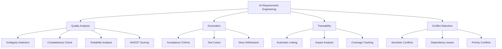

# AI-Powered Requirements Validation and Planning

## Purpose

Demonstrate how AI and NLP can transform requirements engineering by automatically validating requirements quality, detecting ambiguity and conflicts, generating acceptance criteria, and maintaining traceability throughout the development lifecycle.

## Context

Poor requirements are a leading cause of software defects. Studies show that 40-60% of defects originate from requirements issues, and fixing them post-deployment costs 10-100x more than catching them early. AI can analyze requirements at scale, detect quality issues instantly, and maintain traceability automatically - preventing defects before code is even written.

## Prerequisites

- Understanding of [Requirements Engineering](../01-requirements/README.md) (if available)
- Familiarity with [AI Fundamentals](ai-fundamentals.md)
- Knowledge of [INVEST Criteria](../02-agile-planning/invest-criteria.md)
- Basic Python programming skills
- Access to LLM API (OpenAI, Anthropic) or local models

## AI Capabilities in Requirements Engineering



## Requirements Quality Challenges

### Traditional Problems

```yaml
common_requirements_issues:
  ambiguity:
    problem: "Vague or unclear language"
    example: "The system should be fast"
    impact: "Different interpretations, wrong implementation"

  incompleteness:
    problem: "Missing critical information"
    example: "User can login" (no error handling, security, timeout)
    impact: "Gaps discovered late, rework needed"

  inconsistency:
    problem: "Contradictory requirements"
    example: "Must complete in <1s" vs "Must query 3 databases"
    impact: "Impossible requirements, failed delivery"

  untestability:
    problem: "Cannot verify success"
    example: "User experience should be pleasant"
    impact: "No objective acceptance criteria"

  poor_traceability:
    problem: "Lost connections between artifacts"
    example: "Which tests cover requirement R-123?"
    impact: "Unknown coverage, regression risks"

manual_review_limitations:
  speed: "5-10 requirements per hour"
  consistency: "Reviewer bias and fatigue"
  coverage: "Easy to miss subtle issues"
  scalability: "Doesn't scale to 100s of requirements"
```

### AI Solution Benefits

```yaml
ai_advantages:
  speed:
    manual: '5-10 requirements/hour'
    ai: '100s requirements/second'
    improvement: '100-1000x faster'

  consistency:
    manual: 'Varies by reviewer, time, mood'
    ai: 'Same analysis every time'
    improvement: '100% consistent'

  coverage:
    manual: 'Spot-checks, samples'
    ai: 'Analyzes every requirement'
    improvement: '100% coverage'

  depth:
    manual: 'Limited to human knowledge'
    ai: 'Can analyze against 1000s of patterns'
    improvement: 'Comprehensive analysis'
```

## Requirements Validation with NLP

### Ambiguity Detection

Ambiguous language leads to different interpretations and defects. AI can detect ambiguous words, unclear references, and vague quantifiers.

**Common Ambiguity Patterns:**

```python
# ambiguity_detector.py

import spacy
from typing import List, Dict
import re

class AmbiguityDetector:
    """Detect ambiguous language in requirements using NLP"""

    def __init__(self):
        self.nlp = spacy.load("en_core_web_sm")

        # Ambiguous words to flag
        self.ambiguous_terms = {
            'vague_quantifiers': [
                'some', 'several', 'many', 'few', 'often', 'rarely',
                'normally', 'usually', 'frequently', 'occasionally',
                'appropriate', 'adequate', 'sufficient', 'reasonable'
            ],
            'weak_verbs': [
                'should', 'might', 'could', 'may', 'can',
                'support', 'handle', 'process', 'manage'
            ],
            'subjective_terms': [
                'fast', 'slow', 'quick', 'easy', 'simple', 'complex',
                'user-friendly', 'intuitive', 'efficient', 'robust',
                'flexible', 'scalable', 'reliable', 'secure'
            ],
            'incomplete_conditionals': [
                'if needed', 'as appropriate', 'if applicable',
                'when necessary', 'as required'
            ]
        }

    def analyze_requirement(self, requirement: str) -> Dict:
        """Analyze a requirement for ambiguity"""
        doc = self.nlp(requirement)

        issues = []
        severity_score = 0

        # Check for ambiguous terms
        for category, terms in self.ambiguous_terms.items():
            found_terms = []
            for token in doc:
                if token.text.lower() in terms:
                    found_terms.append(token.text)
                    severity_score += 1

            if found_terms:
                issues.append({
                    'type': 'ambiguous_terms',
                    'category': category,
                    'terms': found_terms,
                    'severity': 'HIGH' if category in ['vague_quantifiers', 'incomplete_conditionals'] else 'MEDIUM',
                    'suggestion': self._get_suggestion(category, found_terms)
                })

        # Check for unclear references (pronouns without clear antecedents)
        unclear_refs = self._check_unclear_references(doc)
        if unclear_refs:
            issues.append(unclear_refs)
            severity_score += len(unclear_refs.get('pronouns', []))

        # Check for passive voice (can hide actor)
        passive_voice = self._check_passive_voice(doc)
        if passive_voice:
            issues.append(passive_voice)
            severity_score += 1

        # Check for multiple interpretations
        multiple_interpretations = self._check_multiple_interpretations(requirement)
        if multiple_interpretations:
            issues.append(multiple_interpretations)
            severity_score += 2

        return {
            'requirement': requirement,
            'ambiguity_score': min(100, severity_score * 10),  # 0-100 scale
            'quality_level': self._get_quality_level(severity_score),
            'issues': issues,
            'is_acceptable': severity_score <= 3
        }

    def _check_unclear_references(self, doc) -> Dict:
        """Check for pronouns without clear antecedents"""
        pronouns = []
        for token in doc:
            if token.pos_ == 'PRON' and token.text.lower() in ['it', 'this', 'that', 'they', 'them']:
                # Check if antecedent is clear (simplified check)
                if not self._has_clear_antecedent(token, doc):
                    pronouns.append({
                        'pronoun': token.text,
                        'position': token.i
                    })

        if pronouns:
            return {
                'type': 'unclear_reference',
                'severity': 'HIGH',
                'pronouns': pronouns,
                'suggestion': 'Replace pronouns with specific nouns for clarity'
            }
        return None

    def _has_clear_antecedent(self, pronoun_token, doc) -> bool:
        """Check if pronoun has clear antecedent in previous tokens"""
        # Look back up to 10 tokens for a noun
        start_idx = max(0, pronoun_token.i - 10)
        for token in doc[start_idx:pronoun_token.i]:
            if token.pos_ == 'NOUN' and token.dep_ in ['nsubj', 'dobj', 'pobj']:
                return True
        return False

    def _check_passive_voice(self, doc) -> Dict:
        """Detect passive voice which can hide the actor"""
        passive_constructions = []
        for token in doc:
            # Passive voice: auxiliary verb + past participle
            if token.dep_ == 'auxpass':
                passive_constructions.append({
                    'text': ' '.join([t.text for t in token.head.subtree]),
                    'position': token.i
                })

        if passive_constructions:
            return {
                'type': 'passive_voice',
                'severity': 'MEDIUM',
                'constructions': passive_constructions,
                'suggestion': 'Use active voice to clarify who performs the action'
            }
        return None

    def _check_multiple_interpretations(self, requirement: str) -> Dict:
        """Check for syntax that allows multiple interpretations"""
        issues = []

        # Check for ambiguous "or" (inclusive vs exclusive)
        or_pattern = r'\bor\b'
        if re.search(or_pattern, requirement, re.IGNORECASE):
            issues.append({
                'pattern': '"or" statement',
                'example': 'Does "A or B" mean exactly one, or one or both?'
            })

        # Check for ambiguous "and/or"
        if 'and/or' in requirement.lower():
            issues.append({
                'pattern': '"and/or"',
                'example': 'Use specific logic: "A and B", "A or B", or "A, B, or both"'
            })

        # Check for ambiguous negations
        if re.search(r'\b(not|no|none)\b.*\b(not|no|none)\b', requirement, re.IGNORECASE):
            issues.append({
                'pattern': 'double negative',
                'example': 'Double negatives are confusing - rephrase positively'
            })

        if issues:
            return {
                'type': 'multiple_interpretations',
                'severity': 'HIGH',
                'issues': issues,
                'suggestion': 'Rephrase to have single clear interpretation'
            }
        return None

    def _get_suggestion(self, category: str, terms: List[str]) -> str:
        """Get improvement suggestion based on ambiguity type"""
        suggestions = {
            'vague_quantifiers': f'Replace "{", ".join(terms)}" with specific numbers or ranges',
            'weak_verbs': f'Replace "{", ".join(terms)}" with "shall" or "will" for requirements',
            'subjective_terms': f'Replace "{", ".join(terms)}" with measurable criteria',
            'incomplete_conditionals': f'Specify exact conditions for "{", ".join(terms)}"'
        }
        return suggestions.get(category, 'Make requirement more specific')

    def _get_quality_level(self, severity_score: int) -> str:
        """Determine quality level based on severity"""
        if severity_score == 0:
            return 'EXCELLENT'
        elif severity_score <= 2:
            return 'GOOD'
        elif severity_score <= 4:
            return 'FAIR'
        else:
            return 'POOR'


# Example Usage
detector = AmbiguityDetector()

# Example requirements
requirements = [
    "The system should respond quickly to user requests",
    "Users must be able to login within 2 seconds using email and password",
    "The dashboard shall display relevant information as needed",
    "When a user clicks the Submit button, the form is validated and saved to the database"
]

for req in requirements:
    result = detector.analyze_requirement(req)
    print(f"\nRequirement: {req}")
    print(f"Ambiguity Score: {result['ambiguity_score']}/100")
    print(f"Quality Level: {result['quality_level']}")
    print(f"Acceptable: {'✅' if result['is_acceptable'] else '❌'}")

    if result['issues']:
        print("Issues found:")
        for issue in result['issues']:
            print(f"  - [{issue['severity']}] {issue['type']}: {issue['suggestion']}")
```

**Example Output:**

```
Requirement: The system should respond quickly to user requests
Ambiguity Score: 40/100
Quality Level: POOR
Acceptable: ❌
Issues found:
  - [MEDIUM] ambiguous_terms: Replace "should" with "shall" or "will" for requirements
  - [MEDIUM] ambiguous_terms: Replace "quickly" with measurable criteria

Requirement: Users must be able to login within 2 seconds using email and password
Ambiguity Score: 0/100
Quality Level: EXCELLENT
Acceptable: ✅

Requirement: The dashboard shall display relevant information as needed
Ambiguity Score: 30/100
Quality Level: FAIR
Acceptable: ❌
Issues found:
  - [HIGH] ambiguous_terms: Replace "as needed" with specific conditions
  - [HIGH] unclear_reference: Replace pronouns with specific nouns for clarity
```

### Completeness Analysis

**Checking if requirements contain all necessary information:**

```python
# completeness_analyzer.py

from openai import OpenAI
from typing import Dict, List
import json

class CompletenessAnalyzer:
    """Analyze requirements for completeness using LLM"""

    def __init__(self, api_key: str):
        self.client = OpenAI(api_key=api_key)

    def analyze_completeness(self, requirement: str, context: str = "") -> Dict:
        """Analyze if requirement is complete"""

        prompt = f"""Analyze the following requirement for completeness.

Requirement: "{requirement}"

{f"Context: {context}" if context else ""}

Check if the requirement includes:
1. **Actor**: Who performs the action?
2. **Action**: What needs to be done?
3. **Object**: What is acted upon?
4. **Outcome**: What is the expected result?
5. **Preconditions**: What must be true before?
6. **Success Criteria**: How to verify completion?
7. **Error Handling**: What happens when things go wrong?
8. **Performance**: Any timing or performance requirements?
9. **Security**: Any security or permission requirements?
10. **Edge Cases**: Boundary conditions addressed?

For each aspect:
- Rate as PRESENT, PARTIAL, or MISSING
- Provide specific feedback
- Suggest improvements

Output as JSON:
{{
  "completeness_score": 0-100,
  "aspects": [
    {{
      "name": "actor",
      "status": "PRESENT|PARTIAL|MISSING",
      "feedback": "explanation",
      "suggestion": "how to improve"
    }},
    ...
  ],
  "overall_assessment": "summary",
  "missing_critical": ["list of critical missing elements"],
  "suggested_revision": "improved version of requirement"
}}"""

        response = self.client.chat.completions.create(
            model="gpt-4-turbo-preview",
            messages=[
                {
                    "role": "system",
                    "content": "You are an expert requirements engineer. Analyze requirements critically for completeness."
                },
                {
                    "role": "user",
                    "content": prompt
                }
            ],
            temperature=0.1,  # Low temperature for consistent analysis
            response_format={"type": "json_object"}
        )

        analysis = json.loads(response.choices[0].message.content)

        # Add pass/fail determination
        analysis['is_complete'] = (
            analysis['completeness_score'] >= 70 and
            len(analysis.get('missing_critical', [])) == 0
        )

        return analysis

    def batch_analyze(self, requirements: List[str]) -> List[Dict]:
        """Analyze multiple requirements"""
        results = []
        for req in requirements:
            result = self.analyze_completeness(req)
            results.append({
                'requirement': req,
                'analysis': result
            })
        return results


# Example usage
analyzer = CompletenessAnalyzer(api_key="your-api-key")

requirement = "User can search for products"

analysis = analyzer.analyze_completeness(requirement)

print(f"Requirement: {requirement}")
print(f"Completeness Score: {analysis['completeness_score']}/100")
print(f"Is Complete: {'✅' if analysis['is_complete'] else '❌'}")
print(f"\nOverall Assessment: {analysis['overall_assessment']}")

if analysis['missing_critical']:
    print(f"\n❌ Critical Missing Elements:")
    for item in analysis['missing_critical']:
        print(f"   - {item}")

print(f"\n💡 Suggested Revision:")
print(f"   {analysis['suggested_revision']}")
```

**Example Output:**

```json
{
  "completeness_score": 35,
  "aspects": [
    {
      "name": "actor",
      "status": "PRESENT",
      "feedback": "Actor is clearly identified as 'User'",
      "suggestion": "Consider if different user roles have different search capabilities"
    },
    {
      "name": "action",
      "status": "PRESENT",
      "feedback": "Action 'search' is clear",
      "suggestion": "Specify search method (keyword, filters, etc.)"
    },
    {
      "name": "outcome",
      "status": "MISSING",
      "feedback": "No specification of what search returns",
      "suggestion": "Add: 'and see relevant results ranked by relevance'"
    },
    {
      "name": "success_criteria",
      "status": "MISSING",
      "feedback": "No way to verify if search works correctly",
      "suggestion": "Add: 'Results appear within 1 second, showing at least matching products'"
    },
    {
      "name": "error_handling",
      "status": "MISSING",
      "feedback": "No handling of no results, errors, or invalid input",
      "suggestion": "Add: 'Show helpful message if no results found'"
    },
    {
      "name": "performance",
      "status": "MISSING",
      "feedback": "No performance requirements specified",
      "suggestion": "Add: 'Search completes within 1 second for 95% of queries'"
    }
  ],
  "overall_assessment": "Requirement is too high-level and missing critical details needed for implementation and testing",
  "missing_critical": [
    "Success criteria",
    "Expected outcome",
    "Error handling",
    "Performance requirements"
  ],
  "suggested_revision": "As a user, I want to search for products by keyword or category so that I can find items I'm interested in. The system shall return relevant results ranked by relevance within 1 second, displaying product name, price, and image. If no results are found, show a helpful message suggesting alternative searches."
}
```

### Testability Analysis

```python
# testability_checker.py

import re
from typing import Dict, List

class TestabilityChecker:
    """Check if requirements are testable"""

    def __init__(self):
        self.untestable_terms = [
            'user-friendly', 'intuitive', 'easy to use', 'simple',
            'pleasant', 'nice', 'good', 'better', 'improved',
            'efficient', 'robust', 'flexible', 'maintainable',
            'modular', 'scalable', 'reliable', 'secure'
        ]

    def check_testability(self, requirement: str) -> Dict:
        """Analyze if a requirement is testable"""

        issues = []
        suggestions = []

        # Check for measurable criteria
        has_numbers = bool(re.search(r'\d+', requirement))
        has_comparison = bool(re.search(r'(less than|greater than|at least|at most|within|between)', requirement, re.IGNORECASE))
        has_specific_value = has_numbers or has_comparison

        if not has_specific_value:
            issues.append({
                'type': 'no_measurable_criteria',
                'severity': 'HIGH',
                'description': 'No specific numbers or measurable criteria'
            })
            suggestions.append('Add specific metrics: time (seconds), count (number), percentage, size (MB), etc.')

        # Check for subjective terms
        found_subjective = []
        for term in self.untestable_terms:
            if term in requirement.lower():
                found_subjective.append(term)

        if found_subjective:
            issues.append({
                'type': 'subjective_terms',
                'severity': 'HIGH',
                'terms': found_subjective,
                'description': f'Contains subjective terms: {", ".join(found_subjective)}'
            })
            suggestions.append(f'Replace subjective terms with objective criteria')

        # Check for observable behavior
        has_action_verb = bool(re.search(r'\b(display|show|return|send|save|update|delete|create|validate|calculate|notify)\b', requirement, re.IGNORECASE))

        if not has_action_verb:
            issues.append({
                'type': 'no_observable_action',
                'severity': 'MEDIUM',
                'description': 'No clear observable action to test'
            })
            suggestions.append('Specify observable behavior: what the system displays, returns, or does')

        # Check for success criteria
        has_success_criteria = bool(re.search(r'(shall|must|will).*\b(then|and|should see|should receive|should be)\b', requirement, re.IGNORECASE))

        if not has_success_criteria:
            issues.append({
                'type': 'no_success_criteria',
                'severity': 'HIGH',
                'description': 'No clear success criteria defined'
            })
            suggestions.append('Add Given-When-Then format or clear acceptance criteria')

        # Calculate testability score
        max_score = 100
        deductions = {
            'no_measurable_criteria': 30,
            'subjective_terms': 25,
            'no_observable_action': 20,
            'no_success_criteria': 25
        }

        score = max_score
        for issue in issues:
            score -= deductions.get(issue['type'], 10)

        score = max(0, score)

        return {
            'requirement': requirement,
            'testability_score': score,
            'is_testable': score >= 70 and not any(i['severity'] == 'HIGH' for i in issues),
            'issues': issues,
            'suggestions': suggestions,
            'test_strategy': self._suggest_test_strategy(requirement, issues)
        }

    def _suggest_test_strategy(self, requirement: str, issues: List[Dict]) -> str:
        """Suggest how to make requirement testable"""

        if not issues:
            return "Requirement appears testable. Create test cases covering happy path, edge cases, and error conditions."

        strategies = []

        for issue in issues:
            if issue['type'] == 'no_measurable_criteria':
                strategies.append("Define specific metrics (e.g., '<2 seconds', 'at least 10 items', '95% accuracy')")
            elif issue['type'] == 'subjective_terms':
                strategies.append("Replace subjective terms with measurable alternatives (e.g., 'intuitive' → 'user completes task in <5 clicks')")
            elif issue['type'] == 'no_observable_action':
                strategies.append("Specify what the system should display, return, or change")
            elif issue['type'] == 'no_success_criteria':
                strategies.append("Add acceptance criteria using Given-When-Then format")

        return " | ".join(strategies)


# Example usage
checker = TestabilityChecker()

test_requirements = [
    "The system should be user-friendly",
    "User login must complete within 2 seconds",
    "When user submits invalid email, system displays error message 'Invalid email format'",
    "The application should handle errors gracefully"
]

print("Testability Analysis\n" + "="*80)

for req in test_requirements:
    result = checker.check_testability(req)

    print(f"\nRequirement: {req}")
    print(f"Testability Score: {result['testability_score']}/100")
    print(f"Is Testable: {'✅' if result['is_testable'] else '❌'}")

    if result['issues']:
        print("\nIssues:")
        for issue in result['issues']:
            print(f"  [{issue['severity']}] {issue['description']}")

    if result['suggestions']:
        print("\nSuggestions:")
        for suggestion in result['suggestions']:
            print(f"  💡 {suggestion}")

    if result['test_strategy']:
        print(f"\nTest Strategy: {result['test_strategy']}")
    print("-" * 80)
```

## User Story Quality Scoring

### INVEST Criteria Scoring with ML

```python
# invest_scorer.py

from openai import OpenAI
from typing import Dict
import json

class INVESTScorer:
    """Score user stories against INVEST criteria using AI"""

    def __init__(self, api_key: str):
        self.client = OpenAI(api_key=api_key)

        self.invest_criteria = {
            'Independent': {
                'weight': 20,
                'description': 'Story can be developed and delivered independently',
                'questions': [
                    'Can this story be developed without waiting for other stories?',
                    'Are there hard dependencies on other stories?',
                    'Can this story be delivered in any order?'
                ]
            },
            'Negotiable': {
                'weight': 15,
                'description': 'Details can be discussed and adjusted',
                'questions': [
                    'Is the story open to discussion?',
                    'Are implementation details left flexible?',
                    'Is the story a conversation starter, not a contract?'
                ]
            },
            'Valuable': {
                'weight': 25,
                'description': 'Delivers clear value to users or business',
                'questions': [
                    'Is the value to users or business clear?',
                    'Can we measure the benefit?',
                    'Would stakeholders agree this is valuable?'
                ]
            },
            'Estimable': {
                'weight': 15,
                'description': 'Team can estimate the effort required',
                'questions': [
                    'Is the story clear enough to estimate?',
                    'Does the team have the knowledge to estimate?',
                    'Is uncertainty low enough for estimation?'
                ]
            },
            'Small': {
                'weight': 15,
                'description': 'Can be completed in a single sprint',
                'questions': [
                    'Can this be done in 1-3 days?',
                    'Is the scope limited and focused?',
                    'Can it be demonstrated as working?'
                ]
            },
            'Testable': {
                'weight': 10,
                'description': 'Has clear acceptance criteria',
                'questions': [
                    'Are acceptance criteria defined?',
                    'Can we objectively verify completion?',
                    'Are test scenarios clear?'
                ]
            }
        }

    def score_user_story(self, user_story: str, acceptance_criteria: str = "") -> Dict:
        """Score a user story against INVEST criteria"""

        prompt = f"""You are an expert Agile coach. Score this user story against the INVEST criteria.

User Story:
{user_story}

{f"Acceptance Criteria:\n{acceptance_criteria}" if acceptance_criteria else ""}

For each INVEST criterion, provide:
1. Score (0-100)
2. Rationale for the score
3. Specific issues found
4. Suggestions for improvement

INVEST Criteria:
- **Independent**: Can be developed without dependencies
- **Negotiable**: Details are flexible and discussable
- **Valuable**: Delivers clear user/business value
- **Estimable**: Team can estimate the effort
- **Small**: Completable in 1 sprint (1-3 days)
- **Testable**: Has clear acceptance criteria

Output as JSON:
{{
  "scores": {{
    "independent": {{"score": 0-100, "rationale": "...", "issues": [...], "suggestions": [...]}},
    "negotiable": {{"score": 0-100, "rationale": "...", "issues": [...], "suggestions": [...]}},
    "valuable": {{"score": 0-100, "rationale": "...", "issues": [...], "suggestions": [...]}},
    "estimable": {{"score": 0-100, "rationale": "...", "issues": [...], "suggestions": [...]}},
    "small": {{"score": 0-100, "rationale": "...", "issues": [...], "suggestions": [...]}},
    "testable": {{"score": 0-100, "rationale": "...", "issues": [...], "suggestions": [...]}},
  }},
  "weighted_average": 0-100,
  "quality_level": "EXCELLENT|GOOD|FAIR|POOR",
  "ready_for_sprint": true/false,
  "critical_issues": ["list of issues that must be addressed"],
  "improved_version": "rewritten story if improvements needed"
}}"""

        response = self.client.chat.completions.create(
            model="gpt-4-turbo-preview",
            messages=[
                {
                    "role": "system",
                    "content": "You are an expert Agile coach specializing in user story quality."
                },
                {
                    "role": "user",
                    "content": prompt
                }
            ],
            temperature=0.1,
            response_format={"type": "json_object"}
        )

        result = json.loads(response.choices[0].message.content)

        # Calculate weighted score
        weighted_score = 0
        for criterion, weight in [(k, v['weight']) for k, v in self.invest_criteria.items()]:
            criterion_key = criterion.lower()
            if criterion_key in result['scores']:
                score = result['scores'][criterion_key]['score']
                weighted_score += (score * weight / 100)

        result['weighted_score'] = round(weighted_score, 1)
        result['user_story'] = user_story

        return result

    def generate_report(self, result: Dict) -> str:
        """Generate human-readable report"""

        report = f"""
{'='*80}
USER STORY INVEST ANALYSIS
{'='*80}

Story: {result['user_story']}

Overall Score: {result['weighted_score']}/100 ({result['quality_level']})
Ready for Sprint: {'✅ YES' if result['ready_for_sprint'] else '❌ NO'}

{'='*80}
INVEST SCORES
{'='*80}
"""

        for criterion, data in result['scores'].items():
            report += f"\n{criterion.upper()}: {data['score']}/100"
            report += f"\n  Rationale: {data['rationale']}"

            if data['issues']:
                report += "\n  Issues:"
                for issue in data['issues']:
                    report += f"\n    - {issue}"

            if data['suggestions']:
                report += "\n  Suggestions:"
                for suggestion in data['suggestions']:
                    report += f"\n    💡 {suggestion}"
            report += "\n"

        if result.get('critical_issues'):
            report += f"\n{'='*80}\n❌ CRITICAL ISSUES\n{'='*80}\n"
            for issue in result['critical_issues']:
                report += f"  - {issue}\n"

        if result.get('improved_version'):
            report += f"\n{'='*80}\n💡 SUGGESTED IMPROVEMENT\n{'='*80}\n"
            report += f"{result['improved_version']}\n"

        return report


# Example usage
scorer = INVESTScorer(api_key="your-api-key")

# Example 1: Poor story
poor_story = "The system should be faster"

result = scorer.score_user_story(poor_story)
print(scorer.generate_report(result))

# Example 2: Good story
good_story = """As a registered user, I want to reset my password via email
so that I can regain access to my account if I forget my password."""

acceptance_criteria = """
- When user clicks "Forgot Password", they are prompted for email
- System sends password reset email within 2 minutes
- Email contains a unique token valid for 1 hour
- User can set new password meeting security requirements (8+ chars, 1 uppercase, 1 number)
- After successful reset, user is redirected to login page
- Failed attempts are logged for security monitoring
"""

result = scorer.score_user_story(good_story, acceptance_criteria)
print(scorer.generate_report(result))
```

## Automated Acceptance Criteria Generation

```python
# acceptance_criteria_generator.py

from openai import OpenAI
from typing import List, Dict

class AcceptanceCriteriaGenerator:
    """Generate acceptance criteria from user stories"""

    def __init__(self, api_key: str):
        self.client = OpenAI(api_key=api_key)

    def generate_criteria(self, user_story: str, context: str = "") -> Dict:
        """Generate comprehensive acceptance criteria"""

        prompt = f"""You are an expert QA engineer and business analyst. Generate comprehensive acceptance criteria for this user story.

User Story:
{user_story}

{f"Additional Context:\n{context}" if context else ""}

Generate acceptance criteria that cover:
1. **Happy Path**: Normal successful flow
2. **Alternative Paths**: Valid variations
3. **Edge Cases**: Boundary conditions
4. **Error Handling**: What happens when things go wrong
5. **Non-Functional**: Performance, security, accessibility
6. **Data Validation**: Input validation rules

Format each criterion using **Given-When-Then** (Gherkin) format.

Output as JSON:
{{
  "acceptance_criteria": [
    {{
      "scenario": "descriptive scenario name",
      "type": "happy_path|alternative_path|edge_case|error_handling|non_functional",
      "priority": "must_have|should_have|nice_to_have",
      "given": ["preconditions"],
      "when": ["actions"],
      "then": ["expected_results"],
      "notes": "additional context if needed"
    }},
    ...
  ],
  "test_data_needed": ["list of test data requirements"],
  "dependencies": ["external dependencies or prerequisites"],
  "estimated_test_cases": number
}}"""

        response = self.client.chat.completions.create(
            model="gpt-4-turbo-preview",
            messages=[
                {
                    "role": "system",
                    "content": "You are an expert at writing detailed, testable acceptance criteria."
                },
                {
                    "role": "user",
                    "content": prompt
                }
            ],
            temperature=0.2,
            response_format={"type": "json_object"}
        )

        return json.loads(response.choices[0].message.content)

    def format_as_gherkin(self, criteria: Dict) -> str:
        """Format acceptance criteria as Gherkin feature file"""

        feature = f"""Feature: {criteria.get('feature_name', 'User Story')}

"""

        for criterion in criteria['acceptance_criteria']:
            feature += f"  Scenario: {criterion['scenario']}\n"

            for precondition in criterion['given']:
                feature += f"    Given {precondition}\n"

            for action in criterion['when']:
                feature += f"    When {action}\n"

            for result in criterion['then']:
                feature += f"    Then {result}\n"

            if criterion.get('notes'):
                feature += f"    # Note: {criterion['notes']}\n"

            feature += "\n"

        return feature


# Example usage
generator = AcceptanceCriteriaGenerator(api_key="your-api-key")

user_story = """As a customer, I want to search for products by name or category
so that I can quickly find items I want to purchase."""

context = """
- Product catalog has 10,000+ items
- Search should work on mobile and desktop
- Categories include: Electronics, Clothing, Home, Books, Toys
- Users may or may not be logged in
"""

criteria = generator.generate_criteria(user_story, context)

# Print in Gherkin format
print(generator.format_as_gherkin(criteria))

# Print summary
print(f"\nTest Data Needed:")
for data in criteria['test_data_needed']:
    print(f"  - {data}")

print(f"\nEstimated Test Cases: {criteria['estimated_test_cases']}")
```

**Example Output:**

```gherkin
Feature: Product Search

  Scenario: Search by product name returns relevant results
    Given I am on the product catalog page
    And the catalog contains 10,000+ products
    When I enter "laptop" in the search box
    And I click the search button
    Then I see a list of products containing "laptop" in the name
    And results are ranked by relevance
    And results appear within 1 second

  Scenario: Search by category filters correctly
    Given I am on the product catalog page
    When I select "Electronics" from the category dropdown
    And I click search
    Then I see only products in the Electronics category
    And the category "Electronics" is highlighted as active

  Scenario: Search with no results shows helpful message
    Given I am on the product catalog page
    When I search for "xyznonexistent"
    Then I see the message "No products found"
    And I see suggestions for alternative searches
    And I see links to popular categories

  Scenario: Empty search shows validation message
    Given I am on the product catalog page
    When I click search with empty search box
    Then I see an inline error "Please enter a search term"
    And the search box is highlighted
    And no search is performed

  Scenario: Search performance meets requirements
    Given I am on the product catalog page
    When I perform any search
    Then results appear within 1 second for 95% of searches
    And the page remains responsive during search
    # Note: Performance test required

  Scenario: Search works for non-logged-in users
    Given I am not logged in
    And I am on the product catalog page
    When I search for "phone"
    Then I see search results without being prompted to login
    And I can view product details

Test Data Needed:
  - Sample products across all categories
  - Products with various name patterns (short, long, special characters)
  - Edge case search terms (very long, special characters, SQL injection attempts)
  - Known products for positive tests
  - Non-existent terms for negative tests
  - Performance test data: 10,000+ products

Estimated Test Cases: 12
```

## Requirements Traceability Automation

### Using Embeddings for Automatic Linking

```python
# traceability_manager.py

from openai import OpenAI
from sentence_transformers import SentenceTransformer
import numpy as np
from typing import List, Dict, Tuple
from sklearn.metrics.pairwise import cosine_similarity

class TraceabilityManager:
    """Automatically maintain requirements traceability using embeddings"""

    def __init__(self, api_key: str = None):
        # Use sentence-transformers for free local embeddings
        self.model = SentenceTransformer('all-MiniLM-L6-v2')

        # Or use OpenAI embeddings (paid but more accurate)
        self.use_openai = api_key is not None
        if self.use_openai:
            self.client = OpenAI(api_key=api_key)

        self.artifacts = {
            'requirements': [],
            'user_stories': [],
            'test_cases': [],
            'code_modules': []
        }

        self.embeddings = {
            'requirements': [],
            'user_stories': [],
            'test_cases': [],
            'code_modules': []
        }

    def add_artifact(self, artifact_type: str, artifact_id: str, content: str, metadata: Dict = None):
        """Add an artifact and generate its embedding"""

        artifact = {
            'id': artifact_id,
            'content': content,
            'metadata': metadata or {}
        }

        self.artifacts[artifact_type].append(artifact)

        # Generate embedding
        if self.use_openai:
            embedding = self._get_openai_embedding(content)
        else:
            embedding = self._get_local_embedding(content)

        self.embeddings[artifact_type].append(embedding)

    def find_related_artifacts(
        self,
        source_type: str,
        source_id: str,
        target_type: str,
        threshold: float = 0.7,
        top_k: int = 5
    ) -> List[Tuple[str, float, str]]:
        """Find related artifacts using semantic similarity"""

        # Find source artifact
        source_artifact = next(
            (a for a in self.artifacts[source_type] if a['id'] == source_id),
            None
        )

        if not source_artifact:
            return []

        # Get source embedding
        source_idx = [a['id'] for a in self.artifacts[source_type]].index(source_id)
        source_embedding = self.embeddings[source_type][source_idx]

        # Calculate similarities with target artifacts
        target_embeddings = np.array(self.embeddings[target_type])

        if len(target_embeddings) == 0:
            return []

        # Reshape for sklearn
        source_embedding = np.array(source_embedding).reshape(1, -1)

        similarities = cosine_similarity(source_embedding, target_embeddings)[0]

        # Get top matches above threshold
        matches = []
        for idx, similarity in enumerate(similarities):
            if similarity >= threshold:
                artifact = self.artifacts[target_type][idx]
                matches.append((
                    artifact['id'],
                    float(similarity),
                    artifact['content']
                ))

        # Sort by similarity and return top_k
        matches.sort(key=lambda x: x[1], reverse=True)
        return matches[:top_k]

    def generate_traceability_matrix(self) -> Dict:
        """Generate complete traceability matrix"""

        matrix = {}

        # For each requirement, find related artifacts
        for req in self.artifacts['requirements']:
            req_id = req['id']
            matrix[req_id] = {
                'requirement': req['content'],
                'user_stories': self.find_related_artifacts('requirements', req_id, 'user_stories'),
                'test_cases': self.find_related_artifacts('requirements', req_id, 'test_cases'),
                'code_modules': self.find_related_artifacts('requirements', req_id, 'code_modules')
            }

        return matrix

    def check_coverage(self) -> Dict:
        """Check requirements coverage"""

        coverage = {
            'total_requirements': len(self.artifacts['requirements']),
            'covered_by_stories': 0,
            'covered_by_tests': 0,
            'covered_by_code': 0,
            'uncovered_requirements': []
        }

        for req in self.artifacts['requirements']:
            req_id = req['id']

            stories = self.find_related_artifacts('requirements', req_id, 'user_stories', threshold=0.7)
            tests = self.find_related_artifacts('requirements', req_id, 'test_cases', threshold=0.7)
            code = self.find_related_artifacts('requirements', req_id, 'code_modules', threshold=0.7)

            if stories:
                coverage['covered_by_stories'] += 1
            if tests:
                coverage['covered_by_tests'] += 1
            if code:
                coverage['covered_by_code'] += 1

            if not (stories or tests or code):
                coverage['uncovered_requirements'].append({
                    'id': req_id,
                    'content': req['content']
                })

        coverage['story_coverage_pct'] = (coverage['covered_by_stories'] / coverage['total_requirements'] * 100) if coverage['total_requirements'] > 0 else 0
        coverage['test_coverage_pct'] = (coverage['covered_by_tests'] / coverage['total_requirements'] * 100) if coverage['total_requirements'] > 0 else 0
        coverage['code_coverage_pct'] = (coverage['covered_by_code'] / coverage['total_requirements'] * 100) if coverage['total_requirements'] > 0 else 0

        return coverage

    def impact_analysis(self, artifact_type: str, artifact_id: str) -> Dict:
        """Analyze impact of changing an artifact"""

        impacted = {}

        # Find all artifacts related to this one
        for target_type in ['requirements', 'user_stories', 'test_cases', 'code_modules']:
            if target_type != artifact_type:
                related = self.find_related_artifacts(
                    artifact_type,
                    artifact_id,
                    target_type,
                    threshold=0.6
                )
                impacted[target_type] = related

        return {
            'artifact': {'type': artifact_type, 'id': artifact_id},
            'impacted_artifacts': impacted,
            'total_impacted': sum(len(v) for v in impacted.values())
        }

    def _get_openai_embedding(self, text: str) -> List[float]:
        """Get embedding from OpenAI"""
        response = self.client.embeddings.create(
            model="text-embedding-3-small",
            input=text
        )
        return response.data[0].embedding

    def _get_local_embedding(self, text: str) -> List[float]:
        """Get embedding from local model"""
        return self.model.encode(text).tolist()


# Example usage
manager = TraceabilityManager()  # Use local embeddings (free)

# Add requirements
manager.add_artifact('requirements', 'REQ-001',
    "User must be able to reset password via email within 2 minutes")

manager.add_artifact('requirements', 'REQ-002',
    "System shall log all authentication attempts for security monitoring")

# Add user stories
manager.add_artifact('user_stories', 'US-101',
    "As a user, I want to reset my password so I can regain access if I forget it")

manager.add_artifact('user_stories', 'US-102',
    "As a security admin, I want to view login attempt logs so I can detect suspicious activity")

# Add test cases
manager.add_artifact('test_cases', 'TC-501',
    "Test that password reset email is sent within 2 minutes when user requests reset")

manager.add_artifact('test_cases', 'TC-502',
    "Verify that failed login attempts are logged with timestamp and IP address")

# Add code modules
manager.add_artifact('code_modules', 'auth.py',
    "Authentication module handling login, logout, and password reset functionality")

# Find related artifacts
print("Finding artifacts related to REQ-001:")
related_stories = manager.find_related_artifacts('requirements', 'REQ-001', 'user_stories')
for story_id, similarity, content in related_stories:
    print(f"  {story_id} (similarity: {similarity:.2f})")
    print(f"    {content[:80]}...")

# Check coverage
print("\nCoverage Analysis:")
coverage = manager.check_coverage()
print(f"  Total Requirements: {coverage['total_requirements']}")
print(f"  Story Coverage: {coverage['story_coverage_pct']:.0f}%")
print(f"  Test Coverage: {coverage['test_coverage_pct']:.0f}%")
print(f"  Code Coverage: {coverage['code_coverage_pct']:.0f}%")

# Impact analysis
print("\nImpact Analysis for REQ-001:")
impact = manager.impact_analysis('requirements', 'REQ-001')
print(f"  Total Impacted Artifacts: {impact['total_impacted']}")
for artifact_type, artifacts in impact['impacted_artifacts'].items():
    if artifacts:
        print(f"  {artifact_type}:")
        for art_id, similarity, _ in artifacts:
            print(f"    - {art_id} (similarity: {similarity:.2f})")

# Generate traceability matrix
print("\nTraceability Matrix:")
matrix = manager.generate_traceability_matrix()
for req_id, links in matrix.items():
    print(f"\n{req_id}: {links['requirement'][:60]}...")
    print(f"  Linked Stories: {len(links['user_stories'])}")
    print(f"  Linked Tests: {len(links['test_cases'])}")
    print(f"  Linked Code: {len(links['code_modules'])}")
```

## Conflict Detection in Requirements

```python
# conflict_detector.py

from openai import OpenAI
from typing import List, Dict
import json

class RequirementsConflictDetector:
    """Detect conflicts and inconsistencies in requirements using AI"""

    def __init__(self, api_key: str):
        self.client = OpenAI(api_key=api_key)

    def detect_conflicts(self, requirements: List[Dict]) -> Dict:
        """Detect conflicts across multiple requirements"""

        # Format requirements for analysis
        req_text = "\n\n".join([
            f"[{req['id']}] {req['content']}"
            for req in requirements
        ])

        prompt = f"""You are an expert requirements analyst. Analyze these requirements for conflicts, contradictions, and inconsistencies.

Requirements:
{req_text}

Identify:
1. **Direct Conflicts**: Requirements that directly contradict each other
2. **Logical Inconsistencies**: Requirements that cannot both be true
3. **Priority Conflicts**: Requirements with incompatible priorities
4. **Performance Conflicts**: Requirements with conflicting performance demands
5. **Dependency Conflicts**: Circular or impossible dependencies
6. **Scope Conflicts**: Overlapping or conflicting scope

For each conflict:
- Identify the conflicting requirements (by ID)
- Explain the conflict
- Assess severity (CRITICAL, HIGH, MEDIUM, LOW)
- Suggest resolution

Output as JSON:
{{
  "conflicts": [
    {{
      "type": "conflict type",
      "severity": "CRITICAL|HIGH|MEDIUM|LOW",
      "requirement_ids": ["REQ-001", "REQ-002"],
      "description": "explanation of conflict",
      "impact": "what happens if not resolved",
      "resolution_options": [
        "option 1",
        "option 2"
      ]
    }},
    ...
  ],
  "summary": {{
    "total_conflicts": number,
    "critical": number,
    "high": number,
    "medium": number,
    "low": number,
    "requires_immediate_attention": true/false
  }}
}}"""

        response = self.client.chat.completions.create(
            model="gpt-4-turbo-preview",
            messages=[
                {
                    "role": "system",
                    "content": "You are an expert at identifying conflicts and inconsistencies in requirements."
                },
                {
                    "role": "user",
                    "content": prompt
                }
            ],
            temperature=0.1,
            response_format={"type": "json_object"}
        )

        return json.loads(response.choices[0].message.content)

    def check_semantic_duplicates(self, requirements: List[Dict], threshold: float = 0.85) -> List[Dict]:
        """Find requirements that are semantically duplicate"""

        from sentence_transformers import SentenceTransformer
        from sklearn.metrics.pairwise import cosine_similarity
        import numpy as np

        model = SentenceTransformer('all-MiniLM-L6-v2')

        # Generate embeddings
        texts = [req['content'] for req in requirements]
        embeddings = model.encode(texts)

        # Calculate similarities
        similarities = cosine_similarity(embeddings)

        duplicates = []

        # Find pairs with high similarity
        for i in range(len(requirements)):
            for j in range(i+1, len(requirements)):
                similarity = similarities[i][j]
                if similarity >= threshold:
                    duplicates.append({
                        'requirement_1': requirements[i]['id'],
                        'requirement_2': requirements[j]['id'],
                        'similarity': float(similarity),
                        'content_1': requirements[i]['content'],
                        'content_2': requirements[j]['content'],
                        'recommendation': 'Merge these requirements or clarify differences'
                    })

        return duplicates


# Example usage
detector = RequirementsConflictDetector(api_key="your-api-key")

requirements = [
    {
        'id': 'REQ-001',
        'content': 'System must respond to user requests within 1 second'
    },
    {
        'id': 'REQ-002',
        'content': 'System must query all 5 regional databases for each request'
    },
    {
        'id': 'REQ-003',
        'content': 'User authentication must be completed in under 500ms'
    },
    {
        'id': 'REQ-004',
        'content': 'All user sessions must timeout after 15 minutes of inactivity'
    },
    {
        'id': 'REQ-005',
        'content': 'Users must remain logged in indefinitely unless they explicitly logout'
    },
    {
        'id': 'REQ-006',
        'content': 'System shall support 10,000 concurrent users'
    },
    {
        'id': 'REQ-007',
        'content': 'Application must run on a single t2.micro EC2 instance'
    }
]

# Detect conflicts
conflicts = detector.detect_conflicts(requirements)

print("Requirements Conflict Analysis")
print("=" * 80)
print(f"\nTotal Conflicts Found: {conflicts['summary']['total_conflicts']}")
print(f"Critical: {conflicts['summary']['critical']}")
print(f"High: {conflicts['summary']['high']}")
print(f"Medium: {conflicts['summary']['medium']}")
print(f"Low: {conflicts['summary']['low']}")
print(f"\nImmediate Attention Required: {'⚠️  YES' if conflicts['summary']['requires_immediate_attention'] else '✅ NO'}")

print("\n" + "=" * 80)
print("CONFLICTS DETAILS")
print("=" * 80)

for conflict in conflicts['conflicts']:
    print(f"\n[{conflict['severity']}] {conflict['type'].upper()}")
    print(f"Requirements: {', '.join(conflict['requirement_ids'])}")
    print(f"Description: {conflict['description']}")
    print(f"Impact: {conflict['impact']}")
    print("Resolution Options:")
    for option in conflict['resolution_options']:
        print(f"  - {option}")

# Check for semantic duplicates
print("\n" + "=" * 80)
print("SEMANTIC DUPLICATES")
print("=" * 80)

duplicates = detector.check_semantic_duplicates(requirements, threshold=0.85)

if duplicates:
    for dup in duplicates:
        print(f"\n{dup['requirement_1']} ↔ {dup['requirement_2']}")
        print(f"Similarity: {dup['similarity']:.2%}")
        print(f"Recommendation: {dup['recommendation']}")
else:
    print("\n✅ No semantic duplicates found")
```

## Tools Ecosystem

### Commercial Tools with AI

```yaml
requirements_ai_tools:
  jama_connect:
    vendor: 'Jama Software'
    ai_features:
      - requirements_quality_analysis
      - duplicate_detection
      - impact_analysis
      - traceability_automation
    pricing: 'Enterprise (contact sales)'
    best_for: 'Large regulated projects (aerospace, medical)'
    integration: 'JIRA, Azure DevOps, IBM DOORS'
    url: 'https://www.jamasoftware.com'

  ibm_doors_next:
    vendor: 'IBM'
    ai_features:
      - ai_powered_reviews
      - requirements_reuse_suggestions
      - impact_analysis
      - quality_metrics
    pricing: 'Enterprise ($250+/user/month)'
    best_for: 'Complex systems engineering'
    integration: 'IBM Engineering Lifecycle Management suite'
    url: 'https://www.ibm.com/products/requirements-management'

  modern_requirements:
    vendor: 'Modern Requirements'
    ai_features:
      - automatic_diagram_generation
      - requirements_quality_scoring
      - coverage_analysis
      - test_generation
    pricing: '$50-150/user/month'
    best_for: 'Azure DevOps users'
    integration: 'Azure DevOps, TFS'
    url: 'https://www.modernrequirements.com'

  polarion:
    vendor: 'Siemens'
    ai_features:
      - quality_assistant
      - traceability_automation
      - compliance_checking
    pricing: 'Enterprise (contact sales)'
    best_for: 'Automotive, embedded systems'
    integration: 'JIRA, Git, Jenkins'
    url: 'https://polarion.plm.automation.siemens.com'

open_source_alternatives:
  doorstop:
    description: 'Requirements management using version control'
    ai_integration: 'Can integrate with custom AI scripts'
    language: 'Python'
    url: 'https://github.com/doorstop-dev/doorstop'

  reqif_studio:
    description: 'Eclipse-based requirements tool'
    ai_integration: 'Plugin architecture for AI extensions'
    language: 'Java'
    url: 'https://www.eclipse.org/rmf'

custom_solution_stack:
  llm_apis:
    - 'OpenAI GPT-4 (best quality)'
    - 'Anthropic Claude 3 (long context)'
    - 'Google Gemini Pro (cost-effective)'
    - 'Local Llama 3 (privacy)'

  nlp_libraries:
    - 'spaCy (fast NLP)'
    - 'NLTK (comprehensive)'
    - 'Hugging Face Transformers (state-of-art)'

  embeddings:
    - 'OpenAI text-embedding-3-small'
    - 'Sentence-Transformers (free, local)'
    - 'Cohere embed-english-v3'

  vector_databases:
    - 'Pinecone (managed, easy)'
    - 'Weaviate (open source)'
    - 'Chroma (embedded)'
    - 'Qdrant (high performance)'

  frameworks:
    - 'LangChain (application framework)'
    - 'LlamaIndex (data framework)'
    - 'Haystack (NLP pipelines)'
```

## Metrics to Track

```yaml
requirements_quality_metrics:
  quality_scores:
    ambiguity_score:
      description: 'Measure of unclear language'
      formula: 'ambiguous_terms / total_terms * 100'
      target: '< 5%'
      tracking: 'Per requirement, trend over time'

    completeness_score:
      description: 'Percentage of required elements present'
      formula: 'present_elements / total_required_elements * 100'
      target: '> 90%'
      tracking: 'Per requirement'

    testability_score:
      description: 'How testable requirements are'
      formula: 'testable_criteria / total_criteria * 100'
      target: '> 95%'
      tracking: 'Per requirement'

    invest_score:
      description: 'Weighted INVEST criteria score'
      formula: 'weighted_average_of_INVEST_criteria'
      target: '> 80/100'
      tracking: 'Per user story'

  coverage_metrics:
    requirements_coverage:
      description: 'Requirements linked to implementation'
      formula: 'linked_requirements / total_requirements * 100'
      target: '100%'
      tracking: 'Sprint, release'

    test_coverage:
      description: 'Requirements with test cases'
      formula: 'requirements_with_tests / total_requirements * 100'
      target: '100%'
      tracking: 'Sprint, release'

    traceability_coverage:
      description: 'Bidirectional trace links maintained'
      formula: 'traced_artifacts / total_artifacts * 100'
      target: '100%'
      tracking: 'Continuous'

  defect_prevention:
    requirements_defects_prevented:
      description: 'Defects caught in requirements phase'
      formula: 'issues_found_by_AI / total_requirements'
      target: 'Track trend'
      tracking: 'Sprint, release'

    rework_reduction:
      description: 'Less rework from bad requirements'
      formula: '(baseline_rework - current_rework) / baseline_rework * 100'
      target: '> 50% reduction'
      tracking: 'Quarter, year'

    defect_leakage:
      description: 'Requirements defects reaching production'
      formula: 'prod_defects_from_requirements / total_prod_defects * 100'
      target: '< 10%'
      tracking: 'Release'

  efficiency_metrics:
    review_time:
      description: 'Time to review requirements'
      before_ai: '4-8 hours per 10 requirements'
      with_ai: '1-2 hours per 10 requirements'
      target: '> 60% time savings'

    refinement_cycles:
      description: 'Iterations needed to finalize requirements'
      before_ai: '3-5 cycles'
      with_ai: '1-2 cycles'
      target: '< 2 cycles'

  cost_metrics:
    cost_of_quality:
      description: 'Cost to prevent requirements defects'
      formula: 'ai_tool_costs + review_time_costs'
      tracking: 'Monthly'

    cost_of_poor_quality:
      description: 'Cost of requirements defects'
      formula: 'rework_costs + delay_costs + defect_fix_costs'
      tracking: 'Monthly'

    roi:
      description: 'Return on investment'
      formula: '(cost_of_poor_quality_prevented - cost_of_quality) / cost_of_quality'
      target: '> 300%'
      tracking: 'Quarter'
```

## Cost-Benefit Analysis

### Investment Required

```yaml
implementation_costs:
  tools_and_software:
    llm_api_subscription:
      cost: '$100-500/month'
      provider: 'OpenAI, Anthropic, or similar'
      usage: 'Depends on requirements volume'

    requirements_tool:
      cost: '$0-150/user/month'
      options:
        - 'Free: Custom solution'
        - 'Mid: Modern Requirements ($50-150)'
        - 'Enterprise: Jama, IBM DOORS ($250+)'

    vector_database:
      cost: '$0-100/month'
      options:
        - 'Free: Chroma (local)'
        - 'Paid: Pinecone ($70+/month)'

  development_time:
    initial_setup:
      hours: 40-80
      cost: '$4,000-8,000'
      tasks:
        - 'AI tool integration'
        - 'Script development'
        - 'Process setup'

    training:
      hours: 16
      cost: '$1,600'
      participants: 'Entire team'

  ongoing_maintenance:
    monthly_hours: 8
    monthly_cost: '$800'
    tasks:
      - 'Model tuning'
      - 'Script updates'
      - 'Process refinement'

total_first_year_cost:
  one_time: '$5,600-9,600'
  recurring: '$2,400-7,200/year'
  total: '$8,000-16,800'
```

### Benefits and ROI

```yaml
quantifiable_benefits:
  time_savings:
    requirements_review:
      before: '40 hours/sprint (10 people × 4 hours)'
      after: '15 hours/sprint (10 people × 1.5 hours)'
      savings: '25 hours/sprint'
      annual_value: '$65,000 (at $50/hour × 52 sprints)'

    rework_reduction:
      before: '80 hours/sprint on requirements rework'
      after: '20 hours/sprint'
      savings: '60 hours/sprint'
      annual_value: '$156,000'

    defect_prevention:
      production_defects_prevented: 15
      cost_per_defect: '$5,000'
      annual_value: '$75,000'

  quality_improvements:
    faster_time_to_market:
      fewer_refinement_cycles: '2 weeks saved per release'
      releases_per_year: 4
      value: '$80,000 (opportunity cost)'

    customer_satisfaction:
      fewer_defects: '20% improvement'
      retention_improvement: '5%'
      value: '$50,000 (depends on customer base)'

total_annual_benefit: '$426,000'

roi_calculation:
  annual_cost: '$16,800 (high estimate)'
  annual_benefit: '$426,000'
  net_benefit: '$409,200'
  roi_percentage: '2,436%'
  payback_period: '2 weeks'

sensitivity_analysis:
  conservative_estimate:
    annual_benefit: '$150,000'
    roi: '793%'
    payback: '6 weeks'

  aggressive_estimate:
    annual_benefit: '$600,000'
    roi: '3,471%'
    payback: '1 week'
```

## Best Practices

### 1. Start with High-Impact, Low-Risk

```yaml
recommended_first_steps:
  week_1:
    - 'Run ambiguity detector on existing requirements'
    - 'Identify top 10 problematic requirements'
    - 'Manually validate AI findings'

  week_2:
    - 'Use AI to generate acceptance criteria for 5 user stories'
    - 'Compare with manually written criteria'
    - 'Refine prompts based on results'

  week_3:
    - 'Implement testability checker in PR process'
    - 'Gate: Stories must score >70 for sprint inclusion'
    - 'Track improvements'

  week_4:
    - 'Deploy INVEST scorer to backlog refinement'
    - 'Review scores in refinement meetings'
    - 'Use AI suggestions to improve stories'
```

### 2. Always Validate AI Outputs

```python
# validation_workflow.py

class RequirementsValidationWorkflow:
    """Human-in-the-loop validation for AI outputs"""

    def __init__(self):
        self.ai_analyzer = AmbiguityDetector()
        self.approval_threshold = 0.8

    def analyze_with_validation(self, requirement: str) -> Dict:
        """Analyze requirement with human validation step"""

        # Step 1: AI analysis
        ai_result = self.ai_analyzer.analyze_requirement(requirement)

        # Step 2: Determine if human review needed
        needs_review = (
            ai_result['ambiguity_score'] > 50 or
            any(issue['severity'] == 'HIGH' for issue in ai_result['issues'])
        )

        if needs_review:
            print(f"\n⚠️  AI flagged issues in requirement. Human review recommended.")
            print(f"Ambiguity Score: {ai_result['ambiguity_score']}/100")

            # Present issues to human
            for issue in ai_result['issues']:
                print(f"[{issue['severity']}] {issue['suggestion']}")

            # Get human validation
            human_agrees = input("\nDo you agree with AI assessment? (y/n): ").lower() == 'y'

            if human_agrees:
                action = input("Action: (f)ix requirement, (a)ccept as-is, (d)elete: ").lower()

                if action == 'f':
                    fixed_req = input("Enter improved requirement: ")
                    # Re-analyze fixed requirement
                    return self.analyze_with_validation(fixed_req)
                elif action == 'a':
                    ai_result['human_override'] = True
                    ai_result['override_reason'] = input("Reason for accepting: ")
                elif action == 'd':
                    ai_result['deleted'] = True
            else:
                ai_result['ai_disagreement'] = True
                ai_result['human_assessment'] = input("Your assessment: ")

        return ai_result
```

### 3. Integrate into Existing Workflows

```yaml
integration_points:
  requirements_gathering:
    when: 'During initial requirements capture'
    ai_tools:
      - 'Completeness analyzer'
      - 'Ambiguity detector'
    workflow: 1. "Business analyst writes requirement"
      2. "AI analyzes quality"
      3. "BA addresses issues before sharing"

  backlog_refinement:
    when: 'Sprint planning / backlog grooming'
    ai_tools:
      - 'INVEST scorer'
      - 'Acceptance criteria generator'
    workflow: 1. "Product owner proposes user story"
      2. "AI scores against INVEST"
      3. "Team discusses AI feedback"
      4. "AI generates draft acceptance criteria"
      5. "Team refines and approves"

  pull_request_review:
    when: 'Code review process'
    ai_tools:
      - 'Traceability checker'
      - 'Impact analyzer'
    workflow: 1. "Developer submits PR"
      2. "AI identifies related requirements"
      3. "AI checks if tests updated"
      4. "Reviewer sees traceability info"

  release_planning:
    when: 'Before release'
    ai_tools:
      - 'Coverage analyzer'
      - 'Conflict detector'
    workflow: 1. "Release manager prepares release"
      2. "AI verifies all requirements traced"
      3. "AI checks for conflicts"
      4. "Team addresses gaps before release"
```

### 4. Maintain Quality Gates

```python
# quality_gates.py

class RequirementsQualityGates:
    """Automated quality gates for requirements"""

    def __init__(self):
        self.gates = {
            'ready_for_review': {
                'ambiguity_score': lambda x: x < 20,
                'completeness_score': lambda x: x > 80,
                'testability_score': lambda x: x > 70
            },
            'ready_for_sprint': {
                'invest_score': lambda x: x > 80,
                'acceptance_criteria': lambda x: len(x) >= 3,
                'conflicts': lambda x: x == 0
            },
            'ready_for_development': {
                'test_cases_defined': lambda x: x > 0,
                'dependencies_resolved': lambda x: x == True,
                'estimates_provided': lambda x: x > 0
            }
        }

    def check_gate(self, gate_name: str, metrics: Dict) -> Dict:
        """Check if requirements pass quality gate"""

        gate = self.gates.get(gate_name)
        if not gate:
            raise ValueError(f"Unknown gate: {gate_name}")

        results = {}
        passed = True

        for criterion, check_func in gate.items():
            value = metrics.get(criterion)
            criterion_passed = check_func(value) if value is not None else False
            results[criterion] = {
                'value': value,
                'passed': criterion_passed
            }
            if not criterion_passed:
                passed = False

        return {
            'gate': gate_name,
            'passed': passed,
            'criteria_results': results
        }


# Example usage
gates = RequirementsQualityGates()

# Check if requirement is ready for sprint
metrics = {
    'invest_score': 85,
    'acceptance_criteria': 5,
    'conflicts': 0
}

result = gates.check_gate('ready_for_sprint', metrics)

if result['passed']:
    print("✅ Requirement passes quality gate: ready_for_sprint")
else:
    print("❌ Requirement fails quality gate:")
    for criterion, data in result['criteria_results'].items():
        if not data['passed']:
            print(f"   - {criterion}: {data['value']} (failed)")
```

## Common Pitfalls

```yaml
pitfalls_and_solutions:
  over_reliance_on_ai:
    problem: 'Accepting all AI suggestions without review'
    risk: 'AI can miss context, make errors'
    solution:
      - 'Always have human validation'
      - 'Use AI as assistant, not decision-maker'
      - 'Establish approval thresholds'

  insufficient_training:
    problem: "Team doesn't understand AI limitations"
    risk: 'Misuse of tools, distrust, poor adoption'
    solution:
      - 'Train team on AI capabilities and limitations'
      - 'Share examples of AI errors'
      - 'Celebrate successful AI assists'

  poor_prompt_engineering:
    problem: 'Generic prompts yield poor results'
    risk: 'AI output not useful, wasted time'
    solution:
      - 'Develop prompt templates'
      - 'Include domain context in prompts'
      - 'Iterate and refine prompts'

  ignoring_false_positives:
    problem: 'AI flags non-issues, team ignores all warnings'
    risk: 'Miss real issues, tool abandonment'
    solution:
      - 'Track false positive rate'
      - 'Tune detection thresholds'
      - 'Categorize issues by confidence'

  no_feedback_loop:
    problem: 'Not improving AI over time'
    risk: "AI doesn't get better, stagnant results"
    solution:
      - 'Collect validation data'
      - 'Retrain or adjust models'
      - 'Update prompt templates'

  privacy_violations:
    problem: 'Sending sensitive requirements to public APIs'
    risk: 'Data leakage, compliance violations'
    solution:
      - 'Use local models for sensitive data'
      - 'Implement data sanitization'
      - 'Review API terms and DPAs'
```

## Related Topics

- [AI Fundamentals](ai-fundamentals.md) - Core AI concepts and technologies
- [AI-Assisted Testing](ai-assisted-testing.md) - Generate tests from requirements
- [Building AI QA Assistant](building-ai-qa-assistant.md) - RAG implementation
- [INVEST Criteria](../02-agile-planning/invest-criteria.md) - User story quality standards

## References

- **Research**: "Requirements Engineering with AI" - IEEE Software 2024
- **Standards**: ISO/IEC/IEEE 29148:2018 Requirements Engineering
- **Books**: "Software Requirements" by Karl Wiegers
- **Tools**: Jama Connect AI Documentation, IBM DOORS Next AI Features
- **Papers**: "Natural Language Processing for Requirements Engineering" - ACM TOSEM

---

_Next: [AI Test Automation](ai-test-automation.md) - Self-healing tests and smart test selection_
