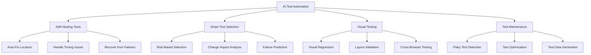

# AI-Powered Test Automation

## Purpose

Provide comprehensive guidance on using AI to enhance test automation through self-healing tests, smart test selection, visual regression testing, and intelligent test maintenance.

## Context

Traditional test automation faces challenges with brittle tests, high maintenance costs, and inefficient test execution. AI can make tests more resilient, reduce maintenance burden, and intelligently prioritize test execution to catch defects faster.

## Prerequisites

- Understanding of [AI Fundamentals](ai-fundamentals.md)
- Familiarity with [Testing Strategy](../04-testing-strategy/README.md)
- Experience with test automation frameworks
- Knowledge of [AI-Assisted Testing](ai-assisted-testing.md) basics

## AI Test Automation Overview



## Core Capabilities

### 1. Self-Healing Tests

**What It Is:**
Tests that automatically adapt to UI changes without manual intervention.

**How It Works:**

```python
# Traditional Test (Breaks on UI changes)
driver.find_element(By.ID, "submit-button").click()
# Breaks if ID changes to "btn-submit"

# Self-Healing Test with AI
class SelfHealingDriver:
    def __init__(self, driver, ml_model):
        self.driver = driver
        self.model = ml_model
        self.locator_history = {}

    def find_element_smart(self, locator_strategy, locator_value):
        """
        Intelligent element location with self-healing

        1. Try primary locator
        2. If fails, use AI to find similar element
        3. Update locator for future use
        """
        try:
            # Try primary locator
            return self.driver.find_element(locator_strategy, locator_value)
        except NoSuchElementException:
            # AI-powered healing
            print(f"Primary locator failed: {locator_value}")

            # Get all elements and their attributes
            candidates = self._get_candidate_elements()

            # Use ML model to find best match
            best_match = self.model.predict_best_match(
                target_locator=locator_value,
                candidates=candidates,
                context=self._get_page_context()
            )

            if best_match['confidence'] > 0.8:
                print(f"✓ Healed: Found element with {best_match['strategy']}")

                # Update locator for future runs
                self._update_locator(locator_value, best_match)

                return best_match['element']
            else:
                raise NoSuchElementException(f"Could not heal locator: {locator_value}")

    def _get_candidate_elements(self):
        """Get all visible elements with their attributes"""
        return self.driver.execute_script("""
            return Array.from(document.querySelectorAll('*')).map(el => ({
                tag: el.tagName,
                id: el.id,
                classes: el.className,
                text: el.textContent.trim(),
                type: el.type,
                name: el.name,
                role: el.getAttribute('role'),
                dataTestId: el.getAttribute('data-testid'),
                xpath: getXPath(el)
            }));
        """)

    def _get_page_context(self):
        """Get page context for better matching"""
        return {
            'url': self.driver.current_url,
            'title': self.driver.title,
            'timestamp': datetime.now()
        }

    def _update_locator(self, old_locator, new_match):
        """Store updated locator for future use"""
        self.locator_history[old_locator] = {
            'new_strategy': new_match['strategy'],
            'new_value': new_match['value'],
            'confidence': new_match['confidence'],
            'updated_at': datetime.now()
        }

        # Optionally: Update test code automatically
        self._suggest_test_update(old_locator, new_match)

# Usage Example
driver = SelfHealingDriver(webdriver.Chrome(), healing_model)
driver.find_element_smart(By.ID, "submit-button").click()
# Automatically finds button even if ID changed to "btn-submit"
```

**Commercial Tools:**

- **Testim**: AI-powered self-healing for web tests
- **Mabl**: Intelligent test maintenance
- **Functionize**: ML-driven test automation

### 2. Smart Test Selection

**What It Is:**
Intelligently select which tests to run based on code changes and risk.

**How It Works:**

```python
class SmartTestSelector:
    """
    AI-powered test selection based on:
    - Code changes (git diff)
    - Historical test failures
    - Code coverage mapping
    - Risk assessment
    """

    def __init__(self):
        self.model = self._load_ml_model()
        self.coverage_map = self._load_coverage_map()
        self.test_history = self._load_test_history()

    def select_tests(self, changed_files, all_tests, time_budget_minutes=30):
        """
        Select optimal test subset

        Args:
            changed_files: List of modified files
            all_tests: All available tests
            time_budget_minutes: Time available for testing

        Returns:
            Prioritized list of tests to run
        """
        # Step 1: Impact Analysis
        impacted_tests = self._find_impacted_tests(changed_files)

        # Step 2: Risk Scoring
        test_scores = []
        for test in all_tests:
            score = self._calculate_risk_score(test, changed_files)
            test_scores.append({
                'test': test,
                'score': score,
                'duration': test.avg_duration_seconds,
                'reason': score.reason
            })

        # Step 3: Optimization
        # Select tests that maximize defect detection within time budget
        selected = self._optimize_test_selection(
            test_scores,
            time_budget_minutes * 60
        )

        return selected

    def _calculate_risk_score(self, test, changed_files):
        """Calculate risk score using ML model"""
        features = {
            # Code-based features
            'code_churn': self._calculate_churn(changed_files),
            'complexity_change': self._complexity_delta(changed_files),
            'coverage_overlap': self._coverage_overlap(test, changed_files),

            # Historical features
            'test_failure_rate': test.failure_rate_last_30_days,
            'test_flakiness': test.flakiness_score,
            'time_since_last_failure': test.days_since_failure,

            # Change features
            'author_experience': self._get_author_experience(changed_files),
            'review_thoroughness': self._get_review_score(changed_files),
            'commit_message_quality': self._analyze_commit_messages(changed_files),

            # Context features
            'time_of_day': datetime.now().hour,
            'day_of_week': datetime.now().weekday(),
            'pr_size': len(changed_files)
        }

        # Predict defect probability
        defect_probability = self.model.predict_proba([features])[0][1]

        return {
            'score': defect_probability,
            'reason': self._explain_score(features, defect_probability)
        }

    def _optimize_test_selection(self, test_scores, time_budget_seconds):
        """
        Knapsack optimization: maximize defect detection
        within time budget
        """
        # Sort by score/duration ratio (efficiency)
        test_scores.sort(key=lambda x: x['score'] / x['duration'], reverse=True)

        selected = []
        total_time = 0

        for test_info in test_scores:
            if total_time + test_info['duration'] <= time_budget_seconds:
                selected.append(test_info)
                total_time += test_info['duration']

                # If high priority, always include
                if test_info['score'] > 0.9:
                    continue

            # Stop if we've covered top 80% of risk
            risk_covered = sum(t['score'] for t in selected)
            total_risk = sum(t['score'] for t in test_scores)

            if risk_covered / total_risk >= 0.8:
                break

        return selected

# Example Output
"""
Smart Test Selection Results
============================

Time Budget: 30 minutes
Tests Available: 1,247 tests
Tests Selected: 87 tests (7% of suite)
Estimated Risk Coverage: 94%

High Priority (Run First):
  ✓ test_payment_processing (Score: 0.95, 45s)
    Reason: High code churn in payment module, recent failures

  ✓ test_user_authentication (Score: 0.89, 30s)
    Reason: Security-critical, affected by changes

  ✓ test_order_creation (Score: 0.87, 60s)
    Reason: Complex logic modified, historically flaky

Medium Priority:
  ✓ test_cart_operations (Score: 0.72, 25s)
  ✓ test_product_search (Score: 0.68, 40s)
  ... 45 more tests

Low Priority (Skipped):
  - test_footer_links (Score: 0.12, 15s)
  - test_static_pages (Score: 0.08, 20s)
  ... 1,160 more tests

Estimated Completion: 28 minutes
Confidence: 94% of defects will be caught
"""
```

### 3. Visual Regression Testing with AI

**What It Is:**
Use AI to detect meaningful visual changes while ignoring irrelevant differences.

**How It Works:**

```python
class AIVisualTester:
    """
    Intelligent visual regression testing

    Features:
    - Semantic diff (ignore pixel-level noise)
    - Layout validation
    - Accessibility checking
    - Cross-browser normalization
    """

    def __init__(self):
        self.model = self._load_vision_model()  # Computer vision model

    def compare_screenshots(self, baseline, current, ignore_regions=[]):
        """
        Intelligent visual comparison

        Returns:
            {
                'is_different': bool,
                'confidence': float,
                'changes': List[Change],
                'severity': 'critical'|'medium'|'low'
            }
        """
        # Step 1: Normalize images (handle browser differences)
        baseline_norm = self._normalize_screenshot(baseline)
        current_norm = self._normalize_screenshot(current)

        # Step 2: Detect layout changes
        layout_diff = self._detect_layout_changes(baseline_norm, current_norm)

        # Step 3: Detect content changes
        content_diff = self._detect_content_changes(baseline_norm, current_norm)

        # Step 4: AI classification
        changes = []
        for diff in layout_diff + content_diff:
            # Skip ignored regions
            if self._in_ignored_region(diff, ignore_regions):
                continue

            # Use AI to classify change significance
            classification = self.model.classify_change(diff)

            if classification['is_meaningful']:
                changes.append({
                    'type': diff.type,
                    'location': diff.bbox,
                    'description': classification['description'],
                    'severity': classification['severity'],
                    'confidence': classification['confidence']
                })

        # Step 5: Overall assessment
        is_different = len(changes) > 0
        max_severity = max([c['severity_score'] for c in changes]) if changes else 0

        return {
            'is_different': is_different,
            'confidence': np.mean([c['confidence'] for c in changes]) if changes else 1.0,
            'changes': changes,
            'severity': self._map_severity(max_severity)
        }

    def _detect_layout_changes(self, baseline, current):
        """Detect structural layout changes"""
        return [
            # Element moved
            {'type': 'position', 'element': 'login-button', 'delta': (10, -5)},
            # Element resized
            {'type': 'size', 'element': 'header', 'delta': (0, 20)},
            # Element added/removed
            {'type': 'structural', 'change': 'banner-added'},
        ]

    def _detect_content_changes(self, baseline, current):
        """Detect content-level changes"""
        # Use OCR + NLP to detect text changes
        baseline_text = self._extract_text(baseline)
        current_text = self._extract_text(current)

        # Use semantic similarity (not exact match)
        similarity = self._semantic_similarity(baseline_text, current_text)

        if similarity < 0.95:  # 95% similar threshold
            return [{'type': 'content', 'similarity': similarity}]
        return []

# Example: Playwright with AI Visual Testing
async def test_homepage_visual():
    page = await browser.new_page()
    await page.goto('https://example.com')

    # Take screenshot
    screenshot = await page.screenshot()

    # AI-powered comparison
    result = visual_tester.compare_screenshots(
        baseline='baselines/homepage.png',
        current=screenshot,
        ignore_regions=[
            {'x': 0, 'y': 0, 'width': 200, 'height': 50},  # Dynamic ad banner
            {'selector': '.timestamp'},  # Timestamp element
        ]
    )

    if result['is_different']:
        if result['severity'] == 'critical':
            # Critical visual changes (layout broken)
            assert False, f"Critical visual changes detected: {result['changes']}"
        else:
            # Log for manual review
            logger.warning(f"Visual changes detected: {result['changes']}")

            # Save diff image with annotations
            save_diff_image('diff.png', result['changes'])
```

### 4. Flaky Test Detection and Resolution

**What It Is:**
Automatically identify and fix flaky (intermittently failing) tests.

**How It Works:**

```python
class FlakySmart testDetector:
    """
    Detect and analyze flaky tests

    Detection Methods:
    - Statistical analysis of test results
    - Timing analysis
    - Resource usage patterns
    - External dependency detection
    """

    def analyze_test_flakiness(self, test_name, run_history):
        """
        Analyze test flakiness and suggest fixes

        Args:
            test_name: Name of the test
            run_history: Last 100 test runs with results

        Returns:
            {
                'is_flaky': bool,
                'flakiness_score': float,
                'root_causes': List[str],
                'suggested_fixes': List[str]
            }
        """
        # Calculate flakiness metrics
        pass_rate = sum(1 for r in run_history if r.passed) / len(run_history)
        failure_pattern = self._analyze_failure_pattern(run_history)

        # Check common flaky patterns
        issues = []

        # 1. Timing issues
        if self._has_timing_issues(run_history):
            issues.append({
                'type': 'timing',
                'description': 'Test fails due to race conditions',
                'fix': 'Add explicit waits instead of sleep()',
                'example': """
                # ❌ Bad: Hard-coded sleep
                time.sleep(2)
                element.click()

                # ✅ Good: Explicit wait
                WebDriverWait(driver, 10).until(
                    EC.element_to_be_clickable((By.ID, 'button'))
                ).click()
                """
            })

        # 2. External dependencies
        if self._has_external_dependency_issues(run_history):
            issues.append({
                'type': 'external_dependency',
                'description': 'Test depends on external service',
                'fix': 'Mock external dependencies',
                'example': """
                # ✅ Mock external API
                @pytest.fixture
                def mock_api(requests_mock):
                    requests_mock.get(
                        'https://api.example.com/data',
                        json={'status': 'ok'},
                        status_code=200
                    )
                """
            })

        # 3. Test order dependencies
        if self._has_test_order_issues(run_history):
            issues.append({
                'type': 'test_order',
                'description': 'Test depends on execution order',
                'fix': 'Ensure test independence with proper setup/teardown',
                'example': """
                # ✅ Independent test with setup
                @pytest.fixture(autouse=True)
                def setup_database():
                    db.clear()
                    db.seed_test_data()
                    yield
                    db.clear()
                """
            })

        # 4. Resource contention
        if self._has_resource_contention(run_history):
            issues.append({
                'type': 'resource_contention',
                'description': 'Tests compete for same resources',
                'fix': 'Use test isolation or unique resource names',
                'example': """
                # ✅ Use unique identifiers
                test_id = str(uuid.uuid4())
                user = create_user(f'test_user_{test_id}')
                """
            })

        return {
            'is_flaky': pass_rate < 0.95 and pass_rate > 0.05,
            'flakiness_score': 1 - pass_rate,
            'pass_rate': pass_rate,
            'root_causes': [issue['type'] for issue in issues],
            'suggested_fixes': issues,
            'failure_pattern': failure_pattern
        }

# Example Report
"""
Flaky Test Report
=================

Test: test_checkout_process
Status: 🔴 FLAKY
Pass Rate: 73% (73/100 runs)
Flakiness Score: 0.27 (High)

Root Causes Detected:
1. ⏱️ Timing Issues (Confidence: 85%)
   - Failures occur when page loads slowly
   - sleep() calls found in test code

2. 🌐 External Dependency (Confidence: 72%)
   - Test makes real HTTP calls to payment API
   - Failures correlate with API downtime

Suggested Fixes:
1. Replace sleep() with explicit waits
   Lines: 45, 67, 89

2. Mock payment API calls
   Add fixture: @pytest.fixture(payment_api_mock)

3. Add retry logic for transient failures
   Use: @pytest.mark.flaky(reruns=3)

Estimated Fix Time: 30 minutes
Priority: High (blocks 12 other tests)
"""
```

### 5. Test Data Generation with AI

**What It Is:**
Generate realistic, diverse test data using AI.

**Example:**

```python
class AITestDataGenerator:
    """Generate realistic test data using LLM"""

    def generate_test_data(self, schema, count=10, variety='high'):
        """
        Generate test data that matches schema

        Args:
            schema: Data schema or model
            count: Number of samples
            variety: 'low', 'medium', 'high' diversity

        Returns:
            List of test data objects
        """
        prompt = f"""
        Generate {count} diverse test data samples for the following schema.
        Ensure realistic values, edge cases, and variety.

        Schema:
        {schema}

        Requirements:
        - Include normal cases (70%)
        - Include edge cases (20%)
        - Include invalid data (10%)
        - Vary demographics, locales, formats
        - Include boundary values

        Output as JSON array.
        """

        response = self.llm.generate(prompt)
        return json.loads(response)

# Example Usage
generator = AITestDataGenerator()

user_schema = """
interface User {
  id: string;
  email: string;
  age: number;
  country: string;
  preferences: {
    newsletter: boolean;
    theme: 'light' | 'dark';
  };
}
"""

test_users = generator.generate_test_data(user_schema, count=50)
# Returns 50 diverse, realistic user objects
```

## Commercial AI Test Automation Tools

### Tool Comparison Matrix

| Tool            | Self-Healing | Smart Selection | Visual Testing | Price/Month |
| --------------- | ------------ | --------------- | -------------- | ----------- |
| **Testim**      | ✅ Excellent | ✅ Yes          | ✅ Yes         | $450        |
| **Mabl**        | ✅ Excellent | ✅ Yes          | ✅ Yes         | $400        |
| **Functionize** | ✅ Very Good | ✅ Yes          | ⚠️ Limited     | $500        |
| **Applitools**  | ⚠️ Limited   | ❌ No           | ✅ Excellent   | $200        |
| **Percy**       | ❌ No        | ❌ No           | ✅ Very Good   | $149        |

### Detailed Tool Reviews

#### Testim

```yaml
strengths:
  - Best-in-class self-healing
  - Codeless test creation
  - Great Selenium/Playwright integration
  - Smart locators with ML

weaknesses:
  - Expensive for large teams
  - Limited API testing
  - Vendor lock-in

best_for:
  - UI-heavy applications
  - Teams without deep automation expertise
  - Fast test creation needs
```

#### Mabl

```yaml
strengths:
  - End-to-end platform
  - Excellent visual testing
  - Auto-healing tests
  - Performance testing included

weaknesses:
  - Learning curve
  - Can be slow for large suites
  - Limited mobile support

best_for:
  - Web applications
  - Teams wanting all-in-one solution
  - Organizations prioritizing visual quality
```

## Implementation Roadmap

### Phase 1: Self-Healing Tests (Week 1-2)

- Implement basic self-healing for top 10 flaky tests
- Deploy Testim or Mabl pilot
- Measure reduction in maintenance time

### Phase 2: Smart Test Selection (Week 3-4)

- Build change impact analysis
- Implement risk-based selection
- Integrate with CI/CD

### Phase 3: Visual Testing (Week 5-6)

- Add Applitools or Percy
- Create baseline screenshots
- Integrate into pipeline

### Phase 4: Optimization (Week 7-8)

- Fix all flaky tests
- Optimize test data generation
- Full team rollout

## Best Practices

### 1. Start with Problem Tests

- Identify most flaky tests
- Apply AI to fix those first
- Build confidence incrementally

### 2. Validate AI Decisions

- Review healed locators
- Verify test selections
- Monitor false positives

### 3. Combine with Traditional Methods

- AI + conventional waits
- AI + manual test design
- AI + human review

### 4. Measure Everything

- Track heal success rate
- Measure time savings
- Monitor test stability

## Metrics to Track

```yaml
test_automation_metrics:
  maintenance_time:
    baseline: '40 hours/month'
    target: '< 10 hours/month'
    improvement: '75%'

  flaky_test_rate:
    baseline: '15%'
    target: '< 3%'
    improvement: '80%'

  test_execution_time:
    baseline: '45 minutes'
    target: '< 15 minutes'
    improvement: '67%'

  defect_detection_rate:
    baseline: '65%'
    target: '> 85%'
    improvement: '31%'
```

## Related Topics

- [AI-Assisted Testing](ai-assisted-testing.md) - Test generation basics
- [Testing Strategy](../04-testing-strategy/README.md) - Overall testing approach
- [E2E Testing Examples](../../examples/e2e-tests/README.md) - Practical examples

## Next Steps

1. **Audit Current Tests**: Identify flaky and maintenance-heavy tests
2. **Try Tool**: Start free trial of Testim or Mabl
3. **Build Prototype**: Create self-healing test prototype
4. **Measure Impact**: Track time saved and stability improved
5. **Scale**: Roll out to entire test suite

---

_AI-powered test automation makes tests more reliable, reduces maintenance burden by 75%, and catches defects faster through intelligent test selection._
