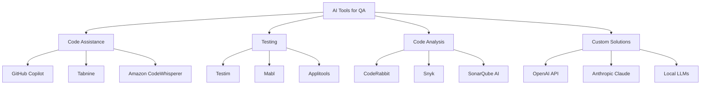

# AI Tool Ecosystem for Quality Assurance

## Purpose

Provide comprehensive guidance on available AI tools for QA, helping teams select the right tools for their needs, understand costs, and integrate effectively into existing workflows.

## Context

The AI tool landscape is rapidly evolving. This guide helps you navigate commercial and open-source options, understand trade-offs, and make informed decisions about which tools to adopt.

## Prerequisites

- Understanding of [AI Fundamentals](ai-fundamentals.md)
- Familiarity with your team's QA workflow
- Budget approval for AI tools (if using commercial)

## AI Tool Categories



## Commercial AI Tools

### 1. GitHub Copilot

**Category:** Code Assistance / Test Generation

**What it does:**

- AI-powered code completion
- Test generation from function signatures
- Documentation generation
- Code explanation and refactoring suggestions

**Best for:**

- Developers writing tests alongside code
- Quick test scaffolding
- Learning new testing frameworks

**Pricing:**

```yaml
pricing:
  individual: $10/month
  business: $19/user/month
  enterprise: Custom pricing

trial: 30 days free
```

**Strengths:**

- ✅ Seamless IDE integration (VS Code, JetBrains, Neovim)
- ✅ Real-time suggestions
- ✅ Trained on billions of lines of code
- ✅ Understands context across files
- ✅ Multi-language support

**Limitations:**

- ❌ Generic suggestions (not team-specific)
- ❌ Requires internet connection
- ❌ Can suggest outdated patterns
- ❌ Limited customization

**Use Cases for QA:**

```javascript
// Type a comment describing the test
// Copilot generates the implementation

// Test user authentication with invalid credentials
test('should reject invalid credentials', async () => {
  // Copilot suggests:
  const response = await request(app)
    .post('/api/login')
    .send({ username: 'user', password: 'wrong' })
    .expect(401);

  expect(response.body.error).toBe('Invalid credentials');
});
```

**Integration Example:**

```bash
# Install in VS Code
code --install-extension GitHub.copilot

# Configure for test generation
# Settings > GitHub Copilot > Enable for specific file types
{
  "github.copilot.enable": {
    "*.test.js": true,
    "*.spec.ts": true,
    "*_test.py": true
  }
}
```

**ROI Estimate:**

```yaml
team_size: 10 developers
cost: $190/month (business plan)

time_savings:
  test_writing: 40 hours/month
  code_refactoring: 20 hours/month
  documentation: 15 hours/month

value: $3,750/month (at $50/hour)
roi: 1,874%
```

---

### 2. CodeRabbit

**Category:** AI Code Review

**What it does:**

- Automated PR review with AI
- Identifies bugs, security issues, performance problems
- Suggests improvements and refactoring
- Line-by-line code analysis

**Pricing:**

```yaml
pricing:
  free: Open source projects
  pro: $15/user/month
  enterprise: $49/user/month

trial: 14 days free
```

**Strengths:**

- ✅ Deep code understanding
- ✅ Context-aware suggestions
- ✅ Learns from accepted/rejected feedback
- ✅ GitHub/GitLab integration
- ✅ Configurable review rules

**Example Review:**

```yaml
# CodeRabbit PR Comment Example:

🤖 AI Code Review

## Critical Issues (2)
1. **Potential SQL Injection** (line 45)
   - Using string concatenation for SQL query
   - Recommendation: Use parameterized queries
   - Severity: CRITICAL

2. **Missing Error Handling** (line 78)
   - Async function without try-catch
   - Could cause unhandled promise rejection
   - Severity: HIGH

## Suggestions (3)
- Line 23: Consider using const instead of let
- Line 56: Function complexity is 12, recommend refactoring
- Line 89: Missing unit test for error path

## Test Coverage Impact
- Before: 78%
- After: 80% (+2%)
- Uncovered lines: 12-15, 89-92

Estimated Review Time: 2 minutes (vs 45 minutes manual)
```

**Configuration:**

```yaml
# .coderabbit.yaml
reviews:
  auto_review: true
  request_changes_on:
    - security_issues
    - missing_tests
    - complexity_over_15

  ignore_patterns:
    - '**/*.test.js'
    - '**/generated/**'

  custom_rules:
    - name: 'Require tests for new functions'
      pattern: '^(async )?function'
      severity: HIGH
      message: 'New functions should have corresponding tests'
```

---

### 3. Testim

**Category:** AI-Powered Test Automation

**What it does:**

- AI-stabilized E2E test automation
- Self-healing tests (adapts to UI changes)
- Smart locators that don't break
- Visual testing with AI

**Pricing:**

```yaml
pricing:
  essentials: $450/month (5 users)
  pro: Custom pricing
  enterprise: Custom pricing

trial: 14 days free
```

**Strengths:**

- ✅ Self-healing tests reduce maintenance
- ✅ AI identifies stable locators
- ✅ Low-code test creation
- ✅ Cross-browser execution

**Example:**

```javascript
// Traditional test - breaks when UI changes
await page.click('#submit-btn-123');

// Testim AI - adapts to changes
await testim.click('Submit button', {
  ai: true,
  fallbacks: ['text', 'aria-label', 'data-testid'],
});
// ✅ Still works even if ID changes
```

---

### 4. Mabl

**Category:** Intelligent Test Automation

**What it does:**

- Low-code test creation
- Auto-healing tests
- Intelligent insights and analytics
- Visual testing with AI comparison

**Pricing:**

```yaml
pricing:
  starter: $299/month
  growth: $899/month
  enterprise: Custom

trial: 14 days free
```

**Use Case:**

```yaml
mabl_capabilities:
  test_creation:
    method: Record user flows in browser
    ai_enhancement: Auto-generates assertions
    maintenance: Self-healing when UI changes

  analytics:
    failure_analysis: AI categorizes failures
    trends: Predicts flaky tests
    insights: Suggests optimization

  integration:
    - Jenkins
    - GitHub Actions
    - Slack notifications
```

---

### 5. Applitools

**Category:** Visual AI Testing

**What it does:**

- AI-powered visual regression testing
- Detects visual bugs humans miss
- Cross-browser visual validation
- Responsive design testing

**Pricing:**

```yaml
pricing:
  free: 100 checkpoints/month
  starter: $99/month
  professional: $299/month
  enterprise: Custom

trial: Free tier available
```

**Example:**

```javascript
// Visual AI test with Applitools
const { Eyes, Target } = require('@applitools/eyes-playwright');

test('Visual regression test', async ({ page }) => {
  const eyes = new Eyes();

  await eyes.open(page, 'My App', 'Homepage Test');

  // AI validates entire page visually
  await eyes.check('Homepage', Target.window().fully());

  // AI ignores dynamic content automatically
  await eyes.check('With Dynamic Content', Target.window().ignoreRegions('#timestamp'));

  await eyes.close();
});

// ✅ Detects visual bugs across browsers
// ✅ Ignores acceptable differences (anti-aliasing, etc.)
// ✅ Highlights actual issues
```

---

### 6. Snyk

**Category:** AI-Powered Security Testing

**What it does:**

- Scans code and dependencies for vulnerabilities
- AI-powered fix suggestions
- Real-time security insights
- License compliance checking

**Pricing:**

```yaml
pricing:
  free: Limited scans
  team: $98/month
  business: $430/month
  enterprise: Custom

trial: Free tier available
```

**Example:**

```yaml
# Snyk finds vulnerability
vulnerability: 'Prototype Pollution in lodash'
severity: HIGH
cvss_score: 7.4
affected_versions: '< 4.17.21'

ai_fix_suggestion:
  automatic: true
  pr_generated: true
  changes:
    - package.json: 'lodash: ^4.17.21'
    - package-lock.json: Updated

  testing:
    status: 'All tests pass'
    security_scan: 'No new vulnerabilities'

recommendation: 'Safe to merge'
```

---

## Open Source AI Solutions

### 1. OpenAI API (Custom Integration)

**What you build:**

- Custom test generators
- Code review automation
- Documentation Q&A bots
- Test data generation

**Pricing:**

```yaml
gpt4_turbo:
  input: $0.01 per 1K tokens
  output: $0.03 per 1K tokens

gpt35_turbo:
  input: $0.0005 per 1K tokens
  output: $0.0015 per 1K tokens

embeddings:
  text_embedding_3_small: $0.00002 per 1K tokens
  text_embedding_3_large: $0.00013 per 1K tokens
```

**Example Monthly Cost:**

```yaml
usage_scenario:
  test_generation: 1000 tests/month
  avg_tokens_per_test: 3000
  cost_per_test: $0.09
  monthly_cost: $90

  code_review: 200 PRs/month
  avg_tokens_per_pr: 5000
  cost_per_review: $0.15
  monthly_cost: $30

total: $120/month
```

**Best For:**

- Teams with specific requirements
- Integration with existing tools
- Full customization needed
- Privacy-sensitive environments (with local models)

---

### 2. Local LLMs (Llama 3, Mistral)

**What you run:**

- Open-source models on your infrastructure
- No data leaves your network
- Complete control and customization

**Requirements:**

```yaml
llama_3_70b:
  gpu: NVIDIA A100 (80GB) or equivalent
  ram: 128GB+
  storage: 150GB
  cost: $1.50-3.00/hour (cloud) or $10K+ hardware

llama_3_8b:
  gpu: NVIDIA RTX 4090 (24GB)
  ram: 32GB
  storage: 20GB
  cost: $0.30-0.80/hour (cloud) or $2K hardware

mistral_7b:
  gpu: NVIDIA RTX 3090 (24GB)
  ram: 16GB
  storage: 15GB
  cost: $0.20-0.60/hour (cloud) or $1.5K hardware
```

**Example Setup:**

```bash
# Using Ollama for local LLM
curl https://ollama.ai/install.sh | sh

# Pull model
ollama pull llama3:70b

# Use in code
from ollama import Client

client = Client()
response = client.generate(
    model='llama3:70b',
    prompt='Generate unit tests for this function...'
)
```

**Pros:**

- ✅ Complete data privacy
- ✅ No per-request costs
- ✅ Can fine-tune for your codebase
- ✅ No vendor lock-in

**Cons:**

- ❌ Significant infrastructure cost
- ❌ Requires ML expertise
- ❌ Maintenance overhead
- ❌ May lag behind commercial models

---

## Tool Selection Matrix

### By Use Case

```yaml
test_generation:
  best_for_individuals:
    tool: GitHub Copilot
    cost: $10/month
    setup_time: 5 minutes

  best_for_teams:
    tool: Custom OpenAI integration
    cost: $100-500/month
    setup_time: 1-2 weeks

  best_for_enterprise:
    tool: Local Llama 3 + custom RAG
    cost: $2K-5K/month infrastructure
    setup_time: 4-8 weeks

code_review:
  quick_start:
    tool: CodeRabbit
    cost: $15/user/month
    value: High

  custom_rules:
    tool: Custom GPT-4 integration
    cost: $200-500/month
    flexibility: Maximum

  security_focused:
    tool: Snyk + CodeRabbit
    cost: $113/user/month
    coverage: Comprehensive

e2e_testing:
  low_code:
    tool: Mabl
    cost: $299+/month
    maintenance: Low

  self_healing:
    tool: Testim
    cost: $450+/month
    stability: High

  full_control:
    tool: Playwright + custom AI
    cost: $100-300/month (API)
    flexibility: Maximum

visual_testing:
  best_in_class:
    tool: Applitools
    cost: $99-299/month
    accuracy: Excellent

  budget_option:
    tool: Percy (Browserstack)
    cost: $299/month
    features: Good
```

### By Team Size

```yaml
solo_developer:
  recommended:
    - GitHub Copilot: $10/month
    - ChatGPT Plus: $20/month
  total: $30/month

small_team_5_people:
  recommended:
    - GitHub Copilot Business: $95/month
    - CodeRabbit Pro: $75/month
    - OpenAI API: $150/month
  total: $320/month

medium_team_20_people:
  recommended:
    - GitHub Copilot Business: $380/month
    - CodeRabbit Pro: $300/month
    - Testim: $450/month
    - OpenAI API: $500/month
    - Applitools: $299/month
  total: $1,929/month

large_organization_100_people:
  recommended:
    - GitHub Copilot Enterprise: Custom
    - CodeRabbit Enterprise: $4,900/month
    - Testim Enterprise: Custom
    - Internal RAG system: $2,000/month
    - Local LLM infrastructure: $5,000/month
  total: $15K-20K/month

  roi:
    time_saved: 2,000 hours/month
    value: $100K/month
    roi: 500-600%
```

### By Budget

```yaml
budget_less_than_50_month:
  options:
    - GitHub Copilot Individual: $10
    - ChatGPT Plus: $20
    - OpenAI API (limited): $20
  strategy: Manual + AI-assisted

budget_100_500_month:
  options:
    - GitHub Copilot: $10-100
    - CodeRabbit: $15-75
    - OpenAI API: $100-300
    - Applitools Starter: $99
  strategy: Core tools + custom

budget_500_2000_month:
  options:
    - All basic tools above
    - Testim: $450
    - Mabl: $299-899
    - Snyk Team: $98-430
  strategy: Commercial tools + selective custom

budget_2000_plus_month:
  options:
    - Enterprise licenses
    - Custom RAG systems
    - Local LLM infrastructure
    - Dedicated AI engineer
  strategy: Full stack + innovation
```

## Integration Patterns

### Pattern 1: GitHub Actions Integration

```yaml
# .github/workflows/ai-qa.yml
name: AI Quality Checks

on: [pull_request]

jobs:
  ai-code-review:
    runs-on: ubuntu-latest
    steps:
      - uses: actions/checkout@v3

      # CodeRabbit automatically reviews
      - name: CodeRabbit Review
        uses: coderabbit-ai/action@v1

      # Custom AI test generation
      - name: Generate Missing Tests
        env:
          OPENAI_API_KEY: ${{ secrets.OPENAI_API_KEY }}
        run: |
          python scripts/ai_test_gen.py

      # Snyk security scan
      - name: Snyk Security Scan
        uses: snyk/actions/node@master
        env:
          SNYK_TOKEN: ${{ secrets.SNYK_TOKEN }}
```

### Pattern 2: Pre-commit Hooks

```yaml
# .pre-commit-config.yaml
repos:
  - repo: local
    hooks:
      - id: ai-test-check
        name: AI Test Coverage Check
        entry: python scripts/check_test_coverage.py
        language: python
        always_run: true

      - id: ai-code-quality
        name: AI Code Quality Analysis
        entry: python scripts/ai_quality_check.py
        language: python
        pass_filenames: true
```

### Pattern 3: Slack Integration

```python
# Slack bot with multiple AI tools
from slack_bolt import App

app = App(token=os.environ["SLACK_BOT_TOKEN"])

@app.command("/ai-review")
def ai_review_command(ack, command, say):
    ack()
    pr_url = command['text']

    # Get CodeRabbit analysis
    coderabbit_results = get_coderabbit_review(pr_url)

    # Get Snyk security scan
    snyk_results = get_snyk_scan(pr_url)

    # Custom AI analysis
    custom_analysis = analyze_with_openai(pr_url)

    # Combine and present
    say(format_combined_results(
        coderabbit_results,
        snyk_results,
        custom_analysis
    ))
```

## Tool Evaluation Framework

### Evaluation Checklist

```yaml
evaluation_criteria:
  technical_fit:
    - [ ] Supports our tech stack
    - [ ] Integrates with existing tools
    - [ ] Meets performance requirements
    - [ ] Scales with team growth

  usability:
    - [ ] Easy to set up (< 1 day)
    - [ ] Intuitive interface
    - [ ] Good documentation
    - [ ] Active community support

  cost:
    - [ ] Fits budget
    - [ ] Transparent pricing
    - [ ] Good ROI (> 200%)
    - [ ] Free trial available

  security:
    - [ ] SOC 2 compliant
    - [ ] Data privacy guarantees
    - [ ] On-premise option available
    - [ ] Audit logs provided

  vendor:
    - [ ] Stable company
    - [ ] Regular updates
    - [ ] Responsive support
    - [ ] Migration path clear
```

### Trial Period Framework

```yaml
30_day_trial_plan:
  week_1:
    - Set up tool
    - Train 2-3 champions
    - Define success metrics
    - Baseline current process

  week_2:
    - Use tool for real work
    - Track time savings
    - Document issues
    - Collect team feedback

  week_3:
    - Optimize configuration
    - Expand to more users
    - Measure results
    - Calculate ROI

  week_4:
    - Present findings to team
    - Decision: Adopt, reject, or extend trial
    - If adopting: Plan rollout
    - If rejecting: Document why

success_criteria:
  minimum_acceptable:
    time_savings: '> 30%'
    team_adoption: '> 60%'
    quality_maintained: 'No regression'
    cost_justified: 'ROI > 100%'

  ideal_results:
    time_savings: '> 60%'
    team_adoption: '> 80%'
    quality_improved: '+15%'
    cost_justified: 'ROI > 300%'
```

## Recommended Tool Stacks

### Startup Stack ($200-500/month)

```yaml
tools:
  - GitHub Copilot Business: $95
  - CodeRabbit Pro: $75
  - OpenAI API: $150-300
  - Chroma (self-hosted): Free

total: $320-470/month

best_for:
  - 5-10 person teams
  - Moving fast
  - Limited budget
  - Comfortable with some DIY
```

### Scale-up Stack ($1,500-3,000/month)

```yaml
tools:
  - GitHub Copilot Enterprise: $380
  - CodeRabbit Pro: $300
  - Testim Essentials: $450
  - Applitools Professional: $299
  - OpenAI API: $500
  - Snyk Team: $430

total: $2,359/month

best_for:
  - 20-50 person teams
  - Balanced DIY and commercial
  - Quality-focused
  - Scaling processes
```

### Enterprise Stack ($10K-20K/month)

```yaml
tools:
  - GitHub Copilot Enterprise: Custom
  - CodeRabbit Enterprise: $4,900
  - Testim Enterprise: Custom
  - Applitools Enterprise: Custom
  - Custom RAG System: $2,000
  - Local LLM Infrastructure: $5,000
  - Dedicated AI/ML Engineer: Salary

total: $15K-25K/month

best_for:
  - 100+ person organizations
  - Security/compliance requirements
  - Custom needs
  - Innovation focus
```

## Common Pitfalls

### Avoid These Mistakes

```yaml
pitfall_1_tool_sprawl:
  problem: 'Too many AI tools, none used effectively'
  solution: 'Start with 2-3 tools, master them first'

pitfall_2_no_adoption:
  problem: "Bought tools but team doesn't use them"
  solution: 'Involve team in selection, provide training'

pitfall_3_cost_overrun:
  problem: 'API costs exceed budget'
  solution: 'Set usage limits, monitor daily, optimize'

pitfall_4_security_gap:
  problem: 'Sending sensitive code to public APIs'
  solution: 'Use local models or approved vendors only'

pitfall_5_over_reliance:
  problem: 'Blindly trusting AI outputs'
  solution: 'Always review, validate, test AI suggestions'
```

## Next Steps

1. **Assess Needs** - What problems are you trying to solve?
2. **Set Budget** - How much can you invest?
3. **Start Trial** - Try 2-3 tools for 14-30 days
4. **Measure ROI** - Track time saved, quality improved
5. **Decide** - Adopt what works, ditch what doesn't
6. **Scale** - Expand to more users and use cases

## Related Topics

- [AI Fundamentals](ai-fundamentals.md) - Understanding the technology
- [Implementation Roadmap](implementation-roadmap.md) - How to adopt AI tools
- [Building AI QA Assistant](building-ai-qa-assistant.md) - Build your own vs buy

---

_Choose tools that fit your team, budget, and workflow. Start small, measure impact, and scale what works._
