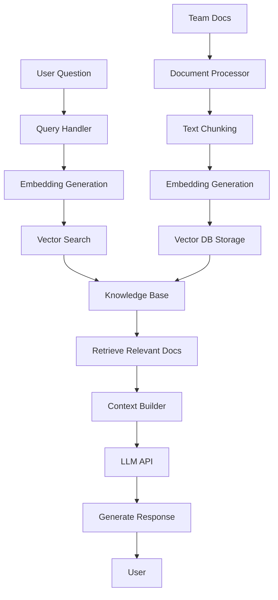

# Building an AI QA Assistant with LLM + RAG

## Purpose

Provide a complete, step-by-step guide to building a production-ready AI assistant that understands your team's quality assurance processes, standards, and codebase using Large Language Models (LLMs) and Retrieval-Augmented Generation (RAG).

## Context

Off-the-shelf AI tools don't know your team's specific testing standards, coding conventions, or historical decisions. By building a custom RAG system, you create an AI assistant that combines the power of LLMs with your organization's unique QA knowledge.

## Prerequisites

- Understanding of [AI Fundamentals](ai-fundamentals.md)
- Python 3.9+ installed
- OpenAI or Anthropic API key
- Docker (for deployment)
- Basic understanding of REST APIs

## What You'll Build

A complete AI QA Assistant that can:

- ✅ Answer questions about your testing standards
- ✅ Generate tests based on your conventions
- ✅ Review code against your guidelines
- ✅ Suggest relevant test cases from similar features
- ✅ Provide onboarding guidance for new team members
- ✅ Remember context across conversations



## Architecture Overview

### Components

```yaml
architecture:
  frontend:
    - Slack bot
    - Web interface
    - VS Code extension (optional)

  backend:
    - FastAPI server
    - Query processing engine
    - LLM integration layer

  knowledge_base:
    - Vector database (Chroma/Pinecone)
    - Document embeddings
    - Metadata store

  data_sources:
    - QA documentation (Markdown)
    - Test cases and examples
    - Code review guidelines
    - Postmortems and incidents
    - Team standards and processes
```

### Technology Stack

**Recommended Stack:**

```yaml
llm_provider: OpenAI GPT-4 Turbo
embeddings: text-embedding-3-small
vector_db: Chroma (local) or Pinecone (cloud)
framework: LangChain
api: FastAPI
deployment: Docker + Docker Compose
```

**Alternative Stack (Privacy-Focused):**

```yaml
llm_provider: Local Llama 3 (70B)
embeddings: Sentence-BERT (local)
vector_db: Chroma (local)
framework: LlamaIndex
api: FastAPI
deployment: On-premise Kubernetes
```

## Step-by-Step Implementation

### Step 1: Environment Setup

```bash
# Create project structure
mkdir qa-assistant
cd qa-assistant

# Create virtual environment
python -m venv venv
source venv/bin/activate  # On Windows: venv\Scripts\activate

# Install dependencies
pip install openai langchain chromadb fastapi uvicorn python-dotenv pydantic
```

**Project Structure:**

```
qa-assistant/
├── app/
│   ├── __init__.py
│   ├── main.py              # FastAPI app
│   ├── config.py            # Configuration
│   ├── models.py            # Data models
│   └── services/
│       ├── __init__.py
│       ├── embeddings.py    # Embedding generation
│       ├── vector_store.py  # Vector DB operations
│       ├── llm.py           # LLM integration
│       └── rag.py           # RAG pipeline
├── data/
│   ├── documents/           # Source documents
│   └── vector_db/           # Chroma DB storage
├── scripts/
│   ├── ingest_docs.py       # Document ingestion
│   └── test_queries.py      # Testing
├── tests/
│   └── test_rag.py
├── .env                     # Environment variables
├── requirements.txt
├── Dockerfile
└── docker-compose.yml
```

### Step 2: Configuration

```python
# app/config.py

from pydantic_settings import BaseSettings
from functools import lru_cache

class Settings(BaseSettings):
    # API Keys
    openai_api_key: str
    anthropic_api_key: str = ""

    # LLM Configuration
    llm_model: str = "gpt-4-turbo-preview"
    llm_temperature: float = 0.1
    llm_max_tokens: int = 2000

    # Embeddings Configuration
    embedding_model: str = "text-embedding-3-small"
    embedding_dimension: int = 1536

    # Vector DB Configuration
    vector_db_type: str = "chroma"  # or "pinecone"
    vector_db_path: str = "./data/vector_db"
    collection_name: str = "qa_knowledge"

    # RAG Configuration
    chunk_size: int = 1000
    chunk_overlap: int = 200
    top_k_results: int = 5
    similarity_threshold: float = 0.7

    # API Configuration
    api_host: str = "0.0.0.0"
    api_port: int = 8000

    class Config:
        env_file = ".env"

@lru_cache()
def get_settings():
    return Settings()
```

```bash
# .env file
OPENAI_API_KEY=your_key_here
LLM_MODEL=gpt-4-turbo-preview
VECTOR_DB_PATH=./data/vector_db
```

### Step 3: Document Processing

```python
# app/services/embeddings.py

from langchain.text_splitter import RecursiveCharacterTextSplitter
from langchain.embeddings import OpenAIEmbeddings
from langchain.schema import Document
from typing import List
import os

class DocumentProcessor:
    def __init__(self, settings):
        self.settings = settings
        self.embeddings = OpenAIEmbeddings(
            model=settings.embedding_model,
            openai_api_key=settings.openai_api_key
        )
        self.text_splitter = RecursiveCharacterTextSplitter(
            chunk_size=settings.chunk_size,
            chunk_overlap=settings.chunk_overlap,
            separators=["\n\n", "\n", ". ", " ", ""]
        )

    def load_documents(self, directory: str) -> List[Document]:
        """Load all documents from directory"""
        documents = []

        for root, dirs, files in os.walk(directory):
            for file in files:
                if file.endswith(('.md', '.txt', '.rst')):
                    file_path = os.path.join(root, file)

                    with open(file_path, 'r', encoding='utf-8') as f:
                        content = f.read()

                    # Create document with metadata
                    doc = Document(
                        page_content=content,
                        metadata={
                            'source': file_path,
                            'filename': file,
                            'type': self._classify_document(file_path, content)
                        }
                    )
                    documents.append(doc)

        print(f"Loaded {len(documents)} documents")
        return documents

    def chunk_documents(self, documents: List[Document]) -> List[Document]:
        """Split documents into chunks"""
        chunks = self.text_splitter.split_documents(documents)
        print(f"Created {len(chunks)} chunks")
        return chunks

    def _classify_document(self, file_path: str, content: str) -> str:
        """Classify document type based on path and content"""
        path_lower = file_path.lower()

        if 'test' in path_lower:
            return 'testing'
        elif 'standard' in path_lower or 'guideline' in path_lower:
            return 'standards'
        elif 'incident' in path_lower or 'postmortem' in path_lower:
            return 'incidents'
        elif 'api' in path_lower or 'contract' in path_lower:
            return 'api_docs'
        else:
            return 'general'

    def generate_embeddings(self, texts: List[str]) -> List[List[float]]:
        """Generate embeddings for texts"""
        return self.embeddings.embed_documents(texts)
```

### Step 4: Vector Database Setup

```python
# app/services/vector_store.py

from langchain.vectorstores import Chroma
from langchain.embeddings import OpenAIEmbeddings
from langchain.schema import Document
from typing import List, Dict, Optional
import chromadb

class VectorStoreManager:
    def __init__(self, settings):
        self.settings = settings
        self.embeddings = OpenAIEmbeddings(
            model=settings.embedding_model,
            openai_api_key=settings.openai_api_key
        )

        # Initialize ChromaDB
        self.client = chromadb.PersistentClient(
            path=settings.vector_db_path
        )

        self.vector_store = Chroma(
            client=self.client,
            collection_name=settings.collection_name,
            embedding_function=self.embeddings
        )

    def add_documents(self, documents: List[Document]) -> List[str]:
        """Add documents to vector store"""
        ids = self.vector_store.add_documents(documents)
        print(f"Added {len(ids)} documents to vector store")
        return ids

    def similarity_search(
        self,
        query: str,
        k: int = 5,
        filter: Optional[Dict] = None
    ) -> List[Document]:
        """Search for similar documents"""
        results = self.vector_store.similarity_search(
            query=query,
            k=k,
            filter=filter
        )
        return results

    def similarity_search_with_score(
        self,
        query: str,
        k: int = 5,
        filter: Optional[Dict] = None
    ) -> List[tuple]:
        """Search with similarity scores"""
        results = self.vector_store.similarity_search_with_score(
            query=query,
            k=k,
            filter=filter
        )
        return results

    def delete_collection(self):
        """Delete the entire collection"""
        self.client.delete_collection(self.settings.collection_name)

    def get_collection_stats(self) -> Dict:
        """Get statistics about the collection"""
        collection = self.client.get_collection(self.settings.collection_name)
        return {
            'name': collection.name,
            'count': collection.count(),
            'metadata': collection.metadata
        }
```

### Step 5: LLM Integration

```python
# app/services/llm.py

from langchain.chat_models import ChatOpenAI
from langchain.prompts import ChatPromptTemplate, MessagesPlaceholder
from langchain.schema import HumanMessage, AIMessage, SystemMessage
from typing import List, Dict
import json

class LLMService:
    def __init__(self, settings):
        self.settings = settings
        self.llm = ChatOpenAI(
            model=settings.llm_model,
            temperature=settings.llm_temperature,
            max_tokens=settings.llm_max_tokens,
            openai_api_key=settings.openai_api_key
        )

        # System prompt for QA assistant
        self.system_prompt = """You are an expert QA Assistant for a software development team.

Your role:
- Answer questions about testing practices, standards, and processes
- Help generate test cases following team conventions
- Review code and tests against team guidelines
- Provide guidance on QA best practices
- Reference specific team documentation when available

Guidelines:
- Always base answers on the provided context from team documentation
- If information isn't in the context, say "I don't have that information in the team docs"
- Be specific and actionable in your recommendations
- Use examples from the team's codebase when available
- Format code snippets with proper syntax highlighting

Context from team documentation:
{context}"""

    def generate_response(
        self,
        query: str,
        context: List[Document],
        conversation_history: List[Dict] = None
    ) -> str:
        """Generate response using LLM"""

        # Prepare context from retrieved documents
        context_text = self._format_context(context)

        # Prepare messages
        messages = [
            SystemMessage(content=self.system_prompt.format(context=context_text))
        ]

        # Add conversation history if available
        if conversation_history:
            for msg in conversation_history:
                if msg['role'] == 'user':
                    messages.append(HumanMessage(content=msg['content']))
                elif msg['role'] == 'assistant':
                    messages.append(AIMessage(content=msg['content']))

        # Add current query
        messages.append(HumanMessage(content=query))

        # Generate response
        response = self.llm(messages)

        return response.content

    def _format_context(self, documents: List[Document]) -> str:
        """Format retrieved documents as context"""
        context_parts = []

        for i, doc in enumerate(documents, 1):
            source = doc.metadata.get('source', 'Unknown')
            doc_type = doc.metadata.get('type', 'general')

            context_parts.append(f"""
Document {i} (Type: {doc_type}, Source: {source}):
{doc.page_content}
---
""")

        return "\n".join(context_parts)

    def generate_with_sources(
        self,
        query: str,
        context: List[tuple]  # (Document, score) tuples
    ) -> Dict:
        """Generate response and return sources"""

        # Filter by similarity threshold
        filtered_context = [
            (doc, score)
            for doc, score in context
            if score >= self.settings.similarity_threshold
        ]

        if not filtered_context:
            return {
                'response': "I don't have enough relevant information to answer this question.",
                'sources': [],
                'confidence': 0.0
            }

        # Generate response
        documents = [doc for doc, _ in filtered_context]
        response = self.generate_response(query, documents)

        # Prepare sources
        sources = [
            {
                'filename': doc.metadata.get('filename', 'Unknown'),
                'source': doc.metadata.get('source', ''),
                'type': doc.metadata.get('type', 'general'),
                'relevance_score': float(score),
                'excerpt': doc.page_content[:200] + "..."
            }
            for doc, score in filtered_context
        ]

        # Calculate confidence based on relevance scores
        avg_relevance = sum(score for _, score in filtered_context) / len(filtered_context)
        confidence = min(avg_relevance * 1.2, 1.0)  # Scale up, cap at 1.0

        return {
            'response': response,
            'sources': sources,
            'confidence': confidence
        }
```

### Step 6: RAG Pipeline

```python
# app/services/rag.py

from typing import List, Dict, Optional
from langchain.schema import Document

class RAGPipeline:
    def __init__(self, vector_store, llm_service, settings):
        self.vector_store = vector_store
        self.llm_service = llm_service
        self.settings = settings
        self.conversation_memory = {}  # Store by session_id

    def query(
        self,
        question: str,
        session_id: Optional[str] = None,
        filter: Optional[Dict] = None
    ) -> Dict:
        """Process query through RAG pipeline"""

        # Step 1: Retrieve relevant documents
        search_results = self.vector_store.similarity_search_with_score(
            query=question,
            k=self.settings.top_k_results,
            filter=filter
        )

        # Step 2: Get conversation history if session exists
        conversation_history = None
        if session_id:
            conversation_history = self.conversation_memory.get(session_id, [])

        # Step 3: Generate response with LLM
        result = self.llm_service.generate_with_sources(
            query=question,
            context=search_results
        )

        # Step 4: Update conversation history
        if session_id:
            if session_id not in self.conversation_memory:
                self.conversation_memory[session_id] = []

            self.conversation_memory[session_id].append({
                'role': 'user',
                'content': question
            })
            self.conversation_memory[session_id].append({
                'role': 'assistant',
                'content': result['response']
            })

            # Keep only last 10 messages
            if len(self.conversation_memory[session_id]) > 20:
                self.conversation_memory[session_id] = \
                    self.conversation_memory[session_id][-20:]

        # Step 5: Return enriched result
        return {
            'question': question,
            'answer': result['response'],
            'sources': result['sources'],
            'confidence': result['confidence'],
            'session_id': session_id
        }

    def clear_conversation(self, session_id: str):
        """Clear conversation history for a session"""
        if session_id in self.conversation_memory:
            del self.conversation_memory[session_id]
```

### Step 7: FastAPI Application

```python
# app/main.py

from fastapi import FastAPI, HTTPException, BackgroundTasks
from pydantic import BaseModel
from typing import Optional, List, Dict
import uuid

from app.config import get_settings
from app.services.embeddings import DocumentProcessor
from app.services.vector_store import VectorStoreManager
from app.services.llm import LLMService
from app.services.rag import RAGPipeline

# Initialize FastAPI
app = FastAPI(title="QA Assistant API", version="1.0.0")

# Initialize services
settings = get_settings()
vector_store = VectorStoreManager(settings)
llm_service = LLMService(settings)
rag_pipeline = RAGPipeline(vector_store, llm_service, settings)

# Request/Response Models
class QueryRequest(BaseModel):
    question: str
    session_id: Optional[str] = None
    filter: Optional[Dict] = None

class QueryResponse(BaseModel):
    question: str
    answer: str
    sources: List[Dict]
    confidence: float
    session_id: Optional[str]

class HealthResponse(BaseModel):
    status: str
    vector_store_count: int

# API Endpoints

@app.get("/health", response_model=HealthResponse)
async def health_check():
    """Health check endpoint"""
    try:
        stats = vector_store.get_collection_stats()
        return HealthResponse(
            status="healthy",
            vector_store_count=stats['count']
        )
    except Exception as e:
        raise HTTPException(status_code=500, detail=str(e))

@app.post("/query", response_model=QueryResponse)
async def query(request: QueryRequest):
    """Query the QA assistant"""
    try:
        # Generate session ID if not provided
        session_id = request.session_id or str(uuid.uuid4())

        # Process query
        result = rag_pipeline.query(
            question=request.question,
            session_id=session_id,
            filter=request.filter
        )

        return QueryResponse(**result)

    except Exception as e:
        raise HTTPException(status_code=500, detail=str(e))

@app.post("/clear-conversation")
async def clear_conversation(session_id: str):
    """Clear conversation history"""
    try:
        rag_pipeline.clear_conversation(session_id)
        return {"status": "success", "message": f"Cleared conversation {session_id}"}
    except Exception as e:
        raise HTTPException(status_code=500, detail=str(e))

@app.post("/ingest-documents")
async def ingest_documents(background_tasks: BackgroundTasks):
    """Trigger document ingestion (async)"""
    background_tasks.add_task(ingest_docs_task)
    return {"status": "started", "message": "Document ingestion started in background"}

def ingest_docs_task():
    """Background task to ingest documents"""
    processor = DocumentProcessor(settings)

    # Load documents
    documents = processor.load_documents("./data/documents")

    # Chunk documents
    chunks = processor.chunk_documents(documents)

    # Add to vector store
    vector_store.add_documents(chunks)

    print("Document ingestion completed")

# Run with: uvicorn app.main:app --reload
```

### Step 8: Document Ingestion Script

```python
# scripts/ingest_docs.py

import sys
import os
sys.path.append(os.path.dirname(os.path.dirname(os.path.abspath(__file__))))

from app.config import get_settings
from app.services.embeddings import DocumentProcessor
from app.services.vector_store import VectorStoreManager

def main():
    print("Starting document ingestion...")

    # Initialize services
    settings = get_settings()
    processor = DocumentProcessor(settings)
    vector_store = VectorStoreManager(settings)

    # Load documents
    print("\n1. Loading documents from ./data/documents")
    documents = processor.load_documents("./data/documents")

    if not documents:
        print("No documents found! Please add documentation to ./data/documents")
        return

    # Chunk documents
    print("\n2. Chunking documents...")
    chunks = processor.chunk_documents(documents)

    # Clear existing collection (optional)
    print("\n3. Clearing existing vector store...")
    try:
        vector_store.delete_collection()
    except:
        pass

    # Reinitialize vector store
    vector_store = VectorStoreManager(settings)

    # Add to vector store
    print("\n4. Adding documents to vector store...")
    vector_store.add_documents(chunks)

    # Verify
    print("\n5. Verifying...")
    stats = vector_store.get_collection_stats()
    print(f"Vector store now contains {stats['count']} chunks")

    print("\n✅ Document ingestion completed successfully!")

if __name__ == "__main__":
    main()
```

### Step 9: Testing

```python
# scripts/test_queries.py

import sys
import os
sys.path.append(os.path.dirname(os.path.dirname(os.path.abspath(__file__))))

from app.config import get_settings
from app.services.vector_store import VectorStoreManager
from app.services.llm import LLMService
from app.services.rag import RAGPipeline

def test_queries():
    # Initialize
    settings = get_settings()
    vector_store = VectorStoreManager(settings)
    llm_service = LLMService(settings)
    rag_pipeline = RAGPipeline(vector_store, llm_service, settings)

    # Test queries
    test_questions = [
        "What are our code coverage requirements?",
        "How should I write unit tests?",
        "What is our code review process?",
        "Generate a test case for email validation",
        "What testing frameworks do we use?"
    ]

    print("Testing QA Assistant\n" + "="*60)

    for i, question in enumerate(test_questions, 1):
        print(f"\nTest {i}: {question}")
        print("-" * 60)

        result = rag_pipeline.query(question)

        print(f"Answer: {result['answer'][:300]}...")
        print(f"Confidence: {result['confidence']:.2f}")
        print(f"Sources: {len(result['sources'])}")

        for source in result['sources'][:2]:
            print(f"  - {source['filename']} (relevance: {source['relevance_score']:.2f})")

        print()

if __name__ == "__main__":
    test_queries()
```

### Step 10: Docker Deployment

```dockerfile
# Dockerfile

FROM python:3.11-slim

WORKDIR /app

# Install dependencies
COPY requirements.txt .
RUN pip install --no-cache-dir -r requirements.txt

# Copy application
COPY app/ ./app/
COPY data/ ./data/
COPY scripts/ ./scripts/

# Expose port
EXPOSE 8000

# Run application
CMD ["uvicorn", "app.main:app", "--host", "0.0.0.0", "--port", "8000"]
```

```yaml
# docker-compose.yml

version: '3.8'

services:
  qa-assistant:
    build: .
    ports:
      - '8000:8000'
    environment:
      - OPENAI_API_KEY=${OPENAI_API_KEY}
      - LLM_MODEL=gpt-4-turbo-preview
      - VECTOR_DB_PATH=/data/vector_db
    volumes:
      - ./data:/app/data
      - ./app:/app/app
    restart: unless-stopped
```

## Usage Examples

### Example 1: Simple Query

```bash
curl -X POST "http://localhost:8000/query" \
  -H "Content-Type: application/json" \
  -d '{
    "question": "What are our code coverage requirements?"
  }'
```

**Response:**

```json
{
  "question": "What are our code coverage requirements?",
  "answer": "According to the team's testing standards, our code coverage requirements are:\n\n1. **Critical paths**: 95% coverage required\n2. **Business logic**: 85% coverage required\n3. **UI components**: 70% coverage acceptable\n4. **All PRs**: Must maintain or improve overall coverage\n\nThese requirements are enforced in the CI/CD pipeline and must be met before merging.",
  "sources": [
    {
      "filename": "testing-standards.md",
      "source": "./data/documents/testing-standards.md",
      "type": "standards",
      "relevance_score": 0.92,
      "excerpt": "# Testing Standards\n\n## Code Coverage Requirements\n\nOur team maintains strict code coverage requirements..."
    }
  ],
  "confidence": 0.95,
  "session_id": "abc-123-def"
}
```

### Example 2: Test Generation

```python
import requests

response = requests.post("http://localhost:8000/query", json={
    "question": "Generate a Jest test for a function that validates email addresses",
    "session_id": "user-123"
})

result = response.json()
print(result['answer'])
```

### Example 3: Conversation Context

```python
# First question
response1 = requests.post("http://localhost:8000/query", json={
    "question": "What testing framework do we use for React?",
    "session_id": "conv-456"
})

# Follow-up question (remembers context)
response2 = requests.post("http://localhost:8000/query", json={
    "question": "Can you show me an example test using it?",
    "session_id": "conv-456"  # Same session
})
```

## Integration Examples

### Slack Bot Integration

```python
# slack_bot.py

from slack_bolt import App
from slack_bolt.adapter.socket_mode import SocketModeHandler
import requests

app = App(token=os.environ["SLACK_BOT_TOKEN"])

@app.message(".*")
def handle_message(message, say):
    # Query QA Assistant
    response = requests.post("http://localhost:8000/query", json={
        "question": message['text'],
        "session_id": message['user']
    })

    result = response.json()

    # Format response for Slack
    blocks = [
        {
            "type": "section",
            "text": {
                "type": "mrkdwn",
                "text": result['answer']
            }
        }
    ]

    # Add sources
    if result['sources']:
        sources_text = "\n".join([
            f"• <{s['source']}|{s['filename']}> (relevance: {s['relevance_score']:.0%})"
            for s in result['sources'][:3]
        ])

        blocks.append({
            "type": "context",
            "elements": [{
                "type": "mrkdwn",
                "text": f"*Sources:*\n{sources_text}"
            }]
        })

    say(blocks=blocks)

if __name__ == "__main__":
    handler = SocketModeHandler(app, os.environ["SLACK_APP_TOKEN"])
    handler.start()
```

### VS Code Extension

```typescript
// extension.ts

import * as vscode from 'vscode';
import axios from 'axios';

const QA_ASSISTANT_URL = 'http://localhost:8000/query';

export function activate(context: vscode.ExtensionContext) {
  let disposable = vscode.commands.registerCommand('qa-assistant.ask', async () => {
    const question = await vscode.window.showInputBox({
      prompt: 'Ask the QA Assistant',
      placeHolder: 'e.g., How should I test this function?',
    });

    if (!question) return;

    // Show progress
    vscode.window.withProgress(
      {
        location: vscode.ProgressLocation.Notification,
        title: 'Asking QA Assistant...',
        cancellable: false,
      },
      async () => {
        try {
          const response = await axios.post(QA_ASSISTANT_URL, {
            question,
            session_id: vscode.env.sessionId,
          });

          const result = response.data;

          // Show answer
          const panel = vscode.window.createWebviewPanel(
            'qaAssistant',
            'QA Assistant',
            vscode.ViewColumn.Beside,
            {}
          );

          panel.webview.html = getWebviewContent(result);
        } catch (error) {
          vscode.window.showErrorMessage(`Error: ${error.message}`);
        }
      }
    );
  });

  context.subscriptions.push(disposable);
}

function getWebviewContent(result: any): string {
  return `
        <!DOCTYPE html>
        <html>
        <head>
            <style>
                body { font-family: system-ui; padding: 20px; }
                .answer { margin-bottom: 20px; line-height: 1.6; }
                .sources { background: #f5f5f5; padding: 15px; border-radius: 5px; }
                .source { margin: 5px 0; }
            </style>
        </head>
        <body>
            <h2>${result.question}</h2>
            <div class="answer">${result.answer}</div>
            <div class="sources">
                <h3>Sources:</h3>
                ${result.sources
                  .map(
                    s => `
                    <div class="source">
                        📄 ${s.filename} (${(s.relevance_score * 100).toFixed(0)}% relevant)
                    </div>
                `
                  )
                  .join('')}
            </div>
            <p><small>Confidence: ${(result.confidence * 100).toFixed(0)}%</small></p>
        </body>
        </html>
    `;
}
```

## Advanced Features

### Multi-Language Support

```python
# Add language detection and translation
from langdetect import detect

class MultilingualRAG(RAGPipeline):
    def query(self, question: str, **kwargs):
        # Detect language
        lang = detect(question)

        if lang != 'en':
            # Translate to English
            question_en = translate(question, target='en')

            # Get answer
            result = super().query(question_en, **kwargs)

            # Translate back
            result['answer'] = translate(result['answer'], target=lang)

        else:
            result = super().query(question, **kwargs)

        return result
```

### Code-Aware RAG

```python
# Enhanced for code understanding
class CodeAwareRAG(RAGPipeline):
    def query(self, question: str, code_context: Optional[str] = None, **kwargs):
        # If code provided, add to query
        if code_context:
            enhanced_question = f"""
Question: {question}

Code Context:
```

{code_context}

```

Please answer the question considering the provided code.
"""
            question = enhanced_question

        return super().query(question, **kwargs)
```

### Feedback Loop

```python
# Track and learn from feedback
class FeedbackEnabledRAG(RAGPipeline):
    def __init__(self, *args, **kwargs):
        super().__init__(*args, **kwargs)
        self.feedback_store = []

    def submit_feedback(
        self,
        query_id: str,
        helpful: bool,
        comment: Optional[str] = None
    ):
        """Collect user feedback"""
        self.feedback_store.append({
            'query_id': query_id,
            'helpful': helpful,
            'comment': comment,
            'timestamp': datetime.now()
        })

        # Periodically retrain or adjust based on feedback
        if len(self.feedback_store) > 100:
            self._analyze_feedback()

    def _analyze_feedback(self):
        """Analyze feedback to improve system"""
        unhelpful = [f for f in self.feedback_store if not f['helpful']]

        # Log common issues
        print(f"Unhelpful responses: {len(unhelpful)}")

        # Could implement:
        # - Fine-tuning based on feedback
        # - Adjusting retrieval parameters
        # - Flagging docs that need improvement
```

## Monitoring & Maintenance

### Monitoring Dashboard

```python
# Add metrics endpoint
@app.get("/metrics")
async def get_metrics():
    return {
        "total_queries": query_counter.get(),
        "avg_response_time": avg_response_time.get(),
        "avg_confidence": avg_confidence.get(),
        "vector_store_size": vector_store.get_collection_stats()['count'],
        "cache_hit_rate": cache.hit_rate()
    }
```

### Maintenance Checklist

- [ ] Weekly: Review low-confidence responses
- [ ] Weekly: Update documentation in knowledge base
- [ ] Monthly: Analyze user feedback
- [ ] Monthly: Review and optimize costs
- [ ] Quarterly: Retrain embeddings with new docs
- [ ] Quarterly: Evaluate and upgrade LLM models

## Cost Optimization

### Caching Strategy

```python
from functools import lru_cache
import hashlib

class CachedRAG(RAGPipeline):
    def __init__(self, *args, **kwargs):
        super().__init__(*args, **kwargs)
        self.cache = {}

    def query(self, question: str, **kwargs):
        # Create cache key
        cache_key = hashlib.md5(
            f"{question}:{kwargs}".encode()
        ).hexdigest()

        # Check cache
        if cache_key in self.cache:
            return self.cache[cache_key]

        # Process query
        result = super().query(question, **kwargs)

        # Cache result
        self.cache[cache_key] = result

        return result
```

### Estimated Costs (10-person team)

```yaml
monthly_costs:
  llm_api:
    queries_per_day: 50
    avg_tokens_per_query: 3000
    cost_per_1k_tokens: $0.04
    monthly_cost: $180

  embeddings:
    documents_indexed: 500
    updates_per_month: 4
    cost_per_update: $0.50
    monthly_cost: $2

  vector_db:
    storage: 1GB
    monthly_cost: $20

  hosting:
    server: Docker container
    monthly_cost: $10

  total: $212/month

roi:
  time_saved: 80 hours/month
  value: $4000/month
  net_benefit: $3788/month
  roi: 1787%
```

## Troubleshooting

### Common Issues

**Issue: Low relevance scores**

```python
# Solution: Adjust chunk size or add more context
settings.chunk_size = 1500
settings.chunk_overlap = 300
```

**Issue: Slow responses**

```python
# Solution: Reduce top_k or implement caching
settings.top_k_results = 3
```

**Issue: Hallucinations**

```python
# Solution: Lower temperature, emphasize context
settings.llm_temperature = 0.0
# Update system prompt to stress context importance
```

## Next Steps

1. **Deploy** - Get your assistant running
2. **Integrate** - Connect with Slack/VS Code
3. **Monitor** - Track usage and quality
4. **Iterate** - Improve based on feedback
5. **Expand** - Add more data sources

## Related Topics

- [AI Fundamentals](ai-fundamentals.md) - Understanding the basics
- [AI Metrics & Analytics](ai-metrics-analytics.md) - Using AI for metrics
- [Implementation Roadmap](implementation-roadmap.md) - Phased rollout plan

---

_You now have a complete AI QA Assistant that knows your team's standards, processes, and best practices. Start with your documentation, iterate based on feedback, and watch your team's efficiency soar!_
