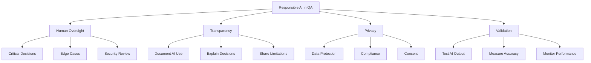

# AI Ethics & Limitations in Quality Assurance

## Purpose
Establish guidelines for responsible AI use in QA, understanding limitations, avoiding pitfalls, and ensuring human oversight maintains quality standards and ethical practices.

## Context
AI is a powerful tool, but it's not infallible. Understanding where AI excels, where it fails, and how to use it responsibly is critical for successful adoption without compromising quality or ethics.

## Prerequisites
- Understanding of [AI Fundamentals](ai-fundamentals.md)
- Familiarity with [AI-Assisted Testing](ai-assisted-testing.md)
- Awareness of your organization's compliance requirements

## Core Principles



## AI Limitations

### 1. Hallucinations

**What it is:** AI generating plausible but incorrect information confidently

**Examples in QA:**

```python
# AI might generate a test that looks correct but isn't
# ❌ WRONG - AI hallucinated a method that doesn't exist
test('user authentication', () => {
    const user = authenticateUser('john@example.com', 'password');
    expect(user.isVerified()).toBe(true);  # isVerified() doesn't exist!
});

# ✅ CORRECT - After human review
test('user authentication', () => {
    const user = authenticateUser('john@example.com', 'password');
    expect(user.verified).toBe(true);  # Actual property name
});
```

**Prevention Strategy:**
```yaml
mandatory_review_checklist:
  - [ ] Does the code compile/run?
  - [ ] Are all methods/properties real?
  - [ ] Do assertions make logical sense?
  - [ ] Are edge cases actually covered?
  - [ ] Does it test what it claims to test?
```

### 2. Context Limitations

**Problem:** AI has limited context window, may miss important details

**Example:**
```python
# File 1: user.py
class User:
    def __init__(self, email):
        self.email = email
        self._verified = False  # Note: private property

# File 2: test_user.py generated by AI
# ❌ AI doesn't know _verified is private
def test_user_verification():
    user = User('test@example.com')
    assert user._verified == False  # Accessing private property!

# ✅ Should use public interface
def test_user_verification():
    user = User('test@example.com')
    assert not user.is_verified()  # Proper public method
```

**Mitigation:**
```python
# Provide more context to AI
prompt = f"""
Generate tests for User class.

Important context:
- Properties starting with _ are private
- Use public methods: is_verified(), get_email()
- Never access private properties in tests

Class definition:
{user_class_code}
"""
```

### 3. Outdated Information

**Problem:** AI training data has a cutoff date

**Example:**
```javascript
// AI might suggest outdated testing patterns
// ❌ OLD - Pre-2020 pattern
const { shallow } = require('enzyme');  // Enzyme is deprecated

test('renders button', () => {
  const wrapper = shallow(<Button />);
  expect(wrapper.find('button')).toHaveLength(1);
});

// ✅ NEW - Current best practice
import { render, screen } from '@testing-library/react';

test('renders button', () => {
  render(<Button />);
  expect(screen.getByRole('button')).toBeInTheDocument();
});
```

**Prevention:**
```yaml
update_prompts_with:
  - Current framework versions
  - Deprecated patterns to avoid
  - Team's coding standards
  - Recent changes in codebase
```

### 4. Bias in Training Data

**Problem:** AI learns from internet code, including bad practices

**Example:**
```python
# AI might suggest biased or problematic code
# ❌ BIASED - Assumes gender
def test_user_profile():
    user = User(name="Chris")
    assert user.title == "Mr."  # Assumes male!

# ✅ UNBIASED - No assumptions
def test_user_profile():
    user = User(name="Chris")
    assert user.title in ["Mr.", "Mrs.", "Ms.", "Mx.", "Dr.", None]
```

**Mitigation:**
- Review all AI suggestions for bias
- Educate team on common bias patterns
- Configure linters to catch problematic code
- Maintain team standards document for AI reference

### 5. Security Blindspots

**Problem:** AI may miss security implications

**Example:**
```javascript
// AI generates test that seems fine but has security issue
// ❌ INSECURE - Hardcoded credentials in test
test('admin login', async () => {
  const response = await request(app)
    .post('/login')
    .send({
      username: 'admin@company.com',
      password: 'AdminPass123!'  // ❌ Real password in code!
    });
  expect(response.status).toBe(200);
});

// ✅ SECURE - Use environment variables or mocks
test('admin login', async () => {
  const testUser = await createTestUser('admin');
  const response = await request(app)
    .post('/login')
    .send({
      username: testUser.email,
      password: testUser.password
    });
  expect(response.status).toBe(200);
  await deleteTestUser(testUser.id);
});
```

**Security Review Checklist:**
```yaml
ai_generated_code_security_review:
  credentials:
    - [ ] No hardcoded passwords
    - [ ] No API keys in code
    - [ ] No tokens or secrets
    - [ ] Uses environment variables

  data_exposure:
    - [ ] No PII in logs
    - [ ] No sensitive data in assertions
    - [ ] Proper data sanitization
    - [ ] Test data is synthetic

  vulnerabilities:
    - [ ] No SQL injection patterns
    - [ ] No XSS vulnerabilities
    - [ ] No insecure deserialization
    - [ ] Proper input validation
```

## Ethical Guidelines

### 1. Data Privacy

**Principle:** Never send sensitive data to public AI services

**What NOT to send:**
```yaml
never_send_to_public_apis:
  - Customer PII (names, emails, addresses)
  - Authentication credentials
  - API keys and secrets
  - Proprietary algorithms
  - Trade secrets
  - Patient health information (HIPAA)
  - Financial data (PCI-DSS)
  - Source code marked confidential
```

**Safe Practices:**
```python
# ❌ BAD - Sending real user data to OpenAI
prompt = f"Generate tests for user {real_user_email} with password {real_password}"

# ✅ GOOD - Sanitize before sending
prompt = f"Generate tests for user [REDACTED_EMAIL] with password [REDACTED]"

# ✅ BETTER - Use synthetic data
prompt = f"Generate tests for user test@example.com with password test123"

# ✅ BEST - Use local model for sensitive code
local_llm = OllamaClient()
response = local_llm.generate(prompt_with_sensitive_data)
```

**Data Classification:**
```yaml
data_classification:
  public:
    description: "Can be freely shared"
    examples: ["Public documentation", "Open source code"]
    ai_usage: "Any AI service OK"

  internal:
    description: "For company use only"
    examples: ["Internal docs", "Process flows"]
    ai_usage: "Approved vendors with DPA"

  confidential:
    description: "Restricted access"
    examples: ["Source code", "Architecture"]
    ai_usage: "Local models only"

  restricted:
    description: "Highest sensitivity"
    examples: ["Credentials", "PII", "Trade secrets"]
    ai_usage: "Never use AI"
```

### 2. Transparency

**Principle:** Be clear when AI is used

**Documentation Requirements:**
```markdown
# Test Suite Documentation

## AI-Generated Tests
The following test files were AI-assisted:
- `user_authentication.test.js` - 70% AI-generated, reviewed by @john
- `api_integration.test.js` - 50% AI-generated, reviewed by @sarah
- `validation.test.js` - 30% AI-suggested edge cases

## Review Process
All AI-generated code must:
1. Be reviewed by senior engineer
2. Pass all existing tests
3. Meet coding standards
4. Be validated for correctness
5. Have reviewer sign-off in PR

## AI Tools Used
- GitHub Copilot for test scaffolding
- ChatGPT-4 for edge case suggestions
- Custom test generator (OpenAI API)
```

**Code Comments:**
```python
# AI-Generated test (Reviewed 2024-10-15 by John Doe)
# Original prompt: "Generate tests for email validation function"
# Modifications: Added edge cases for international domains
def test_email_validation():
    # AI-suggested test cases
    assert validate_email("user@example.com") == True
    assert validate_email("invalid") == False

    # Human-added edge cases
    assert validate_email("user@münchen.de") == True  # International
    assert validate_email("user+tag@example.com") == True  # Plus addressing
```

### 3. Human Oversight

**Principle:** Humans make final decisions, not AI

**Critical Decision Points:**
```yaml
requires_human_approval:
  deployment_decisions:
    description: "AI can recommend, humans decide"
    example: "AI predicts 85% success - human reviews and approves"

  security_issues:
    description: "AI can detect, humans triage and fix"
    example: "AI flags potential SQL injection - security team validates"

  test_exclusions:
    description: "AI can suggest, humans approve skipping tests"
    example: "AI recommends skipping slow tests - team decides"

  code_review_approval:
    description: "AI reviews, humans approve PRs"
    example: "AI finds 3 issues - human reviewer validates before merge"
```

**Escalation Matrix:**
```yaml
ai_confidence_levels:
  high_confidence_90_plus:
    action: "AI can auto-suggest"
    human_review: "Spot check (10% sampling)"
    example: "Formatting fixes, simple refactoring"

  medium_confidence_60_90:
    action: "AI suggests, human reviews all"
    human_review: "Required for every suggestion"
    example: "Test generation, code improvements"

  low_confidence_below_60:
    action: "AI provides options, human chooses"
    human_review: "Required + senior engineer sign-off"
    example: "Complex refactoring, architecture changes"

  security_critical:
    action: "AI assists research, human decides"
    human_review: "Security team approval required"
    example: "Authentication, authorization, encryption"
```

### 4. Fairness & Inclusion

**Principle:** Ensure AI doesn't perpetuate bias

**Test Data Diversity:**
```python
# ❌ BIASED - Only Western names
test_data = [
    {"name": "John Smith", "age": 30},
    {"name": "Jane Doe", "age": 25}
]

# ✅ INCLUSIVE - Diverse representation
test_data = [
    {"name": "John Smith", "age": 30, "locale": "en-US"},
    {"name": "田中太郎", "age": 25, "locale": "ja-JP"},
    {"name": "María García", "age": 35, "locale": "es-MX"},
    {"name": "محمد أحمد", "age": 28, "locale": "ar-SA"},
    {"name": "Nguyễn Văn A", "age": 32, "locale": "vi-VN"}
]
```

**Accessibility Testing:**
```javascript
// Ensure AI-generated tests include accessibility
describe('Button component', () => {
  // AI should generate accessibility tests
  test('has proper ARIA label', () => {
    render(<Button>Click me</Button>);
    expect(screen.getByRole('button')).toHaveAccessibleName('Click me');
  });

  test('is keyboard accessible', () => {
    const handleClick = jest.fn();
    render(<Button onClick={handleClick}>Submit</Button>);

    const button = screen.getByRole('button');
    button.focus();
    fireEvent.keyDown(button, { key: 'Enter' });

    expect(handleClick).toHaveBeenCalled();
  });
});
```

## Compliance & Legal

### GDPR Compliance

**Requirements:**
```yaml
gdpr_compliance:
  data_minimization:
    - Only send necessary data to AI
    - Anonymize PII before AI processing
    - Delete AI interaction logs with PII

  right_to_explanation:
    - Document AI decision-making process
    - Maintain audit trail of AI suggestions
    - Explain to users how AI is used

  data_protection:
    - Use EU-based AI services or local models
    - Ensure data processing agreements
    - Implement data retention policies
```

**Example Implementation:**
```python
class GDPRCompliantAIService:
    def __init__(self):
        self.anonymizer = DataAnonymizer()
        self.audit_log = AuditLogger()

    def process_with_ai(self, data, purpose):
        # 1. Anonymize PII
        anonymized = self.anonymizer.anonymize(data)

        # 2. Log processing
        self.audit_log.log({
            'timestamp': datetime.now(),
            'purpose': purpose,
            'data_categories': anonymized.categories,
            'ai_model': 'gpt-4-turbo',
            'retention': '30 days'
        })

        # 3. Process with AI
        result = self.ai_client.process(anonymized.data)

        # 4. Schedule deletion
        self.schedule_deletion(result.id, days=30)

        return result
```

### SOC 2 Compliance

**Requirements:**
```yaml
soc2_requirements:
  security:
    - [ ] AI tools have SOC 2 Type II certification
    - [ ] Access controls for AI services
    - [ ] Encryption in transit and at rest
    - [ ] Regular security audits

  availability:
    - [ ] SLA for AI service uptime
    - [ ] Fallback to manual processes
    - [ ] Monitoring and alerting

  confidentiality:
    - [ ] Data classification enforcement
    - [ ] Need-to-know access only
    - [ ] Confidential data not sent to AI

  privacy:
    - [ ] Privacy impact assessment completed
    - [ ] User consent obtained
    - [ ] Data retention policies enforced
```

## Cost Management & Sustainability

### Responsible Resource Use

**Environmental Impact:**
```yaml
ai_environmental_considerations:
  model_selection:
    problem: "Larger models consume more energy"
    solution: "Use smallest model that meets needs"
    example: "GPT-3.5 vs GPT-4: 10x energy difference"

  caching:
    problem: "Redundant API calls waste resources"
    solution: "Cache common responses"
    impact: "80% reduction in API calls"

  batch_processing:
    problem: "Individual requests less efficient"
    solution: "Batch similar requests"
    impact: "50% reduction in processing time"
```

**Cost Optimization Ethics:**
```python
# ❌ WASTEFUL - Unconstrained AI usage
def generate_tests_wasteful(code):
    # Sends entire file every time, no caching
    return openai.generate(f"Generate tests for:\n{code}")

# ✅ RESPONSIBLE - Optimized usage
def generate_tests_responsible(code):
    # Check cache first
    cache_key = hash(code)
    if cached := cache.get(cache_key):
        return cached

    # Use appropriate model size
    if len(code) < 1000:
        model = "gpt-3.5-turbo"  # Cheaper for simple tasks
    else:
        model = "gpt-4-turbo"

    # Set reasonable limits
    result = openai.generate(
        prompt=f"Generate tests for:\n{code}",
        model=model,
        max_tokens=1000,  # Don't over-generate
        temperature=0.1   # More deterministic = better caching
    )

    # Cache for reuse
    cache.set(cache_key, result, ttl=86400)
    return result
```

## Validation & Quality Assurance

### AI Output Validation

**Automated Checks:**
```python
class AIOutputValidator:
    def validate_generated_test(self, test_code, original_code):
        """Validate AI-generated test before accepting"""

        validation_results = {
            'syntax_valid': self.check_syntax(test_code),
            'imports_correct': self.check_imports(test_code),
            'functions_exist': self.check_functions_exist(test_code, original_code),
            'assertions_logical': self.check_assertions(test_code),
            'no_hardcoded_secrets': self.check_secrets(test_code),
            'follows_conventions': self.check_conventions(test_code),
            'has_descriptions': self.check_descriptions(test_code)
        }

        score = sum(validation_results.values()) / len(validation_results)

        return {
            'valid': score >= 0.8,
            'score': score,
            'checks': validation_results,
            'recommendation': self.get_recommendation(score)
        }

    def get_recommendation(self, score):
        if score >= 0.9:
            return "ACCEPT - High quality, minimal review needed"
        elif score >= 0.7:
            return "REVIEW - Acceptable, but requires human review"
        else:
            return "REJECT - Too many issues, regenerate or write manually"
```

### Monitoring AI Quality

**Metrics to Track:**
```yaml
ai_quality_metrics:
  accuracy:
    metric: "% of AI suggestions accepted"
    target: "> 70%"
    action_if_low: "Review prompts, retrain, or switch models"

  false_positives:
    metric: "% of AI-flagged issues that aren't real"
    target: "< 30%"
    action_if_high: "Adjust sensitivity, improve context"

  time_to_value:
    metric: "Time saved with AI vs manual"
    target: "> 50% reduction"
    action_if_low: "Optimize workflow, improve prompts"

  user_satisfaction:
    metric: "Team rating of AI helpfulness"
    target: "> 7/10"
    action_if_low: "Gather feedback, adjust tools"
```

## Incident Response

### When AI Goes Wrong

**Response Plan:**
```yaml
ai_incident_levels:
  p1_critical:
    examples:
      - AI suggested code with security vulnerability that was merged
      - Sensitive data sent to public API
      - AI-generated test masked critical bug

    response:
      - [ ] Immediately stop AI system
      - [ ] Assess impact (what was affected)
      - [ ] Rollback affected changes
      - [ ] Notify security team
      - [ ] Conduct postmortem
      - [ ] Update safeguards

  p2_high:
    examples:
      - AI generated incorrect tests (caught in review)
      - High false positive rate causing alert fatigue
      - Cost spike from excessive API usage

    response:
      - [ ] Document incident
      - [ ] Review and improve validation
      - [ ] Update team training
      - [ ] Adjust AI configuration
      - [ ] Monitor for recurrence

  p3_medium:
    examples:
      - AI suggestion quality decline
      - User complaints about relevance
      - Increased review time

    response:
      - [ ] Investigate root cause
      - [ ] Optimize prompts
      - [ ] Consider model update
      - [ ] Gather user feedback
```

**Postmortem Template:**
```markdown
# AI Incident Postmortem

## Incident Summary
- **Date**: 2024-10-15
- **Duration**: 2 hours
- **Severity**: P1 - Critical
- **Impact**: 3 security vulnerabilities in production

## What Happened
AI test generator created tests with hardcoded credentials that passed code review and were deployed to production.

## Root Cause
1. AI generated tests with real-looking but insecure patterns
2. Human reviewer assumed AI output was secure
3. No automated security scanning in CI/CD
4. Validation checks didn't catch hardcoded secrets

## Timeline
- 14:00: AI generated tests with hardcoded creds
- 14:30: PR approved and merged
- 16:00: Deployed to production
- 16:30: Security scan flagged issues
- 17:00: Rollback initiated
- 18:00: Issue resolved

## What Went Wrong
- ❌ Over-reliance on AI-generated code
- ❌ Inadequate code review process
- ❌ Missing automated security checks
- ❌ No secrets detection in CI/CD

## What Went Right
- ✅ Security scan caught issue
- ✅ Quick rollback process
- ✅ No customer data compromised
- ✅ Team responded effectively

## Action Items
- [ ] Add secrets detection to CI/CD (Owner: DevOps, Due: +1 week)
- [ ] Update AI validator to check for hardcoded secrets
- [ ] Mandatory security review for AI-generated code
- [ ] Team training on AI code review best practices
- [ ] Update documentation with this scenario

## Lessons Learned
1. AI is a tool, not a replacement for human judgment
2. Always validate AI output, especially for security
3. Defense in depth: multiple layers of checking
4. Regular training on AI limitations is essential
```

## Best Practices Summary

### DO's ✅

```yaml
always_do:
  - Review all AI-generated code
  - Validate AI suggestions before accepting
  - Use appropriate models for sensitivity level
  - Document AI usage and decisions
  - Maintain human oversight
  - Train team on AI limitations
  - Monitor AI quality metrics
  - Have fallback manual processes
  - Keep security top of mind
  - Respect data privacy
```

### DON'Ts ❌

```yaml
never_do:
  - Blindly trust AI output
  - Send sensitive data to public APIs
  - Skip code review for AI-generated code
  - Deploy AI suggestions without testing
  - Use AI for critical security decisions alone
  - Ignore AI failure patterns
  - Over-rely on AI without backups
  - Share proprietary code with public services
  - Assume AI understands context perfectly
  - Forget that AI can hallucinate
```

## Checklist: Responsible AI Implementation

```yaml
before_using_ai:
  - [ ] Data classification policy reviewed
  - [ ] Privacy impact assessment completed
  - [ ] Security review conducted
  - [ ] Team training on limitations provided
  - [ ] Validation process established
  - [ ] Escalation procedures defined
  - [ ] Monitoring plan in place
  - [ ] Incident response plan documented

during_ai_use:
  - [ ] All output reviewed by humans
  - [ ] Quality metrics tracked
  - [ ] User feedback collected
  - [ ] Costs monitored
  - [ ] Security regularly audited
  - [ ] Documentation kept up-to-date
  - [ ] Team satisfaction measured

after_ai_adoption:
  - [ ] Regular quality reviews
  - [ ] Continuous improvement based on feedback
  - [ ] Quarterly security audits
  - [ ] Annual ethics review
  - [ ] Cost optimization ongoing
  - [ ] Team skills development maintained
```

## Related Topics

- [AI Fundamentals](ai-fundamentals.md) - Understanding AI capabilities
- [AI Tool Ecosystem](ai-tool-ecosystem.md) - Selecting appropriate tools
- [Implementation Roadmap](implementation-roadmap.md) - Safe rollout strategy

---

*AI is a powerful tool when used responsibly. Always prioritize human judgment, data privacy, and ethical practices over automation convenience.*
