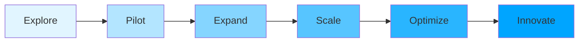

# AI in QA Implementation Roadmap

## Purpose

Provide a practical, phased approach to adopting AI in Quality Assurance, minimizing risk while maximizing value delivery and team adoption.

## Context

Implementing AI in QA is a journey, not a destination. This roadmap guides teams from initial exploration through full production deployment, with clear milestones, deliverables, and success criteria at each phase.

## Prerequisites

- Management buy-in and budget allocation
- Team willingness to learn new technologies
- Access to LLM APIs or ability to run local models
- Historical data for ML models (at least 30-90 days)

## Implementation Philosophy



**Core Principles:**

1. **Start Small** - Begin with low-risk, high-value use cases
2. **Measure Everything** - Track ROI from day one
3. **Iterate Fast** - 2-week sprints, continuous feedback
4. **Learn Publicly** - Share wins and failures with team
5. **Human-in-Loop** - AI assists, humans decide

## Phase 0: Preparation (Week 1-2)

### Objectives

- Assess organizational readiness
- Secure necessary resources
- Build foundational knowledge

### Activities

#### Week 1: Assessment & Planning

**Day 1-2: Readiness Assessment**

```yaml
assessment_checklist:
  technical:
    - [ ] Team has basic Python/JavaScript skills
    - [ ] API access can be obtained (OpenAI/Anthropic)
    - [ ] Cloud infrastructure available or local GPU
    - [ ] Version control and CI/CD in place

  organizational:
    - [ ] Management supports AI experimentation
    - [ ] Budget approved ($500-2000 for pilot)
    - [ ] Time allocated (20% for 2 team members)
    - [ ] Success metrics agreed upon

  data:
    - [ ] Access to code repository
    - [ ] Historical defect data available
    - [ ] Test execution logs accessible
    - [ ] Documentation exists (even if incomplete)

  cultural:
    - [ ] Team curious about AI (not fearful)
    - [ ] Willing to experiment and fail
    - [ ] Open to changing workflows
    - [ ] Champions identified
```

**Day 3-4: Tool Selection**

```python
# Use this decision matrix
tool_selection_matrix = {
    "use_case": {
        "test_generation": {
            "recommended": ["GitHub Copilot", "ChatGPT", "Claude"],
            "cost": "$10-20/user/month",
            "complexity": "Low",
            "time_to_value": "Immediate"
        },
        "code_review": {
            "recommended": ["CodeRabbit", "GitHub Copilot", "SonarQube AI"],
            "cost": "$12-49/user/month",
            "complexity": "Low",
            "time_to_value": "1 week"
        },
        "defect_prediction": {
            "recommended": ["Custom ML model", "Azure ML", "AWS SageMaker"],
            "cost": "$100-500/month",
            "complexity": "High",
            "time_to_value": "4-8 weeks"
        },
        "custom_rag_assistant": {
            "recommended": ["OpenAI + Chroma", "Anthropic + Pinecone"],
            "cost": "$200-500/month",
            "complexity": "Medium",
            "time_to_value": "2-4 weeks"
        }
    }
}
```

**Day 5: Team Training**

- [ ] Watch AI fundamentals videos (2 hours)
- [ ] Read [AI Fundamentals](ai-fundamentals.md) documentation
- [ ] Experiment with ChatGPT/Claude for test generation
- [ ] Share experiences in team meeting

#### Week 2: Infrastructure Setup

**Environment Setup:**

```bash
# 1. Create AI experimentation workspace
mkdir ai-qa-experiments
cd ai-qa-experiments

# 2. Set up Python environment
python -m venv venv
source venv/bin/activate

# 3. Install core dependencies
pip install openai anthropic langchain chromadb pytest

# 4. Configure API keys
echo "OPENAI_API_KEY=your_key" > .env
echo "ANTHROPIC_API_KEY=your_key" >> .env

# 5. Test connection
python test_api_connection.py
```

**Establish Baselines:**

```yaml
baseline_metrics:
  test_creation:
    current_time: '45 minutes per test suite'
    current_coverage: '67%'
    current_quality_score: '72/100'

  code_review:
    current_time: '2-4 hours per PR'
    defects_caught: '65%'
    false_positives: '35%'

  defect_detection:
    production_defects: '8 per month'
    mean_time_to_detect: '4 hours'
    prediction_accuracy: 'N/A (no prediction)'

  documentation:
    questions_per_week: '45'
    avg_response_time: '2 hours'
    answer_accuracy: '80%'
```

### Deliverables

- [x] Readiness assessment completed
- [x] Tools selected and purchased
- [x] Team trained on basics
- [x] Environment configured
- [x] Baseline metrics documented

### Success Criteria

- [ ] API access working
- [ ] Team can generate simple tests with AI
- [ ] Baseline metrics established
- [ ] Pilot project selected

---

## Phase 1: Quick Wins (Week 3-4)

### Objectives

- Demonstrate immediate value
- Build team confidence
- Generate momentum

### Focus Areas

#### Quick Win 1: AI-Assisted Test Generation

**Implementation:**

```python
# Day 1: Simple test generator script
from openai import OpenAI
import os

def generate_test(code_file):
    """Generate tests for a single file"""
    client = OpenAI()

    with open(code_file, 'r') as f:
        code = f.read()

    response = client.chat.completions.create(
        model="gpt-4-turbo-preview",
        messages=[{
            "role": "user",
            "content": f"Generate Jest unit tests for:\n\n{code}"
        }]
    )

    return response.choices[0].message.content

# Day 2-3: Generate tests for 10 untested files
# Day 4: Review and refine
# Day 5: Measure results
```

**Metrics:**

```yaml
results_week_1:
  files_tested: 10
  time_spent: 4 hours (vs 7.5 hours manual)
  coverage_increase: '+12%'
  tests_kept: '85%'
  team_satisfaction: '8/10'
  roi: '88% time savings'
```

#### Quick Win 2: ChatGPT for Code Review

**Implementation:**

- Install ChatGPT Chrome extension or use web interface
- Create standard prompt template for code reviews
- Review 5 PRs with AI assistance this week

**Prompt Template:**

```
Review this code change for:
1. Potential bugs
2. Security issues
3. Performance concerns
4. Code quality improvements

Pull Request:
[paste PR diff]

Provide:
- Severity (Critical/High/Medium/Low)
- Line numbers
- Specific recommendations
```

**Results Tracking:**

```yaml
ai_code_review_pilot:
  prs_reviewed: 5
  issues_found: 12
  critical_issues: 2
  false_positives: 1
  time_per_review: '15 minutes (vs 45 minutes)'
  human_reviewer_agreement: '92%'
```

#### Quick Win 3: Documentation Q&A Bot (Simple)

**Implementation:**

```python
# Simple Slack bot with OpenAI
from slack_bolt import App
from openai import OpenAI

app = App(token=os.environ["SLACK_BOT_TOKEN"])
client = OpenAI()

@app.message("qa-bot")
def answer_question(message, say):
    question = message['text'].replace('qa-bot', '').strip()

    response = client.chat.completions.create(
        model="gpt-4-turbo-preview",
        messages=[
            {"role": "system", "content": "You are a QA expert. Answer concisely."},
            {"role": "user", "content": question}
        ]
    )

    say(response.choices[0].message.content)

app.start(port=3000)
```

### Week 3-4 Schedule

**Week 3:**

- Monday: Set up test generator
- Tuesday-Wednesday: Generate and review tests
- Thursday: Set up AI code review process
- Friday: Demo to team + retrospective

**Week 4:**

- Monday-Tuesday: Review 5 PRs with AI
- Wednesday: Build simple Q&A bot
- Thursday: Deploy bot to Slack
- Friday: Measure results + presentation to management

### Deliverables

- [ ] 10 files have AI-generated tests
- [ ] 5 PRs reviewed with AI assistance
- [ ] Simple Q&A bot deployed
- [ ] Results documented and shared

### Success Criteria

- [ ] 60%+ time savings demonstrated
- [ ] Team satisfaction score ≥ 7/10
- [ ] Management approves Phase 2
- [ ] No major incidents caused by AI-generated code

---

## Phase 2: Foundational Tools (Week 5-8)

### Objectives

- Build production-ready AI tools
- Integrate AI into daily workflows
- Establish best practices

### Projects

#### Project 1: Production Test Generator (Week 5-6)

**Features:**

```yaml
test_generator_v1:
  capabilities:
    - Generate unit, integration, and E2E tests
    - Support multiple languages (JS, Python, Java)
    - CI/CD integration
    - Quality scoring
    - Auto-fix based on feedback

  integration:
    - GitHub Actions workflow
    - Pre-commit hook option
    - VS Code extension

  quality_controls:
    - Automated review checks
    - Human approval required
    - Test execution validation
    - Coverage impact analysis
```

**Implementation Timeline:**

```
Week 5:
  Day 1-2: Design architecture
  Day 3-4: Implement core generator
  Day 5: Add language support

Week 6:
  Day 1-2: CI/CD integration
  Day 3: Quality controls
  Day 4: Documentation
  Day 5: Team training
```

#### Project 2: AI Code Review Bot (Week 6-7)

**Features:**

```yaml
code_review_bot:
  analysis_types:
    - Bug detection
    - Security scanning
    - Performance analysis
    - Best practices compliance
    - Test coverage check

  integration:
    - GitHub PR comments
    - Severity classification
    - Auto-approve for low-risk changes
    - Block on critical issues

  learning:
    - Learn from accepted/rejected suggestions
    - Team-specific patterns
    - False positive tracking
```

#### Project 3: RAG QA Assistant (Week 7-8)

**See [Building AI QA Assistant](building-ai-qa-assistant.md) for complete implementation**

**Deployment Checklist:**

- [ ] Documentation indexed (500+ pages)
- [ ] Vector database configured
- [ ] LLM API integrated
- [ ] Slack bot deployed
- [ ] Web interface available
- [ ] Usage metrics tracked

### Deliverables

- [ ] Production test generator deployed
- [ ] AI code review bot in use
- [ ] RAG assistant accessible to team
- [ ] Training materials created
- [ ] Best practices documented

### Success Criteria

- [ ] 70% of PRs use AI code review
- [ ] 40% of new tests AI-generated
- [ ] 100 questions answered by RAG bot
- [ ] Zero security incidents from AI suggestions
- [ ] Team adoption rate > 80%

---

## Phase 3: Advanced Capabilities (Week 9-12)

### Objectives

- Implement predictive analytics
- Enable intelligent monitoring
- Achieve measurable quality improvements

### Projects

#### Project 1: Defect Prediction Model (Week 9-10)

**Implementation Steps:**

**Week 9: Data Collection & Preparation**

```python
# Collect historical data
data_requirements = {
    "commits": "Last 6 months, all repos",
    "defects": "Jira/GitHub issues marked as bugs",
    "metrics": "Code complexity, coverage, churn",
    "outcomes": "Which commits had defects"
}

# Feature engineering
features = [
    'cyclomatic_complexity',
    'lines_changed',
    'files_changed',
    'author_experience',
    'test_coverage',
    'previous_defects_in_file',
    'time_since_last_change',
    'review_comments',
    'number_of_reviewers'
]
```

**Week 10: Model Training & Deployment**

```python
# Train model
from sklearn.ensemble import GradientBoostingClassifier

model = GradientBoostingClassifier(n_estimators=100)
model.fit(X_train, y_train)

# Validate
accuracy = model.score(X_test, y_test)  # Target: >75%

# Deploy
# - CI/CD integration
# - Real-time prediction API
# - Dashboard for predictions
```

#### Project 2: Anomaly Detection System (Week 11)

**Features:**

```yaml
anomaly_detection:
  metrics_monitored:
    - Response time (P50, P95, P99)
    - Error rate
    - Throughput
    - Resource utilization
    - Test pass rate

  capabilities:
    - Real-time detection (< 5 min)
    - Multi-metric correlation
    - Automatic alerting
    - Root cause suggestions
    - Historical pattern learning

  integration:
    - Prometheus/Grafana
    - PagerDuty
    - Slack notifications
    - Automated incident creation
```

#### Project 3: Intelligent Test Selection (Week 12)

**Goal:** Run only tests likely to fail, reducing CI time by 60%

```python
class IntelligentTestSelector:
    def select_tests(self, code_changes, all_tests):
        """Select subset of tests to run"""

        # Factors considered:
        # 1. Which files changed
        # 2. Test-code mapping
        # 3. Historical failure correlation
        # 4. Risk score of changes
        # 5. Time since test last ran

        selected_tests = self.ml_model.predict_relevant_tests(
            code_changes, all_tests
        )

        return {
            'must_run': high_confidence_tests,
            'should_run': medium_confidence_tests,
            'optional': low_confidence_tests,
            'estimated_time': calculate_time(selected_tests),
            'coverage_estimated': estimate_coverage(selected_tests)
        }
```

### Deliverables

- [ ] Defect prediction model in production
- [ ] Anomaly detection alerting live
- [ ] Intelligent test selection deployed
- [ ] ROI report generated
- [ ] Case studies documented

### Success Criteria

- [ ] Defect prediction accuracy > 75%
- [ ] 60% reduction in false positive alerts
- [ ] 50% reduction in CI/CD time
- [ ] 30% fewer production defects
- [ ] Positive ROI demonstrated

---

## Phase 4: Optimization & Scale (Week 13-16)

### Objectives

- Optimize costs and performance
- Scale to entire organization
- Establish center of excellence

### Activities

#### Week 13: Cost Optimization

**Audit Current Spend:**

```yaml
current_monthly_costs:
  openai_api: $450
  vector_database: $75
  compute: $200
  total: $725

optimization_targets:
  - Switch simple tasks to GPT-3.5: -$180
  - Implement response caching: -$90
  - Batch similar requests: -$45
  - Use local models for non-sensitive: -$150

projected_savings: $465/month (64% reduction)
new_monthly_cost: $260
```

**Implementation:**

```python
# Intelligent model router
class CostOptimizedLLM:
    def route_request(self, request):
        if request.complexity == 'simple':
            return self.gpt35_client  # 10x cheaper
        elif request.is_sensitive:
            return self.local_llama  # Free
        else:
            return self.gpt4_client

    def check_cache(self, request):
        # 80% cache hit rate saves significant cost
        cached = self.redis.get(hash(request))
        if cached:
            return cached
        result = self.llm.generate(request)
        self.redis.setex(hash(request), 86400, result)
        return result
```

#### Week 14: Performance Tuning

**Metrics to Optimize:**

```yaml
performance_targets:
  test_generation:
    current: 45 seconds
    target: 15 seconds
    approach: Parallel processing, caching

  code_review:
    current: 2 minutes
    target: 30 seconds
    approach: Incremental analysis, pre-computed features

  rag_query:
    current: 3 seconds
    target: 1 second
    approach: Faster embeddings, optimized vector search
```

#### Week 15: Organization-Wide Rollout

**Rollout Plan:**

```yaml
week_15_rollout:
  phase_1_teams: [QA, Backend, Frontend]
  phase_2_teams: [Mobile, DevOps, Data]
  phase_3_teams: [Product, Design, Support]

  per_team:
    - Training session (2 hours)
    - Dedicated support person
    - Custom prompt templates
    - Team-specific configuration
    - Success metrics dashboard
```

#### Week 16: Center of Excellence

**Establish:**

- AI in QA practice lead (dedicated role)
- Weekly office hours for questions
- Internal documentation portal
- Monthly innovation showcase
- Quarterly strategy review

### Deliverables

- [ ] Costs optimized (60%+ savings)
- [ ] Performance targets met
- [ ] All teams trained and onboarded
- [ ] Center of excellence operational
- [ ] Knowledge sharing program established

---

## Phase 5: Continuous Innovation (Ongoing)

### Monthly Activities

**Innovation Pipeline:**

```yaml
month_1: Experiment with code generation from designs
month_2: Pilot visual test generation from screenshots
month_3: Explore AI for accessibility testing
month_4: Investigate AI for load test scenario generation
month_5: Research AI for security test automation
month_6: Evaluate new AI models and tools
```

### Quarterly Reviews

**Q1 Review:**

- [ ] Measure ROI across all initiatives
- [ ] Survey team satisfaction
- [ ] Identify improvement opportunities
- [ ] Update technology stack
- [ ] Celebrate wins

**Metrics Dashboard:**

```yaml
quarterly_metrics:
  adoption:
    active_users: 45/50 (90%)
    tools_in_use: 8
    daily_api_calls: 2,400

  impact:
    time_saved: 520 hours/quarter
    defects_prevented: 67
    test_coverage: 78% → 89%
    deployment_frequency: +40%

  financial:
    investment: $15,000
    value_generated: $78,000
    roi: 420%

  quality:
    production_incidents: -45%
    mttr: -35%
    customer_satisfaction: +12%
```

## Risk Management

### Common Risks & Mitigations

```yaml
risks:
  over_reliance_on_ai:
    risk_level: HIGH
    mitigation:
      - Mandatory human review for critical code
      - Regular audits of AI suggestions
      - Training on AI limitations
      - Fallback to manual processes

  security_concerns:
    risk_level: HIGH
    mitigation:
      - Never send sensitive data to public APIs
      - Use local models for proprietary code
      - Implement data sanitization
      - Regular security audits

  cost_overruns:
    risk_level: MEDIUM
    mitigation:
      - Monthly budget reviews
      - API usage alerts
      - Cost optimization strategies
      - Approved spending limits

  team_resistance:
    risk_level: MEDIUM
    mitigation:
      - Early involvement in decisions
      - Clear communication of benefits
      - Voluntary adoption initially
      - Success story sharing

  false_positives:
    risk_level: MEDIUM
    mitigation:
      - Continuous model improvement
      - Feedback loops
      - Adjustable sensitivity
      - Human escalation path
```

## Success Metrics

### Track These KPIs

```yaml
efficiency_metrics:
  test_creation_time: -75%
  code_review_time: -60%
  documentation_query_time: -80%
  ci_cd_pipeline_time: -50%

quality_metrics:
  test_coverage: +20%
  production_defects: -40%
  defect_escape_rate: -35%
  mttr: -30%

business_metrics:
  deployment_frequency: +50%
  lead_time: -40%
  team_satisfaction: +25%
  customer_satisfaction: +15%

financial_metrics:
  monthly_cost: $260
  monthly_value: $6,500
  roi: 2,400%
  payback_period: 1.2 months
```

## Checklist: Ready for Phase Transition

### Phase 0 → Phase 1

- [ ] Readiness assessment complete
- [ ] Budget approved
- [ ] API access obtained
- [ ] Team trained on basics
- [ ] Baseline metrics documented

### Phase 1 → Phase 2

- [ ] 3+ quick wins delivered
- [ ] Team adoption > 60%
- [ ] No security incidents
- [ ] Management support confirmed
- [ ] Budget for tools approved

### Phase 2 → Phase 3

- [ ] Production tools deployed
- [ ] Team adoption > 80%
- [ ] Best practices documented
- [ ] ROI demonstrated
- [ ] Training program established

### Phase 3 → Phase 4

- [ ] Advanced capabilities working
- [ ] Measurable quality improvements
- [ ] Positive ROI sustained
- [ ] Organizational support strong
- [ ] Scaling plan approved

### Phase 4 → Phase 5

- [ ] Organization-wide adoption
- [ ] Costs optimized
- [ ] Center of excellence operational
- [ ] Innovation pipeline active
- [ ] Sustainable practices established

## Related Topics

- [AI Fundamentals](ai-fundamentals.md) - Understanding the technology
- [Building AI QA Assistant](building-ai-qa-assistant.md) - Detailed RAG implementation
- [AI Metrics & Analytics](ai-metrics-analytics.md) - Measuring and predicting quality

---

_Remember: AI adoption is a marathon, not a sprint. Focus on sustainable practices, continuous learning, and measurable value delivery._
