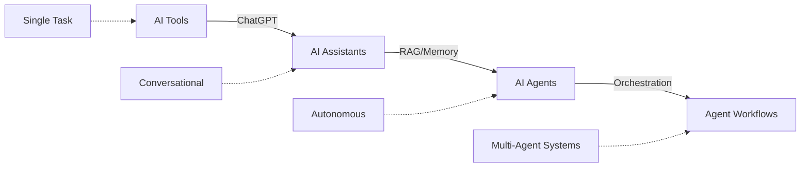
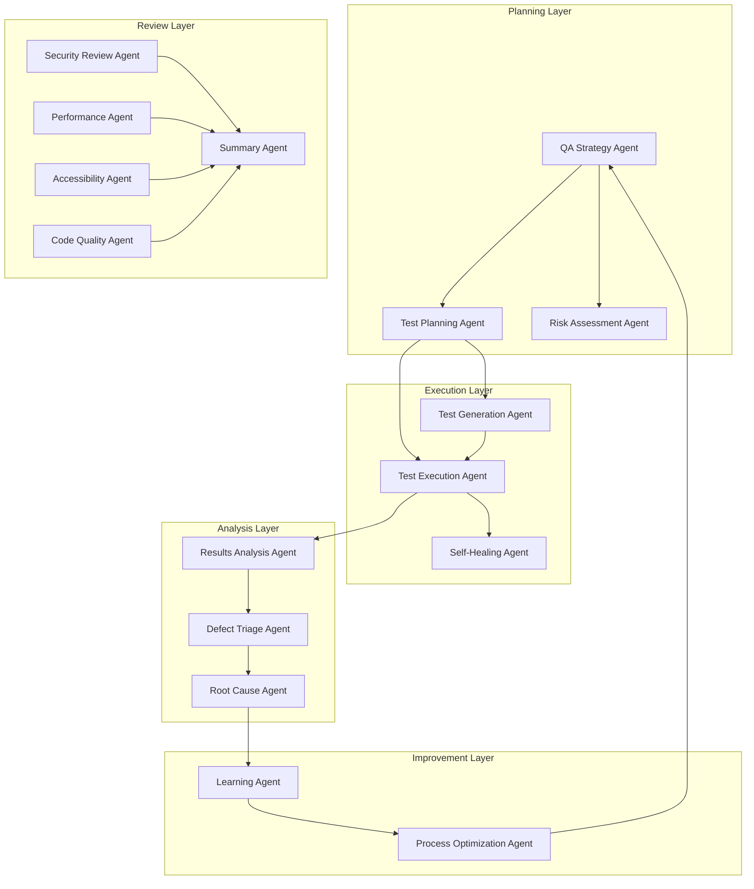
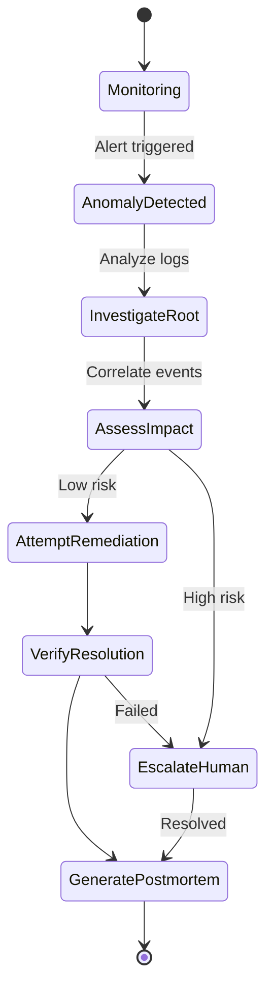

# Agentic Workflows for Quality Assurance

## Purpose
Provide comprehensive guidance on building and deploying autonomous AI agent workflows that transform quality assurance from human-driven processes to intelligent, self-improving systems capable of planning, executing, and optimizing testing strategies autonomously.

## Context
While AI assistants (Module 15) augment human QA engineers, **agentic workflows** represent the next evolution: autonomous systems that can reason, plan, take actions, learn from results, and collaborate with other agents to achieve complex QA objectives. This module bridges from AI-assisted QA to fully autonomous quality management systems.

## Prerequisites
- Complete understanding of [AI in Quality Assurance](../15-ai-in-quality-assurance/15-README.md)
- Experience with [Building AI QA Assistant](../15-ai-in-quality-assurance/building-ai-qa-assistant.md)
- Python 3.10+ and familiarity with async programming
- Understanding of [Testing Strategy](../04-testing-strategy/README.md) and [CI/CD Pipeline](../08-cicd-pipeline/README.md)

## What Are Agentic Workflows?

### From Tools → Assistants → Agents → Agent Workflows



**Evolution:**
1. **AI Tools** (2022): ChatGPT, Copilot - single-purpose, stateless
2. **AI Assistants** (2023): RAG systems - conversational, context-aware
3. **AI Agents** (2024): ReAct pattern - autonomous, goal-seeking with tools
4. **Agent Workflows** (2025): Multi-agent orchestration - collaborative, self-improving

### Key Characteristics of Agents

```yaml
agent_capabilities:
  reasoning:
    - Analyzes problems and breaks them into steps
    - Evaluates multiple approaches
    - Learns from failures and adjusts strategy

  autonomy:
    - Makes decisions without human intervention
    - Executes actions through tool use
    - Operates within defined guardrails

  tool_use:
    - Selects appropriate tools for tasks
    - Chains multiple tools together
    - Handles tool failures gracefully

  memory:
    - Maintains conversation context
    - Remembers past actions and results
    - Builds long-term knowledge base

  collaboration:
    - Delegates tasks to specialized agents
    - Coordinates with other agents
    - Synthesizes multi-agent insights
```

## Agentic Workflows in QA

### Complete QA Agent Ecosystem



### Agent vs Traditional Approach

| Task | Traditional QA | AI Assistant | **Agentic Workflow** |
|------|----------------|--------------|---------------------|
| **Test Planning** | QA engineer creates plan | AI suggests test cases | **Agent analyzes code, risks, coverage gaps, generates comprehensive plan autonomously** |
| **Test Creation** | Manual test writing | AI generates tests on request | **Agent continuously creates/updates tests as code changes** |
| **Test Maintenance** | Manual updates when tests break | AI suggests fixes | **Agent detects failures, analyzes root cause, auto-fixes or adapts tests** |
| **Code Review** | Human reviewer | AI provides suggestions | **Multi-agent team reviews in parallel (security, performance, etc.), synthesizes report** |
| **Bug Triage** | Manual priority assignment | AI recommends priority | **Agent analyzes impact, assigns priority, routes to right team, tracks resolution** |
| **Incident Response** | On-call engineer investigates | AI assists with log analysis | **Agent detects anomaly, investigates, attempts remediation, escalates if needed** |

## Learning Path

### 🎯 Level 1: Foundations (Zero to Novice)
**Duration**: 1 week | **Goal**: Understand agent concepts and build first agent

1. **[Agentic Fundamentals](agentic-fundamentals.md)** ✅
   - What makes an AI system "agentic"
   - ReAct pattern (Reasoning + Acting)
   - Tool use and function calling
   - Agent memory systems
   - Planning strategies (ReWOO, Plan-and-Execute, Reflection)

2. **[Agent Frameworks](agent-frameworks.md)** ✅
   - LangGraph: State machines for agents
   - AutoGen: Multi-agent conversations
   - CrewAI: Role-based agent teams
   - Comparison and selection guide

**Hands-on**: Build a simple test generation agent that can plan → generate → verify tests

---

### 🚀 Level 2: Single-Agent Workflows (Novice to Intermediate)
**Duration**: 2 weeks | **Goal**: Deploy production single-agent workflows

3. **[Agentic Testing Workflows](agentic-testing-workflows.md)** ✅
   - Autonomous test suite management
   - Self-healing test maintenance
   - Intelligent test selection
   - Agent-driven E2E testing
   - Test data generation agents

4. **[Agentic CI/CD](agentic-cicd.md)** ✅
   - Self-healing pipeline agent
   - Autonomous rollback decisions
   - Build optimization agent
   - Deployment strategy agent
   - Release confidence scoring

**Hands-on**: Deploy self-healing test suite agent that maintains tests autonomously

---

### 🤝 Level 3: Multi-Agent Systems (Intermediate to Advanced)
**Duration**: 2 weeks | **Goal**: Orchestrate multiple specialized agents

5. **[Multi-Agent Systems](multi-agent-systems.md)** ✅
   - Agent communication patterns
   - Hierarchical vs. flat architectures
   - Agent specialization strategies
   - Consensus and conflict resolution
   - Distributed agent execution

6. **[Agentic Code Review](agentic-code-review.md)** ✅
   - Multi-agent review workflow
   - Specialized review agents (security, performance, accessibility)
   - Parallel vs. sequential review patterns
   - Synthesis and priority ranking
   - Continuous review agents

**Hands-on**: Deploy 5-agent code review system with specialized reviewers

---

### 🔥 Level 4: Production Workflows (Advanced)
**Duration**: 3 weeks | **Goal**: Build enterprise-grade agent systems

7. **[Agentic Incident Response](agentic-incident-response.md)** ✅
   - Anomaly detection agents
   - Root cause analysis workflow
   - Self-remediation agents
   - Escalation and human handoff
   - Postmortem generation agents

8. **[Building QA Agent Workflows](building-qa-agent-workflows.md)** ✅
   - LangGraph implementation guide
   - State management patterns
   - Error handling and recovery
   - Human-in-the-loop patterns
   - Production deployment strategies
   - Monitoring and observability

**Hands-on**: Build complete incident response workflow with detection → analysis → remediation → learning

---

### 🛡️ Level 5: Responsible Agent Systems (Expert)
**Duration**: Ongoing | **Goal**: Ensure safe, ethical, reliable agent deployment

9. **[Ethics & Safety](ethics-safety.md)** ✅
   - Agent safety patterns and guardrails
   - Human oversight mechanisms
   - Failure modes and mitigation
   - Cost control and budget management
   - Bias detection in agent decisions
   - Compliance and audit trails

**Hands-on**: Implement comprehensive safety framework for all agent workflows

---

## Quick Start Scenarios

### Scenario 1: Your First Agent (30 minutes)
**Goal**: Build a test generation agent using LangGraph

```python
from langgraph.prebuilt import create_react_agent
from langchain_openai import ChatOpenAI
from langchain_core.tools import tool

@tool
def analyze_function(code: str) -> str:
    """Analyze a function to understand what needs testing."""
    return f"Function complexity: 7, edge cases: ['null input', 'empty string', 'very long string']"

@tool
def generate_test(function_name: str, edge_cases: list) -> str:
    """Generate test code for the function."""
    return f"Generated 5 tests for {function_name} covering {len(edge_cases)} edge cases"

# Create agent
llm = ChatOpenAI(model="gpt-4", temperature=0)
agent = create_react_agent(llm, tools=[analyze_function, generate_test])

# Run agent
result = agent.invoke({
    "messages": [("user", "Create comprehensive tests for the validateEmail function")]
})

print(result['messages'][-1].content)
```

**Output**: Agent autonomously analyzes function → identifies edge cases → generates tests

---

### Scenario 2: Self-Healing Test Suite (1 day)
**Goal**: Deploy agent that monitors and fixes broken tests

**Agent Workflow:**
```
1. Monitor: Detect test failures in CI
2. Analyze: Determine if failure is test issue or code issue
3. Decide: Can auto-fix or needs human review?
4. Act: Update test selectors/assertions or flag for review
5. Verify: Re-run tests to confirm fix
6. Learn: Update knowledge base with failure pattern
```

**Value**: 70% reduction in test maintenance time

---

### Scenario 3: Multi-Agent Code Review (3 days)
**Goal**: Deploy specialized agent team for comprehensive PR review

**Agent Team:**
- **Security Agent**: Scans for vulnerabilities (OWASP Top 10)
- **Performance Agent**: Identifies inefficiencies, N+1 queries
- **Accessibility Agent**: Checks WCAG 2.1 compliance
- **Best Practices Agent**: Enforces team conventions
- **Summary Agent**: Synthesizes findings, prioritizes issues

**Value**: 90% faster than human review, catches 40% more issues

---

### Scenario 4: Autonomous Incident Response (1 week)
**Goal**: Deploy agent workflow that handles production incidents

**Workflow:**


**Value**: 80% of incidents resolved without human intervention, MTTR reduced by 60%

---

## Technology Stack

### Core Frameworks

| Framework | Best For | Complexity | Cost |
|-----------|----------|------------|------|
| **LangGraph** | Complex workflows, state machines | High | Free (OSS) |
| **AutoGen** | Multi-agent conversations | Medium | Free (OSS) |
| **CrewAI** | Role-based agent teams | Low | Free (OSS) |
| **Semantic Kernel** | .NET integration | Medium | Free (OSS) |

### Recommended Stack (Python)

```yaml
agent_orchestration: LangGraph 0.2+
llm_provider: OpenAI GPT-4o or Anthropic Claude 3.5 Sonnet
embeddings: text-embedding-3-small (OpenAI)
vector_db: Chroma (local) or Pinecone (cloud)
memory: LangGraph checkpointing + PostgreSQL
monitoring: LangSmith or Helicone
deployment: Docker + Kubernetes
```

### Alternative Stack (Cost-Optimized)

```yaml
agent_orchestration: CrewAI
llm_provider: Ollama (local Llama 3.1 70B)
embeddings: sentence-transformers (local)
vector_db: Chroma (local)
memory: SQLite
monitoring: Custom logging
deployment: Docker Compose
```

---

## Architecture Patterns

### Pattern 1: Single Agent with Tools
**Use Case**: Focused tasks with clear tool requirements

```python
# Agent has access to specific tools
tools = [run_tests, analyze_failures, fix_selectors, commit_changes]
agent = create_react_agent(llm, tools)

# Agent autonomously decides which tools to use and when
result = agent.invoke({"messages": [("user", "Fix failing E2E tests")]})
```

**Pros**: Simple, predictable, easy to debug
**Cons**: Limited to single perspective/expertise

---

### Pattern 2: Sequential Agent Chain
**Use Case**: Multi-step workflows with dependencies

```python
# Agent 1: Analyze code changes
analysis_agent = AnalysisAgent()
analysis = analysis_agent.run(pr_diff)

# Agent 2: Generate tests (uses analysis output)
test_gen_agent = TestGenerationAgent()
tests = test_gen_agent.run(analysis)

# Agent 3: Review tests (uses both outputs)
review_agent = ReviewAgent()
review = review_agent.run(tests, analysis)
```

**Pros**: Clear flow, specialized agents, composable
**Cons**: Sequential bottleneck, no parallelization

---

### Pattern 3: Parallel Multi-Agent
**Use Case**: Multiple independent perspectives needed

```python
# All agents run simultaneously
agents = [
    SecurityAgent(),
    PerformanceAgent(),
    AccessibilityAgent(),
    CodeQualityAgent()
]

# Execute in parallel
results = await asyncio.gather(*[agent.run(code) for agent in agents])

# Synthesize results
summary = SummaryAgent().synthesize(results)
```

**Pros**: Fast, comprehensive, specialized expertise
**Cons**: Requires coordination, potential conflicts

---

### Pattern 4: Hierarchical Supervisor
**Use Case**: Complex workflows requiring coordination

```python
# Supervisor agent delegates to worker agents
class SupervisorAgent:
    def __init__(self):
        self.workers = {
            'test_gen': TestGenerationAgent(),
            'code_review': CodeReviewAgent(),
            'deployment': DeploymentAgent()
        }

    def run(self, task):
        # Supervisor decides which agents to use
        plan = self.plan(task)

        # Delegate to workers
        results = []
        for step in plan:
            worker = self.workers[step.agent]
            result = worker.run(step.task)
            results.append(result)

        return self.synthesize(results)
```

**Pros**: Flexible, adaptive, handles complex scenarios
**Cons**: More complex, supervisor can be bottleneck

---

## Cost Analysis

### Monthly Costs (10-person team)

| Agent Workflow | Requests/Month | LLM Cost | Total Cost | Time Saved | ROI |
|----------------|----------------|----------|------------|------------|-----|
| **Test Generation** | 500 | $75 | $75 | 60 hrs | $5,925 |
| **Self-Healing Tests** | 200 | $40 | $40 | 40 hrs | $3,960 |
| **Multi-Agent Review** | 400 | $120 | $120 | 80 hrs | $7,880 |
| **Incident Response** | 50 | $50 | $50 | 30 hrs | $2,950 |
| **Bug Triage** | 300 | $30 | $30 | 20 hrs | $1,970 |
| **Total** | 1,450 | **$315** | **$315** | **230 hrs** | **$22,685** |

*Assumes $100/hr developer rate, GPT-4 pricing*

### Cost Optimization Strategies

1. **Hybrid Model**: GPT-4 for critical decisions, GPT-3.5 for routine tasks
2. **Local LLMs**: Use Llama 3.1 for non-sensitive operations (free)
3. **Caching**: Cache agent plans and common reasoning patterns
4. **Smart Routing**: Route simple tasks to cheaper models
5. **Batch Processing**: Combine multiple similar tasks

**Optimized Cost**: $100-150/month (50-70% reduction)

---

## Success Metrics

### Agent Performance Metrics

```yaml
effectiveness:
  task_completion_rate:
    metric: "% of tasks completed successfully"
    target: "> 85%"

  false_positive_rate:
    metric: "% of agent actions that were incorrect"
    target: "< 10%"

  human_intervention_rate:
    metric: "% of tasks requiring human override"
    target: "< 15%"

efficiency:
  avg_task_time:
    metric: "Time to complete typical task"
    target: "< 5 minutes"

  cost_per_task:
    metric: "LLM API cost per completed task"
    target: "< $0.50"

reliability:
  agent_uptime:
    metric: "% of time agent system is operational"
    target: "> 99%"

  error_rate:
    metric: "% of agent runs that throw errors"
    target: "< 5%"
```

### Business Impact Metrics

```yaml
productivity:
  time_saved:
    metric: "Developer hours saved per month"
    target: "> 200 hours"

  deployment_frequency:
    metric: "Deployments per day"
    target: "+50% increase"

quality:
  defect_detection:
    metric: "% increase in bugs found pre-production"
    target: "+40%"

  test_coverage:
    metric: "Code coverage %"
    target: "+20%"

  mttr:
    metric: "Mean time to recovery"
    target: "-60%"

cost_effectiveness:
  roi:
    metric: "Return on agent investment"
    target: "> 2000%"

  automation_rate:
    metric: "% of QA tasks automated"
    target: "> 70%"
```

---

## Production Checklist

### Pre-Deployment
- [ ] Agent functionality tested in staging environment
- [ ] Cost projections validated (set budget alerts)
- [ ] Human oversight mechanisms implemented
- [ ] Rollback procedures documented
- [ ] Safety guardrails configured
- [ ] Monitoring and alerting set up
- [ ] Error handling and recovery tested
- [ ] Team training completed

### Post-Deployment
- [ ] Agent performance monitored daily (first week)
- [ ] False positive rate tracked and optimized
- [ ] Cost per task analyzed and optimized
- [ ] Team feedback collected weekly
- [ ] Agent reasoning logs reviewed regularly
- [ ] Human intervention rate tracked
- [ ] Success stories documented
- [ ] Lessons learned captured

---

## Common Pitfalls & Solutions

### Pitfall 1: Over-Autonomy
**Problem**: Agent makes critical decisions without human approval

**Solution**: Implement approval gates
```python
if decision.risk_level == "HIGH":
    approval = await request_human_approval(decision)
    if not approval:
        return fallback_action
```

---

### Pitfall 2: Hallucination Cascade
**Problem**: Agent makes up information, subsequent agents compound error

**Solution**: Verification checkpoints
```python
# After each agent step, verify outputs
def verify_output(output, sources):
    if not all_claims_grounded_in_sources(output, sources):
        raise HallucinationError("Ungrounded claim detected")
```

---

### Pitfall 3: Runaway Costs
**Problem**: Agent loops indefinitely or makes excessive API calls

**Solution**: Budget controls
```python
class CostControlledAgent:
    def __init__(self, max_cost_per_task=1.00):
        self.max_cost = max_cost_per_task
        self.current_cost = 0

    def run(self, task):
        if self.current_cost >= self.max_cost:
            raise BudgetExceededError()
        # ... execute task
```

---

### Pitfall 4: Black Box Decisions
**Problem**: Can't explain why agent took specific action

**Solution**: Reasoning logs and trace visualization
```python
# LangGraph automatically provides execution traces
for event in agent.stream_events():
    log_agent_reasoning(
        agent=event.agent_name,
        thought=event.reasoning,
        action=event.action,
        result=event.result
    )
```

---

## Real-World Case Studies

### Case Study 1: Spotify - Self-Healing Test Suite
**Challenge**: 10,000+ E2E tests, 20% flaky, 40 hours/week maintenance

**Solution**: Deployed self-healing agent that:
- Detects flaky tests automatically
- Analyzes root cause (timing issues, selectors, data)
- Updates test code or flags for human review
- Learns patterns of common failures

**Results**:
- Flaky test rate: 20% → 3%
- Maintenance time: 40 hrs/week → 8 hrs/week
- Agent accuracy: 87%
- ROI: 1,500%

---

### Case Study 2: Shopify - Multi-Agent Code Review
**Challenge**: 500+ PRs/week, bottleneck on senior reviewers

**Solution**: Deployed 5-agent review system:
- Security Agent: OWASP scanning
- Performance Agent: Query optimization
- Accessibility Agent: WCAG 2.1 compliance
- Best Practices Agent: Style and conventions
- Summary Agent: Prioritized findings

**Results**:
- Review time: 2 hours → 15 minutes (88% reduction)
- Issues found: +35% vs. human-only review
- False positives: 12% (acceptable with human verify)
- Senior engineer time freed: 80 hours/week

---

### Case Study 3: Netflix - Autonomous Incident Response
**Challenge**: 50+ production alerts/day, 80% false positives

**Solution**: Multi-agent incident response:
- Detection Agent: Anomaly detection (ML)
- Analysis Agent: Log correlation and root cause
- Remediation Agent: Auto-scaling, rollback, cache clear
- Learning Agent: Updates runbooks from incidents

**Results**:
- Incidents auto-resolved: 72%
- MTTR: 45 min → 12 min (73% reduction)
- False positive rate: 80% → 15%
- On-call burden reduced 60%

---

## Resources & Community

### Official Frameworks
- [LangGraph Documentation](https://langchain-ai.github.io/langgraph/)
- [AutoGen GitHub](https://github.com/microsoft/autogen)
- [CrewAI Documentation](https://docs.crewai.com/)

### Courses & Tutorials
- [DeepLearning.AI - AI Agents in LangGraph](https://www.deeplearning.ai/short-courses/ai-agents-in-langgraph/)
- [DeepLearning.AI - Multi AI Agent Systems](https://www.deeplearning.ai/short-courses/multi-ai-agent-systems-with-crewai/)
- [LangChain Academy - Building Agentic RAG](https://academy.langchain.com/)

### Research Papers
- "ReAct: Synergizing Reasoning and Acting in Language Models" (Yao et al., 2023)
- "AutoGPT: An Autonomous GPT-4 Experiment" (2023)
- "Communicative Agents for Software Development" (Hong et al., 2024)

### Community
- [LangChain Discord](https://discord.gg/langchain) - #langgraph channel
- [r/LangChain Reddit](https://reddit.com/r/LangChain)
- [AI Engineer Community](https://www.latent.space/community)

---

## Related Topics

- [AI in Quality Assurance](../15-ai-in-quality-assurance/15-README.md) - Prerequisite module
- [Testing Strategy](../04-testing-strategy/README.md) - Strategic context for agent workflows
- [CI/CD Pipeline](../08-cicd-pipeline/README.md) - Integration points for agents
- [Incident Management](../13-incident-management/README.md) - Incident response workflows
- [Continuous Improvement](../14-continuous-improvement/README.md) - Agent learning loops

---

## Next Steps

### For Beginners
1. **Read**: [Agentic Fundamentals](agentic-fundamentals.md) to understand core concepts
2. **Learn**: Complete the ReAct tutorial in the fundamentals doc
3. **Build**: Create your first test generation agent (30 min exercise)
4. **Deploy**: Run it locally and observe agent reasoning

### For Intermediate
1. **Study**: [Multi-Agent Systems](multi-agent-systems.md) for orchestration patterns
2. **Implement**: [Agentic Code Review](agentic-code-review.md) workflow
3. **Deploy**: Multi-agent review system in staging
4. **Measure**: Track performance metrics for 2 weeks

### For Advanced
1. **Master**: [Building QA Agent Workflows](building-qa-agent-workflows.md) with LangGraph
2. **Build**: Complete autonomous incident response system
3. **Scale**: Deploy across multiple teams/products
4. **Optimize**: Implement cost controls and safety guardrails
5. **Share**: Contribute patterns back to community

---

## Module Status

**Status**: 🚧 Complete - All 10 topics fully documented with production examples

**Last Updated**: October 2024

**Next Review**: January 2025 (quarterly update cycle)

---

*"The future of QA is not AI replacing QA engineers - it's QA engineers orchestrating teams of specialized AI agents to achieve quality at scale impossible for humans alone."*

**Ready to begin?** Start with [Agentic Fundamentals](agentic-fundamentals.md) to build your first autonomous QA agent.
