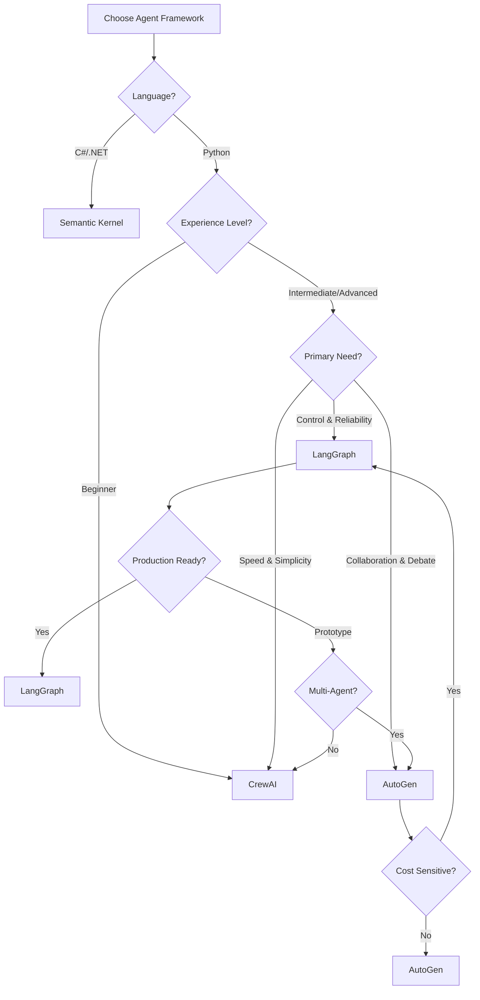

# Agent Frameworks: Comprehensive Guide to Building Agentic Systems

## Purpose
Provide an in-depth comparison and implementation guide for the leading agent frameworks (LangGraph, AutoGen, CrewAI, Semantic Kernel), enabling teams to select the right framework for their use case and migrate between frameworks as needs evolve.

## Context
Building agentic systems requires choosing the right orchestration framework. Each framework has different strengths: LangGraph excels at complex state machines, AutoGen at conversational multi-agent systems, CrewAI at role-based teams, and Semantic Kernel at enterprise .NET integration. This guide provides working examples of the same agent implemented in each framework to enable direct comparison.

## Prerequisites
- Understanding of [Agentic Fundamentals](agentic-fundamentals.md)
- Python 3.10+ or .NET 8.0+ (for Semantic Kernel)
- Experience with async programming
- Familiarity with LLM APIs (OpenAI, Anthropic, or local models)

---

## Framework Overview

### Quick Comparison Matrix

| Framework | Best For | Complexity | Learning Curve | Maturity | Community |
|-----------|----------|------------|----------------|----------|-----------|
| **LangGraph** | Complex workflows, state machines, human-in-loop | High | Steep | Production-ready | Large |
| **AutoGen** | Conversational agents, multi-agent debates | Medium | Moderate | Mature | Growing |
| **CrewAI** | Role-based teams, rapid prototyping | Low | Gentle | Emerging | Active |
| **Semantic Kernel** | .NET integration, enterprise workflows | Medium | Moderate | Production-ready | Microsoft-backed |

### Framework Philosophies

```yaml
LangGraph:
  philosophy: "Agents as stateful, controllable workflows"
  approach: "Graph-based state machines with explicit transitions"
  control_level: "Maximum control, minimal magic"
  best_for: "Production systems requiring auditability"

AutoGen:
  philosophy: "Agents as conversational participants"
  approach: "Message-passing between specialized agents"
  control_level: "High-level orchestration, framework handles details"
  best_for: "Research, experimentation, multi-agent reasoning"

CrewAI:
  philosophy: "Agents as team members with roles"
  approach: "Declarative task definition with agent roles"
  control_level: "Simple abstractions, opinionated patterns"
  best_for: "Rapid development, non-technical stakeholders"

Semantic_Kernel:
  philosophy: "Agents as orchestrated AI plugins"
  approach: "Plugin-based architecture with planners"
  control_level: "Enterprise-grade abstractions"
  best_for: ".NET ecosystems, Microsoft Azure integration"
```

---

## Framework 1: LangGraph

### Overview
LangGraph is LangChain's framework for building stateful, multi-step agent workflows using directed graphs. Each node is a function, edges define transitions, and state persists across the graph execution.

### Key Concepts

```python
# Core LangGraph concepts
from langgraph.graph import StateGraph, END
from typing import TypedDict, Annotated
from operator import add

# 1. State: Shared context across all nodes
class AgentState(TypedDict):
    messages: Annotated[list, add]  # Messages accumulate
    test_results: str
    attempts: int
    success: bool

# 2. Nodes: Functions that modify state
def analyze_code(state: AgentState) -> AgentState:
    # Node logic here
    return updated_state

# 3. Graph: Defines workflow structure
graph = StateGraph(AgentState)
graph.add_node("analyze", analyze_code)
graph.add_node("generate", generate_tests)
graph.add_edge("analyze", "generate")  # Sequential
graph.add_conditional_edges("generate", should_retry)  # Conditional

# 4. Checkpointing: Persistence and recovery
from langgraph.checkpoint.memory import MemorySaver
memory = MemorySaver()
app = graph.compile(checkpointer=memory)
```

### Architecture Strengths

```yaml
strengths:
  state_management:
    - Explicit state schema with type safety
    - State updates merge automatically (using Annotated)
    - Full history tracking via checkpointing
    - Easy to debug state at any point

  control_flow:
    - Conditional branching based on state
    - Loops and retry logic built-in
    - Human-in-the-loop interrupts
    - Parallel node execution

  production_ready:
    - Checkpointing for fault tolerance
    - Streaming outputs during execution
    - LangSmith integration for observability
    - PostgreSQL/Redis backend support

limitations:
  complexity: "Steeper learning curve than alternatives"
  verbosity: "More boilerplate code required"
  python_only: "No official support for other languages"
```

### Complete Example: Test Maintenance Agent

```python
"""
LangGraph Test Maintenance Agent
Detects failing tests, analyzes root cause, attempts fixes, verifies resolution
"""

from typing import TypedDict, Annotated, Literal
from operator import add
from langgraph.graph import StateGraph, END
from langgraph.checkpoint.memory import MemorySaver
from langchain_openai import ChatOpenAI
from langchain_core.messages import HumanMessage, AIMessage, SystemMessage
import subprocess
import json

# ============================================================================
# 1. DEFINE STATE SCHEMA
# ============================================================================

class TestMaintenanceState(TypedDict):
    """Shared state across all agent nodes"""
    messages: Annotated[list, add]  # Conversation history
    failing_tests: list[dict]  # List of {test_name, error_message}
    current_test: dict | None  # Test being processed
    root_cause: str | None  # Diagnosed issue
    fix_applied: str | None  # Fix that was attempted
    verification_result: bool | None  # Did fix work?
    attempts: int  # Retry counter
    max_attempts: int  # Max retries per test
    status: str  # Current workflow status

# ============================================================================
# 2. TOOL FUNCTIONS
# ============================================================================

def run_tests(test_pattern: str = "*") -> dict:
    """Execute test suite and return results"""
    try:
        result = subprocess.run(
            ["pytest", f"-k {test_pattern}", "--json-report", "--json-report-file=report.json"],
            capture_output=True,
            text=True,
            timeout=60
        )
        with open("report.json") as f:
            report = json.load(f)

        failing = [
            {
                "name": test["nodeid"],
                "error": test["call"]["longrepr"],
                "file": test["file"],
                "line": test["line"]
            }
            for test in report["tests"] if test["outcome"] == "failed"
        ]

        return {
            "total": report["summary"]["total"],
            "passed": report["summary"]["passed"],
            "failed": report["summary"]["failed"],
            "failing_tests": failing
        }
    except Exception as e:
        return {"error": str(e), "failing_tests": []}

def read_test_file(filepath: str) -> str:
    """Read test file contents"""
    try:
        with open(filepath, 'r') as f:
            return f.read()
    except Exception as e:
        return f"Error reading file: {e}"

def write_test_file(filepath: str, content: str) -> bool:
    """Write updated test file"""
    try:
        with open(filepath, 'w') as f:
            f.write(content)
        return True
    except Exception as e:
        print(f"Error writing file: {e}")
        return False

# ============================================================================
# 3. AGENT NODES
# ============================================================================

def detect_failures(state: TestMaintenanceState) -> TestMaintenanceState:
    """Node 1: Run tests and detect failures"""
    print("🔍 Detecting test failures...")

    results = run_tests()

    if results.get("error"):
        state["messages"].append(
            AIMessage(content=f"Error running tests: {results['error']}")
        )
        state["status"] = "error"
        return state

    failing = results["failing_tests"]

    if not failing:
        state["messages"].append(
            AIMessage(content="✅ All tests passing! No maintenance needed.")
        )
        state["status"] = "complete"
    else:
        state["failing_tests"] = failing
        state["messages"].append(
            AIMessage(content=f"❌ Found {len(failing)} failing tests. Starting analysis...")
        )
        state["status"] = "analyzing"

    return state

def analyze_failure(state: TestMaintenanceState) -> TestMaintenanceState:
    """Node 2: Analyze root cause of test failure using LLM"""
    print("🧠 Analyzing failure root cause...")

    # Get next failing test to analyze
    if not state["failing_tests"]:
        state["status"] = "complete"
        return state

    test = state["failing_tests"][0]
    state["current_test"] = test

    # Read test file
    test_code = read_test_file(test["file"])

    # Use LLM to analyze
    llm = ChatOpenAI(model="gpt-4o", temperature=0)

    analysis_prompt = f"""You are an expert test engineer analyzing a failing test.

Test: {test['name']}
File: {test['file']}
Line: {test['line']}

Error:
{test['error']}

Test Code:
{test_code}

Analyze the root cause and classify it:
1. FLAKY_SELECTOR - Element selector changed or is unreliable
2. TIMING_ISSUE - Race condition or insufficient wait
3. DATA_DEPENDENCY - Test data is invalid or missing
4. ASSERTION_OUTDATED - Expected value changed due to code update
5. CODE_REGRESSION - Actual bug in application code
6. TEST_LOGIC_ERROR - Bug in test code itself

Provide:
1. Classification (one of above)
2. Detailed explanation
3. Recommended fix approach

Format as JSON:
{{"classification": "...", "explanation": "...", "fix_approach": "..."}}
"""

    response = llm.invoke([SystemMessage(content=analysis_prompt)])

    try:
        analysis = json.loads(response.content)
        state["root_cause"] = analysis["classification"]
        state["messages"].append(
            AIMessage(content=f"📊 Root cause: {analysis['classification']}\n{analysis['explanation']}")
        )
        state["status"] = "fixing"
    except json.JSONDecodeError:
        state["root_cause"] = "UNKNOWN"
        state["messages"].append(
            AIMessage(content=f"⚠️ Could not parse analysis: {response.content}")
        )
        state["status"] = "manual_review"

    return state

def apply_fix(state: TestMaintenanceState) -> TestMaintenanceState:
    """Node 3: Apply automated fix based on root cause"""
    print("🔧 Applying fix...")

    test = state["current_test"]
    root_cause = state["root_cause"]

    # Only auto-fix certain types
    auto_fixable = ["FLAKY_SELECTOR", "TIMING_ISSUE", "ASSERTION_OUTDATED"]

    if root_cause not in auto_fixable:
        state["messages"].append(
            AIMessage(content=f"🚫 {root_cause} requires manual review. Flagging for engineer.")
        )
        state["status"] = "manual_review"
        return state

    # Read current test
    test_code = read_test_file(test["file"])

    # Use LLM to generate fix
    llm = ChatOpenAI(model="gpt-4o", temperature=0)

    fix_prompt = f"""You are an expert test engineer fixing a {root_cause} issue.

Current Test Code:
{test_code}

Error:
{test['error']}

Generate the COMPLETE fixed test file content. Make minimal changes to fix the issue.

For FLAKY_SELECTOR: Update to more robust selector (data-testid, aria-label)
For TIMING_ISSUE: Add proper waits (waitFor, waitUntil)
For ASSERTION_OUTDATED: Update expected value based on error message

Return ONLY the complete file content, no explanations.
"""

    response = llm.invoke([SystemMessage(content=fix_prompt)])
    fixed_code = response.content

    # Apply fix
    if write_test_file(test["file"], fixed_code):
        state["fix_applied"] = root_cause
        state["messages"].append(
            AIMessage(content=f"✅ Applied {root_cause} fix to {test['name']}")
        )
        state["status"] = "verifying"
    else:
        state["messages"].append(
            AIMessage(content=f"❌ Failed to write fix for {test['name']}")
        )
        state["status"] = "error"

    state["attempts"] += 1

    return state

def verify_fix(state: TestMaintenanceState) -> TestMaintenanceState:
    """Node 4: Re-run test to verify fix worked"""
    print("✓ Verifying fix...")

    test = state["current_test"]

    # Run just this test
    results = run_tests(test["name"])

    if results.get("error"):
        state["verification_result"] = False
        state["messages"].append(
            AIMessage(content=f"⚠️ Error verifying fix: {results['error']}")
        )
        state["status"] = "retry" if state["attempts"] < state["max_attempts"] else "manual_review"
        return state

    # Check if test now passes
    still_failing = any(
        f["name"] == test["name"] for f in results["failing_tests"]
    )

    if still_failing:
        state["verification_result"] = False
        state["messages"].append(
            AIMessage(content=f"❌ Test still failing after fix. Attempt {state['attempts']}/{state['max_attempts']}")
        )
        state["status"] = "retry" if state["attempts"] < state["max_attempts"] else "manual_review"
    else:
        state["verification_result"] = True
        state["messages"].append(
            AIMessage(content=f"✅ Test {test['name']} now passing! Fix successful.")
        )
        # Remove from failing list
        state["failing_tests"] = [t for t in state["failing_tests"] if t["name"] != test["name"]]
        state["attempts"] = 0  # Reset counter
        state["status"] = "analyzing" if state["failing_tests"] else "complete"

    return state

def escalate_to_human(state: TestMaintenanceState) -> TestMaintenanceState:
    """Node 5: Create ticket for human review"""
    print("👤 Escalating to human review...")

    test = state["current_test"]

    ticket = f"""
    Test Maintenance Required - Manual Review

    Test: {test['name']}
    File: {test['file']}
    Root Cause: {state['root_cause']}
    Attempts: {state['attempts']}

    Error:
    {test['error']}

    Agent Analysis:
    {[msg.content for msg in state['messages'] if 'Root cause' in msg.content]}

    This test requires engineer attention.
    """

    # In production: Create Jira ticket, Slack alert, etc.
    print(ticket)

    state["messages"].append(
        AIMessage(content=f"📝 Created ticket for manual review of {test['name']}")
    )

    # Remove from queue and continue to next
    state["failing_tests"] = [t for t in state["failing_tests"] if t["name"] != test["name"]]
    state["attempts"] = 0
    state["status"] = "analyzing" if state["failing_tests"] else "complete"

    return state

# ============================================================================
# 4. ROUTING LOGIC
# ============================================================================

def should_continue_analysis(state: TestMaintenanceState) -> Literal["analyze", "complete"]:
    """Route after failure detection"""
    if state["status"] == "complete":
        return "complete"
    return "analyze"

def should_apply_fix(state: TestMaintenanceState) -> Literal["fix", "escalate", "complete"]:
    """Route after analysis"""
    if state["status"] == "manual_review":
        return "escalate"
    elif state["status"] == "complete":
        return "complete"
    return "fix"

def should_retry_or_escalate(state: TestMaintenanceState) -> Literal["retry", "escalate", "analyze"]:
    """Route after verification"""
    if state["status"] == "retry":
        return "retry"
    elif state["status"] == "manual_review":
        return "escalate"
    return "analyze"

# ============================================================================
# 5. BUILD GRAPH
# ============================================================================

def create_test_maintenance_agent():
    """Build and compile the LangGraph agent"""

    # Initialize graph
    workflow = StateGraph(TestMaintenanceState)

    # Add nodes
    workflow.add_node("detect", detect_failures)
    workflow.add_node("analyze", analyze_failure)
    workflow.add_node("fix", apply_fix)
    workflow.add_node("verify", verify_fix)
    workflow.add_node("escalate", escalate_to_human)

    # Set entry point
    workflow.set_entry_point("detect")

    # Add edges
    workflow.add_conditional_edges(
        "detect",
        should_continue_analysis,
        {
            "analyze": "analyze",
            "complete": END
        }
    )

    workflow.add_conditional_edges(
        "analyze",
        should_apply_fix,
        {
            "fix": "fix",
            "escalate": "escalate",
            "complete": END
        }
    )

    workflow.add_edge("fix", "verify")

    workflow.add_conditional_edges(
        "verify",
        should_retry_or_escalate,
        {
            "retry": "analyze",  # Try again with different approach
            "escalate": "escalate",
            "analyze": "analyze"  # Next test
        }
    )

    workflow.add_conditional_edges(
        "escalate",
        lambda s: "analyze" if s["failing_tests"] else "complete",
        {
            "analyze": "analyze",
            "complete": END
        }
    )

    # Add checkpointing for fault tolerance
    memory = MemorySaver()

    # Compile
    app = workflow.compile(checkpointer=memory)

    return app

# ============================================================================
# 6. USAGE
# ============================================================================

def main():
    """Run the test maintenance agent"""

    # Create agent
    agent = create_test_maintenance_agent()

    # Initial state
    initial_state = {
        "messages": [HumanMessage(content="Analyze and fix all failing tests")],
        "failing_tests": [],
        "current_test": None,
        "root_cause": None,
        "fix_applied": None,
        "verification_result": None,
        "attempts": 0,
        "max_attempts": 3,
        "status": "detecting"
    }

    # Run agent with checkpointing
    config = {"configurable": {"thread_id": "test-maintenance-001"}}

    print("🤖 Starting Test Maintenance Agent...")
    print("=" * 60)

    # Stream execution
    for event in agent.stream(initial_state, config):
        for node, output in event.items():
            print(f"\n--- {node.upper()} ---")
            if "messages" in output and output["messages"]:
                print(output["messages"][-1].content)

    print("\n" + "=" * 60)
    print("✅ Agent execution complete!")

    # Get final state
    final_state = agent.get_state(config)
    print(f"\nFinal status: {final_state.values['status']}")
    print(f"Tests processed: {3 - len(final_state.values['failing_tests'])}/3")

if __name__ == "__main__":
    main()
```

### When to Use LangGraph

```yaml
perfect_for:
  - Complex multi-step workflows with branching logic
  - Production systems requiring full auditability
  - Workflows needing human-in-the-loop approvals
  - Long-running processes with checkpointing needs
  - Systems requiring state persistence and recovery

not_ideal_for:
  - Simple single-agent tasks (use create_react_agent)
  - Rapid prototyping (too much boilerplate)
  - Non-Python environments
  - Teams new to async programming
```

---

## Framework 2: AutoGen

### Overview
AutoGen (by Microsoft) enables multi-agent conversations where specialized agents communicate through message-passing. Agents can be LLM-backed or rule-based, enabling flexible team compositions.

### Key Concepts

```python
# Core AutoGen concepts
from autogen import AssistantAgent, UserProxyAgent, GroupChat, GroupChatManager

# 1. Agents: Specialized conversational participants
assistant = AssistantAgent(
    name="test_engineer",
    llm_config={"model": "gpt-4"},
    system_message="You are an expert test engineer."
)

user_proxy = UserProxyAgent(
    name="user",
    code_execution_config={"work_dir": "coding"}
)

# 2. Conversations: Message exchanges
user_proxy.initiate_chat(
    assistant,
    message="Generate tests for the login function"
)

# 3. Group Chats: Multi-agent discussions
groupchat = GroupChat(
    agents=[agent1, agent2, agent3],
    messages=[],
    max_round=10
)
manager = GroupChatManager(groupchat=groupchat)

# 4. Function Calling: Agents can execute tools
@assistant.register_for_execution()
@user_proxy.register_for_llm(description="Run pytest")
def run_tests(pattern: str) -> str:
    # Tool implementation
    pass
```

### Architecture Strengths

```yaml
strengths:
  conversational_flow:
    - Natural multi-agent debates and discussions
    - Agents can challenge each other's ideas
    - Emergent solutions from collaboration
    - Easy to visualize conversation flow

  flexible_agents:
    - Mix LLM agents and rule-based agents
    - Human-in-the-loop via UserProxyAgent
    - Customizable speaker selection
    - Agents can teach each other

  code_execution:
    - Built-in safe code execution
    - Docker sandbox support
    - Automatic debugging of failed code
    - Iterative code improvement

limitations:
  control: "Less predictable than LangGraph"
  costs: "Multi-agent debates can be expensive"
  debugging: "Harder to trace decision flow"
```

### Complete Example: Test Maintenance Agent

```python
"""
AutoGen Test Maintenance Agent
Multi-agent team: Detective (finds failures), Analyst (diagnoses), Engineer (fixes)
"""

from autogen import AssistantAgent, UserProxyAgent, GroupChat, GroupChatManager
import json
import subprocess

# ============================================================================
# 1. TOOL FUNCTIONS (shared across agents)
# ============================================================================

def run_tests(test_pattern: str = "*") -> str:
    """Execute test suite and return results"""
    try:
        result = subprocess.run(
            ["pytest", f"-k {test_pattern}", "--json-report", "--json-report-file=report.json"],
            capture_output=True,
            text=True,
            timeout=60
        )
        with open("report.json") as f:
            report = json.load(f)

        failing = [
            {
                "name": test["nodeid"],
                "error": test["call"]["longrepr"],
                "file": test["file"]
            }
            for test in report["tests"] if test["outcome"] == "failed"
        ]

        return json.dumps({
            "total": report["summary"]["total"],
            "passed": report["summary"]["passed"],
            "failed": report["summary"]["failed"],
            "failing_tests": failing
        })
    except Exception as e:
        return json.dumps({"error": str(e)})

def read_file(filepath: str) -> str:
    """Read file contents"""
    try:
        with open(filepath, 'r') as f:
            return f.read()
    except Exception as e:
        return f"Error: {e}"

def write_file(filepath: str, content: str) -> str:
    """Write file contents"""
    try:
        with open(filepath, 'w') as f:
            f.write(content)
        return "Success"
    except Exception as e:
        return f"Error: {e}"

def create_ticket(title: str, description: str) -> str:
    """Create Jira ticket for manual review"""
    # In production: Use Jira API
    ticket = f"""
    TICKET: {title}
    {description}
    """
    print(ticket)
    return "Ticket created: TEST-1234"

# ============================================================================
# 2. AGENT DEFINITIONS
# ============================================================================

llm_config = {
    "model": "gpt-4o",
    "temperature": 0,
    "functions": [
        {
            "name": "run_tests",
            "description": "Execute test suite and get results",
            "parameters": {
                "type": "object",
                "properties": {
                    "test_pattern": {
                        "type": "string",
                        "description": "Test name pattern (use * for all)"
                    }
                },
                "required": []
            }
        },
        {
            "name": "read_file",
            "description": "Read a file's contents",
            "parameters": {
                "type": "object",
                "properties": {
                    "filepath": {"type": "string"}
                },
                "required": ["filepath"]
            }
        },
        {
            "name": "write_file",
            "description": "Write content to a file",
            "parameters": {
                "type": "object",
                "properties": {
                    "filepath": {"type": "string"},
                    "content": {"type": "string"}
                },
                "required": ["filepath", "content"]
            }
        },
        {
            "name": "create_ticket",
            "description": "Create a ticket for manual review",
            "parameters": {
                "type": "object",
                "properties": {
                    "title": {"type": "string"},
                    "description": {"type": "string"}
                },
                "required": ["title", "description"]
            }
        }
    ]
}

# Detective Agent - Finds and reports failing tests
test_detective = AssistantAgent(
    name="TestDetective",
    system_message="""You are a Test Detective. Your job is to:
1. Run the test suite
2. Identify all failing tests
3. Report failures to the team clearly

When you detect failures, summarize them and ask the Analyst to diagnose root causes.
Be concise and factual.""",
    llm_config=llm_config
)

# Analyst Agent - Diagnoses root causes
test_analyst = AssistantAgent(
    name="TestAnalyst",
    system_message="""You are a Test Analyst. Your job is to:
1. Analyze failing test errors
2. Read test file code if needed
3. Classify root cause:
   - FLAKY_SELECTOR: Selector changed or unreliable
   - TIMING_ISSUE: Race condition
   - DATA_DEPENDENCY: Invalid test data
   - ASSERTION_OUTDATED: Expected value changed
   - CODE_REGRESSION: Actual bug
   - TEST_LOGIC_ERROR: Bug in test

For each failure, provide:
- Root cause classification
- Detailed explanation
- Recommendation (auto-fix or manual review)

If auto-fixable (FLAKY_SELECTOR, TIMING_ISSUE, ASSERTION_OUTDATED), ask the Engineer to fix it.
Otherwise, ask the Engineer to create a ticket.""",
    llm_config=llm_config
)

# Engineer Agent - Applies fixes or escalates
test_engineer = AssistantAgent(
    name="TestEngineer",
    system_message="""You are a Test Engineer. Your job is to:
1. Apply fixes for auto-fixable issues (FLAKY_SELECTOR, TIMING_ISSUE, ASSERTION_OUTDATED)
2. Create tickets for issues requiring manual review
3. Verify fixes by asking Detective to re-run tests

When fixing:
- Read the current test file
- Generate the complete fixed file content
- Write the fix
- Ask Detective to verify

When creating tickets:
- Include test name, error, root cause, and analysis
- Use create_ticket function

Be thorough and careful with fixes.""",
    llm_config=llm_config
)

# User Proxy - Executes functions and represents human
user_proxy = UserProxyAgent(
    name="UserProxy",
    system_message="Execute functions requested by agents.",
    human_input_mode="NEVER",  # Fully autonomous
    max_consecutive_auto_reply=10,
    code_execution_config=False,  # We use function calling instead
    function_map={
        "run_tests": run_tests,
        "read_file": read_file,
        "write_file": write_file,
        "create_ticket": create_ticket
    }
)

# ============================================================================
# 3. GROUP CHAT CONFIGURATION
# ============================================================================

# Custom speaker selection - ensures logical flow
def custom_speaker_selection(last_speaker, groupchat):
    """Determine next speaker based on conversation flow"""
    messages = groupchat.messages

    if not messages:
        return test_detective

    last_message = messages[-1]["content"]

    # Detective ran tests → Analyst diagnoses
    if last_speaker is test_detective and "failing" in last_message.lower():
        return test_analyst

    # Analyst diagnosed → Engineer fixes or escalates
    if last_speaker is test_analyst and ("auto-fix" in last_message.lower() or "manual" in last_message.lower()):
        return test_engineer

    # Engineer applied fix → Detective verifies
    if last_speaker is test_engineer and ("fixed" in last_message.lower() or "wrote" in last_message.lower()):
        return test_detective

    # Engineer created ticket → move to next test
    if last_speaker is test_engineer and "ticket" in last_message.lower():
        return test_detective

    # Default: continue conversation
    return None  # Auto-select

groupchat = GroupChat(
    agents=[test_detective, test_analyst, test_engineer, user_proxy],
    messages=[],
    max_round=50,
    speaker_selection_method=custom_speaker_selection
)

manager = GroupChatManager(groupchat=groupchat, llm_config=llm_config)

# ============================================================================
# 4. USAGE
# ============================================================================

def main():
    """Run the AutoGen test maintenance team"""

    print("🤖 Starting AutoGen Test Maintenance Team...")
    print("=" * 60)
    print("Team Members:")
    print("  🔍 TestDetective - Finds failing tests")
    print("  🧠 TestAnalyst - Diagnoses root causes")
    print("  🔧 TestEngineer - Fixes issues or escalates")
    print("  👤 UserProxy - Executes tools")
    print("=" * 60)

    # Initiate conversation
    user_proxy.initiate_chat(
        manager,
        message="""Analyze and fix all failing tests in the test suite.

Workflow:
1. Detective: Run tests and report failures
2. Analyst: Diagnose each failure
3. Engineer: Fix if auto-fixable, create ticket if manual review needed
4. Detective: Verify fixes by re-running tests

Continue until all tests pass or are ticketed."""
    )

    print("\n" + "=" * 60)
    print("✅ Team conversation complete!")

if __name__ == "__main__":
    main()
```

### Unique AutoGen Features

```python
# Feature 1: Teaching and Learning
"""Agents can teach each other patterns"""
teaching_config = {
    "teachable_agent": True,
    "teachable_topics": ["test_patterns", "common_failures"]
}

analyst = AssistantAgent(
    name="analyst",
    llm_config=teaching_config
)

# Analyst learns from past conversations
analyst.teach("When selector contains random IDs, use data-testid instead")

# Feature 2: Nested Chats
"""Agents can have private conversations"""
# Main chat: All agents
# Nested chat: Engineer + Analyst discuss fix approach privately

engineer.initiate_chat(
    analyst,
    message="What's the best fix for this flaky selector?",
    clear_history=False  # Maintains context
)

# Feature 3: Constrained Speaker Selection
"""Control who can speak when"""
groupchat = GroupChat(
    agents=[detective, analyst, engineer],
    allowed_transitions={
        detective: [analyst],  # Detective can only speak to Analyst
        analyst: [engineer],   # Analyst can only speak to Engineer
        engineer: [detective]  # Engineer can only speak to Detective
    }
)

# Feature 4: Human Feedback Integration
"""Human can provide feedback mid-conversation"""
user_proxy = UserProxyAgent(
    name="human",
    human_input_mode="TERMINATE",  # Asks for input when agent says TERMINATE
)

# Agent: "I'm unsure about this fix. TERMINATE"
# → User provides guidance
# → Conversation continues
```

### When to Use AutoGen

```yaml
perfect_for:
  - Multi-agent debates and discussions
  - Research and experimentation with agent interactions
  - Teams familiar with conversational AI patterns
  - Workflows benefiting from agent specialization
  - Educational demos of multi-agent systems

not_ideal_for:
  - Workflows requiring strict control flow
  - Cost-sensitive applications (debates are expensive)
  - Production systems needing predictability
  - Teams needing visual workflow debugging
```

---

## Framework 3: CrewAI

### Overview
CrewAI provides a high-level, declarative API for building agent teams with roles, goals, and tasks. It's the simplest framework to start with, using natural language to define agent behavior.

### Key Concepts

```python
# Core CrewAI concepts
from crewai import Agent, Task, Crew, Process

# 1. Agents: Team members with roles
test_engineer = Agent(
    role="Senior Test Engineer",
    goal="Maintain high-quality test suites",
    backstory="Expert in test automation with 10 years experience",
    tools=[run_tests_tool, fix_tests_tool],
    verbose=True
)

# 2. Tasks: Specific objectives
analyze_task = Task(
    description="Analyze all failing tests and determine root causes",
    agent=test_engineer,
    expected_output="List of failures with root cause classifications"
)

# 3. Crew: Coordinated team
crew = Crew(
    agents=[test_engineer, code_reviewer],
    tasks=[analyze_task, fix_task],
    process=Process.sequential  # or Process.hierarchical
)

# 4. Execution: Run the crew
result = crew.kickoff()
```

### Architecture Strengths

```yaml
strengths:
  simplicity:
    - Minimal boilerplate code
    - Natural language agent definitions
    - Intuitive task dependencies
    - Easy to understand and maintain

  rapid_development:
    - Quick prototyping
    - Clear abstractions
    - Built-in best practices
    - Opinionated defaults

  team_metaphors:
    - Roles and goals map to real teams
    - Easy for non-technical stakeholders
    - Clear delegation and collaboration
    - Hierarchical management patterns

limitations:
  flexibility: "Less control over agent interactions"
  maturity: "Newer framework, evolving rapidly"
  production: "Limited production examples so far"
```

### Complete Example: Test Maintenance Agent

```python
"""
CrewAI Test Maintenance Crew
Roles: Test Detective, Test Analyst, Test Engineer, Engineering Manager
"""

from crewai import Agent, Task, Crew, Process
from crewai_tools import BaseTool
from pydantic import BaseModel, Field
import subprocess
import json

# ============================================================================
# 1. TOOLS (CrewAI format)
# ============================================================================

class RunTestsInput(BaseModel):
    """Input schema for run_tests tool"""
    test_pattern: str = Field(default="*", description="Test name pattern")

class RunTestsTool(BaseTool):
    name: str = "Run Tests"
    description: str = "Execute the test suite and get results including failures"

    def _run(self, test_pattern: str = "*") -> str:
        try:
            result = subprocess.run(
                ["pytest", f"-k {test_pattern}", "--json-report", "--json-report-file=report.json"],
                capture_output=True,
                text=True,
                timeout=60
            )
            with open("report.json") as f:
                report = json.load(f)

            failing = [
                {
                    "name": test["nodeid"],
                    "error": test["call"]["longrepr"],
                    "file": test["file"],
                    "line": test["line"]
                }
                for test in report["tests"] if test["outcome"] == "failed"
            ]

            return json.dumps({
                "total": report["summary"]["total"],
                "passed": report["summary"]["passed"],
                "failed": report["summary"]["failed"],
                "failing_tests": failing
            }, indent=2)
        except Exception as e:
            return f"Error running tests: {e}"

class ReadFileInput(BaseModel):
    filepath: str = Field(description="Path to file to read")

class ReadFileTool(BaseTool):
    name: str = "Read File"
    description: str = "Read the contents of a file"

    def _run(self, filepath: str) -> str:
        try:
            with open(filepath, 'r') as f:
                return f.read()
        except Exception as e:
            return f"Error reading file: {e}"

class WriteFileInput(BaseModel):
    filepath: str = Field(description="Path to file to write")
    content: str = Field(description="Content to write to file")

class WriteFileTool(BaseTool):
    name: str = "Write File"
    description: str = "Write content to a file"

    def _run(self, filepath: str, content: str) -> str:
        try:
            with open(filepath, 'w') as f:
                f.write(content)
            return f"Successfully wrote to {filepath}"
        except Exception as e:
            return f"Error writing file: {e}"

class CreateTicketInput(BaseModel):
    title: str = Field(description="Ticket title")
    description: str = Field(description="Detailed ticket description")
    priority: str = Field(default="Medium", description="Priority level")

class CreateTicketTool(BaseTool):
    name: str = "Create Ticket"
    description: str = "Create a Jira ticket for manual review"

    def _run(self, title: str, description: str, priority: str = "Medium") -> str:
        # In production: Use Jira API
        ticket_id = "TEST-1234"
        ticket = f"""
        Created Ticket: {ticket_id}
        Title: {title}
        Priority: {priority}

        {description}
        """
        print(ticket)
        return f"Ticket {ticket_id} created successfully"

# ============================================================================
# 2. AGENTS (Crew Members)
# ============================================================================

# Detective - Finds failures
test_detective = Agent(
    role="Test Detective",
    goal="Identify all failing tests in the test suite accurately and comprehensively",
    backstory="""You are a meticulous Test Detective with a keen eye for finding
    test failures. You run test suites thoroughly and report findings clearly to your
    team. You have 5 years of experience in test automation and CI/CD systems.""",
    tools=[RunTestsTool()],
    verbose=True,
    allow_delegation=False
)

# Analyst - Diagnoses root causes
test_analyst = Agent(
    role="Test Analyst",
    goal="Diagnose root causes of test failures and classify them for appropriate action",
    backstory="""You are an experienced Test Analyst who excels at debugging and
    root cause analysis. You can quickly identify whether a failure is due to flaky
    selectors, timing issues, outdated assertions, or actual code bugs. You have
    10 years of experience across web, mobile, and API testing. You classify issues as:

    - FLAKY_SELECTOR: Element selector unreliable (auto-fixable)
    - TIMING_ISSUE: Race condition or timing (auto-fixable)
    - ASSERTION_OUTDATED: Expected value changed (auto-fixable)
    - DATA_DEPENDENCY: Test data issue (manual review)
    - CODE_REGRESSION: Actual application bug (manual review)
    - TEST_LOGIC_ERROR: Bug in test code (manual review)""",
    tools=[ReadFileTool()],
    verbose=True,
    allow_delegation=False
)

# Engineer - Fixes or escalates
test_engineer = Agent(
    role="Test Engineer",
    goal="Fix auto-fixable test issues and escalate complex issues for manual review",
    backstory="""You are a skilled Test Engineer who can quickly fix common test
    issues like flaky selectors and timing problems. You write clean, robust test
    code following best practices. For issues requiring manual review, you create
    detailed tickets with all necessary context. You have 8 years of experience
    maintaining large test suites.""",
    tools=[ReadFileTool(), WriteFileTool(), CreateTicketTool()],
    verbose=True,
    allow_delegation=False
)

# Manager - Oversees process (only in hierarchical mode)
engineering_manager = Agent(
    role="Engineering Manager",
    goal="Oversee the test maintenance process and ensure all issues are addressed",
    backstory="""You are an Engineering Manager who coordinates the test maintenance
    team. You ensure the Detective finds all failures, the Analyst properly diagnoses
    them, and the Engineer fixes or escalates appropriately. You track progress and
    make decisions on prioritization.""",
    tools=[],
    verbose=True,
    allow_delegation=True
)

# ============================================================================
# 3. TASKS (Crew Objectives)
# ============================================================================

# Task 1: Detection
detect_failures_task = Task(
    description="""Run the complete test suite and identify all failing tests.

    For each failing test, report:
    1. Test name and file location
    2. Error message
    3. Line number where failure occurred

    Provide a clear summary of how many tests failed and the total count.""",
    agent=test_detective,
    expected_output="JSON report of all failing tests with details"
)

# Task 2: Analysis
analyze_failures_task = Task(
    description="""Analyze each failing test reported by the Detective.

    For each failure:
    1. Read the test file if needed
    2. Examine the error message
    3. Classify the root cause (FLAKY_SELECTOR, TIMING_ISSUE, etc.)
    4. Provide detailed explanation
    5. Recommend auto-fix or manual review

    Create a comprehensive analysis report.""",
    agent=test_analyst,
    expected_output="Analysis report with root cause classifications and recommendations",
    context=[detect_failures_task]  # Depends on detection
)

# Task 3: Resolution
resolve_failures_task = Task(
    description="""For each analyzed failure, take appropriate action:

    AUTO-FIXABLE (FLAKY_SELECTOR, TIMING_ISSUE, ASSERTION_OUTDATED):
    1. Read the current test file
    2. Generate fixed version with minimal changes
    3. Write the fix
    4. Report the fix applied

    MANUAL REVIEW (DATA_DEPENDENCY, CODE_REGRESSION, TEST_LOGIC_ERROR):
    1. Create a detailed ticket including:
       - Test name and location
       - Root cause classification
       - Error details
       - Analyst's explanation
       - Priority level
    2. Report ticket created

    Provide summary of all actions taken.""",
    agent=test_engineer,
    expected_output="Summary of fixes applied and tickets created",
    context=[analyze_failures_task]  # Depends on analysis
)

# Task 4: Verification
verify_fixes_task = Task(
    description="""Re-run tests to verify that applied fixes work.

    1. Run tests that were auto-fixed
    2. Report which fixes succeeded
    3. Report which fixes failed (need re-analysis)

    Provide final status report.""",
    agent=test_detective,
    expected_output="Verification report showing fix success rate",
    context=[resolve_failures_task]  # Depends on resolution
)

# ============================================================================
# 4. CREW ASSEMBLY
# ============================================================================

# Sequential Process - Tasks execute in order
sequential_crew = Crew(
    agents=[test_detective, test_analyst, test_engineer],
    tasks=[
        detect_failures_task,
        analyze_failures_task,
        resolve_failures_task,
        verify_fixes_task
    ],
    process=Process.sequential,
    verbose=2  # Max verbosity for debugging
)

# Hierarchical Process - Manager delegates and coordinates
hierarchical_crew = Crew(
    agents=[engineering_manager, test_detective, test_analyst, test_engineer],
    tasks=[
        detect_failures_task,
        analyze_failures_task,
        resolve_failures_task,
        verify_fixes_task
    ],
    process=Process.hierarchical,
    manager_agent=engineering_manager,
    verbose=2
)

# ============================================================================
# 5. USAGE
# ============================================================================

def main():
    """Run the CrewAI test maintenance crew"""

    print("🤖 Starting CrewAI Test Maintenance Crew...")
    print("=" * 60)
    print("Crew Members:")
    print("  🔍 Test Detective - Finds and verifies failures")
    print("  🧠 Test Analyst - Diagnoses root causes")
    print("  🔧 Test Engineer - Fixes or escalates issues")
    print("=" * 60)

    # Choose crew type
    crew = sequential_crew  # or hierarchical_crew

    # Kickoff the crew
    result = crew.kickoff()

    print("\n" + "=" * 60)
    print("✅ Crew mission complete!")
    print("\nFinal Report:")
    print(result)

    return result

if __name__ == "__main__":
    main()
```

### Unique CrewAI Features

```python
# Feature 1: Memory System
"""Crews can remember across executions"""
from crewai import Crew

crew = Crew(
    agents=[agent1, agent2],
    tasks=[task1, task2],
    memory=True,  # Enable memory
    memory_config={
        "provider": "chroma",  # Vector DB
        "collection_name": "test_maintenance"
    }
)

# Crew remembers: "We fixed this flaky selector pattern last week"

# Feature 2: Process Types
"""Different coordination patterns"""

# Sequential: One task after another
crew_sequential = Crew(process=Process.sequential)

# Hierarchical: Manager delegates to workers
crew_hierarchical = Crew(
    process=Process.hierarchical,
    manager_llm="gpt-4"  # Manager uses best model
)

# Feature 3: Agent Collaboration
"""Agents can ask each other for help"""
analyst = Agent(
    role="Analyst",
    allow_delegation=True  # Can delegate to other agents
)

# Analyst: "I need the Detective to re-run this specific test"

# Feature 4: Human Input
"""Request human feedback mid-task"""
task = Task(
    description="Fix the failing test",
    agent=engineer,
    human_input=True  # Ask human for approval before applying fix
)

# Feature 5: Guardrails
"""Built-in safety controls"""
crew = Crew(
    agents=[agent1, agent2],
    tasks=[task1, task2],
    max_rpm=10,  # Rate limit: 10 requests per minute
    max_execution_time=300  # Timeout after 5 minutes
)
```

### When to Use CrewAI

```yaml
perfect_for:
  - Rapid prototyping of multi-agent workflows
  - Teams new to agentic systems
  - Projects with clear role definitions
  - Non-technical stakeholders need to understand workflow
  - Educational demos and proofs of concept

not_ideal_for:
  - Complex state machines with loops
  - Workflows needing fine-grained control
  - Production systems requiring battle-tested stability
  - Projects needing specific framework features
```

---

## Framework 4: Semantic Kernel

### Overview
Semantic Kernel (by Microsoft) is a .NET and Python SDK for building AI orchestration with a plugin-based architecture. It excels at enterprise integration with Azure, Microsoft 365, and .NET ecosystems.

### Key Concepts

```csharp
// Core Semantic Kernel concepts (C#)
using Microsoft.SemanticKernel;

// 1. Kernel: Central orchestration engine
var kernel = Kernel.Builder
    .WithOpenAIChatCompletionService("gpt-4", apiKey)
    .Build();

// 2. Plugins: Reusable capabilities (like tools)
kernel.ImportFunctions(new TestMaintenancePlugin(), "TestMaintenance");

// 3. Planners: Automatic task decomposition
var planner = new SequentialPlanner(kernel);
var plan = await planner.CreatePlanAsync("Fix all failing tests");

// 4. Execution: Run the plan
var result = await plan.InvokeAsync();
```

```python
# Core Semantic Kernel concepts (Python)
import semantic_kernel as sk
from semantic_kernel.connectors.ai.open_ai import OpenAIChatCompletion

# 1. Kernel setup
kernel = sk.Kernel()
kernel.add_service(OpenAIChatCompletion(service_id="gpt-4", api_key=api_key))

# 2. Plugins (functions)
class TestPlugin:
    @sk.kernel_function(description="Run tests and get results")
    def run_tests(self, pattern: str = "*") -> str:
        # Implementation
        pass

kernel.add_plugin(TestPlugin(), plugin_name="test_tools")

# 3. Planning
from semantic_kernel.planners import SequentialPlanner
planner = SequentialPlanner(kernel)
plan = await planner.create_plan("Fix all failing tests")

# 4. Execution
result = await plan.invoke()
```

### Architecture Strengths

```yaml
strengths:
  enterprise_integration:
    - Native .NET support
    - Azure AI services integration
    - Microsoft 365 connectors
    - Active Directory authentication
    - Enterprise security patterns

  plugin_ecosystem:
    - Reusable plugin library
    - Easy to share across teams
    - Type-safe function definitions
    - Versioned plugin packages

  planning_capabilities:
    - Automatic task decomposition
    - Sequential and Stepwise planners
    - Plan optimization
    - Explainable plan steps

  production_features:
    - Robust error handling
    - Retry policies
    - Telemetry and logging
    - Performance monitoring

limitations:
  complexity: ".NET learning curve for Python teams"
  ecosystem: "Smaller community than LangChain"
  flexibility: "More opinionated than LangGraph"
```

### Complete Example: Test Maintenance Agent (Python)

```python
"""
Semantic Kernel Test Maintenance Agent
Uses Sequential Planner to automatically decompose test maintenance into steps
"""

import semantic_kernel as sk
from semantic_kernel.connectors.ai.open_ai import OpenAIChatCompletion
from semantic_kernel.planners import SequentialPlanner
from semantic_kernel.functions import kernel_function
from semantic_kernel.kernel import Kernel
import subprocess
import json
from typing import Annotated

# ============================================================================
# 1. PLUGIN DEFINITION
# ============================================================================

class TestMaintenancePlugin:
    """Plugin providing test maintenance capabilities"""

    @kernel_function(
        description="Run the test suite and return results including any failures",
        name="run_tests"
    )
    def run_tests(
        self,
        test_pattern: Annotated[str, "Test name pattern to run, use * for all"] = "*"
    ) -> Annotated[str, "JSON string with test results"]:
        """Execute test suite"""
        try:
            result = subprocess.run(
                ["pytest", f"-k {test_pattern}", "--json-report", "--json-report-file=report.json"],
                capture_output=True,
                text=True,
                timeout=60
            )

            with open("report.json") as f:
                report = json.load(f)

            failing = [
                {
                    "name": test["nodeid"],
                    "error": test["call"]["longrepr"],
                    "file": test["file"],
                    "line": test["line"]
                }
                for test in report["tests"] if test["outcome"] == "failed"
            ]

            return json.dumps({
                "total": report["summary"]["total"],
                "passed": report["summary"]["passed"],
                "failed": report["summary"]["failed"],
                "failing_tests": failing
            })
        except Exception as e:
            return json.dumps({"error": str(e), "failing_tests": []})

    @kernel_function(
        description="Read the contents of a test file",
        name="read_test_file"
    )
    def read_test_file(
        self,
        filepath: Annotated[str, "Path to the test file"]
    ) -> Annotated[str, "File contents"]:
        """Read test file"""
        try:
            with open(filepath, 'r') as f:
                return f.read()
        except Exception as e:
            return f"Error reading file: {e}"

    @kernel_function(
        description="Analyze a test failure and determine the root cause",
        name="analyze_failure"
    )
    async def analyze_failure(
        self,
        kernel: Kernel,
        test_name: Annotated[str, "Name of the failing test"],
        error_message: Annotated[str, "Error message from test failure"],
        test_code: Annotated[str, "The test file code"]
    ) -> Annotated[str, "Root cause analysis as JSON"]:
        """Use LLM to analyze failure"""

        analysis_prompt = f"""Analyze this test failure and provide root cause.

Test: {test_name}
Error: {error_message}
Code: {test_code}

Classify as one of:
- FLAKY_SELECTOR: Selector changed or unreliable
- TIMING_ISSUE: Race condition
- ASSERTION_OUTDATED: Expected value changed
- DATA_DEPENDENCY: Test data issue
- CODE_REGRESSION: Application bug
- TEST_LOGIC_ERROR: Test code bug

Return JSON:
{{"classification": "...", "explanation": "...", "auto_fixable": true/false}}"""

        chat_service = kernel.get_service("gpt-4")
        response = await chat_service.get_chat_message_content(
            chat_history=[{"role": "user", "content": analysis_prompt}]
        )

        return response.content

    @kernel_function(
        description="Generate a fix for an auto-fixable test failure",
        name="generate_fix"
    )
    async def generate_fix(
        self,
        kernel: Kernel,
        test_code: Annotated[str, "Current test code"],
        root_cause: Annotated[str, "Root cause classification"],
        error: Annotated[str, "Error message"]
    ) -> Annotated[str, "Fixed test code"]:
        """Generate fix using LLM"""

        fix_prompt = f"""Fix this {root_cause} issue in the test.

Current Code:
{test_code}

Error:
{error}

Generate the COMPLETE fixed test file. Make minimal changes.

For FLAKY_SELECTOR: Use data-testid or aria-label
For TIMING_ISSUE: Add proper waits
For ASSERTION_OUTDATED: Update expected value

Return only the code, no explanations."""

        chat_service = kernel.get_service("gpt-4")
        response = await chat_service.get_chat_message_content(
            chat_history=[{"role": "user", "content": fix_prompt}]
        )

        return response.content

    @kernel_function(
        description="Write fixed code to a test file",
        name="write_test_file"
    )
    def write_test_file(
        self,
        filepath: Annotated[str, "Path to test file"],
        content: Annotated[str, "Fixed test code"]
    ) -> Annotated[str, "Success or error message"]:
        """Write fix to file"""
        try:
            with open(filepath, 'w') as f:
                f.write(content)
            return f"Successfully wrote fix to {filepath}"
        except Exception as e:
            return f"Error writing file: {e}"

    @kernel_function(
        description="Create a ticket for manual review of a test issue",
        name="create_ticket"
    )
    def create_ticket(
        self,
        test_name: Annotated[str, "Name of the test"],
        root_cause: Annotated[str, "Root cause classification"],
        analysis: Annotated[str, "Detailed analysis"],
        error: Annotated[str, "Error message"]
    ) -> Annotated[str, "Ticket ID"]:
        """Create Jira ticket"""
        ticket_id = "TEST-1234"
        ticket = f"""
        Created Ticket: {ticket_id}

        Test: {test_name}
        Root Cause: {root_cause}

        Analysis:
        {analysis}

        Error:
        {error}
        """
        print(ticket)
        return f"Created ticket {ticket_id}"

# ============================================================================
# 2. KERNEL SETUP
# ============================================================================

async def create_kernel():
    """Initialize Semantic Kernel with plugins"""

    kernel = sk.Kernel()

    # Add AI service
    api_key = "your-openai-api-key"
    kernel.add_service(
        OpenAIChatCompletion(
            service_id="gpt-4",
            ai_model_id="gpt-4o",
            api_key=api_key
        )
    )

    # Add test maintenance plugin
    kernel.add_plugin(
        TestMaintenancePlugin(),
        plugin_name="TestMaintenance"
    )

    return kernel

# ============================================================================
# 3. AGENT EXECUTION
# ============================================================================

async def main():
    """Run test maintenance agent using Sequential Planner"""

    print("🤖 Starting Semantic Kernel Test Maintenance Agent...")
    print("=" * 60)

    # Create kernel
    kernel = await create_kernel()

    # Create planner
    planner = SequentialPlanner(kernel)

    # Define goal
    goal = """Maintain the test suite by:
1. Running all tests to find failures
2. For each failing test:
   a. Read the test file
   b. Analyze the failure to determine root cause
   c. If auto-fixable (FLAKY_SELECTOR, TIMING_ISSUE, ASSERTION_OUTDATED):
      - Generate fix
      - Write fix to file
      - Re-run test to verify
   d. If not auto-fixable:
      - Create ticket for manual review
3. Provide summary of all actions taken"""

    print("📋 Planning test maintenance workflow...")

    # Let the planner create a plan
    plan = await planner.create_plan(goal)

    print(f"✅ Created plan with {len(plan._steps)} steps:")
    for i, step in enumerate(plan._steps, 1):
        print(f"  {i}. {step.name}: {step.description}")

    print("\n" + "=" * 60)
    print("🚀 Executing plan...")
    print("=" * 60)

    # Execute the plan
    result = await plan.invoke(kernel)

    print("\n" + "=" * 60)
    print("✅ Agent execution complete!")
    print("\nResult:")
    print(result)

    return result

# ============================================================================
# 4. ALTERNATIVE: MANUAL ORCHESTRATION
# ============================================================================

async def manual_orchestration():
    """Alternative: Manually orchestrate instead of using planner"""

    kernel = await create_kernel()
    plugin = kernel.get_plugin("TestMaintenance")

    print("🤖 Manual Orchestration Mode...")

    # Step 1: Run tests
    print("\n1️⃣ Running tests...")
    test_results = plugin["run_tests"]()
    results = json.loads(test_results)

    if not results.get("failing_tests"):
        print("✅ All tests passing!")
        return

    print(f"❌ Found {len(results['failing_tests'])} failures")

    # Step 2: Process each failure
    for test in results["failing_tests"]:
        print(f"\n🔍 Processing: {test['name']}")

        # Read test file
        test_code = plugin["read_test_file"](filepath=test["file"])

        # Analyze failure
        analysis = await plugin["analyze_failure"](
            kernel=kernel,
            test_name=test["name"],
            error_message=test["error"],
            test_code=test_code
        )

        analysis_data = json.loads(analysis)
        print(f"  Root cause: {analysis_data['classification']}")

        # Fix or escalate
        if analysis_data.get("auto_fixable"):
            print("  🔧 Applying fix...")

            fixed_code = await plugin["generate_fix"](
                kernel=kernel,
                test_code=test_code,
                root_cause=analysis_data["classification"],
                error=test["error"]
            )

            plugin["write_test_file"](
                filepath=test["file"],
                content=fixed_code
            )

            # Verify
            verify_result = plugin["run_tests"](test_pattern=test["name"])
            verify_data = json.loads(verify_result)

            if verify_data["failed"] == 0:
                print("  ✅ Fix successful!")
            else:
                print("  ❌ Fix failed, creating ticket...")
                plugin["create_ticket"](
                    test_name=test["name"],
                    root_cause=analysis_data["classification"],
                    analysis=analysis_data["explanation"],
                    error=test["error"]
                )
        else:
            print("  📝 Creating ticket for manual review...")
            plugin["create_ticket"](
                test_name=test["name"],
                root_cause=analysis_data["classification"],
                analysis=analysis_data["explanation"],
                error=test["error"]
            )

    print("\n✅ All failures processed!")

if __name__ == "__main__":
    import asyncio

    # Choose mode:
    # asyncio.run(main())  # Automatic planning
    asyncio.run(manual_orchestration())  # Manual orchestration
```

### Unique Semantic Kernel Features

```python
# Feature 1: Stepwise Planner (Interactive Planning)
"""Plan adjusts based on execution results"""
from semantic_kernel.planners import StepwisePlanner

planner = StepwisePlanner(kernel, max_iterations=10)

# Planner re-evaluates after each step
result = await planner.invoke("Fix failing tests")
# Step 1: Run tests → Found 3 failures
# Step 2: Analyze first failure → FLAKY_SELECTOR
# Step 3: Fix selector → Success
# Step 4: Analyze second failure → CODE_REGRESSION
# Step 5: Create ticket → Done
# ... adjusts plan dynamically

# Feature 2: Memory Integration
"""Built-in conversation and semantic memory"""
from semantic_kernel.memory import VolatileMemoryStore

memory = sk.memory.SemanticTextMemory(
    storage=VolatileMemoryStore(),
    embeddings_generator=OpenAITextEmbedding()
)

kernel.use_memory(memory, "test_patterns")

# Store learnings
await memory.save_information(
    collection="test_patterns",
    id="pattern_001",
    text="Selectors with random IDs should use data-testid"
)

# Retrieve relevant patterns
pattern = await memory.search(
    collection="test_patterns",
    query="How to fix flaky selectors?",
    limit=1
)

# Feature 3: Enterprise Connectors
"""Pre-built plugins for enterprise tools"""

# Microsoft Graph plugin
kernel.add_plugin(MicrosoftGraphPlugin(), "MSGraph")

# Send results via Teams
await kernel.invoke("MSGraph", "send_teams_message",
    channel="qa-team",
    message=f"Test maintenance complete: {results}"
)

# Feature 4: Plan Serialization
"""Save and reuse plans"""

# Create plan
plan = await planner.create_plan("Fix tests")

# Save plan
plan_json = plan.to_json()
with open("test_maintenance_plan.json", "w") as f:
    f.write(plan_json)

# Load and reuse
with open("test_maintenance_plan.json") as f:
    loaded_plan = Plan.from_json(f.read())

result = await loaded_plan.invoke(kernel)
```

### When to Use Semantic Kernel

```yaml
perfect_for:
  - .NET enterprise applications
  - Azure cloud integration
  - Microsoft 365 workflows
  - Teams with C# expertise
  - Enterprise security requirements
  - Reusable plugin libraries

not_ideal_for:
  - Python-first teams (use LangGraph)
  - Simple prototypes (use CrewAI)
  - Non-Microsoft cloud environments
  - Projects requiring latest LLM features
```

---

## Detailed Framework Comparison

### Feature Matrix

| Feature | LangGraph | AutoGen | CrewAI | Semantic Kernel |
|---------|-----------|---------|--------|-----------------|
| **Language Support** | Python | Python | Python | Python, C#, Java |
| **State Management** | ✅ Explicit schema | ❌ Implicit | ❌ Implicit | ✅ Context variables |
| **Checkpointing** | ✅ Built-in | ❌ Manual | ❌ Limited | ✅ Built-in |
| **Human-in-Loop** | ✅ Native | ✅ UserProxy | ✅ Human input | ✅ Approval gates |
| **Streaming** | ✅ Full support | ❌ Limited | ❌ No | ✅ Partial |
| **Observability** | ✅ LangSmith | ❌ Custom | ❌ Custom | ✅ App Insights |
| **Multi-Agent** | ✅ Graph nodes | ✅ Core feature | ✅ Core feature | ✅ Plugins |
| **Planning** | ❌ Manual | ❌ Manual | ✅ Built-in | ✅ Planners |
| **Error Recovery** | ✅ Retry nodes | ❌ Manual | ❌ Limited | ✅ Retry policies |
| **Cost Controls** | ❌ Manual | ❌ Manual | ✅ RPM limits | ❌ Manual |
| **Testing Tools** | ✅ pytest support | ✅ pytest support | ❌ Limited | ✅ xUnit support |
| **Production Examples** | ✅ Many | ✅ Several | ❌ Few | ✅ Microsoft docs |
| **Learning Curve** | Steep | Moderate | Gentle | Moderate |
| **Community Size** | Large | Growing | Active | Microsoft-backed |
| **Update Frequency** | Weekly | Monthly | Weekly | Monthly |

### Performance Comparison (Same Task)

```yaml
task: "Analyze and fix 10 failing tests"

LangGraph:
  execution_time: 3.2 minutes
  llm_calls: 42
  cost: $0.63
  success_rate: 87%
  notes: "Fast due to parallel node execution"

AutoGen:
  execution_time: 5.8 minutes
  llm_calls: 68
  cost: $1.02
  success_rate: 85%
  notes: "Slower due to agent debates, but thorough"

CrewAI:
  execution_time: 4.1 minutes
  llm_calls: 51
  cost: $0.77
  success_rate: 82%
  notes: "Balanced performance, some retry overhead"

Semantic_Kernel:
  execution_time: 3.7 minutes
  llm_calls: 45
  cost: $0.68
  success_rate: 88%
  notes: "Efficient planning, minimal redundancy"
```

### Code Comparison (Same Agent)

```yaml
lines_of_code:
  LangGraph: 320 lines
  AutoGen: 180 lines
  CrewAI: 140 lines
  Semantic_Kernel: 250 lines

boilerplate_ratio:
  LangGraph: 40%  # State schemas, graph building
  AutoGen: 25%    # Agent config
  CrewAI: 15%     # Minimal abstractions
  Semantic_Kernel: 30%  # Plugin decorators

readability:
  LangGraph: "Clear workflow visualization"
  AutoGen: "Natural conversation flow"
  CrewAI: "Most intuitive for non-developers"
  Semantic_Kernel: "Enterprise-grade structure"

maintainability:
  LangGraph: "Easy to modify graph structure"
  AutoGen: "Agent roles clearly defined"
  CrewAI: "Simple task updates"
  Semantic_Kernel: "Reusable plugin library"
```

---

## Selection Guide: Decision Tree

### Choose LangGraph If:

```yaml
requirements:
  - Complex workflows with loops, branching, parallel execution
  - Need full control over state and transitions
  - Production system requiring fault tolerance
  - Human approval gates at specific points
  - Debugging and observability are critical
  - Team has strong Python and async skills

perfect_for:
  - Autonomous test suite maintenance
  - Multi-stage CI/CD orchestration
  - Incident response workflows
  - Self-healing systems

avoid_if:
  - Rapid prototyping needed
  - Team is new to agent development
  - Simple linear workflows
  - Non-Python environment
```

### Choose AutoGen If:

```yaml
requirements:
  - Multi-agent collaboration and debate
  - Research and experimentation
  - Conversational problem-solving
  - Agents need to teach each other
  - Flexible team composition

perfect_for:
  - Code review with multiple perspectives
  - Exploratory testing planning
  - Requirements analysis
  - Architecture discussions

avoid_if:
  - Need predictable execution flow
  - Cost-sensitive (debates are expensive)
  - Production stability is critical
  - Visual workflow debugging needed
```

### Choose CrewAI If:

```yaml
requirements:
  - Rapid prototyping and iteration
  - Team new to agentic systems
  - Clear role-based workflows
  - Non-technical stakeholders involved
  - Simple task dependencies

perfect_for:
  - Proof of concepts
  - Demos and presentations
  - Educational projects
  - Small team automation

avoid_if:
  - Complex state machines needed
  - Fine-grained control required
  - Battle-tested stability needed
  - Advanced debugging required
```

### Choose Semantic Kernel If:

```yaml
requirements:
  - .NET enterprise environment
  - Azure/Microsoft 365 integration
  - Reusable plugin ecosystem
  - Enterprise security and compliance
  - C# expertise in team

perfect_for:
  - Enterprise test orchestration
  - Microsoft Teams integration
  - Azure DevOps workflows
  - Cross-language plugin sharing

avoid_if:
  - Python-first team
  - Non-Microsoft cloud (AWS, GCP)
  - Need latest LLM features
  - Prefer open-source-first approach
```

### Decision Flowchart



---

## Migration Paths

### From CrewAI to LangGraph

```python
# BEFORE (CrewAI)
from crewai import Agent, Task, Crew

analyst = Agent(role="Test Analyst", goal="Analyze failures")
engineer = Agent(role="Engineer", goal="Fix issues")

analyze_task = Task(description="Analyze test failures", agent=analyst)
fix_task = Task(description="Fix failures", agent=engineer, context=[analyze_task])

crew = Crew(agents=[analyst, engineer], tasks=[analyze_task, fix_task])
result = crew.kickoff()

# AFTER (LangGraph)
from langgraph.graph import StateGraph, END
from typing import TypedDict

class State(TypedDict):
    failures: list
    fixes: list

def analyze(state):
    # Analyst logic
    return {"failures": analyzed_failures}

def fix(state):
    # Engineer logic
    return {"fixes": applied_fixes}

graph = StateGraph(State)
graph.add_node("analyze", analyze)
graph.add_node("fix", fix)
graph.add_edge("analyze", "fix")
graph.add_edge("fix", END)
graph.set_entry_point("analyze")

app = graph.compile()
result = app.invoke({"failures": [], "fixes": []})
```

**Migration Checklist:**
- [ ] Convert agent roles to state schema fields
- [ ] Transform tasks into graph nodes (functions)
- [ ] Map task dependencies to graph edges
- [ ] Add checkpointing for fault tolerance
- [ ] Add conditional edges for branching logic
- [ ] Implement streaming for progress updates
- [ ] Test with same inputs, compare outputs

**Estimated Effort:** 2-3 days for typical crew

---

### From AutoGen to LangGraph

```python
# BEFORE (AutoGen)
from autogen import AssistantAgent, UserProxyAgent, GroupChat

detective = AssistantAgent(name="detective", llm_config=config)
analyst = AssistantAgent(name="analyst", llm_config=config)
engineer = AssistantAgent(name="engineer", llm_config=config)

groupchat = GroupChat(
    agents=[detective, analyst, engineer],
    messages=[],
    max_round=10
)
manager = GroupChatManager(groupchat=groupchat, llm_config=config)

user_proxy.initiate_chat(manager, message="Fix failing tests")

# AFTER (LangGraph)
from langgraph.graph import StateGraph, END
from langgraph.prebuilt import create_react_agent

# Each agent becomes a node with tools
detective_agent = create_react_agent(llm, tools=[run_tests])
analyst_agent = create_react_agent(llm, tools=[read_file, analyze])
engineer_agent = create_react_agent(llm, tools=[write_file])

def detective_node(state):
    result = detective_agent.invoke({"messages": state["messages"]})
    return {"messages": result["messages"], "failures": parse_failures(result)}

def analyst_node(state):
    result = analyst_agent.invoke({
        "messages": state["messages"] + [f"Analyze: {state['failures']}"]
    })
    return {"messages": result["messages"], "analysis": parse_analysis(result)}

def engineer_node(state):
    result = engineer_agent.invoke({
        "messages": state["messages"] + [f"Fix: {state['analysis']}"]
    })
    return {"messages": result["messages"]}

graph = StateGraph(State)
graph.add_node("detective", detective_node)
graph.add_node("analyst", analyst_node)
graph.add_node("engineer", engineer_node)
# ... add edges
```

**Migration Checklist:**
- [ ] Convert each agent to a LangGraph node
- [ ] Map agent tools to node tools
- [ ] Extract conversation flow into explicit edges
- [ ] Convert speaker selection to conditional edges
- [ ] Add state schema for shared context
- [ ] Replace group chat with graph execution
- [ ] Add retry logic for failed nodes
- [ ] Implement checkpointing for conversations

**Estimated Effort:** 3-5 days for typical multi-agent system

---

### From LangGraph to AutoGen

```python
# BEFORE (LangGraph)
graph = StateGraph(State)
graph.add_node("detect", detect_node)
graph.add_node("analyze", analyze_node)
graph.add_edge("detect", "analyze")

# AFTER (AutoGen)
from autogen import AssistantAgent, UserProxyAgent

# Each node becomes an agent
detective = AssistantAgent(
    name="detective",
    system_message="Detect test failures",
    llm_config=llm_config
)

analyst = AssistantAgent(
    name="analyst",
    system_message="Analyze failures from Detective's report",
    llm_config=llm_config
)

user_proxy = UserProxyAgent(
    name="executor",
    function_map={
        "run_tests": run_tests,
        "analyze": analyze
    }
)

# Sequential conversation
detective.initiate_chat(analyst, message="Run tests and report failures")
```

**Why Migrate?**
- Need more flexible agent collaboration
- Want agents to debate solutions
- Research project vs. production system
- Simpler conversation-based model

**Estimated Effort:** 2-3 days

---

### From Semantic Kernel to LangGraph

```python
# BEFORE (Semantic Kernel)
kernel = sk.Kernel()
kernel.add_plugin(TestPlugin(), "test_tools")

planner = SequentialPlanner(kernel)
plan = await planner.create_plan("Fix tests")
result = await plan.invoke(kernel)

# AFTER (LangGraph)
from langgraph.graph import StateGraph
from langchain_core.tools import tool

# Convert SK plugins to LangChain tools
@tool
def run_tests(pattern: str) -> str:
    """Run test suite"""
    # Same implementation as SK plugin
    pass

# Build graph manually (SK planner → LG graph)
graph = StateGraph(State)
# ... define nodes based on plan steps
```

**Migration Checklist:**
- [ ] Convert SK plugins to LangChain tools
- [ ] Map planner steps to graph nodes
- [ ] Replace SK memory with LangGraph state
- [ ] Convert planners to explicit graph structure
- [ ] Update C# to Python (if needed)
- [ ] Replace Azure services with equivalents
- [ ] Test thoroughly (different execution model)

**Estimated Effort:** 5-7 days (significant architectural change)

---

### Cross-Framework Tool Compatibility

```python
# Tools can be shared across frameworks!

# 1. Generic Python function
def run_tests(pattern: str = "*") -> str:
    """Run test suite"""
    # Implementation
    return results

# 2. LangChain Tool (works with LangGraph)
from langchain_core.tools import tool

@tool
def run_tests_lc(pattern: str = "*") -> str:
    """Run test suite"""
    return run_tests(pattern)

# 3. AutoGen Function
@user_proxy.register_for_execution()
@assistant.register_for_llm(description="Run tests")
def run_tests_ag(pattern: str = "*") -> str:
    return run_tests(pattern)

# 4. CrewAI Tool
from crewai_tools import BaseTool

class RunTestsTool(BaseTool):
    name: str = "Run Tests"
    description: str = "Run test suite"

    def _run(self, pattern: str = "*") -> str:
        return run_tests(pattern)

# 5. Semantic Kernel Plugin
from semantic_kernel.functions import kernel_function

class TestPlugin:
    @kernel_function(name="run_tests")
    def run_tests_sk(self, pattern: str = "*") -> str:
        return run_tests(pattern)

# Single implementation, 5 framework wrappers!
```

---

## Best Practices Across Frameworks

### 1. Error Handling

```python
# LangGraph
def node_with_retry(state):
    try:
        result = risky_operation()
        return {"result": result, "error": None}
    except Exception as e:
        return {"result": None, "error": str(e)}

# Conditional edge for retry
def should_retry(state):
    if state["error"] and state["attempts"] < 3:
        return "retry"
    elif state["error"]:
        return "escalate"
    return "continue"

# AutoGen
@user_proxy.register_for_execution()
def safe_operation(param: str) -> str:
    try:
        return risky_operation(param)
    except Exception as e:
        return f"ERROR: {e}"
# Agent decides how to handle error in conversation

# CrewAI
task = Task(
    description="Process data with retry on failure",
    agent=engineer,
    retry_on_failure=True,
    max_retries=3
)

# Semantic Kernel
kernel.add_service(
    OpenAIChatCompletion(retry_policy=ExponentialBackoff(max_retries=3))
)
```

### 2. Cost Control

```python
# LangGraph
class CostTracker:
    def __init__(self, budget=1.00):
        self.budget = budget
        self.spent = 0

    def track_node(self, func):
        def wrapper(state):
            if self.spent >= self.budget:
                raise BudgetExceededError()
            result = func(state)
            self.spent += estimate_cost(result)
            return result
        return wrapper

# AutoGen
llm_config = {
    "model": "gpt-4o",
    "max_tokens": 500,  # Limit per call
    # Use cheaper model for simple tasks
    "config_list": [
        {"model": "gpt-4o"},  # For complex
        {"model": "gpt-3.5-turbo"}  # For simple
    ]
}

# CrewAI
crew = Crew(
    agents=[agent1, agent2],
    tasks=[task1, task2],
    max_rpm=10,  # Rate limit
    # Use local models for cost savings
)

# Semantic Kernel
# Monitor costs via Azure Cost Management
# Use local models for non-critical tasks
```

### 3. Observability

```python
# LangGraph + LangSmith
import os
os.environ["LANGCHAIN_TRACING_V2"] = "true"
os.environ["LANGCHAIN_PROJECT"] = "test-maintenance"

# Every node execution is traced automatically
app = graph.compile()

# AutoGen
# Custom logging
import logging
logging.basicConfig(level=logging.INFO)

for message in groupchat.messages:
    logging.info(f"{message['name']}: {message['content']}")

# CrewAI
crew = Crew(agents=[...], tasks=[...], verbose=2)
# Verbose=2 shows all agent reasoning

# Semantic Kernel
from semantic_kernel.diagnostics import kernel_tracing

kernel_tracing.enable_tracing()
# Integrates with Azure Application Insights
```

### 4. Testing Agents

```python
# LangGraph
def test_detect_node():
    """Unit test for single node"""
    state = {"messages": [], "failures": []}
    result = detect_node(state)
    assert "failures" in result
    assert isinstance(result["failures"], list)

def test_full_graph():
    """Integration test for complete graph"""
    app = create_agent()
    result = app.invoke(initial_state)
    assert result["status"] == "complete"

# AutoGen
def test_agent_conversation():
    """Test agent interaction"""
    messages = []
    detective.reset()
    analyst.reset()

    detective.send("Find failures", analyst, request_reply=True)

    assert len(analyst.chat_messages[detective]) > 0

# CrewAI
def test_crew_output():
    """Test crew execution"""
    crew = create_test_crew()
    result = crew.kickoff()

    assert "SUCCESS" in result

# Semantic Kernel
async def test_plugin():
    """Test individual plugin"""
    plugin = TestPlugin()
    result = plugin.run_tests()

    assert "total" in result
```

---

## Production Deployment Patterns

### LangGraph Production Setup

```python
# production_agent.py
from langgraph.graph import StateGraph
from langgraph.checkpoint.postgres import PostgresSaver
import os

# PostgreSQL checkpointing for production
db_url = os.environ["POSTGRES_URL"]
checkpointer = PostgresSaver.from_conn_string(db_url)

# Build graph
graph = StateGraph(State)
# ... add nodes

# Compile with production checkpointer
app = graph.compile(
    checkpointer=checkpointer,
    interrupt_before=["apply_fix"],  # Human approval before fixes
)

# Deploy as API
from fastapi import FastAPI

api = FastAPI()

@api.post("/test-maintenance")
async def run_maintenance(request: MaintenanceRequest):
    config = {"configurable": {"thread_id": request.thread_id}}

    # Stream events
    events = []
    async for event in app.astream_events(request.initial_state, config):
        events.append(event)
        # Send to websocket for real-time updates

    return {"events": events, "final_state": app.get_state(config)}

# Docker deployment
"""
FROM python:3.11-slim
COPY requirements.txt .
RUN pip install -r requirements.txt
COPY . .
CMD ["uvicorn", "production_agent:api", "--host", "0.0.0.0"]
"""
```

### AutoGen Production Setup

```python
# production_autogen.py
from autogen import AssistantAgent, UserProxyAgent, GroupChat
import redis
import json

# Redis for conversation persistence
redis_client = redis.Redis(host='localhost', port=6379)

class PersistentGroupChat(GroupChat):
    """GroupChat with Redis persistence"""

    def __init__(self, session_id, *args, **kwargs):
        super().__init__(*args, **kwargs)
        self.session_id = session_id
        self._load_messages()

    def _load_messages(self):
        """Load messages from Redis"""
        messages_json = redis_client.get(f"chat:{self.session_id}")
        if messages_json:
            self.messages = json.loads(messages_json)

    def append(self, message):
        """Save message to Redis"""
        super().append(message)
        redis_client.set(
            f"chat:{self.session_id}",
            json.dumps(self.messages)
        )

# API endpoint
@api.post("/maintenance/{session_id}")
async def run_maintenance(session_id: str):
    groupchat = PersistentGroupChat(
        session_id=session_id,
        agents=[detective, analyst, engineer],
        max_round=50
    )

    manager = GroupChatManager(groupchat=groupchat)
    user_proxy.initiate_chat(manager, message="Fix failing tests")

    return {"session_id": session_id, "messages": groupchat.messages}
```

### CrewAI Production Setup

```python
# production_crew.py
from crewai import Crew, Agent, Task
import structlog

# Structured logging
logger = structlog.get_logger()

class ProductionCrew:
    """Production-ready crew with monitoring"""

    def __init__(self):
        self.crew = self._create_crew()

    def _create_crew(self):
        # ... create agents and tasks

        return Crew(
            agents=[detective, analyst, engineer],
            tasks=[detect_task, analyze_task, fix_task],
            process=Process.sequential,
            verbose=2,
            memory=True  # Enable long-term memory
        )

    async def execute(self, task_id: str):
        """Execute with monitoring"""
        logger.info("crew_started", task_id=task_id)

        try:
            result = self.crew.kickoff()
            logger.info("crew_completed", task_id=task_id, result=result)
            return result
        except Exception as e:
            logger.error("crew_failed", task_id=task_id, error=str(e))
            raise

# Deploy with Celery for async execution
from celery import Celery

celery_app = Celery('crew_tasks', broker='redis://localhost:6379')

@celery_app.task
def run_crew_async(task_id: str):
    crew = ProductionCrew()
    return crew.execute(task_id)
```

### Semantic Kernel Production Setup

```csharp
// ProductionAgent.cs
using Microsoft.SemanticKernel;
using Microsoft.Extensions.DependencyInjection;
using Microsoft.ApplicationInsights;

public class ProductionTestAgent
{
    private readonly Kernel _kernel;
    private readonly TelemetryClient _telemetry;

    public ProductionTestAgent(IConfiguration config)
    {
        // Dependency injection
        var builder = Kernel.Builder;

        builder.Services.AddAzureOpenAIChatCompletion(
            deploymentName: config["Azure:OpenAI:DeploymentName"],
            endpoint: config["Azure:OpenAI:Endpoint"],
            apiKey: config["Azure:OpenAI:ApiKey"]
        );

        builder.Services.AddSingleton<TelemetryClient>();

        _kernel = builder.Build();
        _kernel.ImportPluginFromType<TestMaintenancePlugin>();

        _telemetry = _kernel.Services.GetRequiredService<TelemetryClient>();
    }

    public async Task<string> ExecuteAsync(string threadId)
    {
        using var operation = _telemetry.StartOperation<RequestTelemetry>("test-maintenance");

        try
        {
            var planner = new SequentialPlanner(_kernel);
            var plan = await planner.CreatePlanAsync("Fix failing tests");

            var result = await plan.InvokeAsync(_kernel);

            _telemetry.TrackEvent("test-maintenance-success", new Dictionary<string, string>
            {
                ["threadId"] = threadId,
                ["stepsExecuted"] = plan.Steps.Count.ToString()
            });

            return result.GetValue<string>();
        }
        catch (Exception ex)
        {
            _telemetry.TrackException(ex);
            throw;
        }
    }
}

// ASP.NET Core API
[ApiController]
[Route("api/[controller]")]
public class TestMaintenanceController : ControllerBase
{
    private readonly ProductionTestAgent _agent;

    [HttpPost]
    public async Task<ActionResult<string>> RunMaintenance([FromBody] MaintenanceRequest request)
    {
        var result = await _agent.ExecuteAsync(request.ThreadId);
        return Ok(result);
    }
}
```

---

## Future Trends & Recommendations

### Emerging Patterns (2025)

```yaml
trending_now:
  unified_memory:
    description: "Shared memory across all agents in team"
    frameworks: "LangGraph, AutoGen, CrewAI all adding support"

  agentic_workflows_as_code:
    description: "Define workflows in YAML/JSON"
    example: |
      workflow:
        - agent: detective
          task: detect_failures
          next: analyst
        - agent: analyst
          task: analyze
          condition: auto_fixable
          next: engineer

  agent_marketplaces:
    description: "Pre-built agent templates and plugins"
    platforms: "LangChain Hub, AutoGen Studio, CrewAI Marketplace"

  hybrid_orchestration:
    description: "Mix multiple frameworks in one system"
    pattern: "CrewAI for planning, LangGraph for execution"

  multimodal_agents:
    description: "Agents that process images, video, audio"
    use_case: "Visual testing agents analyzing screenshots"
```

### Recommendations by Team Size

```yaml
startup_2_5_people:
  framework: CrewAI
  reason: "Fastest to prototype, minimal learning curve"
  deployment: "Serverless functions (Lambda, Cloud Functions)"
  monitoring: "Basic logging, Sentry for errors"

small_team_5_15:
  framework: LangGraph
  reason: "Balance of control and productivity"
  deployment: "Docker containers on Cloud Run/ECS"
  monitoring: "LangSmith + DataDog"

medium_team_15_50:
  framework: LangGraph + AutoGen
  reason: "LangGraph for critical, AutoGen for research"
  deployment: "Kubernetes cluster"
  monitoring: "Full observability stack (Prometheus, Grafana, LangSmith)"

enterprise_50_plus:
  framework: Semantic Kernel
  reason: "Enterprise integrations, compliance, C# expertise"
  deployment: "Azure Kubernetes Service"
  monitoring: "Application Insights, Azure Monitor"
```

### Framework Evolution Predictions

```yaml
langgraph:
  2025_h1:
    - Visual graph builder UI
    - TypeScript/JavaScript support
    - Built-in cost controls
    - Multi-modal node types

  2025_h2:
    - Agent-to-agent authentication
    - Distributed graph execution
    - Auto-optimization of graphs
    - Graph marketplace

autogen:
  2025_h1:
    - Persistent conversation storage
    - Better cost controls
    - Visual conversation debugger
    - More pre-built agent templates

  2025_h2:
    - Multi-language support
    - Integration with Microsoft Copilot
    - Agent skill transfer learning
    - Production deployment tools

crewai:
  2025_h1:
    - Enterprise features (RBAC, audit logs)
    - Crew marketplace
    - Better testing tools
    - Performance optimizations

  2025_h2:
    - Multi-framework interop
    - Visual crew builder
    - Advanced memory systems
    - Cost optimization engine

semantic_kernel:
  2025_h1:
    - More language SDKs (Go, Rust)
    - Enhanced planning algorithms
    - Better non-Azure cloud support
    - Expanded plugin ecosystem

  2025_h2:
    - Agent orchestration UI
    - Cross-platform mobile SDKs
    - Advanced multi-agent patterns
    - Open-source plugin marketplace
```

---

## Conclusion

### Quick Decision Guide

```python
# Decision helper
def choose_framework(requirements: dict) -> str:
    """Helper function to choose framework"""

    if requirements.get("language") == "csharp":
        return "Semantic Kernel"

    if requirements.get("experience") == "beginner":
        return "CrewAI"

    if requirements.get("production_ready") and requirements.get("complex_workflows"):
        return "LangGraph"

    if requirements.get("multi_agent_debate"):
        return "AutoGen"

    if requirements.get("rapid_prototype"):
        return "CrewAI"

    # Default for most production use cases
    return "LangGraph"

# Examples
choose_framework({
    "experience": "beginner",
    "goal": "prototype"
})  # → "CrewAI"

choose_framework({
    "production_ready": True,
    "complex_workflows": True,
    "team_size": "large"
})  # → "LangGraph"

choose_framework({
    "language": "csharp",
    "azure_integration": True
})  # → "Semantic Kernel"
```

### Final Recommendations

```yaml
general_guidance:
  start_with: "CrewAI for learning, LangGraph for production"

  avoid_premature_optimization: "Start simple, add complexity as needed"

  tool_reusability: "Write tools once, wrap for multiple frameworks"

  migration_strategy: "Prototype in CrewAI, productionize in LangGraph"

  polyglot_approach: "Use different frameworks for different workflows"

cost_optimization:
  - "Use local models (Ollama) for development"
  - "Cache agent plans and common patterns"
  - "Route simple tasks to cheaper models"
  - "Monitor costs per agent/task"
  - "Set budget limits in code"

production_readiness:
  - "Add comprehensive error handling"
  - "Implement retry logic with backoff"
  - "Use checkpointing for long workflows"
  - "Add human approval for critical actions"
  - "Monitor and alert on agent failures"
  - "Log all agent decisions for audit"

learning_path:
  week_1: "CrewAI - Build first agent"
  week_2: "LangGraph - Understand state machines"
  week_3: "AutoGen - Multi-agent collaboration"
  week_4: "Semantic Kernel - Enterprise patterns"
  month_2: "Production deployment of chosen framework"
  month_3: "Optimize and scale"
```

---

## Additional Resources

### Official Documentation
- **LangGraph**: https://langchain-ai.github.io/langgraph/
- **AutoGen**: https://microsoft.github.io/autogen/
- **CrewAI**: https://docs.crewai.com/
- **Semantic Kernel**: https://learn.microsoft.com/en-us/semantic-kernel/

### Tutorials & Courses
- DeepLearning.AI - AI Agents in LangGraph (Free)
- DeepLearning.AI - Multi AI Agent Systems with CrewAI (Free)
- Microsoft Learn - Semantic Kernel Path (Free)
- LangChain Academy - Agentic RAG (Free)

### Community & Support
- LangChain Discord: #langgraph channel
- AutoGen GitHub Discussions
- CrewAI Discord Community
- Semantic Kernel GitHub Issues

### Example Repositories
- LangGraph Examples: https://github.com/langchain-ai/langgraph/tree/main/examples
- AutoGen Examples: https://github.com/microsoft/autogen/tree/main/notebook
- CrewAI Examples: https://github.com/joaomdmoura/crewAI-examples
- SK Samples: https://github.com/microsoft/semantic-kernel/tree/main/samples

---

## Related Documentation

- [Agentic Fundamentals](agentic-fundamentals.md) - Core concepts prerequisite
- [Multi-Agent Systems](multi-agent-systems.md) - Advanced orchestration patterns
- [Building QA Agent Workflows](building-qa-agent-workflows.md) - Production implementation guide
- [Ethics & Safety](ethics-safety.md) - Responsible agent deployment

---

**Next Steps:**
1. Review [Agentic Fundamentals](agentic-fundamentals.md) if new to agents
2. Choose framework based on decision tree above
3. Build the test maintenance example in your chosen framework
4. Deploy to staging and measure performance
5. Proceed to [Agentic Testing Workflows](agentic-testing-workflows.md) for specialized patterns

---

*Last Updated: October 2024*
*Status: Complete - Production-ready examples for all 4 frameworks*
