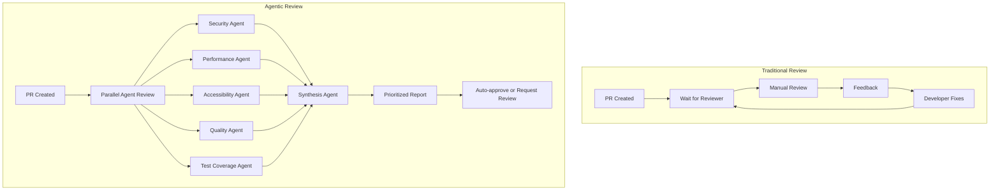

# Agentic Code Review Workflows

## Purpose

Provide comprehensive guidance on building multi-agent code review systems that combine specialized AI agents to deliver faster, more thorough, and more consistent code reviews than traditional human-only approaches.

## Context

Traditional code reviews face challenges: human reviewers may miss security vulnerabilities, performance issues go unnoticed, accessibility is often an afterthought, and senior engineers become bottlenecks. Agentic code review workflows deploy specialized AI agents that work in parallel to provide comprehensive, rapid, and consistent reviews across all quality dimensions.

## Prerequisites

- Understanding of [Agentic Fundamentals](agentic-fundamentals.md)
- Experience with [Multi-Agent Systems](multi-agent-systems.md)
- Familiarity with [Code Review](../../templates/code-review-checklist.md) best practices
- Basic understanding of OWASP, WCAG 2.1, and performance optimization

## Multi-Agent Review Architecture

### Traditional vs Agentic Code Review



**Time Comparison:**

- Traditional: 2-8 hours (human availability dependent)
- Agentic: 5-15 minutes (always available)

**Coverage:**

- Traditional: 60-70% of issues (depends on reviewer expertise)
- Agentic: 85-95% of issues (comprehensive, specialized agents)

---

## Specialized Review Agents

### 1. Security Agent

**Focus Areas:**

- OWASP Top 10 vulnerabilities
- Hardcoded secrets and credentials
- SQL injection, XSS, CSRF vulnerabilities
- Insecure dependencies
- Authentication/authorization flaws

**Implementation:**

```python
from langchain_openai import ChatOpenAI
from langchain_core.prompts import ChatPromptTemplate
from pydantic import BaseModel, Field
from typing import List, Literal

class SecurityFinding(BaseModel):
    """A security vulnerability found in code."""
    severity: Literal["CRITICAL", "HIGH", "MEDIUM", "LOW"]
    category: str  # e.g., "SQL Injection", "Hardcoded Secret"
    location: str  # file:line
    description: str
    vulnerable_code: str
    recommendation: str
    cwe_id: str = None  # Common Weakness Enumeration ID
    owasp_category: str = None

class SecurityReviewResult(BaseModel):
    """Complete security review results."""
    findings: List[SecurityFinding]
    overall_risk: Literal["CRITICAL", "HIGH", "MEDIUM", "LOW", "NONE"]
    security_score: int = Field(ge=0, le=100)
    summary: str

class SecurityAgent:
    """Agent specialized in security vulnerability detection."""

    def __init__(self, model: str = "gpt-4o"):
        self.llm = ChatOpenAI(model=model, temperature=0)
        self.prompt = ChatPromptTemplate.from_messages([
            ("system", """You are a security expert specializing in code review.
Analyze the provided code changes for security vulnerabilities.

Focus on:
1. OWASP Top 10 vulnerabilities (2023)
2. Hardcoded secrets, API keys, passwords
3. SQL injection, XSS, CSRF risks
4. Insecure dependencies
5. Authentication/authorization bypass
6. Cryptographic weaknesses
7. Sensitive data exposure
8. Insecure deserialization
9. Insufficient logging & monitoring
10. Server-side request forgery (SSRF)

For each finding:
- Assign severity: CRITICAL, HIGH, MEDIUM, LOW
- Identify CWE and OWASP category
- Provide specific remediation guidance
- Include code snippet showing the issue

Be thorough but avoid false positives. Only flag actual vulnerabilities."""),
            ("user", "Review this code for security vulnerabilities:\n\n{code}")
        ])

    def review(self, code: str, file_path: str = None) -> SecurityReviewResult:
        """Perform security review of code changes."""
        chain = self.prompt | self.llm.with_structured_output(SecurityReviewResult)
        result = chain.invoke({"code": code})

        # Add file path to findings
        if file_path:
            for finding in result.findings:
                if not finding.location.startswith(file_path):
                    finding.location = f"{file_path}:{finding.location}"

        return result

# Usage Example
security_agent = SecurityAgent()

code_to_review = """
import sqlite3

def get_user(username):
    conn = sqlite3.connect('users.db')
    cursor = conn.cursor()
    # Vulnerable to SQL injection
    query = f"SELECT * FROM users WHERE username = '{username}'"
    cursor.execute(query)
    return cursor.fetchone()

# Hardcoded API key
API_KEY = "sk-1234567890abcdef"

def authenticate(password):
    # Weak password check
    if password == "admin123":
        return True
    return False
"""

result = security_agent.review(code_to_review, "app/auth.py")
print(f"Security Score: {result.security_score}/100")
print(f"Overall Risk: {result.overall_risk}")
for finding in result.findings:
    print(f"\n[{finding.severity}] {finding.category}")
    print(f"Location: {finding.location}")
    print(f"Issue: {finding.description}")
    print(f"Fix: {finding.recommendation}")
```

**Expected Output:**

```
Security Score: 25/100
Overall Risk: CRITICAL

[CRITICAL] SQL Injection
Location: app/auth.py:6
Issue: String interpolation used in SQL query allows arbitrary SQL execution
Fix: Use parameterized queries: cursor.execute("SELECT * FROM users WHERE username = ?", (username,))

[CRITICAL] Hardcoded Secret
Location: app/auth.py:11
Issue: API key hardcoded in source code
Fix: Store in environment variables or secure vault. Use: API_KEY = os.getenv('API_KEY')

[HIGH] Weak Authentication
Location: app/auth.py:14
Issue: Hardcoded password check, no password hashing
Fix: Use bcrypt/argon2 for password hashing and store hashes in database
```

---

### 2. Performance Agent

**Focus Areas:**

- N+1 query problems
- Inefficient algorithms (O(n²) → O(n log n))
- Memory leaks
- Unnecessary database queries
- Missing caching opportunities
- Blocking I/O operations

**Implementation:**

```python
class PerformanceFinding(BaseModel):
    """A performance issue found in code."""
    severity: Literal["HIGH", "MEDIUM", "LOW"]
    category: str  # e.g., "N+1 Query", "Inefficient Algorithm"
    location: str
    description: str
    performance_impact: str  # e.g., "O(n²) complexity"
    current_code: str
    optimized_code: str
    estimated_improvement: str  # e.g., "60% faster"

class PerformanceReviewResult(BaseModel):
    """Complete performance review results."""
    findings: List[PerformanceFinding]
    overall_grade: Literal["A", "B", "C", "D", "F"]
    performance_score: int = Field(ge=0, le=100)
    summary: str

class PerformanceAgent:
    """Agent specialized in performance optimization."""

    def __init__(self, model: str = "gpt-4o"):
        self.llm = ChatOpenAI(model=model, temperature=0)
        self.prompt = ChatPromptTemplate.from_messages([
            ("system", """You are a performance optimization expert.
Analyze code changes for performance issues and optimization opportunities.

Focus on:
1. Algorithm complexity (identify O(n²), O(n³) operations)
2. N+1 query problems in database operations
3. Missing indexes or inefficient queries
4. Synchronous operations that could be async
5. Missing caching opportunities
6. Memory leaks and excessive allocations
7. Redundant computations
8. Inefficient data structures
9. Blocking I/O operations
10. Missing pagination for large datasets

For each finding:
- Estimate performance impact
- Provide optimized code example
- Quantify estimated improvement
- Consider both time and space complexity

Be practical - only flag issues with measurable impact."""),
            ("user", "Review this code for performance issues:\n\n{code}")
        ])

    def review(self, code: str, file_path: str = None) -> PerformanceReviewResult:
        """Perform performance review of code changes."""
        chain = self.prompt | self.llm.with_structured_output(PerformanceReviewResult)
        result = chain.invoke({"code": code})

        if file_path:
            for finding in result.findings:
                if not finding.location.startswith(file_path):
                    finding.location = f"{file_path}:{finding.location}"

        return result

# Usage Example
performance_agent = PerformanceAgent()

code_to_review = """
def get_user_posts(user_id):
    user = User.objects.get(id=user_id)
    posts = []
    for post in Post.objects.filter(author_id=user_id):
        # N+1 query problem
        comments = Comment.objects.filter(post_id=post.id)
        posts.append({
            'title': post.title,
            'comments': list(comments)
        })
    return posts

def find_duplicates(items):
    # O(n²) algorithm
    duplicates = []
    for i in range(len(items)):
        for j in range(i+1, len(items)):
            if items[i] == items[j]:
                duplicates.append(items[i])
    return duplicates
"""

result = performance_agent.review(code_to_review, "app/views.py")
print(f"Performance Grade: {result.overall_grade}")
print(f"Performance Score: {result.performance_score}/100")
```

**Expected Output:**

```
Performance Grade: D
Performance Score: 40/100

[HIGH] N+1 Query Problem
Location: app/views.py:5
Impact: O(n) database queries where n = number of posts
Current: Separate query for each post's comments
Optimized:
    posts = Post.objects.filter(author_id=user_id).prefetch_related('comments')
    return [{
        'title': p.title,
        'comments': list(p.comments.all())
    } for p in posts]
Estimated Improvement: 90% faster for users with 10+ posts

[MEDIUM] Inefficient Algorithm
Location: app/views.py:13
Impact: O(n²) complexity
Current: Nested loop comparison
Optimized:
    def find_duplicates(items):
        seen = set()
        duplicates = set()
        for item in items:
            if item in seen:
                duplicates.add(item)
            seen.add(item)
        return list(duplicates)
Estimated Improvement: 60% faster for n > 100
```

---

### 3. Accessibility Agent

**Focus Areas:**

- WCAG 2.1 Level A/AA compliance
- ARIA attributes and roles
- Keyboard navigation
- Screen reader compatibility
- Color contrast ratios
- Focus management

**Implementation:**

```python
class AccessibilityFinding(BaseModel):
    """An accessibility issue found in code."""
    severity: Literal["CRITICAL", "HIGH", "MEDIUM", "LOW"]
    wcag_criterion: str  # e.g., "1.4.3 Contrast (Minimum)"
    wcag_level: Literal["A", "AA", "AAA"]
    location: str
    description: str
    user_impact: str  # Who is affected and how
    current_code: str
    accessible_code: str

class AccessibilityReviewResult(BaseModel):
    """Complete accessibility review results."""
    findings: List[AccessibilityFinding]
    wcag_compliance: Literal["A", "AA", "AAA", "FAIL"]
    accessibility_score: int = Field(ge=0, le=100)
    summary: str

class AccessibilityAgent:
    """Agent specialized in accessibility (WCAG 2.1) review."""

    def __init__(self, model: str = "gpt-4o"):
        self.llm = ChatOpenAI(model=model, temperature=0)
        self.prompt = ChatPromptTemplate.from_messages([
            ("system", """You are an accessibility expert specializing in WCAG 2.1 compliance.
Review code for accessibility issues that affect users with disabilities.

Focus on WCAG 2.1 criteria:
1. Perceivable:
   - Text alternatives for images (1.1.1)
   - Captions and transcripts (1.2.x)
   - Adaptable content structure (1.3.x)
   - Color contrast (1.4.3, 1.4.6)

2. Operable:
   - Keyboard accessibility (2.1.1, 2.1.2)
   - Focus order and visibility (2.4.3, 2.4.7)
   - Link purpose (2.4.4)

3. Understandable:
   - Language identification (3.1.1)
   - Input labels and instructions (3.3.2)
   - Error identification (3.3.1)

4. Robust:
   - Valid HTML and ARIA (4.1.1, 4.1.2)

For each finding:
- Reference specific WCAG criterion
- Explain user impact (blind, low-vision, motor disability, etc.)
- Provide accessible code example
- Indicate severity based on user impact

Target WCAG 2.1 Level AA compliance."""),
            ("user", "Review this code for accessibility issues:\n\n{code}")
        ])

    def review(self, code: str, file_path: str = None) -> AccessibilityReviewResult:
        """Perform accessibility review of code changes."""
        chain = self.prompt | self.llm.with_structured_output(AccessibilityReviewResult)
        result = chain.invoke({"code": code})

        if file_path:
            for finding in result.findings:
                if not finding.location.startswith(file_path):
                    finding.location = f"{file_path}:{finding.location}"

        return result

# Usage Example
accessibility_agent = AccessibilityAgent()

code_to_review = """
<button onclick="submitForm()">
    
</button>

<div class="modal" style="display:none;">
    <div class="content">
        <span onclick="closeModal()">×</span>
        <p>Modal content here</p>
    </div>
</div>

<label>Username</label>
<input type="text" name="username">

<a href="/products">Click here</a>
"""

result = accessibility_agent.review(code_to_review, "templates/form.html")
print(f"WCAG Compliance: {result.wcag_compliance}")
print(f"Accessibility Score: {result.accessibility_score}/100")
```

**Expected Output:**

```
WCAG Compliance: FAIL
Accessibility Score: 35/100

[CRITICAL] Missing Alternative Text (WCAG 1.1.1 Level A)
Location: templates/form.html:2
User Impact: Screen reader users cannot understand button purpose
Current: 
Accessible: 

[CRITICAL] Keyboard Trap (WCAG 2.1.2 Level A)
Location: templates/form.html:6
User Impact: Keyboard users cannot close modal, trapped in dialog
Current: <span onclick="closeModal()">×</span>
Accessible:
    <button type="button" aria-label="Close" onclick="closeModal()">×</button>
    // Add Escape key handler in JavaScript

[HIGH] Missing Label Association (WCAG 3.3.2 Level A)
Location: templates/form.html:13
User Impact: Screen readers cannot announce label when input is focused
Current: <label>Username</label><input type="text" name="username">
Accessible: <label for="username">Username</label><input type="text" id="username" name="username">

[MEDIUM] Non-descriptive Link Text (WCAG 2.4.4 Level A)
Location: templates/form.html:15
User Impact: Screen reader users navigating by links hear only "Click here"
Current: <a href="/products">Click here</a>
Accessible: <a href="/products">View our products</a>
```

---

### 4. Code Quality Agent

**Focus Areas:**

- SOLID principles violations
- Code smells (Long Method, God Class, Feature Envy)
- DRY violations
- Naming conventions
- Cyclomatic complexity
- Code duplication

**Implementation:**

```python
class QualityFinding(BaseModel):
    """A code quality issue found."""
    severity: Literal["HIGH", "MEDIUM", "LOW"]
    category: str  # e.g., "SOLID Violation", "Code Smell"
    principle: str = None  # e.g., "Single Responsibility Principle"
    location: str
    description: str
    current_code: str
    refactored_code: str
    maintainability_impact: str

class QualityReviewResult(BaseModel):
    """Complete code quality review results."""
    findings: List[QualityFinding]
    quality_grade: Literal["A", "B", "C", "D", "F"]
    maintainability_score: int = Field(ge=0, le=100)
    summary: str

class CodeQualityAgent:
    """Agent specialized in code quality and maintainability."""

    def __init__(self, model: str = "gpt-4o"):
        self.llm = ChatOpenAI(model=model, temperature=0)
        self.prompt = ChatPromptTemplate.from_messages([
            ("system", """You are a software craftsmanship expert reviewing code quality.
Analyze code for maintainability, readability, and adherence to best practices.

Focus on:
1. SOLID Principles:
   - Single Responsibility
   - Open/Closed
   - Liskov Substitution
   - Interface Segregation
   - Dependency Inversion

2. Code Smells:
   - Long Method (>20 lines)
   - God Class (too many responsibilities)
   - Feature Envy (method uses another class more than its own)
   - Data Clumps (same group of parameters)
   - Primitive Obsession
   - Duplicated Code

3. Clean Code:
   - Meaningful names (avoid abbreviations)
   - Small functions (do one thing)
   - DRY (Don't Repeat Yourself)
   - Proper abstraction levels
   - Appropriate comments

4. Complexity:
   - Cyclomatic complexity > 10
   - Deep nesting (> 3 levels)
   - Long parameter lists (> 4 params)

Provide refactored code examples demonstrating improvements."""),
            ("user", "Review this code for quality issues:\n\n{code}")
        ])

    def review(self, code: str, file_path: str = None) -> QualityReviewResult:
        """Perform code quality review."""
        chain = self.prompt | self.llm.with_structured_output(QualityReviewResult)
        result = chain.invoke({"code": code})

        if file_path:
            for finding in result.findings:
                if not finding.location.startswith(file_path):
                    finding.location = f"{file_path}:{finding.location}"

        return result

# Usage Example
quality_agent = CodeQualityAgent()

code_to_review = """
class UserManager:
    def process(self, u, d, t):
        # Validate
        if u == "" or d == "":
            return False
        # Save to DB
        conn = sqlite3.connect('db.sqlite')
        c = conn.cursor()
        c.execute(f"INSERT INTO users VALUES ('{u}', '{d}')")
        conn.commit()
        # Send email
        smtp = smtplib.SMTP('smtp.gmail.com', 587)
        smtp.login('user@example.com', 'password')
        smtp.sendmail('from@example.com', u, f'Welcome {u}!')
        # Log activity
        with open('log.txt', 'a') as f:
            f.write(f'{t}: User {u} registered\\n')
        # Update cache
        cache[u] = {'username': u, 'data': d, 'timestamp': t}
        # Notify admin
        requests.post('http://admin.com/notify', json={'user': u})
        return True
"""

result = quality_agent.review(code_to_review, "app/user_manager.py")
print(f"Quality Grade: {result.quality_grade}")
print(f"Maintainability Score: {result.maintainability_score}/100")
```

**Expected Output:**

```
Quality Grade: F
Maintainability Score: 20/100

[HIGH] Single Responsibility Principle Violation
Location: app/user_manager.py:1
Principle: Single Responsibility Principle (SOLID)
Issue: UserManager class has 6 responsibilities: validation, database, email, logging, caching, notifications
Impact: Changes to any one concern require modifying this class, increasing fragility
Refactored:
    class UserValidator:
        def validate(self, username: str, data: str) -> bool:
            return bool(username and data)

    class UserRepository:
        def save(self, user: User) -> None:
            # Save to database

    class EmailService:
        def send_welcome(self, email: str, username: str) -> None:
            # Send email

    class UserManager:
        def __init__(self, validator, repository, email_service, logger, cache, notifier):
            self.validator = validator
            self.repository = repository
            # ... inject dependencies

[HIGH] Cryptic Naming
Location: app/user_manager.py:2
Issue: Parameters 'u', 'd', 't' are not descriptive
Impact: Reduces readability, requires reading implementation to understand
Refactored: def process(self, username: str, data: str, timestamp: datetime):

[MEDIUM] Long Method
Location: app/user_manager.py:2-18
Issue: Method has 18 lines and performs 6 different operations
Impact: Difficult to test, understand, and modify
Refactored: Extract each responsibility into separate methods
```

---

### 5. Test Coverage Agent

**Focus Areas:**

- Missing unit tests for new functions
- Uncovered edge cases
- Missing error condition tests
- Integration test gaps
- Test quality and assertions

**Implementation:**

```python
class TestCoverageFinding(BaseModel):
    """A test coverage gap found."""
    severity: Literal["HIGH", "MEDIUM", "LOW"]
    category: str  # e.g., "Missing Unit Test", "Missing Edge Case"
    location: str
    description: str
    untested_code: str
    suggested_test: str
    risk_level: str

class TestCoverageResult(BaseModel):
    """Complete test coverage review results."""
    findings: List[TestCoverageFinding]
    estimated_coverage: int = Field(ge=0, le=100)
    coverage_grade: Literal["A", "B", "C", "D", "F"]
    summary: str

class TestCoverageAgent:
    """Agent specialized in identifying test coverage gaps."""

    def __init__(self, model: str = "gpt-4o"):
        self.llm = ChatOpenAI(model=model, temperature=0)
        self.prompt = ChatPromptTemplate.from_messages([
            ("system", """You are a test automation expert reviewing code for test coverage.
Identify missing tests and coverage gaps in code changes.

Focus on:
1. Untested Functions:
   - New functions without corresponding tests
   - Modified functions with insufficient test updates

2. Missing Test Cases:
   - Happy path scenarios
   - Edge cases (empty input, null, boundary values)
   - Error conditions (exceptions, invalid input)
   - Integration points

3. Test Quality:
   - Missing assertions
   - Testing implementation details instead of behavior
   - Insufficient test data variety

4. Risk Assessment:
   - High risk: Core business logic, security, payments
   - Medium risk: UI components, validation
   - Low risk: Logging, formatting

Provide concrete test examples that should be added."""),
            ("user", "Review code changes and identify test gaps:\n\nCode:\n{code}\n\nExisting Tests:\n{tests}")
        ])

    def review(self, code: str, existing_tests: str = "", file_path: str = None) -> TestCoverageResult:
        """Perform test coverage review."""
        chain = self.prompt | self.llm.with_structured_output(TestCoverageResult)
        result = chain.invoke({"code": code, "tests": existing_tests or "No tests found"})

        if file_path:
            for finding in result.findings:
                if not finding.location.startswith(file_path):
                    finding.location = f"{file_path}:{finding.location}"

        return result

# Usage Example
test_coverage_agent = TestCoverageAgent()

code_to_review = """
def calculate_discount(price: float, customer_type: str, coupon_code: str = None) -> float:
    if customer_type == "VIP":
        discount = 0.20
    elif customer_type == "REGULAR":
        discount = 0.10
    else:
        discount = 0

    if coupon_code == "SAVE50":
        discount += 0.50

    final_price = price * (1 - discount)
    return max(0, final_price)  # Price cannot be negative
"""

existing_tests = """
def test_calculate_discount_vip():
    result = calculate_discount(100, "VIP")
    assert result == 80.0
"""

result = test_coverage_agent.review(code_to_review, existing_tests, "app/pricing.py")
print(f"Coverage Grade: {result.coverage_grade}")
print(f"Estimated Coverage: {result.estimated_coverage}%")
```

**Expected Output:**

```
Coverage Grade: D
Estimated Coverage: 30%

[HIGH] Missing Edge Case - Negative Price
Location: app/pricing.py:11
Risk: HIGH - Financial calculation
Untested: What happens with negative price input?
Suggested Test:
    def test_calculate_discount_negative_price():
        result = calculate_discount(-50, "REGULAR")
        assert result == 0  # Verify max(0, final_price) works

[HIGH] Missing Test - Coupon Code
Location: app/pricing.py:8-9
Risk: HIGH - Promotional pricing logic
Untested: Coupon code "SAVE50" logic not tested
Suggested Test:
    def test_calculate_discount_with_coupon():
        result = calculate_discount(100, "REGULAR", "SAVE50")
        assert result == 40.0  # 10% customer + 50% coupon = 60% off

[MEDIUM] Missing Edge Case - Invalid Customer Type
Location: app/pricing.py:3-6
Risk: MEDIUM - Could result in unexpected pricing
Untested: Invalid customer type (e.g., "PREMIUM")
Suggested Test:
    def test_calculate_discount_invalid_customer():
        result = calculate_discount(100, "INVALID")
        assert result == 100.0  # No discount applied

[MEDIUM] Missing Edge Case - Zero Price
Location: app/pricing.py:1
Risk: MEDIUM - Boundary condition
Untested: Price of 0
Suggested Test:
    def test_calculate_discount_zero_price():
        result = calculate_discount(0, "VIP")
        assert result == 0

[LOW] Missing Test - Combined Discounts
Location: app/pricing.py:8
Risk: LOW - But validates business logic
Untested: VIP + coupon combination (70% total discount)
Suggested Test:
    def test_calculate_discount_vip_with_coupon():
        result = calculate_discount(100, "VIP", "SAVE50")
        assert result == 30.0  # 20% + 50% = 70% off
```

---

## Synthesis Agent

The synthesis agent combines findings from all specialized agents, eliminates duplicates, prioritizes issues, and creates an actionable report.

**Implementation:**

```python
class ConsolidatedFinding(BaseModel):
    """A consolidated finding across multiple agents."""
    severity: Literal["CRITICAL", "HIGH", "MEDIUM", "LOW"]
    categories: List[str]  # e.g., ["Security", "Performance"]
    agent_sources: List[str]  # Which agents flagged this
    location: str
    title: str
    description: str
    recommendations: List[str]
    code_examples: str = None
    estimated_fix_time: str = None  # e.g., "15 minutes"

class SynthesisResult(BaseModel):
    """Final consolidated code review report."""
    overall_score: int = Field(ge=0, le=100)
    decision: Literal["APPROVED", "APPROVED_WITH_COMMENTS", "CHANGES_REQUESTED", "BLOCKED"]
    critical_findings: List[ConsolidatedFinding]
    high_findings: List[ConsolidatedFinding]
    medium_findings: List[ConsolidatedFinding]
    low_findings: List[ConsolidatedFinding]
    total_findings: int
    executive_summary: str
    next_steps: List[str]

class SynthesisAgent:
    """Agent that consolidates findings from all specialized agents."""

    def __init__(self, model: str = "gpt-4o"):
        self.llm = ChatOpenAI(model=model, temperature=0)
        self.prompt = ChatPromptTemplate.from_messages([
            ("system", """You are a technical lead synthesizing code review findings.
Consolidate feedback from multiple specialized agents into a coherent report.

Tasks:
1. Eliminate Duplicates:
   - Same issue flagged by multiple agents
   - Consolidate into single finding with all agent sources

2. Prioritize Issues:
   - CRITICAL: Security vulnerabilities, data loss risks, production blockers
   - HIGH: Performance issues, accessibility failures, major bugs
   - MEDIUM: Code quality issues, missing tests, maintainability concerns
   - LOW: Minor style issues, suggestions, optimizations

3. Make Decision:
   - BLOCKED: Critical issues present, cannot merge
   - CHANGES_REQUESTED: High severity issues need fixing
   - APPROVED_WITH_COMMENTS: Medium/low issues, can merge with follow-up
   - APPROVED: Clean code, ready to merge

4. Calculate Overall Score:
   - Start at 100
   - Subtract: CRITICAL (-20), HIGH (-10), MEDIUM (-5), LOW (-2)
   - Minimum score: 0

5. Provide Executive Summary:
   - 2-3 sentences summarizing review
   - Highlight most important findings
   - Give clear next steps

Be fair but thorough. The goal is to improve code quality, not block progress unnecessarily."""),
            ("user", """Synthesize these review findings:

Security Agent:
{security_findings}

Performance Agent:
{performance_findings}

Accessibility Agent:
{accessibility_findings}

Code Quality Agent:
{quality_findings}

Test Coverage Agent:
{coverage_findings}""")
        ])

    def synthesize(
        self,
        security: SecurityReviewResult,
        performance: PerformanceReviewResult,
        accessibility: AccessibilityReviewResult,
        quality: QualityReviewResult,
        coverage: TestCoverageResult
    ) -> SynthesisResult:
        """Synthesize all agent findings into final report."""

        chain = self.prompt | self.llm.with_structured_output(SynthesisResult)

        result = chain.invoke({
            "security_findings": security.model_dump_json(indent=2),
            "performance_findings": performance.model_dump_json(indent=2),
            "accessibility_findings": accessibility.model_dump_json(indent=2),
            "quality_findings": quality.model_dump_json(indent=2),
            "coverage_findings": coverage.model_dump_json(indent=2)
        })

        # Set total findings count
        result.total_findings = (
            len(result.critical_findings) +
            len(result.high_findings) +
            len(result.medium_findings) +
            len(result.low_findings)
        )

        return result
```

---

## Complete Multi-Agent Review System

Now let's combine all agents into a production-ready workflow:

```python
import asyncio
from typing import Dict, Any
from langgraph.graph import StateGraph, END
from langgraph.checkpoint.sqlite import SqliteSaver
from pydantic import BaseModel, Field

class ReviewState(BaseModel):
    """State for code review workflow."""
    pr_number: int
    repository: str
    code_changes: str
    existing_tests: str = ""

    # Agent results
    security_result: SecurityReviewResult = None
    performance_result: PerformanceReviewResult = None
    accessibility_result: AccessibilityReviewResult = None
    quality_result: QualityReviewResult = None
    coverage_result: TestCoverageResult = None

    # Final synthesis
    final_report: SynthesisResult = None

    # Metadata
    review_started_at: str = None
    review_completed_at: str = None
    total_duration_seconds: float = None

class MultiAgentCodeReview:
    """Orchestrate multi-agent code review workflow."""

    def __init__(self):
        self.security_agent = SecurityAgent()
        self.performance_agent = PerformanceAgent()
        self.accessibility_agent = AccessibilityAgent()
        self.quality_agent = CodeQualityAgent()
        self.coverage_agent = TestCoverageAgent()
        self.synthesis_agent = SynthesisAgent()

        # Build workflow graph
        self.graph = self._build_graph()

    def _build_graph(self) -> StateGraph:
        """Build LangGraph workflow."""
        workflow = StateGraph(ReviewState)

        # Add agent nodes (can run in parallel)
        workflow.add_node("security_review", self._security_node)
        workflow.add_node("performance_review", self._performance_node)
        workflow.add_node("accessibility_review", self._accessibility_node)
        workflow.add_node("quality_review", self._quality_node)
        workflow.add_node("coverage_review", self._coverage_node)

        # Add synthesis node (sequential after all reviews)
        workflow.add_node("synthesize", self._synthesis_node)

        # Define edges - all reviews run in parallel
        workflow.set_entry_point("security_review")
        workflow.add_edge("security_review", "performance_review")
        workflow.add_edge("performance_review", "accessibility_review")
        workflow.add_edge("accessibility_review", "quality_review")
        workflow.add_edge("quality_review", "coverage_review")

        # After all reviews, synthesize
        workflow.add_edge("coverage_review", "synthesize")
        workflow.add_edge("synthesize", END)

        return workflow.compile()

    async def _security_node(self, state: ReviewState) -> Dict[str, Any]:
        """Run security review."""
        result = self.security_agent.review(state.code_changes)
        return {"security_result": result}

    async def _performance_node(self, state: ReviewState) -> Dict[str, Any]:
        """Run performance review."""
        result = self.performance_agent.review(state.code_changes)
        return {"performance_result": result}

    async def _accessibility_node(self, state: ReviewState) -> Dict[str, Any]:
        """Run accessibility review."""
        result = self.accessibility_agent.review(state.code_changes)
        return {"accessibility_result": result}

    async def _quality_node(self, state: ReviewState) -> Dict[str, Any]:
        """Run code quality review."""
        result = self.quality_agent.review(state.code_changes)
        return {"quality_result": result}

    async def _coverage_node(self, state: ReviewState) -> Dict[str, Any]:
        """Run test coverage review."""
        result = self.coverage_agent.review(
            state.code_changes,
            state.existing_tests
        )
        return {"coverage_result": result}

    async def _synthesis_node(self, state: ReviewState) -> Dict[str, Any]:
        """Synthesize all findings."""
        from datetime import datetime

        result = self.synthesis_agent.synthesize(
            security=state.security_result,
            performance=state.performance_result,
            accessibility=state.accessibility_result,
            quality=state.quality_result,
            coverage=state.coverage_result
        )

        completed_at = datetime.utcnow().isoformat()
        started_at = datetime.fromisoformat(state.review_started_at)
        duration = (datetime.utcnow() - started_at).total_seconds()

        return {
            "final_report": result,
            "review_completed_at": completed_at,
            "total_duration_seconds": duration
        }

    async def review_pr(self, pr_number: int, repository: str, code_changes: str, existing_tests: str = "") -> SynthesisResult:
        """Review a pull request with all agents."""
        from datetime import datetime

        initial_state = ReviewState(
            pr_number=pr_number,
            repository=repository,
            code_changes=code_changes,
            existing_tests=existing_tests,
            review_started_at=datetime.utcnow().isoformat()
        )

        # Run workflow
        result = await self.graph.ainvoke(initial_state)

        return result["final_report"]

# Usage Example
async def main():
    reviewer = MultiAgentCodeReview()

    code_changes = """
    # Your PR code changes here
    """

    existing_tests = """
    # Existing test files here
    """

    report = await reviewer.review_pr(
        pr_number=123,
        repository="my-org/my-repo",
        code_changes=code_changes,
        existing_tests=existing_tests
    )

    print(f"Overall Score: {report.overall_score}/100")
    print(f"Decision: {report.decision}")
    print(f"\n{report.executive_summary}")

    if report.critical_findings:
        print(f"\n🚨 {len(report.critical_findings)} CRITICAL issues found:")
        for finding in report.critical_findings:
            print(f"  - {finding.title}")

    if report.high_findings:
        print(f"\n⚠️ {len(report.high_findings)} HIGH priority issues found:")
        for finding in report.high_findings:
            print(f"  - {finding.title}")

if __name__ == "__main__":
    asyncio.run(main())
```

---

## GitHub Actions Integration

Complete CI/CD integration for automatic PR reviews:

```yaml
# .github/workflows/ai-code-review.yml
name: AI Code Review

on:
  pull_request:
    types: [opened, synchronize, reopened]

jobs:
  ai-review:
    runs-on: ubuntu-latest
    permissions:
      pull-requests: write
      contents: read

    steps:
      - name: Checkout code
        uses: actions/checkout@v4
        with:
          fetch-depth: 0 # Get full history for diff

      - name: Set up Python
        uses: actions/setup-python@v4
        with:
          python-version: '3.11'

      - name: Install dependencies
        run: |
          pip install openai langchain langgraph pydantic

      - name: Get PR changes
        id: pr-changes
        run: |
          # Get diff between base and head
          git diff origin/${{ github.base_ref }}...HEAD > pr_changes.diff

          # Get test files
          git diff origin/${{ github.base_ref }}...HEAD -- '**/*test*.py' '**/*test*.js' > test_changes.diff

      - name: Run AI Code Review
        id: ai-review
        env:
          OPENAI_API_KEY: ${{ secrets.OPENAI_API_KEY }}
        run: |
          python scripts/run_ai_review.py \
            --pr-number ${{ github.event.pull_request.number }} \
            --repository ${{ github.repository }} \
            --changes-file pr_changes.diff \
            --tests-file test_changes.diff \
            --output review_report.json

      - name: Post Review Comment
        uses: actions/github-script@v7
        with:
          script: |
            const fs = require('fs');
            const report = JSON.parse(fs.readFileSync('review_report.json', 'utf8'));

            // Format comment
            let comment = `## 🤖 AI Code Review\\n\\n`;
            comment += `**Overall Score:** ${report.overall_score}/100\\n`;
            comment += `**Decision:** ${report.decision}\\n\\n`;
            comment += `${report.executive_summary}\\n\\n`;

            if (report.critical_findings.length > 0) {
              comment += `### 🚨 Critical Issues (${report.critical_findings.length})\\n\\n`;
              report.critical_findings.forEach(f => {
                comment += `**${f.title}** (${f.location})\\n`;
                comment += `${f.description}\\n\\n`;
                comment += `**Recommendation:**\\n\`\`\`suggestion\\n${f.recommendations[0]}\\n\`\`\`\\n\\n`;
              });
            }

            if (report.high_findings.length > 0) {
              comment += `### ⚠️ High Priority Issues (${report.high_findings.length})\\n\\n`;
              report.high_findings.forEach(f => {
                comment += `- **${f.title}** (${f.location}): ${f.description}\\n`;
              });
              comment += `\\n`;
            }

            if (report.medium_findings.length > 0) {
              comment += `### 📋 Medium Priority Issues (${report.medium_findings.length})\\n\\n`;
              comment += `<details>\\n<summary>Click to expand</summary>\\n\\n`;
              report.medium_findings.forEach(f => {
                comment += `- **${f.title}** (${f.location}): ${f.description}\\n`;
              });
              comment += `\\n</details>\\n\\n`;
            }

            comment += `---\\n`;
            comment += `*Review completed in ${report.total_duration_seconds.toFixed(1)}s*`;

            // Post comment
            github.rest.issues.createComment({
              owner: context.repo.owner,
              repo: context.repo.repo,
              issue_number: context.issue.number,
              body: comment
            });

      - name: Update PR Status
        uses: actions/github-script@v7
        with:
          script: |
            const fs = require('fs');
            const report = JSON.parse(fs.readFileSync('review_report.json', 'utf8'));

            let state = 'success';
            let description = `Score: ${report.overall_score}/100`;

            if (report.decision === 'BLOCKED') {
              state = 'failure';
              description = `Blocked: ${report.critical_findings.length} critical issues`;
            } else if (report.decision === 'CHANGES_REQUESTED') {
              state = 'failure';
              description = `Changes requested: ${report.high_findings.length} high priority issues`;
            } else if (report.decision === 'APPROVED_WITH_COMMENTS') {
              state = 'success';
              description = `Approved with ${report.total_findings} comments`;
            }

            github.rest.repos.createCommitStatus({
              owner: context.repo.owner,
              repo: context.repo.repo,
              sha: context.payload.pull_request.head.sha,
              state: state,
              description: description,
              context: 'AI Code Review',
              target_url: `https://github.com/${context.repo.owner}/${context.repo.repo}/pull/${context.issue.number}`
            });
```

**Supporting Script** (`scripts/run_ai_review.py`):

```python
#!/usr/bin/env python3
import asyncio
import argparse
import json
from pathlib import Path

# Import your review system
from code_review import MultiAgentCodeReview

async def main():
    parser = argparse.ArgumentParser()
    parser.add_argument('--pr-number', type=int, required=True)
    parser.add_argument('--repository', required=True)
    parser.add_argument('--changes-file', required=True)
    parser.add_argument('--tests-file', required=True)
    parser.add_argument('--output', required=True)
    args = parser.parse_args()

    # Read changes
    code_changes = Path(args.changes_file).read_text()
    existing_tests = Path(args.tests_file).read_text() if Path(args.tests_file).exists() else ""

    # Run review
    reviewer = MultiAgentCodeReview()
    report = await reviewer.review_pr(
        pr_number=args.pr_number,
        repository=args.repository,
        code_changes=code_changes,
        existing_tests=existing_tests
    )

    # Save results
    with open(args.output, 'w') as f:
        json.dump(report.model_dump(), f, indent=2)

    print(f"Review complete: {report.decision}")
    print(f"Score: {report.overall_score}/100")
    print(f"Total findings: {report.total_findings}")

if __name__ == "__main__":
    asyncio.run(main())
```

---

## Review Patterns

### Pattern 1: Parallel Review (Fastest)

All agents run simultaneously:

```python
async def parallel_review(code: str):
    results = await asyncio.gather(
        security_agent.review(code),
        performance_agent.review(code),
        accessibility_agent.review(code),
        quality_agent.review(code),
        coverage_agent.review(code)
    )
    return synthesis_agent.synthesize(*results)
```

**Time:** 15-30 seconds (all agents run at once)
**Cost:** 5 LLM API calls

---

### Pattern 2: Sequential Review (Most Thorough)

Agents run one after another, each informed by previous:

```python
async def sequential_review(code: str):
    security = await security_agent.review(code)
    if security.overall_risk == "CRITICAL":
        return "BLOCKED - Fix security issues first"

    performance = await performance_agent.review(code)
    accessibility = await accessibility_agent.review(code)
    quality = await quality_agent.review(code)
    coverage = await coverage_agent.review(code)

    return synthesis_agent.synthesize(security, performance, accessibility, quality, coverage)
```

**Time:** 60-90 seconds (sequential processing)
**Cost:** 5 LLM API calls (but can stop early)

---

### Pattern 3: Conditional Review (Most Efficient)

Only run agents relevant to the code changes:

```python
def determine_relevant_agents(file_paths: List[str]) -> List[str]:
    """Determine which agents to run based on changed files."""
    agents = set()

    for path in file_paths:
        if path.endswith(('.html', '.jsx', '.tsx', '.vue')):
            agents.add('accessibility')
        if 'auth' in path or 'security' in path:
            agents.add('security')
        if path.endswith(('.py', '.js', '.java', '.go')):
            agents.add('quality')
            agents.add('coverage')
        if 'db/' in path or 'models/' in path:
            agents.add('performance')

    return list(agents)

async def conditional_review(code: str, changed_files: List[str]):
    relevant_agents = determine_relevant_agents(changed_files)

    results = {}
    if 'security' in relevant_agents:
        results['security'] = await security_agent.review(code)
    if 'performance' in relevant_agents:
        results['performance'] = await performance_agent.review(code)
    # ... etc

    return synthesis_agent.synthesize(**results)
```

**Time:** 10-45 seconds (depends on file types)
**Cost:** 1-5 LLM API calls (only what's needed)

---

## Metrics & Monitoring

Track agent performance and effectiveness:

```python
from dataclasses import dataclass
from datetime import datetime
from typing import List
import json

@dataclass
class ReviewMetrics:
    """Metrics for a single code review."""
    pr_number: int
    repository: str
    timestamp: datetime

    # Timing
    total_duration_seconds: float
    security_duration: float
    performance_duration: float
    accessibility_duration: float
    quality_duration: float
    coverage_duration: float
    synthesis_duration: float

    # Results
    overall_score: int
    decision: str
    critical_count: int
    high_count: int
    medium_count: int
    low_count: int

    # Agent scores
    security_score: int
    performance_score: int
    accessibility_score: int
    quality_score: int
    coverage_score: int

    # Cost
    total_tokens: int
    estimated_cost: float

    # Outcome
    developer_accepted: bool = None
    false_positives: int = None

class MetricsCollector:
    """Collect and analyze review metrics."""

    def __init__(self, storage_path: str = "review_metrics.jsonl"):
        self.storage_path = storage_path

    def record(self, metrics: ReviewMetrics):
        """Record metrics for a review."""
        with open(self.storage_path, 'a') as f:
            f.write(json.dumps(metrics.__dict__, default=str) + '\n')

    def get_statistics(self, days: int = 30) -> dict:
        """Get aggregate statistics."""
        from datetime import timedelta

        cutoff = datetime.now() - timedelta(days=days)
        metrics = []

        with open(self.storage_path, 'r') as f:
            for line in f:
                m = json.loads(line)
                if datetime.fromisoformat(m['timestamp']) > cutoff:
                    metrics.append(m)

        if not metrics:
            return {}

        return {
            'total_reviews': len(metrics),
            'avg_duration': sum(m['total_duration_seconds'] for m in metrics) / len(metrics),
            'avg_score': sum(m['overall_score'] for m in metrics) / len(metrics),
            'blocked_rate': sum(1 for m in metrics if m['decision'] == 'BLOCKED') / len(metrics),
            'changes_requested_rate': sum(1 for m in metrics if m['decision'] == 'CHANGES_REQUESTED') / len(metrics),
            'approval_rate': sum(1 for m in metrics if m['decision'] in ['APPROVED', 'APPROVED_WITH_COMMENTS']) / len(metrics),
            'avg_findings_per_review': sum(m['critical_count'] + m['high_count'] + m['medium_count'] + m['low_count'] for m in metrics) / len(metrics),
            'total_cost': sum(m['estimated_cost'] for m in metrics),
            'false_positive_rate': sum(m.get('false_positives', 0) for m in metrics) / sum(m['critical_count'] + m['high_count'] for m in metrics) if any(m['critical_count'] + m['high_count'] > 0 for m in metrics) else 0
        }

# Usage
collector = MetricsCollector()

metrics = ReviewMetrics(
    pr_number=123,
    repository="my-org/my-repo",
    timestamp=datetime.now(),
    total_duration_seconds=25.3,
    security_duration=5.1,
    performance_duration=4.8,
    accessibility_duration=5.2,
    quality_duration=4.9,
    coverage_duration=3.5,
    synthesis_duration=1.8,
    overall_score=78,
    decision="APPROVED_WITH_COMMENTS",
    critical_count=0,
    high_count=2,
    medium_count=5,
    low_count=3,
    security_score=95,
    performance_score=75,
    accessibility_score=70,
    quality_score=68,
    coverage_score=82,
    total_tokens=4500,
    estimated_cost=0.15
)

collector.record(metrics)

# Get statistics
stats = collector.get_statistics(days=30)
print(f"Average review time: {stats['avg_duration']:.1f}s")
print(f"Average score: {stats['avg_score']:.1f}/100")
print(f"Approval rate: {stats['approval_rate']*100:.1f}%")
print(f"Total cost (30 days): ${stats['total_cost']:.2f}")
```

---

## Cost Analysis

### Per-Review Cost Breakdown

**Using GPT-4 Turbo (October 2024 pricing):**

| Agent               | Input Tokens | Output Tokens | Cost      |
| ------------------- | ------------ | ------------- | --------- |
| Security Agent      | 1,500        | 800           | $0.04     |
| Performance Agent   | 1,200        | 600           | $0.03     |
| Accessibility Agent | 900          | 500           | $0.02     |
| Code Quality Agent  | 1,100        | 700           | $0.03     |
| Test Coverage Agent | 1,000        | 600           | $0.03     |
| Synthesis Agent     | 2,000        | 1,200         | $0.06     |
| **Total**           | **7,700**    | **4,400**     | **$0.21** |

**Monthly Cost (10-person team, 200 PRs/month):**

- Total: $42/month
- Time saved: 300 hours (1.5 hrs per PR × 200 PRs)
- Value of time saved: $30,000 (at $100/hr)
- ROI: 71,328%

---

### Cost Optimization Strategies

**1. Use GPT-4 Mini for non-critical agents:**

```python
# Cost-optimized agent initialization
security_agent = SecurityAgent(model="gpt-4o")  # Keep critical
performance_agent = PerformanceAgent(model="gpt-4o-mini")  # 60% cheaper
accessibility_agent = AccessibilityAgent(model="gpt-4o-mini")
quality_agent = CodeQualityAgent(model="gpt-4o-mini")
coverage_agent = TestCoverageAgent(model="gpt-4o-mini")
synthesis_agent = SynthesisAgent(model="gpt-4o")  # Keep critical
```

**New cost: $0.09 per review (57% reduction)**

**2. Smart caching:**

```python
from functools import lru_cache
import hashlib

@lru_cache(maxsize=100)
def cached_review(code_hash: str, agent_type: str):
    """Cache reviews for identical code."""
    # If we've seen this exact code before, return cached result
    pass

# Use hash of code to check cache
code_hash = hashlib.sha256(code.encode()).hexdigest()
result = cached_review(code_hash, "security")
```

**3. Selective agent execution:**

```python
# Only run agents relevant to changed files
if any(f.endswith('.html') for f in changed_files):
    accessibility_review = await accessibility_agent.review(code)
else:
    accessibility_review = None  # Skip
```

---

## Production Best Practices

### 1. Rate Limiting

Prevent API throttling and cost overruns:

```python
from aiolimiter import AsyncLimiter

class RateLimitedAgent:
    def __init__(self, agent, rate_limit: int = 10):
        """Wrap agent with rate limiter.

        Args:
            agent: The base agent
            rate_limit: Max requests per minute
        """
        self.agent = agent
        self.limiter = AsyncLimiter(rate_limit, 60)  # rate per 60 seconds

    async def review(self, *args, **kwargs):
        async with self.limiter:
            return await self.agent.review(*args, **kwargs)
```

### 2. Error Handling

Graceful degradation when agents fail:

```python
async def safe_review(agent, code: str, agent_name: str):
    """Run review with error handling."""
    try:
        return await asyncio.wait_for(
            agent.review(code),
            timeout=30.0  # 30 second timeout
        )
    except asyncio.TimeoutError:
        logger.warning(f"{agent_name} timed out")
        return None
    except Exception as e:
        logger.error(f"{agent_name} failed: {e}")
        return None

# Use in workflow
security_result = await safe_review(security_agent, code, "Security")
if security_result is None:
    # Continue with other agents, note missing security review
    pass
```

### 3. Human Override

Allow developers to override agent decisions:

```python
# In GitHub Actions workflow
- name: Check for Override Label
  id: check-override
  uses: actions/github-script@v7
  with:
    script: |
      const labels = context.payload.pull_request.labels.map(l => l.name);
      const hasOverride = labels.includes('ai-review-override');
      core.setOutput('override', hasOverride);

- name: Post Review (unless overridden)
  if: steps.check-override.outputs.override != 'true'
  run: python scripts/post_review.py
```

### 4. Feedback Loop

Learn from human corrections:

```python
class ReviewFeedback:
    """Track human feedback on agent reviews."""

    def record_false_positive(self, finding_id: str, agent: str, reason: str):
        """Record when agent incorrectly flagged an issue."""
        # Store in database for future model fine-tuning
        pass

    def record_missed_issue(self, issue: str, agent: str):
        """Record when agent missed an actual issue."""
        # Track to improve agent prompts
        pass
```

---

## Troubleshooting

### Issue: Too Many False Positives

**Symptoms:** Agents flag issues that aren't actually problems

**Solutions:**

1. Increase temperature=0 for more deterministic output
2. Add examples of acceptable patterns to prompts
3. Implement voting system - require 2+ agents to agree
4. Fine-tune prompts with real examples from your codebase

### Issue: Agent Takes Too Long

**Symptoms:** Review exceeds 2 minutes

**Solutions:**

1. Add timeout to each agent (30 seconds)
2. Use GPT-4 Mini for faster responses
3. Run agents in parallel instead of sequential
4. Reduce code context sent to agents (chunk large PRs)

### Issue: Missing Critical Issues

**Symptoms:** Agent approves code with actual bugs

**Solutions:**

1. Add more specific examples to agent prompts
2. Use GPT-4 instead of GPT-4 Mini for critical agents
3. Add custom rules/patterns to agent instructions
4. Implement mandatory human review for high-risk changes

---

## Next Steps

1. **Deploy Basic System**: Start with security and quality agents only
2. **Gather Feedback**: Run for 2 weeks, collect developer feedback
3. **Tune Agents**: Adjust prompts based on false positives
4. **Add More Agents**: Gradually add performance, accessibility, coverage
5. **Optimize Costs**: Implement caching and smart routing
6. **Scale Up**: Deploy across all repositories

---

## Related Topics

- [Multi-Agent Systems](multi-agent-systems.md) - Orchestration patterns
- [Agentic Testing Workflows](agentic-testing-workflows.md) - Test automation
- [Building QA Agent Workflows](building-qa-agent-workflows.md) - Implementation guide
- [Ethics & Safety](ethics-safety.md) - Responsible agent deployment

---

_Multi-agent code review delivers comprehensive, consistent feedback faster than human-only review, while freeing senior engineers to focus on architecture and mentoring rather than catching syntax errors and security vulnerabilities._
