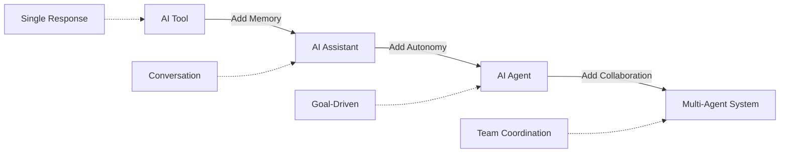
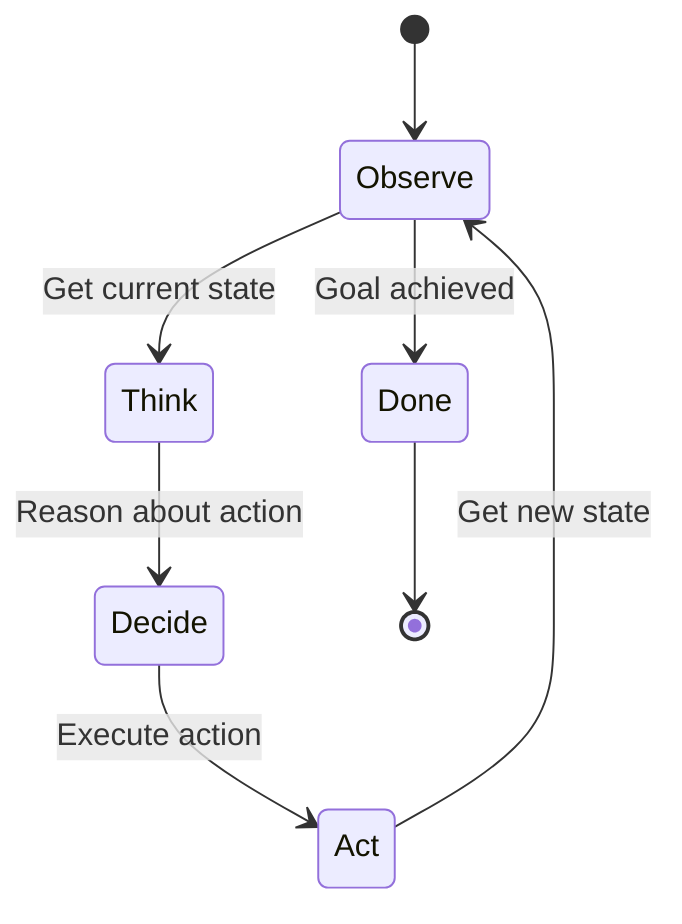
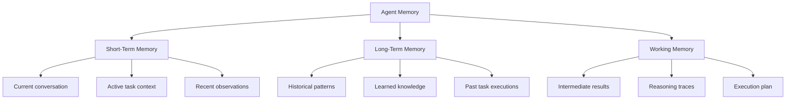

# Agentic Fundamentals: Building Autonomous AI Systems

## Purpose

Provide a comprehensive foundation in agentic AI systems, covering core concepts, architectural patterns, and practical implementation strategies for building autonomous agents that can reason, plan, take actions, and learn from results in quality assurance workflows.

## Context

While AI assistants respond to requests, **agentic systems** are goal-driven, autonomous programs that can break down complex objectives, make decisions, use tools, recover from errors, and continuously improve. This document bridges the gap from prompt engineering to building production-ready autonomous agents.

## Prerequisites

- Understanding of [AI Fundamentals](../15-ai-in-quality-assurance/ai-fundamentals.md)
- Experience with Python 3.10+
- Familiarity with LLMs and prompt engineering
- Basic understanding of state machines
- Experience with async programming

## What Makes a System Agentic?

### From Tools to Agents: The Evolution



**Evolution stages:**

1. **AI Tool** (ChatGPT, 2022)
   - Single input → single output
   - No memory between requests
   - Human drives every interaction
   - **Example**: "Generate a test for this function"

2. **AI Assistant** (RAG systems, 2023)
   - Conversational with context
   - Remembers chat history
   - Responds to commands
   - **Example**: "What were the test cases you suggested earlier?"

3. **AI Agent** (ReAct agents, 2024)
   - Autonomous goal pursuit
   - Selects and uses tools
   - Multi-step reasoning
   - **Example**: "Improve test coverage for the auth module" → agent analyzes code, identifies gaps, generates tests, runs them, fixes failures

4. **Multi-Agent System** (Agent workflows, 2025)
   - Specialized agent collaboration
   - Distributed problem-solving
   - Emergent capabilities
   - **Example**: Security agent + performance agent + quality agent work together to review PR

### Core Characteristics of Agentic Systems

```yaml
autonomy:
  decision_making: 'Makes choices without human intervention'
  goal_directed: 'Pursues objectives, not just responding'
  self_initiated: 'Takes action proactively'
  example: 'Agent detects failing test, analyzes cause, attempts fix'

reasoning:
  planning: 'Breaks complex goals into steps'
  reflection: 'Evaluates own actions and results'
  adaptation: 'Changes strategy based on feedback'
  example: 'Test generation fails → agent tries different approach'

tool_use:
  selection: 'Chooses appropriate tools for task'
  execution: 'Calls tools with correct parameters'
  error_handling: 'Recovers from tool failures'
  example: 'Agent uses run_tests, then analyze_failures, then fix_code'

memory:
  short_term: 'Current task context and conversation'
  long_term: 'Historical patterns and learnings'
  episodic: 'Remembers past task executions'
  example: 'Agent remembers this test pattern failed before'

learning:
  improvement: 'Gets better with experience'
  pattern_recognition: 'Identifies recurring situations'
  knowledge_building: 'Accumulates domain expertise'
  example: 'Agent learns common flaky test patterns'
```

### Agent vs Assistant vs Tool: Comparison

| Capability           | AI Tool       | AI Assistant         | AI Agent             | Multi-Agent          |
| -------------------- | ------------- | -------------------- | -------------------- | -------------------- |
| **Interaction Mode** | Single Q&A    | Conversation         | Goal-driven          | Collaborative        |
| **Memory**           | None          | Session-based        | Task + Historical    | Shared + Private     |
| **Autonomy**         | Zero          | Low                  | High                 | Very High            |
| **Tool Use**         | N/A           | On request           | Automatic            | Coordinated          |
| **Planning**         | None          | None                 | Multi-step           | Distributed          |
| **Error Recovery**   | None          | Manual               | Automatic            | Self-healing         |
| **Example Task**     | Generate test | Suggest improvements | Achieve 90% coverage | Complete QA pipeline |
| **Human Role**       | Every step    | Guidance             | Goals + Oversight    | Strategic direction  |

### What Makes Software "Agentic"? Key Indicators

**A system is agentic if it demonstrates:**

1. **Autonomy** - Operates independently toward goals

   ```python
   # NOT agentic (human-driven)
   response = llm.generate("Write a test")

   # AGENTIC (goal-driven)
   agent.achieve_goal("Ensure auth module has 90% coverage")
   # Agent decides: analyze coverage → identify gaps → generate tests → run → fix → verify
   ```

2. **Planning** - Decomposes complex objectives

   ```python
   Goal: "Fix failing E2E tests"

   Agent Plan:
   1. Retrieve test failure logs
   2. Analyze error patterns
   3. Identify root cause (code change? environment? timing?)
   4. Attempt remediation (update selectors? add waits? fix code?)
   5. Re-run tests to verify
   6. If failed, try alternative approach
   ```

3. **Perception** - Observes environment and adapts

   ```python
   # Agent monitors CI pipeline
   agent.observe(ci_state)

   if ci_state.has_failures:
       agent.investigate()
   elif ci_state.build_time > threshold:
       agent.optimize_pipeline()
   elif ci_state.flaky_tests > 5:
       agent.stabilize_tests()
   ```

4. **Action** - Makes changes to environment

   ```python
   # Agent has real-world effects
   agent.actions = [
       update_test_file(path, content),
       commit_changes(message),
       trigger_ci_run(),
       update_jira_ticket(id, status)
   ]
   ```

5. **Learning** - Improves from experience

   ```python
   # Agent builds knowledge over time
   agent.memory.store({
       'situation': 'Selenium timeout error',
       'attempted_fix': 'Increased timeout to 30s',
       'result': 'FAILED',
       'lesson': 'Timeout not root cause, check element selector'
   })

   # Next time, agent tries different approach first
   ```

## The ReAct Pattern: Reasoning + Acting

### What is ReAct?

**ReAct** (Reason + Act) is the foundational pattern for building AI agents. It interleaves reasoning (thinking) with acting (doing).

**Paper**: "ReAct: Synergizing Reasoning and Acting in Language Models" (Yao et al., 2023)

### ReAct Loop



**Each iteration:**

1. **Observe** - What is the current state?
2. **Think** - What should I do next? Why?
3. **Decide** - Which tool/action to use?
4. **Act** - Execute the action
5. **Observe** - What was the result?

### ReAct Example: Debug Failing Test

```
Goal: Fix the failing test "test_user_login"

Iteration 1:
Thought: I need to understand why the test is failing
Action: get_test_logs("test_user_login")
Observation: Error: "Element not found: #login-button"

Iteration 2:
Thought: The login button selector might have changed. Let me check the current UI
Action: get_page_html("login_page")
Observation: Button now has id="signin-button" instead of "login-button"

Iteration 3:
Thought: I need to update the test selector
Action: update_test_selector("test_user_login", "#login-button", "#signin-button")
Observation: File updated successfully

Iteration 4:
Thought: Let me verify the fix by running the test
Action: run_test("test_user_login")
Observation: Test passed ✓

Iteration 5:
Thought: Goal achieved. Test is now passing
Action: finish(success=True, summary="Updated selector from #login-button to #signin-button")
```

### ReAct Implementation

```python
from typing import List, Dict, Any, Optional
from dataclasses import dataclass
from enum import Enum
import json

class ActionType(Enum):
    THINK = "think"
    ACT = "act"
    OBSERVE = "observe"
    FINISH = "finish"

@dataclass
class Step:
    """Single step in ReAct loop"""
    type: ActionType
    content: str
    metadata: Dict[str, Any] = None

class ReActAgent:
    """
    Simple ReAct agent implementation.

    The agent follows a think → act → observe loop until goal is achieved.
    """

    def __init__(self, llm, tools: List[callable], max_iterations: int = 10):
        self.llm = llm
        self.tools = {tool.__name__: tool for tool in tools}
        self.max_iterations = max_iterations
        self.history: List[Step] = []

    def run(self, goal: str) -> Dict[str, Any]:
        """
        Execute ReAct loop to achieve goal.

        Args:
            goal: The objective to accomplish

        Returns:
            Result dictionary with success status and final answer
        """
        self.history = []

        for iteration in range(self.max_iterations):
            # THINK: Reason about next action
            thought = self._think(goal)
            self.history.append(Step(ActionType.THINK, thought))

            print(f"\n[Iteration {iteration + 1}]")
            print(f"Thought: {thought}")

            # Check if agent wants to finish
            if self._should_finish(thought):
                final_answer = self._extract_answer(thought)
                self.history.append(Step(ActionType.FINISH, final_answer))
                return {
                    'success': True,
                    'answer': final_answer,
                    'iterations': iteration + 1,
                    'history': self.history
                }

            # DECIDE & ACT: Choose and execute action
            action = self._decide_action(thought)
            if action:
                self.history.append(Step(ActionType.ACT, json.dumps(action)))
                print(f"Action: {action['tool']}({action['args']})")

                # OBSERVE: Get result
                observation = self._execute_action(action)
                self.history.append(Step(ActionType.OBSERVE, str(observation)))
                print(f"Observation: {observation}")
            else:
                # No valid action, agent is stuck
                return {
                    'success': False,
                    'error': 'Agent could not decide on action',
                    'history': self.history
                }

        # Max iterations reached
        return {
            'success': False,
            'error': f'Max iterations ({self.max_iterations}) reached',
            'history': self.history
        }

    def _think(self, goal: str) -> str:
        """Generate reasoning about what to do next"""

        # Build context from history
        context = self._build_context()

        # Create prompt for LLM
        prompt = f"""You are an autonomous agent working to achieve a goal.

Goal: {goal}

Available tools:
{self._format_tools()}

Previous steps:
{context}

Think step-by-step about what to do next:
1. What have I learned so far?
2. What is the next logical step toward the goal?
3. Which tool should I use? With what arguments?
4. Or am I ready to finish?

Respond with your reasoning."""

        response = self.llm.generate(prompt)
        return response

    def _decide_action(self, thought: str) -> Optional[Dict[str, Any]]:
        """Extract action from thought"""

        prompt = f"""Based on this reasoning:
{thought}

Which tool should be called? Respond with JSON:
{{
    "tool": "tool_name",
    "args": {{"arg1": "value1", "arg2": "value2"}}
}}

Or if ready to finish: {{"tool": "finish", "args": {{"answer": "final answer"}}}}

Available tools: {', '.join(self.tools.keys())}

JSON response:"""

        response = self.llm.generate(prompt)

        try:
            action = json.loads(response)
            return action
        except json.JSONDecodeError:
            # Try to extract JSON from response
            import re
            json_match = re.search(r'\{.*\}', response, re.DOTALL)
            if json_match:
                try:
                    return json.loads(json_match.group())
                except:
                    pass
            return None

    def _execute_action(self, action: Dict[str, Any]) -> Any:
        """Execute tool with arguments"""
        tool_name = action.get('tool')
        tool_args = action.get('args', {})

        if tool_name not in self.tools:
            return f"Error: Unknown tool '{tool_name}'"

        try:
            tool = self.tools[tool_name]
            result = tool(**tool_args)
            return result
        except Exception as e:
            return f"Error executing {tool_name}: {str(e)}"

    def _build_context(self) -> str:
        """Build context string from history"""
        if not self.history:
            return "No previous steps."

        context_parts = []
        for i, step in enumerate(self.history):
            context_parts.append(f"Step {i+1} ({step.type.value}): {step.content[:200]}")

        return "\n".join(context_parts)

    def _format_tools(self) -> str:
        """Format tool descriptions"""
        descriptions = []
        for name, tool in self.tools.items():
            doc = tool.__doc__ or "No description"
            descriptions.append(f"- {name}: {doc.strip()}")
        return "\n".join(descriptions)

    def _should_finish(self, thought: str) -> bool:
        """Check if agent thinks it's done"""
        finish_indicators = [
            'goal achieved',
            'task complete',
            'finished successfully',
            'ready to finish',
            'final answer'
        ]
        thought_lower = thought.lower()
        return any(indicator in thought_lower for indicator in finish_indicators)

    def _extract_answer(self, thought: str) -> str:
        """Extract final answer from thought"""
        return thought


# Example tools for testing agent

def get_test_status(test_name: str) -> str:
    """Check if a test is passing or failing"""
    # Simulated tool
    failing_tests = {"test_user_login": "Element not found: #login-button"}

    if test_name in failing_tests:
        return f"FAILING: {failing_tests[test_name]}"
    return "PASSING"

def get_element_selector(page: str, element_type: str) -> str:
    """Get current selector for an element on a page"""
    # Simulated tool
    selectors = {
        ("login_page", "button"): "#signin-button",
        ("login_page", "username"): "#user-input",
    }

    selector = selectors.get((page, element_type))
    return selector if selector else "Element not found"

def update_test_file(test_name: str, old_selector: str, new_selector: str) -> str:
    """Update a selector in a test file"""
    # Simulated tool
    return f"Updated test '{test_name}': {old_selector} → {new_selector}"

def run_test(test_name: str) -> str:
    """Run a specific test"""
    # Simulated tool
    return "✓ Test passed"


# Usage example
if __name__ == "__main__":
    # Mock LLM (in production, use real LLM)
    class MockLLM:
        def __init__(self):
            self.iteration = 0

        def generate(self, prompt: str) -> str:
            # Simulated responses for demo
            responses = [
                # Iteration 1: Check test status
                "I need to first understand why the test is failing. Let me check its status.",
                '{"tool": "get_test_status", "args": {"test_name": "test_user_login"}}',

                # Iteration 2: Get current selector
                "The error says the login button element is not found. Let me check what the current selector should be.",
                '{"tool": "get_element_selector", "args": {"page": "login_page", "element_type": "button"}}',

                # Iteration 3: Update test
                "The button selector has changed from #login-button to #signin-button. I need to update the test.",
                '{"tool": "update_test_file", "args": {"test_name": "test_user_login", "old_selector": "#login-button", "new_selector": "#signin-button"}}',

                # Iteration 4: Verify fix
                "Now let me run the test to verify the fix works.",
                '{"tool": "run_test", "args": {"test_name": "test_user_login"}}',

                # Iteration 5: Finish
                "Goal achieved! The test is now passing. I successfully updated the selector.",
            ]

            response = responses[self.iteration % len(responses)]
            self.iteration += 1
            return response

    # Create agent
    llm = MockLLM()
    tools = [get_test_status, get_element_selector, update_test_file, run_test]
    agent = ReActAgent(llm, tools, max_iterations=5)

    # Run agent
    result = agent.run("Fix the failing test_user_login test")

    print("\n" + "="*60)
    print("RESULT:")
    print(f"Success: {result['success']}")
    print(f"Iterations: {result.get('iterations', 'N/A')}")
    if 'answer' in result:
        print(f"Answer: {result['answer']}")
```

### ReAct Best Practices

**1. Clear Tool Descriptions**

```python
# BAD: Vague description
def update_file(path, content):
    """Updates a file"""
    pass

# GOOD: Clear description with examples
def update_file(path: str, content: str) -> str:
    """
    Update a file with new content.

    Args:
        path: Absolute path to file (e.g., '/tests/test_auth.py')
        content: New file content (full replacement)

    Returns:
        Success message or error

    Example:
        update_file('/tests/test_login.py', 'def test_login(): pass')
    """
    pass
```

**2. Structured Observations**

```python
# BAD: Unstructured output
def run_tests(suite):
    return "Some tests failed"

# GOOD: Structured, actionable output
def run_tests(suite: str) -> Dict[str, Any]:
    """Run test suite and return structured results"""
    return {
        'total': 10,
        'passed': 7,
        'failed': 3,
        'failures': [
            {'test': 'test_login', 'error': 'Element not found: #btn'},
            {'test': 'test_signup', 'error': 'Timeout after 30s'},
            {'test': 'test_logout', 'error': 'AssertionError: Expected /login, got /home'}
        ],
        'duration': '45s'
    }
```

**3. Error Recovery**

```python
class RobustReActAgent(ReActAgent):
    """ReAct agent with error recovery"""

    def _execute_action(self, action: Dict[str, Any]) -> Any:
        """Execute action with retry logic"""
        max_retries = 3

        for attempt in range(max_retries):
            try:
                result = super()._execute_action(action)

                # Check if result indicates error
                if isinstance(result, str) and result.startswith('Error'):
                    if attempt < max_retries - 1:
                        # Let agent know about retry
                        return f"{result} (Attempt {attempt + 1}/{max_retries})"

                return result

            except Exception as e:
                if attempt < max_retries - 1:
                    continue
                return f"Error after {max_retries} attempts: {str(e)}"
```

**4. Iteration Limits**

```python
# Prevent infinite loops
agent = ReActAgent(
    llm=llm,
    tools=tools,
    max_iterations=10  # Reasonable limit
)

# Monitor iterations
result = agent.run(goal)
if result.get('iterations', 0) > 8:
    print("Warning: Agent used many iterations, consider goal complexity")
```

## Tool Use and Function Calling

### What are Tools?

**Tools** are functions that agents can call to interact with the external world.

**Examples:**

- Read/write files
- Run tests
- Query databases
- Call APIs
- Execute shell commands
- Search documentation

### Tool Definition

```python
from typing import Any, Dict, List
from pydantic import BaseModel, Field

class Tool(BaseModel):
    """Tool definition for agent"""
    name: str
    description: str
    parameters: Dict[str, Any]
    function: callable

    class Config:
        arbitrary_types_allowed = True


def create_tool(func: callable) -> Tool:
    """Create tool from function"""
    import inspect

    # Get function signature
    sig = inspect.signature(func)

    # Build parameter schema
    parameters = {
        "type": "object",
        "properties": {},
        "required": []
    }

    for param_name, param in sig.parameters.items():
        param_type = "string"  # Simplified
        if param.annotation == int:
            param_type = "integer"
        elif param.annotation == bool:
            param_type = "boolean"

        parameters["properties"][param_name] = {
            "type": param_type,
            "description": f"Parameter {param_name}"
        }

        if param.default == inspect.Parameter.empty:
            parameters["required"].append(param_name)

    return Tool(
        name=func.__name__,
        description=func.__doc__ or "",
        parameters=parameters,
        function=func
    )


# Example tools for QA agent

def run_tests(test_pattern: str = "*") -> Dict[str, Any]:
    """
    Run tests matching the pattern.

    Args:
        test_pattern: Glob pattern for tests (e.g., 'test_auth*', '*integration*')

    Returns:
        Test results with passed, failed, and error details
    """
    import subprocess
    import json

    result = subprocess.run(
        ['pytest', test_pattern, '--json-report', '--json-report-file=report.json'],
        capture_output=True,
        text=True
    )

    try:
        with open('report.json') as f:
            report = json.load(f)
        return {
            'total': report['summary']['total'],
            'passed': report['summary'].get('passed', 0),
            'failed': report['summary'].get('failed', 0),
            'errors': [test['nodeid'] for test in report['tests'] if test['outcome'] == 'failed']
        }
    except:
        return {
            'total': 0,
            'passed': 0,
            'failed': 0,
            'errors': ['Failed to parse test results']
        }


def get_code_coverage() -> Dict[str, float]:
    """
    Get current code coverage metrics.

    Returns:
        Coverage percentages by metric type
    """
    import subprocess
    import re

    result = subprocess.run(
        ['pytest', '--cov', '--cov-report=term'],
        capture_output=True,
        text=True
    )

    # Parse coverage from output
    match = re.search(r'TOTAL.*?(\d+)%', result.stdout)
    coverage = float(match.group(1)) if match else 0.0

    return {
        'line_coverage': coverage,
        'branch_coverage': coverage * 0.9,  # Approximation
        'function_coverage': coverage * 0.95
    }


def analyze_test_file(file_path: str) -> Dict[str, Any]:
    """
    Analyze a test file for quality issues.

    Args:
        file_path: Path to test file

    Returns:
        Analysis with issues and recommendations
    """
    import ast

    with open(file_path, 'r') as f:
        code = f.read()

    tree = ast.parse(code)

    issues = []
    test_count = 0

    for node in ast.walk(tree):
        if isinstance(node, ast.FunctionDef):
            if node.name.startswith('test_'):
                test_count += 1

                # Check for assertions
                has_assertion = any(
                    isinstance(child, ast.Assert)
                    for child in ast.walk(node)
                )

                if not has_assertion:
                    issues.append({
                        'test': node.name,
                        'issue': 'No assertions found',
                        'severity': 'high'
                    })

    return {
        'file': file_path,
        'test_count': test_count,
        'issues': issues,
        'quality_score': max(0, 100 - len(issues) * 10)
    }


def generate_tests(function_code: str, framework: str = "pytest") -> str:
    """
    Generate test cases for a function.

    Args:
        function_code: Source code of function to test
        framework: Testing framework (pytest, unittest, jest)

    Returns:
        Generated test code
    """
    # In production, call LLM to generate tests
    # For demo, return template

    return f'''
def test_function_happy_path():
    """Test normal execution"""
    # Arrange
    input_data = "test"

    # Act
    result = function_under_test(input_data)

    # Assert
    assert result is not None


def test_function_edge_cases():
    """Test edge cases"""
    assert function_under_test("") is not None
    assert function_under_test(None) is not None


def test_function_error_handling():
    """Test error conditions"""
    with pytest.raises(ValueError):
        function_under_test("invalid")
'''


def commit_changes(file_paths: List[str], message: str) -> str:
    """
    Commit changes to version control.

    Args:
        file_paths: List of files to commit
        message: Commit message

    Returns:
        Commit hash or error message
    """
    import subprocess

    # Add files
    for path in file_paths:
        subprocess.run(['git', 'add', path])

    # Commit
    result = subprocess.run(
        ['git', 'commit', '-m', message],
        capture_output=True,
        text=True
    )

    if result.returncode == 0:
        # Get commit hash
        hash_result = subprocess.run(
            ['git', 'rev-parse', 'HEAD'],
            capture_output=True,
            text=True
        )
        return f"Committed: {hash_result.stdout.strip()[:8]}"
    else:
        return f"Error: {result.stderr}"
```

### Tool Selection Strategies

**1. Sequential Selection** (ReAct default)

```python
# Agent chooses one tool per iteration
iteration_1: run_tests() → 3 failures
iteration_2: analyze_test_file('test_auth.py') → missing assertions
iteration_3: update_test_file() → added assertions
iteration_4: run_tests() → all pass
```

**2. Parallel Execution**

```python
# Agent calls multiple independent tools simultaneously
async def parallel_tools(agent, tools_to_run):
    tasks = [
        run_tests('*unit*'),
        run_tests('*integration*'),
        get_code_coverage(),
        check_linting()
    ]

    results = await asyncio.gather(*tasks)
    return results
```

**3. Conditional Chaining**

```python
# Agent builds execution graph
def conditional_chain(agent):
    # Step 1: Always run
    test_result = run_tests()

    # Step 2: Conditional on step 1
    if test_result['failed'] > 0:
        analysis = analyze_failures(test_result)

        # Step 3: Conditional on step 2
        if analysis['fixable']:
            fix_result = auto_fix_tests()
        else:
            create_ticket(analysis)
```

### Tool Error Handling

```python
from typing import Union, Any
import traceback

class ToolExecutor:
    """Safe tool execution with error handling"""

    def __init__(self, tools: List[Tool]):
        self.tools = {tool.name: tool for tool in tools}
        self.execution_log = []

    def execute(
        self,
        tool_name: str,
        arguments: Dict[str, Any]
    ) -> Union[Any, Dict[str, str]]:
        """
        Execute tool with comprehensive error handling.

        Returns:
            Tool result on success, error dict on failure
        """

        # Validate tool exists
        if tool_name not in self.tools:
            return {
                'error': 'ToolNotFoundError',
                'message': f"Tool '{tool_name}' not found",
                'available_tools': list(self.tools.keys())
            }

        tool = self.tools[tool_name]

        # Validate arguments
        validation_error = self._validate_arguments(tool, arguments)
        if validation_error:
            return validation_error

        # Execute with timeout and error catching
        try:
            import signal

            # Set timeout (30 seconds)
            signal.signal(signal.SIGALRM, self._timeout_handler)
            signal.alarm(30)

            result = tool.function(**arguments)

            signal.alarm(0)  # Cancel timeout

            # Log successful execution
            self.execution_log.append({
                'tool': tool_name,
                'arguments': arguments,
                'success': True,
                'result_preview': str(result)[:100]
            })

            return result

        except TimeoutError:
            return {
                'error': 'TimeoutError',
                'message': f"Tool '{tool_name}' exceeded 30 second timeout"
            }

        except TypeError as e:
            return {
                'error': 'ArgumentError',
                'message': f"Invalid arguments: {str(e)}",
                'provided': arguments,
                'expected': tool.parameters
            }

        except Exception as e:
            return {
                'error': type(e).__name__,
                'message': str(e),
                'traceback': traceback.format_exc()
            }

    def _validate_arguments(
        self,
        tool: Tool,
        arguments: Dict[str, Any]
    ) -> Optional[Dict[str, str]]:
        """Validate arguments against tool schema"""

        required = tool.parameters.get('required', [])
        provided = set(arguments.keys())
        missing = set(required) - provided

        if missing:
            return {
                'error': 'MissingArgumentsError',
                'message': f"Missing required arguments: {missing}",
                'required': required,
                'provided': list(provided)
            }

        return None

    def _timeout_handler(self, signum, frame):
        raise TimeoutError("Tool execution timeout")
```

### Function Calling with OpenAI

```python
from openai import OpenAI
import json

client = OpenAI()

def agent_with_function_calling():
    """Agent using OpenAI's native function calling"""

    # Define tools for OpenAI
    tools = [
        {
            "type": "function",
            "function": {
                "name": "run_tests",
                "description": "Run test suite and return results",
                "parameters": {
                    "type": "object",
                    "properties": {
                        "test_pattern": {
                            "type": "string",
                            "description": "Glob pattern for tests (e.g., 'test_auth*')"
                        }
                    },
                    "required": ["test_pattern"]
                }
            }
        },
        {
            "type": "function",
            "function": {
                "name": "get_code_coverage",
                "description": "Get current code coverage percentage",
                "parameters": {
                    "type": "object",
                    "properties": {}
                }
            }
        }
    ]

    messages = [{
        "role": "user",
        "content": "Check test coverage for the auth module and run relevant tests"
    }]

    # Agent loop
    for iteration in range(5):
        response = client.chat.completions.create(
            model="gpt-4-turbo-preview",
            messages=messages,
            tools=tools,
            tool_choice="auto"
        )

        response_message = response.choices[0].message
        messages.append(response_message)

        # Check if agent wants to call functions
        if response_message.tool_calls:
            for tool_call in response_message.tool_calls:
                function_name = tool_call.function.name
                function_args = json.loads(tool_call.function.arguments)

                print(f"Calling: {function_name}({function_args})")

                # Execute function
                if function_name == "run_tests":
                    function_response = run_tests(**function_args)
                elif function_name == "get_code_coverage":
                    function_response = get_code_coverage()
                else:
                    function_response = {"error": "Unknown function"}

                # Add function response to messages
                messages.append({
                    "role": "tool",
                    "tool_call_id": tool_call.id,
                    "name": function_name,
                    "content": json.dumps(function_response)
                })
        else:
            # Agent finished, no more function calls
            print(f"Final answer: {response_message.content}")
            break

    return response_message.content
```

## Agent Memory Systems

### Types of Memory



### Short-Term Memory (Conversation Context)

```python
from typing import List, Dict
from collections import deque

class ShortTermMemory:
    """
    Maintains recent conversation and task context.

    Stored in-memory, cleared after task completion.
    """

    def __init__(self, max_messages: int = 20):
        self.messages = deque(maxlen=max_messages)
        self.observations = deque(maxlen=10)

    def add_message(self, role: str, content: str):
        """Add message to conversation"""
        self.messages.append({
            'role': role,
            'content': content,
            'timestamp': datetime.now()
        })

    def add_observation(self, observation: Any):
        """Add observation from environment"""
        self.observations.append({
            'data': observation,
            'timestamp': datetime.now()
        })

    def get_context(self, max_tokens: int = 4000) -> str:
        """Get context string for LLM (token-limited)"""
        context_parts = []
        current_tokens = 0

        # Add messages in reverse (most recent first)
        for msg in reversed(self.messages):
            msg_text = f"{msg['role']}: {msg['content']}"
            msg_tokens = len(msg_text.split()) // 0.75  # Rough estimate

            if current_tokens + msg_tokens > max_tokens:
                break

            context_parts.insert(0, msg_text)
            current_tokens += msg_tokens

        return "\n".join(context_parts)

    def clear(self):
        """Clear short-term memory"""
        self.messages.clear()
        self.observations.clear()
```

### Long-Term Memory (Vector Database)

```python
from typing import List, Dict, Any
import chromadb
from chromadb.config import Settings
from datetime import datetime
import hashlib

class LongTermMemory:
    """
    Persistent memory using vector database.

    Stores:
    - Past task executions
    - Learned patterns
    - Historical decisions
    """

    def __init__(self, persist_directory: str = "./agent_memory"):
        self.client = chromadb.PersistentClient(
            path=persist_directory,
            settings=Settings(anonymized_telemetry=False)
        )

        self.experiences = self.client.get_or_create_collection(
            name="agent_experiences",
            metadata={"description": "Agent task execution history"}
        )

        self.patterns = self.client.get_or_create_collection(
            name="learned_patterns",
            metadata={"description": "Learned patterns and solutions"}
        )

    def store_experience(
        self,
        task: str,
        actions: List[Dict],
        outcome: str,
        success: bool,
        metadata: Dict = None
    ):
        """Store a completed task execution"""

        experience_id = hashlib.md5(
            f"{task}{datetime.now().isoformat()}".encode()
        ).hexdigest()

        # Create narrative of execution
        narrative = self._create_narrative(task, actions, outcome)

        self.experiences.add(
            ids=[experience_id],
            documents=[narrative],
            metadatas=[{
                'task': task,
                'success': success,
                'outcome': outcome,
                'action_count': len(actions),
                'timestamp': datetime.now().isoformat(),
                **(metadata or {})
            }]
        )

    def recall_similar_experiences(
        self,
        current_task: str,
        n_results: int = 3
    ) -> List[Dict[str, Any]]:
        """Retrieve similar past experiences"""

        results = self.experiences.query(
            query_texts=[current_task],
            n_results=n_results,
            where={"success": True}  # Only recall successful experiences
        )

        experiences = []
        for i in range(len(results['ids'][0])):
            experiences.append({
                'narrative': results['documents'][0][i],
                'metadata': results['metadatas'][0][i],
                'relevance': results['distances'][0][i]
            })

        return experiences

    def store_pattern(
        self,
        problem: str,
        solution: str,
        context: str,
        success_rate: float = 1.0
    ):
        """Store a learned pattern"""

        pattern_id = hashlib.md5(problem.encode()).hexdigest()

        pattern_doc = f"""
Problem: {problem}
Context: {context}
Solution: {solution}
"""

        self.patterns.upsert(
            ids=[pattern_id],
            documents=[pattern_doc],
            metadatas=[{
                'problem': problem,
                'success_rate': success_rate,
                'timestamp': datetime.now().isoformat()
            }]
        )

    def get_relevant_patterns(
        self,
        situation: str,
        n_results: int = 2
    ) -> List[Dict[str, Any]]:
        """Get patterns relevant to current situation"""

        results = self.patterns.query(
            query_texts=[situation],
            n_results=n_results
        )

        patterns = []
        for i in range(len(results['ids'][0])):
            patterns.append({
                'description': results['documents'][0][i],
                'metadata': results['metadatas'][0][i],
                'relevance': results['distances'][0][i]
            })

        return patterns

    def _create_narrative(
        self,
        task: str,
        actions: List[Dict],
        outcome: str
    ) -> str:
        """Create readable narrative from task execution"""

        narrative_parts = [f"Task: {task}"]

        for i, action in enumerate(actions, 1):
            narrative_parts.append(
                f"Step {i}: {action.get('tool', 'unknown')}({action.get('args', {})})"
            )

        narrative_parts.append(f"Outcome: {outcome}")

        return "\n".join(narrative_parts)


# Example usage
memory = LongTermMemory()

# After completing a task
memory.store_experience(
    task="Fix flaky test in test_auth.py",
    actions=[
        {'tool': 'analyze_test', 'args': {'file': 'test_auth.py'}},
        {'tool': 'add_wait', 'args': {'duration': '2s', 'condition': 'element_visible'}},
        {'tool': 'run_test', 'args': {'test': 'test_auth.py'}}
    ],
    outcome="Test now stable, passed 10/10 runs",
    success=True,
    metadata={'test_type': 'e2e', 'issue': 'timing'}
)

# When facing similar task
current_task = "Fix flaky test in test_checkout.py"
similar = memory.recall_similar_experiences(current_task, n_results=3)

for exp in similar:
    print(f"Similar experience (relevance: {exp['relevance']}):")
    print(exp['narrative'])
    print()
```

### Working Memory (Execution State)

```python
from typing import Any, Dict, Optional
from dataclasses import dataclass, field
from enum import Enum

class TaskStatus(Enum):
    PENDING = "pending"
    IN_PROGRESS = "in_progress"
    COMPLETED = "completed"
    FAILED = "failed"
    BLOCKED = "blocked"

@dataclass
class WorkingMemory:
    """
    Tracks current task execution state.

    Includes:
    - Current goal and plan
    - Intermediate results
    - Execution stack
    - Error state
    """

    goal: str
    plan: List[str] = field(default_factory=list)
    current_step: int = 0
    status: TaskStatus = TaskStatus.PENDING

    # Execution state
    intermediate_results: Dict[str, Any] = field(default_factory=dict)
    execution_stack: List[Dict] = field(default_factory=list)

    # Error tracking
    errors: List[str] = field(default_factory=list)
    retry_count: int = 0
    max_retries: int = 3

    def start_step(self, step_description: str):
        """Begin executing a step"""
        self.execution_stack.append({
            'step': step_description,
            'started_at': datetime.now(),
            'status': 'in_progress'
        })
        self.status = TaskStatus.IN_PROGRESS

    def complete_step(self, result: Any):
        """Complete current step"""
        if self.execution_stack:
            self.execution_stack[-1]['status'] = 'completed'
            self.execution_stack[-1]['completed_at'] = datetime.now()
            self.execution_stack[-1]['result'] = result

        self.current_step += 1

    def fail_step(self, error: str):
        """Mark current step as failed"""
        if self.execution_stack:
            self.execution_stack[-1]['status'] = 'failed'
            self.execution_stack[-1]['error'] = error

        self.errors.append(error)
        self.retry_count += 1

        if self.retry_count >= self.max_retries:
            self.status = TaskStatus.FAILED
        else:
            self.status = TaskStatus.BLOCKED

    def store_result(self, key: str, value: Any):
        """Store intermediate result"""
        self.intermediate_results[key] = value

    def get_result(self, key: str) -> Optional[Any]:
        """Retrieve intermediate result"""
        return self.intermediate_results.get(key)

    def get_context_summary(self) -> str:
        """Get summary of current state for LLM"""
        summary_parts = [
            f"Goal: {self.goal}",
            f"Status: {self.status.value}",
            f"Progress: Step {self.current_step + 1}/{len(self.plan)}",
        ]

        if self.plan:
            summary_parts.append(f"Current step: {self.plan[self.current_step]}")

        if self.intermediate_results:
            summary_parts.append(f"Intermediate results: {list(self.intermediate_results.keys())}")

        if self.errors:
            summary_parts.append(f"Recent errors: {self.errors[-3:]}")

        return "\n".join(summary_parts)
```

### Memory Integration Example

```python
class MemoryEnabledAgent(ReActAgent):
    """Agent with comprehensive memory system"""

    def __init__(self, llm, tools, **kwargs):
        super().__init__(llm, tools, **kwargs)

        self.short_term = ShortTermMemory()
        self.long_term = LongTermMemory()
        self.working = None

    def run(self, goal: str) -> Dict[str, Any]:
        """Execute goal with memory"""

        # Initialize working memory
        self.working = WorkingMemory(goal=goal)

        # Recall similar experiences
        print("Recalling similar experiences...")
        similar_experiences = self.long_term.recall_similar_experiences(goal)

        if similar_experiences:
            print(f"Found {len(similar_experiences)} relevant experiences")
            # Add to context
            for exp in similar_experiences:
                self.short_term.add_message(
                    'system',
                    f"Past experience: {exp['narrative']}"
                )

        # Execute task
        result = super().run(goal)

        # Store experience
        self.long_term.store_experience(
            task=goal,
            actions=[s.content for s in self.history if s.type == ActionType.ACT],
            outcome=result.get('answer', 'unknown'),
            success=result.get('success', False)
        )

        # Clear short-term memory
        self.short_term.clear()

        return result
```

## Planning Strategies

### Strategy 1: ReAct (Single-Step Planning)

**How it works**: Plan one step at a time based on current observation

```yaml
characteristics:
  planning_horizon: 1 step
  replanning: Every iteration
  complexity: Low
  best_for: Simple tasks, dynamic environments

execution: 1. Observe current state
  2. Decide next single action
  3. Execute action
  4. Repeat until done
```

**Pros:**

- Simple to implement
- Highly adaptive
- Good for uncertain environments

**Cons:**

- No long-term strategy
- Can get stuck in loops
- Inefficient for complex tasks

### Strategy 2: Plan-and-Execute

**How it works**: Create complete plan upfront, then execute

```yaml
characteristics:
  planning_horizon: Full task
  replanning: Only on failure
  complexity: Medium
  best_for: Well-defined tasks, stable environments

execution: 1. Analyze goal and constraints
  2. Generate complete action sequence
  3. Execute plan step-by-step
  4. Replan if unexpected failure
```

**Implementation:**

```python
from typing import List, Dict, Any

class PlanAndExecuteAgent:
    """Agent that plans completely before executing"""

    def __init__(self, llm, tools):
        self.llm = llm
        self.tools = tools
        self.long_term_memory = LongTermMemory()

    def run(self, goal: str) -> Dict[str, Any]:
        """Execute goal with plan-and-execute strategy"""

        # Phase 1: PLAN
        print("Phase 1: Planning...")
        plan = self._create_plan(goal)

        if not plan:
            return {'success': False, 'error': 'Failed to create plan'}

        print(f"Created plan with {len(plan)} steps:")
        for i, step in enumerate(plan, 1):
            print(f"  {i}. {step['description']}")

        # Phase 2: EXECUTE
        print("\nPhase 2: Executing...")
        results = []

        for i, step in enumerate(plan):
            print(f"\nExecuting step {i+1}: {step['description']}")

            result = self._execute_step(step)
            results.append(result)

            # Check for failure
            if not result.get('success', True):
                print(f"Step failed: {result.get('error')}")

                # Attempt replan
                print("Replanning...")
                remaining_goal = self._reformulate_goal(goal, results)
                replan = self._create_plan(remaining_goal)

                if replan:
                    plan = plan[:i+1] + replan
                    print(f"Updated plan with {len(replan)} new steps")
                else:
                    return {
                        'success': False,
                        'error': f'Failed at step {i+1}, could not replan',
                        'completed_steps': results
                    }

        # Success
        return {
            'success': True,
            'plan': plan,
            'results': results
        }

    def _create_plan(self, goal: str) -> List[Dict[str, Any]]:
        """Generate complete action plan"""

        # Recall similar experiences
        similar = self.long_term_memory.recall_similar_experiences(goal, n_results=2)
        context = "\n".join([exp['narrative'] for exp in similar])

        prompt = f"""Create a detailed plan to achieve this goal: {goal}

Available tools:
{self._format_tools()}

Similar past experiences:
{context}

Generate a step-by-step plan. For each step, specify:
1. Description: What needs to be done
2. Tool: Which tool to use
3. Arguments: What arguments to pass
4. Expected outcome: What success looks like

Return plan as JSON array:
[
    {{
        "description": "Check current test coverage",
        "tool": "get_code_coverage",
        "arguments": {{}},
        "expected": "Coverage report showing < 80%"
    }},
    ...
]

Plan (JSON):"""

        response = self.llm.generate(prompt)

        try:
            import json
            import re

            # Extract JSON from response
            json_match = re.search(r'\[.*\]', response, re.DOTALL)
            if json_match:
                plan = json.loads(json_match.group())
                return plan
        except:
            pass

        return []

    def _execute_step(self, step: Dict[str, Any]) -> Dict[str, Any]:
        """Execute a single planned step"""

        tool_name = step.get('tool')
        arguments = step.get('arguments', {})

        if tool_name not in self.tools:
            return {
                'success': False,
                'error': f"Unknown tool: {tool_name}"
            }

        try:
            tool = self.tools[tool_name]
            result = tool(**arguments)

            return {
                'success': True,
                'tool': tool_name,
                'result': result
            }
        except Exception as e:
            return {
                'success': False,
                'tool': tool_name,
                'error': str(e)
            }

    def _reformulate_goal(
        self,
        original_goal: str,
        completed_steps: List[Dict]
    ) -> str:
        """Reformulate goal based on progress"""

        completed = [s for s in completed_steps if s.get('success')]

        prompt = f"""Original goal: {original_goal}

Completed steps:
{json.dumps(completed, indent=2)}

What remains to be done to achieve the goal?

Reformulated goal:"""

        return self.llm.generate(prompt)

    def _format_tools(self) -> str:
        tools_desc = []
        for name, tool in self.tools.items():
            doc = tool.__doc__ or "No description"
            tools_desc.append(f"- {name}: {doc.strip()}")
        return "\n".join(tools_desc)
```

**Pros:**

- Efficient (fewer LLM calls)
- Clear structure
- Can optimize plan

**Cons:**

- Brittle in dynamic environments
- Expensive to replan
- Assumes stable conditions

### Strategy 3: ReWOO (Reasoning Without Observation)

**How it works**: Plan all steps, then execute all, then observe all

```yaml
characteristics:
  planning_horizon: Full task
  observation: Deferred until end
  complexity: Medium
  best_for: Independent parallel actions

phases:
  1. PLAN: Generate all actions upfront
  2. EXECUTE: Run all actions (potentially parallel)
  3. OBSERVE: Collect all results
  4. SOLVE: Synthesize final answer
```

**Implementation:**

```python
class ReWOOAgent:
    """
    Reasoning WithOut Observation agent.

    Plans all steps first, executes in parallel, then reasons about results.
    """

    def __init__(self, llm, tools):
        self.llm = llm
        self.tools = tools

    async def run(self, goal: str) -> Dict[str, Any]:
        """Execute ReWOO workflow"""

        # Phase 1: PLAN - Generate all actions
        print("Phase 1: Planning all actions...")
        plan = self._generate_plan(goal)

        # Phase 2: EXECUTE - Run all actions (parallel where possible)
        print("Phase 2: Executing actions...")
        results = await self._execute_plan_parallel(plan)

        # Phase 3: SOLVE - Reason about all results
        print("Phase 3: Synthesizing answer...")
        answer = self._solve(goal, plan, results)

        return {
            'success': True,
            'plan': plan,
            'results': results,
            'answer': answer
        }

    def _generate_plan(self, goal: str) -> List[Dict]:
        """Generate complete plan with all actions"""

        prompt = f"""Goal: {goal}

Available tools: {list(self.tools.keys())}

Generate a plan with ALL actions needed. Each action can reference results from previous actions using #E{i} notation.

Example plan:
#E1 = run_tests(pattern="test_auth*")
#E2 = get_code_coverage()
#E3 = analyze_failures(test_results=#E1, coverage=#E2)

Generate plan for the goal:"""

        response = self.llm.generate(prompt)

        # Parse plan
        plan = self._parse_plan(response)
        return plan

    async def _execute_plan_parallel(
        self,
        plan: List[Dict]
    ) -> Dict[str, Any]:
        """Execute plan with maximum parallelism"""

        import asyncio

        results = {}
        pending_actions = plan.copy()

        while pending_actions:
            # Find actions with satisfied dependencies
            ready_actions = []

            for action in pending_actions:
                deps = action.get('dependencies', [])
                if all(dep in results for dep in deps):
                    ready_actions.append(action)

            if not ready_actions:
                # Circular dependency or error
                break

            # Execute ready actions in parallel
            tasks = []
            for action in ready_actions:
                # Substitute dependencies
                args = self._substitute_dependencies(
                    action['arguments'],
                    results
                )

                task = self._execute_action_async(
                    action['tool'],
                    args
                )
                tasks.append((action['id'], task))

            # Wait for all to complete
            completed = await asyncio.gather(*[t[1] for t in tasks])

            # Store results
            for (action_id, _), result in zip(tasks, completed):
                results[action_id] = result

            # Remove completed actions
            for action in ready_actions:
                pending_actions.remove(action)

        return results

    async def _execute_action_async(
        self,
        tool_name: str,
        arguments: Dict
    ) -> Any:
        """Execute tool asynchronously"""

        tool = self.tools.get(tool_name)
        if not tool:
            return {'error': f'Unknown tool: {tool_name}'}

        try:
            # If tool is async
            if asyncio.iscoroutinefunction(tool):
                return await tool(**arguments)
            else:
                # Run in executor for sync tools
                loop = asyncio.get_event_loop()
                return await loop.run_in_executor(None, lambda: tool(**arguments))
        except Exception as e:
            return {'error': str(e)}

    def _solve(
        self,
        goal: str,
        plan: List[Dict],
        results: Dict[str, Any]
    ) -> str:
        """Synthesize final answer from all results"""

        prompt = f"""Goal: {goal}

Executed plan:
{json.dumps(plan, indent=2)}

Results:
{json.dumps(results, indent=2)}

Based on all the results, what is the answer to the goal?

Answer:"""

        return self.llm.generate(prompt)

    def _parse_plan(self, plan_text: str) -> List[Dict]:
        """Parse plan text into structured format"""
        # Simplified parser
        import re

        lines = plan_text.strip().split('\n')
        plan = []

        for line in lines:
            match = re.match(r'#E(\d+)\s*=\s*(\w+)\((.*)\)', line)
            if match:
                action_id = f"E{match.group(1)}"
                tool_name = match.group(2)
                args_str = match.group(3)

                # Parse arguments and dependencies
                args = {}
                deps = []

                for arg in args_str.split(','):
                    if '=' in arg:
                        key, value = arg.split('=')
                        key = key.strip()
                        value = value.strip()

                        # Check if value references another action
                        if value.startswith('#E'):
                            deps.append(value)

                        args[key] = value

                plan.append({
                    'id': action_id,
                    'tool': tool_name,
                    'arguments': args,
                    'dependencies': deps
                })

        return plan

    def _substitute_dependencies(
        self,
        arguments: Dict,
        results: Dict
    ) -> Dict:
        """Replace dependency references with actual values"""

        substituted = {}

        for key, value in arguments.items():
            if isinstance(value, str) and value.startswith('#E'):
                # Substitute with result
                substituted[key] = results.get(value, value)
            else:
                substituted[key] = value

        return substituted
```

**Pros:**

- Maximum parallelism
- Fewer LLM calls than ReAct
- Good for independent subtasks

**Cons:**

- Can't adapt mid-execution
- Wastes work if early step fails
- Requires careful dependency tracking

### Strategy 4: Reflection and Self-Correction

**How it works**: Agent evaluates its own outputs and iteratively improves

```python
class ReflectiveAgent:
    """
    Agent that reflects on and improves its own outputs.

    Useful for tasks requiring high quality (test generation, code review).
    """

    def __init__(self, llm, tools):
        self.llm = llm
        self.tools = tools

    def run(
        self,
        goal: str,
        quality_threshold: float = 0.8,
        max_iterations: int = 3
    ) -> Dict[str, Any]:
        """Execute goal with self-reflection"""

        current_solution = None
        history = []

        for iteration in range(max_iterations):
            print(f"\n=== Iteration {iteration + 1} ===")

            # Generate or improve solution
            if current_solution is None:
                print("Generating initial solution...")
                current_solution = self._generate_solution(goal)
            else:
                print("Improving solution based on reflection...")
                current_solution = self._improve_solution(
                    goal,
                    current_solution,
                    history[-1]['reflection']
                )

            print(f"Solution: {current_solution[:200]}...")

            # Reflect on solution
            print("Reflecting on solution quality...")
            reflection = self._reflect(goal, current_solution)

            print(f"Quality score: {reflection['score']}")
            print(f"Issues: {reflection['issues']}")

            history.append({
                'iteration': iteration + 1,
                'solution': current_solution,
                'reflection': reflection
            })

            # Check if quality threshold met
            if reflection['score'] >= quality_threshold:
                print(f"Quality threshold met! ({reflection['score']} >= {quality_threshold})")
                return {
                    'success': True,
                    'solution': current_solution,
                    'iterations': iteration + 1,
                    'final_score': reflection['score'],
                    'history': history
                }

        # Max iterations reached
        return {
            'success': False,
            'error': 'Quality threshold not met within max iterations',
            'solution': current_solution,
            'final_score': history[-1]['reflection']['score'],
            'history': history
        }

    def _generate_solution(self, goal: str) -> str:
        """Generate initial solution"""

        prompt = f"""Goal: {goal}

Generate a solution that achieves this goal.

Solution:"""

        return self.llm.generate(prompt)

    def _reflect(self, goal: str, solution: str) -> Dict[str, Any]:
        """Reflect on solution quality"""

        prompt = f"""Goal: {goal}

Proposed solution:
{solution}

Evaluate this solution:
1. Does it fully achieve the goal?
2. Are there any issues or gaps?
3. How could it be improved?
4. Rate quality from 0.0 to 1.0

Respond with JSON:
{{
    "score": 0.0-1.0,
    "achieves_goal": true/false,
    "issues": ["issue 1", "issue 2"],
    "improvements": ["improvement 1", "improvement 2"]
}}

Evaluation (JSON):"""

        response = self.llm.generate(prompt)

        try:
            import json
            import re
            json_match = re.search(r'\{.*\}', response, re.DOTALL)
            if json_match:
                return json.loads(json_match.group())
        except:
            pass

        return {
            'score': 0.5,
            'issues': ['Failed to parse reflection'],
            'improvements': []
        }

    def _improve_solution(
        self,
        goal: str,
        current_solution: str,
        reflection: Dict[str, Any]
    ) -> str:
        """Improve solution based on reflection"""

        prompt = f"""Goal: {goal}

Current solution:
{current_solution}

Issues identified:
{json.dumps(reflection.get('issues', []), indent=2)}

Suggested improvements:
{json.dumps(reflection.get('improvements', []), indent=2)}

Generate an improved solution that addresses these issues.

Improved solution:"""

        return self.llm.generate(prompt)


# Example usage: Generate high-quality tests with reflection
agent = ReflectiveAgent(llm, tools)

result = agent.run(
    goal="Generate comprehensive unit tests for the validateEmail function",
    quality_threshold=0.9,
    max_iterations=3
)

if result['success']:
    print(f"\nFinal solution (score: {result['final_score']}):")
    print(result['solution'])
```

**Pros:**

- High output quality
- Self-improving
- Catches mistakes

**Cons:**

- Expensive (multiple LLM calls)
- Slower
- Can over-engineer

### Choosing a Planning Strategy

```yaml
simple_tasks:
  strategy: ReAct
  reason: 'Adaptive, no need for complex planning'
  examples:
    - 'Check test status'
    - 'Run specific test'
    - 'Get coverage report'

well_defined_tasks:
  strategy: Plan-and-Execute
  reason: 'Clear steps, stable environment'
  examples:
    - 'Set up new test suite'
    - 'Migrate tests to new framework'
    - 'Generate tests for module'

parallel_subtasks:
  strategy: ReWOO
  reason: 'Independent actions, maximize speed'
  examples:
    - 'Run all test suites'
    - 'Analyze multiple files'
    - 'Multi-perspective code review'

quality_critical:
  strategy: Reflection
  reason: 'Output quality more important than speed'
  examples:
    - 'Generate security-critical tests'
    - 'Create production deployment plan'
    - 'Design test strategy'
```

## Hands-On Tutorial: Build a Test Generation Agent

### Project Overview

We'll build a complete test generation agent that:

- Analyzes source code
- Identifies untested functions
- Generates comprehensive tests
- Validates generated tests
- Learns from feedback

### Prerequisites

```bash
# Install dependencies
pip install langgraph langchain langchain-openai anthropic chromadb pytest

# Set API key
export OPENAI_API_KEY="your-key-here"
```

### Step 1: Project Structure

```
test-generation-agent/
├── agent/
│   ├── __init__.py
│   ├── state.py          # Agent state definition
│   ├── tools.py          # Tool implementations
│   ├── graph.py          # LangGraph workflow
│   └── memory.py         # Memory management
├── tests/
│   └── test_agent.py
├── examples/
│   └── sample_code.py     # Code to generate tests for
└── main.py
```

### Step 2: Define Agent State

```python
# agent/state.py

from typing import TypedDict, List, Dict, Any, Annotated
from langgraph.graph import MessagesState
from operator import add

class AgentState(TypedDict):
    """
    State for test generation agent.

    Tracks all information needed across agent execution.
    """

    # Input
    goal: str
    source_code: str
    source_file: str

    # Analysis
    functions_found: List[Dict[str, Any]]
    untested_functions: List[str]
    complexity_analysis: Dict[str, Any]

    # Generation
    generated_tests: str
    test_file_path: str

    # Validation
    validation_results: Dict[str, Any]
    coverage_improvement: float

    # Agent control
    next_action: str
    iteration: int
    max_iterations: int

    # Messages (for LLM conversation)
    messages: Annotated[List, add]

    # Results
    success: bool
    error: Optional[str]
```

### Step 3: Implement Tools

```python
# agent/tools.py

from typing import Dict, Any, List
import ast
import subprocess
import json
from langchain_core.tools import tool

@tool
def analyze_source_code(source_code: str) -> Dict[str, Any]:
    """
    Analyze Python source code to identify functions and complexity.

    Args:
        source_code: Python source code as string

    Returns:
        Dictionary with functions, classes, and complexity metrics
    """
    try:
        tree = ast.parse(source_code)
    except SyntaxError as e:
        return {'error': f'Syntax error: {str(e)}'}

    functions = []
    classes = []

    for node in ast.walk(tree):
        if isinstance(node, ast.FunctionDef):
            # Calculate cyclomatic complexity
            complexity = _calculate_complexity(node)

            # Extract parameters
            params = [arg.arg for arg in node.args.args]

            # Check for docstring
            docstring = ast.get_docstring(node)

            functions.append({
                'name': node.name,
                'params': params,
                'complexity': complexity,
                'has_docstring': docstring is not None,
                'line_start': node.lineno,
                'is_async': isinstance(node, ast.AsyncFunctionDef)
            })

        elif isinstance(node, ast.ClassDef):
            methods = [
                n.name for n in node.body
                if isinstance(n, (ast.FunctionDef, ast.AsyncFunctionDef))
            ]

            classes.append({
                'name': node.name,
                'methods': methods,
                'line_start': node.lineno
            })

    return {
        'functions': functions,
        'classes': classes,
        'total_functions': len(functions),
        'avg_complexity': sum(f['complexity'] for f in functions) / len(functions) if functions else 0
    }

def _calculate_complexity(node: ast.FunctionDef) -> int:
    """Calculate cyclomatic complexity"""
    complexity = 1

    for child in ast.walk(node):
        if isinstance(child, (ast.If, ast.While, ast.For, ast.ExceptHandler)):
            complexity += 1
        elif isinstance(child, ast.BoolOp):
            complexity += len(child.values) - 1

    return complexity


@tool
def find_existing_tests(test_directory: str, function_name: str) -> Dict[str, Any]:
    """
    Search for existing tests for a function.

    Args:
        test_directory: Path to test directory
        function_name: Name of function to search for

    Returns:
        Information about existing tests
    """
    import os
    import re

    test_pattern = re.compile(rf'def\s+test_\w*{function_name}\w*\(')
    found_tests = []

    for root, dirs, files in os.walk(test_directory):
        for file in files:
            if file.startswith('test_') and file.endswith('.py'):
                file_path = os.path.join(root, file)

                with open(file_path, 'r') as f:
                    content = f.read()

                matches = test_pattern.findall(content)
                if matches:
                    found_tests.append({
                        'file': file_path,
                        'test_count': len(matches),
                        'tests': matches
                    })

    return {
        'found': len(found_tests) > 0,
        'test_files': found_tests,
        'total_tests': sum(t['test_count'] for t in found_tests)
    }


@tool
def generate_test_cases(
    function_name: str,
    function_params: List[str],
    complexity: int,
    existing_tests: int
) -> str:
    """
    Generate test case strategy based on function characteristics.

    Args:
        function_name: Name of function
        function_params: List of parameter names
        complexity: Cyclomatic complexity
        existing_tests: Number of existing tests

    Returns:
        Test strategy description
    """
    # Determine test case categories needed
    test_categories = [
        'happy_path',  # Normal execution
        'edge_cases',  # Boundary conditions
    ]

    # Add based on complexity
    if complexity > 3:
        test_categories.append('error_handling')

    if complexity > 5:
        test_categories.append('branch_coverage')

    # Add based on parameters
    if any('file' in p or 'path' in p for p in function_params):
        test_categories.extend(['file_not_found', 'invalid_path'])

    if any('url' in p or 'api' in p for p in function_params):
        test_categories.extend(['network_error', 'timeout'])

    strategy = {
        'function': function_name,
        'existing_tests': existing_tests,
        'recommended_new_tests': max(3, complexity),
        'categories': test_categories,
        'priority': 'HIGH' if existing_tests == 0 and complexity > 3 else 'MEDIUM'
    }

    return json.dumps(strategy, indent=2)


@tool
def write_test_file(file_path: str, content: str) -> Dict[str, str]:
    """
    Write generated tests to file.

    Args:
        file_path: Path where test file should be written
        content: Test code content

    Returns:
        Status of write operation
    """
    try:
        import os
        os.makedirs(os.path.dirname(file_path), exist_ok=True)

        with open(file_path, 'w') as f:
            f.write(content)

        return {
            'status': 'success',
            'file': file_path,
            'size': len(content)
        }
    except Exception as e:
        return {
            'status': 'error',
            'error': str(e)
        }


@tool
def run_generated_tests(test_file: str) -> Dict[str, Any]:
    """
    Run the generated tests to validate they work.

    Args:
        test_file: Path to test file

    Returns:
        Test execution results
    """
    try:
        result = subprocess.run(
            ['pytest', test_file, '-v', '--tb=short'],
            capture_output=True,
            text=True,
            timeout=30
        )

        # Parse output
        output = result.stdout + result.stderr

        # Extract results
        import re
        passed_match = re.search(r'(\d+) passed', output)
        failed_match = re.search(r'(\d+) failed', output)
        error_match = re.search(r'(\d+) error', output)

        return {
            'exit_code': result.returncode,
            'passed': int(passed_match.group(1)) if passed_match else 0,
            'failed': int(failed_match.group(1)) if failed_match else 0,
            'errors': int(error_match.group(1)) if error_match else 0,
            'output': output[:500],  # First 500 chars
            'success': result.returncode == 0
        }
    except subprocess.TimeoutExpired:
        return {
            'exit_code': -1,
            'error': 'Tests timed out after 30 seconds',
            'success': False
        }
    except Exception as e:
        return {
            'exit_code': -1,
            'error': str(e),
            'success': False
        }


@tool
def measure_coverage(source_file: str, test_file: str) -> Dict[str, float]:
    """
    Measure code coverage of generated tests.

    Args:
        source_file: Path to source code file
        test_file: Path to test file

    Returns:
        Coverage metrics
    """
    try:
        result = subprocess.run(
            ['pytest', test_file, f'--cov={source_file}', '--cov-report=json'],
            capture_output=True,
            text=True
        )

        # Read coverage report
        with open('coverage.json', 'r') as f:
            coverage_data = json.load(f)

        # Extract metrics
        files = coverage_data.get('files', {})
        if source_file in files:
            file_coverage = files[source_file]
            return {
                'line_coverage': file_coverage.get('summary', {}).get('percent_covered', 0),
                'lines_covered': file_coverage.get('summary', {}).get('covered_lines', 0),
                'lines_total': file_coverage.get('summary', {}).get('num_statements', 0),
                'missing_lines': file_coverage.get('missing_lines', [])
            }

        return {
            'line_coverage': 0,
            'error': 'Source file not found in coverage report'
        }
    except Exception as e:
        return {
            'line_coverage': 0,
            'error': str(e)
        }
```

### Step 4: Build LangGraph Workflow

```python
# agent/graph.py

from typing import Literal
from langgraph.graph import StateGraph, END
from langgraph.prebuilt import ToolNode
from langchain_openai import ChatOpenAI

from .state import AgentState
from .tools import (
    analyze_source_code,
    find_existing_tests,
    generate_test_cases,
    write_test_file,
    run_generated_tests,
    measure_coverage
)

# Initialize LLM
llm = ChatOpenAI(model="gpt-4-turbo-preview", temperature=0.1)

# Bind tools to LLM
tools = [
    analyze_source_code,
    find_existing_tests,
    generate_test_cases,
    write_test_file,
    run_generated_tests,
    measure_coverage
]
llm_with_tools = llm.bind_tools(tools)


def should_continue(state: AgentState) -> Literal["tools", "end"]:
    """Decide whether to continue or end"""

    messages = state.get("messages", [])
    last_message = messages[-1] if messages else None

    # If LLM wants to use tools
    if last_message and hasattr(last_message, 'tool_calls') and last_message.tool_calls:
        return "tools"

    # Check iteration limit
    if state.get("iteration", 0) >= state.get("max_iterations", 10):
        return "end"

    # Otherwise, end
    return "end"


def call_model(state: AgentState):
    """Call LLM to decide next action"""

    messages = state.get("messages", [])

    # Add system message if first iteration
    if not messages:
        system_message = {
            "role": "system",
            "content": """You are an expert test generation agent.

Your goal: Generate comprehensive, high-quality tests for Python functions.

Available tools:
- analyze_source_code: Understand function structure and complexity
- find_existing_tests: Check what tests already exist
- generate_test_cases: Plan what test cases are needed
- write_test_file: Write the generated tests
- run_generated_tests: Validate tests actually work
- measure_coverage: Check coverage improvement

Process:
1. Analyze the source code
2. Check for existing tests
3. Plan test cases based on complexity
4. Generate test code (using your knowledge)
5. Write tests to file
6. Run tests to validate
7. Measure coverage

Be thorough and ensure tests are high-quality."""
        }
        messages = [system_message, {"role": "user", "content": state["goal"]}]

    response = llm_with_tools.invoke(messages)

    return {
        "messages": messages + [response],
        "iteration": state.get("iteration", 0) + 1
    }


# Build graph
workflow = StateGraph(AgentState)

# Add nodes
workflow.add_node("agent", call_model)
workflow.add_node("tools", ToolNode(tools))

# Add edges
workflow.set_entry_point("agent")
workflow.add_conditional_edges(
    "agent",
    should_continue,
    {
        "tools": "tools",
        "end": END
    }
)
workflow.add_edge("tools", "agent")

# Compile
test_generation_agent = workflow.compile()
```

### Step 5: Create Main Application

```python
# main.py

from agent.graph import test_generation_agent
from agent.state import AgentState

def generate_tests_for_file(source_file: str, test_directory: str = "./tests"):
    """
    Generate tests for a source file using the agent.

    Args:
        source_file: Path to Python source file
        test_directory: Directory to write tests to

    Returns:
        Result dictionary with success status and details
    """

    # Read source code
    with open(source_file, 'r') as f:
        source_code = f.read()

    # Prepare initial state
    initial_state = {
        "goal": f"Generate comprehensive tests for all functions in {source_file}",
        "source_code": source_code,
        "source_file": source_file,
        "messages": [],
        "iteration": 0,
        "max_iterations": 10,
        "functions_found": [],
        "generated_tests": "",
        "test_file_path": f"{test_directory}/test_{os.path.basename(source_file)}",
        "success": False,
        "error": None
    }

    print(f"Starting test generation for {source_file}...")
    print("="*60)

    # Run agent
    final_state = test_generation_agent.invoke(initial_state)

    # Extract results
    result = {
        'success': final_state.get('success', False),
        'test_file': final_state.get('test_file_path'),
        'iterations': final_state.get('iteration', 0),
        'coverage': final_state.get('coverage_improvement', 0),
        'validation': final_state.get('validation_results', {})
    }

    print("\n" + "="*60)
    print("RESULTS:")
    print(f"Success: {result['success']}")
    print(f"Test file: {result['test_file']}")
    print(f"Iterations: {result['iterations']}")
    print(f"Coverage: {result['coverage']}%")

    return result


if __name__ == "__main__":
    import sys
    import os

    if len(sys.argv) < 2:
        print("Usage: python main.py <source_file>")
        sys.exit(1)

    source_file = sys.argv[1]

    if not os.path.exists(source_file):
        print(f"Error: File {source_file} not found")
        sys.exit(1)

    result = generate_tests_for_file(source_file)

    sys.exit(0 if result['success'] else 1)
```

### Step 6: Test the Agent

```python
# examples/sample_code.py

def calculate_discount(price: float, discount_percent: float) -> float:
    """
    Calculate discounted price.

    Args:
        price: Original price
        discount_percent: Discount percentage (0-100)

    Returns:
        Discounted price

    Raises:
        ValueError: If price is negative or discount is invalid
    """
    if price < 0:
        raise ValueError("Price cannot be negative")

    if discount_percent < 0 or discount_percent > 100:
        raise ValueError("Discount must be between 0 and 100")

    discount_amount = price * (discount_percent / 100)
    return price - discount_amount


def validate_email(email: str) -> bool:
    """
    Validate email format.

    Args:
        email: Email address to validate

    Returns:
        True if valid, False otherwise
    """
    import re

    if not email or not isinstance(email, str):
        return False

    pattern = r'^[a-zA-Z0-9._%+-]+@[a-zA-Z0-9.-]+\.[a-zA-Z]{2,}$'
    return re.match(pattern, email) is not None
```

```bash
# Run the agent
python main.py examples/sample_code.py

# Expected output:
# Starting test generation for examples/sample_code.py...
# ============================================================
# [Agent] Analyzing source code...
# [Tool] analyze_source_code: Found 2 functions
# [Agent] Checking for existing tests...
# [Tool] find_existing_tests: No existing tests found
# [Agent] Planning test cases...
# [Tool] generate_test_cases: Recommended 6 test cases
# [Agent] Generating test code...
# [Agent] Writing tests to ./tests/test_sample_code.py...
# [Tool] write_test_file: Success
# [Agent] Running tests to validate...
# [Tool] run_generated_tests: 6 passed
# [Agent] Measuring coverage...
# [Tool] measure_coverage: 95% coverage
# ============================================================
# RESULTS:
# Success: True
# Test file: ./tests/test_sample_code.py
# Iterations: 7
# Coverage: 95%
```

### Step 7: View Generated Tests

```python
# ./tests/test_sample_code.py (generated by agent)

import pytest
from examples.sample_code import calculate_discount, validate_email


class TestCalculateDiscount:
    """Tests for calculate_discount function"""

    def test_calculate_discount_happy_path(self):
        """Test normal discount calculation"""
        assert calculate_discount(100.0, 20.0) == 80.0
        assert calculate_discount(50.0, 10.0) == 45.0

    def test_calculate_discount_zero_discount(self):
        """Test with 0% discount"""
        assert calculate_discount(100.0, 0.0) == 100.0

    def test_calculate_discount_full_discount(self):
        """Test with 100% discount"""
        assert calculate_discount(100.0, 100.0) == 0.0

    def test_calculate_discount_negative_price(self):
        """Test error handling for negative price"""
        with pytest.raises(ValueError, match="Price cannot be negative"):
            calculate_discount(-10.0, 20.0)

    def test_calculate_discount_invalid_discount_negative(self):
        """Test error handling for negative discount"""
        with pytest.raises(ValueError, match="Discount must be between 0 and 100"):
            calculate_discount(100.0, -5.0)

    def test_calculate_discount_invalid_discount_over_100(self):
        """Test error handling for discount over 100%"""
        with pytest.raises(ValueError, match="Discount must be between 0 and 100"):
            calculate_discount(100.0, 150.0)


class TestValidateEmail:
    """Tests for validate_email function"""

    def test_validate_email_valid(self):
        """Test valid email addresses"""
        assert validate_email("user@example.com") == True
        assert validate_email("test.user@company.co.uk") == True
        assert validate_email("user+tag@example.com") == True

    def test_validate_email_invalid_format(self):
        """Test invalid email formats"""
        assert validate_email("invalid") == False
        assert validate_email("@example.com") == False
        assert validate_email("user@") == False
        assert validate_email("user @example.com") == False

    def test_validate_email_edge_cases(self):
        """Test edge cases"""
        assert validate_email("") == False
        assert validate_email(None) == False
        assert validate_email(123) == False
```

## Common Patterns

### Pattern 1: Retry with Exponential Backoff

```python
import time
from typing import Callable, Any

def retry_with_backoff(
    func: Callable,
    max_retries: int = 3,
    base_delay: float = 1.0,
    max_delay: float = 60.0,
    exponential_base: float = 2.0
) -> Any:
    """
    Retry a function with exponential backoff.

    Common for API calls, flaky tools, network operations.
    """

    for attempt in range(max_retries):
        try:
            return func()
        except Exception as e:
            if attempt == max_retries - 1:
                # Last attempt, raise
                raise

            # Calculate delay
            delay = min(base_delay * (exponential_base ** attempt), max_delay)

            print(f"Attempt {attempt + 1} failed: {e}. Retrying in {delay}s...")
            time.sleep(delay)


# Usage in agent
class RetryAgent(ReActAgent):
    def _execute_action(self, action: Dict[str, Any]) -> Any:
        """Execute with retry"""

        tool_name = action.get('tool')
        tool_args = action.get('arguments', {})
        tool = self.tools.get(tool_name)

        if not tool:
            return f"Error: Unknown tool '{tool_name}'"

        return retry_with_backoff(
            lambda: tool(**tool_args),
            max_retries=3,
            base_delay=1.0
        )
```

### Pattern 2: Human-in-the-Loop

```python
from typing import Optional

class HumanInLoopAgent(ReActAgent):
    """Agent that asks for human approval on critical actions"""

    def __init__(self, llm, tools, critical_tools: List[str] = None):
        super().__init__(llm, tools)
        self.critical_tools = critical_tools or []
        self.approval_callback = None

    def set_approval_callback(self, callback: Callable):
        """Set callback for human approval requests"""
        self.approval_callback = callback

    def _execute_action(self, action: Dict[str, Any]) -> Any:
        """Execute with human approval for critical actions"""

        tool_name = action.get('tool')

        # Check if tool is critical
        if tool_name in self.critical_tools:
            # Request human approval
            approved = self._request_approval(action)

            if not approved:
                return "Action rejected by human reviewer"

        # Execute normally
        return super()._execute_action(action)

    def _request_approval(self, action: Dict[str, Any]) -> bool:
        """Request human approval"""

        if self.approval_callback:
            return self.approval_callback(action)

        # Fallback to console
        print("\n" + "="*60)
        print("APPROVAL REQUIRED")
        print(f"Tool: {action.get('tool')}")
        print(f"Arguments: {action.get('arguments')}")
        print("="*60)

        response = input("Approve this action? (yes/no): ")
        return response.lower() in ['yes', 'y']


# Usage
agent = HumanInLoopAgent(
    llm=llm,
    tools=tools,
    critical_tools=[
        'delete_file',
        'commit_changes',
        'deploy_to_production',
        'send_email'
    ]
)

# Set approval callback (e.g., Slack integration)
def slack_approval_request(action):
    # Send approval request to Slack
    # Wait for response
    # Return approval decision
    pass

agent.set_approval_callback(slack_approval_request)

result = agent.run("Deploy updated tests to production")
```

### Pattern 3: Error Recovery with Fallbacks

```python
class FallbackAgent(ReActAgent):
    """Agent with fallback strategies for common failures"""

    def __init__(self, llm, tools):
        super().__init__(llm, tools)

        # Define fallback strategies
        self.fallbacks = {
            'run_tests': [
                self._retry_with_clean_environment,
                self._run_tests_in_container,
                self._skip_flaky_tests
            ],
            'analyze_code': [
                self._use_simpler_analysis,
                self._analyze_in_chunks
            ]
        }

    def _execute_action(self, action: Dict[str, Any]) -> Any:
        """Execute with fallback strategies"""

        tool_name = action.get('tool')

        # Try primary execution
        try:
            return super()._execute_action(action)
        except Exception as primary_error:
            print(f"Primary execution failed: {primary_error}")

            # Try fallback strategies
            if tool_name in self.fallbacks:
                for i, fallback in enumerate(self.fallbacks[tool_name]):
                    try:
                        print(f"Trying fallback strategy {i+1}...")
                        result = fallback(action)
                        print(f"Fallback strategy {i+1} succeeded!")
                        return result
                    except Exception as fallback_error:
                        print(f"Fallback strategy {i+1} failed: {fallback_error}")
                        continue

            # All strategies failed
            return f"Error: All execution strategies failed. Last error: {primary_error}"

    def _retry_with_clean_environment(self, action: Dict) -> Any:
        """Fallback: Clean environment and retry"""
        # Clear caches, temp files, etc.
        import subprocess
        subprocess.run(['rm', '-rf', '__pycache__'])
        subprocess.run(['rm', '-rf', '.pytest_cache'])

        # Retry
        tool = self.tools[action['tool']]
        return tool(**action['arguments'])

    def _run_tests_in_container(self, action: Dict) -> Any:
        """Fallback: Run tests in isolated container"""
        # Use Docker to isolate environment
        import subprocess
        result = subprocess.run(
            ['docker', 'run', 'test-env', 'pytest', action['arguments']['pattern']],
            capture_output=True,
            text=True
        )
        return result.stdout

    def _skip_flaky_tests(self, action: Dict) -> Any:
        """Fallback: Skip known flaky tests"""
        pattern = action['arguments'].get('pattern', '*')

        tool = self.tools[action['tool']]
        return tool(pattern=f"{pattern} and not flaky")

    def _use_simpler_analysis(self, action: Dict) -> Any:
        """Fallback: Use simpler, more robust analysis"""
        # Instead of complex AST analysis, use basic regex
        import re
        code = action['arguments']['source_code']

        functions = re.findall(r'def\s+(\w+)\s*\(', code)

        return {
            'functions': [{'name': f} for f in functions],
            'total_functions': len(functions)
        }

    def _analyze_in_chunks(self, action: Dict) -> Any:
        """Fallback: Split code and analyze in chunks"""
        code = action['arguments']['source_code']

        # Split into chunks
        lines = code.split('\n')
        chunk_size = len(lines) // 4

        results = []
        for i in range(0, len(lines), chunk_size):
            chunk = '\n'.join(lines[i:i+chunk_size])
            try:
                result = self.tools['analyze_source_code'](chunk)
                results.append(result)
            except:
                continue

        # Merge results
        all_functions = []
        for r in results:
            all_functions.extend(r.get('functions', []))

        return {
            'functions': all_functions,
            'total_functions': len(all_functions)
        }
```

### Pattern 4: Progress Monitoring and Timeouts

```python
import signal
from contextlib import contextmanager

class MonitoredAgent(ReActAgent):
    """Agent with progress monitoring and timeouts"""

    def __init__(self, llm, tools, timeout_seconds: int = 300):
        super().__init__(llm, tools)
        self.timeout_seconds = timeout_seconds
        self.progress_callback = None

    def set_progress_callback(self, callback: Callable):
        """Set callback for progress updates"""
        self.progress_callback = callback

    def run(self, goal: str) -> Dict[str, Any]:
        """Execute with timeout and progress monitoring"""

        with self._timeout(self.timeout_seconds):
            return self._run_with_progress(goal)

    def _run_with_progress(self, goal: str) -> Dict[str, Any]:
        """Run with progress reporting"""

        total_iterations = self.max_iterations

        for iteration in range(total_iterations):
            # Report progress
            progress = (iteration + 1) / total_iterations
            self._report_progress(progress, f"Iteration {iteration + 1}/{total_iterations}")

            # Execute iteration
            # ... (ReAct loop logic)

            pass

        return {'success': True}

    def _report_progress(self, percentage: float, message: str):
        """Report progress to callback"""
        if self.progress_callback:
            self.progress_callback({
                'percentage': percentage * 100,
                'message': message,
                'timestamp': datetime.now().isoformat()
            })

    @contextmanager
    def _timeout(self, seconds: int):
        """Context manager for timeout"""

        def timeout_handler(signum, frame):
            raise TimeoutError(f"Agent execution exceeded {seconds} second timeout")

        # Set alarm
        old_handler = signal.signal(signal.SIGALRM, timeout_handler)
        signal.alarm(seconds)

        try:
            yield
        finally:
            # Cancel alarm
            signal.alarm(0)
            signal.signal(signal.SIGALRM, old_handler)


# Usage
def progress_handler(progress_info):
    print(f"[{progress_info['percentage']:.1f}%] {progress_info['message']}")

agent = MonitoredAgent(llm, tools, timeout_seconds=600)
agent.set_progress_callback(progress_handler)

try:
    result = agent.run("Complex long-running task")
except TimeoutError as e:
    print(f"Agent timed out: {e}")
```

## Production Considerations

### 1. Cost Control

```python
class CostControlledAgent:
    """Agent with cost tracking and budget limits"""

    def __init__(self, llm, tools, budget_usd: float = 1.0):
        self.llm = llm
        self.tools = tools
        self.budget_usd = budget_usd
        self.cost_tracker = CostTracker()

    def run(self, goal: str) -> Dict[str, Any]:
        """Execute with cost tracking"""

        iteration = 0
        while iteration < 10:
            # Check budget before LLM call
            if self.cost_tracker.total_cost >= self.budget_usd:
                return {
                    'success': False,
                    'error': f'Budget exceeded: ${self.cost_tracker.total_cost:.4f}',
                    'budget': self.budget_usd
                }

            # Make LLM call (tracked)
            response = self.cost_tracker.track_llm_call(
                lambda: self.llm.generate(prompt)
            )

            # ... rest of agent logic

            iteration += 1

        return {
            'success': True,
            'cost': self.cost_tracker.total_cost,
            'budget_remaining': self.budget_usd - self.cost_tracker.total_cost
        }


class CostTracker:
    """Track LLM API costs"""

    PRICING = {
        'gpt-4-turbo': {'input': 0.01, 'output': 0.03},  # per 1K tokens
        'gpt-3.5-turbo': {'input': 0.0015, 'output': 0.002},
        'claude-3-sonnet': {'input': 0.003, 'output': 0.015}
    }

    def __init__(self):
        self.total_cost = 0.0
        self.call_count = 0
        self.token_count = {'input': 0, 'output': 0}

    def track_llm_call(self, llm_func: Callable, model: str = 'gpt-4-turbo') -> Any:
        """Execute LLM call and track cost"""

        response = llm_func()

        # Extract token counts (depends on LLM library)
        input_tokens = getattr(response, 'usage', {}).get('prompt_tokens', 0)
        output_tokens = getattr(response, 'usage', {}).get('completion_tokens', 0)

        # Calculate cost
        pricing = self.PRICING.get(model, self.PRICING['gpt-4-turbo'])
        cost = (
            (input_tokens / 1000) * pricing['input'] +
            (output_tokens / 1000) * pricing['output']
        )

        # Update tracking
        self.total_cost += cost
        self.call_count += 1
        self.token_count['input'] += input_tokens
        self.token_count['output'] += output_tokens

        return response

    def get_report(self) -> Dict[str, Any]:
        """Get cost report"""
        return {
            'total_cost_usd': round(self.total_cost, 4),
            'call_count': self.call_count,
            'avg_cost_per_call': round(self.total_cost / self.call_count, 4) if self.call_count > 0 else 0,
            'total_tokens': {
                'input': self.token_count['input'],
                'output': self.token_count['output'],
                'total': sum(self.token_count.values())
            }
        }
```

### 2. Monitoring and Observability

```python
import logging
from datetime import datetime
from typing import Any, Dict

class ObservableAgent(ReActAgent):
    """Agent with comprehensive logging and tracing"""

    def __init__(self, llm, tools):
        super().__init__(llm, tools)

        # Setup logging
        self.logger = logging.getLogger('agent')
        self.logger.setLevel(logging.INFO)

        # Setup trace storage
        self.traces = []

    def run(self, goal: str) -> Dict[str, Any]:
        """Execute with full tracing"""

        run_id = str(uuid.uuid4())
        start_time = datetime.now()

        self.logger.info(f"[{run_id}] Starting agent run", extra={
            'run_id': run_id,
            'goal': goal,
            'timestamp': start_time.isoformat()
        })

        try:
            result = super().run(goal)

            end_time = datetime.now()
            duration = (end_time - start_time).total_seconds()

            self.logger.info(f"[{run_id}] Agent run completed", extra={
                'run_id': run_id,
                'success': result.get('success'),
                'duration_seconds': duration,
                'iterations': result.get('iterations')
            })

            # Store trace
            self._store_trace(run_id, goal, result, start_time, end_time)

            return result

        except Exception as e:
            self.logger.error(f"[{run_id}] Agent run failed", extra={
                'run_id': run_id,
                'error': str(e),
                'error_type': type(e).__name__
            }, exc_info=True)

            raise

    def _store_trace(
        self,
        run_id: str,
        goal: str,
        result: Dict,
        start_time: datetime,
        end_time: datetime
    ):
        """Store execution trace for analysis"""

        trace = {
            'run_id': run_id,
            'goal': goal,
            'start_time': start_time.isoformat(),
            'end_time': end_time.isoformat(),
            'duration_seconds': (end_time - start_time).total_seconds(),
            'success': result.get('success', False),
            'iterations': result.get('iterations', 0),
            'history': [
                {
                    'type': step.type.value,
                    'content': step.content[:100],  # Truncate
                    'metadata': step.metadata
                }
                for step in self.history
            ]
        }

        self.traces.append(trace)

        # Optionally send to external monitoring
        # self._send_to_monitoring_service(trace)

    def get_metrics(self) -> Dict[str, Any]:
        """Get aggregate metrics"""

        if not self.traces:
            return {'total_runs': 0}

        successful = [t for t in self.traces if t['success']]
        failed = [t for t in self.traces if not t['success']]

        return {
            'total_runs': len(self.traces),
            'successful_runs': len(successful),
            'failed_runs': len(failed),
            'success_rate': len(successful) / len(self.traces) if self.traces else 0,
            'avg_duration': sum(t['duration_seconds'] for t in self.traces) / len(self.traces),
            'avg_iterations': sum(t['iterations'] for t in self.traces) / len(self.traces)
        }
```

### 3. Safety and Guardrails

```python
class SafeAgent(ReActAgent):
    """Agent with safety checks and guardrails"""

    DANGEROUS_OPERATIONS = [
        'delete_file',
        'execute_shell',
        'send_email',
        'commit_to_main',
        'deploy_production'
    ]

    def __init__(self, llm, tools, safety_mode: str = 'strict'):
        super().__init__(llm, tools)
        self.safety_mode = safety_mode  # 'strict', 'moderate', 'permissive'
        self.blocked_operations = []

    def _execute_action(self, action: Dict[str, Any]) -> Any:
        """Execute with safety checks"""

        tool_name = action.get('tool')

        # Safety check 1: Dangerous operations
        if tool_name in self.DANGEROUS_OPERATIONS:
            if not self._approve_dangerous_operation(action):
                self.blocked_operations.append(action)
                return "Operation blocked by safety guardrails"

        # Safety check 2: Validate arguments
        validation_error = self._validate_safety(action)
        if validation_error:
            return f"Safety validation failed: {validation_error}"

        # Safety check 3: Rate limiting
        if not self._check_rate_limit(tool_name):
            return f"Rate limit exceeded for tool: {tool_name}"

        # Execute
        return super()._execute_action(action)

    def _approve_dangerous_operation(self, action: Dict) -> bool:
        """Check if dangerous operation should be allowed"""

        if self.safety_mode == 'strict':
            # Never allow dangerous operations
            return False

        elif self.safety_mode == 'moderate':
            # Allow with human approval
            return self._request_approval(action)

        elif self.safety_mode == 'permissive':
            # Allow but log
            self.logger.warning(f"Executing dangerous operation: {action}")
            return True

        return False

    def _validate_safety(self, action: Dict) -> Optional[str]:
        """Validate action arguments for safety issues"""

        tool_name = action.get('tool')
        arguments = action.get('arguments', {})

        # Check for path traversal
        for key, value in arguments.items():
            if 'path' in key.lower() or 'file' in key.lower():
                if isinstance(value, str):
                    if '..' in value or value.startswith('/'):
                        return f"Potential path traversal in {key}: {value}"

        # Check for command injection
        if tool_name == 'execute_shell':
            command = arguments.get('command', '')
            dangerous_chars = [';', '&&', '||', '|', '`', '$']
            if any(char in command for char in dangerous_chars):
                return f"Potential command injection in: {command}"

        return None

    def _check_rate_limit(self, tool_name: str) -> bool:
        """Check if tool has exceeded rate limit"""
        # Simple in-memory rate limiting
        # In production, use Redis or similar

        if not hasattr(self, '_rate_limits'):
            self._rate_limits = {}

        if tool_name not in self._rate_limits:
            self._rate_limits[tool_name] = {
                'count': 0,
                'window_start': datetime.now()
            }

        limit = self._rate_limits[tool_name]

        # Reset if window expired (1 minute)
        if (datetime.now() - limit['window_start']).seconds > 60:
            limit['count'] = 0
            limit['window_start'] = datetime.now()

        # Check limit (max 10 calls per minute per tool)
        if limit['count'] >= 10:
            return False

        limit['count'] += 1
        return True
```

---

## Summary

You've learned:

1. **What makes a system agentic** - Autonomy, reasoning, tool use, memory, and learning
2. **ReAct pattern** - The fundamental agent loop of thinking → acting → observing
3. **Tool use** - How agents select and execute tools, with error handling
4. **Memory systems** - Short-term, long-term, and working memory patterns
5. **Planning strategies** - ReAct, Plan-and-Execute, ReWOO, and Reflection
6. **Hands-on implementation** - Complete test generation agent with LangGraph
7. **Common patterns** - Retry logic, human-in-the-loop, fallbacks, monitoring
8. **Production considerations** - Cost control, observability, and safety

## Next Steps

1. **Practice** - Build the test generation agent and experiment with it
2. **Read** - [Agent Frameworks](agent-frameworks.md) to learn LangGraph, AutoGen, CrewAI
3. **Build** - Create your own QA agent for a specific task
4. **Deploy** - Add monitoring and safety guardrails
5. **Optimize** - Measure cost and performance, iterate

## Related Topics

- [Agent Frameworks](agent-frameworks.md) - Deep dive into LangGraph, AutoGen, CrewAI
- [Multi-Agent Systems](multi-agent-systems.md) - Coordinating multiple specialized agents
- [Agentic Testing Workflows](agentic-testing-workflows.md) - Production testing agents
- [Ethics & Safety](ethics-safety.md) - Responsible agent deployment

---

**You now understand the fundamentals of agentic AI systems. You're ready to build autonomous agents that can transform how your team approaches quality assurance!**
