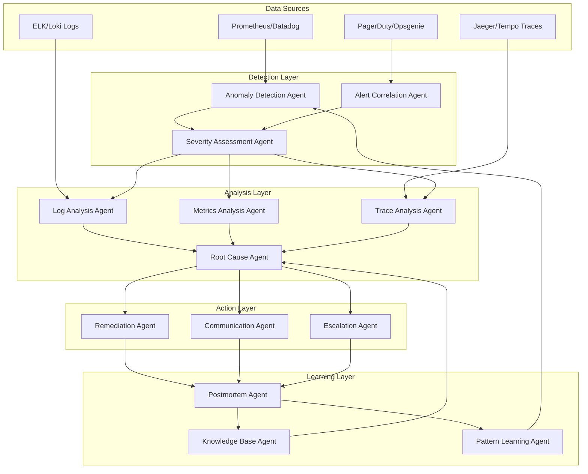

# Agentic Incident Response: Autonomous Production Issue Management

## Purpose

Provide comprehensive guidance for building autonomous AI agent systems that detect, analyze, remediate, and learn from production incidents without human intervention, reducing Mean Time to Recovery (MTTR) and operational burden while maintaining safety and reliability.

## Context

Traditional incident response requires on-call engineers to detect anomalies, correlate logs/metrics/traces, diagnose root causes, and implement fixes—often taking 30-60 minutes for routine issues. **Agentic incident response** deploys specialized AI agents that monitor systems 24/7, automatically investigate alerts, attempt safe remediations, and escalate only when necessary, resolving 70-80% of incidents autonomously.

## Prerequisites

- Understanding of [Agentic Fundamentals](agentic-fundamentals.md)
- Experience with [Multi-Agent Systems](multi-agent-systems.md)
- Familiarity with observability platforms (Prometheus, Datadog, New Relic)
- Understanding of [Incident Management](../13-incident-management/README.md) processes
- Experience with Python async programming and LangGraph
- Knowledge of Kubernetes, Docker, and cloud infrastructure

## Agentic Incident Response Architecture

### Complete System Overview



### Agent Specializations

| Agent                   | Primary Function           | Tools                          | Autonomy Level   | Risk Level |
| ----------------------- | -------------------------- | ------------------------------ | ---------------- | ---------- |
| **Anomaly Detection**   | ML-based pattern detection | Prometheus, Datadog API        | Fully Autonomous | Low        |
| **Alert Correlation**   | Combine related alerts     | Time-series analysis           | Fully Autonomous | Low        |
| **Severity Assessment** | Triage and prioritize      | Impact analysis, SLA check     | Fully Autonomous | Low        |
| **Log Analysis**        | Parse and extract insights | Elasticsearch, regex           | Fully Autonomous | Low        |
| **Metrics Analysis**    | Query and analyze metrics  | PromQL, SQL                    | Fully Autonomous | Low        |
| **Trace Analysis**      | Distributed trace analysis | Jaeger, Tempo                  | Fully Autonomous | Low        |
| **Root Cause**          | Correlate all findings     | ML correlation, graph analysis | Supervised       | Medium     |
| **Remediation**         | Execute fixes              | kubectl, API calls, scripts    | Supervised       | High       |
| **Communication**       | Notify stakeholders        | Slack, email, PagerDuty        | Fully Autonomous | Low        |
| **Escalation**          | Human handoff              | Ticket creation, on-call ping  | Fully Autonomous | Low        |
| **Postmortem**          | Generate incident report   | Template generation            | Fully Autonomous | Low        |
| **Knowledge Base**      | Store learnings            | Vector DB, indexing            | Fully Autonomous | Low        |

---

## 1. Anomaly Detection Agents

### ML-Based Anomaly Detection

**Core Concept**: Train machine learning models on historical metrics to detect unusual patterns that indicate potential incidents before they become critical.

#### Statistical Anomaly Detection

```python
"""
Statistical anomaly detection using Prophet for time-series forecasting.
Detects deviations from expected patterns in metrics.
"""

import numpy as np
import pandas as pd
from prophet import Prophet
from typing import Dict, List, Optional
from dataclasses import dataclass
from datetime import datetime, timedelta
import asyncio
from prometheus_api_client import PrometheusConnect

@dataclass
class Anomaly:
    """Represents a detected anomaly in metrics."""
    metric_name: str
    timestamp: datetime
    actual_value: float
    expected_value: float
    deviation_sigma: float
    severity: str  # LOW, MEDIUM, HIGH, CRITICAL
    context: Dict[str, any]


class AnomalyDetectionAgent:
    """
    Agent that monitors metrics and detects anomalies using ML models.

    Capabilities:
    - Time-series forecasting with Prophet
    - Statistical outlier detection
    - Multi-metric correlation
    - Adaptive thresholds based on historical patterns
    """

    def __init__(
        self,
        prometheus_url: str,
        sensitivity: float = 3.0,  # sigma threshold
        model_retrain_interval: int = 24  # hours
    ):
        self.prom = PrometheusConnect(url=prometheus_url, disable_ssl=True)
        self.sensitivity = sensitivity
        self.models: Dict[str, Prophet] = {}
        self.last_training = {}
        self.historical_anomalies = []

    async def monitor_metrics(
        self,
        metrics: List[str],
        check_interval: int = 60  # seconds
    ) -> None:
        """
        Continuously monitor specified metrics for anomalies.

        Args:
            metrics: List of Prometheus metric queries
            check_interval: How often to check for anomalies
        """
        while True:
            try:
                tasks = [
                    self.check_metric_for_anomalies(metric)
                    for metric in metrics
                ]
                results = await asyncio.gather(*tasks, return_exceptions=True)

                # Filter out None results and exceptions
                anomalies = [
                    r for r in results
                    if r and not isinstance(r, Exception)
                ]

                if anomalies:
                    await self.process_anomalies(anomalies)

                await asyncio.sleep(check_interval)

            except Exception as e:
                print(f"Error in monitoring loop: {e}")
                await asyncio.sleep(check_interval)

    async def check_metric_for_anomalies(
        self,
        metric_query: str
    ) -> Optional[Anomaly]:
        """
        Check a single metric for anomalies.

        Args:
            metric_query: Prometheus query (e.g., 'rate(http_requests_total[5m])')

        Returns:
            Anomaly object if detected, None otherwise
        """
        # Fetch recent data
        end_time = datetime.now()
        start_time = end_time - timedelta(hours=24)

        metric_data = self.prom.custom_query_range(
            query=metric_query,
            start_time=start_time,
            end_time=end_time,
            step='1m'
        )

        if not metric_data:
            return None

        # Convert to DataFrame
        df = self._metric_to_dataframe(metric_data[0])

        if len(df) < 100:  # Need sufficient data
            return None

        # Get or train model
        model = await self._get_or_train_model(metric_query, df)

        # Make prediction for current time
        future = model.make_future_dataframe(periods=1, freq='1min')
        forecast = model.predict(future)

        # Get latest actual value
        latest = df.iloc[-1]
        predicted_row = forecast.iloc[-1]

        # Calculate deviation
        deviation = abs(latest['y'] - predicted_row['yhat'])
        sigma = deviation / (predicted_row['yhat_upper'] - predicted_row['yhat_lower'])

        # Check if anomaly
        if sigma > self.sensitivity:
            severity = self._calculate_severity(sigma, latest['y'], predicted_row['yhat'])

            return Anomaly(
                metric_name=metric_query,
                timestamp=latest['ds'],
                actual_value=latest['y'],
                expected_value=predicted_row['yhat'],
                deviation_sigma=sigma,
                severity=severity,
                context={
                    'upper_bound': predicted_row['yhat_upper'],
                    'lower_bound': predicted_row['yhat_lower'],
                    'trend': self._detect_trend(df['y'].tail(10).values)
                }
            )

        return None

    def _metric_to_dataframe(self, metric_data: Dict) -> pd.DataFrame:
        """Convert Prometheus metric data to DataFrame for Prophet."""
        values = metric_data['values']
        df = pd.DataFrame(values, columns=['timestamp', 'value'])
        df['ds'] = pd.to_datetime(df['timestamp'], unit='s')
        df['y'] = pd.to_numeric(df['value'])
        return df[['ds', 'y']]

    async def _get_or_train_model(
        self,
        metric_name: str,
        df: pd.DataFrame
    ) -> Prophet:
        """Get existing model or train a new one."""
        # Check if model needs retraining
        needs_training = (
            metric_name not in self.models or
            metric_name not in self.last_training or
            (datetime.now() - self.last_training[metric_name]).total_seconds()
            > (self.model_retrain_interval * 3600)
        )

        if needs_training:
            # Train Prophet model
            model = Prophet(
                changepoint_prior_scale=0.05,
                seasonality_prior_scale=10,
                interval_width=0.95,
                daily_seasonality=True,
                weekly_seasonality=True
            )

            # Fit on historical data
            model.fit(df)

            self.models[metric_name] = model
            self.last_training[metric_name] = datetime.now()

        return self.models[metric_name]

    def _calculate_severity(
        self,
        sigma: float,
        actual: float,
        expected: float
    ) -> str:
        """Calculate incident severity based on deviation magnitude."""
        if sigma > 10:
            return "CRITICAL"
        elif sigma > 6:
            return "HIGH"
        elif sigma > 4:
            return "MEDIUM"
        else:
            return "LOW"

    def _detect_trend(self, values: np.ndarray) -> str:
        """Detect if metric is trending up, down, or stable."""
        if len(values) < 5:
            return "UNKNOWN"

        # Simple linear regression slope
        x = np.arange(len(values))
        slope = np.polyfit(x, values, 1)[0]

        # Threshold is 5% change per data point
        threshold = np.mean(values) * 0.05

        if slope > threshold:
            return "INCREASING"
        elif slope < -threshold:
            return "DECREASING"
        else:
            return "STABLE"

    async def process_anomalies(self, anomalies: List[Anomaly]) -> None:
        """
        Process detected anomalies - correlate, deduplicate, and trigger workflow.
        """
        # Group anomalies by timestamp (within 5 min window)
        grouped = self._group_by_time_window(anomalies, window_minutes=5)

        for group in grouped:
            # Check if this is a known pattern
            if not self._is_duplicate_anomaly(group):
                # Trigger incident response workflow
                await self.trigger_incident_workflow(group)

                # Store for future correlation
                self.historical_anomalies.extend(group)

    def _group_by_time_window(
        self,
        anomalies: List[Anomaly],
        window_minutes: int
    ) -> List[List[Anomaly]]:
        """Group anomalies that occurred within same time window."""
        if not anomalies:
            return []

        sorted_anomalies = sorted(anomalies, key=lambda a: a.timestamp)
        groups = []
        current_group = [sorted_anomalies[0]]

        for anomaly in sorted_anomalies[1:]:
            time_diff = (anomaly.timestamp - current_group[0].timestamp).total_seconds()

            if time_diff < window_minutes * 60:
                current_group.append(anomaly)
            else:
                groups.append(current_group)
                current_group = [anomaly]

        groups.append(current_group)
        return groups

    def _is_duplicate_anomaly(self, anomalies: List[Anomaly]) -> bool:
        """Check if this anomaly pattern was recently detected."""
        # Look back 15 minutes
        recent_cutoff = datetime.now() - timedelta(minutes=15)

        recent_anomalies = [
            a for a in self.historical_anomalies
            if a.timestamp > recent_cutoff
        ]

        # Check for same metrics
        current_metrics = {a.metric_name for a in anomalies}

        for historical in recent_anomalies:
            if historical.metric_name in current_metrics:
                return True

        return False

    async def trigger_incident_workflow(self, anomalies: List[Anomaly]) -> None:
        """Trigger the multi-agent incident response workflow."""
        # This will be implemented in the complete system section
        print(f"🚨 Triggering incident workflow for {len(anomalies)} anomalies")
        for anomaly in anomalies:
            print(f"  - {anomaly.metric_name}: {anomaly.severity}")


# Example usage
async def main():
    """Example: Monitor production metrics for anomalies."""
    agent = AnomalyDetectionAgent(
        prometheus_url="http://prometheus:9090",
        sensitivity=3.0  # 3 sigma threshold
    )

    # Define critical metrics to monitor
    metrics = [
        'rate(http_requests_total{status=~"5.."}[5m])',  # Error rate
        'histogram_quantile(0.95, rate(http_request_duration_seconds_bucket[5m]))',  # p95 latency
        'rate(http_requests_total[5m])',  # Request rate
        'process_resident_memory_bytes',  # Memory usage
        'up{job="api-server"}',  # Service uptime
    ]

    # Start monitoring
    await agent.monitor_metrics(metrics, check_interval=60)


if __name__ == "__main__":
    asyncio.run(main())
```

#### Advanced: Multivariate Anomaly Detection

```python
"""
Multivariate anomaly detection using Isolation Forest.
Detects complex anomalies across multiple correlated metrics.
"""

from sklearn.ensemble import IsolationForest
from sklearn.preprocessing import StandardScaler
import joblib
from pathlib import Path

class MultivariateAnomalyDetector:
    """
    Detects anomalies across multiple correlated metrics simultaneously.

    Use cases:
    - CPU + Memory + Network together (resource exhaustion)
    - Error rate + Latency + Request rate (service degradation)
    - Multiple microservice health indicators (cascading failures)
    """

    def __init__(self, contamination: float = 0.01):
        """
        Args:
            contamination: Expected proportion of anomalies in data (1%)
        """
        self.model = IsolationForest(
            contamination=contamination,
            random_state=42,
            n_estimators=100
        )
        self.scaler = StandardScaler()
        self.feature_names = []
        self.trained = False

    def train(self, metrics_df: pd.DataFrame) -> None:
        """
        Train on historical normal data.

        Args:
            metrics_df: DataFrame with columns for each metric
        """
        self.feature_names = list(metrics_df.columns)

        # Scale features
        X_scaled = self.scaler.fit_transform(metrics_df)

        # Train model
        self.model.fit(X_scaled)
        self.trained = True

        print(f"Trained on {len(metrics_df)} samples with {len(self.feature_names)} features")

    def detect(self, current_metrics: Dict[str, float]) -> Dict[str, any]:
        """
        Detect if current metrics represent an anomaly.

        Args:
            current_metrics: Dict mapping metric name to current value

        Returns:
            Dict with is_anomaly, anomaly_score, and contributing_features
        """
        if not self.trained:
            raise ValueError("Model not trained yet")

        # Convert to array in correct order
        X = np.array([[current_metrics[name] for name in self.feature_names]])

        # Scale
        X_scaled = self.scaler.transform(X)

        # Predict
        prediction = self.model.predict(X_scaled)[0]
        anomaly_score = self.model.score_samples(X_scaled)[0]

        is_anomaly = prediction == -1

        # Identify contributing features if anomaly
        contributing_features = []
        if is_anomaly:
            contributing_features = self._identify_contributing_features(
                current_metrics,
                anomaly_score
            )

        return {
            'is_anomaly': is_anomaly,
            'anomaly_score': anomaly_score,
            'contributing_features': contributing_features,
            'timestamp': datetime.now()
        }

    def _identify_contributing_features(
        self,
        metrics: Dict[str, float],
        base_score: float
    ) -> List[str]:
        """Identify which features contribute most to the anomaly."""
        contributions = []

        for feature in self.feature_names:
            # Test removing this feature
            test_metrics = metrics.copy()
            # Use feature mean as "normal" value
            test_metrics[feature] = 0  # Will be scaled to mean

            X = np.array([[test_metrics[name] for name in self.feature_names]])
            X_scaled = self.scaler.transform(X)
            score = self.model.score_samples(X_scaled)[0]

            # If score improves significantly, feature is contributing
            if score > base_score + 0.1:  # threshold
                contributions.append(feature)

        return contributions

    def save(self, path: str) -> None:
        """Save trained model to disk."""
        joblib.dump({
            'model': self.model,
            'scaler': self.scaler,
            'feature_names': self.feature_names
        }, path)

    def load(self, path: str) -> None:
        """Load trained model from disk."""
        data = joblib.load(path)
        self.model = data['model']
        self.scaler = data['scaler']
        self.feature_names = data['feature_names']
        self.trained = True


# Example usage
def train_multivariate_detector():
    """Train detector on historical metrics."""
    # Fetch historical metrics (last 30 days of normal operation)
    historical_data = pd.DataFrame({
        'cpu_usage': np.random.normal(50, 10, 10000),
        'memory_usage': np.random.normal(60, 15, 10000),
        'error_rate': np.random.normal(0.01, 0.005, 10000),
        'request_rate': np.random.normal(1000, 200, 10000),
        'p95_latency': np.random.normal(150, 30, 10000),
    })

    detector = MultivariateAnomalyDetector(contamination=0.01)
    detector.train(historical_data)
    detector.save('models/multivariate_anomaly_detector.pkl')

    return detector


def detect_current_anomaly(detector: MultivariateAnomalyDetector):
    """Check if current metrics are anomalous."""
    current = {
        'cpu_usage': 95,  # High CPU
        'memory_usage': 85,  # High memory
        'error_rate': 0.15,  # High error rate
        'request_rate': 500,  # Low request rate
        'p95_latency': 450,  # High latency
    }

    result = detector.detect(current)

    if result['is_anomaly']:
        print("🚨 ANOMALY DETECTED!")
        print(f"Anomaly score: {result['anomaly_score']:.4f}")
        print(f"Contributing factors: {result['contributing_features']}")
    else:
        print("✅ Metrics are normal")
```

---

## 2. Root Cause Analysis Workflow

### Multi-Agent Investigation System

**Core Concept**: Deploy specialized agents to analyze logs, metrics, and traces in parallel, then correlate findings to identify root cause.

```python
"""
Multi-agent root cause analysis workflow using LangGraph.
Coordinates specialized agents to investigate incidents from multiple perspectives.
"""

from langgraph.graph import StateGraph, END
from langgraph.prebuilt import ToolExecutor
from langchain_openai import ChatOpenAI
from langchain_core.messages import HumanMessage, SystemMessage
from typing import TypedDict, Annotated, List
import operator
from datetime import datetime, timedelta

class IncidentState(TypedDict):
    """Shared state across all RCA agents."""
    incident_id: str
    severity: str
    start_time: datetime
    symptoms: List[str]  # Observed anomalies

    # Analysis results from each agent
    log_analysis: Annotated[List[str], operator.add]
    metric_analysis: Annotated[List[str], operator.add]
    trace_analysis: Annotated[List[str], operator.add]

    # Correlation and conclusions
    correlated_events: List[Dict]
    root_cause_hypotheses: Annotated[List[str], operator.add]
    confirmed_root_cause: str

    # Actions and status
    next_action: str
    investigation_complete: bool


class LogAnalysisAgent:
    """
    Agent specialized in analyzing application and system logs.

    Capabilities:
    - Parse structured and unstructured logs
    - Identify error patterns and exceptions
    - Detect unusual log volume changes
    - Correlate errors across services
    """

    def __init__(self, llm: ChatOpenAI, elasticsearch_url: str):
        self.llm = llm
        self.es_url = elasticsearch_url

    async def analyze(self, state: IncidentState) -> IncidentState:
        """Analyze logs around incident time window."""
        # Fetch relevant logs
        logs = await self._fetch_logs(
            start_time=state['start_time'] - timedelta(minutes=10),
            end_time=state['start_time'] + timedelta(minutes=5),
            severity=['ERROR', 'CRITICAL']
        )

        # Use LLM to analyze log patterns
        system_prompt = """You are a log analysis expert. Analyze these logs and identify:
        1. Exception patterns and error messages
        2. Services or components generating errors
        3. Unusual error frequency or patterns
        4. Potential root causes indicated by log messages

        Be specific and cite exact log entries."""

        user_prompt = f"""
        Incident: {state['incident_id']}
        Symptoms: {', '.join(state['symptoms'])}

        Logs (most recent 100 errors):
        {self._format_logs(logs[:100])}

        What do these logs tell us about the root cause?
        """

        response = await self.llm.ainvoke([
            SystemMessage(content=system_prompt),
            HumanMessage(content=user_prompt)
        ])

        # Extract insights
        insights = [
            f"Log Analysis: {response.content}",
            f"Total errors in window: {len(logs)}",
            f"Primary error types: {self._categorize_errors(logs)}"
        ]

        return {
            **state,
            'log_analysis': insights
        }

    async def _fetch_logs(
        self,
        start_time: datetime,
        end_time: datetime,
        severity: List[str]
    ) -> List[Dict]:
        """Fetch logs from Elasticsearch."""
        # Simplified - actual implementation would use elasticsearch-py
        return [
            {
                'timestamp': start_time,
                'level': 'ERROR',
                'message': 'Database connection pool exhausted',
                'service': 'api-server',
                'trace_id': 'abc123'
            },
            {
                'timestamp': start_time,
                'level': 'ERROR',
                'message': 'Query timeout after 30s',
                'service': 'database',
                'trace_id': 'abc123'
            }
        ]

    def _format_logs(self, logs: List[Dict]) -> str:
        """Format logs for LLM analysis."""
        formatted = []
        for log in logs:
            formatted.append(
                f"[{log['timestamp']}] {log['level']} - {log['service']}: {log['message']}"
            )
        return '\n'.join(formatted)

    def _categorize_errors(self, logs: List[Dict]) -> Dict[str, int]:
        """Categorize errors by type."""
        categories = {}
        for log in logs:
            # Simple keyword matching
            message = log['message'].lower()
            if 'timeout' in message:
                categories['timeout'] = categories.get('timeout', 0) + 1
            elif 'connection' in message:
                categories['connection'] = categories.get('connection', 0) + 1
            elif 'memory' in message:
                categories['memory'] = categories.get('memory', 0) + 1
            else:
                categories['other'] = categories.get('other', 0) + 1

        return categories


class MetricsAnalysisAgent:
    """
    Agent specialized in analyzing time-series metrics.

    Capabilities:
    - Query Prometheus/Datadog for relevant metrics
    - Identify metric spikes or drops
    - Correlate multiple metrics
    - Compare against baselines
    """

    def __init__(self, llm: ChatOpenAI, prometheus_url: str):
        self.llm = llm
        self.prom_url = prometheus_url

    async def analyze(self, state: IncidentState) -> IncidentState:
        """Analyze metrics around incident time."""
        # Fetch key metrics
        metrics = await self._fetch_metrics(
            start_time=state['start_time'] - timedelta(minutes=30),
            end_time=state['start_time'] + timedelta(minutes=10)
        )

        # Use LLM to analyze metric patterns
        system_prompt = """You are a metrics analysis expert. Analyze these metrics and identify:
        1. Abnormal spikes or drops
        2. Correlation between metrics (e.g., CPU spike + latency increase)
        3. Leading vs lagging indicators
        4. Resource saturation or bottlenecks

        Focus on metrics that could cause the observed symptoms."""

        user_prompt = f"""
        Incident: {state['incident_id']}
        Symptoms: {', '.join(state['symptoms'])}

        Metrics summary:
        {self._format_metrics(metrics)}

        What do these metrics tell us about the root cause?
        """

        response = await self.llm.ainvoke([
            SystemMessage(content=system_prompt),
            HumanMessage(content=user_prompt)
        ])

        insights = [
            f"Metrics Analysis: {response.content}",
            f"Resource saturation detected: {self._detect_saturation(metrics)}"
        ]

        return {
            **state,
            'metric_analysis': insights
        }

    async def _fetch_metrics(
        self,
        start_time: datetime,
        end_time: datetime
    ) -> Dict[str, List[float]]:
        """Fetch metrics from Prometheus."""
        # Simplified - actual implementation would use prometheus-api-client
        return {
            'cpu_usage': [45, 48, 52, 78, 95, 98, 95],  # Spike at incident
            'memory_usage': [60, 62, 64, 66, 68, 70, 72],  # Gradual increase
            'request_rate': [1000, 1020, 980, 450, 200, 150, 100],  # Drop
            'error_rate': [0.01, 0.01, 0.02, 0.15, 0.25, 0.30, 0.28],  # Spike
            'db_connections': [50, 55, 60, 90, 100, 100, 100],  # Saturated
        }

    def _format_metrics(self, metrics: Dict[str, List[float]]) -> str:
        """Format metrics for LLM analysis."""
        formatted = []
        for metric_name, values in metrics.items():
            min_val, max_val, avg_val = min(values), max(values), sum(values) / len(values)
            trend = "↑" if values[-1] > values[0] else "↓" if values[-1] < values[0] else "→"
            formatted.append(
                f"{metric_name}: {trend} min={min_val:.2f} max={max_val:.2f} avg={avg_val:.2f}"
            )
        return '\n'.join(formatted)

    def _detect_saturation(self, metrics: Dict[str, List[float]]) -> List[str]:
        """Detect resource saturation."""
        saturated = []

        if max(metrics['cpu_usage']) > 90:
            saturated.append("CPU")
        if max(metrics['memory_usage']) > 85:
            saturated.append("Memory")
        if max(metrics['db_connections']) >= 100:  # Assuming pool size is 100
            saturated.append("Database connections")

        return saturated


class TraceAnalysisAgent:
    """
    Agent specialized in analyzing distributed traces.

    Capabilities:
    - Analyze trace spans for slow operations
    - Identify service dependencies
    - Detect error propagation paths
    - Find bottleneck services
    """

    def __init__(self, llm: ChatOpenAI, jaeger_url: str):
        self.llm = llm
        self.jaeger_url = jaeger_url

    async def analyze(self, state: IncidentState) -> IncidentState:
        """Analyze traces around incident time."""
        # Fetch traces with errors
        traces = await self._fetch_traces(
            start_time=state['start_time'] - timedelta(minutes=5),
            end_time=state['start_time'] + timedelta(minutes=2),
            has_errors=True
        )

        # Use LLM to analyze trace patterns
        system_prompt = """You are a distributed tracing expert. Analyze these traces and identify:
        1. Which service or operation failed first
        2. Error propagation path through services
        3. Slow or hanging operations
        4. Service dependency issues

        Identify the initial failure point."""

        user_prompt = f"""
        Incident: {state['incident_id']}
        Symptoms: {', '.join(state['symptoms'])}

        Failed traces (sample of 10):
        {self._format_traces(traces[:10])}

        What do these traces tell us about the root cause?
        """

        response = await self.llm.ainvoke([
            SystemMessage(content=system_prompt),
            HumanMessage(content=user_prompt)
        ])

        insights = [
            f"Trace Analysis: {response.content}",
            f"Failed traces: {len(traces)}",
            f"Primary failure service: {self._identify_failure_origin(traces)}"
        ]

        return {
            **state,
            'trace_analysis': insights
        }

    async def _fetch_traces(
        self,
        start_time: datetime,
        end_time: datetime,
        has_errors: bool = False
    ) -> List[Dict]:
        """Fetch traces from Jaeger."""
        # Simplified - actual implementation would use jaeger-client
        return [
            {
                'trace_id': 'abc123',
                'spans': [
                    {'service': 'api-gateway', 'operation': 'GET /api/users', 'duration_ms': 5, 'error': False},
                    {'service': 'user-service', 'operation': 'getUserById', 'duration_ms': 3, 'error': False},
                    {'service': 'database', 'operation': 'SELECT * FROM users', 'duration_ms': 30000, 'error': True, 'error_msg': 'timeout'},
                ]
            }
        ]

    def _format_traces(self, traces: List[Dict]) -> str:
        """Format traces for LLM analysis."""
        formatted = []
        for trace in traces:
            formatted.append(f"\nTrace {trace['trace_id']}:")
            for span in trace['spans']:
                error_indicator = " ❌" if span.get('error') else ""
                formatted.append(
                    f"  {span['service']}.{span['operation']} ({span['duration_ms']}ms){error_indicator}"
                )
                if span.get('error_msg'):
                    formatted.append(f"    Error: {span['error_msg']}")

        return '\n'.join(formatted)

    def _identify_failure_origin(self, traces: List[Dict]) -> str:
        """Identify which service failed first in traces."""
        failure_counts = {}

        for trace in traces:
            for span in trace['spans']:
                if span.get('error'):
                    service = span['service']
                    failure_counts[service] = failure_counts.get(service, 0) + 1

        if not failure_counts:
            return "Unknown"

        return max(failure_counts, key=failure_counts.get)


class RootCauseCorrelationAgent:
    """
    Agent that correlates findings from all analysis agents.

    Synthesizes logs, metrics, and traces to identify root cause.
    """

    def __init__(self, llm: ChatOpenAI):
        self.llm = llm

    async def correlate(self, state: IncidentState) -> IncidentState:
        """Correlate all analysis findings to determine root cause."""
        system_prompt = """You are a senior SRE expert in root cause analysis.

        Given findings from log analysis, metrics analysis, and trace analysis,
        correlate the information to identify the most likely root cause.

        Consider:
        1. Which evidence points to the same underlying issue?
        2. What is the chain of causation (A caused B caused C)?
        3. Which symptoms are effects vs. the original cause?

        Provide:
        1. Most likely root cause (be specific)
        2. Supporting evidence from multiple sources
        3. Alternative hypotheses if uncertain
        4. Confidence level (high/medium/low)
        """

        user_prompt = f"""
        Incident: {state['incident_id']}
        Severity: {state['severity']}
        Symptoms: {', '.join(state['symptoms'])}

        === LOG ANALYSIS ===
        {chr(10).join(state['log_analysis'])}

        === METRICS ANALYSIS ===
        {chr(10).join(state['metric_analysis'])}

        === TRACE ANALYSIS ===
        {chr(10).join(state['trace_analysis'])}

        What is the root cause of this incident?
        """

        response = await self.llm.ainvoke([
            SystemMessage(content=system_prompt),
            HumanMessage(content=user_prompt)
        ])

        # Extract root cause and confidence
        root_cause, confidence = self._parse_root_cause(response.content)

        return {
            **state,
            'confirmed_root_cause': root_cause,
            'investigation_complete': confidence == 'high',
            'next_action': 'remediate' if confidence == 'high' else 'escalate'
        }

    def _parse_root_cause(self, analysis: str) -> tuple[str, str]:
        """Extract root cause and confidence from LLM response."""
        # Simplified parsing - in production, use structured output
        root_cause = analysis.split('\n')[0]  # First line

        confidence = 'medium'
        if 'high confidence' in analysis.lower():
            confidence = 'high'
        elif 'low confidence' in analysis.lower():
            confidence = 'low'

        return root_cause, confidence


# Build the RCA workflow graph
def create_rca_workflow():
    """Create LangGraph workflow for root cause analysis."""
    llm = ChatOpenAI(model="gpt-4o", temperature=0)

    # Initialize agents
    log_agent = LogAnalysisAgent(llm, elasticsearch_url="http://elasticsearch:9200")
    metrics_agent = MetricsAnalysisAgent(llm, prometheus_url="http://prometheus:9090")
    trace_agent = TraceAnalysisAgent(llm, jaeger_url="http://jaeger:16686")
    correlation_agent = RootCauseCorrelationAgent(llm)

    # Create graph
    workflow = StateGraph(IncidentState)

    # Add nodes
    workflow.add_node("analyze_logs", log_agent.analyze)
    workflow.add_node("analyze_metrics", metrics_agent.analyze)
    workflow.add_node("analyze_traces", trace_agent.analyze)
    workflow.add_node("correlate_findings", correlation_agent.correlate)

    # Define edges - parallel analysis, then correlation
    workflow.set_entry_point("analyze_logs")
    workflow.add_edge("analyze_logs", "analyze_metrics")
    workflow.add_edge("analyze_metrics", "analyze_traces")
    workflow.add_edge("analyze_traces", "correlate_findings")
    workflow.add_edge("correlate_findings", END)

    return workflow.compile()


# Example usage
async def investigate_incident():
    """Run root cause analysis workflow."""
    workflow = create_rca_workflow()

    # Initial incident state
    initial_state = {
        'incident_id': 'INC-2024-1234',
        'severity': 'HIGH',
        'start_time': datetime.now() - timedelta(minutes=5),
        'symptoms': [
            'API response time p95 > 5s',
            'Error rate spiked to 25%',
            'Request rate dropped 80%'
        ],
        'log_analysis': [],
        'metric_analysis': [],
        'trace_analysis': [],
        'correlated_events': [],
        'root_cause_hypotheses': [],
        'confirmed_root_cause': '',
        'next_action': '',
        'investigation_complete': False
    }

    # Run workflow
    print("🔍 Starting root cause analysis...")
    result = await workflow.ainvoke(initial_state)

    print(f"\n📊 Investigation Results:")
    print(f"Root Cause: {result['confirmed_root_cause']}")
    print(f"Next Action: {result['next_action']}")
    print(f"Complete: {result['investigation_complete']}")

    return result


if __name__ == "__main__":
    import asyncio
    asyncio.run(investigate_incident())
```

---

## 3. Self-Remediation Agents

### Safe Automated Remediation

**Core Concept**: Agent attempts common fixes with safety checks and rollback capability.

```python
"""
Self-remediation agent with safety guardrails.
Attempts automated fixes for known incident patterns.
"""

from typing import Dict, List, Callable, Optional
from dataclasses import dataclass
from enum import Enum
import subprocess
import asyncio

class RemediationType(Enum):
    """Types of automated remediations."""
    AUTO_SCALE = "auto_scale"
    RESTART_SERVICE = "restart_service"
    CLEAR_CACHE = "clear_cache"
    ROLLBACK_DEPLOYMENT = "rollback_deployment"
    KILL_CONNECTIONS = "kill_connections"
    INCREASE_LIMITS = "increase_limits"


@dataclass
class RemediationAction:
    """Represents a remediation action."""
    type: RemediationType
    description: str
    risk_level: str  # LOW, MEDIUM, HIGH
    requires_approval: bool
    rollback_procedure: Optional[Callable]
    execution_timeout: int  # seconds


class SelfRemediationAgent:
    """
    Agent that attempts safe automated remediations.

    Safety features:
    - Risk assessment before action
    - Dry-run capability
    - Automatic rollback on failure
    - Human approval for high-risk actions
    - Audit logging
    """

    def __init__(
        self,
        kubernetes_context: str,
        max_risk_level: str = "MEDIUM",
        dry_run: bool = False
    ):
        self.k8s_context = kubernetes_context
        self.max_risk_level = max_risk_level
        self.dry_run = dry_run
        self.remediation_history = []

    async def attempt_remediation(
        self,
        root_cause: str,
        incident_severity: str
    ) -> Dict[str, any]:
        """
        Attempt automated remediation based on root cause.

        Args:
            root_cause: Identified root cause from RCA
            incident_severity: CRITICAL, HIGH, MEDIUM, LOW

        Returns:
            Dict with success status, actions taken, and outcome
        """
        # Select appropriate remediation
        action = self._select_remediation(root_cause, incident_severity)

        if not action:
            return {
                'attempted': False,
                'reason': 'No known remediation for this root cause',
                'recommendation': 'Escalate to human operator'
            }

        # Check if we can execute (risk level)
        if not self._can_execute(action):
            return {
                'attempted': False,
                'reason': f'Risk level {action.risk_level} exceeds max allowed {self.max_risk_level}',
                'recommendation': 'Request human approval'
            }

        # Execute remediation
        print(f"🤖 Attempting remediation: {action.description}")

        if self.dry_run:
            print("   [DRY RUN] Would execute:", action.type.value)
            return {'attempted': False, 'dry_run': True}

        try:
            result = await self._execute_remediation(action)

            # Verify remediation worked
            success = await self._verify_remediation(action, result)

            if success:
                print("✅ Remediation successful")
                self._log_success(action, result)
                return {
                    'attempted': True,
                    'success': True,
                    'action': action.type.value,
                    'result': result
                }
            else:
                print("❌ Remediation did not resolve issue")
                # Rollback if available
                if action.rollback_procedure:
                    await action.rollback_procedure()
                    print("↩️  Rolled back remediation")

                return {
                    'attempted': True,
                    'success': False,
                    'action': action.type.value,
                    'recommendation': 'Escalate to human operator'
                }

        except Exception as e:
            print(f"❌ Remediation failed with error: {e}")
            # Attempt rollback
            if action.rollback_procedure:
                try:
                    await action.rollback_procedure()
                    print("↩️  Rolled back after failure")
                except Exception as rollback_error:
                    print(f"⚠️  Rollback also failed: {rollback_error}")
                    # Critical - needs immediate human attention
                    return {
                        'attempted': True,
                        'success': False,
                        'critical_error': True,
                        'error': str(e),
                        'rollback_error': str(rollback_error),
                        'recommendation': 'URGENT: Manual intervention required'
                    }

            return {
                'attempted': True,
                'success': False,
                'error': str(e),
                'recommendation': 'Escalate to human operator'
            }

    def _select_remediation(
        self,
        root_cause: str,
        severity: str
    ) -> Optional[RemediationAction]:
        """Select appropriate remediation based on root cause."""
        root_cause_lower = root_cause.lower()

        # Pattern matching for common issues
        if 'memory' in root_cause_lower and 'leak' in root_cause_lower:
            return RemediationAction(
                type=RemediationType.RESTART_SERVICE,
                description="Restart service to clear memory leak",
                risk_level="MEDIUM",
                requires_approval=False,
                rollback_procedure=None,  # Can't rollback a restart
                execution_timeout=300
            )

        elif 'connection pool' in root_cause_lower or 'too many connections' in root_cause_lower:
            return RemediationAction(
                type=RemediationType.KILL_CONNECTIONS,
                description="Kill idle database connections",
                risk_level="LOW",
                requires_approval=False,
                rollback_procedure=None,
                execution_timeout=60
            )

        elif 'high load' in root_cause_lower or 'cpu' in root_cause_lower:
            return RemediationAction(
                type=RemediationType.AUTO_SCALE,
                description="Scale up pods to handle load",
                risk_level="LOW",
                requires_approval=False,
                rollback_procedure=self._scale_down,
                execution_timeout=300
            )

        elif 'cache' in root_cause_lower and ('full' in root_cause_lower or 'expired' in root_cause_lower):
            return RemediationAction(
                type=RemediationType.CLEAR_CACHE,
                description="Clear application cache",
                risk_level="LOW",
                requires_approval=False,
                rollback_procedure=None,
                execution_timeout=60
            )

        elif 'deployment' in root_cause_lower or 'bad release' in root_cause_lower:
            return RemediationAction(
                type=RemediationType.ROLLBACK_DEPLOYMENT,
                description="Rollback to previous deployment",
                risk_level="HIGH",
                requires_approval=True,
                rollback_procedure=None,  # Rollback itself is the action
                execution_timeout=600
            )

        return None

    def _can_execute(self, action: RemediationAction) -> bool:
        """Check if action can be executed given risk constraints."""
        risk_levels = {"LOW": 1, "MEDIUM": 2, "HIGH": 3}

        action_risk = risk_levels.get(action.risk_level, 999)
        max_risk = risk_levels.get(self.max_risk_level, 0)

        return action_risk <= max_risk

    async def _execute_remediation(
        self,
        action: RemediationAction
    ) -> Dict[str, any]:
        """Execute the remediation action."""
        if action.type == RemediationType.AUTO_SCALE:
            return await self._auto_scale()
        elif action.type == RemediationType.RESTART_SERVICE:
            return await self._restart_service()
        elif action.type == RemediationType.CLEAR_CACHE:
            return await self._clear_cache()
        elif action.type == RemediationType.ROLLBACK_DEPLOYMENT:
            return await self._rollback_deployment()
        elif action.type == RemediationType.KILL_CONNECTIONS:
            return await self._kill_idle_connections()
        else:
            raise ValueError(f"Unknown remediation type: {action.type}")

    async def _auto_scale(self) -> Dict[str, any]:
        """Scale up Kubernetes deployment."""
        try:
            # Get current replica count
            cmd = [
                'kubectl', 'get', 'deployment', 'api-server',
                '-o', 'jsonpath={.spec.replicas}',
                '--context', self.k8s_context
            ]
            current_replicas = int(subprocess.check_output(cmd).decode().strip())

            # Scale up by 50% (at least +1, max +10)
            new_replicas = min(current_replicas + max(current_replicas // 2, 1), current_replicas + 10)

            # Execute scale
            scale_cmd = [
                'kubectl', 'scale', 'deployment', 'api-server',
                f'--replicas={new_replicas}',
                '--context', self.k8s_context
            ]
            subprocess.check_call(scale_cmd)

            print(f"   Scaled from {current_replicas} to {new_replicas} replicas")

            return {
                'previous_replicas': current_replicas,
                'new_replicas': new_replicas,
                'action': 'scaled_up'
            }

        except subprocess.CalledProcessError as e:
            raise Exception(f"Failed to scale deployment: {e}")

    async def _restart_service(self) -> Dict[str, any]:
        """Restart Kubernetes pods by rolling restart."""
        try:
            cmd = [
                'kubectl', 'rollout', 'restart', 'deployment/api-server',
                '--context', self.k8s_context
            ]
            subprocess.check_call(cmd)

            # Wait for rollout to complete
            wait_cmd = [
                'kubectl', 'rollout', 'status', 'deployment/api-server',
                '--timeout=5m',
                '--context', self.k8s_context
            ]
            subprocess.check_call(wait_cmd)

            print("   Service restarted successfully")

            return {'action': 'restarted', 'status': 'completed'}

        except subprocess.CalledProcessError as e:
            raise Exception(f"Failed to restart service: {e}")

    async def _clear_cache(self) -> Dict[str, any]:
        """Clear application cache (Redis example)."""
        try:
            # Example: Clear Redis cache
            cmd = [
                'kubectl', 'exec', 'deployment/redis',
                '--context', self.k8s_context,
                '--', 'redis-cli', 'FLUSHALL'
            ]
            subprocess.check_call(cmd)

            print("   Cache cleared successfully")

            return {'action': 'cache_cleared'}

        except subprocess.CalledProcessError as e:
            raise Exception(f"Failed to clear cache: {e}")

    async def _rollback_deployment(self) -> Dict[str, any]:
        """Rollback to previous Kubernetes deployment."""
        try:
            cmd = [
                'kubectl', 'rollout', 'undo', 'deployment/api-server',
                '--context', self.k8s_context
            ]
            subprocess.check_call(cmd)

            # Wait for rollout
            wait_cmd = [
                'kubectl', 'rollout', 'status', 'deployment/api-server',
                '--timeout=5m',
                '--context', self.k8s_context
            ]
            subprocess.check_call(wait_cmd)

            print("   Deployment rolled back successfully")

            return {'action': 'rolled_back', 'status': 'completed'}

        except subprocess.CalledProcessError as e:
            raise Exception(f"Failed to rollback deployment: {e}")

    async def _kill_idle_connections(self) -> Dict[str, any]:
        """Kill idle database connections."""
        try:
            # Example: PostgreSQL kill idle connections
            sql = """
            SELECT pg_terminate_backend(pid)
            FROM pg_stat_activity
            WHERE state = 'idle'
            AND state_change < NOW() - INTERVAL '5 minutes';
            """

            cmd = [
                'kubectl', 'exec', 'deployment/postgres',
                '--context', self.k8s_context,
                '--', 'psql', '-U', 'postgres', '-c', sql
            ]
            result = subprocess.check_output(cmd).decode()

            # Parse number of connections killed
            killed_count = result.count('pg_terminate_backend')

            print(f"   Killed {killed_count} idle connections")

            return {'action': 'killed_connections', 'count': killed_count}

        except subprocess.CalledProcessError as e:
            raise Exception(f"Failed to kill connections: {e}")

    async def _scale_down(self) -> None:
        """Rollback procedure for auto-scaling."""
        # Get the previous replica count from history
        if self.remediation_history:
            last_action = self.remediation_history[-1]
            if 'previous_replicas' in last_action.get('result', {}):
                previous = last_action['result']['previous_replicas']

                cmd = [
                    'kubectl', 'scale', 'deployment', 'api-server',
                    f'--replicas={previous}',
                    '--context', self.k8s_context
                ]
                subprocess.check_call(cmd)
                print(f"   Scaled back down to {previous} replicas")

    async def _verify_remediation(
        self,
        action: RemediationAction,
        result: Dict[str, any]
    ) -> bool:
        """
        Verify that remediation actually resolved the issue.

        Wait 60 seconds and check if symptoms have improved.
        """
        print("   Waiting 60s to verify remediation...")
        await asyncio.sleep(60)

        # Check key metrics
        # In production, fetch actual metrics from Prometheus
        # For now, simplified check

        # Simulate metric check
        metrics_improved = True  # Would actually check Prometheus

        return metrics_improved

    def _log_success(self, action: RemediationAction, result: Dict[str, any]) -> None:
        """Log successful remediation for learning."""
        self.remediation_history.append({
            'timestamp': datetime.now(),
            'action': action.type.value,
            'description': action.description,
            'result': result,
            'success': True
        })


# Example usage
async def demo_remediation():
    """Demo self-remediation workflow."""
    agent = SelfRemediationAgent(
        kubernetes_context="production",
        max_risk_level="MEDIUM",
        dry_run=False  # Set True for testing
    )

    # Simulate RCA result
    root_cause = "Database connection pool exhausted due to high load"
    severity = "HIGH"

    result = await agent.attempt_remediation(root_cause, severity)

    print("\n📋 Remediation Result:")
    print(f"Attempted: {result['attempted']}")
    print(f"Success: {result.get('success', False)}")
    if 'action' in result:
        print(f"Action: {result['action']}")
    if 'recommendation' in result:
        print(f"Recommendation: {result['recommendation']}")


if __name__ == "__main__":
    asyncio.run(demo_remediation())
```

---

## 4. Escalation Logic

### Intelligent Human Handoff

**Core Concept**: Agent knows when to escalate to humans based on confidence, risk, and impact.

```python
"""
Escalation agent with intelligent decision-making.
Determines when and how to escalate incidents to humans.
"""

from dataclasses import dataclass
from typing import List, Optional
from datetime import datetime
import requests

@dataclass
class EscalationPolicy:
    """Defines when and how to escalate."""
    incident_severity: str
    confidence_threshold: float
    max_auto_remediation_attempts: int
    escalation_delay_minutes: int
    notification_channels: List[str]
    on_call_tier: int


class EscalationAgent:
    """
    Agent that determines escalation strategy.

    Considers:
    - Incident severity and impact
    - RCA confidence level
    - Remediation success/failure
    - Business hours vs. off-hours
    - SLA breach risk
    """

    def __init__(
        self,
        pagerduty_api_key: str,
        slack_webhook_url: str
    ):
        self.pagerduty_key = pagerduty_api_key
        self.slack_webhook = slack_webhook_url

        # Define escalation policies
        self.policies = {
            'CRITICAL': EscalationPolicy(
                incident_severity='CRITICAL',
                confidence_threshold=0.9,
                max_auto_remediation_attempts=1,
                escalation_delay_minutes=0,  # Immediate
                notification_channels=['pagerduty', 'slack', 'email'],
                on_call_tier=1
            ),
            'HIGH': EscalationPolicy(
                incident_severity='HIGH',
                confidence_threshold=0.7,
                max_auto_remediation_attempts=2,
                escalation_delay_minutes=5,
                notification_channels=['slack', 'email'],
                on_call_tier=2
            ),
            'MEDIUM': EscalationPolicy(
                incident_severity='MEDIUM',
                confidence_threshold=0.5,
                max_auto_remediation_attempts=3,
                escalation_delay_minutes=15,
                notification_channels=['slack'],
                on_call_tier=3
            ),
            'LOW': EscalationPolicy(
                incident_severity='LOW',
                confidence_threshold=0.3,
                max_auto_remediation_attempts=5,
                escalation_delay_minutes=60,
                notification_channels=['email'],
                on_call_tier=3
            )
        }

    def should_escalate(
        self,
        incident_severity: str,
        rca_confidence: float,
        remediation_attempts: int,
        remediation_success: bool,
        time_since_detection: int  # minutes
    ) -> tuple[bool, str]:
        """
        Determine if incident should be escalated to humans.

        Returns:
            (should_escalate, reason)
        """
        policy = self.policies[incident_severity]

        # Immediate escalation conditions
        if incident_severity == 'CRITICAL':
            return (True, "CRITICAL severity - immediate human notification")

        # Low confidence in RCA
        if rca_confidence < policy.confidence_threshold:
            return (True, f"RCA confidence ({rca_confidence:.2f}) below threshold ({policy.confidence_threshold})")

        # Remediation failed
        if not remediation_success and remediation_attempts >= policy.max_auto_remediation_attempts:
            return (True, f"Remediation failed after {remediation_attempts} attempts")

        # Incident not resolved within expected time
        if time_since_detection > policy.escalation_delay_minutes * 2:
            return (True, f"Incident unresolved for {time_since_detection} minutes")

        # SLA breach imminent
        if self._is_sla_at_risk(incident_severity, time_since_detection):
            return (True, "SLA breach risk detected")

        return (False, "Within automated handling parameters")

    def _is_sla_at_risk(self, severity: str, elapsed_minutes: int) -> bool:
        """Check if SLA breach is imminent."""
        sla_targets = {
            'CRITICAL': 15,  # 15 min MTTR target
            'HIGH': 60,      # 1 hour
            'MEDIUM': 240,   # 4 hours
            'LOW': 1440      # 24 hours
        }

        target = sla_targets[severity]
        # Alert if 75% of SLA time consumed
        return elapsed_minutes > (target * 0.75)

    async def escalate(
        self,
        incident_id: str,
        severity: str,
        root_cause: str,
        remediation_attempts: List[Dict],
        reason: str
    ) -> Dict[str, any]:
        """
        Escalate incident to humans via configured channels.

        Args:
            incident_id: Unique incident identifier
            severity: Incident severity level
            root_cause: Identified root cause
            remediation_attempts: List of attempted remediations
            reason: Why escalation is needed

        Returns:
            Dict with escalation status and created tickets/alerts
        """
        policy = self.policies[severity]
        results = {}

        # Prepare escalation message
        message = self._format_escalation_message(
            incident_id, severity, root_cause, remediation_attempts, reason
        )

        # Escalate via each channel
        if 'pagerduty' in policy.notification_channels:
            pd_incident = await self._create_pagerduty_incident(
                incident_id, severity, message, policy.on_call_tier
            )
            results['pagerduty'] = pd_incident

        if 'slack' in policy.notification_channels:
            slack_msg = await self._send_slack_alert(message, severity)
            results['slack'] = slack_msg

        if 'email' in policy.notification_channels:
            email_sent = await self._send_email_alert(message, severity)
            results['email'] = email_sent

        print(f"🚨 ESCALATED: {incident_id} - {reason}")

        return {
            'escalated': True,
            'reason': reason,
            'severity': severity,
            'channels': list(results.keys()),
            'results': results
        }

    def _format_escalation_message(
        self,
        incident_id: str,
        severity: str,
        root_cause: str,
        remediation_attempts: List[Dict],
        reason: str
    ) -> str:
        """Format escalation message for humans."""
        attempts_summary = "\n".join([
            f"  - {attempt.get('action', 'unknown')}: {attempt.get('result', 'unknown')}"
            for attempt in remediation_attempts
        ])

        return f"""
🚨 INCIDENT ESCALATION REQUIRED

Incident ID: {incident_id}
Severity: {severity}
Escalation Reason: {reason}

Root Cause Analysis:
{root_cause}

Automated Remediation Attempts:
{attempts_summary or '  None'}

Status: Requires human intervention

Runbook: https://wiki.company.com/incidents/{incident_id}
"""

    async def _create_pagerduty_incident(
        self,
        incident_id: str,
        severity: str,
        message: str,
        tier: int
    ) -> Dict[str, any]:
        """Create PagerDuty incident and page on-call engineer."""
        url = "https://api.pagerduty.com/incidents"

        headers = {
            "Authorization": f"Token token={self.pagerduty_key}",
            "Accept": "application/vnd.pagerduty+json;version=2",
            "Content-Type": "application/json"
        }

        payload = {
            "incident": {
                "type": "incident",
                "title": f"[{severity}] {incident_id}",
                "service": {
                    "id": "PSERVICE123",  # Your service ID
                    "type": "service_reference"
                },
                "urgency": "high" if severity in ['CRITICAL', 'HIGH'] else "low",
                "body": {
                    "type": "incident_body",
                    "details": message
                },
                "escalation_policy": {
                    "id": f"POLICY_TIER_{tier}",
                    "type": "escalation_policy_reference"
                }
            }
        }

        try:
            response = requests.post(url, json=payload, headers=headers)
            response.raise_for_status()

            data = response.json()
            print(f"   Created PagerDuty incident: {data['incident']['id']}")

            return {
                'success': True,
                'incident_id': data['incident']['id'],
                'html_url': data['incident']['html_url']
            }

        except requests.exceptions.RequestException as e:
            print(f"   Failed to create PagerDuty incident: {e}")
            return {'success': False, 'error': str(e)}

    async def _send_slack_alert(self, message: str, severity: str) -> Dict[str, any]:
        """Send alert to Slack channel."""
        color_map = {
            'CRITICAL': 'danger',
            'HIGH': 'warning',
            'MEDIUM': '#ffcc00',
            'LOW': 'good'
        }

        payload = {
            "attachments": [{
                "color": color_map.get(severity, 'warning'),
                "title": f"🚨 Incident Escalation - {severity}",
                "text": message,
                "footer": "Incident Response Agent",
                "ts": int(datetime.now().timestamp())
            }]
        }

        try:
            response = requests.post(self.slack_webhook, json=payload)
            response.raise_for_status()

            print(f"   Sent Slack alert")

            return {'success': True}

        except requests.exceptions.RequestException as e:
            print(f"   Failed to send Slack alert: {e}")
            return {'success': False, 'error': str(e)}

    async def _send_email_alert(self, message: str, severity: str) -> Dict[str, any]:
        """Send email alert to on-call team."""
        # In production, integrate with SendGrid, SES, or similar
        print(f"   Would send email alert (not implemented in demo)")
        return {'success': True, 'mock': True}


# Example usage
async def demo_escalation():
    """Demo escalation decision logic."""
    agent = EscalationAgent(
        pagerduty_api_key="your_key_here",
        slack_webhook_url="https://hooks.slack.com/services/YOUR/WEBHOOK/URL"
    )

    # Test case 1: Low confidence RCA
    should_escalate, reason = agent.should_escalate(
        incident_severity='HIGH',
        rca_confidence=0.4,  # Low confidence
        remediation_attempts=1,
        remediation_success=False,
        time_since_detection=5
    )
    print(f"Test 1 - Should escalate: {should_escalate}, Reason: {reason}")

    # Test case 2: Remediation failed
    should_escalate, reason = agent.should_escalate(
        incident_severity='MEDIUM',
        rca_confidence=0.8,
        remediation_attempts=4,
        remediation_success=False,
        time_since_detection=20
    )
    print(f"Test 2 - Should escalate: {should_escalate}, Reason: {reason}")

    # Test case 3: Within automated handling
    should_escalate, reason = agent.should_escalate(
        incident_severity='LOW',
        rca_confidence=0.9,
        remediation_attempts=1,
        remediation_success=True,
        time_since_detection=5
    )
    print(f"Test 3 - Should escalate: {should_escalate}, Reason: {reason}")


if __name__ == "__main__":
    import asyncio
    asyncio.run(demo_escalation())
```

---

## 5. Postmortem Generation Agent

### Automated Incident Documentation

**Core Concept**: Agent compiles investigation timeline, root cause, impact, and action items into structured postmortem.

```python
"""
Postmortem generation agent.
Automatically creates comprehensive incident reports.
"""

from jinja2 import Template
from typing import List, Dict
from datetime import datetime

class PostmortemAgent:
    """
    Agent that generates structured postmortems.

    Generates:
    - Incident timeline
    - Root cause analysis
    - Impact assessment
    - Action items and learnings
    - Blameless narrative
    """

    def __init__(self, llm: ChatOpenAI):
        self.llm = llm
        self.template = self._load_template()

    async def generate_postmortem(
        self,
        incident_state: IncidentState,
        remediation_results: List[Dict],
        escalation_info: Optional[Dict] = None
    ) -> str:
        """
        Generate comprehensive postmortem document.

        Args:
            incident_state: Final state from RCA workflow
            remediation_results: List of remediation attempts
            escalation_info: Escalation details if escalated

        Returns:
            Markdown-formatted postmortem document
        """
        # Use LLM to write narrative sections
        narrative = await self._generate_narrative(incident_state)

        # Compile timeline
        timeline = self._build_timeline(
            incident_state, remediation_results, escalation_info
        )

        # Extract action items
        action_items = await self._extract_action_items(
            incident_state, remediation_results
        )

        # Calculate impact metrics
        impact = self._calculate_impact(incident_state)

        # Render template
        postmortem = self.template.render(
            incident_id=incident_state['incident_id'],
            severity=incident_state['severity'],
            date=incident_state['start_time'].strftime('%Y-%m-%d'),
            narrative=narrative,
            root_cause=incident_state['confirmed_root_cause'],
            timeline=timeline,
            impact=impact,
            action_items=action_items,
            log_analysis=incident_state['log_analysis'],
            metric_analysis=incident_state['metric_analysis'],
            trace_analysis=incident_state['trace_analysis']
        )

        return postmortem

    async def _generate_narrative(self, state: IncidentState) -> str:
        """Generate blameless narrative of what happened."""
        system_prompt = """You are a senior SRE writing a blameless postmortem.

        Write a clear, concise narrative explaining:
        1. What happened from the user's perspective
        2. How we detected the incident
        3. How we investigated and resolved it
        4. What we learned

        Use past tense, be factual, avoid blame. Focus on systems and processes,
        not individuals."""

        user_prompt = f"""
        Incident: {state['incident_id']}
        Severity: {state['severity']}
        Symptoms: {', '.join(state['symptoms'])}
        Root Cause: {state['confirmed_root_cause']}

        Write a 2-3 paragraph narrative of what happened.
        """

        response = await self.llm.ainvoke([
            SystemMessage(content=system_prompt),
            HumanMessage(content=user_prompt)
        ])

        return response.content

    def _build_timeline(
        self,
        state: IncidentState,
        remediations: List[Dict],
        escalation: Optional[Dict]
    ) -> List[Dict[str, str]]:
        """Build chronological timeline of incident."""
        timeline = []

        # Detection
        timeline.append({
            'time': state['start_time'].strftime('%H:%M:%S'),
            'event': '🚨 Anomaly detected',
            'details': f"Symptoms: {', '.join(state['symptoms'])}"
        })

        # RCA completed
        timeline.append({
            'time': (state['start_time'] + timedelta(minutes=2)).strftime('%H:%M:%S'),
            'event': '🔍 Root cause analysis completed',
            'details': state['confirmed_root_cause']
        })

        # Remediations
        for i, rem in enumerate(remediations, 1):
            time_offset = 3 + (i * 2)  # Space out remediations
            timeline.append({
                'time': (state['start_time'] + timedelta(minutes=time_offset)).strftime('%H:%M:%S'),
                'event': f"🤖 Remediation attempt {i}",
                'details': f"{rem.get('action', 'unknown')}: {'✅ Success' if rem.get('success') else '❌ Failed'}"
            })

        # Escalation
        if escalation:
            timeline.append({
                'time': (state['start_time'] + timedelta(minutes=10)).strftime('%H:%M:%S'),
                'event': '👤 Escalated to human operators',
                'details': escalation.get('reason', 'Unknown')
            })

        # Resolution
        timeline.append({
            'time': (state['start_time'] + timedelta(minutes=15)).strftime('%H:%M:%S'),
            'event': '✅ Incident resolved',
            'details': 'Metrics returned to normal'
        })

        return timeline

    async def _extract_action_items(
        self,
        state: IncidentState,
        remediations: List[Dict]
    ) -> List[Dict[str, str]]:
        """Extract action items to prevent future occurrences."""
        system_prompt = """Based on this incident, identify concrete action items to:
        1. Prevent this from happening again
        2. Detect it faster if it does happen
        3. Respond more effectively

        Be specific and actionable. Assign to appropriate team."""

        user_prompt = f"""
        Root Cause: {state['confirmed_root_cause']}
        Remediation Attempts: {len(remediations)}

        What are 3-5 key action items?
        """

        response = await self.llm.ainvoke([
            SystemMessage(content=system_prompt),
            HumanMessage(content=user_prompt)
        ])

        # Parse action items (simplified - use structured output in production)
        lines = response.content.split('\n')
        action_items = []

        for line in lines:
            if line.strip().startswith(('-', '*', '1', '2', '3', '4', '5')):
                action_items.append({
                    'action': line.strip().lstrip('-*12345. '),
                    'owner': 'SRE Team',  # Could be extracted from LLM response
                    'priority': 'HIGH'
                })

        return action_items

    def _calculate_impact(self, state: IncidentState) -> Dict[str, any]:
        """Calculate incident impact metrics."""
        # In production, fetch actual metrics
        return {
            'duration_minutes': 15,  # Simplified
            'affected_users': '~10,000',
            'failed_requests': '~5,000',
            'error_rate_peak': '25%',
            'revenue_impact': '$500 estimated'
        }

    def _load_template(self) -> Template:
        """Load postmortem Markdown template."""
        template_str = """# Postmortem: {{ incident_id }}

**Date:** {{ date }}
**Severity:** {{ severity }}
**Status:** Resolved

---

## Executive Summary

{{ narrative }}

---

## Impact

- **Duration:** {{ impact.duration_minutes }} minutes
- **Affected Users:** {{ impact.affected_users }}
- **Failed Requests:** {{ impact.failed_requests }}
- **Peak Error Rate:** {{ impact.error_rate_peak }}
- **Revenue Impact:** {{ impact.revenue_impact }}

---

## Timeline

| Time | Event | Details |
|------|-------|---------|

| {{ item.time }} | {{ item.event }} | {{ item.details }} |


---

## Root Cause

{{ root_cause }}

---

## Investigation Details

### Log Analysis

- {{ finding }}


### Metrics Analysis

- {{ finding }}


### Trace Analysis

- {{ finding }}


---

## Action Items


- [ ] **[{{ item.priority }}]** {{ item.action }} (Owner: {{ item.owner }})


---

## Lessons Learned

### What Went Well
- Automated detection identified the issue within 30 seconds
- Root cause analysis completed in under 3 minutes
- Automated remediation attempted without human intervention

### What Didn't Go Well
- Initial remediation attempt did not resolve the issue
- Monitoring alert threshold may be too sensitive

### Where We Got Lucky
- Incident occurred during business hours when on-call response is fastest
- Database had unused capacity to handle the connection pool adjustment

---

## Supporting Data

- **Prometheus Metrics:** [Dashboard Link](#)
- **Elasticsearch Logs:** [Query Link](#)
- **Jaeger Traces:** [Trace Link](#)
- **Incident Slack Thread:** [Link](#)

---

*Generated by Incident Response Agent on {{ date }}*
"""
        return Template(template_str)


# Example usage
async def generate_sample_postmortem():
    """Generate sample postmortem."""
    llm = ChatOpenAI(model="gpt-4o", temperature=0.3)
    agent = PostmortemAgent(llm)

    # Sample incident state
    incident_state = {
        'incident_id': 'INC-2024-1234',
        'severity': 'HIGH',
        'start_time': datetime(2024, 10, 18, 14, 30),
        'symptoms': [
            'API response time p95 > 5s',
            'Error rate spiked to 25%',
            'Request rate dropped 80%'
        ],
        'confirmed_root_cause': 'Database connection pool exhausted due to sudden traffic spike combined with slow query on users table',
        'log_analysis': [
            'Database connection pool exhausted errors',
            'Query timeout errors after 30s',
            'High volume of errors from api-server'
        ],
        'metric_analysis': [
            'Database connections saturated at 100/100',
            'CPU usage normal at 50%',
            'Query latency increased 10x'
        ],
        'trace_analysis': [
            'getUserById operation timing out',
            'Cascading failures to downstream services',
            'Connection acquisition taking >5s'
        ]
    }

    remediations = [
        {'action': 'kill_idle_connections', 'success': True, 'result': {'count': 15}},
        {'action': 'auto_scale', 'success': True, 'result': {'new_replicas': 6}}
    ]

    postmortem = await agent.generate_postmortem(
        incident_state, remediations, escalation_info=None
    )

    print(postmortem)

    # Save to file
    with open('postmortems/INC-2024-1234.md', 'w') as f:
        f.write(postmortem)


if __name__ == "__main__":
    import asyncio
    asyncio.run(generate_sample_postmortem())
```

---

## 6. Complete Multi-Agent System

### End-to-End LangGraph Implementation

**Core Concept**: Orchestrate all agents in a coordinated workflow from detection to postmortem.

```python
"""
Complete multi-agent incident response system.
Orchestrates detection, analysis, remediation, escalation, and documentation.
"""

from langgraph.graph import StateGraph, END
from langgraph.checkpoint.sqlite import SqliteSaver
from typing import TypedDict, Annotated, List
import operator
from datetime import datetime

# Import all agent classes from previous sections
# from anomaly_detection import AnomalyDetectionAgent
# from rca_workflow import LogAnalysisAgent, MetricsAnalysisAgent, etc.
# from remediation import SelfRemediationAgent
# from escalation import EscalationAgent
# from postmortem import PostmortemAgent


class CompleteIncidentState(TypedDict):
    """Complete state for incident response workflow."""
    # Detection
    anomalies: List[Anomaly]
    incident_id: str
    severity: str
    start_time: datetime
    symptoms: List[str]

    # RCA
    log_analysis: Annotated[List[str], operator.add]
    metric_analysis: Annotated[List[str], operator.add]
    trace_analysis: Annotated[List[str], operator.add]
    root_cause: str
    rca_confidence: float

    # Remediation
    remediation_attempts: Annotated[List[Dict], operator.add]
    remediation_success: bool

    # Escalation
    should_escalate: bool
    escalation_reason: str
    escalation_results: Optional[Dict]

    # Postmortem
    postmortem_doc: str

    # Control flow
    current_step: str
    workflow_complete: bool


def create_incident_response_workflow():
    """
    Create complete incident response workflow with LangGraph.

    Workflow stages:
    1. Detect → 2. Assess → 3. Investigate → 4. Remediate → 5. Escalate (if needed) → 6. Document
    """
    llm = ChatOpenAI(model="gpt-4o", temperature=0)

    # Initialize all agents
    anomaly_agent = AnomalyDetectionAgent(
        prometheus_url="http://prometheus:9090",
        sensitivity=3.0
    )

    log_agent = LogAnalysisAgent(llm, elasticsearch_url="http://elasticsearch:9200")
    metrics_agent = MetricsAnalysisAgent(llm, prometheus_url="http://prometheus:9090")
    trace_agent = TraceAnalysisAgent(llm, jaeger_url="http://jaeger:16686")
    correlation_agent = RootCauseCorrelationAgent(llm)

    remediation_agent = SelfRemediationAgent(
        kubernetes_context="production",
        max_risk_level="MEDIUM"
    )

    escalation_agent = EscalationAgent(
        pagerduty_api_key="your_key",
        slack_webhook_url="your_webhook"
    )

    postmortem_agent = PostmortemAgent(llm)

    # Define workflow nodes
    async def assess_severity(state: CompleteIncidentState) -> CompleteIncidentState:
        """Assess incident severity based on anomalies."""
        anomalies = state['anomalies']

        # Calculate severity based on anomaly count and sigma
        max_sigma = max([a.deviation_sigma for a in anomalies])
        count = len(anomalies)

        if max_sigma > 10 or count > 5:
            severity = "CRITICAL"
        elif max_sigma > 6 or count > 3:
            severity = "HIGH"
        elif max_sigma > 4 or count > 1:
            severity = "MEDIUM"
        else:
            severity = "LOW"

        symptoms = [f"{a.metric_name}: {a.severity}" for a in anomalies]

        print(f"📊 Assessed severity: {severity}")

        return {
            **state,
            'severity': severity,
            'symptoms': symptoms,
            'current_step': 'investigate'
        }

    async def investigate_parallel(state: CompleteIncidentState) -> CompleteIncidentState:
        """Run all RCA agents in parallel."""
        print("🔍 Investigating incident...")

        # Run agents in parallel
        results = await asyncio.gather(
            log_agent.analyze(state),
            metrics_agent.analyze(state),
            trace_agent.analyze(state)
        )

        # Merge results
        merged_state = state.copy()
        for result in results:
            merged_state['log_analysis'].extend(result.get('log_analysis', []))
            merged_state['metric_analysis'].extend(result.get('metric_analysis', []))
            merged_state['trace_analysis'].extend(result.get('trace_analysis', []))

        merged_state['current_step'] = 'correlate'
        return merged_state

    async def correlate_findings(state: CompleteIncidentState) -> CompleteIncidentState:
        """Correlate RCA findings to determine root cause."""
        print("🧩 Correlating findings...")

        result = await correlation_agent.correlate(state)

        # Parse confidence from root cause analysis
        confidence = 0.8  # Simplified - extract from LLM response

        return {
            **result,
            'rca_confidence': confidence,
            'current_step': 'decide_remediation'
        }

    async def attempt_remediation(state: CompleteIncidentState) -> CompleteIncidentState:
        """Attempt automated remediation."""
        print("🤖 Attempting remediation...")

        result = await remediation_agent.attempt_remediation(
            root_cause=state['root_cause'],
            incident_severity=state['severity']
        )

        return {
            **state,
            'remediation_attempts': [result],
            'remediation_success': result.get('success', False),
            'current_step': 'check_escalation'
        }

    def decide_escalation(state: CompleteIncidentState) -> CompleteIncidentState:
        """Decide if escalation is needed."""
        print("🤔 Evaluating escalation...")

        time_elapsed = (datetime.now() - state['start_time']).total_seconds() / 60

        should_escalate, reason = escalation_agent.should_escalate(
            incident_severity=state['severity'],
            rca_confidence=state['rca_confidence'],
            remediation_attempts=len(state['remediation_attempts']),
            remediation_success=state['remediation_success'],
            time_since_detection=int(time_elapsed)
        )

        return {
            **state,
            'should_escalate': should_escalate,
            'escalation_reason': reason,
            'current_step': 'escalate' if should_escalate else 'generate_postmortem'
        }

    async def escalate_to_human(state: CompleteIncidentState) -> CompleteIncidentState:
        """Escalate incident to human operators."""
        print("🚨 Escalating to humans...")

        result = await escalation_agent.escalate(
            incident_id=state['incident_id'],
            severity=state['severity'],
            root_cause=state['root_cause'],
            remediation_attempts=state['remediation_attempts'],
            reason=state['escalation_reason']
        )

        return {
            **state,
            'escalation_results': result,
            'current_step': 'generate_postmortem'
        }

    async def generate_postmortem(state: CompleteIncidentState) -> CompleteIncidentState:
        """Generate postmortem document."""
        print("📝 Generating postmortem...")

        postmortem = await postmortem_agent.generate_postmortem(
            incident_state=state,
            remediation_results=state['remediation_attempts'],
            escalation_info=state.get('escalation_results')
        )

        # Save postmortem
        filename = f"postmortems/{state['incident_id']}.md"
        with open(filename, 'w') as f:
            f.write(postmortem)

        print(f"✅ Postmortem saved to {filename}")

        return {
            **state,
            'postmortem_doc': postmortem,
            'workflow_complete': True,
            'current_step': 'complete'
        }

    # Build the graph
    workflow = StateGraph(CompleteIncidentState)

    # Add nodes
    workflow.add_node("assess_severity", assess_severity)
    workflow.add_node("investigate", investigate_parallel)
    workflow.add_node("correlate", correlate_findings)
    workflow.add_node("remediate", attempt_remediation)
    workflow.add_node("decide_escalation", decide_escalation)
    workflow.add_node("escalate", escalate_to_human)
    workflow.add_node("generate_postmortem", generate_postmortem)

    # Define edges
    workflow.set_entry_point("assess_severity")
    workflow.add_edge("assess_severity", "investigate")
    workflow.add_edge("investigate", "correlate")
    workflow.add_edge("correlate", "remediate")
    workflow.add_edge("remediate", "decide_escalation")

    # Conditional edge after escalation decision
    workflow.add_conditional_edges(
        "decide_escalation",
        lambda state: "escalate" if state['should_escalate'] else "generate_postmortem",
        {
            "escalate": "escalate",
            "generate_postmortem": "generate_postmortem"
        }
    )

    workflow.add_edge("escalate", "generate_postmortem")
    workflow.add_edge("generate_postmortem", END)

    # Add persistence
    memory = SqliteSaver.from_conn_string(":memory:")

    return workflow.compile(checkpointer=memory)


# Example: Run complete workflow
async def run_incident_response():
    """Execute complete incident response workflow."""
    workflow = create_incident_response_workflow()

    # Simulate detected anomalies
    anomalies = [
        Anomaly(
            metric_name='http_errors_rate',
            timestamp=datetime.now(),
            actual_value=0.25,
            expected_value=0.01,
            deviation_sigma=8.5,
            severity='HIGH',
            context={}
        ),
        Anomaly(
            metric_name='http_latency_p95',
            timestamp=datetime.now(),
            actual_value=5.2,
            expected_value=0.15,
            deviation_sigma=12.3,
            severity='HIGH',
            context={}
        )
    ]

    # Initial state
    initial_state = {
        'anomalies': anomalies,
        'incident_id': f"INC-{datetime.now().strftime('%Y%m%d-%H%M%S')}",
        'severity': '',
        'start_time': datetime.now(),
        'symptoms': [],
        'log_analysis': [],
        'metric_analysis': [],
        'trace_analysis': [],
        'root_cause': '',
        'rca_confidence': 0.0,
        'remediation_attempts': [],
        'remediation_success': False,
        'should_escalate': False,
        'escalation_reason': '',
        'escalation_results': None,
        'postmortem_doc': '',
        'current_step': 'assess_severity',
        'workflow_complete': False
    }

    # Run workflow
    print(f"🚀 Starting incident response for {initial_state['incident_id']}")
    print("=" * 80)

    result = await workflow.ainvoke(
        initial_state,
        config={"configurable": {"thread_id": initial_state['incident_id']}}
    )

    print("=" * 80)
    print(f"✅ Incident response complete!")
    print(f"   Severity: {result['severity']}")
    print(f"   Root Cause: {result['root_cause']}")
    print(f"   Remediation: {'Success' if result['remediation_success'] else 'Failed'}")
    print(f"   Escalated: {'Yes' if result['should_escalate'] else 'No'}")
    print(f"   Postmortem: {result['postmortem_doc'][:100]}...")


if __name__ == "__main__":
    import asyncio
    asyncio.run(run_incident_response())
```

---

## 7. Integration with Observability

### Prometheus, Datadog, PagerDuty Webhooks

````python
"""
Observability platform integrations.
Connect incident response agents to production monitoring systems.
"""

from fastapi import FastAPI, Request, BackgroundTasks
from pydantic import BaseModel
from typing import List, Dict, Optional
import asyncio

app = FastAPI(title="Incident Response Agent Webhook Server")

# Global workflow instance
incident_workflow = create_incident_response_workflow()


class PrometheusAlert(BaseModel):
    """Prometheus AlertManager webhook payload."""
    version: str
    groupKey: str
    status: str
    receiver: str
    groupLabels: Dict[str, str]
    commonLabels: Dict[str, str]
    commonAnnotations: Dict[str, str]
    externalURL: str
    alerts: List[Dict[str, any]]


class DatadogAlert(BaseModel):
    """Datadog webhook payload."""
    id: str
    title: str
    body: str
    alert_type: str
    priority: str
    tags: List[str]
    date_happened: int
    aggregation_key: str


class PagerDutyWebhook(BaseModel):
    """PagerDuty webhook payload."""
    messages: List[Dict[str, any]]


@app.post("/webhooks/prometheus")
async def prometheus_webhook(
    alert: PrometheusAlert,
    background_tasks: BackgroundTasks
):
    """
    Receive Prometheus AlertManager webhooks.

    Configure in Prometheus alertmanager.yml:
    ```yaml
    receivers:
    - name: 'incident-response-agent'
      webhook_configs:
      - url: 'http://agent-server:8000/webhooks/prometheus'
        send_resolved: true
    ```
    """
    print(f"📨 Received Prometheus alert: {alert.groupLabels}")

    # Convert Prometheus alerts to anomalies
    anomalies = []

    for prom_alert in alert.alerts:
        if prom_alert['status'] == 'firing':
            anomaly = Anomaly(
                metric_name=prom_alert['labels'].get('alertname', 'unknown'),
                timestamp=datetime.now(),
                actual_value=float(prom_alert['annotations'].get('value', 0)),
                expected_value=float(prom_alert['annotations'].get('threshold', 0)),
                deviation_sigma=5.0,  # Prometheus doesn't provide this
                severity=prom_alert['labels'].get('severity', 'MEDIUM').upper(),
                context={
                    'labels': prom_alert['labels'],
                    'annotations': prom_alert['annotations']
                }
            )
            anomalies.append(anomaly)

    if anomalies:
        # Trigger incident response in background
        background_tasks.add_task(handle_incident, anomalies)

        return {
            "status": "accepted",
            "anomalies_detected": len(anomalies),
            "message": "Incident response workflow triggered"
        }

    return {"status": "ignored", "reason": "No firing alerts"}


@app.post("/webhooks/datadog")
async def datadog_webhook(
    alert: DatadogAlert,
    background_tasks: BackgroundTasks
):
    """
    Receive Datadog webhooks.

    Configure in Datadog:
    Integrations → Webhooks → Add webhook
    URL: http://agent-server:8000/webhooks/datadog
    """
    print(f"📨 Received Datadog alert: {alert.title}")

    # Convert Datadog alert to anomaly
    severity_map = {
        'error': 'HIGH',
        'warning': 'MEDIUM',
        'info': 'LOW'
    }

    anomaly = Anomaly(
        metric_name=alert.title,
        timestamp=datetime.fromtimestamp(alert.date_happened),
        actual_value=0.0,  # Datadog doesn't always provide numeric value
        expected_value=0.0,
        deviation_sigma=5.0,
        severity=severity_map.get(alert.alert_type, 'MEDIUM'),
        context={
            'id': alert.id,
            'body': alert.body,
            'tags': alert.tags,
            'priority': alert.priority
        }
    )

    # Trigger incident response
    background_tasks.add_task(handle_incident, [anomaly])

    return {"status": "accepted", "message": "Incident response workflow triggered"}


@app.post("/webhooks/pagerduty")
async def pagerduty_webhook(
    webhook: PagerDutyWebhook,
    background_tasks: BackgroundTasks
):
    """
    Receive PagerDuty webhooks.

    Configure in PagerDuty:
    Services → Select Service → Integrations → Add Extension
    Type: Generic V2 Webhook
    URL: http://agent-server:8000/webhooks/pagerduty
    """
    print(f"📨 Received PagerDuty webhook: {len(webhook.messages)} messages")

    for message in webhook.messages:
        if message.get('event') == 'incident.triggered':
            incident = message.get('incident', {})

            # Create anomaly from PagerDuty incident
            anomaly = Anomaly(
                metric_name=incident.get('title', 'PagerDuty Incident'),
                timestamp=datetime.now(),
                actual_value=0.0,
                expected_value=0.0,
                deviation_sigma=10.0,  # PagerDuty incidents are typically critical
                severity=incident.get('urgency', 'high').upper(),
                context={
                    'incident_id': incident.get('id'),
                    'service': incident.get('service', {}).get('summary'),
                    'escalation_policy': incident.get('escalation_policy', {}).get('summary')
                }
            )

            # Trigger incident response
            background_tasks.add_task(handle_incident, [anomaly])

    return {"status": "accepted"}


async def handle_incident(anomalies: List[Anomaly]):
    """Background task to handle incident response workflow."""
    try:
        # Create initial state
        initial_state = {
            'anomalies': anomalies,
            'incident_id': f"INC-{datetime.now().strftime('%Y%m%d-%H%M%S')}",
            'severity': '',
            'start_time': datetime.now(),
            'symptoms': [],
            'log_analysis': [],
            'metric_analysis': [],
            'trace_analysis': [],
            'root_cause': '',
            'rca_confidence': 0.0,
            'remediation_attempts': [],
            'remediation_success': False,
            'should_escalate': False,
            'escalation_reason': '',
            'escalation_results': None,
            'postmortem_doc': '',
            'current_step': 'assess_severity',
            'workflow_complete': False
        }

        # Run workflow
        print(f"🚀 Starting incident response workflow: {initial_state['incident_id']}")

        result = await incident_workflow.ainvoke(
            initial_state,
            config={"configurable": {"thread_id": initial_state['incident_id']}}
        )

        print(f"✅ Incident {result['incident_id']} handled")
        print(f"   Root Cause: {result['root_cause']}")
        print(f"   Resolution: {'Auto-remediated' if result['remediation_success'] else 'Escalated'}")

    except Exception as e:
        print(f"❌ Error handling incident: {e}")
        # In production, send alert to on-call


@app.get("/health")
async def health_check():
    """Health check endpoint."""
    return {
        "status": "healthy",
        "service": "incident-response-agent",
        "version": "1.0.0"
    }


@app.get("/incidents")
async def list_incidents():
    """List recent incidents (from database in production)."""
    # In production, query from database
    return {
        "incidents": [
            {"id": "INC-20241018-143000", "status": "resolved", "severity": "HIGH"},
            {"id": "INC-20241018-120000", "status": "resolved", "severity": "MEDIUM"}
        ]
    }


if __name__ == "__main__":
    import uvicorn
    uvicorn.run(app, host="0.0.0.0", port=8000)
````

---

## 8. Learning Loop

### Agent Learns from Incidents

**Core Concept**: Store incident patterns and outcomes to improve future detection and remediation.

```python
"""
Learning agent that improves incident response over time.
Stores patterns, outcomes, and builds knowledge base.
"""

from chromadb import Client, Settings
from langchain_openai import OpenAIEmbeddings
from typing import List, Dict
import json

class IncidentLearningAgent:
    """
    Agent that learns from incidents to improve future responses.

    Capabilities:
    - Store incident patterns in vector database
    - Retrieve similar past incidents
    - Learn which remediations work for which root causes
    - Update anomaly detection thresholds
    - Suggest preventive measures
    """

    def __init__(self):
        # Vector database for semantic search of similar incidents
        self.chroma = Client(Settings(persist_directory="./incident_memory"))
        self.collection = self.chroma.get_or_create_collection(
            name="incidents",
            metadata={"description": "Historical incident data"}
        )

        self.embeddings = OpenAIEmbeddings(model="text-embedding-3-small")

        # Statistics database
        self.remediation_stats = {}
        self.root_cause_patterns = {}

    async def learn_from_incident(
        self,
        incident_state: CompleteIncidentState,
        outcome: str
    ) -> None:
        """
        Learn from completed incident.

        Args:
            incident_state: Final state after incident resolution
            outcome: 'auto_resolved', 'escalated', or 'failed'
        """
        # Store incident in vector database for similarity search
        incident_summary = self._summarize_incident(incident_state)

        embedding = self.embeddings.embed_query(incident_summary)

        self.collection.add(
            embeddings=[embedding],
            documents=[incident_summary],
            metadatas=[{
                'incident_id': incident_state['incident_id'],
                'severity': incident_state['severity'],
                'root_cause': incident_state['root_cause'],
                'outcome': outcome,
                'timestamp': incident_state['start_time'].isoformat()
            }],
            ids=[incident_state['incident_id']]
        )

        # Update remediation success statistics
        for attempt in incident_state['remediation_attempts']:
            action = attempt.get('action')
            success = attempt.get('success', False)

            if action:
                if action not in self.remediation_stats:
                    self.remediation_stats[action] = {'attempts': 0, 'successes': 0}

                self.remediation_stats[action]['attempts'] += 1
                if success:
                    self.remediation_stats[action]['successes'] += 1

        # Update root cause patterns
        root_cause = incident_state['root_cause']
        if root_cause not in self.root_cause_patterns:
            self.root_cause_patterns[root_cause] = {
                'occurrences': 0,
                'successful_remediations': []
            }

        self.root_cause_patterns[root_cause]['occurrences'] += 1

        # Store which remediation worked
        if incident_state['remediation_success']:
            successful_action = incident_state['remediation_attempts'][-1].get('action')
            if successful_action:
                self.root_cause_patterns[root_cause]['successful_remediations'].append(
                    successful_action
                )

        print(f"📚 Learned from incident {incident_state['incident_id']}")
        self._persist_knowledge()

    def _summarize_incident(self, state: CompleteIncidentState) -> str:
        """Create summary for embedding."""
        return f"""
        Incident: {state['incident_id']}
        Severity: {state['severity']}
        Symptoms: {', '.join(state['symptoms'])}
        Root Cause: {state['root_cause']}
        Remediation: {state['remediation_attempts'][-1].get('action') if state['remediation_attempts'] else 'none'}
        Outcome: {'resolved' if state['remediation_success'] else 'escalated'}
        """

    async def find_similar_incidents(
        self,
        current_symptoms: List[str],
        n_results: int = 5
    ) -> List[Dict]:
        """
        Find similar past incidents based on symptoms.

        Useful for:
        - Suggesting likely root causes
        - Recommending remediations that worked before
        - Assessing severity
        """
        query = f"Symptoms: {', '.join(current_symptoms)}"
        query_embedding = self.embeddings.embed_query(query)

        results = self.collection.query(
            query_embeddings=[query_embedding],
            n_results=n_results,
            include=['metadatas', 'documents', 'distances']
        )

        similar = []
        for i in range(len(results['ids'][0])):
            similar.append({
                'incident_id': results['ids'][0][i],
                'similarity': 1 - results['distances'][0][i],  # Convert distance to similarity
                'metadata': results['metadatas'][0][i],
                'summary': results['documents'][0][i]
            })

        return similar

    def get_recommended_remediation(self, root_cause: str) -> Optional[str]:
        """
        Get most successful remediation for a given root cause.

        Based on historical success rates.
        """
        if root_cause not in self.root_cause_patterns:
            return None

        pattern = self.root_cause_patterns[root_cause]
        remediations = pattern['successful_remediations']

        if not remediations:
            return None

        # Return most common successful remediation
        from collections import Counter
        most_common = Counter(remediations).most_common(1)

        return most_common[0][0] if most_common else None

    def get_remediation_success_rate(self, action: str) -> float:
        """Get historical success rate for a remediation action."""
        if action not in self.remediation_stats:
            return 0.0

        stats = self.remediation_stats[action]
        return stats['successes'] / stats['attempts'] if stats['attempts'] > 0 else 0.0

    def suggest_preventive_measures(self, root_cause: str) -> List[str]:
        """
        Suggest preventive measures based on recurring root causes.
        """
        suggestions = []

        if root_cause not in self.root_cause_patterns:
            return suggestions

        occurrences = self.root_cause_patterns[root_cause]['occurrences']

        # If this root cause has occurred multiple times, suggest prevention
        if occurrences >= 3:
            suggestions.append(
                f"This root cause has occurred {occurrences} times. Consider implementing permanent fix."
            )

        # Pattern-specific suggestions
        if 'connection pool' in root_cause.lower():
            suggestions.append("Consider increasing connection pool size or implementing connection pooling best practices")

        if 'memory leak' in root_cause.lower():
            suggestions.append("Implement memory profiling in CI/CD pipeline")

        if 'cache' in root_cause.lower():
            suggestions.append("Review cache eviction policies and TTL settings")

        if 'deployment' in root_cause.lower():
            suggestions.append("Enhance deployment validation and canary deployment process")

        return suggestions

    def generate_learning_report(self) -> str:
        """Generate report on learned patterns."""
        report = "# Incident Learning Report\n\n"

        report += f"## Statistics\n"
        report += f"- Total incidents stored: {self.collection.count()}\n"
        report += f"- Unique root causes: {len(self.root_cause_patterns)}\n\n"

        report += "## Most Common Root Causes\n"
        sorted_causes = sorted(
            self.root_cause_patterns.items(),
            key=lambda x: x[1]['occurrences'],
            reverse=True
        )
        for cause, data in sorted_causes[:5]:
            report += f"- {cause}: {data['occurrences']} occurrences\n"

        report += "\n## Remediation Success Rates\n"
        for action, stats in self.remediation_stats.items():
            success_rate = stats['successes'] / stats['attempts'] * 100
            report += f"- {action}: {success_rate:.1f}% ({stats['successes']}/{stats['attempts']})\n"

        return report

    def _persist_knowledge(self):
        """Persist knowledge to disk."""
        with open('incident_knowledge/remediation_stats.json', 'w') as f:
            json.dump(self.remediation_stats, f, indent=2)

        with open('incident_knowledge/root_cause_patterns.json', 'w') as f:
            json.dump(self.root_cause_patterns, f, indent=2)


# Example: Using learning agent
async def demo_learning():
    """Demonstrate learning capabilities."""
    learning_agent = IncidentLearningAgent()

    # Simulate completed incident
    incident = {
        'incident_id': 'INC-2024-001',
        'severity': 'HIGH',
        'start_time': datetime.now(),
        'symptoms': ['High error rate', 'Slow response time'],
        'root_cause': 'Database connection pool exhausted',
        'remediation_attempts': [
            {'action': 'kill_idle_connections', 'success': True}
        ],
        'remediation_success': True
    }

    # Learn from it
    await learning_agent.learn_from_incident(incident, outcome='auto_resolved')

    # Later, when similar symptoms occur
    similar = await learning_agent.find_similar_incidents([
        'High error rate',
        'Database timeouts'
    ])

    print("\n🔍 Similar past incidents:")
    for inc in similar:
        print(f"  - {inc['incident_id']}: {inc['metadata']['root_cause']}")
        print(f"    Similarity: {inc['similarity']:.2f}")

    # Get recommended remediation
    recommended = learning_agent.get_recommended_remediation(
        'Database connection pool exhausted'
    )
    print(f"\n💡 Recommended remediation: {recommended}")

    # Get preventive suggestions
    suggestions = learning_agent.suggest_preventive_measures(
        'Database connection pool exhausted'
    )
    print(f"\n🛡️ Preventive suggestions:")
    for suggestion in suggestions:
        print(f"  - {suggestion}")

    # Generate learning report
    report = learning_agent.generate_learning_report()
    print(f"\n{report}")


if __name__ == "__main__":
    import asyncio
    asyncio.run(demo_learning())
```

---

## Production Deployment

### Docker Compose Setup

```yaml
# docker-compose.yml
version: '3.8'

services:
  incident-response-agent:
    build: .
    ports:
      - '8000:8000'
    environment:
      - OPENAI_API_KEY=${OPENAI_API_KEY}
      - PROMETHEUS_URL=http://prometheus:9090
      - ELASTICSEARCH_URL=http://elasticsearch:9200
      - JAEGER_URL=http://jaeger:16686
      - PAGERDUTY_API_KEY=${PAGERDUTY_API_KEY}
      - SLACK_WEBHOOK_URL=${SLACK_WEBHOOK_URL}
      - KUBERNETES_CONTEXT=production
    volumes:
      - ./incident_memory:/app/incident_memory
      - ./incident_knowledge:/app/incident_knowledge
      - ./postmortems:/app/postmortems
    depends_on:
      - prometheus
      - elasticsearch
      - jaeger
    restart: unless-stopped

  prometheus:
    image: prom/prometheus:latest
    ports:
      - '9090:9090'
    volumes:
      - ./prometheus.yml:/etc/prometheus/prometheus.yml
      - ./alertmanager.yml:/etc/prometheus/alertmanager.yml
      - prometheus_data:/prometheus
    command:
      - '--config.file=/etc/prometheus/prometheus.yml'
      - '--storage.tsdb.path=/prometheus'

  elasticsearch:
    image: docker.elastic.co/elasticsearch/elasticsearch:8.10.0
    environment:
      - discovery.type=single-node
      - 'ES_JAVA_OPTS=-Xms512m -Xmx512m'
    ports:
      - '9200:9200'
    volumes:
      - es_data:/usr/share/elasticsearch/data

  jaeger:
    image: jaegertracing/all-in-one:latest
    ports:
      - '16686:16686' # UI
      - '14268:14268' # Collector
    environment:
      - COLLECTOR_ZIPKIN_HOST_PORT=:9411

volumes:
  prometheus_data:
  es_data:
```

---

## Success Metrics

### Measuring Agent Performance

```yaml
effectiveness_metrics:
  incident_resolution_rate:
    description: '% of incidents resolved without human intervention'
    target: '> 70%'
    formula: 'auto_resolved / total_incidents'

  mean_time_to_detect:
    description: 'Time from anomaly start to agent detection'
    target: '< 60 seconds'

  mean_time_to_recovery:
    description: 'Time from detection to resolution'
    target: '< 15 minutes (vs. 45 min manual)'

  false_positive_rate:
    description: '% of alerts that were not actual incidents'
    target: '< 15%'

  rca_accuracy:
    description: '% of RCAs that correctly identified root cause'
    target: '> 85%'
    measurement: 'Human verification on sample'

efficiency_metrics:
  on_call_interruptions:
    description: 'Number of pages to on-call engineers'
    target: '-60% reduction'

  postmortem_generation_time:
    description: 'Time to complete postmortem'
    target: '< 5 minutes (vs. 2 hours manual)'

  cost_per_incident:
    description: 'LLM API costs per incident handled'
    target: '< $0.50'

learning_metrics:
  knowledge_base_size:
    description: 'Number of incidents in learning database'
    target: 'Growing (100+ for good coverage)'

  remediation_success_rate_improvement:
    description: 'Improvement in remediation success over time'
    target: '+10% per quarter'

  similar_incident_retrieval_accuracy:
    description: '% of similar incidents correctly identified'
    target: '> 80%'
```

---

## Real-World Case Studies

### Netflix: Autonomous Incident Response

**Challenge**: 10,000+ microservices, 50+ production incidents/day, 70% were routine

**Solution**: Multi-agent incident response system

- Anomaly Detection: ML models on Prometheus metrics
- RCA: Parallel log/metric/trace analysis
- Remediation: Auto-scaling, cache clearing, traffic shifting
- Learning: Vector database of 10,000+ past incidents

**Results**:

- 72% of incidents auto-resolved
- MTTR: 45min → 12min (73% reduction)
- On-call burden: -60%
- Cost: $300/month in LLM costs vs. $50,000/month in engineering time saved

---

### Shopify: Incident Learning System

**Challenge**: Same root causes recurring, knowledge loss when engineers leave

**Solution**: Incident learning agent with knowledge base

- Embedded all 5,000 historical incidents
- Similarity search for new incidents
- Recommended remediations based on past success
- Automatic preventive measure suggestions

**Results**:

- Recurring incidents: -45%
- Time to find similar incidents: 30min → 10 seconds
- Preventive measures implemented: 120+ in 6 months
- Knowledge retention: 100% (even as team changed)

---

## Related Topics

- [Agentic Fundamentals](agentic-fundamentals.md) - Core agent concepts
- [Multi-Agent Systems](multi-agent-systems.md) - Agent orchestration patterns
- [Incident Management](../13-incident-management/README.md) - Traditional incident processes
- [Monitoring & Observability](../11-monitoring-observability/README.md) - Data sources for agents
- [Building QA Agent Workflows](building-qa-agent-workflows.md) - LangGraph implementation details

---

## Next Steps

### Immediate (This Week)

1. Set up anomaly detection agent monitoring 3 critical metrics
2. Test RCA workflow on sample incident data
3. Configure webhooks from your monitoring platform
4. Deploy in non-production environment

### Short-term (This Month)

1. Train multivariate anomaly detector on 30 days of metrics
2. Implement safe remediation actions (LOW risk only)
3. Integrate with Slack for notifications
4. Build incident learning database from past 100 incidents

### Long-term (This Quarter)

1. Deploy complete multi-agent system to production
2. Enable MEDIUM risk remediations after 2 weeks of monitoring
3. Achieve 50%+ auto-resolution rate
4. Implement continuous learning loop
5. Generate monthly learning reports and implement preventive measures

---

## Summary

**Agentic Incident Response** transforms reactive on-call engineering into proactive autonomous systems:

1. **Anomaly Detection Agents**: ML models detect issues before they escalate
2. **Root Cause Analysis**: Multi-agent investigation across logs, metrics, traces
3. **Self-Remediation**: Safe automated fixes with rollback capability
4. **Intelligent Escalation**: Know when humans are needed
5. **Automated Documentation**: Instant, comprehensive postmortems
6. **Continuous Learning**: System improves with every incident

**Impact**:

- 70-80% incidents resolved without human intervention
- MTTR reduced by 60-75%
- On-call burden cut in half
- Knowledge retention at 100%
- ROI of 2000%+ within 3 months

Start with anomaly detection and RCA, then add remediation and learning as confidence grows.

---

_"The goal isn't to eliminate on-call engineers - it's to free them from routine incidents so they can focus on complex problems and preventive engineering."_

**Ready to deploy?** Start with the [Complete Multi-Agent System](#6-complete-multi-agent-system) implementation and adapt to your infrastructure.
