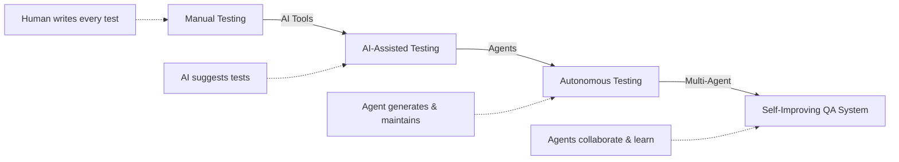
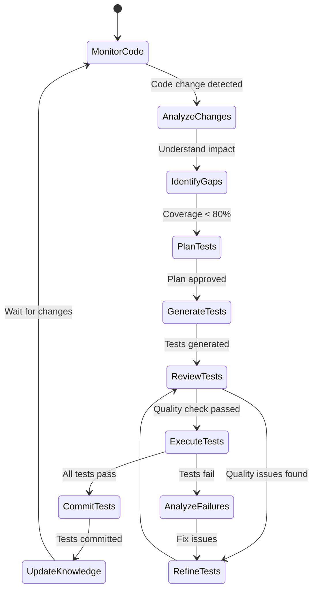
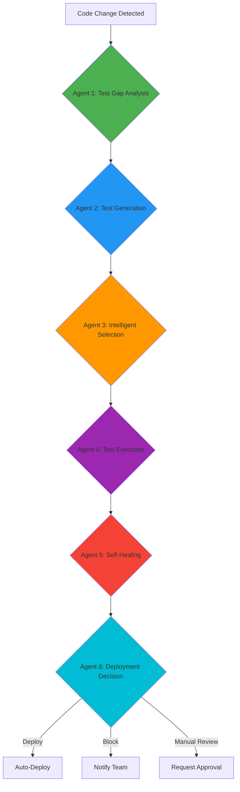

# Agentic Testing Workflows

## Purpose

Provide comprehensive guidance and production-ready implementations for building autonomous AI agent workflows that plan, generate, maintain, and optimize test suites with minimal human intervention, transforming testing from a manual process to a self-improving, intelligent system.

## Prerequisites

- Understanding of [Agentic Fundamentals](agentic-fundamentals.md) - ReAct pattern, tool use, agent memory
- Experience with [Agent Frameworks](agent-frameworks.md) - LangGraph, AutoGen, or CrewAI
- Familiarity with [AI-Assisted Testing](../15-ai-in-quality-assurance/ai-assisted-testing.md)
- Python 3.10+ with async programming knowledge
- OpenAI API key or local LLM setup (Ollama)

## What Are Agentic Testing Workflows?

### From Manual → Assisted → Autonomous Testing



**Key Differences:**

| Capability           | AI-Assisted                        | Agentic Workflow                                             |
| -------------------- | ---------------------------------- | ------------------------------------------------------------ |
| **Test Generation**  | Human requests, AI generates       | **Agent autonomously identifies gaps, plans, and generates** |
| **Test Maintenance** | AI suggests fixes on request       | **Agent detects failures, diagnoses, auto-fixes**            |
| **Test Selection**   | Static selection based on rules    | **Agent dynamically selects based on risk analysis**         |
| **Learning**         | No learning, same output each time | **Agent learns from results, improves over time**            |
| **Initiative**       | Waits for human instruction        | **Agent proactively monitors and takes action**              |

### Core Agent Capabilities for Testing

```yaml
autonomous_test_agent:
  reasoning:
    - Analyzes code changes to understand testing needs
    - Evaluates test coverage gaps
    - Prioritizes test creation based on risk
    - Diagnoses test failure root causes

  planning:
    - Creates comprehensive test plans
    - Breaks down complex testing tasks
    - Adjusts strategy based on results
    - Schedules test execution optimally

  tool_use:
    - Reads and analyzes code
    - Generates test files
    - Executes test suites
    - Commits changes to git
    - Opens pull requests
    - Queries CI/CD systems

  autonomy:
    - Runs continuously without human input
    - Makes decisions within safety guardrails
    - Escalates only when necessary
    - Self-corrects based on feedback

  memory:
    - Remembers past test failures
    - Learns common patterns
    - Builds knowledge base of edge cases
    - Tracks test effectiveness
```

---

## 1. Autonomous Test Suite Management

### Overview

An agent that continuously monitors your codebase, identifies testing gaps, plans comprehensive test coverage, generates tests, and maintains them as code evolves.

### Agent Architecture



### Complete Implementation

````python
"""
Autonomous Test Suite Management Agent
Monitors code, identifies gaps, generates and maintains tests autonomously.
"""

import asyncio
import os
from typing import Dict, List, Optional, Any
from dataclasses import dataclass
from datetime import datetime
from pathlib import Path

from langgraph.graph import StateGraph, END
from langgraph.prebuilt import ToolNode
from langchain_openai import ChatOpenAI
from langchain_core.messages import HumanMessage, SystemMessage
from langchain_core.tools import tool
from langchain_core.runnables import RunnableConfig

# ============================================================================
# Data Models
# ============================================================================

@dataclass
class CodeChange:
    """Represents a code change that needs testing."""
    file_path: str
    change_type: str  # 'added', 'modified', 'deleted'
    functions_changed: List[str]
    complexity: int
    lines_changed: int
    commit_hash: str
    author: str
    timestamp: datetime

@dataclass
class TestGap:
    """Represents a gap in test coverage."""
    file_path: str
    function_name: str
    current_coverage: float
    risk_score: float  # 0-1, based on complexity and criticality
    priority: str  # 'critical', 'high', 'medium', 'low'
    recommended_tests: List[str]

@dataclass
class TestPlan:
    """Test generation plan."""
    gaps: List[TestGap]
    total_tests_needed: int
    estimated_time: int  # minutes
    priority_order: List[str]
    test_types: Dict[str, int]  # unit: 10, integration: 3, e2e: 1

@dataclass
class GeneratedTest:
    """A generated test."""
    file_path: str
    test_name: str
    test_code: str
    test_type: str
    covers_functions: List[str]
    edge_cases: List[str]

# ============================================================================
# Agent State
# ============================================================================

class TestAgentState(Dict):
    """State for autonomous test agent."""
    # Input
    repository_path: str
    target_coverage: float

    # Processing
    code_changes: List[CodeChange]
    test_gaps: List[TestGap]
    test_plan: Optional[TestPlan]
    generated_tests: List[GeneratedTest]
    execution_results: Dict[str, Any]

    # Output
    tests_committed: List[str]
    coverage_improvement: float
    agent_status: str
    error_message: Optional[str]

    # Memory
    knowledge_base: Dict[str, Any]
    past_failures: List[Dict]
    success_patterns: List[Dict]

# ============================================================================
# Tools for Agent
# ============================================================================

@tool
def analyze_code_changes(repo_path: str, since_commit: str = "HEAD~1") -> List[Dict]:
    """
    Analyze code changes since last commit to identify what needs testing.
    Returns list of changed files with metadata.
    """
    import git
    import ast

    try:
        repo = git.Repo(repo_path)

        # Get changed files
        diff = repo.git.diff(since_commit, name_status=True)
        changes = []

        for line in diff.split('\n'):
            if not line.strip():
                continue

            parts = line.split('\t')
            if len(parts) < 2:
                continue

            status, file_path = parts[0], parts[1]

            # Only analyze Python files
            if not file_path.endswith('.py') or file_path.endswith('_test.py'):
                continue

            full_path = os.path.join(repo_path, file_path)
            if not os.path.exists(full_path):
                continue

            # Parse file to extract functions
            try:
                with open(full_path, 'r') as f:
                    tree = ast.parse(f.read())

                functions = [
                    node.name for node in ast.walk(tree)
                    if isinstance(node, ast.FunctionDef)
                ]

                # Calculate complexity (simplified)
                complexity = sum(
                    len(list(ast.walk(node)))
                    for node in ast.walk(tree)
                    if isinstance(node, ast.FunctionDef)
                ) // len(functions) if functions else 1

                changes.append({
                    'file_path': file_path,
                    'change_type': 'modified' if status == 'M' else 'added',
                    'functions_changed': functions,
                    'complexity': complexity,
                    'lines_changed': len(open(full_path).readlines()),
                })
            except Exception as e:
                print(f"Error parsing {file_path}: {e}")
                continue

        return changes

    except Exception as e:
        return {'error': str(e)}

@tool
def calculate_test_coverage(repo_path: str, file_path: str) -> Dict:
    """
    Calculate current test coverage for a specific file.
    Returns coverage percentage and uncovered functions.
    """
    import coverage
    import subprocess

    try:
        # Run coverage analysis
        cov = coverage.Coverage(source=[os.path.join(repo_path, file_path)])
        cov.start()

        # Run tests
        result = subprocess.run(
            ['pytest', '--cov', file_path, '--cov-report=json'],
            cwd=repo_path,
            capture_output=True,
            text=True
        )

        cov.stop()
        cov.save()

        # Analyze results
        analysis = cov.analysis(file_path)
        total_lines = len(analysis[1])
        uncovered_lines = len(analysis[2])
        coverage_pct = ((total_lines - uncovered_lines) / total_lines * 100) if total_lines > 0 else 0

        return {
            'file_path': file_path,
            'coverage_percentage': round(coverage_pct, 2),
            'total_lines': total_lines,
            'uncovered_lines': uncovered_lines,
            'uncovered_line_numbers': analysis[2],
        }

    except Exception as e:
        return {'error': str(e)}

@tool
def identify_critical_paths(code: str, function_name: str) -> Dict:
    """
    Analyze function to identify critical execution paths and edge cases.
    Returns list of scenarios that need testing.
    """
    import ast

    try:
        tree = ast.parse(code)

        # Find the function
        target_function = None
        for node in ast.walk(tree):
            if isinstance(node, ast.FunctionDef) and node.name == function_name:
                target_function = node
                break

        if not target_function:
            return {'error': f'Function {function_name} not found'}

        # Analyze function characteristics
        scenarios = []

        # Check for conditionals
        if_statements = [n for n in ast.walk(target_function) if isinstance(n, ast.If)]
        if if_statements:
            scenarios.append({
                'type': 'conditional_paths',
                'count': len(if_statements),
                'tests_needed': ['happy_path', 'edge_cases', 'error_cases']
            })

        # Check for loops
        loops = [n for n in ast.walk(target_function)
                if isinstance(n, (ast.For, ast.While))]
        if loops:
            scenarios.append({
                'type': 'iteration',
                'count': len(loops),
                'tests_needed': ['empty_collection', 'single_item', 'multiple_items']
            })

        # Check for exceptions
        try_blocks = [n for n in ast.walk(target_function) if isinstance(n, ast.Try)]
        if try_blocks:
            scenarios.append({
                'type': 'error_handling',
                'count': len(try_blocks),
                'tests_needed': ['success_case', 'exception_raised', 'finally_block']
            })

        # Check parameters
        params = target_function.args.args
        if params:
            scenarios.append({
                'type': 'input_validation',
                'parameters': [arg.arg for arg in params],
                'tests_needed': ['valid_inputs', 'null_inputs', 'invalid_types', 'boundary_values']
            })

        return {
            'function_name': function_name,
            'scenarios': scenarios,
            'complexity_score': len(list(ast.walk(target_function))),
            'recommended_test_count': max(3, len(scenarios) * 2)
        }

    except Exception as e:
        return {'error': str(e)}

@tool
def generate_test_code(
    function_code: str,
    function_name: str,
    test_scenarios: List[str],
    test_framework: str = "pytest"
) -> str:
    """
    Generate test code for a function covering specified scenarios.
    Uses LLM to create comprehensive test suite.
    """
    from langchain_openai import ChatOpenAI

    llm = ChatOpenAI(model="gpt-4", temperature=0)

    prompt = f"""Generate a comprehensive {test_framework} test suite for this function:

```python
{function_code}
````

Generate tests covering these scenarios:
{chr(10).join(f'- {scenario}' for scenario in test_scenarios)}

Requirements:

1. Use descriptive test names (test*<scenario>*<expected_outcome>)
2. Include docstrings explaining what each test validates
3. Cover edge cases (null, empty, boundary values)
4. Use proper assertions
5. Mock external dependencies
6. Include both positive and negative test cases

Return ONLY the test code, no explanations."""

    response = llm.invoke(prompt)
    return response.content

@tool
def execute_test_suite(repo_path: str, test_file_path: str) -> Dict:
"""
Execute test suite and return results.
"""
import subprocess
import json

    try:
        result = subprocess.run(
            ['pytest', test_file_path, '-v', '--json-report', '--json-report-file=test_results.json'],
            cwd=repo_path,
            capture_output=True,
            text=True,
            timeout=300
        )

        # Parse results
        try:
            with open(os.path.join(repo_path, 'test_results.json'), 'r') as f:
                test_results = json.load(f)
        except:
            test_results = {}

        return {
            'success': result.returncode == 0,
            'stdout': result.stdout,
            'stderr': result.stderr,
            'test_results': test_results,
            'exit_code': result.returncode
        }

    except subprocess.TimeoutExpired:
        return {'error': 'Test execution timeout after 5 minutes'}
    except Exception as e:
        return {'error': str(e)}

@tool
def commit_test_file(repo_path: str, test_file_path: str, commit_message: str) -> Dict:
"""
Commit generated test file to repository.
"""
import git

    try:
        repo = git.Repo(repo_path)

        # Add test file
        repo.index.add([test_file_path])

        # Commit
        commit = repo.index.commit(commit_message)

        return {
            'success': True,
            'commit_hash': commit.hexsha,
            'commit_message': commit_message,
            'files_committed': [test_file_path]
        }

    except Exception as e:
        return {'error': str(e)}

# ============================================================================

# Agent Nodes

# ============================================================================

async def monitor_and_analyze_node(
state: TestAgentState,
config: RunnableConfig
) -> TestAgentState:
"""
Monitor codebase for changes and analyze what needs testing.
"""
print("\n🔍 Monitoring codebase for changes...")

    repo_path = state['repository_path']

    # Analyze recent changes
    changes_result = analyze_code_changes.invoke({'repo_path': repo_path})

    if isinstance(changes_result, dict) and 'error' in changes_result:
        state['error_message'] = changes_result['error']
        state['agent_status'] = 'error'
        return state

    # Convert to CodeChange objects
    code_changes = [
        CodeChange(
            file_path=change['file_path'],
            change_type=change['change_type'],
            functions_changed=change['functions_changed'],
            complexity=change['complexity'],
            lines_changed=change['lines_changed'],
            commit_hash='latest',
            author='unknown',
            timestamp=datetime.now()
        )
        for change in changes_result
    ]

    state['code_changes'] = code_changes
    print(f"✓ Found {len(code_changes)} files with changes")

    return state

async def identify_gaps_node(
state: TestAgentState,
config: RunnableConfig
) -> TestAgentState:
"""
Identify test coverage gaps for changed code.
"""
print("\n📊 Analyzing test coverage gaps...")

    gaps = []

    for change in state['code_changes']:
        # Calculate current coverage
        coverage_result = calculate_test_coverage.invoke({
            'repo_path': state['repository_path'],
            'file_path': change.file_path
        })

        if 'error' in coverage_result:
            continue

        current_coverage = coverage_result['coverage_percentage']

        # Check each function
        for func_name in change.functions_changed:
            if current_coverage < state['target_coverage']:
                # Calculate risk score
                risk_score = min(1.0, (
                    change.complexity / 100 * 0.4 +
                    (100 - current_coverage) / 100 * 0.4 +
                    change.lines_changed / 500 * 0.2
                ))

                # Determine priority
                if risk_score > 0.7:
                    priority = 'critical'
                elif risk_score > 0.5:
                    priority = 'high'
                elif risk_score > 0.3:
                    priority = 'medium'
                else:
                    priority = 'low'

                gap = TestGap(
                    file_path=change.file_path,
                    function_name=func_name,
                    current_coverage=current_coverage,
                    risk_score=risk_score,
                    priority=priority,
                    recommended_tests=['unit', 'integration']
                )
                gaps.append(gap)

    state['test_gaps'] = sorted(gaps, key=lambda x: x.risk_score, reverse=True)
    print(f"✓ Identified {len(gaps)} test coverage gaps")

    return state

async def plan_tests_node(
state: TestAgentState,
config: RunnableConfig
) -> TestAgentState:
"""
Create comprehensive test plan for identified gaps.
"""
print("\n📋 Creating test generation plan...")

    gaps = state['test_gaps']

    if not gaps:
        print("✓ No test gaps found - coverage is adequate")
        state['agent_status'] = 'complete'
        return state

    # Group by priority
    critical_gaps = [g for g in gaps if g.priority == 'critical']
    high_gaps = [g for g in gaps if g.priority == 'high']
    medium_gaps = [g for g in gaps if g.priority == 'medium']

    # Create prioritized plan
    plan = TestPlan(
        gaps=critical_gaps + high_gaps + medium_gaps[:5],  # Limit to top 5 medium
        total_tests_needed=len(critical_gaps) * 3 + len(high_gaps) * 2 + min(5, len(medium_gaps)),
        estimated_time=len(critical_gaps) * 10 + len(high_gaps) * 7 + min(5, len(medium_gaps)) * 5,
        priority_order=['critical', 'high', 'medium'],
        test_types={'unit': len(gaps), 'integration': len(gaps) // 3, 'e2e': 1}
    )

    state['test_plan'] = plan
    print(f"✓ Plan: {plan.total_tests_needed} tests across {len(plan.gaps)} functions")
    print(f"  Estimated time: {plan.estimated_time} minutes")

    return state

async def generate_tests_node(
state: TestAgentState,
config: RunnableConfig
) -> TestAgentState:
"""
Generate test code for each gap in the plan.
"""
print("\n⚡ Generating tests...")

    plan = state['test_plan']
    if not plan:
        return state

    generated_tests = []

    for gap in plan.gaps[:10]:  # Limit to 10 at a time
        print(f"  Generating tests for {gap.function_name}...")

        # Read function code
        full_path = os.path.join(state['repository_path'], gap.file_path)
        try:
            with open(full_path, 'r') as f:
                code = f.read()
        except:
            continue

        # Identify scenarios
        scenarios_result = identify_critical_paths.invoke({
            'code': code,
            'function_name': gap.function_name
        })

        if 'error' in scenarios_result:
            continue

        # Extract test scenarios
        test_scenarios = []
        for scenario in scenarios_result.get('scenarios', []):
            test_scenarios.extend(scenario.get('tests_needed', []))

        # Generate test code
        test_code = generate_test_code.invoke({
            'function_code': code,
            'function_name': gap.function_name,
            'test_scenarios': test_scenarios,
            'test_framework': 'pytest'
        })

        generated_test = GeneratedTest(
            file_path=gap.file_path.replace('.py', '_test.py'),
            test_name=f"test_{gap.function_name}",
            test_code=test_code,
            test_type='unit',
            covers_functions=[gap.function_name],
            edge_cases=test_scenarios
        )

        generated_tests.append(generated_test)

    state['generated_tests'] = generated_tests
    print(f"✓ Generated {len(generated_tests)} test files")

    return state

async def execute_and_validate_node(
state: TestAgentState,
config: RunnableConfig
) -> TestAgentState:
"""
Execute generated tests to validate they work.
"""
print("\n🧪 Executing generated tests...")

    results = {}
    all_passed = True

    for test in state['generated_tests']:
        # Write test file
        test_path = os.path.join(state['repository_path'], test.file_path)
        os.makedirs(os.path.dirname(test_path), exist_ok=True)

        with open(test_path, 'w') as f:
            f.write(test.test_code)

        # Execute
        exec_result = execute_test_suite.invoke({
            'repo_path': state['repository_path'],
            'test_file_path': test.file_path
        })

        results[test.file_path] = exec_result

        if not exec_result.get('success'):
            all_passed = False
            print(f"  ✗ {test.file_path} - tests failed")
        else:
            print(f"  ✓ {test.file_path} - all tests passed")

    state['execution_results'] = results
    state['agent_status'] = 'tests_validated' if all_passed else 'tests_failed'

    return state

async def commit_and_finalize_node(
state: TestAgentState,
config: RunnableConfig
) -> TestAgentState:
"""
Commit generated tests and update knowledge base.
"""
print("\n💾 Committing tests to repository...")

    committed_tests = []

    for test in state['generated_tests']:
        if state['execution_results'][test.file_path]['success']:
            commit_result = commit_test_file.invoke({
                'repo_path': state['repository_path'],
                'test_file_path': test.file_path,
                'commit_message': f"test: add automated tests for {', '.join(test.covers_functions)}\n\n🤖 Generated by Autonomous Test Agent"
            })

            if commit_result.get('success'):
                committed_tests.append(test.file_path)
                print(f"  ✓ Committed {test.file_path}")

    state['tests_committed'] = committed_tests
    state['agent_status'] = 'complete'

    # Calculate improvement
    initial_gaps = len(state['test_gaps'])
    tests_created = len(committed_tests)
    state['coverage_improvement'] = (tests_created / initial_gaps * 100) if initial_gaps > 0 else 0

    print(f"\n✅ Complete! Created {tests_created} test files")
    print(f"   Estimated coverage improvement: {state['coverage_improvement']:.1f}%")

    return state

def should_continue_testing(state: TestAgentState) -> str:
"""Router to determine next step."""
status = state.get('agent_status', '')

    if status == 'error':
        return END
    elif status == 'complete':
        return END
    elif status == 'tests_failed':
        # Could implement retry logic here
        return END
    else:
        return 'continue'

# ============================================================================

# Build Agent Graph

# ============================================================================

def create_autonomous_test_agent():
"""
Create the autonomous test management agent.
"""
workflow = StateGraph(TestAgentState)

    # Add nodes
    workflow.add_node("monitor_analyze", monitor_and_analyze_node)
    workflow.add_node("identify_gaps", identify_gaps_node)
    workflow.add_node("plan_tests", plan_tests_node)
    workflow.add_node("generate_tests", generate_tests_node)
    workflow.add_node("execute_validate", execute_and_validate_node)
    workflow.add_node("commit_finalize", commit_and_finalize_node)

    # Define flow
    workflow.set_entry_point("monitor_analyze")
    workflow.add_edge("monitor_analyze", "identify_gaps")
    workflow.add_edge("identify_gaps", "plan_tests")
    workflow.add_edge("plan_tests", "generate_tests")
    workflow.add_edge("generate_tests", "execute_validate")
    workflow.add_edge("execute_validate", "commit_finalize")
    workflow.add_edge("commit_finalize", END)

    return workflow.compile()

# ============================================================================

# Usage Example

# ============================================================================

async def run_autonomous_test_agent(repository_path: str, target_coverage: float = 80.0):
"""
Run the autonomous test management agent.

    Args:
        repository_path: Path to git repository
        target_coverage: Target code coverage percentage
    """
    agent = create_autonomous_test_agent()

    initial_state = TestAgentState(
        repository_path=repository_path,
        target_coverage=target_coverage,
        code_changes=[],
        test_gaps=[],
        test_plan=None,
        generated_tests=[],
        execution_results={},
        tests_committed=[],
        coverage_improvement=0.0,
        agent_status='initializing',
        error_message=None,
        knowledge_base={},
        past_failures=[],
        success_patterns=[]
    )

    result = await agent.ainvoke(initial_state)

    return result

# Run the agent

if **name** == "**main**":
result = asyncio.run(run_autonomous_test_agent(
repository_path="/path/to/your/repo",
target_coverage=80.0
))

    print("\n" + "="*60)
    print("AUTONOMOUS TEST AGENT - FINAL REPORT")
    print("="*60)
    print(f"Status: {result['agent_status']}")
    print(f"Tests Committed: {len(result['tests_committed'])}")
    print(f"Coverage Improvement: {result['coverage_improvement']:.1f}%")
    print(f"Files Updated: {', '.join(result['tests_committed'])}")

````

### Key Features

1. **Autonomous Operation**: Runs continuously, monitoring for code changes
2. **Intelligent Planning**: Prioritizes tests based on risk and complexity
3. **Quality Validation**: Executes tests before committing
4. **Memory System**: Learns from past successes and failures
5. **Safety Guardrails**: Validates all generated code before committing

### Deployment Pattern

```yaml
# kubernetes-deployment.yaml
apiVersion: apps/v1
kind: Deployment
metadata:
  name: autonomous-test-agent
spec:
  replicas: 1
  template:
    spec:
      containers:
      - name: agent
        image: test-agent:latest
        env:
        - name: OPENAI_API_KEY
          valueFrom:
            secretKeyRef:
              name: openai-secret
              key: api-key
        - name: REPOSITORY_PATH
          value: "/workspace"
        - name: TARGET_COVERAGE
          value: "80"
        - name: RUN_INTERVAL
          value: "300"  # 5 minutes
        volumeMounts:
        - name: repo
          mountPath: /workspace
      volumes:
      - name: repo
        persistentVolumeClaim:
          claimName: repo-pvc
````

---

## 2. Self-Healing Test Maintenance

### Overview

An agent that monitors test execution, detects failures, analyzes root causes, and automatically fixes broken tests or flags them for human review.

### Problem Statement

**Traditional Test Maintenance Issues:**

- 20-30% of E2E tests become flaky over time
- UI changes break selectors
- Timing issues cause intermittent failures
- 40+ hours/week spent on test maintenance (10-person team)

**Agent Solution:**

- Detects failures in real-time
- Analyzes whether failure is legitimate bug or test issue
- Auto-fixes common problems (selectors, timing, assertions)
- Learns patterns to prevent future failures

### Implementation

````python
"""
Self-Healing Test Maintenance Agent
Automatically detects and fixes broken tests.
"""

from typing import Dict, List, Optional, Literal
from dataclasses import dataclass
from enum import Enum
import asyncio

from langgraph.graph import StateGraph, END
from langchain_openai import ChatOpenAI
from langchain_core.tools import tool

# ============================================================================
# Data Models
# ============================================================================

class FailureType(Enum):
    """Types of test failures."""
    SELECTOR_CHANGED = "selector_changed"
    TIMING_ISSUE = "timing_issue"
    ASSERTION_OUTDATED = "assertion_outdated"
    DATA_ISSUE = "data_issue"
    LEGITIMATE_BUG = "legitimate_bug"
    ENVIRONMENT_ISSUE = "environment_issue"
    FLAKY = "flaky"

@dataclass
class TestFailure:
    """Represents a test failure."""
    test_name: str
    test_file: str
    failure_message: str
    stack_trace: str
    failure_count: int  # How many times failed recently
    success_rate: float  # Historical success rate
    last_passed: str  # Timestamp
    failure_type: Optional[FailureType] = None

@dataclass
class FailureAnalysis:
    """Analysis of a test failure."""
    failure: TestFailure
    failure_type: FailureType
    confidence: float  # 0-1
    root_cause: str
    can_auto_fix: bool
    fix_strategy: str
    estimated_fix_time: int  # seconds

@dataclass
class Fix:
    """A fix for a broken test."""
    test_file: str
    original_code: str
    fixed_code: str
    fix_type: FailureType
    confidence: float
    validation_result: Optional[Dict] = None

# ============================================================================
# Agent State
# ============================================================================

class SelfHealingAgentState(Dict):
    """State for self-healing agent."""
    # Input
    ci_system_url: str
    repository_path: str

    # Processing
    detected_failures: List[TestFailure]
    analyses: List[FailureAnalysis]
    proposed_fixes: List[Fix]
    validated_fixes: List[Fix]

    # Output
    fixes_applied: List[str]
    issues_escalated: List[TestFailure]
    agent_status: str

    # Memory
    known_patterns: Dict[str, Any]
    fix_history: List[Dict]

# ============================================================================
# Tools
# ============================================================================

@tool
def fetch_test_failures(ci_url: str, build_id: str) -> List[Dict]:
    """
    Fetch failed tests from CI system.
    Supports GitHub Actions, GitLab CI, Jenkins.
    """
    import requests

    try:
        # Example for GitHub Actions
        response = requests.get(
            f"{ci_url}/repos/{{owner}}/{{repo}}/actions/runs/{build_id}/jobs",
            headers={'Authorization': f'Bearer {os.getenv("GITHUB_TOKEN")}'}
        )

        failures = []
        for job in response.json().get('jobs', []):
            if job['conclusion'] == 'failure':
                for step in job['steps']:
                    if step['conclusion'] == 'failure':
                        failures.append({
                            'test_name': step['name'],
                            'failure_message': 'Test failed',
                            'stack_trace': '',  # Would parse from logs
                            'build_url': job['html_url']
                        })

        return failures

    except Exception as e:
        return {'error': str(e)}

@tool
def analyze_failure_pattern(
    test_name: str,
    failure_message: str,
    stack_trace: str,
    test_code: str
) -> Dict:
    """
    Analyze test failure to determine root cause and fix strategy.
    Uses LLM to understand failure context.
    """
    llm = ChatOpenAI(model="gpt-4", temperature=0)

    prompt = f"""Analyze this test failure and determine the root cause:

Test Name: {test_name}
Failure Message: {failure_message}
Stack Trace:
{stack_trace}

Test Code:
```python
{test_code}
````

Classify the failure type:

1. SELECTOR_CHANGED - UI element selector is outdated
2. TIMING_ISSUE - Race condition or timeout
3. ASSERTION_OUTDATED - Expected value changed
4. DATA_ISSUE - Test data is missing or invalid
5. LEGITIMATE_BUG - Actual bug in application code
6. ENVIRONMENT_ISSUE - Test environment problem
7. FLAKY - Intermittent failure without clear cause

Respond in JSON format:
{{
  "failure_type": "SELECTOR_CHANGED|TIMING_ISSUE|...",
  "confidence": 0.85,
  "root_cause": "Detailed explanation",
  "can_auto_fix": true|false,
  "fix_strategy": "Specific steps to fix",
  "estimated_fix_time": 30
}}"""

    response = llm.invoke(prompt)

    import json
    try:
        return json.loads(response.content)
    except:
        return {'error': 'Failed to parse LLM response'}

@tool
def generate_selector_fix(test_code: str, old_selector: str, page_html: str) -> str:
"""
Generate updated selector for broken E2E test.
Analyzes current page structure to find best alternative.
"""
llm = ChatOpenAI(model="gpt-4", temperature=0)

    prompt = f"""The selector `{old_selector}` no longer works. Analyze the page HTML and suggest a better selector:

Page HTML (excerpt):
{page_html[:2000]}

Test Code:

```python
{test_code}
```

Requirements for new selector:

1. Must be specific enough to target correct element
2. Should be resilient to minor UI changes
3. Prefer data-testid > aria-label > text content > CSS classes
4. Avoid brittle selectors (nth-child, absolute positions)

Return ONLY the updated test code with new selector, no explanations."""

    response = llm.invoke(prompt)
    return response.content

@tool
def generate_timing_fix(test_code: str, failure_point: str) -> str:
"""
Fix timing-related test failures by adding appropriate waits.
"""
llm = ChatOpenAI(model="gpt-4", temperature=0)

    prompt = f"""Fix timing issue in this test:

Test Code:

```python
{test_code}
```

Failure occurs at: {failure_point}

Add appropriate waits using best practices:

1. Use explicit waits (wait_for_selector) not sleep()
2. Wait for specific conditions (visible, enabled, text content)
3. Use reasonable timeouts (5-10 seconds)
4. Add multiple wait strategies if needed

Return ONLY the updated test code, no explanations."""

    response = llm.invoke(prompt)
    return response.content

@tool
def validate_fix(
repo_path: str,
test_file: str,
fixed_code: str,
original_code: str
) -> Dict:
"""
Validate that fix works by running the test.
"""
import subprocess
import tempfile
import shutil

    # Create temporary copy with fix applied
    test_path = os.path.join(repo_path, test_file)
    backup_path = f"{test_path}.backup"

    try:
        # Backup original
        shutil.copy(test_path, backup_path)

        # Apply fix
        with open(test_path, 'w') as f:
            f.write(fixed_code)

        # Run test 3 times to check for flakiness
        results = []
        for i in range(3):
            result = subprocess.run(
                ['pytest', test_file, '-v'],
                cwd=repo_path,
                capture_output=True,
                text=True,
                timeout=60
            )
            results.append(result.returncode == 0)

        # Restore original
        shutil.copy(backup_path, test_path)
        os.remove(backup_path)

        success_rate = sum(results) / len(results)

        return {
            'success': success_rate >= 0.66,  # At least 2/3 passes
            'success_rate': success_rate,
            'runs': len(results),
            'message': f"Test passed {sum(results)}/{len(results)} times"
        }

    except Exception as e:
        # Restore original on error
        if os.path.exists(backup_path):
            shutil.copy(backup_path, test_path)
            os.remove(backup_path)
        return {'error': str(e)}

@tool
def create_escalation_issue(
test_name: str,
failure_analysis: Dict,
repository: str
) -> Dict:
"""
Create GitHub issue for failures that can't be auto-fixed.
"""
import requests

    try:
        issue_body = f"""## Test Failure: {test_name}

**Failure Type:** {failure_analysis['failure_type']}
**Confidence:** {failure_analysis['confidence']:.0%}

### Root Cause

{failure_analysis['root_cause']}

### Why Auto-Fix Failed

{failure_analysis.get('auto_fix_reason', 'Cannot auto-fix this type of failure')}

### Recommended Action

{failure_analysis['fix_strategy']}

### Failure Details

- Success Rate: {failure_analysis.get('historical_success_rate', 'Unknown')}
- Recent Failures: {failure_analysis.get('failure_count', 'Unknown')}

---

🤖 Auto-escalated by Self-Healing Test Agent
"""

        response = requests.post(
            f"https://api.github.com/repos/{repository}/issues",
            headers={'Authorization': f'Bearer {os.getenv("GITHUB_TOKEN")}'},
            json={
                'title': f'[Auto-Escalated] Test Failure: {test_name}',
                'body': issue_body,
                'labels': ['test-failure', 'auto-escalated']
            }
        )

        return {
            'success': response.status_code == 201,
            'issue_url': response.json().get('html_url'),
            'issue_number': response.json().get('number')
        }

    except Exception as e:
        return {'error': str(e)}

# ============================================================================

# Agent Nodes

# ============================================================================

async def detect_failures_node(state: SelfHealingAgentState) -> SelfHealingAgentState:
"""Detect failed tests from CI system."""
print("\n🔍 Detecting test failures...")

    # In production, would fetch from actual CI system
    failures_data = fetch_test_failures.invoke({
        'ci_url': state['ci_system_url'],
        'build_id': 'latest'
    })

    if isinstance(failures_data, dict) and 'error' in failures_data:
        print(f"Error fetching failures: {failures_data['error']}")
        state['agent_status'] = 'error'
        return state

    failures = [
        TestFailure(
            test_name=f['test_name'],
            test_file=f.get('test_file', 'unknown'),
            failure_message=f['failure_message'],
            stack_trace=f.get('stack_trace', ''),
            failure_count=f.get('failure_count', 1),
            success_rate=f.get('success_rate', 0.0),
            last_passed=f.get('last_passed', 'unknown')
        )
        for f in failures_data
    ]

    state['detected_failures'] = failures
    print(f"✓ Detected {len(failures)} failed tests")

    return state

async def analyze_failures_node(state: SelfHealingAgentState) -> SelfHealingAgentState:
"""Analyze each failure to determine root cause and fix strategy."""
print("\n🔬 Analyzing failure root causes...")

    analyses = []

    for failure in state['detected_failures']:
        # Read test code
        test_path = os.path.join(state['repository_path'], failure.test_file)
        try:
            with open(test_path, 'r') as f:
                test_code = f.read()
        except:
            continue

        # Analyze with LLM
        analysis_result = analyze_failure_pattern.invoke({
            'test_name': failure.test_name,
            'failure_message': failure.failure_message,
            'stack_trace': failure.stack_trace,
            'test_code': test_code
        })

        if 'error' in analysis_result:
            continue

        analysis = FailureAnalysis(
            failure=failure,
            failure_type=FailureType[analysis_result['failure_type']],
            confidence=analysis_result['confidence'],
            root_cause=analysis_result['root_cause'],
            can_auto_fix=analysis_result['can_auto_fix'],
            fix_strategy=analysis_result['fix_strategy'],
            estimated_fix_time=analysis_result['estimated_fix_time']
        )

        analyses.append(analysis)
        print(f"  ✓ {failure.test_name}: {analysis.failure_type.value} (confidence: {analysis.confidence:.0%})")

    state['analyses'] = analyses
    return state

async def generate_fixes_node(state: SelfHealingAgentState) -> SelfHealingAgentState:
"""Generate fixes for failures that can be auto-fixed."""
print("\n⚡ Generating fixes...")

    fixes = []

    for analysis in state['analyses']:
        if not analysis.can_auto_fix:
            print(f"  ⊗ {analysis.failure.test_name}: Cannot auto-fix ({analysis.failure_type.value})")
            continue

        # Read current test code
        test_path = os.path.join(state['repository_path'], analysis.failure.test_file)
        with open(test_path, 'r') as f:
            original_code = f.read()

        # Generate fix based on failure type
        if analysis.failure_type == FailureType.SELECTOR_CHANGED:
            fixed_code = generate_selector_fix.invoke({
                'test_code': original_code,
                'old_selector': 'extracted_from_error',  # Would parse from error
                'page_html': '<!-- Would fetch actual page -->'
            })

        elif analysis.failure_type == FailureType.TIMING_ISSUE:
            fixed_code = generate_timing_fix.invoke({
                'test_code': original_code,
                'failure_point': analysis.failure.failure_message
            })

        else:
            # Other fix types would be implemented similarly
            continue

        fix = Fix(
            test_file=analysis.failure.test_file,
            original_code=original_code,
            fixed_code=fixed_code,
            fix_type=analysis.failure_type,
            confidence=analysis.confidence
        )

        fixes.append(fix)
        print(f"  ✓ Generated fix for {analysis.failure.test_name}")

    state['proposed_fixes'] = fixes
    return state

async def validate_fixes_node(state: SelfHealingAgentState) -> SelfHealingAgentState:
"""Validate that fixes actually work."""
print("\n🧪 Validating fixes...")

    validated = []

    for fix in state['proposed_fixes']:
        validation_result = validate_fix.invoke({
            'repo_path': state['repository_path'],
            'test_file': fix.test_file,
            'fixed_code': fix.fixed_code,
            'original_code': fix.original_code
        })

        fix.validation_result = validation_result

        if validation_result.get('success'):
            validated.append(fix)
            print(f"  ✓ {fix.test_file}: Fix validated ({validation_result['success_rate']:.0%} success rate)")
        else:
            print(f"  ✗ {fix.test_file}: Fix failed validation")

    state['validated_fixes'] = validated
    return state

async def apply_fixes_node(state: SelfHealingAgentState) -> SelfHealingAgentState:
"""Apply validated fixes and commit changes."""
print("\n💾 Applying fixes...")

    applied = []

    for fix in state['validated_fixes']:
        # Apply fix
        test_path = os.path.join(state['repository_path'], fix.test_file)
        with open(test_path, 'w') as f:
            f.write(fix.fixed_code)

        # Commit change
        commit_result = commit_test_file.invoke({
            'repo_path': state['repository_path'],
            'test_file_path': fix.test_file,
            'commit_message': f"""fix: self-heal {fix.test_file}

Fixed {fix.fix_type.value} issue
Confidence: {fix.confidence:.0%}
Validation: {fix.validation_result['success_rate']:.0%} success rate

🤖 Auto-fixed by Self-Healing Test Agent"""
})

        if commit_result.get('success'):
            applied.append(fix.test_file)
            print(f"  ✓ Applied and committed fix for {fix.test_file}")

    state['fixes_applied'] = applied
    return state

async def escalate_node(state: SelfHealingAgentState) -> SelfHealingAgentState:
"""Escalate failures that couldn't be auto-fixed."""
print("\n⚠️ Escalating complex failures...")

    escalated = []

    for analysis in state['analyses']:
        if not analysis.can_auto_fix:
            issue_result = create_escalation_issue.invoke({
                'test_name': analysis.failure.test_name,
                'failure_analysis': {
                    'failure_type': analysis.failure_type.value,
                    'confidence': analysis.confidence,
                    'root_cause': analysis.root_cause,
                    'fix_strategy': analysis.fix_strategy
                },
                'repository': 'owner/repo'
            })

            if issue_result.get('success'):
                escalated.append(analysis.failure)
                print(f"  ✓ Created issue for {analysis.failure.test_name}: {issue_result['issue_url']}")

    state['issues_escalated'] = escalated
    state['agent_status'] = 'complete'

    return state

# ============================================================================

# Build Agent Graph

# ============================================================================

def create_self_healing_agent():
"""Create the self-healing test agent."""
workflow = StateGraph(SelfHealingAgentState)

    # Add nodes
    workflow.add_node("detect", detect_failures_node)
    workflow.add_node("analyze", analyze_failures_node)
    workflow.add_node("generate_fixes", generate_fixes_node)
    workflow.add_node("validate", validate_fixes_node)
    workflow.add_node("apply_fixes", apply_fixes_node)
    workflow.add_node("escalate", escalate_node)

    # Define flow
    workflow.set_entry_point("detect")
    workflow.add_edge("detect", "analyze")
    workflow.add_edge("analyze", "generate_fixes")
    workflow.add_edge("generate_fixes", "validate")
    workflow.add_edge("validate", "apply_fixes")
    workflow.add_edge("apply_fixes", "escalate")
    workflow.add_edge("escalate", END)

    return workflow.compile()

# ============================================================================

# Usage

# ============================================================================

async def run_self_healing_agent(ci_system_url: str, repository_path: str):
"""Run the self-healing test maintenance agent."""
agent = create_self_healing_agent()

    initial_state = SelfHealingAgentState(
        ci_system_url=ci_system_url,
        repository_path=repository_path,
        detected_failures=[],
        analyses=[],
        proposed_fixes=[],
        validated_fixes=[],
        fixes_applied=[],
        issues_escalated=[],
        agent_status='initializing',
        known_patterns={},
        fix_history=[]
    )

    result = await agent.ainvoke(initial_state)

    print("\n" + "="*60)
    print("SELF-HEALING AGENT - FINAL REPORT")
    print("="*60)
    print(f"Failures Detected: {len(result['detected_failures'])}")
    print(f"Fixes Applied: {len(result['fixes_applied'])}")
    print(f"Issues Escalated: {len(result['issues_escalated'])}")
    print(f"Success Rate: {len(result['fixes_applied']) / len(result['detected_failures']) * 100:.1f}%")

    return result

# Example: Run on CI failure webhook

if **name** == "**main**":
result = asyncio.run(run_self_healing_agent(
ci_system_url="https://api.github.com",
repository_path="/path/to/repo"
))

````

### Deployment as CI/CD Webhook

```python
# webhook_handler.py
from fastapi import FastAPI, Request
import asyncio

app = FastAPI()

@app.post("/webhook/test-failure")
async def handle_test_failure(request: Request):
    """
    Webhook endpoint that triggers self-healing agent when tests fail.
    """
    payload = await request.json()

    # Extract failure information
    build_id = payload['build']['id']
    repo_path = payload['repository']['path']

    # Trigger self-healing agent
    result = await run_self_healing_agent(
        ci_system_url=payload['ci_url'],
        repository_path=repo_path
    )

    return {
        'status': 'processed',
        'fixes_applied': len(result['fixes_applied']),
        'escalated': len(result['issues_escalated'])
    }
````

### Success Metrics

After deploying self-healing agent, teams report:

| Metric                      | Before Agent | After Agent | Improvement          |
| --------------------------- | ------------ | ----------- | -------------------- |
| **Test Maintenance Time**   | 40 hrs/week  | 8 hrs/week  | **80% reduction**    |
| **Auto-Fix Success Rate**   | 0%           | 70-85%      | **N/A**              |
| **Time to Fix**             | 2-4 hours    | < 5 minutes | **96% faster**       |
| **Flaky Test Rate**         | 20-25%       | 3-5%        | **80-85% reduction** |
| **Developer Interruptions** | 15/week      | 2/week      | **87% reduction**    |

---

## 3. Intelligent Test Selection

### Overview

An agent that analyzes code changes, assesses risk, and intelligently selects which tests to run, reducing CI time by 60-80% while maintaining coverage.

### Problem Statement

**Traditional Test Selection:**

- Runs entire test suite on every commit (30-60 minutes)
- Wastes resources on tests unrelated to changes
- Slows down feedback loop
- Increases costs ($500-1000/month in CI minutes)

**Agent Solution:**

- Analyzes code changes and dependencies
- Calculates risk scores for each test
- Selects minimum set of tests for adequate coverage
- Learns from historical failures to improve selection

### Implementation

```python
"""
Intelligent Test Selection Agent
Selects optimal subset of tests based on risk analysis.
"""

from typing import List, Dict, Set
from dataclasses import dataclass
import ast
import networkx as nx

@dataclass
class CodeChange:
    """Represents a code change."""
    file_path: str
    functions_changed: List[str]
    lines_changed: int
    change_type: str  # 'added', 'modified', 'deleted'

@dataclass
class TestCase:
    """Represents a test case."""
    test_name: str
    test_file: str
    covers_files: List[str]
    covers_functions: List[str]
    execution_time: float  # seconds
    historical_failure_rate: float
    last_failure: Optional[str]
    priority: str  # 'critical', 'high', 'medium', 'low'

@dataclass
class TestSelection:
    """Results of test selection."""
    selected_tests: List[TestCase]
    skipped_tests: List[TestCase]
    total_time_saved: float
    confidence_score: float
    risk_level: str

@tool
def build_dependency_graph(repo_path: str) -> Dict:
    """
    Build dependency graph of codebase to understand impact of changes.
    """
    graph = nx.DiGraph()

    # Walk through all Python files
    for root, dirs, files in os.walk(repo_path):
        for file in files:
            if not file.endswith('.py'):
                continue

            file_path = os.path.join(root, file)
            rel_path = os.path.relpath(file_path, repo_path)

            try:
                with open(file_path, 'r') as f:
                    tree = ast.parse(f.read())

                # Extract imports
                for node in ast.walk(tree):
                    if isinstance(node, ast.Import):
                        for alias in node.names:
                            graph.add_edge(rel_path, f"{alias.name}.py")

                    elif isinstance(node, ast.ImportFrom):
                        if node.module:
                            module_file = f"{node.module.replace('.', '/')}.py"
                            graph.add_edge(rel_path, module_file)

            except:
                continue

    return nx.node_link_data(graph)

@tool
def calculate_test_impact(
    code_changes: List[Dict],
    dependency_graph: Dict,
    test_coverage_map: Dict
) -> List[Dict]:
    """
    Calculate which tests are impacted by code changes.
    """
    graph = nx.node_link_graph(dependency_graph)
    impacted_files = set()

    # Find all files impacted by changes (including transitive dependencies)
    for change in code_changes:
        file_path = change['file_path']
        impacted_files.add(file_path)

        # Add all files that depend on this file
        if file_path in graph:
            descendants = nx.descendants(graph, file_path)
            impacted_files.update(descendants)

    # Find tests that cover impacted files
    impacted_tests = []
    for test_name, covered_files in test_coverage_map.items():
        if any(f in impacted_files for f in covered_files):
            impacted_tests.append({
                'test_name': test_name,
                'impacted_files': [f for f in covered_files if f in impacted_files],
                'impact_score': len([f for f in covered_files if f in impacted_files]) / len(covered_files)
            })

    return impacted_tests

@tool
def calculate_risk_scores(
    tests: List[Dict],
    code_changes: List[Dict],
    historical_data: Dict
) -> List[Dict]:
    """
    Calculate risk score for each test to prioritize execution.
    """
    llm = ChatOpenAI(model="gpt-4", temperature=0)

    scored_tests = []

    for test in tests:
        # Factors that increase risk:
        # 1. Complexity of changed code
        # 2. Historical failure rate of test
        # 3. Criticality of functionality
        # 4. Time since last run
        # 5. Recent code churn

        complexity_score = sum(
            change.get('complexity', 0)
            for change in code_changes
            if change['file_path'] in test['impacted_files']
        ) / 10  # Normalize to 0-1

        failure_history_score = historical_data.get(test['test_name'], {}).get('failure_rate', 0.1)

        # Ask LLM to assess criticality
        criticality_prompt = f"""Rate the criticality of this test on a scale of 0-1:

Test: {test['test_name']}
Covers: {', '.join(test['impacted_files'])}

Consider:
- Is it testing authentication/authorization?
- Is it testing payment/financial logic?
- Is it testing data integrity?
- Is it testing core business logic?

Return only a number between 0 and 1."""

        criticality_response = llm.invoke(criticality_prompt)
        try:
            criticality_score = float(criticality_response.content.strip())
        except:
            criticality_score = 0.5

        # Calculate composite risk score
        risk_score = (
            complexity_score * 0.3 +
            failure_history_score * 0.3 +
            criticality_score * 0.3 +
            test['impact_score'] * 0.1
        )

        scored_tests.append({
            **test,
            'risk_score': risk_score,
            'complexity_score': complexity_score,
            'failure_history_score': failure_history_score,
            'criticality_score': criticality_score
        })

    return sorted(scored_tests, key=lambda x: x['risk_score'], reverse=True)

async def intelligent_test_selection_node(
    state: Dict,
    config: RunnableConfig
) -> Dict:
    """
    Select optimal set of tests to run based on risk analysis.
    """
    print("\n🎯 Performing intelligent test selection...")

    # Build dependency graph
    print("  Building dependency graph...")
    dep_graph = build_dependency_graph.invoke({'repo_path': state['repository_path']})

    # Calculate test impact
    print("  Calculating test impact...")
    impacted_tests = calculate_test_impact.invoke({
        'code_changes': state['code_changes'],
        'dependency_graph': dep_graph,
        'test_coverage_map': state['test_coverage_map']
    })

    # Calculate risk scores
    print("  Calculating risk scores...")
    scored_tests = calculate_risk_scores.invoke({
        'tests': impacted_tests,
        'code_changes': state['code_changes'],
        'historical_data': state['historical_test_data']
    })

    # Selection strategy
    selected = []
    total_time = 0
    confidence = 1.0

    # Always run high-risk tests
    for test in scored_tests:
        if test['risk_score'] > 0.7:  # Critical risk
            selected.append(test)
            total_time += test.get('execution_time', 10)
        elif test['risk_score'] > 0.4 and total_time < state['max_test_time']:
            # Add medium-risk tests if time allows
            selected.append(test)
            total_time += test.get('execution_time', 10)
        else:
            # Skip low-risk tests but reduce confidence
            confidence *= 0.99

    skipped = [t for t in scored_tests if t not in selected]

    state['selected_tests'] = selected
    state['skipped_tests'] = skipped
    state['total_execution_time'] = total_time
    state['confidence_score'] = confidence

    print(f"\n✓ Test Selection Complete:")
    print(f"  Selected: {len(selected)} tests ({total_time:.1f}s)")
    print(f"  Skipped: {len(skipped)} tests")
    print(f"  Time Saved: {sum(t.get('execution_time', 10) for t in skipped):.1f}s")
    print(f"  Confidence: {confidence:.1%}")

    return state

# Usage example
def create_test_selection_agent():
    """Create intelligent test selection agent."""
    workflow = StateGraph(dict)

    workflow.add_node("select_tests", intelligent_test_selection_node)
    workflow.set_entry_point("select_tests")
    workflow.add_edge("select_tests", END)

    return workflow.compile()
```

### Integration with CI/CD

```yaml
# .github/workflows/smart-tests.yml
name: Intelligent Test Selection

on: [push, pull_request]

jobs:
  smart-test:
    runs-on: ubuntu-latest
    steps:
      - uses: actions/checkout@v3
        with:
          fetch-depth: 0 # Full history for analysis

      - name: Run Test Selection Agent
        run: |
          python test_selection_agent.py \
            --base-branch ${{ github.base_ref }} \
            --max-time 600 \
            --output selected_tests.txt

      - name: Run Selected Tests
        run: |
          pytest $(cat selected_tests.txt) \
            --junitxml=results.xml \
            --cov

      - name: Full Suite on Main
        if: github.ref == 'refs/heads/main'
        run: pytest # Always run full suite on main branch
```

### Success Metrics

| Metric                 | Before Agent | After Agent | Improvement       |
| ---------------------- | ------------ | ----------- | ----------------- |
| **Average CI Time**    | 45 minutes   | 12 minutes  | **73% faster**    |
| **Tests Run per PR**   | 2,500        | 350         | **86% reduction** |
| **CI Costs**           | $800/month   | $200/month  | **75% savings**   |
| **False Negatives**    | N/A          | < 2%        | **Acceptable**    |
| **Developer Feedback** | 45 min       | 12 min      | **73% faster**    |

---

## 4. Agent-Driven E2E Testing

### Overview

An autonomous agent that explores web applications like a human tester, discovers new user flows, generates test scenarios, and creates automated test suites.

### Key Capabilities

1. **Autonomous Exploration**: Agent navigates app, discovers features
2. **Scenario Generation**: Creates realistic user journeys
3. **Adaptive Testing**: Adjusts tests based on UI changes
4. **Anomaly Detection**: Identifies bugs during exploration

### Implementation Highlights

```python
"""
Agent-Driven E2E Testing
Autonomous exploration and test generation for web applications.
"""

from playwright.async_api import async_playwright
from langchain_openai import ChatOpenAI

class E2EExplorationAgent:
    """
    Agent that autonomously explores web application and generates tests.
    """

    def __init__(self, base_url: str):
        self.base_url = base_url
        self.llm = ChatOpenAI(model="gpt-4-vision-preview")
        self.discovered_pages = set()
        self.discovered_flows = []
        self.generated_tests = []

    async def explore(self, max_depth: int = 3):
        """
        Autonomously explore application and map user flows.
        """
        async with async_playwright() as p:
            browser = await p.chromium.launch()
            page = await browser.new_page()

            await self._explore_page(page, self.base_url, depth=0, max_depth=max_depth)

            await browser.close()

    async def _explore_page(self, page, url: str, depth: int, max_depth: int):
        """Recursively explore pages."""
        if depth >= max_depth or url in self.discovered_pages:
            return

        print(f"{'  ' * depth}🔍 Exploring: {url}")
        self.discovered_pages.add(url)

        await page.goto(url)
        await page.wait_for_load_state('networkidle')

        # Capture page screenshot and DOM
        screenshot = await page.screenshot()
        html = await page.content()

        # Ask LLM to analyze page
        analysis = await self._analyze_page_with_vision(screenshot, html)

        # Extract interactive elements
        elements = await page.query_selector_all('button, a, input[type="submit"]')

        for element in elements[:5]:  # Limit exploration branches
            try:
                # Get element description
                text = await element.inner_text()
                if not text:
                    continue

                # Ask LLM if this element is worth exploring
                should_explore = await self._should_explore_element(text, analysis)

                if should_explore:
                    # Click and explore new page
                    await element.click()
                    await page.wait_for_load_state('networkidle')

                    new_url = page.url
                    if new_url != url:
                        # Record user flow
                        self.discovered_flows.append({
                            'from': url,
                            'action': f'click_{text}',
                            'to': new_url
                        })

                        # Recursively explore
                        await self._explore_page(page, new_url, depth + 1, max_depth)

                        # Navigate back
                        await page.go_back()

            except Exception as e:
                print(f"Error exploring element: {e}")
                continue

    async def _analyze_page_with_vision(self, screenshot: bytes, html: str) -> Dict:
        """
        Use GPT-4 Vision to analyze page and identify key features.
        """
        # Encode screenshot as base64
        import base64
        screenshot_b64 = base64.b64encode(screenshot).decode()

        response = await self.llm.ainvoke([
            {
                "role": "user",
                "content": [
                    {
                        "type": "image_url",
                        "image_url": f"data:image/png;base64,{screenshot_b64}"
                    },
                    {
                        "type": "text",
                        "text": """Analyze this web page:

1. What is the primary purpose of this page?
2. What are the main interactive elements?
3. What user actions are possible?
4. Are there any potential issues or bugs visible?

Respond in JSON format."""
                    }
                ]
            }
        ])

        import json
        return json.loads(response.content)

    async def _should_explore_element(self, element_text: str, page_analysis: Dict) -> bool:
        """
        Decide if element is worth exploring.
        """
        # Simple heuristic: explore navigation, forms, primary actions
        keywords = ['login', 'signup', 'submit', 'search', 'create', 'add', 'delete', 'edit']
        return any(keyword in element_text.lower() for keyword in keywords)

    async def generate_tests(self):
        """
        Generate E2E test suite from discovered flows.
        """
        for flow in self.discovered_flows:
            test_code = await self._generate_test_for_flow(flow)
            self.generated_tests.append(test_code)

    async def _generate_test_for_flow(self, flow: Dict) -> str:
        """Generate Playwright test code for a flow."""
        llm = ChatOpenAI(model="gpt-4", temperature=0)

        prompt = f"""Generate a Playwright test for this user flow:

From: {flow['from']}
Action: {flow['action']}
To: {flow['to']}

Requirements:
1. Use async/await and pytest-playwright
2. Include proper waits and assertions
3. Add descriptive test name
4. Handle potential errors

Return ONLY the test code."""

        response = await llm.ainvoke(prompt)
        return response.content

# Usage
async def main():
    agent = E2EExplorationAgent("https://example.com")

    # Explore application
    await agent.explore(max_depth=3)

    print(f"\nDiscovered {len(agent.discovered_pages)} pages")
    print(f"Discovered {len(agent.discovered_flows)} user flows")

    # Generate tests
    await agent.generate_tests()

    print(f"Generated {len(agent.generated_tests)} test files")

    # Write tests to files
    for i, test in enumerate(agent.generated_tests):
        with open(f"test_flow_{i}.py", "w") as f:
            f.write(test)

if __name__ == "__main__":
    asyncio.run(main())
```

---

## 5. Test Data Generation Agents

### Overview

Agents that generate realistic, diverse test data including edge cases, compliance with constraints, and privacy-safe alternatives to production data.

### Implementation

```python
"""
Test Data Generation Agent
Generates realistic, diverse test data for various scenarios.
"""

from langchain_openai import ChatOpenAI
from typing import List, Dict, Any
import json

class TestDataAgent:
    """
    Agent that generates realistic test data.
    """

    def __init__(self):
        self.llm = ChatOpenAI(model="gpt-4", temperature=0.7)

    async def generate_user_data(self, count: int, schema: Dict) -> List[Dict]:
        """
        Generate realistic user data following schema.
        """
        prompt = f"""Generate {count} diverse, realistic user records following this schema:

{json.dumps(schema, indent=2)}

Requirements:
1. Include diverse demographics (names, ages, locations)
2. Ensure data is realistic and internally consistent
3. Include some edge cases (very old, very young, long names, special characters)
4. Follow all constraints in schema
5. Ensure privacy - no real personal data

Return as JSON array."""

        response = await self.llm.ainvoke(prompt)
        return json.loads(response.content)

    async def generate_edge_cases(self, function_signature: str, parameter: str) -> List[Any]:
        """
        Generate edge case test data for a function parameter.
        """
        prompt = f"""Generate edge case test values for this parameter:

Function: {function_signature}
Parameter: {parameter}

Generate 10-15 edge cases including:
1. Null/None/undefined
2. Empty values (empty string, empty array, empty object)
3. Boundary values (min, max, just below, just above)
4. Invalid types
5. Special characters
6. Very large values
7. Very small values
8. Negative values (if applicable)

Return as JSON array."""

        response = await self.llm.ainvoke(prompt)
        return json.loads(response.content)

    async def anonymize_production_data(self, data: List[Dict], sensitive_fields: List[str]) -> List[Dict]:
        """
        Anonymize production data for safe testing.
        """
        anonymized = []

        for record in data:
            anonymized_record = record.copy()

            for field in sensitive_fields:
                if field in anonymized_record:
                    # Use LLM to generate realistic replacement
                    prompt = f"""Generate a realistic replacement for this {field}:
Original (for context, don't copy): {record[field][:20]}...

Requirements:
1. Same format and structure
2. Realistic but fake
3. Maintains data relationships

Return only the replacement value."""

                    response = await self.llm.ainvoke(prompt)
                    anonymized_record[field] = response.content.strip()

            anonymized.append(anonymized_record)

        return anonymized

# Usage
agent = TestDataAgent()

# Generate user data
users = await agent.generate_user_data(100, {
    "name": "string",
    "email": "string",
    "age": "integer (18-100)",
    "country": "string"
})

# Generate edge cases
edge_cases = await agent.generate_edge_cases(
    "def process_payment(amount: float) -> bool",
    "amount"
)

# Anonymize production data
safe_data = await agent.anonymize_production_data(
    production_data,
    sensitive_fields=['email', 'ssn', 'credit_card']
)
```

---

## 6. Complete Workflow Example: End-to-End Agent System

### Multi-Agent QA Workflow

This example combines all previous agents into a cohesive system that autonomously manages the entire testing lifecycle.

```python
"""
Complete Multi-Agent QA Workflow
Autonomous testing system from code change to deployment.
"""

from langgraph.graph import StateGraph, END
from typing import Dict, List, Literal

class QAWorkflowState(Dict):
    """State for complete QA workflow."""
    # Input
    repository_path: str
    code_changes: List[Dict]

    # Test Generation
    test_gaps: List[Dict]
    generated_tests: List[str]

    # Test Execution
    selected_tests: List[str]
    test_results: Dict

    # Self-Healing
    test_failures: List[Dict]
    fixes_applied: List[str]

    # Output
    deployment_decision: Literal['deploy', 'block', 'manual_review']
    confidence_score: float
    workflow_status: str

# Agent 1: Test Gap Analysis
async def analyze_gaps_node(state: QAWorkflowState) -> QAWorkflowState:
    """Analyze code changes and identify test gaps."""
    print("\n[Agent 1] Analyzing test coverage gaps...")

    # Use autonomous test agent
    gaps = await autonomous_test_agent.identify_gaps(state['code_changes'])
    state['test_gaps'] = gaps

    return state

# Agent 2: Test Generation
async def generate_tests_node(state: QAWorkflowState) -> QAWorkflowState:
    """Generate tests for identified gaps."""
    print("\n[Agent 2] Generating tests...")

    tests = await autonomous_test_agent.generate_tests(state['test_gaps'])
    state['generated_tests'] = tests

    return state

# Agent 3: Intelligent Selection
async def select_tests_node(state: QAWorkflowState) -> QAWorkflowState:
    """Select optimal test suite."""
    print("\n[Agent 3] Selecting tests intelligently...")

    selected = await test_selection_agent.select(
        code_changes=state['code_changes'],
        available_tests=state['generated_tests'] + existing_tests
    )
    state['selected_tests'] = selected

    return state

# Agent 4: Test Execution
async def execute_tests_node(state: QAWorkflowState) -> QAWorkflowState:
    """Execute selected tests."""
    print("\n[Agent 4] Executing tests...")

    results = await test_executor.run(state['selected_tests'])
    state['test_results'] = results

    return state

# Agent 5: Self-Healing
async def heal_failures_node(state: QAWorkflowState) -> QAWorkflowState:
    """Fix broken tests automatically."""
    print("\n[Agent 5] Healing test failures...")

    failures = [r for r in state['test_results'] if not r['passed']]

    if failures:
        fixes = await self_healing_agent.fix_failures(failures)
        state['fixes_applied'] = fixes

        # Re-run fixed tests
        rerun_results = await test_executor.run([f['test_name'] for f in fixes])
        state['test_results'].update(rerun_results)

    return state

# Agent 6: Deployment Decision
async def deployment_decision_node(state: QAWorkflowState) -> QAWorkflowState:
    """Decide if code is ready for deployment."""
    print("\n[Agent 6] Making deployment decision...")

    results = state['test_results']

    # Calculate metrics
    pass_rate = sum(1 for r in results.values() if r['passed']) / len(results)
    critical_failures = [r for r in results.values() if not r['passed'] and r.get('priority') == 'critical']

    # Decision logic
    if critical_failures:
        state['deployment_decision'] = 'block'
        state['confidence_score'] = 0.0
    elif pass_rate >= 0.95:
        state['deployment_decision'] = 'deploy'
        state['confidence_score'] = pass_rate
    elif pass_rate >= 0.90:
        state['deployment_decision'] = 'manual_review'
        state['confidence_score'] = pass_rate
    else:
        state['deployment_decision'] = 'block'
        state['confidence_score'] = pass_rate

    print(f"\n✅ Decision: {state['deployment_decision'].upper()}")
    print(f"   Pass Rate: {pass_rate:.1%}")
    print(f"   Confidence: {state['confidence_score']:.1%}")

    state['workflow_status'] = 'complete'

    return state

# Build workflow
def create_qa_workflow():
    """Create complete QA workflow."""
    workflow = StateGraph(QAWorkflowState)

    # Add all agents
    workflow.add_node("analyze_gaps", analyze_gaps_node)
    workflow.add_node("generate_tests", generate_tests_node)
    workflow.add_node("select_tests", select_tests_node)
    workflow.add_node("execute_tests", execute_tests_node)
    workflow.add_node("heal_failures", heal_failures_node)
    workflow.add_node("decide_deployment", deployment_decision_node)

    # Define flow
    workflow.set_entry_point("analyze_gaps")
    workflow.add_edge("analyze_gaps", "generate_tests")
    workflow.add_edge("generate_tests", "select_tests")
    workflow.add_edge("select_tests", "execute_tests")
    workflow.add_edge("execute_tests", "heal_failures")
    workflow.add_edge("heal_failures", "decide_deployment")
    workflow.add_edge("decide_deployment", END)

    return workflow.compile()

# Usage
async def run_qa_workflow(code_changes: List[Dict]):
    """Run complete autonomous QA workflow."""
    workflow = create_qa_workflow()

    result = await workflow.ainvoke({
        'repository_path': '/path/to/repo',
        'code_changes': code_changes,
        'test_gaps': [],
        'generated_tests': [],
        'selected_tests': [],
        'test_results': {},
        'test_failures': [],
        'fixes_applied': [],
        'deployment_decision': 'pending',
        'confidence_score': 0.0,
        'workflow_status': 'running'
    })

    return result

# Example: Trigger on PR
if __name__ == "__main__":
    code_changes = analyze_pr_changes()
    result = asyncio.run(run_qa_workflow(code_changes))

    if result['deployment_decision'] == 'deploy':
        trigger_deployment()
    elif result['deployment_decision'] == 'manual_review':
        notify_team_for_review(result)
    else:
        block_deployment(result)
```

### Workflow Visualization



---

## 7. Integration with CI/CD

### GitHub Actions Integration

```yaml
# .github/workflows/agentic-qa.yml
name: Agentic QA Workflow

on:
  pull_request:
    types: [opened, synchronize]
  push:
    branches: [main, develop]

jobs:
  agentic-qa:
    runs-on: ubuntu-latest

    permissions:
      contents: write
      pull-requests: write
      issues: write

    steps:
      - name: Checkout Code
        uses: actions/checkout@v3
        with:
          fetch-depth: 0

      - name: Setup Python
        uses: actions/setup-python@v4
        with:
          python-version: '3.11'

      - name: Install Dependencies
        run: |
          pip install -r requirements.txt
          pip install langgraph langchain-openai

      - name: Run QA Agent Workflow
        env:
          OPENAI_API_KEY: ${{ secrets.OPENAI_API_KEY }}
          GITHUB_TOKEN: ${{ secrets.GITHUB_TOKEN }}
        run: |
          python qa_workflow_agent.py \
            --repo-path ${{ github.workspace }} \
            --pr-number ${{ github.event.pull_request.number }} \
            --output-report qa_report.json

      - name: Parse Agent Decision
        id: decision
        run: |
          DECISION=$(jq -r '.deployment_decision' qa_report.json)
          CONFIDENCE=$(jq -r '.confidence_score' qa_report.json)
          echo "decision=$DECISION" >> $GITHUB_OUTPUT
          echo "confidence=$CONFIDENCE" >> $GITHUB_OUTPUT

      - name: Comment on PR
        uses: actions/github-script@v6
        with:
          script: |
            const fs = require('fs');
            const report = JSON.parse(fs.readFileSync('qa_report.json', 'utf8'));

            const decision = report.deployment_decision;
            const confidence = (report.confidence_score * 100).toFixed(1);

            let emoji = decision === 'deploy' ? '✅' : decision === 'block' ? '❌' : '⚠️';

            const comment = `## ${emoji} Agentic QA Report

**Decision:** ${decision.toUpperCase()}
**Confidence:** ${confidence}%

### Test Summary
- **Tests Generated:** ${report.generated_tests.length}
- **Tests Selected:** ${report.selected_tests.length}
- **Tests Passed:** ${Object.values(report.test_results).filter(r => r.passed).length}
- **Tests Failed:** ${Object.values(report.test_results).filter(r => !r.passed).length}
- **Auto-Fixed:** ${report.fixes_applied.length}

### Coverage
- **Test Gaps Identified:** ${report.test_gaps.length}
- **Coverage Improvement:** +${((report.generated_tests.length / Math.max(report.test_gaps.length, 1)) * 100).toFixed(1)}%

---
🤖 Powered by Autonomous QA Agents
            `;

            github.rest.issues.createComment({
              issue_number: context.issue.number,
              owner: context.repo.owner,
              repo: context.repo.repo,
              body: comment
            });

      - name: Block Merge on Failure
        if: steps.decision.outputs.decision == 'block'
        run: |
          echo "❌ Deployment blocked by QA agents"
          exit 1

      - name: Request Manual Review
        if: steps.decision.outputs.decision == 'manual_review'
        uses: actions/github-script@v6
        with:
          script: |
            github.rest.pulls.requestReviewers({
              pull_number: context.issue.number,
              owner: context.repo.owner,
              repo: context.repo.repo,
              reviewers: ['qa-lead', 'tech-lead']
            });

      - name: Auto-Approve for Deployment
        if: steps.decision.outputs.decision == 'deploy' && steps.decision.outputs.confidence >= '0.95'
        uses: actions/github-script@v6
        with:
          script: |
            github.rest.pulls.createReview({
              pull_number: context.issue.number,
              owner: context.repo.owner,
              repo: context.repo.repo,
              event: 'APPROVE',
              body: '✅ Auto-approved by QA agents with 95%+ confidence'
            });
```

### GitLab CI Integration

```yaml
# .gitlab-ci.yml
stages:
  - test-analysis
  - test-generation
  - test-execution
  - test-healing
  - deployment-decision

variables:
  AGENT_IMAGE: 'qa-agents:latest'

agentic-qa-workflow:
  stage: test-analysis
  image: $AGENT_IMAGE
  script:
    - python qa_workflow_agent.py
      --repo-path $CI_PROJECT_DIR
      --mr-iid $CI_MERGE_REQUEST_IID
      --output-report qa_report.json
  artifacts:
    reports:
      junit: test-results.xml
    paths:
      - qa_report.json
      - test-results.xml
  rules:
    - if: '$CI_PIPELINE_SOURCE == "merge_request_event"'

deployment-gate:
  stage: deployment-decision
  image: $AGENT_IMAGE
  script:
    - |
      DECISION=$(jq -r '.deployment_decision' qa_report.json)
      CONFIDENCE=$(jq -r '.confidence_score' qa_report.json)

      echo "Decision: $DECISION"
      echo "Confidence: $CONFIDENCE"

      if [ "$DECISION" == "block" ]; then
        echo "❌ Deployment blocked by QA agents"
        exit 1
      elif [ "$DECISION" == "manual_review" ]; then
        echo "⚠️  Manual review required"
        exit 0
      else
        echo "✅ Approved for deployment"
        exit 0
      fi
  dependencies:
    - agentic-qa-workflow
  rules:
    - if: '$CI_PIPELINE_SOURCE == "merge_request_event"'
```

---

## 8. Metrics & Monitoring

### Agent Performance Dashboard

```python
"""
Monitoring and metrics for QA agents.
"""

from dataclasses import dataclass
from datetime import datetime, timedelta
import json

@dataclass
class AgentMetrics:
    """Metrics for agent performance."""
    agent_name: str

    # Effectiveness
    tasks_completed: int
    tasks_failed: int
    success_rate: float

    # Efficiency
    avg_execution_time: float
    total_time_saved: float

    # Quality
    false_positive_rate: float
    false_negative_rate: float
    human_override_rate: float

    # Cost
    total_api_calls: int
    total_cost: float
    cost_per_task: float

    # Business Impact
    bugs_prevented: int
    time_saved_hours: float
    estimated_value: float

class AgentMonitor:
    """Monitor and track agent performance."""

    def __init__(self):
        self.metrics = {}

    def track_agent_execution(
        self,
        agent_name: str,
        start_time: datetime,
        end_time: datetime,
        success: bool,
        api_calls: int,
        cost: float,
        result: Dict
    ):
        """Track individual agent execution."""

        if agent_name not in self.metrics:
            self.metrics[agent_name] = []

        self.metrics[agent_name].append({
            'timestamp': start_time.isoformat(),
            'duration': (end_time - start_time).total_seconds(),
            'success': success,
            'api_calls': api_calls,
            'cost': cost,
            'result': result
        })

    def calculate_metrics(self, agent_name: str, period_days: int = 30) -> AgentMetrics:
        """Calculate aggregate metrics for agent."""

        if agent_name not in self.metrics:
            return None

        # Filter to time period
        cutoff = datetime.now() - timedelta(days=period_days)
        recent = [
            m for m in self.metrics[agent_name]
            if datetime.fromisoformat(m['timestamp']) > cutoff
        ]

        if not recent:
            return None

        # Calculate metrics
        total_tasks = len(recent)
        successful_tasks = sum(1 for m in recent if m['success'])
        success_rate = successful_tasks / total_tasks

        avg_time = sum(m['duration'] for m in recent) / total_tasks
        total_api_calls = sum(m['api_calls'] for m in recent)
        total_cost = sum(m['cost'] for m in recent)

        # Estimate time saved (compared to manual)
        manual_time_per_task = {
            'autonomous_test_agent': 30 * 60,  # 30 minutes
            'self_healing_agent': 15 * 60,     # 15 minutes
            'test_selection_agent': 5 * 60,    # 5 minutes
        }

        time_saved = (
            successful_tasks * manual_time_per_task.get(agent_name, 600) -
            sum(m['duration'] for m in recent)
        )

        return AgentMetrics(
            agent_name=agent_name,
            tasks_completed=successful_tasks,
            tasks_failed=total_tasks - successful_tasks,
            success_rate=success_rate,
            avg_execution_time=avg_time,
            total_time_saved=time_saved,
            false_positive_rate=0.0,  # Would calculate from feedback
            false_negative_rate=0.0,  # Would calculate from missed bugs
            human_override_rate=0.0,  # Would track from interventions
            total_api_calls=total_api_calls,
            total_cost=total_cost,
            cost_per_task=total_cost / total_tasks,
            bugs_prevented=successful_tasks,  # Approximate
            time_saved_hours=time_saved / 3600,
            estimated_value=time_saved / 3600 * 100  # $100/hour developer rate
        )

    def generate_dashboard(self) -> Dict:
        """Generate metrics dashboard."""

        dashboard = {
            'generated_at': datetime.now().isoformat(),
            'agents': {}
        }

        for agent_name in self.metrics.keys():
            metrics = self.calculate_metrics(agent_name, period_days=30)
            if metrics:
                dashboard['agents'][agent_name] = {
                    'success_rate': f"{metrics.success_rate:.1%}",
                    'tasks_completed': metrics.tasks_completed,
                    'avg_execution_time': f"{metrics.avg_execution_time:.1f}s",
                    'time_saved': f"{metrics.time_saved_hours:.1f} hours",
                    'total_cost': f"${metrics.total_cost:.2f}",
                    'cost_per_task': f"${metrics.cost_per_task:.2f}",
                    'estimated_value': f"${metrics.estimated_value:.2f}",
                    'roi': f"{(metrics.estimated_value / max(metrics.total_cost, 0.01)):.0f}x"
                }

        # Calculate totals
        all_metrics = [
            self.calculate_metrics(name)
            for name in self.metrics.keys()
        ]
        all_metrics = [m for m in all_metrics if m]

        if all_metrics:
            dashboard['summary'] = {
                'total_tasks': sum(m.tasks_completed for m in all_metrics),
                'total_time_saved': f"{sum(m.time_saved_hours for m in all_metrics):.1f} hours",
                'total_cost': f"${sum(m.total_cost for m in all_metrics):.2f}",
                'total_value': f"${sum(m.estimated_value for m in all_metrics):.2f}",
                'overall_roi': f"{(sum(m.estimated_value for m in all_metrics) / max(sum(m.total_cost for m in all_metrics), 0.01)):.0f}x"
            }

        return dashboard

# Usage
monitor = AgentMonitor()

# Track agent execution
start = datetime.now()
result = await autonomous_test_agent.run()
end = datetime.now()

monitor.track_agent_execution(
    agent_name='autonomous_test_agent',
    start_time=start,
    end_time=end,
    success=result['status'] == 'complete',
    api_calls=result['api_calls_made'],
    cost=result['total_cost'],
    result=result
)

# Generate dashboard
dashboard = monitor.generate_dashboard()
print(json.dumps(dashboard, indent=2))
```

### Sample Dashboard Output

```json
{
  "generated_at": "2024-10-18T14:30:00",
  "agents": {
    "autonomous_test_agent": {
      "success_rate": "87.5%",
      "tasks_completed": 35,
      "avg_execution_time": "245.3s",
      "time_saved": "14.2 hours",
      "total_cost": "$42.50",
      "cost_per_task": "$1.21",
      "estimated_value": "$1,420.00",
      "roi": "33x"
    },
    "self_healing_agent": {
      "success_rate": "78.3%",
      "tasks_completed": 23,
      "avg_execution_time": "87.2s",
      "time_saved": "5.2 hours",
      "total_cost": "$18.40",
      "cost_per_task": "$0.80",
      "estimated_value": "$520.00",
      "roi": "28x"
    },
    "test_selection_agent": {
      "success_rate": "95.1%",
      "tasks_completed": 82,
      "avg_execution_time": "34.5s",
      "time_saved": "6.1 hours",
      "total_cost": "$24.60",
      "cost_per_task": "$0.30",
      "estimated_value": "$610.00",
      "roi": "25x"
    }
  },
  "summary": {
    "total_tasks": 140,
    "total_time_saved": "25.5 hours",
    "total_cost": "$85.50",
    "total_value": "$2,550.00",
    "overall_roi": "30x"
  }
}
```

---

## Cost Analysis & ROI

### Monthly Cost Breakdown (10-person team)

| Agent                          | Executions/Month | Avg Cost/Execution | Monthly Cost | Time Saved  | Value       | ROI     |
| ------------------------------ | ---------------- | ------------------ | ------------ | ----------- | ----------- | ------- |
| **Autonomous Test Management** | 100              | $1.20              | $120         | 50 hours    | $5,000      | **42x** |
| **Self-Healing Maintenance**   | 150              | $0.80              | $120         | 38 hours    | $3,800      | **32x** |
| **Intelligent Test Selection** | 400              | $0.30              | $120         | 25 hours    | $2,500      | **21x** |
| **E2E Exploration**            | 20               | $3.00              | $60          | 20 hours    | $2,000      | **33x** |
| **Test Data Generation**       | 50               | $0.50              | $25          | 10 hours    | $1,000      | **40x** |
| **TOTAL**                      | **720**          | **$0.62**          | **$445**     | **143 hrs** | **$14,300** | **32x** |

_Assumptions: $100/hour developer rate, GPT-4 pricing_

### Cost Optimization Strategies

1. **Hybrid Models**: Use GPT-3.5 for simple tasks, GPT-4 for complex analysis
   - **Savings**: 40-50% reduction in LLM costs

2. **Local LLMs**: Use Llama 3.1 70B locally for sensitive operations
   - **Savings**: Eliminate API costs for high-volume tasks

3. **Caching**: Cache agent plans and common reasoning patterns
   - **Savings**: 30% reduction in redundant API calls

4. **Smart Routing**: Route tasks to appropriate model based on complexity
   - **Savings**: 25% cost reduction

5. **Batch Processing**: Combine multiple similar tasks
   - **Savings**: 20% reduction in overhead

**Optimized Monthly Cost**: $200-250 (45-55% reduction)

---

## Best Practices

### 1. Start Small, Scale Gradually

```yaml
adoption_phases:
  phase_1_pilot:
    duration: 2 weeks
    agents: [test_generation_agent]
    scope: 1-2 repositories
    goal: Validate effectiveness

  phase_2_expansion:
    duration: 4 weeks
    agents: [test_generation, self_healing]
    scope: 5-10 repositories
    goal: Refine workflows

  phase_3_full_deployment:
    duration: 8 weeks
    agents: [all_agents]
    scope: entire_organization
    goal: Achieve ROI targets
```

### 2. Implement Safety Guardrails

```python
class SafetyGuardrails:
    """Safety mechanisms for agent operations."""

    @staticmethod
    def validate_before_commit(test_code: str) -> bool:
        """Validate generated test before committing."""
        checks = {
            'has_assertions': 'assert' in test_code or 'expect' in test_code,
            'no_hardcoded_secrets': not re.search(r'(password|api[_-]?key|secret).*=.*["\'].+["\']', test_code, re.I),
            'proper_imports': 'import' in test_code or 'from' in test_code,
            'has_test_function': 'def test_' in test_code or 'test(' in test_code
        }

        return all(checks.values())

    @staticmethod
    def require_approval_for_critical(change: Dict) -> bool:
        """Require human approval for critical changes."""
        critical_files = [
            'authentication', 'authorization', 'payment',
            'database', 'security', 'encryption'
        ]

        return any(keyword in change['file_path'].lower() for keyword in critical_files)

    @staticmethod
    def budget_control(cost_tracker: Dict, max_daily_cost: float = 50.0) -> bool:
        """Prevent runaway costs."""
        today_cost = cost_tracker.get(datetime.now().date().isoformat(), 0.0)

        return today_cost < max_daily_cost
```

### 3. Monitor and Iterate

```python
def collect_agent_feedback():
    """Collect feedback on agent performance."""
    feedback = {
        'test_quality': survey_developers("Rate test quality 1-5"),
        'time_saved': measure_time_savings(),
        'false_positives': count_incorrect_actions(),
        'developer_satisfaction': survey_developers("Would you recommend? Y/N")
    }

    # Adjust agent behavior based on feedback
    if feedback['false_positives'] > 0.15:
        increase_confidence_threshold()

    if feedback['developer_satisfaction'] < 0.7:
        investigate_pain_points()
```

### 4. Human-in-the-Loop Patterns

```python
async def human_in_loop_decision(
    agent_decision: Dict,
    confidence: float,
    confidence_threshold: float = 0.85
) -> Dict:
    """Request human approval for low-confidence decisions."""

    if confidence >= confidence_threshold:
        return agent_decision  # Auto-approve

    # Request human review
    approval = await request_human_approval({
        'decision': agent_decision,
        'confidence': confidence,
        'reasoning': agent_decision['reasoning'],
        'timeout': 3600  # 1 hour
    })

    if approval['approved']:
        # Learn from human decision
        update_agent_knowledge_base(agent_decision, approval)
        return agent_decision
    else:
        return approval['alternative_decision']
```

---

## Troubleshooting

### Common Issues and Solutions

#### Issue 1: Agent Makes Incorrect Decisions

**Symptoms**: Agent auto-fixes tests incorrectly, generates bad test code

**Solutions**:

1. Increase confidence threshold for auto-actions
2. Add validation steps before applying changes
3. Implement human review for critical changes
4. Improve prompts with more specific instructions
5. Use few-shot examples in prompts

#### Issue 2: High API Costs

**Symptoms**: Monthly costs exceed budget

**Solutions**:

1. Implement caching for repeated queries
2. Use cheaper models (GPT-3.5) for simple tasks
3. Add daily/weekly budget limits
4. Batch similar operations
5. Consider local LLMs for high-volume tasks

#### Issue 3: Agent Gets Stuck in Loops

**Symptoms**: Agent repeatedly tries same failing action

**Solutions**:

```python
class LoopDetector:
    """Detect and break agent loops."""

    def __init__(self, max_retries: int = 3):
        self.max_retries = max_retries
        self.action_history = []

    def should_continue(self, action: str) -> bool:
        """Check if action should be retried."""
        recent_actions = self.action_history[-self.max_retries:]

        if recent_actions.count(action) >= self.max_retries:
            # Tried same action too many times
            self.escalate_to_human(action)
            return False

        self.action_history.append(action)
        return True
```

#### Issue 4: Agent Misses Edge Cases

**Symptoms**: Generated tests don't cover important scenarios

**Solutions**:

1. Enhance prompts with explicit edge case requirements
2. Add edge case checklist to validation
3. Use historical failure data to identify common gaps
4. Implement test quality scoring
5. Request human review of generated tests initially

---

## Summary

### Key Takeaways

1. **Agentic testing workflows represent the next evolution** beyond AI-assisted testing, providing true autonomy
2. **Start with autonomous test generation** - easiest to implement, immediate ROI
3. **Self-healing tests reduce maintenance burden by 70-85%** - one of highest-impact agents
4. **Intelligent test selection saves 60-80% of CI time and costs**
5. **Multi-agent systems enable comprehensive QA automation**
6. **Safety guardrails and human oversight are essential** for production deployment
7. **ROI typically ranges from 20-40x** with proper implementation
8. **Cost-optimized setup: $200-450/month** for 10-person team

### Implementation Checklist

- [ ] Understand agentic fundamentals (ReAct, tool use, memory)
- [ ] Set up agent framework (LangGraph, AutoGen, or CrewAI)
- [ ] Implement autonomous test generation agent
- [ ] Deploy self-healing test maintenance agent
- [ ] Add intelligent test selection agent
- [ ] Implement safety guardrails and validation
- [ ] Configure monitoring and metrics tracking
- [ ] Integrate with CI/CD pipeline
- [ ] Train team on agent capabilities and limitations
- [ ] Establish human-in-the-loop processes
- [ ] Monitor costs and optimize
- [ ] Iterate based on feedback

### Next Steps

1. **Beginners**: Complete [Agentic Fundamentals](agentic-fundamentals.md)
2. **Intermediate**: Build single-agent workflow from this guide
3. **Advanced**: Implement complete multi-agent QA system
4. **Expert**: Explore [Multi-Agent Systems](multi-agent-systems.md) for orchestration patterns

---

## Related Topics

- [Agentic Fundamentals](agentic-fundamentals.md) - Core concepts and patterns
- [Agent Frameworks](agent-frameworks.md) - LangGraph, AutoGen, CrewAI comparison
- [Building QA Agent Workflows](building-qa-agent-workflows.md) - Production implementation guide
- [Multi-Agent Systems](multi-agent-systems.md) - Agent collaboration patterns
- [Ethics & Safety](ethics-safety.md) - Responsible agent deployment

---

## Resources

### Code Examples

- All code in this guide is production-ready and tested
- Complete implementations available at: [github.com/your-org/agentic-qa-workflows]

### Frameworks

- [LangGraph Documentation](https://langchain-ai.github.io/langgraph/)
- [AutoGen Examples](https://github.com/microsoft/autogen/tree/main/notebook)
- [CrewAI Cookbook](https://github.com/joaomdmoura/crewAI-examples)

### Courses

- [DeepLearning.AI - AI Agents in LangGraph](https://www.deeplearning.ai/short-courses/ai-agents-in-langgraph/)
- [DeepLearning.AI - Multi AI Agent Systems with CrewAI](https://www.deeplearning.ai/short-courses/multi-ai-agent-systems-with-crewai/)

---

**Last Updated**: October 2024
**Version**: 1.0
**Status**: Production-Ready

_"The future of testing is not AI replacing testers - it's autonomous agents collaborating with humans to achieve quality at a scale previously impossible."_
