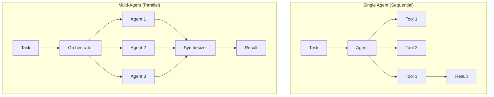
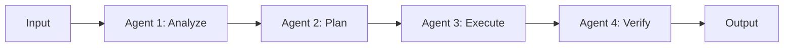
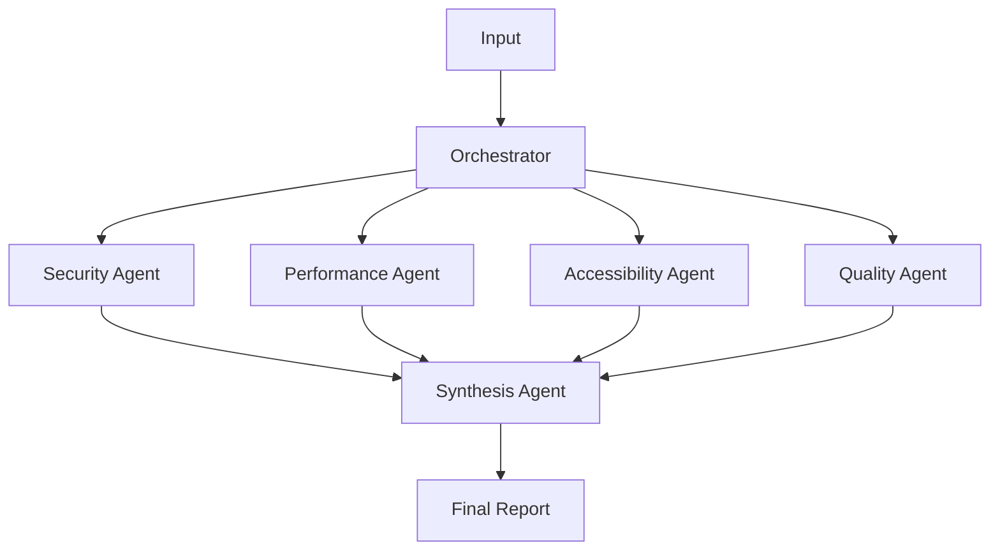
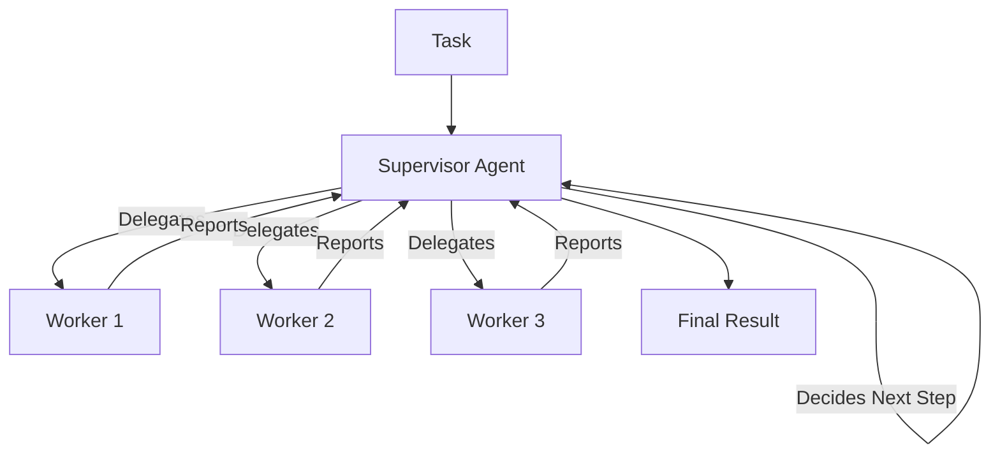
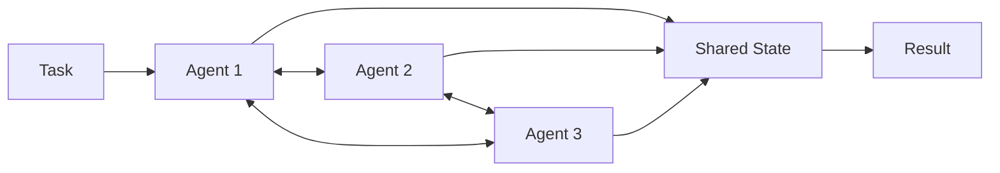

# Multi-Agent Systems for Quality Assurance

## Purpose

Provide comprehensive guidance on designing, building, and deploying multi-agent systems that coordinate multiple specialized AI agents to tackle complex QA workflows requiring diverse expertise, parallel execution, and collaborative decision-making.

## Context

While single agents excel at focused tasks, complex QA workflows often require multiple perspectives (security, performance, accessibility), parallel execution for speed, and hierarchical coordination for adaptive planning. Multi-agent systems transform QA from sequential human-driven reviews to parallel, autonomous, collaborative workflows.

## Prerequisites

- Complete understanding of [Agentic Fundamentals](agentic-fundamentals.md)
- Experience with [Agent Frameworks](agent-frameworks.md)
- Familiarity with [Agentic Testing Workflows](agentic-testing-workflows.md)
- Python async/await patterns
- Basic understanding of distributed systems

## What Are Multi-Agent Systems?

### Single Agent vs Multi-Agent



**Key Differences:**

| Aspect          | Single Agent        | Multi-Agent System       |
| --------------- | ------------------- | ------------------------ |
| **Execution**   | Sequential tool use | Parallel agent execution |
| **Expertise**   | Generalist          | Specialized agents       |
| **Perspective** | Single viewpoint    | Multiple perspectives    |
| **Speed**       | Limited by sequence | Scales with parallelism  |
| **Complexity**  | Simple, predictable | Requires coordination    |
| **Use Case**    | Focused tasks       | Complex workflows        |

### When to Use Multi-Agent Systems

**Use Multi-Agent When:**

- Task requires multiple specialized perspectives (security + performance + accessibility)
- Parallel execution significantly reduces completion time
- Subtasks are independent and can run simultaneously
- Coordination overhead is worth the benefits
- Need consensus from multiple evaluators

**Stick with Single Agent When:**

- Task is focused and well-defined
- Sequential execution is acceptable
- Coordination overhead outweighs benefits
- Single perspective is sufficient
- Simplicity is paramount

---

## Multi-Agent Architecture Patterns

### Pattern 1: Sequential Chain

**Description**: Agents execute in sequence, each using outputs from previous agents.



**Use Case**: Test generation pipeline where each stage depends on previous output.

**Python Implementation:**

```python
# sequential_chain.py

from typing import Dict, Any, List
from dataclasses import dataclass
import asyncio

@dataclass
class AgentResult:
    agent_name: str
    output: Any
    metadata: Dict[str, Any]

class SequentialAgentChain:
    """Execute agents in sequence, passing outputs forward"""

    def __init__(self, agents: List):
        self.agents = agents
        self.execution_log = []

    async def execute(self, initial_input: Dict[str, Any]) -> Dict[str, Any]:
        """Run agents sequentially"""
        current_input = initial_input
        results = []

        for agent in self.agents:
            print(f"\n🤖 Executing {agent.name}...")

            # Execute agent
            result = await agent.run(current_input)

            # Log result
            agent_result = AgentResult(
                agent_name=agent.name,
                output=result,
                metadata={
                    'input': current_input,
                    'timestamp': datetime.now()
                }
            )
            results.append(agent_result)
            self.execution_log.append(agent_result)

            # Pass output to next agent
            current_input = {
                **current_input,
                f"{agent.name}_output": result
            }

        return {
            'final_output': current_input,
            'execution_log': results
        }

# Example: Test Generation Pipeline
class CodeAnalysisAgent:
    name = "CodeAnalysis"

    async def run(self, input_data: Dict) -> Dict:
        """Analyze code to understand what needs testing"""
        code = input_data['code']

        # Use LLM to analyze code
        analysis = await llm.ainvoke(f"""
Analyze this code and identify:
1. Functions/methods to test
2. Edge cases
3. Dependencies
4. Complexity metrics

Code:
{code}
""")

        return {
            'functions': ['validateEmail', 'processPayment'],
            'edge_cases': ['null input', 'empty string', 'invalid format'],
            'complexity': 7,
            'dependencies': ['database', 'payment_gateway']
        }

class TestPlanningAgent:
    name = "TestPlanning"

    async def run(self, input_data: Dict) -> Dict:
        """Create test plan based on code analysis"""
        analysis = input_data['CodeAnalysis_output']

        # Generate test plan
        plan = await llm.ainvoke(f"""
Based on this code analysis, create a comprehensive test plan:

{analysis}

Include:
- Test types (unit, integration, E2E)
- Test cases for each edge case
- Priority ordering
""")

        return {
            'test_types': ['unit', 'integration'],
            'test_cases': [
                {'name': 'test_valid_email', 'priority': 'high'},
                {'name': 'test_invalid_email', 'priority': 'high'},
                {'name': 'test_null_email', 'priority': 'medium'}
            ]
        }

class TestGenerationAgent:
    name = "TestGeneration"

    async def run(self, input_data: Dict) -> Dict:
        """Generate actual test code"""
        plan = input_data['TestPlanning_output']
        code = input_data['code']

        # Generate tests
        tests = []
        for test_case in plan['test_cases']:
            test_code = await llm.ainvoke(f"""
Generate Jest test code for:
Test: {test_case['name']}
Original code: {code}
""")
            tests.append({
                'name': test_case['name'],
                'code': test_code
            })

        return {'tests': tests}

class TestVerificationAgent:
    name = "TestVerification"

    async def run(self, input_data: Dict) -> Dict:
        """Verify generated tests are valid"""
        tests = input_data['TestGeneration_output']['tests']

        # Check each test
        verified = []
        for test in tests:
            # Static analysis of test code
            is_valid = await self.validate_test(test['code'])
            verified.append({
                'name': test['name'],
                'code': test['code'],
                'valid': is_valid
            })

        return {'verified_tests': verified}

    async def validate_test(self, test_code: str) -> bool:
        """Validate test syntax and structure"""
        # Simple validation - could use AST parsing
        required_patterns = ['describe', 'it', 'expect']
        return all(pattern in test_code for pattern in required_patterns)

# Usage
async def main():
    # Create sequential chain
    chain = SequentialAgentChain([
        CodeAnalysisAgent(),
        TestPlanningAgent(),
        TestGenerationAgent(),
        TestVerificationAgent()
    ])

    # Execute
    result = await chain.execute({
        'code': '''
function validateEmail(email) {
    if (!email) return false;
    return /^[^\s@]+@[^\s@]+\.[^\s@]+$/.test(email);
}
'''
    })

    print("\n✅ Test Generation Complete!")
    print(f"Generated {len(result['final_output']['TestGeneration_output']['tests'])} tests")

    # Show execution flow
    for log_entry in result['execution_log']:
        print(f"\n{log_entry.agent_name}:")
        print(f"  Output: {log_entry.output}")

if __name__ == "__main__":
    asyncio.run(main())
```

**Pros:**

- Simple to understand and debug
- Clear data flow
- Deterministic execution order
- Easy to track state between stages

**Cons:**

- No parallelization
- Slow for independent tasks
- Bottlenecked by slowest agent
- Single point of failure in chain

---

### Pattern 2: Parallel Execution

**Description**: Multiple agents run simultaneously, results are synthesized.



**Use Case**: Multi-perspective code review where agents review independently.

**Python Implementation:**

```python
# parallel_execution.py

from typing import List, Dict, Any
import asyncio
from datetime import datetime

class ParallelAgentOrchestrator:
    """Execute multiple agents in parallel and synthesize results"""

    def __init__(self, agents: List, synthesizer):
        self.agents = agents
        self.synthesizer = synthesizer

    async def execute(self, input_data: Dict[str, Any]) -> Dict[str, Any]:
        """Run all agents in parallel"""
        print(f"🚀 Launching {len(self.agents)} agents in parallel...")

        # Execute all agents simultaneously
        tasks = [agent.run(input_data) for agent in self.agents]

        # Wait for all to complete
        start_time = datetime.now()
        results = await asyncio.gather(*tasks, return_exceptions=True)
        end_time = datetime.now()

        # Handle any failures
        agent_results = []
        for agent, result in zip(self.agents, results):
            if isinstance(result, Exception):
                print(f"❌ {agent.name} failed: {result}")
                agent_results.append({
                    'agent': agent.name,
                    'status': 'failed',
                    'error': str(result)
                })
            else:
                print(f"✅ {agent.name} completed")
                agent_results.append({
                    'agent': agent.name,
                    'status': 'success',
                    'result': result
                })

        # Synthesize results
        print("\n🔄 Synthesizing results...")
        synthesis = await self.synthesizer.synthesize(agent_results)

        return {
            'agent_results': agent_results,
            'synthesis': synthesis,
            'execution_time': (end_time - start_time).total_seconds(),
            'agents_run': len(self.agents),
            'agents_succeeded': sum(1 for r in agent_results if r['status'] == 'success')
        }

# Example: Multi-Agent Code Review System

class SecurityReviewAgent:
    name = "Security"

    async def run(self, input_data: Dict) -> Dict:
        """Review code for security vulnerabilities"""
        code = input_data['code']
        pr_diff = input_data.get('pr_diff', '')

        # Simulate LLM call with delay
        await asyncio.sleep(2)  # Realistic API delay

        # Security analysis
        findings = await llm.ainvoke(f"""
Analyze this code for security vulnerabilities:
- SQL injection
- XSS vulnerabilities
- Authentication issues
- OWASP Top 10 violations

Code:
{code}

Provide specific findings with severity (critical/high/medium/low).
""")

        return {
            'findings': [
                {
                    'severity': 'high',
                    'type': 'SQL Injection',
                    'line': 42,
                    'description': 'User input concatenated directly into SQL query',
                    'recommendation': 'Use parameterized queries'
                },
                {
                    'severity': 'medium',
                    'type': 'XSS',
                    'line': 67,
                    'description': 'Unescaped user input rendered in HTML',
                    'recommendation': 'Sanitize input or use framework escaping'
                }
            ],
            'risk_score': 7.5
        }

class PerformanceReviewAgent:
    name = "Performance"

    async def run(self, input_data: Dict) -> Dict:
        """Review code for performance issues"""
        code = input_data['code']

        await asyncio.sleep(1.5)

        findings = await llm.ainvoke(f"""
Analyze this code for performance issues:
- N+1 queries
- Inefficient algorithms
- Memory leaks
- Unnecessary computations

Code:
{code}
""")

        return {
            'findings': [
                {
                    'severity': 'high',
                    'type': 'N+1 Query',
                    'line': 34,
                    'description': 'Loop makes database query on each iteration',
                    'recommendation': 'Use batch query or JOIN'
                },
                {
                    'severity': 'low',
                    'type': 'Inefficient Algorithm',
                    'line': 89,
                    'description': 'Nested loops with O(n²) complexity',
                    'recommendation': 'Use Set for O(n) lookup'
                }
            ],
            'performance_score': 6.0
        }

class AccessibilityReviewAgent:
    name = "Accessibility"

    async def run(self, input_data: Dict) -> Dict:
        """Review code for accessibility compliance"""
        code = input_data['code']

        await asyncio.sleep(1.0)

        findings = await llm.ainvoke(f"""
Analyze this code for WCAG 2.1 compliance:
- Missing ARIA labels
- Color contrast issues
- Keyboard navigation
- Screen reader support

Code:
{code}
""")

        return {
            'findings': [
                {
                    'severity': 'medium',
                    'type': 'Missing ARIA Label',
                    'line': 23,
                    'description': 'Button has no accessible label',
                    'recommendation': 'Add aria-label or visible text'
                }
            ],
            'wcag_level': 'AA',
            'compliance_score': 8.5
        }

class CodeQualityReviewAgent:
    name = "CodeQuality"

    async def run(self, input_data: Dict) -> Dict:
        """Review code quality and best practices"""
        code = input_data['code']

        await asyncio.sleep(1.2)

        findings = await llm.ainvoke(f"""
Review this code for:
- Code style and conventions
- Naming clarity
- Function complexity
- Code duplication
- Best practices

Code:
{code}
""")

        return {
            'findings': [
                {
                    'severity': 'low',
                    'type': 'Function Complexity',
                    'line': 56,
                    'description': 'Function has cyclomatic complexity of 12',
                    'recommendation': 'Extract smaller functions'
                },
                {
                    'severity': 'low',
                    'type': 'Code Duplication',
                    'line': 101,
                    'description': 'Similar logic repeated 3 times',
                    'recommendation': 'Extract common function'
                }
            ],
            'quality_score': 7.8
        }

class SynthesisAgent:
    """Synthesize findings from all review agents"""

    async def synthesize(self, agent_results: List[Dict]) -> Dict:
        """Combine and prioritize findings"""

        # Collect all findings
        all_findings = []
        for result in agent_results:
            if result['status'] == 'success':
                agent_name = result['agent']
                for finding in result['result']['findings']:
                    all_findings.append({
                        **finding,
                        'agent': agent_name
                    })

        # Prioritize by severity
        severity_order = {'critical': 0, 'high': 1, 'medium': 2, 'low': 3}
        all_findings.sort(key=lambda x: severity_order.get(x['severity'], 4))

        # Group by severity
        grouped = {
            'critical': [f for f in all_findings if f['severity'] == 'critical'],
            'high': [f for f in all_findings if f['severity'] == 'high'],
            'medium': [f for f in all_findings if f['severity'] == 'medium'],
            'low': [f for f in all_findings if f['severity'] == 'low']
        }

        # Calculate overall risk
        risk_weights = {'critical': 10, 'high': 5, 'medium': 2, 'low': 1}
        total_risk = sum(
            risk_weights[f['severity']]
            for f in all_findings
        )

        # Generate summary with LLM
        summary = await llm.ainvoke(f"""
Synthesize these code review findings into a concise summary:

Findings:
{all_findings}

Provide:
1. Executive summary (2-3 sentences)
2. Top 3 priority issues
3. Overall recommendation (approve/request changes/reject)
""")

        return {
            'summary': summary,
            'findings_by_severity': grouped,
            'total_findings': len(all_findings),
            'total_risk_score': total_risk,
            'recommendation': 'request_changes' if total_risk > 10 else 'approve'
        }

# Usage
async def main():
    # Create parallel orchestrator
    orchestrator = ParallelAgentOrchestrator(
        agents=[
            SecurityReviewAgent(),
            PerformanceReviewAgent(),
            AccessibilityReviewAgent(),
            CodeQualityReviewAgent()
        ],
        synthesizer=SynthesisAgent()
    )

    # Execute review
    code = """
function processUserData(userId) {
    const query = "SELECT * FROM users WHERE id = " + userId;
    const result = db.execute(query);

    for (let i = 0; i < result.length; i++) {
        const orders = db.execute("SELECT * FROM orders WHERE user_id = " + result[i].id);
        result[i].orders = orders;
    }

    return result;
}
"""

    result = await orchestrator.execute({'code': code})

    print("\n📊 Review Results:")
    print(f"Execution time: {result['execution_time']:.2f}s")
    print(f"Agents run: {result['agents_run']}")
    print(f"Succeeded: {result['agents_succeeded']}")
    print(f"\nTotal findings: {result['synthesis']['total_findings']}")
    print(f"Risk score: {result['synthesis']['total_risk_score']}")
    print(f"Recommendation: {result['synthesis']['recommendation']}")

    print("\n🔍 Findings by Severity:")
    for severity, findings in result['synthesis']['findings_by_severity'].items():
        if findings:
            print(f"\n{severity.upper()} ({len(findings)}):")
            for finding in findings[:2]:  # Show first 2
                print(f"  - [{finding['agent']}] {finding['description']}")

if __name__ == "__main__":
    asyncio.run(main())
```

**Pros:**

- Fast - parallelism reduces total time
- Multiple perspectives captured
- Agents work independently
- Scalable - add more agents easily

**Cons:**

- Requires async infrastructure
- More complex error handling
- Synthesis logic needed
- Higher resource usage

**Performance Comparison:**

```
Sequential execution: 5.7s (2 + 1.5 + 1 + 1.2)
Parallel execution: 2.0s (max of [2, 1.5, 1, 1.2])
Speedup: 2.85x
```

---

### Pattern 3: Hierarchical (Supervisor-Worker)

**Description**: Supervisor agent coordinates worker agents, delegates tasks dynamically.



**Use Case**: Incident response where supervisor decides which specialists to engage.

**LangGraph Implementation:**

```python
# hierarchical_supervisor.py

from langgraph.graph import StateGraph, END
from langgraph.prebuilt import create_react_agent
from langchain_openai import ChatOpenAI
from langchain_core.messages import HumanMessage, AIMessage, SystemMessage
from typing import TypedDict, Annotated, Sequence
import operator

# Define state
class SupervisorState(TypedDict):
    messages: Annotated[Sequence[HumanMessage | AIMessage], operator.add]
    task: str
    plan: str
    worker_results: dict
    next_worker: str
    is_complete: bool

# Worker agents
class LogAnalysisWorker:
    """Analyzes logs to find root cause"""

    def __init__(self, llm):
        self.llm = llm
        self.name = "log_analyst"

    async def run(self, task: str, context: dict) -> str:
        """Analyze logs"""
        prompt = f"""
You are a log analysis expert. Analyze these logs to find the root cause:

Task: {task}
Logs: {context.get('logs', 'No logs provided')}

Provide:
1. Identified patterns
2. Potential root cause
3. Confidence level
"""
        result = await self.llm.ainvoke([HumanMessage(content=prompt)])
        return result.content

class DatabaseWorker:
    """Investigates database issues"""

    def __init__(self, llm):
        self.llm = llm
        self.name = "database_specialist"

    async def run(self, task: str, context: dict) -> str:
        """Analyze database"""
        prompt = f"""
You are a database expert. Investigate this database issue:

Task: {task}
Context: {context}

Check:
1. Query performance
2. Connection pool status
3. Lock contention
4. Disk space
"""
        result = await self.llm.ainvoke([HumanMessage(content=prompt)])
        return result.content

class NetworkWorker:
    """Investigates network issues"""

    def __init__(self, llm):
        self.llm = llm
        self.name = "network_specialist"

    async def run(self, task: str, context: dict) -> str:
        """Analyze network"""
        prompt = f"""
You are a network expert. Investigate this network issue:

Task: {task}
Context: {context}

Check:
1. Latency patterns
2. Packet loss
3. DNS resolution
4. Load balancer health
"""
        result = await self.llm.ainvoke([HumanMessage(content=prompt)])
        return result.content

class SupervisorAgent:
    """Supervisor that delegates to workers"""

    def __init__(self, llm, workers):
        self.llm = llm
        self.workers = {w.name: w for w in workers}
        self.worker_names = list(self.workers.keys())

    async def plan(self, state: SupervisorState) -> SupervisorState:
        """Create investigation plan"""

        prompt = f"""
You are a supervisor coordinating an incident response team.

Incident: {state['task']}

Available specialists:
{', '.join(self.worker_names)}

Create a plan:
1. Which specialist should investigate first?
2. What should they focus on?
3. What information do we need?

Respond with JSON:
{{
    "next_worker": "worker_name",
    "investigation_focus": "what to investigate",
    "reasoning": "why this specialist"
}}
"""

        result = await self.llm.ainvoke([HumanMessage(content=prompt)])

        # Parse response (simplified - would use JSON parsing)
        import json
        try:
            plan = json.loads(result.content)
            state['next_worker'] = plan['next_worker']
            state['plan'] = plan['investigation_focus']
        except:
            # Fallback
            state['next_worker'] = self.worker_names[0]
            state['plan'] = state['task']

        return state

    async def delegate(self, state: SupervisorState) -> SupervisorState:
        """Delegate task to selected worker"""

        worker_name = state['next_worker']
        worker = self.workers.get(worker_name)

        if not worker:
            state['is_complete'] = True
            return state

        # Execute worker
        print(f"\n🔧 Delegating to {worker_name}...")
        result = await worker.run(state['plan'], state['worker_results'])

        # Store result
        state['worker_results'][worker_name] = result

        return state

    async def evaluate(self, state: SupervisorState) -> SupervisorState:
        """Evaluate if investigation is complete"""

        prompt = f"""
You are supervising an incident investigation.

Incident: {state['task']}

Worker results so far:
{state['worker_results']}

Questions:
1. Have we identified the root cause?
2. Do we need more investigation?
3. Which specialist should we consult next (if any)?

Respond with JSON:
{{
    "is_complete": true/false,
    "root_cause_found": true/false,
    "next_worker": "worker_name or null",
    "confidence": 0-100
}}
"""

        result = await self.llm.ainvoke([HumanMessage(content=prompt)])

        import json
        try:
            evaluation = json.loads(result.content)
            state['is_complete'] = evaluation['is_complete']
            if not state['is_complete'] and evaluation['next_worker']:
                state['next_worker'] = evaluation['next_worker']
        except:
            # After 3 workers, stop
            state['is_complete'] = len(state['worker_results']) >= 3

        return state

# Build LangGraph workflow
def build_supervisor_workflow():
    llm = ChatOpenAI(model="gpt-4", temperature=0)

    # Create workers
    workers = [
        LogAnalysisWorker(llm),
        DatabaseWorker(llm),
        NetworkWorker(llm)
    ]

    # Create supervisor
    supervisor = SupervisorAgent(llm, workers)

    # Build graph
    workflow = StateGraph(SupervisorState)

    # Add nodes
    workflow.add_node("plan", supervisor.plan)
    workflow.add_node("delegate", supervisor.delegate)
    workflow.add_node("evaluate", supervisor.evaluate)

    # Add edges
    workflow.set_entry_point("plan")
    workflow.add_edge("plan", "delegate")
    workflow.add_edge("delegate", "evaluate")

    # Conditional edge: continue or finish
    workflow.add_conditional_edges(
        "evaluate",
        lambda state: "plan" if not state["is_complete"] else END,
        {
            "plan": "plan",
            END: END
        }
    )

    return workflow.compile()

# Usage
async def main():
    # Build workflow
    app = build_supervisor_workflow()

    # Run investigation
    initial_state = {
        "messages": [],
        "task": "API latency spiked to 5s, 500 errors increasing",
        "plan": "",
        "worker_results": {},
        "next_worker": "",
        "is_complete": False
    }

    print("🚨 Starting incident investigation...")

    result = await app.ainvoke(initial_state)

    print("\n✅ Investigation Complete!")
    print(f"\nWorkers consulted: {', '.join(result['worker_results'].keys())}")
    print(f"\nFindings:")
    for worker, finding in result['worker_results'].items():
        print(f"\n{worker}:")
        print(f"  {finding[:200]}...")

if __name__ == "__main__":
    import asyncio
    asyncio.run(main())
```

**Pros:**

- Adaptive - supervisor decides based on context
- Efficient - only engages needed specialists
- Handles complex, multi-step workflows
- Clear coordination logic

**Cons:**

- Supervisor can be bottleneck
- More LLM calls (higher cost)
- Complex state management
- Harder to debug

---

### Pattern 4: Peer-to-Peer Collaboration

**Description**: Agents communicate directly, collaborate on shared task.



**Use Case**: Collaborative test design where agents build on each other's suggestions.

**Python Implementation:**

```python
# peer_collaboration.py

from typing import Dict, List, Any
import asyncio

class SharedWorkspace:
    """Shared state that all agents can read/write"""

    def __init__(self):
        self.state = {
            'test_cases': [],
            'edge_cases': set(),
            'coverage_gaps': [],
            'suggestions': []
        }
        self.lock = asyncio.Lock()

    async def add_test_case(self, test_case: Dict):
        """Add test case to shared workspace"""
        async with self.lock:
            self.state['test_cases'].append(test_case)

    async def add_edge_case(self, edge_case: str):
        """Add edge case to shared set"""
        async with self.lock:
            self.state['edge_cases'].add(edge_case)

    async def add_suggestion(self, agent_name: str, suggestion: Dict):
        """Add suggestion from agent"""
        async with self.lock:
            self.state['suggestions'].append({
                'agent': agent_name,
                **suggestion
            })

    async def get_state(self) -> Dict:
        """Get current state"""
        async with self.lock:
            return self.state.copy()

class CollaborativeAgent:
    """Base class for collaborative agents"""

    def __init__(self, name: str, workspace: SharedWorkspace, llm):
        self.name = name
        self.workspace = workspace
        self.llm = llm

    async def observe(self) -> Dict:
        """Observe current shared state"""
        return await self.workspace.get_state()

    async def contribute(self, input_data: Dict):
        """Make contribution based on current state"""
        raise NotImplementedError

class UnitTestAgent(CollaborativeAgent):
    """Focuses on unit test generation"""

    async def contribute(self, input_data: Dict):
        """Generate unit tests"""
        code = input_data['code']
        state = await self.observe()

        # See what others have contributed
        existing_tests = state['test_cases']
        existing_edge_cases = state['edge_cases']

        prompt = f"""
You are a unit test specialist.

Code to test:
{code}

Existing tests from team:
{existing_tests}

Edge cases identified:
{existing_edge_cases}

Contribute:
1. New unit test cases not yet covered
2. Additional edge cases
3. Suggestions to improve existing tests

Focus on: function-level testing, mocking dependencies
"""

        result = await self.llm.ainvoke(prompt)

        # Parse and add contributions
        # (Simplified - would parse structured output)
        await self.workspace.add_test_case({
            'type': 'unit',
            'agent': self.name,
            'description': 'Unit tests for core functions',
            'tests': ['test_valid_input', 'test_null_input', 'test_boundary_values']
        })

        await self.workspace.add_edge_case('negative numbers')
        await self.workspace.add_edge_case('maximum integer value')

        print(f"✅ {self.name} contributed unit tests")

class IntegrationTestAgent(CollaborativeAgent):
    """Focuses on integration testing"""

    async def contribute(self, input_data: Dict):
        """Generate integration tests"""
        code = input_data['code']
        state = await self.observe()

        prompt = f"""
You are an integration test specialist.

Code:
{code}

Current test coverage:
{state['test_cases']}

Contribute:
1. Integration test scenarios
2. API contract tests
3. Database integration tests

Focus on: component interactions, external dependencies
"""

        result = await self.llm.ainvoke(prompt)

        await self.workspace.add_test_case({
            'type': 'integration',
            'agent': self.name,
            'description': 'Integration tests for API and database',
            'tests': ['test_api_endpoint', 'test_database_transaction']
        })

        await self.workspace.add_edge_case('database connection failure')
        await self.workspace.add_edge_case('API timeout')

        print(f"✅ {self.name} contributed integration tests")

class E2ETestAgent(CollaborativeAgent):
    """Focuses on end-to-end testing"""

    async def contribute(self, input_data: Dict):
        """Generate E2E tests"""
        code = input_data['code']
        state = await self.observe()

        prompt = f"""
You are an E2E test specialist.

Feature code:
{code}

Existing coverage:
{state['test_cases']}

Contribute:
1. User journey tests
2. Critical path scenarios
3. Cross-browser tests

Focus on: complete user workflows, UI interactions
"""

        result = await self.llm.ainvoke(prompt)

        await self.workspace.add_test_case({
            'type': 'e2e',
            'agent': self.name,
            'description': 'E2E tests for user journeys',
            'tests': ['test_user_signup_flow', 'test_checkout_process']
        })

        await self.workspace.add_suggestion(self.name, {
            'type': 'coverage_gap',
            'description': 'Mobile browser testing not covered'
        })

        print(f"✅ {self.name} contributed E2E tests")

class TestReviewAgent(CollaborativeAgent):
    """Reviews and improves test suite"""

    async def contribute(self, input_data: Dict):
        """Review all contributions"""
        state = await self.observe()

        prompt = f"""
You are a test review specialist.

Review this collaborative test suite:

Test cases:
{state['test_cases']}

Edge cases:
{state['edge_cases']}

Suggestions:
{state['suggestions']}

Provide:
1. Coverage gaps
2. Redundant tests
3. Missing scenarios
4. Quality improvements
"""

        result = await self.llm.ainvoke(prompt)

        # Add review feedback
        for gap in ['error handling tests', 'performance tests']:
            await self.workspace.add_suggestion(self.name, {
                'type': 'coverage_gap',
                'description': gap
            })

        print(f"✅ {self.name} completed review")

# Orchestrator
class PeerCollaborationOrchestrator:
    """Coordinates peer collaboration"""

    def __init__(self, agents: List[CollaborativeAgent]):
        self.agents = agents

    async def run_collaborative_session(
        self,
        input_data: Dict,
        rounds: int = 2
    ) -> Dict:
        """Run multiple rounds of collaboration"""

        for round_num in range(rounds):
            print(f"\n🔄 Round {round_num + 1}")

            # All agents contribute in parallel
            tasks = [agent.contribute(input_data) for agent in self.agents]
            await asyncio.gather(*tasks)

            # Brief pause between rounds
            await asyncio.sleep(0.5)

        # Get final state
        final_state = await self.agents[0].workspace.get_state()

        return final_state

# Usage
async def main():
    llm = ChatOpenAI(model="gpt-4", temperature=0.3)

    # Create shared workspace
    workspace = SharedWorkspace()

    # Create collaborative agents
    agents = [
        UnitTestAgent("UnitTester", workspace, llm),
        IntegrationTestAgent("IntegrationTester", workspace, llm),
        E2ETestAgent("E2ETester", workspace, llm),
        TestReviewAgent("TestReviewer", workspace, llm)
    ]

    # Create orchestrator
    orchestrator = PeerCollaborationOrchestrator(agents)

    # Run collaboration
    code = """
class PaymentProcessor {
    async processPayment(userId, amount, paymentMethod) {
        // Validate user
        const user = await db.getUser(userId);
        if (!user) throw new Error('User not found');

        // Process payment
        const result = await paymentGateway.charge(
            paymentMethod,
            amount
        );

        if (result.success) {
            await db.createTransaction(userId, amount);
            await sendConfirmationEmail(user.email);
        }

        return result;
    }
}
"""

    result = await orchestrator.run_collaborative_session(
        {'code': code},
        rounds=2
    )

    print("\n📊 Collaborative Test Suite Results:")
    print(f"\nTotal test cases: {len(result['test_cases'])}")
    print(f"Edge cases identified: {len(result['edge_cases'])}")
    print(f"Suggestions made: {len(result['suggestions'])}")

    print("\n📝 Test Cases:")
    for tc in result['test_cases']:
        print(f"  [{tc['type']}] {tc['description']}")

    print("\n🎯 Edge Cases:")
    for ec in list(result['edge_cases'])[:5]:
        print(f"  - {ec}")

    print("\n💡 Suggestions:")
    for sug in result['suggestions']:
        print(f"  - [{sug['agent']}] {sug['description']}")

if __name__ == "__main__":
    asyncio.run(main())
```

**Pros:**

- Truly collaborative - agents build on each other
- Creative synergy - combined intelligence
- Flexible - no rigid structure
- Iterative improvement

**Cons:**

- Complex coordination
- Potential conflicts
- State management critical
- Harder to ensure convergence

---

## Agent Communication Patterns

### Message Passing

**Direct message exchange between agents:**

```python
# message_passing.py

from typing import List, Dict, Any
from dataclasses import dataclass
from enum import Enum
import asyncio

class MessageType(Enum):
    REQUEST = "request"
    RESPONSE = "response"
    BROADCAST = "broadcast"
    NOTIFICATION = "notification"

@dataclass
class Message:
    from_agent: str
    to_agent: str
    message_type: MessageType
    content: Any
    thread_id: str

class MessageBus:
    """Central message bus for agent communication"""

    def __init__(self):
        self.mailboxes = {}
        self.lock = asyncio.Lock()

    def register_agent(self, agent_name: str):
        """Register agent to receive messages"""
        self.mailboxes[agent_name] = asyncio.Queue()

    async def send(self, message: Message):
        """Send message to specific agent"""
        async with self.lock:
            if message.to_agent in self.mailboxes:
                await self.mailboxes[message.to_agent].put(message)

    async def broadcast(self, message: Message):
        """Send message to all agents"""
        async with self.lock:
            for mailbox in self.mailboxes.values():
                await mailbox.put(message)

    async def receive(self, agent_name: str, timeout: float = None) -> Message:
        """Receive message for agent"""
        mailbox = self.mailboxes.get(agent_name)
        if not mailbox:
            return None

        try:
            if timeout:
                return await asyncio.wait_for(
                    mailbox.get(),
                    timeout=timeout
                )
            else:
                return await mailbox.get()
        except asyncio.TimeoutError:
            return None

class MessagingAgent:
    """Agent that communicates via messages"""

    def __init__(self, name: str, bus: MessageBus):
        self.name = name
        self.bus = bus
        self.bus.register_agent(name)
        self.running = False

    async def send_request(
        self,
        to_agent: str,
        content: Any,
        thread_id: str
    ):
        """Send request to another agent"""
        message = Message(
            from_agent=self.name,
            to_agent=to_agent,
            message_type=MessageType.REQUEST,
            content=content,
            thread_id=thread_id
        )
        await self.bus.send(message)

    async def send_response(
        self,
        to_agent: str,
        content: Any,
        thread_id: str
    ):
        """Send response to requesting agent"""
        message = Message(
            from_agent=self.name,
            to_agent=to_agent,
            message_type=MessageType.RESPONSE,
            content=content,
            thread_id=thread_id
        )
        await self.bus.send(message)

    async def broadcast(self, content: Any, thread_id: str):
        """Broadcast to all agents"""
        message = Message(
            from_agent=self.name,
            to_agent="*",
            message_type=MessageType.BROADCAST,
            content=content,
            thread_id=thread_id
        )
        await self.bus.broadcast(message)

    async def listen(self):
        """Listen for messages"""
        self.running = True
        while self.running:
            message = await self.bus.receive(self.name, timeout=1.0)
            if message:
                await self.handle_message(message)

    async def handle_message(self, message: Message):
        """Override to handle incoming messages"""
        raise NotImplementedError

    def stop(self):
        """Stop listening"""
        self.running = False

# Example: Test coordination via messages
class TestCoordinatorAgent(MessagingAgent):
    """Coordinates test execution via messages"""

    async def run_tests(self, test_suite: str):
        """Request test execution"""
        thread_id = f"test-{uuid.uuid4()}"

        # Request unit tests
        await self.send_request(
            "unit_runner",
            {"action": "run", "suite": test_suite},
            thread_id
        )

        # Request E2E tests
        await self.send_request(
            "e2e_runner",
            {"action": "run", "suite": test_suite},
            thread_id
        )

        print(f"✅ Test requests sent (thread: {thread_id})")

    async def handle_message(self, message: Message):
        """Handle test results"""
        if message.message_type == MessageType.RESPONSE:
            print(f"📬 Received results from {message.from_agent}")
            print(f"  Results: {message.content}")

class UnitTestRunner(MessagingAgent):
    """Executes unit tests"""

    async def handle_message(self, message: Message):
        """Handle test requests"""
        if message.message_type == MessageType.REQUEST:
            if message.content.get('action') == 'run':
                print(f"🧪 Running unit tests...")
                await asyncio.sleep(1)  # Simulate test execution

                # Send results back
                await self.send_response(
                    message.from_agent,
                    {
                        "status": "passed",
                        "tests_run": 42,
                        "duration": "1.2s"
                    },
                    message.thread_id
                )

# Usage
async def main():
    bus = MessageBus()

    coordinator = TestCoordinatorAgent("coordinator", bus)
    unit_runner = UnitTestRunner("unit_runner", bus)

    # Start listeners
    asyncio.create_task(coordinator.listen())
    asyncio.create_task(unit_runner.listen())

    # Run tests
    await coordinator.run_tests("payment-service")

    # Wait for results
    await asyncio.sleep(2)

    # Cleanup
    coordinator.stop()
    unit_runner.stop()

if __name__ == "__main__":
    import uuid
    asyncio.run(main())
```

### Shared State

**Agents collaborate via shared memory:**

```python
# shared_state.py

from typing import Dict, Any, List
import asyncio
from dataclasses import dataclass, field
from datetime import datetime

@dataclass
class SharedTestState:
    """Shared state for test generation"""
    code_under_test: str
    test_cases: List[Dict] = field(default_factory=list)
    coverage_data: Dict = field(default_factory=dict)
    test_results: List[Dict] = field(default_factory=list)
    lock: asyncio.Lock = field(default_factory=asyncio.Lock)

    async def add_test_case(self, test_case: Dict):
        """Thread-safe add test case"""
        async with self.lock:
            self.test_cases.append({
                **test_case,
                'added_at': datetime.now()
            })

    async def update_coverage(self, coverage: Dict):
        """Update coverage data"""
        async with self.lock:
            self.coverage_data.update(coverage)

    async def add_result(self, result: Dict):
        """Add test result"""
        async with self.lock:
            self.test_results.append(result)

class SharedStateAgent:
    """Agent that works with shared state"""

    def __init__(self, name: str, shared_state: SharedTestState):
        self.name = name
        self.state = shared_state

    async def work(self):
        """Override to implement agent logic"""
        raise NotImplementedError
```

### Event-Driven Coordination

**Agents react to events:**

```python
# event_driven.py

from typing import Callable, Dict, Any
import asyncio
from dataclasses import dataclass
from enum import Enum

class EventType(Enum):
    TEST_GENERATED = "test_generated"
    TEST_EXECUTED = "test_executed"
    TEST_FAILED = "test_failed"
    COVERAGE_UPDATED = "coverage_updated"

@dataclass
class Event:
    event_type: EventType
    source_agent: str
    data: Any
    timestamp: datetime

class EventBus:
    """Publish-subscribe event bus"""

    def __init__(self):
        self.subscribers = {}

    def subscribe(self, event_type: EventType, handler: Callable):
        """Subscribe to event type"""
        if event_type not in self.subscribers:
            self.subscribers[event_type] = []
        self.subscribers[event_type].append(handler)

    async def publish(self, event: Event):
        """Publish event to subscribers"""
        handlers = self.subscribers.get(event.event_type, [])

        # Call all handlers concurrently
        await asyncio.gather(*[
            handler(event) for handler in handlers
        ])

class EventDrivenAgent:
    """Agent that reacts to events"""

    def __init__(self, name: str, event_bus: EventBus):
        self.name = name
        self.event_bus = event_bus
        self.register_handlers()

    def register_handlers(self):
        """Register event handlers"""
        # Override to subscribe to events
        pass

    async def emit_event(self, event_type: EventType, data: Any):
        """Emit an event"""
        event = Event(
            event_type=event_type,
            source_agent=self.name,
            data=data,
            timestamp=datetime.now()
        )
        await self.event_bus.publish(event)

# Example: Self-healing test suite
class TestGeneratorAgent(EventDrivenAgent):
    """Generates tests and emits events"""

    async def generate_test(self, function_name: str):
        """Generate test and emit event"""
        test = {
            'name': f'test_{function_name}',
            'code': f'it("should test {function_name}", () => {{ ... }})'
        }

        await self.emit_event(EventType.TEST_GENERATED, test)
        return test

class TestExecutorAgent(EventDrivenAgent):
    """Executes tests when generated"""

    def register_handlers(self):
        self.event_bus.subscribe(
            EventType.TEST_GENERATED,
            self.handle_test_generated
        )

    async def handle_test_generated(self, event: Event):
        """Execute newly generated test"""
        test = event.data
        print(f"🧪 Executing {test['name']}...")

        # Simulate execution
        await asyncio.sleep(0.5)

        # Emit result
        await self.emit_event(EventType.TEST_EXECUTED, {
            'test': test,
            'status': 'passed'
        })

class CoverageTrackerAgent(EventDrivenAgent):
    """Tracks coverage when tests execute"""

    def register_handlers(self):
        self.event_bus.subscribe(
            EventType.TEST_EXECUTED,
            self.handle_test_executed
        )

    async def handle_test_executed(self, event: Event):
        """Update coverage data"""
        test = event.data['test']
        print(f"📊 Updating coverage for {test['name']}")

        # Emit coverage update
        await self.emit_event(EventType.COVERAGE_UPDATED, {
            'coverage': 85.5
        })

# Usage
async def main():
    event_bus = EventBus()

    generator = TestGeneratorAgent("generator", event_bus)
    executor = TestExecutorAgent("executor", event_bus)
    tracker = CoverageTrackerAgent("tracker", event_bus)

    # Generate test (triggers chain of events)
    await generator.generate_test("validateEmail")

    await asyncio.sleep(1)

if __name__ == "__main__":
    from datetime import datetime
    asyncio.run(main())
```

---

## Agent Specialization

### When to Create Specialized Agents

**Create specialized agents when:**

1. **Domain Expertise Required**
   - Security vulnerabilities need security expert
   - Performance optimization needs performance specialist
   - Different knowledge/tools needed

2. **Clear Separation of Concerns**
   - Test generation vs test execution
   - Analysis vs remediation
   - Planning vs implementation

3. **Parallel Execution Possible**
   - Independent evaluations (security + performance)
   - Can run simultaneously
   - No dependencies between agents

4. **Reusability Across Workflows**
   - Same agent useful in multiple workflows
   - Can be composed differently
   - Modular design benefits

**Avoid over-specialization when:**

- Task is simple enough for single agent
- Coordination overhead exceeds benefits
- Agents would share 90%+ of logic
- No clear benefit to separation

### Role Design

```python
# agent_roles.py

from typing import List, Dict, Any
from langchain_openai import ChatOpenAI
from langchain_core.tools import tool

class AgentRole:
    """Base class for agent roles"""

    def __init__(self, name: str, description: str, tools: List, llm):
        self.name = name
        self.description = description
        self.tools = {t.name: t for t in tools}
        self.llm = llm
        self.system_prompt = self._build_system_prompt()

    def _build_system_prompt(self) -> str:
        """Build role-specific system prompt"""
        tools_desc = "\n".join([
            f"- {t.name}: {t.description}"
            for t in self.tools.values()
        ])

        return f"""
You are a {self.name} agent.

Role: {self.description}

Available tools:
{tools_desc}

Guidelines:
- Focus on your specialized domain
- Use tools appropriate to your role
- Collaborate with other agents when needed
- Provide specific, actionable findings
"""

# Define specialized roles

class SecurityReviewerRole(AgentRole):
    """Security-focused reviewer"""

    def __init__(self, llm):
        @tool
        def scan_for_sql_injection(code: str) -> List[str]:
            """Scan code for SQL injection vulnerabilities"""
            # Static analysis logic
            return []

        @tool
        def check_owasp_top10(code: str) -> Dict:
            """Check against OWASP Top 10"""
            return {}

        super().__init__(
            name="Security Reviewer",
            description="Expert in application security, OWASP, and vulnerability detection",
            tools=[scan_for_sql_injection, check_owasp_top10],
            llm=llm
        )

class PerformanceReviewerRole(AgentRole):
    """Performance-focused reviewer"""

    def __init__(self, llm):
        @tool
        def detect_n_plus_one(code: str) -> List[str]:
            """Detect N+1 query patterns"""
            return []

        @tool
        def analyze_complexity(code: str) -> Dict:
            """Analyze algorithmic complexity"""
            return {}

        super().__init__(
            name="Performance Reviewer",
            description="Expert in performance optimization, algorithms, and scalability",
            tools=[detect_n_plus_one, analyze_complexity],
            llm=llm
        )
```

### Capability Mapping

```yaml
agent_specializations:
  security_agent:
    domain: Application Security
    capabilities:
      - SQL injection detection
      - XSS vulnerability scanning
      - Authentication review
      - OWASP Top 10 checking
    tools:
      - semgrep (SAST)
      - bandit (Python security)
      - npm audit (dependencies)
    output: Security findings with severity

  performance_agent:
    domain: Performance & Scalability
    capabilities:
      - N+1 query detection
      - Algorithm complexity analysis
      - Memory leak identification
      - Database query optimization
    tools:
      - query analyzer
      - profiler
      - complexity calculator
    output: Performance recommendations

  accessibility_agent:
    domain: Web Accessibility
    capabilities:
      - WCAG 2.1 compliance
      - ARIA label validation
      - Keyboard navigation
      - Screen reader compatibility
    tools:
      - axe-core
      - pa11y
      - WAVE API
    output: Accessibility violations

  test_generation_agent:
    domain: Test Automation
    capabilities:
      - Unit test generation
      - E2E test creation
      - Test data synthesis
      - Coverage analysis
    tools:
      - AST parser
      - coverage reporter
      - faker (test data)
    output: Test code
```

---

## Consensus & Conflict Resolution

### Voting Mechanisms

```python
# consensus.py

from typing import List, Dict, Any
from enum import Enum
from collections import Counter

class VoteType(Enum):
    APPROVE = "approve"
    REQUEST_CHANGES = "request_changes"
    REJECT = "reject"

class VotingCoordinator:
    """Coordinate voting among agents"""

    def __init__(self, threshold: float = 0.6):
        self.threshold = threshold

    def simple_majority(self, votes: List[VoteType]) -> VoteType:
        """Simple majority voting"""
        count = Counter(votes)
        return count.most_common(1)[0][0]

    def weighted_voting(
        self,
        votes: List[Dict[str, Any]]  # {agent: str, vote: VoteType, weight: float}
    ) -> VoteType:
        """Weighted voting by agent expertise"""
        weighted_scores = {
            VoteType.APPROVE: 0,
            VoteType.REQUEST_CHANGES: 0,
            VoteType.REJECT: 0
        }

        total_weight = sum(v['weight'] for v in votes)

        for vote_data in votes:
            weighted_scores[vote_data['vote']] += vote_data['weight']

        # Normalize
        for vote_type in weighted_scores:
            weighted_scores[vote_type] /= total_weight

        # Return highest weighted vote
        return max(weighted_scores, key=weighted_scores.get)

    def consensus_required(
        self,
        votes: List[VoteType],
        required_agreement: float = None
    ) -> tuple[bool, VoteType]:
        """Check if consensus reached"""
        required_agreement = required_agreement or self.threshold

        count = Counter(votes)
        total = len(votes)

        for vote_type, vote_count in count.items():
            if vote_count / total >= required_agreement:
                return (True, vote_type)

        return (False, None)

    def veto_system(
        self,
        votes: List[Dict[str, Any]],  # {agent: str, vote: VoteType, can_veto: bool}
    ) -> VoteType:
        """Allow specific agents to veto"""
        # Check for vetoes
        for vote_data in votes:
            if vote_data.get('can_veto') and vote_data['vote'] == VoteType.REJECT:
                return VoteType.REJECT

        # No veto, use simple majority
        return self.simple_majority([v['vote'] for v in votes])

# Example: Code review approval
class CodeReviewVoting:
    """Voting system for code review"""

    def __init__(self):
        self.coordinator = VotingCoordinator(threshold=0.7)

    async def review_code(self, code: str, agents: List) -> Dict:
        """Get votes from all agents"""
        votes = []

        for agent in agents:
            review = await agent.review(code)

            # Determine vote based on findings
            if review['critical_issues'] > 0:
                vote = VoteType.REJECT
            elif review['high_issues'] > 0:
                vote = VoteType.REQUEST_CHANGES
            else:
                vote = VoteType.APPROVE

            votes.append({
                'agent': agent.name,
                'vote': vote,
                'weight': agent.expertise_weight,
                'can_veto': agent.can_veto,
                'findings': review
            })

        # Determine outcome
        decision = self.coordinator.veto_system(votes)
        consensus, consensus_vote = self.coordinator.consensus_required(
            [v['vote'] for v in votes]
        )

        return {
            'decision': decision,
            'consensus_reached': consensus,
            'votes': votes,
            'vote_summary': Counter([v['vote'] for v in votes])
        }
```

### Weighted Decisions

```python
# weighted_decisions.py

class ExpertiseWeighting:
    """Assign weights based on agent expertise"""

    WEIGHTS = {
        'security': {
            'security_agent': 1.0,
            'code_quality_agent': 0.3,
            'performance_agent': 0.1
        },
        'performance': {
            'performance_agent': 1.0,
            'code_quality_agent': 0.4,
            'security_agent': 0.2
        },
        'accessibility': {
            'accessibility_agent': 1.0,
            'code_quality_agent': 0.2
        }
    }

    def get_weight(self, domain: str, agent_name: str) -> float:
        """Get agent weight for specific domain"""
        return self.WEIGHTS.get(domain, {}).get(agent_name, 0.5)

    def weighted_score(
        self,
        scores: List[Dict],  # {agent: str, domain: str, score: float}
    ) -> float:
        """Calculate weighted average score"""
        total_weight = 0
        weighted_sum = 0

        for score_data in scores:
            weight = self.get_weight(
                score_data['domain'],
                score_data['agent']
            )
            weighted_sum += score_data['score'] * weight
            total_weight += weight

        return weighted_sum / total_weight if total_weight > 0 else 0
```

### Conflict Handling

```python
# conflict_resolution.py

class ConflictResolver:
    """Resolve conflicts between agent recommendations"""

    def __init__(self, llm):
        self.llm = llm

    async def resolve_conflict(
        self,
        conflicting_recommendations: List[Dict]
    ) -> Dict:
        """Resolve conflicting recommendations"""

        # If recommendations don't actually conflict, return all
        if not self._has_conflict(conflicting_recommendations):
            return {
                'resolution': 'no_conflict',
                'recommendations': conflicting_recommendations
            }

        # Try automatic resolution
        auto_resolution = self._auto_resolve(conflicting_recommendations)
        if auto_resolution:
            return auto_resolution

        # Escalate to LLM for mediation
        llm_resolution = await self._llm_mediation(conflicting_recommendations)
        return llm_resolution

    def _has_conflict(self, recommendations: List[Dict]) -> bool:
        """Check if recommendations actually conflict"""
        # Simplified - would check for incompatible changes
        priorities = [r.get('priority') for r in recommendations]
        return len(set(priorities)) > 1

    def _auto_resolve(self, recommendations: List[Dict]) -> Dict:
        """Automatic conflict resolution rules"""

        # Rule 1: Security always wins
        security_recs = [r for r in recommendations if r.get('domain') == 'security']
        if security_recs:
            return {
                'resolution': 'security_priority',
                'chosen': security_recs[0],
                'reason': 'Security concerns take precedence'
            }

        # Rule 2: Higher severity wins
        sorted_by_severity = sorted(
            recommendations,
            key=lambda r: {'critical': 0, 'high': 1, 'medium': 2, 'low': 3}.get(r.get('severity'), 4)
        )
        if sorted_by_severity[0]['severity'] == 'critical':
            return {
                'resolution': 'severity_priority',
                'chosen': sorted_by_severity[0],
                'reason': 'Critical severity takes precedence'
            }

        return None

    async def _llm_mediation(self, recommendations: List[Dict]) -> Dict:
        """Use LLM to mediate conflict"""

        prompt = f"""
You are mediating a conflict between agent recommendations:

{recommendations}

Analyze:
1. Are these recommendations truly incompatible?
2. Can they be combined?
3. Which should take priority and why?

Provide resolution with clear reasoning.
"""

        result = await self.llm.ainvoke(prompt)

        return {
            'resolution': 'llm_mediated',
            'decision': result.content,
            'original_recommendations': recommendations
        }
```

---

## Distributed Agent Execution

### Scaling Across Machines

```python
# distributed_agents.py

import ray
from typing import List, Dict, Any

# Initialize Ray for distributed execution
ray.init()

@ray.remote
class DistributedAgent:
    """Agent that runs on distributed infrastructure"""

    def __init__(self, name: str, config: Dict):
        self.name = name
        self.config = config

    def run(self, task: Dict) -> Dict:
        """Execute task (runs on remote worker)"""
        # Agent logic here
        return {
            'agent': self.name,
            'result': f"Completed {task}",
            'worker': ray.get_runtime_context().get_worker_id()
        }

class DistributedOrchestrator:
    """Orchestrate agents across multiple machines"""

    def __init__(self, num_agents: int):
        # Create remote agent instances
        self.agents = [
            DistributedAgent.remote(f"Agent-{i}", {})
            for i in range(num_agents)
        ]

    def execute_parallel(self, tasks: List[Dict]) -> List[Dict]:
        """Execute tasks in parallel across cluster"""

        # Distribute tasks to agents
        futures = []
        for task, agent in zip(tasks, self.agents):
            future = agent.run.remote(task)
            futures.append(future)

        # Wait for all to complete
        results = ray.get(futures)

        return results

# Usage
orchestrator = DistributedOrchestrator(num_agents=10)

tasks = [
    {'type': 'security_scan', 'file': f'file{i}.py'}
    for i in range(10)
]

results = orchestrator.execute_parallel(tasks)
print(f"Completed {len(results)} tasks across cluster")
```

### State Synchronization

```python
# state_sync.py

import redis
import json
from typing import Dict, Any

class DistributedState:
    """Shared state across distributed agents using Redis"""

    def __init__(self, redis_url: str = "redis://localhost:6379"):
        self.redis = redis.from_url(redis_url)
        self.namespace = "agent_state"

    def set(self, key: str, value: Any):
        """Set value in shared state"""
        full_key = f"{self.namespace}:{key}"
        self.redis.set(full_key, json.dumps(value))

    def get(self, key: str) -> Any:
        """Get value from shared state"""
        full_key = f"{self.namespace}:{key}"
        value = self.redis.get(full_key)
        return json.loads(value) if value else None

    def append(self, key: str, value: Any):
        """Append to list in shared state"""
        full_key = f"{self.namespace}:{key}"
        self.redis.rpush(full_key, json.dumps(value))

    def get_list(self, key: str) -> List[Any]:
        """Get list from shared state"""
        full_key = f"{self.namespace}:{key}"
        values = self.redis.lrange(full_key, 0, -1)
        return [json.loads(v) for v in values]

    def atomic_increment(self, key: str) -> int:
        """Atomically increment counter"""
        full_key = f"{self.namespace}:{key}"
        return self.redis.incr(full_key)

# Usage with distributed agents
class DistributedTestAgent:
    """Agent using shared distributed state"""

    def __init__(self, name: str, shared_state: DistributedState):
        self.name = name
        self.state = shared_state

    async def run_test(self, test_file: str):
        """Run test and update shared state"""
        # Execute test
        result = await self.execute(test_file)

        # Update shared counter
        total_tests = self.state.atomic_increment("total_tests_run")

        # Append result
        self.state.append("test_results", {
            'agent': self.name,
            'file': test_file,
            'result': result
        })

        return total_tests
```

---

## Production Examples

### Example 1: Multi-Agent Code Review System

**Complete production implementation:**

```python
# production_code_review.py

"""
Multi-Agent Code Review System
Coordinates 5 specialized agents to perform comprehensive code review
"""

from typing import List, Dict, Any
import asyncio
from datetime import datetime
from langchain_openai import ChatOpenAI
from dataclasses import dataclass

@dataclass
class ReviewConfig:
    """Configuration for code review"""
    enable_security: bool = True
    enable_performance: bool = True
    enable_accessibility: bool = True
    enable_quality: bool = True
    parallel_execution: bool = True
    require_consensus: bool = False
    auto_approve_threshold: float = 9.0

class CodeReviewSystem:
    """Production multi-agent code review system"""

    def __init__(self, config: ReviewConfig):
        self.config = config
        self.llm = ChatOpenAI(model="gpt-4", temperature=0)

        # Initialize agents
        self.agents = self._initialize_agents()
        self.synthesizer = ReviewSynthesizer(self.llm)

    def _initialize_agents(self) -> List:
        """Initialize specialized review agents"""
        agents = []

        if self.config.enable_security:
            agents.append(SecurityReviewAgent(self.llm))
        if self.config.enable_performance:
            agents.append(PerformanceReviewAgent(self.llm))
        if self.config.enable_accessibility:
            agents.append(AccessibilityReviewAgent(self.llm))
        if self.config.enable_quality:
            agents.append(CodeQualityReviewAgent(self.llm))

        return agents

    async def review_pull_request(
        self,
        pr_number: int,
        diff: str,
        files: List[str]
    ) -> Dict[str, Any]:
        """Review pull request with all agents"""

        print(f"🔍 Starting review of PR #{pr_number}")
        print(f"👥 {len(self.agents)} agents engaged\n")

        start_time = datetime.now()

        # Execute reviews
        if self.config.parallel_execution:
            agent_results = await self._parallel_review(diff, files)
        else:
            agent_results = await self._sequential_review(diff, files)

        # Synthesize results
        synthesis = await self.synthesizer.synthesize(agent_results)

        # Make decision
        decision = self._make_decision(synthesis)

        end_time = datetime.now()

        # Build final report
        report = {
            'pr_number': pr_number,
            'reviewed_at': start_time,
            'review_duration': (end_time - start_time).total_seconds(),
            'agents_run': len(self.agents),
            'decision': decision,
            'synthesis': synthesis,
            'agent_results': agent_results
        }

        print(f"\n✅ Review complete in {report['review_duration']:.1f}s")
        print(f"📊 Decision: {decision['action'].upper()}")

        return report

    async def _parallel_review(
        self,
        diff: str,
        files: List[str]
    ) -> List[Dict]:
        """Execute all agents in parallel"""

        tasks = [
            agent.review({'diff': diff, 'files': files})
            for agent in self.agents
        ]

        results = await asyncio.gather(*tasks, return_exceptions=True)

        # Handle exceptions
        agent_results = []
        for agent, result in zip(self.agents, results):
            if isinstance(result, Exception):
                print(f"❌ {agent.name} failed: {result}")
                agent_results.append({
                    'agent': agent.name,
                    'status': 'error',
                    'error': str(result)
                })
            else:
                agent_results.append({
                    'agent': agent.name,
                    'status': 'success',
                    **result
                })

        return agent_results

    async def _sequential_review(
        self,
        diff: str,
        files: List[str]
    ) -> List[Dict]:
        """Execute agents sequentially"""

        agent_results = []
        for agent in self.agents:
            try:
                result = await agent.review({'diff': diff, 'files': files})
                agent_results.append({
                    'agent': agent.name,
                    'status': 'success',
                    **result
                })
            except Exception as e:
                print(f"❌ {agent.name} failed: {e}")
                agent_results.append({
                    'agent': agent.name,
                    'status': 'error',
                    'error': str(e)
                })

        return agent_results

    def _make_decision(self, synthesis: Dict) -> Dict:
        """Make final review decision"""

        # Count findings by severity
        critical = len(synthesis['findings_by_severity']['critical'])
        high = len(synthesis['findings_by_severity']['high'])

        # Decision logic
        if critical > 0:
            action = 'reject'
            reason = f"{critical} critical issues must be addressed"
        elif high > 3:
            action = 'request_changes'
            reason = f"{high} high-priority issues found"
        elif synthesis['overall_score'] >= self.config.auto_approve_threshold:
            action = 'approve'
            reason = f"Code quality score: {synthesis['overall_score']}/10"
        else:
            action = 'request_changes'
            reason = "Minor improvements needed"

        return {
            'action': action,
            'reason': reason,
            'requires_human_review': critical > 0 or high > 5
        }

# Agent implementations (simplified - full implementations would be longer)

class SecurityReviewAgent:
    name = "Security"

    def __init__(self, llm):
        self.llm = llm

    async def review(self, input_data: Dict) -> Dict:
        """Perform security review"""
        diff = input_data['diff']

        # Use LLM for security analysis
        prompt = f"""
Perform security review of this code change:

{diff}

Check for:
- SQL injection vulnerabilities
- XSS vulnerabilities
- Authentication/authorization issues
- Sensitive data exposure
- OWASP Top 10 violations

Return findings with severity and recommendations.
"""

        result = await self.llm.ainvoke(prompt)

        # Parse findings (simplified)
        return {
            'findings': [
                {
                    'severity': 'high',
                    'type': 'SQL Injection Risk',
                    'line': 42,
                    'description': 'User input concatenated into SQL query',
                    'recommendation': 'Use parameterized queries'
                }
            ],
            'risk_score': 7.5
        }

class ReviewSynthesizer:
    """Synthesize results from all agents"""

    def __init__(self, llm):
        self.llm = llm

    async def synthesize(self, agent_results: List[Dict]) -> Dict:
        """Combine and prioritize all findings"""

        # Collect all findings
        all_findings = []
        for result in agent_results:
            if result['status'] == 'success':
                for finding in result.get('findings', []):
                    all_findings.append({
                        **finding,
                        'agent': result['agent']
                    })

        # Group by severity
        grouped = {
            'critical': [f for f in all_findings if f.get('severity') == 'critical'],
            'high': [f for f in all_findings if f.get('severity') == 'high'],
            'medium': [f for f in all_findings if f.get('severity') == 'medium'],
            'low': [f for f in all_findings if f.get('severity') == 'low']
        }

        # Calculate overall score
        total_findings = len(all_findings)
        severity_penalty = (
            len(grouped['critical']) * 3 +
            len(grouped['high']) * 2 +
            len(grouped['medium']) * 1 +
            len(grouped['low']) * 0.5
        )
        overall_score = max(0, 10 - severity_penalty)

        # Generate summary
        summary = await self._generate_summary(all_findings)

        return {
            'summary': summary,
            'findings_by_severity': grouped,
            'total_findings': total_findings,
            'overall_score': overall_score,
            'top_priority_issues': all_findings[:3]
        }

    async def _generate_summary(self, findings: List[Dict]) -> str:
        """Generate executive summary"""
        prompt = f"""
Synthesize these code review findings into a 2-3 sentence executive summary:

{findings}

Focus on the most critical issues and overall recommendation.
"""

        result = await self.llm.ainvoke(prompt)
        return result.content

# Usage
async def main():
    # Configuration
    config = ReviewConfig(
        enable_security=True,
        enable_performance=True,
        enable_accessibility=True,
        enable_quality=True,
        parallel_execution=True,
        auto_approve_threshold=9.0
    )

    # Create review system
    review_system = CodeReviewSystem(config)

    # Review PR
    pr_diff = """
diff --git a/api/users.py b/api/users.py
+def get_user(user_id):
+    query = "SELECT * FROM users WHERE id = " + user_id
+    return db.execute(query)
"""

    result = await review_system.review_pull_request(
        pr_number=123,
        diff=pr_diff,
        files=['api/users.py']
    )

    # Display results
    print(f"\n📋 Review Report:")
    print(f"Decision: {result['decision']['action']}")
    print(f"Reason: {result['decision']['reason']}")
    print(f"\nFindings: {result['synthesis']['total_findings']}")
    print(f"Score: {result['synthesis']['overall_score']}/10")

if __name__ == "__main__":
    asyncio.run(main())
```

---

### Example 2: Autonomous Incident Response Team

```python
# incident_response_team.py

"""
Multi-Agent Incident Response System
Coordinates detection, analysis, remediation, and learning
"""

from typing import List, Dict, Any
import asyncio
from datetime import datetime
from enum import Enum

class IncidentSeverity(Enum):
    P0_CRITICAL = "p0_critical"      # Service down
    P1_HIGH = "p1_high"              # Major degradation
    P2_MEDIUM = "p2_medium"          # Minor impact
    P3_LOW = "p3_low"                # Monitoring alert

class IncidentResponseTeam:
    """Multi-agent system for incident response"""

    def __init__(self):
        self.detector = AnomalyDetectorAgent()
        self.analyzer = RootCauseAnalyzer()
        self.remediator = RemediationAgent()
        self.escalator = EscalationAgent()
        self.learner = LearningAgent()

    async def handle_incident(self, alert: Dict) -> Dict:
        """Handle incident from detection to resolution"""

        print(f"🚨 Incident detected: {alert['name']}")

        # Phase 1: Detect and assess
        assessment = await self.detector.assess_severity(alert)

        print(f"📊 Severity: {assessment['severity'].value}")

        # Phase 2: Analyze root cause
        print("\n🔍 Analyzing root cause...")
        analysis = await self.analyzer.investigate(alert, assessment)

        print(f"Root cause: {analysis['root_cause']}")
        print(f"Confidence: {analysis['confidence']}%")

        # Phase 3: Attempt remediation or escalate
        if assessment['severity'] in [IncidentSeverity.P0_CRITICAL, IncidentSeverity.P1_HIGH]:
            print("\n⚠️  High severity - checking auto-remediation eligibility...")

            if analysis['confidence'] >= 80 and analysis['auto_fixable']:
                print("🤖 Attempting automatic remediation...")
                remediation = await self.remediator.remediate(analysis)

                if remediation['success']:
                    print(f"✅ Remediation successful: {remediation['action']}")
                else:
                    print(f"❌ Remediation failed - escalating to humans")
                    escalation = await self.escalator.escalate(
                        alert,
                        analysis,
                        remediation
                    )
            else:
                print("👤 Escalating to on-call engineer...")
                escalation = await self.escalator.escalate(alert, analysis)
        else:
            print("\n🤖 Low severity - auto-remediating...")
            remediation = await self.remediator.remediate(analysis)

        # Phase 4: Learn from incident
        print("\n📚 Learning from incident...")
        learning = await self.learner.learn(alert, analysis, remediation)

        return {
            'alert': alert,
            'assessment': assessment,
            'analysis': analysis,
            'remediation': remediation if 'remediation' in locals() else None,
            'escalation': escalation if 'escalation' in locals() else None,
            'learning': learning
        }

class AnomalyDetectorAgent:
    """Detects anomalies and assesses severity"""

    async def assess_severity(self, alert: Dict) -> Dict:
        """Assess incident severity"""

        # Analyze metrics
        error_rate = alert.get('error_rate', 0)
        latency = alert.get('latency', 0)
        affected_users = alert.get('affected_users', 0)

        # Severity logic
        if error_rate > 50 or affected_users > 1000:
            severity = IncidentSeverity.P0_CRITICAL
        elif error_rate > 10 or latency > 5000:
            severity = IncidentSeverity.P1_HIGH
        elif error_rate > 1 or latency > 2000:
            severity = IncidentSeverity.P2_MEDIUM
        else:
            severity = IncidentSeverity.P3_LOW

        return {
            'severity': severity,
            'impact_score': self._calculate_impact(alert),
            'requires_immediate_action': severity in [
                IncidentSeverity.P0_CRITICAL,
                IncidentSeverity.P1_HIGH
            ]
        }

    def _calculate_impact(self, alert: Dict) -> float:
        """Calculate business impact score (0-10)"""
        error_rate = alert.get('error_rate', 0)
        affected_users = alert.get('affected_users', 0)
        revenue_impact = alert.get('revenue_impact', 0)

        return min(10, (
            (error_rate / 10) +
            (affected_users / 200) +
            (revenue_impact / 1000)
        ))

class RootCauseAnalyzer:
    """Investigates root cause"""

    async def investigate(self, alert: Dict, assessment: Dict) -> Dict:
        """Perform root cause analysis"""

        # Simulate investigation
        await asyncio.sleep(0.5)

        # Analyze patterns
        # In production: query logs, metrics, traces

        return {
            'root_cause': 'Database connection pool exhausted',
            'contributing_factors': [
                'Traffic spike (3x normal)',
                'Long-running queries',
                'Connection leak in payment service'
            ],
            'confidence': 85,
            'auto_fixable': True,
            'suggested_fix': 'Increase connection pool size and restart payment service'
        }

class RemediationAgent:
    """Attempts automatic remediation"""

    async def remediate(self, analysis: Dict) -> Dict:
        """Execute remediation"""

        suggested_fix = analysis['suggested_fix']

        print(f"Executing: {suggested_fix}")

        # Simulate remediation
        await asyncio.sleep(1.0)

        # In production: actual infrastructure changes
        # - Scale services
        # - Restart pods
        # - Update configuration
        # - Clear caches

        return {
            'success': True,
            'action': suggested_fix,
            'executed_at': datetime.now(),
            'verification': 'Metrics returning to normal'
        }

class EscalationAgent:
    """Escalates to humans when needed"""

    async def escalate(
        self,
        alert: Dict,
        analysis: Dict,
        failed_remediation: Dict = None
    ) -> Dict:
        """Escalate to on-call engineer"""

        # Build escalation context
        context = {
            'alert': alert,
            'root_cause': analysis['root_cause'],
            'confidence': analysis['confidence'],
            'tried_remediation': failed_remediation is not None
        }

        # Page on-call (in production: PagerDuty, OpsGenie, etc.)
        print(f"📟 Paging on-call engineer...")
        print(f"Context: {context}")

        return {
            'escalated_at': datetime.now(),
            'on_call_engineer': 'jane@company.com',
            'context': context,
            'runbook': 'https://runbooks.company.com/db-connection-pool'
        }

class LearningAgent:
    """Learns from incidents to improve future response"""

    async def learn(
        self,
        alert: Dict,
        analysis: Dict,
        remediation: Dict
    ) -> Dict:
        """Extract lessons and update knowledge base"""

        # Identify pattern
        pattern = {
            'alert_pattern': alert.get('name'),
            'root_cause': analysis['root_cause'],
            'effective_remediation': remediation.get('action') if remediation else None,
            'time_to_resolve': remediation.get('duration') if remediation else None
        }

        # Update runbooks (in production: vector DB, knowledge base)
        print(f"📝 Updating runbooks with new pattern")

        # Generate postmortem draft
        postmortem = {
            'incident_summary': f"Database connection pool exhaustion causing {alert.get('error_rate')}% error rate",
            'root_cause': analysis['root_cause'],
            'resolution': remediation.get('action') if remediation else 'Escalated to human',
            'prevention_steps': [
                'Add connection pool monitoring',
                'Set up auto-scaling for connection pool',
                'Implement connection leak detection'
            ]
        }

        return {
            'pattern_saved': True,
            'postmortem_draft': postmortem,
            'knowledge_updated': True
        }

# Usage
async def main():
    # Simulate incident
    alert = {
        'name': 'high_error_rate',
        'service': 'payment-api',
        'error_rate': 25,  # 25% errors
        'latency': 3500,   # 3.5s
        'affected_users': 450,
        'revenue_impact': 5000
    }

    # Handle incident
    team = IncidentResponseTeam()
    result = await team.handle_incident(alert)

    print("\n" + "="*60)
    print("📊 Incident Response Summary")
    print("="*60)
    print(f"Severity: {result['assessment']['severity'].value}")
    print(f"Root Cause: {result['analysis']['root_cause']}")

    if result['remediation']:
        print(f"Resolution: {result['remediation']['action']}")
        print(f"Status: {'✅ Resolved' if result['remediation']['success'] else '❌ Failed'}")

    if result['escalation']:
        print(f"Escalated to: {result['escalation']['on_call_engineer']}")

if __name__ == "__main__":
    asyncio.run(main())
```

---

## LangGraph Multi-Agent Patterns

### Complete Working Example

```python
# langgraph_multi_agent.py

"""
Production LangGraph Multi-Agent System
Implements supervisor pattern with specialized workers
"""

from typing import Annotated, Sequence, TypedDict, Literal
import operator
from langchain_openai import ChatOpenAI
from langchain_core.messages import BaseMessage, HumanMessage, AIMessage
from langgraph.graph import StateGraph, END
from langgraph.prebuilt import create_react_agent
from langchain_core.tools import tool

# Define shared state
class AgentState(TypedDict):
    messages: Annotated[Sequence[BaseMessage], operator.add]
    task: str
    next_agent: str
    final_output: dict

# Define tools for each agent
@tool
def run_security_scan(code: str) -> str:
    """Scan code for security vulnerabilities"""
    # In production: integrate with Semgrep, Bandit, etc.
    return "Security scan complete: 2 issues found"

@tool
def analyze_performance(code: str) -> str:
    """Analyze code performance"""
    # In production: complexity analysis, profiling
    return "Performance analysis: O(n²) complexity detected"

@tool
def check_accessibility(code: str) -> str:
    """Check accessibility compliance"""
    # In production: integrate with axe-core, pa11y
    return "Accessibility check: 1 WCAG violation"

# Create specialized agents
def create_security_agent():
    """Create security review agent"""
    llm = ChatOpenAI(model="gpt-4", temperature=0)
    tools = [run_security_scan]

    system_prompt = """
You are a security review specialist.
Analyze code for vulnerabilities and security best practices.
Always run the security_scan tool.
"""

    return create_react_agent(
        llm,
        tools,
        state_modifier=system_prompt
    )

def create_performance_agent():
    """Create performance review agent"""
    llm = ChatOpenAI(model="gpt-4", temperature=0)
    tools = [analyze_performance]

    system_prompt = """
You are a performance review specialist.
Analyze code for performance issues and optimization opportunities.
Always run the analyze_performance tool.
"""

    return create_react_agent(
        llm,
        tools,
        state_modifier=system_prompt
    )

# Create supervisor
def create_supervisor_chain():
    """Create supervisor that routes to workers"""
    llm = ChatOpenAI(model="gpt-4", temperature=0)

    system_prompt = """
You are a supervisor managing a code review team.

Team members:
- security_agent: Security review specialist
- performance_agent: Performance review specialist
- accessibility_agent: Accessibility review specialist

Based on the task, decide which agent should work next.
Once all necessary reviews are complete, respond with "FINISH".

Respond with JSON:
{
    "next_agent": "agent_name or FINISH",
    "reasoning": "why this agent"
}
"""

    return llm.bind(system_prompt=system_prompt)

# Build the graph
def build_multi_agent_graph():
    """Build LangGraph multi-agent workflow"""

    workflow = StateGraph(AgentState)

    # Create agents
    security_agent = create_security_agent()
    performance_agent = create_performance_agent()
    supervisor_llm = create_supervisor_chain()

    # Define agent nodes
    def security_node(state: AgentState):
        """Security agent node"""
        result = security_agent.invoke(state)
        return {
            "messages": result["messages"],
            "final_output": {
                **state.get("final_output", {}),
                "security": result["messages"][-1].content
            }
        }

    def performance_node(state: AgentState):
        """Performance agent node"""
        result = performance_agent.invoke(state)
        return {
            "messages": result["messages"],
            "final_output": {
                **state.get("final_output", {}),
                "performance": result["messages"][-1].content
            }
        }

    def supervisor_node(state: AgentState):
        """Supervisor decision node"""
        messages = state["messages"]

        # Ask supervisor which agent next
        response = supervisor_llm.invoke(messages)

        # Parse response (simplified)
        next_agent = "security_agent"  # Would parse from LLM response

        return {
            "next_agent": next_agent,
            "messages": [AIMessage(content=response.content)]
        }

    # Add nodes
    workflow.add_node("supervisor", supervisor_node)
    workflow.add_node("security_agent", security_node)
    workflow.add_node("performance_agent", performance_node)

    # Add edges
    workflow.set_entry_point("supervisor")

    # Conditional routing based on supervisor decision
    workflow.add_conditional_edges(
        "supervisor",
        lambda state: state["next_agent"],
        {
            "security_agent": "security_agent",
            "performance_agent": "performance_agent",
            "FINISH": END
        }
    )

    # Workers report back to supervisor
    workflow.add_edge("security_agent", "supervisor")
    workflow.add_edge("performance_agent", "supervisor")

    return workflow.compile()

# Usage
async def main():
    # Build graph
    app = build_multi_agent_graph()

    # Run review
    initial_state = {
        "messages": [
            HumanMessage(content="Review this code for security and performance issues:\n\nfunction query(userId) { return db.exec('SELECT * FROM users WHERE id = ' + userId); }")
        ],
        "task": "code_review",
        "next_agent": "",
        "final_output": {}
    }

    # Execute
    result = await app.ainvoke(initial_state)

    print("✅ Multi-Agent Review Complete!")
    print(f"\nResults:")
    for agent, output in result['final_output'].items():
        print(f"\n{agent}:")
        print(f"  {output}")

if __name__ == "__main__":
    import asyncio
    asyncio.run(main())
```

---

## Monitoring Multi-Agent Systems

### Tracking Agent Interactions

```python
# monitoring.py

from typing import Dict, Any, List
from datetime import datetime
import json

class AgentTracer:
    """Track agent interactions and decisions"""

    def __init__(self):
        self.traces = []
        self.current_session = None

    def start_session(self, session_id: str):
        """Start new tracing session"""
        self.current_session = {
            'session_id': session_id,
            'started_at': datetime.now(),
            'events': []
        }

    def log_agent_start(self, agent_name: str, input_data: Any):
        """Log agent execution start"""
        self._log_event({
            'type': 'agent_start',
            'agent': agent_name,
            'input': input_data,
            'timestamp': datetime.now()
        })

    def log_agent_end(self, agent_name: str, output_data: Any):
        """Log agent execution end"""
        self._log_event({
            'type': 'agent_end',
            'agent': agent_name,
            'output': output_data,
            'timestamp': datetime.now()
        })

    def log_agent_error(self, agent_name: str, error: Exception):
        """Log agent error"""
        self._log_event({
            'type': 'agent_error',
            'agent': agent_name,
            'error': str(error),
            'timestamp': datetime.now()
        })

    def log_llm_call(self, agent_name: str, prompt: str, response: str, tokens: int):
        """Log LLM API call"""
        self._log_event({
            'type': 'llm_call',
            'agent': agent_name,
            'prompt_length': len(prompt),
            'response_length': len(response),
            'tokens': tokens,
            'timestamp': datetime.now()
        })

    def _log_event(self, event: Dict):
        """Log event to current session"""
        if self.current_session:
            self.current_session['events'].append(event)

    def end_session(self) -> Dict:
        """End session and return trace"""
        if self.current_session:
            self.current_session['ended_at'] = datetime.now()
            self.current_session['duration'] = (
                self.current_session['ended_at'] -
                self.current_session['started_at']
            ).total_seconds()

            trace = self.current_session
            self.traces.append(trace)
            self.current_session = None

            return trace
        return None

    def get_metrics(self) -> Dict:
        """Calculate metrics from traces"""
        if not self.traces:
            return {}

        total_sessions = len(self.traces)
        total_events = sum(len(t['events']) for t in self.traces)

        # Agent usage
        agent_counts = {}
        for trace in self.traces:
            for event in trace['events']:
                if event['type'] == 'agent_start':
                    agent = event['agent']
                    agent_counts[agent] = agent_counts.get(agent, 0) + 1

        # LLM usage
        total_tokens = sum(
            event['tokens']
            for trace in self.traces
            for event in trace['events']
            if event['type'] == 'llm_call'
        )

        # Error rate
        total_errors = sum(
            1 for trace in self.traces
            for event in trace['events']
            if event['type'] == 'agent_error'
        )

        return {
            'total_sessions': total_sessions,
            'total_events': total_events,
            'agent_usage': agent_counts,
            'total_llm_tokens': total_tokens,
            'total_errors': total_errors,
            'error_rate': total_errors / total_events if total_events > 0 else 0
        }

    def export_traces(self, filepath: str):
        """Export traces to JSON file"""
        with open(filepath, 'w') as f:
            json.dump(self.traces, f, indent=2, default=str)

# Usage
tracer = AgentTracer()

tracer.start_session('review-123')
tracer.log_agent_start('security_agent', {'code': '...'})
tracer.log_llm_call('security_agent', 'prompt...', 'response...', tokens=1500)
tracer.log_agent_end('security_agent', {'findings': []})
trace = tracer.end_session()

print(f"Session duration: {trace['duration']}s")
print(f"Events: {len(trace['events'])}")
```

### Debugging Workflows

```python
# debugging.py

class WorkflowDebugger:
    """Debug multi-agent workflows"""

    def __init__(self, verbose: bool = True):
        self.verbose = verbose
        self.checkpoints = []

    def checkpoint(self, name: str, state: Dict):
        """Save state checkpoint"""
        self.checkpoints.append({
            'name': name,
            'state': state.copy(),
            'timestamp': datetime.now()
        })

        if self.verbose:
            print(f"🔍 Checkpoint: {name}")
            print(f"   State keys: {list(state.keys())}")

    def visualize_workflow(self):
        """Visualize workflow execution"""
        print("\n📊 Workflow Execution Timeline:")

        for i, checkpoint in enumerate(self.checkpoints):
            elapsed = (
                checkpoint['timestamp'] - self.checkpoints[0]['timestamp']
            ).total_seconds()

            print(f"\n{i+1}. {checkpoint['name']} (+{elapsed:.2f}s)")
            print(f"   State: {checkpoint['state']}")

    def find_bottleneck(self) -> str:
        """Identify workflow bottleneck"""
        if len(self.checkpoints) < 2:
            return "Not enough checkpoints"

        max_duration = 0
        bottleneck = None

        for i in range(1, len(self.checkpoints)):
            duration = (
                self.checkpoints[i]['timestamp'] -
                self.checkpoints[i-1]['timestamp']
            ).total_seconds()

            if duration > max_duration:
                max_duration = duration
                bottleneck = self.checkpoints[i]['name']

        return f"Bottleneck: {bottleneck} ({max_duration:.2f}s)"
```

---

## Best Practices

### 1. Start Simple, Scale Up

- Begin with 2-3 agents
- Add more only when clear benefit
- Measure impact of each addition

### 2. Design for Failure

- Assume agents will fail
- Implement graceful degradation
- Have fallback strategies

### 3. Monitor Everything

- Track agent performance
- Log all decisions
- Measure coordination overhead

### 4. Optimize Communication

- Minimize message passing
- Use shared state efficiently
- Batch operations when possible

### 5. Control Costs

- Cache common operations
- Use cheaper models for simple tasks
- Set budget limits per workflow

---

## Exercises

### Exercise 1: Build Parallel Review System

Create a 3-agent parallel code review system with synthesis.

**Requirements:**

- Security, performance, quality agents
- Parallel execution
- Synthesized final report

**Starter Code:**

```python
# Your implementation here
class ParallelReviewSystem:
    def __init__(self):
        pass

    async def review(self, code: str) -> Dict:
        pass
```

### Exercise 2: Implement Voting System

Create consensus voting for test approval.

**Requirements:**

- 5 agents vote on test quality
- Weighted voting by expertise
- Consensus threshold: 70%

### Exercise 3: Build Hierarchical Workflow

Create supervisor-worker pattern for incident response.

**Requirements:**

- Supervisor delegates to specialists
- Dynamic worker selection
- Synthesis of findings

---

## Next Steps

- **Read**: [Agentic Code Review](agentic-code-review.md) - Apply multi-agent patterns
- **Build**: [Building QA Agent Workflows](building-qa-agent-workflows.md) - Production implementation
- **Deploy**: [Ethics & Safety](ethics-safety.md) - Responsible deployment

---

## Related Topics

- [Agentic Fundamentals](agentic-fundamentals.md) - Core concepts
- [Agent Frameworks](agent-frameworks.md) - LangGraph, AutoGen, CrewAI
- [Agentic Code Review](agentic-code-review.md) - Multi-agent review
- [Building QA Agent Workflows](building-qa-agent-workflows.md) - Implementation guide

---

_Multi-agent systems unlock collaborative AI intelligence for complex QA workflows. Start with parallel execution patterns, master coordination, then build adaptive hierarchical systems that scale quality assurance beyond human capacity._
