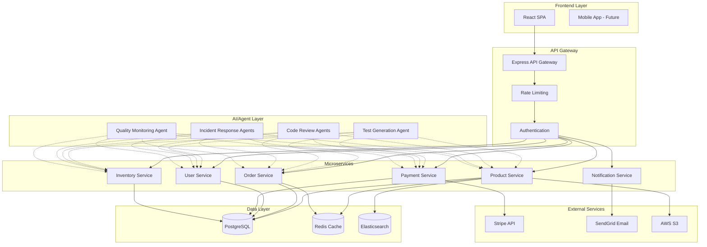

# Reference Implementation: E-Commerce Application

## Purpose
A complete e-commerce application that demonstrates **every concept** from the CodeQuality documentation, from requirements engineering through deployment, including AI-assisted QA and autonomous agentic workflows.

## Why E-Commerce?

E-commerce is ideal for demonstrating quality practices because it includes:
- **Complex business logic**: Product catalog, shopping cart, checkout, payments
- **Multiple user roles**: Customers, admins, warehouse staff
- **Integration points**: Payment gateways, inventory systems, shipping APIs
- **Quality attributes**: Performance (Black Friday loads), Security (PCI compliance), Accessibility (WCAG 2.1)
- **Real-world scenarios**: High availability requirements, data consistency, fraud detection

## Application Overview

### Product Name: **ShopSmart**

A modern e-commerce platform for electronics and gadgets with the following features:

**Core Features:**
- Product browsing and search
- Shopping cart and wishlist
- User authentication and profiles
- Order management
- Payment processing (Stripe integration)
- Inventory management
- Admin dashboard
- Email notifications
- Product reviews and ratings

**Advanced Features (to demonstrate advanced QA concepts):**
- Real-time inventory updates
- Recommendation engine
- Multi-currency support
- A/B testing framework
- Feature flags
- Performance monitoring
- Error tracking

---

## Architecture

### Technology Stack

```yaml
frontend:
  framework: React 18 with TypeScript
  state_management: Redux Toolkit
  routing: React Router v6
  ui_library: Material-UI (MUI)
  testing: React Testing Library, Playwright

backend:
  framework: Node.js with Express
  language: TypeScript
  database: PostgreSQL 15
  orm: Prisma
  cache: Redis
  testing: Jest, Supertest

infrastructure:
  containerization: Docker
  orchestration: Kubernetes
  ci_cd: GitHub Actions
  monitoring: Prometheus + Grafana
  logging: ELK Stack (Elasticsearch, Logstash, Kibana)
  tracing: Jaeger

ai_qa_tools:
  llm: OpenAI GPT-4o
  agent_framework: LangGraph
  vector_db: ChromaDB
  observability: LangSmith
```

### System Architecture



---

## Documentation Coverage Mapping

This table shows how each module from the CodeQuality documentation is applied in ShopSmart:

| Module | Application in ShopSmart |
|--------|--------------------------|
| **[00 - Foundations](../../docs/00-foundations/README.md)** | ISO 25010 quality model applied; IEEE 829 test docs for all features |
| **[01 - Requirements](../../docs/01-requirements/README.md)** | Complete requirements specification with traceability matrix |
| **[02 - Agile Planning](../../docs/02-agile-planning/README.md)** | User stories for all features, DoR/DoD templates, sprint planning |
| **[03 - Version Control](../../docs/03-version-control/README.md)** | Trunk-Based Development with feature flags, PR templates |
| **[04 - Testing Strategy](../../docs/04-testing-strategy/README.md)** | Shift-left and shift-right strategies, risk-based testing |
| **[05 - Test Levels](../../docs/05-test-levels/README.md)** | Unit (Jest), Integration (Supertest), E2E (Playwright), System tests |
| **[06 - Quality Attributes](../../docs/06-quality-attributes/README.md)** | Performance (k6), Security (OWASP), Accessibility (axe-core) |
| **[07 - Development Practices](../../docs/07-development-practices/README.md)** | Clean Code, SOLID, TDD/BDD practices throughout |
| **[08 - CI/CD Pipeline](../../docs/08-cicd-pipeline/README.md)** | Complete GitHub Actions pipeline with quality gates |
| **[09 - Metrics & Monitoring](../../docs/09-metrics-monitoring/README.md)** | DORA metrics tracking, Prometheus/Grafana dashboards |
| **[10 - Deployment](../../docs/10-deployment/README.md)** | Blue-green deployments, canary releases with Kubernetes |
| **[11 - Tools Ecosystem](../../docs/11-tools-ecosystem/README.md)** | Integrated toolchain: ESLint, Prettier, SonarQube, Snyk |
| **[12 - Governance](../../docs/12-governance/README.md)** | Quality gates at each stage, compliance checks (PCI DSS) |
| **[13 - Incident Management](../../docs/13-incident-management/README.md)** | Incident runbooks, postmortem templates, SLI/SLO definitions |
| **[14 - Continuous Improvement](../../docs/14-continuous-improvement/README.md)** | Retrospectives after each sprint, Kaizen approach |
| **[15 - AI in QA](../../docs/15-ai-in-quality-assurance/15-README.md)** | AI test generation, code review automation, defect prediction |
| **[16 - Agentic Workflows](../../docs/16-agentic-workflows/16-README.md)** | Autonomous agents for testing, code review, incident response |

---

## Implementation Phases

### Phase 1: Foundation (Weeks 1-2)
**Demonstrates:** Modules 00, 01, 02, 03

**Deliverables:**
1. **Requirements Documentation**
   - Product requirements document (PRD)
   - User personas
   - 50+ user stories with acceptance criteria
   - Traceability matrix

2. **Project Setup**
   - Repository structure with monorepo (Turborepo)
   - Git workflow (trunk-based development)
   - Branch protection rules
   - PR templates

3. **Development Environment**
   - Docker Compose for local development
   - Environment configuration
   - Database schema design
   - API contract definitions (OpenAPI 3.0)

**Example User Story:**
```markdown
# User Story: Add Product to Cart

**As a** customer
**I want to** add products to my shopping cart
**So that** I can purchase multiple items in a single checkout

## Acceptance Criteria
- [ ] User can click "Add to Cart" button on product page
- [ ] Cart icon shows updated item count immediately
- [ ] Selected quantity is added to cart (min: 1, max: available stock)
- [ ] If product already in cart, quantity is incremented
- [ ] User sees confirmation toast notification
- [ ] Cart total price updates automatically
- [ ] Works with JavaScript disabled (graceful degradation)

## Definition of Done
- [ ] Unit tests written (coverage > 80%)
- [ ] Integration tests with cart API
- [ ] E2E test with Playwright
- [ ] Accessibility audit passed (WCAG 2.1 AA)
- [ ] Code review approved
- [ ] Security review passed (no SQL injection, XSS)
- [ ] Performance test (< 200ms response time)
- [ ] Documentation updated
```

---

### Phase 2: Core Development (Weeks 3-6)
**Demonstrates:** Modules 04, 05, 06, 07

**Deliverables:**
1. **Product Service** (Week 3)
   - Product CRUD operations
   - Search and filtering
   - Category management
   - Image upload to S3
   - **Tests:** Unit (Jest), Integration (Supertest), E2E (Playwright)

2. **User Service** (Week 4)
   - User registration and authentication (JWT)
   - User profiles
   - Role-based access control (RBAC)
   - **Tests:** Unit, Integration, Security (OWASP checklist)

3. **Cart & Order Service** (Week 5)
   - Shopping cart management
   - Checkout flow
   - Order creation and tracking
   - **Tests:** Unit, Integration, E2E, Performance (k6)

4. **Payment Service** (Week 6)
   - Stripe integration
   - Payment processing
   - Refund handling
   - **Tests:** Unit, Integration, Contract (Pact with Stripe), Security

**Testing Strategy Example:**

```typescript
// Unit Test Example (Jest)
// services/cart/cart.service.test.ts

import { CartService } from './cart.service';
import { PrismaClient } from '@prisma/client';

describe('CartService', () => {
  let cartService: CartService;
  let prisma: PrismaClient;

  beforeEach(() => {
    prisma = new PrismaClient();
    cartService = new CartService(prisma);
  });

  describe('addItem', () => {
    it('should add new item to empty cart', async () => {
      const userId = 'user-123';
      const productId = 'prod-456';
      const quantity = 2;

      const cart = await cartService.addItem(userId, productId, quantity);

      expect(cart.items).toHaveLength(1);
      expect(cart.items[0].productId).toBe(productId);
      expect(cart.items[0].quantity).toBe(quantity);
    });

    it('should increment quantity if product already in cart', async () => {
      const userId = 'user-123';
      const productId = 'prod-456';

      await cartService.addItem(userId, productId, 2);
      const cart = await cartService.addItem(userId, productId, 3);

      expect(cart.items).toHaveLength(1);
      expect(cart.items[0].quantity).toBe(5);
    });

    it('should throw error if quantity exceeds stock', async () => {
      const userId = 'user-123';
      const productId = 'prod-456';
      const quantity = 1000; // Exceeds available stock

      await expect(
        cartService.addItem(userId, productId, quantity)
      ).rejects.toThrow('Insufficient stock');
    });

    it('should handle concurrent additions correctly', async () => {
      // Test for race conditions
      const userId = 'user-123';
      const productId = 'prod-456';

      await Promise.all([
        cartService.addItem(userId, productId, 1),
        cartService.addItem(userId, productId, 1),
        cartService.addItem(userId, productId, 1),
      ]);

      const cart = await cartService.getCart(userId);
      expect(cart.items[0].quantity).toBe(3);
    });
  });
});
```

```typescript
// E2E Test Example (Playwright)
// e2e/checkout-flow.spec.ts

import { test, expect } from '@playwright/test';

test.describe('Checkout Flow', () => {
  test('complete purchase journey', async ({ page }) => {
    // 1. Browse products
    await page.goto('/products');
    await expect(page.locator('h1')).toContainText('Products');

    // 2. Add product to cart
    await page.click('[data-testid="product-card-1"] button:has-text("Add to Cart")');
    await expect(page.locator('[data-testid="cart-count"]')).toHaveText('1');

    // 3. View cart
    await page.click('[data-testid="cart-icon"]');
    await expect(page.locator('[data-testid="cart-item"]')).toBeVisible();

    // 4. Proceed to checkout
    await page.click('button:has-text("Checkout")');

    // 5. Fill shipping information
    await page.fill('[name="firstName"]', 'John');
    await page.fill('[name="lastName"]', 'Doe');
    await page.fill('[name="email"]', 'john@example.com');
    await page.fill('[name="address"]', '123 Main St');
    await page.fill('[name="city"]', 'San Francisco');
    await page.selectOption('[name="state"]', 'CA');
    await page.fill('[name="zip"]', '94102');

    // 6. Enter payment details (test mode)
    const stripeFrame = page.frameLocator('[name^="__privateStripeFrame"]');
    await stripeFrame.locator('[name="cardnumber"]').fill('4242424242424242');
    await stripeFrame.locator('[name="exp-date"]').fill('12/25');
    await stripeFrame.locator('[name="cvc"]').fill('123');

    // 7. Complete purchase
    await page.click('button:has-text("Place Order")');

    // 8. Verify confirmation
    await expect(page.locator('h1')).toContainText('Order Confirmed');
    await expect(page.locator('[data-testid="order-number"]')).toBeVisible();

    // 9. Verify email sent (check email service mock)
    // 10. Verify inventory updated
  });

  test('handles payment failure gracefully', async ({ page }) => {
    // Use Stripe test card for declined payment
    // ... test error handling
  });

  test('is accessible throughout checkout flow', async ({ page }) => {
    await page.goto('/checkout');

    // Run axe accessibility audit
    const accessibilityScanResults = await page.evaluate(() => {
      return new Promise((resolve) => {
        // @ts-ignore
        axe.run().then(results => resolve(results));
      });
    });

    expect(accessibilityScanResults.violations).toHaveLength(0);
  });
});
```

---

### Phase 3: Quality Automation (Weeks 7-8)
**Demonstrates:** Modules 08, 09, 11

**Deliverables:**
1. **CI/CD Pipeline** (GitHub Actions)
   ```yaml
   # .github/workflows/ci.yml
   name: CI Pipeline

   on:
     pull_request:
       branches: [main, develop]
     push:
       branches: [main, develop]

   jobs:
     lint:
       runs-on: ubuntu-latest
       steps:
         - uses: actions/checkout@v4
         - uses: actions/setup-node@v4
           with:
             node-version: '20'
             cache: 'npm'
         - run: npm ci
         - run: npm run lint
         - run: npm run format:check

     unit-tests:
       runs-on: ubuntu-latest
       steps:
         - uses: actions/checkout@v4
         - uses: actions/setup-node@v4
         - run: npm ci
         - run: npm run test:unit -- --coverage
         - uses: codecov/codecov-action@v3

     integration-tests:
       runs-on: ubuntu-latest
       services:
         postgres:
           image: postgres:15
           env:
             POSTGRES_PASSWORD: test
           options: >-
             --health-cmd pg_isready
             --health-interval 10s
         redis:
           image: redis:7
           options: >-
             --health-cmd "redis-cli ping"
       steps:
         - uses: actions/checkout@v4
         - uses: actions/setup-node@v4
         - run: npm ci
         - run: npm run test:integration

     e2e-tests:
       runs-on: ubuntu-latest
       steps:
         - uses: actions/checkout@v4
         - uses: actions/setup-node@v4
         - run: npm ci
         - run: npx playwright install --with-deps
         - run: npm run test:e2e
         - uses: actions/upload-artifact@v3
           if: always()
           with:
             name: playwright-report
             path: playwright-report/

     security-scan:
       runs-on: ubuntu-latest
       steps:
         - uses: actions/checkout@v4
         - uses: snyk/actions/node@master
           env:
             SNYK_TOKEN: ${{ secrets.SNYK_TOKEN }}

     accessibility-audit:
       runs-on: ubuntu-latest
       steps:
         - uses: actions/checkout@v4
         - uses: actions/setup-node@v4
         - run: npm ci
         - run: npm run build
         - run: npm run test:a11y

     performance-test:
       runs-on: ubuntu-latest
       steps:
         - uses: actions/checkout@v4
         - uses: grafana/k6-action@v0.3.1
           with:
             filename: tests/performance/load-test.js

     sonarcloud:
       runs-on: ubuntu-latest
       steps:
         - uses: actions/checkout@v4
           with:
             fetch-depth: 0
         - uses: SonarSource/sonarcloud-github-action@master
           env:
             GITHUB_TOKEN: ${{ secrets.GITHUB_TOKEN }}
             SONAR_TOKEN: ${{ secrets.SONAR_TOKEN }}

     quality-gate:
       needs: [lint, unit-tests, integration-tests, e2e-tests, security-scan, accessibility-audit]
       runs-on: ubuntu-latest
       steps:
         - name: Check Quality Gate
           run: |
             # All previous jobs must pass
             echo "All quality checks passed!"
   ```

2. **Monitoring Setup**
   - Prometheus metrics collection
   - Grafana dashboards
   - Alert rules
   - DORA metrics tracking

3. **Performance Benchmarks**
   ```javascript
   // tests/performance/load-test.js (k6)
   import http from 'k6/http';
   import { check, sleep } from 'k6';
   import { Rate } from 'k6/metrics';

   const errorRate = new Rate('errors');

   export const options = {
     stages: [
       { duration: '30s', target: 10 },   // Ramp up to 10 users
       { duration: '1m', target: 50 },    // Stay at 50 users
       { duration: '30s', target: 100 },  // Peak at 100 users
       { duration: '1m', target: 0 },     // Ramp down
     ],
     thresholds: {
       http_req_duration: ['p(95)<500'],  // 95% of requests < 500ms
       http_req_failed: ['rate<0.01'],    // Error rate < 1%
       errors: ['rate<0.1'],
     },
   };

   export default function () {
     // Browse products
     let res = http.get('http://localhost:3000/api/products');
     check(res, {
       'products loaded': (r) => r.status === 200,
       'response time OK': (r) => r.timings.duration < 500,
     }) || errorRate.add(1);

     sleep(1);

     // Add to cart
     res = http.post('http://localhost:3000/api/cart/items', {
       productId: 'prod-123',
       quantity: 1,
     });
     check(res, {
       'added to cart': (r) => r.status === 201,
     }) || errorRate.add(1);

     sleep(2);
   }
   ```

---

### Phase 4: AI-Assisted QA (Weeks 9-10)
**Demonstrates:** Module 15

**Deliverables:**
1. **AI Test Generation**
   - Automated test generation for new features
   - Integration with CI/CD pipeline

2. **AI Code Review**
   - Automated PR reviews
   - Security vulnerability scanning
   - Performance suggestions

3. **Defect Prediction Model**
   - ML model trained on historical data
   - Risk scoring for code changes

**Example: AI Test Generator Integration**

```typescript
// scripts/generate-tests.ts
import { AITestGenerator } from './ai-test-generator';

async function main() {
  const generator = new AITestGenerator({
    model: 'gpt-4o',
    apiKey: process.env.OPENAI_API_KEY,
  });

  // Get recently modified files
  const changedFiles = execSync('git diff --name-only HEAD~1')
    .toString()
    .split('\n')
    .filter(f => f.endsWith('.ts') && !f.endsWith('.test.ts'));

  for (const file of changedFiles) {
    const code = fs.readFileSync(file, 'utf-8');

    // Generate tests
    const tests = await generator.generateTests(code, {
      framework: 'jest',
      coverage: 'comprehensive',
    });

    // Write test file
    const testFile = file.replace('.ts', '.test.ts');
    fs.writeFileSync(testFile, tests);

    console.log(`Generated tests for ${file}`);
  }
}

main();
```

---

### Phase 5: Agentic Workflows (Weeks 11-12)
**Demonstrates:** Module 16

**Deliverables:**
1. **Autonomous Test Suite Agent**
   - Monitors code changes
   - Generates missing tests automatically
   - Self-healing test maintenance

2. **Multi-Agent Code Review**
   - Security agent
   - Performance agent
   - Accessibility agent
   - Synthesis agent

3. **Self-Healing CI/CD Pipeline**
   - Detects and fixes common failures
   - Auto-retry with different strategies
   - Escalates complex issues

4. **Incident Response Agents**
   - Anomaly detection
   - Automatic log analysis
   - Self-remediation for common issues

**Example: Autonomous Test Suite Agent**

```python
# agents/test-suite-agent.py
from langgraph.graph import StateGraph
from langchain_openai import ChatOpenAI
from typing import TypedDict, List

class TestSuiteState(TypedDict):
    changed_files: List[str]
    coverage_gaps: List[dict]
    generated_tests: List[str]
    test_results: dict
    should_commit: bool

async def analyze_coverage(state: TestSuiteState) -> dict:
    """Analyze test coverage gaps."""
    # Run coverage analysis
    coverage_data = run_coverage_analysis()

    # Identify gaps
    gaps = identify_coverage_gaps(coverage_data, state['changed_files'])

    return {'coverage_gaps': gaps}

async def generate_tests(state: TestSuiteState) -> dict:
    """Generate tests for coverage gaps."""
    llm = ChatOpenAI(model='gpt-4o', temperature=0)

    generated_tests = []
    for gap in state['coverage_gaps']:
        prompt = f"""Generate Jest tests for:
        File: {gap['file']}
        Function: {gap['function']}
        Uncovered lines: {gap['lines']}

        Requirements:
        - Test happy path
        - Test edge cases
        - Test error conditions
        - Use descriptive test names
        """

        tests = await llm.ainvoke(prompt)
        generated_tests.append({
            'file': gap['test_file'],
            'content': tests.content
        })

    return {'generated_tests': generated_tests}

async def execute_tests(state: TestSuiteState) -> dict:
    """Execute generated tests."""
    # Write test files
    for test in state['generated_tests']:
        write_file(test['file'], test['content'])

    # Run tests
    results = run_tests()

    return {
        'test_results': results,
        'should_commit': results['passed'] == results['total']
    }

async def commit_tests(state: TestSuiteState) -> dict:
    """Commit passing tests."""
    if state['should_commit']:
        # Git add and commit
        git_add_files([t['file'] for t in state['generated_tests']])
        git_commit('feat: add automated tests for coverage gaps')
        git_push()

    return {}

# Build workflow
workflow = StateGraph(TestSuiteState)
workflow.add_node('analyze', analyze_coverage)
workflow.add_node('generate', generate_tests)
workflow.add_node('execute', execute_tests)
workflow.add_node('commit', commit_tests)

workflow.set_entry_point('analyze')
workflow.add_edge('analyze', 'generate')
workflow.add_edge('generate', 'execute')
workflow.add_conditional_edges(
    'execute',
    lambda s: 'commit' if s['should_commit'] else END,
)

agent = workflow.compile()
```

---

### Phase 6: Production Deployment (Weeks 13-14)
**Demonstrates:** Modules 10, 12, 13

**Deliverables:**
1. **Kubernetes Deployment**
   - Production-ready manifests
   - Blue-green deployment strategy
   - Canary releases with feature flags

2. **Incident Management**
   - Runbooks for common issues
   - PagerDuty integration
   - Postmortem templates

3. **Compliance & Governance**
   - PCI DSS compliance for payments
   - GDPR compliance for user data
   - Quality gate enforcement

**Example: Blue-Green Deployment**

```yaml
# k8s/deployment-blue.yaml
apiVersion: apps/v1
kind: Deployment
metadata:
  name: shopsmart-api-blue
  labels:
    app: shopsmart-api
    version: blue
spec:
  replicas: 3
  selector:
    matchLabels:
      app: shopsmart-api
      version: blue
  template:
    metadata:
      labels:
        app: shopsmart-api
        version: blue
    spec:
      containers:
      - name: api
        image: shopsmart/api:v1.2.0
        ports:
        - containerPort: 3000
        env:
        - name: NODE_ENV
          value: "production"
        - name: DATABASE_URL
          valueFrom:
            secretKeyRef:
              name: db-credentials
              key: url
        livenessProbe:
          httpGet:
            path: /health
            port: 3000
          initialDelaySeconds: 30
          periodSeconds: 10
        readinessProbe:
          httpGet:
            path: /ready
            port: 3000
          initialDelaySeconds: 10
          periodSeconds: 5
        resources:
          requests:
            memory: "256Mi"
            cpu: "250m"
          limits:
            memory: "512Mi"
            cpu: "500m"
---
apiVersion: v1
kind: Service
metadata:
  name: shopsmart-api
spec:
  selector:
    app: shopsmart-api
    version: blue  # Switch to 'green' to cutover
  ports:
  - protocol: TCP
    port: 80
    targetPort: 3000
  type: LoadBalancer
```

---

### Phase 7: Continuous Improvement (Weeks 15-16)
**Demonstrates:** Module 14

**Deliverables:**
1. **Metrics Dashboard**
   - DORA metrics visualization
   - Quality trends over time
   - Team velocity tracking

2. **Retrospective Framework**
   - Sprint retrospectives
   - Action item tracking
   - Improvement experiments

3. **Learning System**
   - Incident learning database
   - Best practices documentation
   - Knowledge sharing sessions

---

## Project Structure

```
shopsmart/
├── .github/
│   └── workflows/
│       ├── ci.yml
│       ├── cd.yml
│       └── ai-code-review.yml
│
├── apps/
│   ├── web/                    # React frontend
│   │   ├── src/
│   │   │   ├── components/
│   │   │   ├── pages/
│   │   │   ├── services/
│   │   │   └── tests/
│   │   ├── playwright.config.ts
│   │   └── package.json
│   │
│   └── api/                    # Express backend
│       ├── src/
│       │   ├── services/
│       │   │   ├── product/
│       │   │   ├── user/
│       │   │   ├── cart/
│       │   │   ├── order/
│       │   │   └── payment/
│       │   ├── middleware/
│       │   ├── routes/
│       │   └── tests/
│       └── package.json
│
├── packages/
│   ├── database/              # Prisma schema & migrations
│   ├── types/                 # Shared TypeScript types
│   └── utils/                 # Shared utilities
│
├── agents/                    # AI agents (Module 16)
│   ├── test-suite-agent/
│   ├── code-review-agents/
│   ├── incident-response-agents/
│   └── quality-monitor-agent/
│
├── infrastructure/
│   ├── docker/
│   │   ├── Dockerfile.web
│   │   ├── Dockerfile.api
│   │   └── docker-compose.yml
│   │
│   ├── k8s/
│   │   ├── deployments/
│   │   ├── services/
│   │   ├── ingress/
│   │   └── monitoring/
│   │
│   └── terraform/             # Infrastructure as Code
│
├── tests/
│   ├── unit/
│   ├── integration/
│   ├── e2e/
│   ├── performance/
│   ├── security/
│   └── accessibility/
│
├── docs/
│   ├── requirements/
│   │   ├── PRD.md
│   │   ├── user-stories/
│   │   └── traceability-matrix.md
│   │
│   ├── architecture/
│   │   ├── system-design.md
│   │   ├── api-contracts/
│   │   └── database-schema.md
│   │
│   ├── runbooks/
│   │   ├── incident-response.md
│   │   └── deployment.md
│   │
│   └── postmortems/
│
├── monitoring/
│   ├── prometheus/
│   ├── grafana/
│   └── alerts/
│
└── README.md
```

---

## Getting Started

### Prerequisites
```bash
# Required
node >= 20
docker >= 24
docker-compose >= 2.20
kubectl >= 1.28
python >= 3.10  # For AI agents

# Optional
k6  # Performance testing
```

### Setup Development Environment

```bash
# 1. Clone repository
git clone https://github.com/your-org/shopsmart.git
cd shopsmart

# 2. Install dependencies
npm install

# 3. Setup environment variables
cp .env.example .env
# Edit .env with your values

# 4. Start infrastructure
docker-compose up -d

# 5. Run database migrations
npm run db:migrate

# 6. Seed database with sample data
npm run db:seed

# 7. Start development servers
npm run dev

# Frontend: http://localhost:3000
# API: http://localhost:4000
# Grafana: http://localhost:3001
```

### Run Tests

```bash
# Unit tests
npm run test:unit

# Integration tests
npm run test:integration

# E2E tests
npm run test:e2e

# All tests with coverage
npm run test:all

# Performance tests
npm run test:performance

# Security scan
npm run test:security

# Accessibility audit
npm run test:a11y
```

---

## Learning Path

### For Students/Beginners
1. **Week 1-2:** Read requirements, understand user stories
2. **Week 3-4:** Implement one feature (e.g., product listing) with TDD
3. **Week 5-6:** Write comprehensive tests (unit, integration, E2E)
4. **Week 7-8:** Set up CI/CD pipeline for your feature
5. **Week 9-10:** Add AI-assisted test generation
6. **Week 11-12:** Implement one autonomous agent
7. **Week 13-14:** Deploy to Kubernetes
8. **Week 15-16:** Participate in retrospective, propose improvement

### For Experienced Developers
1. **Week 1:** Review architecture, set up environment
2. **Week 2-3:** Implement microservice with full test coverage
3. **Week 4-5:** Set up monitoring and observability
4. **Week 6-7:** Build multi-agent code review system
5. **Week 8-10:** Implement autonomous testing and CI/CD agents
6. **Week 11-12:** Production deployment with blue-green strategy
7. **Week 13-14:** Incident management and agent-based response
8. **Week 15-16:** Continuous improvement and optimization

---

## Key Features Demonstrating QA Concepts

### Feature: Product Search
**Demonstrates:**
- Unit testing (search algorithm)
- Integration testing (database queries)
- Performance testing (search under load)
- Accessibility testing (screen reader compatibility)
- E2E testing (user search journey)

### Feature: Shopping Cart
**Demonstrates:**
- State management testing
- Race condition testing (concurrent cart updates)
- Contract testing (cart API contract)
- Visual regression testing
- Mobile testing

### Feature: Checkout
**Demonstrates:**
- Integration testing (payment gateway)
- Security testing (PCI compliance)
- Error handling and recovery
- Transaction testing
- Chaos engineering

### Feature: Admin Dashboard
**Demonstrates:**
- Role-based access testing
- Data visualization testing
- Real-time updates testing
- Export functionality testing
- Audit logging

---

## Success Metrics

### Quality Metrics
- **Code Coverage:** > 80%
- **Test Success Rate:** > 95%
- **Bug Escape Rate:** < 5%
- **Code Review Turnaround:** < 24 hours
- **Accessibility Score:** 100 (Lighthouse)

### DORA Metrics
- **Deployment Frequency:** Multiple per day
- **Lead Time:** < 1 hour
- **MTTR:** < 30 minutes
- **Change Failure Rate:** < 10%

### Agent Effectiveness
- **Test Generation Accuracy:** > 85%
- **Code Review False Positives:** < 15%
- **Incident Auto-Resolution:** > 70%
- **Agent Cost per Month:** < $500

---

## Resources

### Documentation
- [Full Requirements](docs/requirements/PRD.md)
- [Architecture Guide](docs/architecture/system-design.md)
- [API Documentation](docs/api/README.md)
- [Deployment Guide](docs/deployment/README.md)

### Video Tutorials
- Setup & Installation (10 min)
- Building Your First Feature with TDD (30 min)
- Setting Up CI/CD Pipeline (20 min)
- Deploying AI Agents (45 min)

### Community
- [Discussions](https://github.com/your-org/shopsmart/discussions)
- [Issue Tracker](https://github.com/your-org/shopsmart/issues)
- Weekly Office Hours (Fridays 2-3 PM PST)

---

## Contributing

This is a learning project! Contributions are welcome:

1. Pick an issue labeled `good-first-issue`
2. Follow the contribution guide
3. Use the PR template
4. Ensure all tests pass
5. Get AI and human code review
6. Celebrate your contribution!

---

## License

MIT License - This is a reference implementation for educational purposes.

---

**Next Steps:**
1. ⭐ Star the repository
2. 📖 Read the [Project Overview](docs/overview.md)
3. 🚀 Follow the [Quick Start Guide](#getting-started)
4. 💬 Join our [Discord Community](https://discord.gg/shopsmart)
5. 📺 Watch the [Video Tutorial Series](https://youtube.com/shopsmart-tutorials)

---

*ShopSmart is a reference implementation demonstrating modern software quality practices from the [CodeQuality Documentation](https://github.com/your-org/CodeQuality). It serves as a practical, hands-on companion to the theoretical documentation.*
