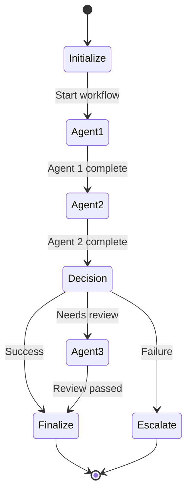

# Agent Workflow Template

Use this template when designing new agentic workflows for QA tasks.

---

## Workflow Name
**[Name of your agent workflow]**

## Purpose
**One-sentence description of what this workflow accomplishes**

Example: *Autonomous test generation agent that analyzes code changes and creates comprehensive test suites without human intervention.*

---

## Workflow Overview

### Problem Statement
**What manual process does this workflow automate?**

Example:
- **Current State:** QA engineers spend 2-3 hours writing tests for each new feature
- **Pain Points:** Time-consuming, coverage gaps, inconsistent quality
- **Manual Effort:** 120 hours/month across team

### Solution
**How does the agentic workflow solve this?**

Example:
- **Agent Workflow:** Autonomous agent analyzes code, identifies test scenarios, generates comprehensive tests
- **Benefits:** 80% time reduction, consistent coverage, 24/7 availability
- **Automation Level:** Level 4 (High Autonomy - Human oversight on failures)

---

## Agent Architecture

### Agent Type
Select one:
- [ ] Single Agent (one agent, multiple tools)
- [ ] Sequential Agents (agents run one after another)
- [ ] Parallel Agents (agents run simultaneously)
- [ ] Hierarchical (supervisor + worker agents)
- [ ] Collaborative (peer-to-peer agent communication)

### Agents Involved

For each agent, document:

#### Agent 1: [Agent Name]

**Role:** [What this agent is responsible for]

**Inputs:**
- Input 1: [Description and format]
- Input 2: [Description and format]

**Outputs:**
- Output 1: [Description and format]
- Output 2: [Description and format]

**Tools Available:**
- Tool 1: [Tool name and what it does]
- Tool 2: [Tool name and what it does]

**Reasoning Pattern:**
- [ ] ReAct (Reason + Act)
- [ ] Plan-and-Execute
- [ ] ReWOO (Reasoning Without Observation)
- [ ] Reflection

**LLM Model:** [e.g., GPT-4o, GPT-4o-mini, Claude-3.5-Sonnet]

**Estimated Cost per Run:** $[X.XX]

---

## Workflow State Machine

### State Schema

```python
from typing import TypedDict, List, Optional
from datetime import datetime

class WorkflowState(TypedDict):
    """State for [workflow name]."""

    # Inputs
    input_field_1: str
    input_field_2: Optional[str]

    # Intermediate results
    agent_1_result: Optional[dict]
    agent_2_result: Optional[dict]

    # Final outputs
    final_output: Optional[dict]

    # Metadata
    workflow_id: str
    started_at: datetime
    completed_at: Optional[datetime]
    status: str  # 'pending', 'running', 'completed', 'failed'
```

### State Transitions



### Node Definitions

```python
async def agent_1_node(state: WorkflowState) -> dict:
    """
    [Description of what this node does]

    Returns:
        Updates to state
    """
    # Implementation
    pass

async def agent_2_node(state: WorkflowState) -> dict:
    """
    [Description of what this node does]

    Returns:
        Updates to state
    """
    # Implementation
    pass

def decision_node(state: WorkflowState) -> str:
    """
    [Description of routing logic]

    Returns:
        Next node name: 'finalize', 'escalate', or 'agent_3'
    """
    # Routing logic
    pass
```

---

## Implementation Details

### 1. Dependencies

```txt
# requirements.txt
langgraph>=0.2.0
langchain>=0.1.0
langchain-openai>=0.1.0
pydantic>=2.0.0
# ... other dependencies
```

### 2. Configuration

```python
# config.py
from pydantic_settings import BaseSettings

class Config(BaseSettings):
    # LLM Configuration
    openai_api_key: str
    openai_model: str = "gpt-4o"
    openai_temperature: float = 0.0

    # Agent Configuration
    max_iterations: int = 10
    timeout_seconds: int = 300

    # Cost Controls
    max_cost_per_run: float = 5.00
    daily_budget_limit: float = 100.00

    # Safety
    require_human_approval: bool = False
    dangerous_operations_blocked: List[str] = []

    class Config:
        env_file = ".env"
```

### 3. Tools Definition

```python
from langchain_core.tools import tool

@tool
def tool_name(param1: str, param2: int) -> str:
    """
    [Tool description]

    Args:
        param1: [Description]
        param2: [Description]

    Returns:
        [Return value description]
    """
    # Implementation
    pass
```

### 4. Main Workflow

```python
from langgraph.graph import StateGraph, END

def create_workflow() -> StateGraph:
    """Build the agent workflow graph."""

    workflow = StateGraph(WorkflowState)

    # Add nodes
    workflow.add_node("agent_1", agent_1_node)
    workflow.add_node("agent_2", agent_2_node)
    workflow.add_node("agent_3", agent_3_node)
    workflow.add_node("finalize", finalize_node)
    workflow.add_node("escalate", escalate_node)

    # Set entry point
    workflow.set_entry_point("agent_1")

    # Add edges
    workflow.add_edge("agent_1", "agent_2")
    workflow.add_conditional_edges(
        "agent_2",
        decision_node,
        {
            "finalize": "finalize",
            "escalate": "escalate",
            "agent_3": "agent_3"
        }
    )
    workflow.add_edge("agent_3", "finalize")
    workflow.add_edge("finalize", END)
    workflow.add_edge("escalate", END)

    return workflow.compile()
```

---

## Safety & Guardrails

### Human-in-the-Loop Triggers

When should humans be notified for approval?

- [ ] All runs (Level 2 autonomy)
- [ ] High-risk operations only (Level 3)
- [ ] Failures only (Level 4)
- [ ] Monitoring only, no approval needed (Level 5)

### Specific Approval Triggers

```python
def requires_approval(state: WorkflowState) -> bool:
    """Determine if human approval is required."""

    # Example conditions
    if state.get('confidence_score', 1.0) < 0.7:
        return True  # Low confidence

    if state.get('estimated_cost', 0) > 1.00:
        return True  # High cost

    if 'production' in state.get('environment', ''):
        return True  # Production environment

    return False
```

### Safety Constraints

```python
SAFETY_CONSTRAINTS = {
    # Operations that are never allowed
    'forbidden_operations': [
        'delete_production_database',
        'disable_security_features',
        'modify_payment_logic'
    ],

    # Maximum values
    'max_iterations': 20,
    'max_cost_per_run': 5.00,
    'timeout_seconds': 600,

    # Rate limits
    'max_runs_per_hour': 100,
    'max_llm_calls_per_run': 50
}
```

---

## Cost Estimation

### Cost Breakdown

| Component | Cost per Run | Frequency | Monthly Cost |
|-----------|-------------|-----------|--------------|
| LLM API Calls (GPT-4o) | $[X.XX] | [N] times/month | $[XX.XX] |
| Vector DB Operations | $[X.XX] | [N] times/month | $[XX.XX] |
| Infrastructure (Docker) | - | - | $[XX.XX] |
| **Total** | **$[X.XX]** | - | **$[XXX.XX]** |

### ROI Calculation

**Manual Process:**
- Time per instance: [X] hours
- Frequency: [N] times per month
- Developer cost: $100/hour
- **Monthly cost:** [X hours] × [N times] × $100 = $[X,XXX]

**Automated Process:**
- Time per instance: [X] minutes
- Monthly API cost: $[XXX]
- **Monthly cost:** $[XXX]

**Savings:** $[X,XXX] - $[XXX] = $[X,XXX] per month
**ROI:** [X,XXX%]

---

## Success Metrics

### Performance Metrics

```yaml
execution_metrics:
  avg_duration_seconds:
    target: "< 120"
    current: null

  success_rate:
    target: "> 85%"
    current: null

  cost_per_run:
    target: "< $2.00"
    current: null

quality_metrics:
  accuracy:
    target: "> 90%"
    current: null

  false_positive_rate:
    target: "< 10%"
    current: null

  human_intervention_rate:
    target: "< 15%"
    current: null
```

### Business Impact Metrics

```yaml
business_metrics:
  time_saved_hours_per_month:
    target: "> 100"
    current: null

  error_reduction:
    target: "> 50%"
    current: null

  team_satisfaction:
    target: "> 4.0/5"
    current: null
```

---

## Monitoring & Observability

### Logging

```python
import logging
import structlog

logger = structlog.get_logger()

# Log every workflow run
logger.info(
    "workflow_started",
    workflow_id=workflow_id,
    workflow_name="[name]",
    input_summary=summarize_input(state)
)

logger.info(
    "workflow_completed",
    workflow_id=workflow_id,
    duration_seconds=duration,
    cost_dollars=total_cost,
    success=True
)
```

### Metrics (Prometheus)

```python
from prometheus_client import Counter, Histogram, Gauge

# Metrics
workflow_runs_total = Counter(
    'agent_workflow_runs_total',
    'Total workflow runs',
    ['workflow_name', 'status']
)

workflow_duration_seconds = Histogram(
    'agent_workflow_duration_seconds',
    'Workflow execution duration',
    ['workflow_name']
)

workflow_cost_dollars = Histogram(
    'agent_workflow_cost_dollars',
    'Cost per workflow run',
    ['workflow_name']
)

# Usage
workflow_runs_total.labels(workflow_name="[name]", status="success").inc()
workflow_duration_seconds.labels(workflow_name="[name]").observe(duration)
```

### Tracing (LangSmith)

```python
from langsmith import traceable

@traceable(name="[Workflow Name]", run_type="chain")
async def run_workflow(state: WorkflowState):
    """Traced workflow execution."""
    # Implementation
    pass
```

---

## Testing

### Unit Tests

```python
import pytest
from workflow import agent_1_node, WorkflowState

@pytest.mark.asyncio
async def test_agent_1_node():
    """Test agent 1 node in isolation."""

    # Arrange
    state = WorkflowState(
        input_field_1="test input",
        workflow_id="test-123",
        status="pending"
    )

    # Act
    result = await agent_1_node(state)

    # Assert
    assert result['agent_1_result'] is not None
    assert result['status'] == 'running'
```

### Integration Tests

```python
@pytest.mark.asyncio
@pytest.mark.integration
async def test_full_workflow():
    """Test complete workflow end-to-end."""

    workflow = create_workflow()

    initial_state = WorkflowState(
        input_field_1="integration test",
        workflow_id="integration-test-1",
        status="pending"
    )

    # Run workflow
    result = await workflow.ainvoke(initial_state)

    # Verify final state
    assert result['status'] == 'completed'
    assert result['final_output'] is not None
```

---

## Deployment

### Docker

```dockerfile
# Dockerfile
FROM python:3.11-slim

WORKDIR /app

COPY requirements.txt .
RUN pip install --no-cache-dir -r requirements.txt

COPY . .

CMD ["python", "main.py"]
```

### Docker Compose

```yaml
# docker-compose.yml
version: '3.8'

services:
  agent-workflow:
    build: .
    environment:
      - OPENAI_API_KEY=${OPENAI_API_KEY}
    volumes:
      - ./data:/app/data
    restart: unless-stopped
```

### Kubernetes

```yaml
# k8s/deployment.yaml
apiVersion: apps/v1
kind: Deployment
metadata:
  name: agent-workflow
spec:
  replicas: 1
  selector:
    matchLabels:
      app: agent-workflow
  template:
    metadata:
      labels:
        app: agent-workflow
    spec:
      containers:
      - name: agent
        image: your-registry/agent-workflow:latest
        env:
        - name: OPENAI_API_KEY
          valueFrom:
            secretKeyRef:
              name: openai-secret
              key: api-key
        resources:
          limits:
            cpu: "1"
            memory: "2Gi"
          requests:
            cpu: "500m"
            memory: "1Gi"
```

---

## Troubleshooting

### Common Issues

#### Issue: [Describe common issue]

**Symptoms:**
- [Symptom 1]
- [Symptom 2]

**Diagnosis:**
```bash
# Commands to diagnose
```

**Solution:**
```python
# Code fix or configuration change
```

---

## Maintenance

### Regular Tasks

- [ ] Weekly: Review false positives and update prompts
- [ ] Weekly: Check cost vs. budget
- [ ] Monthly: Analyze performance metrics
- [ ] Monthly: Collect user feedback
- [ ] Quarterly: Review and update agent prompts
- [ ] Quarterly: Evaluate new LLM models

### Prompt Tuning

Document prompt iterations:

**Version 1.0 (Initial):**
```
[Original prompt]
```
**Issues:** High false positive rate (25%)

**Version 1.1 (Improved):**
```
[Updated prompt with more specific instructions]
```
**Results:** False positive rate reduced to 12%

---

## Changelog

### Version 1.0.0 - [Date]
- Initial implementation
- Basic agent workflow with [X] agents
- [Key features]

### Version 1.1.0 - [Date]
- Added human-in-the-loop approval
- Improved error handling
- Cost optimization

---

## Related Documentation

- [Agentic Fundamentals](../docs/16-agentic-workflows/agentic-fundamentals.md)
- [Multi-Agent Systems](../docs/16-agentic-workflows/multi-agent-systems.md)
- [Building QA Agent Workflows](../docs/16-agentic-workflows/building-qa-agent-workflows.md)

---

## Contributors

- [Your Name] - Initial design
- [Team Member] - Implementation
- [Team Member] - Testing

---

*This template provides a complete blueprint for designing, implementing, deploying, and maintaining agentic workflows. Adapt sections as needed for your specific use case.*
